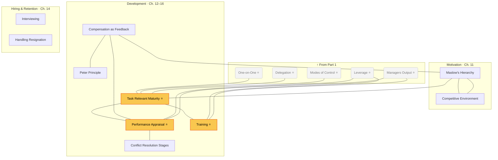

# Concept Map — People (Ch. 10–16)

```mermaid
graph TD
    classDef starred fill:#f9c74f,stroke:#f3722c,stroke-width:2px,color:#000
    classDef bridge fill:#f4f4f4,stroke:#bbb,color:#777

    subgraph P1["↑ From Part 1"]
        Lev("Leverage ⭐")
        MgrOut("Managers Output ⭐")
        Ono("One-on-One ⭐")
        Deleg("Delegation ⭐")
        ModCon("Modes of Control ⭐")
    end

    subgraph MOT["Motivation · Ch. 11"]
        Maslow["Maslow's Hierarchy"]
        CompEnv["Competitive Environment"]
    end

    subgraph DEV["Development · Ch. 12–16"]
        TRM["Task Relevant Maturity ⭐"]
        PerfApp["Performance Appraisal ⭐"]
        ConflRes["Conflict Resolution Stages"]
        CompFb["Compensation as Feedback"]
        PeterP["Peter Principle"]
        Train["Training ⭐"]
    end

    subgraph HIRE["Hiring & Retention · Ch. 14"]
        Interv["Interviewing"]
        HandRes["Handling Resignation"]
    end

    %% Within Motivation
    Maslow --- CompEnv

    %% Within Development
    TRM --- PerfApp
    TRM --- Train
    PerfApp --- ConflRes
    CompFb --- PeterP
    CompFb --- PerfApp
    CompFb --- Maslow

    %% Motivation → Development
    Maslow --- TRM
    Maslow --- CompEnv

    %% From Part 1 into this map
    Lev --- PerfApp
    Lev --- Train
    MgrOut --- Train
    MgrOut --- PerfApp
    Ono --- TRM
    Deleg --- TRM
    ModCon --- TRM

    class TRM,PerfApp,Train starred
    class Lev,MgrOut,Ono,Deleg,ModCon bridge
    class Lev,MgrOut,Ono,Deleg,ModCon,Maslow,CompEnv,TRM,PerfApp,ConflRes,CompFb,PeterP,Train,Interv,HandRes internal-link
```
