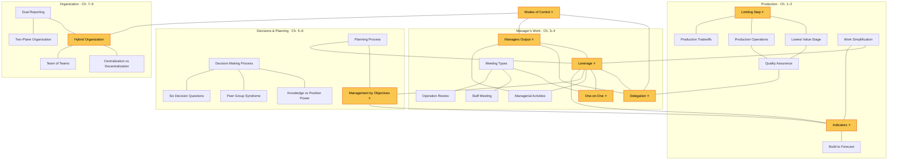

# Concept Map — Structure (Ch. 1–9)

```mermaid
graph TD
    classDef starred fill:#f9c74f,stroke:#f3722c,stroke-width:2px,color:#000

    subgraph PROD["Production · Ch. 1–2"]
        ProdOps["Production Operations"]
        LimStep["Limiting Step ⭐"]
        LowVal["Lowest Value Stage"]
        BuildFc["Build to Forecast"]
        ProdTr["Production Tradeoffs"]
        QA["Quality Assurance"]
        WorkSim["Work Simplification"]
        Indic["Indicators ⭐"]
    end

    subgraph MGR["Manager's Work · Ch. 3–4"]
        MgrOut["Managers Output ⭐"]
        Lev["Leverage ⭐"]
        MgrAct["Managerial Activities"]
        Deleg["Delegation ⭐"]
        MeetT["Meeting Types"]
        Ono["One-on-One ⭐"]
        Staff["Staff Meeting"]
        OpRev["Operation Review"]
    end

    subgraph DEC["Decisions & Planning · Ch. 5–6"]
        DecMak["Decision Making Process"]
        KnowPos["Knowledge vs Position Power"]
        PeerSyn["Peer Group Syndrome"]
        SixQ["Six Decision Questions"]
        PlanP["Planning Process"]
        MBO["Management by Objectives ⭐"]
    end

    subgraph ORG["Organization · Ch. 7–9"]
        CentDec["Centralization vs Decentralization"]
        TeamT["Team of Teams"]
        HybOrg["Hybrid Organization"]
        DualRep["Dual Reporting"]
        TwoPl["Two-Plane Organization"]
    end

    ModCon["Modes of Control ⭐"]

    %% Within Production
    LimStep --- LowVal
    LimStep --- ProdOps
    LimStep --- ProdTr
    LowVal --- QA
    ProdOps --- QA
    Indic --- BuildFc
    Indic --- WorkSim

    %% Within Manager's Work
    MgrOut --- Lev
    MgrOut --- Deleg
    MgrOut --- MgrAct
    Lev --- Deleg
    Lev --- Ono
    Lev --- MgrAct
    MeetT --- Ono
    MeetT --- Staff
    MeetT --- OpRev

    %% Within Decisions & Planning
    DecMak --- KnowPos
    DecMak --- PeerSyn
    DecMak --- SixQ
    PlanP --- MBO

    %% Within Organization
    HybOrg --- CentDec
    HybOrg --- TeamT
    DualRep --- HybOrg
    DualRep --- TwoPl

    %% Cross-group
    Indic --- Lev
    WorkSim --- Lev
    QA --- Deleg
    Lev --- MBO
    MBO --- Indic
    PlanP --- Lev
    ModCon --- Deleg
    ModCon --- HybOrg
    ModCon --- MgrOut

    class HybOrg,LimStep,Indic,MBO,Lev,MgrOut,Deleg,Ono,ModCon starred
    class ProdOps,LimStep,LowVal,BuildFc,ProdTr,QA,WorkSim,Indic,MgrOut,Lev,MgrAct,Deleg,MeetT,Ono,Staff,OpRev,DecMak,KnowPos,PeerSyn,SixQ,PlanP,MBO,CentDec,TeamT,HybOrg,DualRep,TwoPl,ModCon internal-link
```
