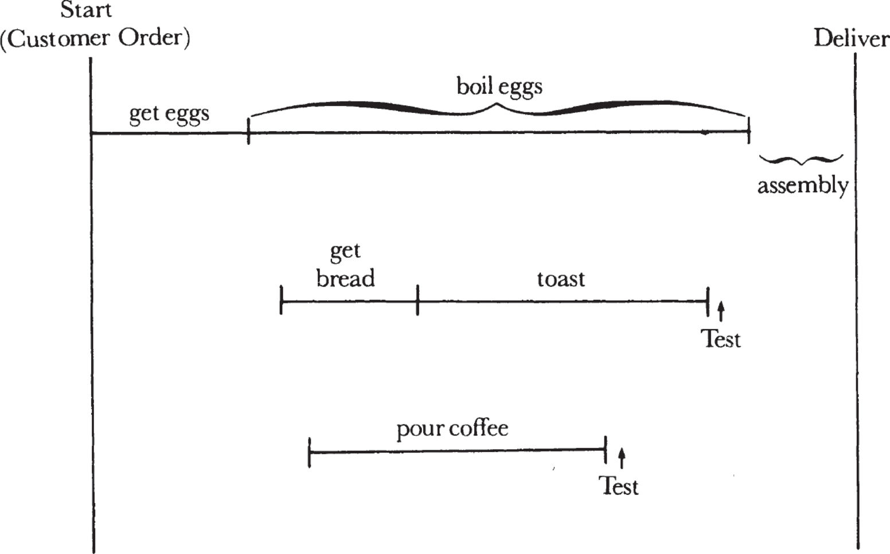
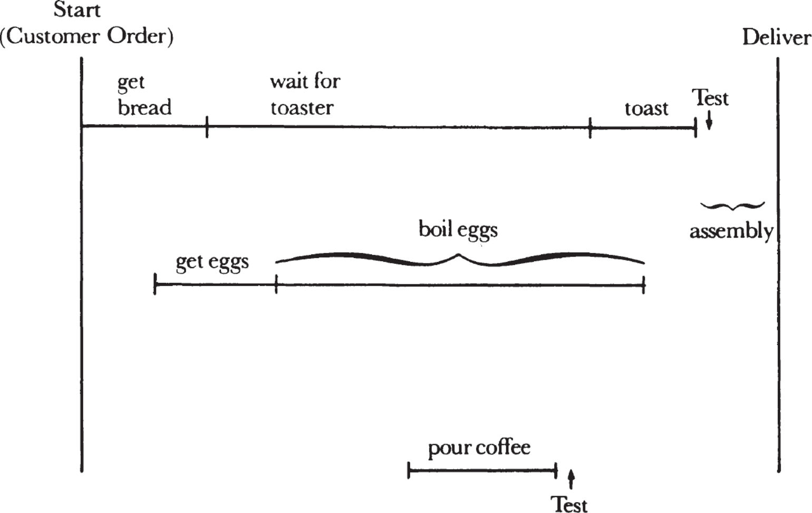
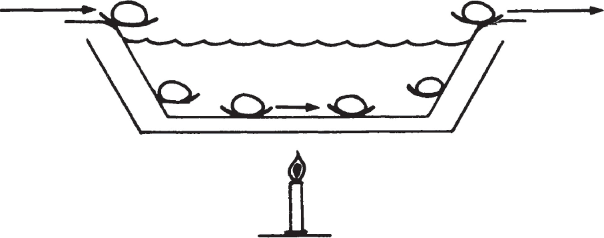

# **1**

# The Basics of Production: Delivering a Breakfast

(or a College Graduate, or a Compiler, or a Convicted Criminal…)

_The Three-Minute Egg_

To understand the principles of production, imagine that you’re a waiter, which I was while I went to college, and that your task is to serve a breakfast consisting of a three-minute soft-boiled egg, buttered toast, and coffee. Your job is to prepare and deliver the three items simultaneously, each of them fresh and hot.

The task here encompasses the basic requirements of production. These are to build and deliver products in response to the demands of the customer at a _scheduled_ delivery time, at an _acceptable_ quality level, and at the _lowest_ possible cost. Production’s charter cannot be to deliver whatever the customer wants whenever he wants it, for this would require an infinite production capacity or the equivalent—very large, ready-to-deliver inventories. In our example, the customer may want to have a perfect three-minute egg with hot buttered toast and steaming coffee waiting for him the moment he sits down. To fulfill such an expectation, you would either have to have your kitchen idle and poised to serve the customer whenever he drops in, or have a ready-to-consume inventory of perfectly boiled eggs, hot buttered toast, and coffee. Neither is practical.

Instead, a manufacturer should accept the responsibility of delivering a product at the time committed to—in this case, by implication, about five to ten minutes after the customer arrives at our breakfast establishment. And we must make our breakfast at a cost that enables us to sell it at a competitive price and still make an acceptable profit. How are we going to do this in the most intelligent way? We start by looking at our production flow.

The first thing we must do is to pin down the step in the flow that will determine the overall shape of our operation, which we’ll call the _limiting step._ The issue here is simple: which of the breakfast components takes the longest to prepare? Because the coffee is already steaming in the kitchen and the toast takes only about a minute, the answer is obviously the egg, so we should plan the entire job around the time needed to boil it. Not only does that component take the longest to prepare, the egg is also for most customers the most important feature of the breakfast.

What must happen is illustrated opposite. To work back from the time of delivery, you’ll need to calculate the time required to prepare the three components to ensure that they are all ready simultaneously. First you must allow time to assemble the items on a tray. Next you must get the toast from the toaster and the coffee from the pot, as well as the egg out of the boiling water. Adding the required time to do this to the time needed to get and cook the egg defines the length of the entire process—called, in production jargon, the total throughput time.

Now you come to the toast. Using the egg time as your base, you must allow yourself time to get and toast the slices of bread. Finally, using the toast time as your base, you can determine when you need to pour the coffee. The key idea is that we construct our production flow by starting with the longest (or most difficult, or most sensitive, or most expensive) step and work our way back. Notice when each of the three steps began and ended. We planned our flow around the most critical step—the time required to boil the egg—and we staggered each of the other steps according to individual throughput times; again in production jargon, we _offset_ them from each other.

_Making the eggs is the limiting step._

The idea of a limiting step has very broad applicability. Take, for example, the need to recruit college graduates to work for Intel. Certain of our managers visit the colleges, interview some of the seniors, and invite the more promising candidates to visit the company. We bear the expense of the candidates’ trip, which can be considerable. During the trip, the students are closely interviewed by other managers and technical people. After due consideration, employment is offered to some of the students whose skills and capabilities match our needs best, and those who accept the offers eventually come to work for the company.

To apply the basic principle of production, you need to build the sequence here around its most expensive feature, which is the students’ trip to the plant, thanks to the cost of travel and the time that Intel managers spend with the candidates. To minimize the use of this step per final college hire, we obviously have to increase the ratio of accepted offers to applicants invited to visit the plant, which we do by using phone interviews to screen people before issuing invitations. The technique saves money, substantially increases the ratio of offers extended per plant visit, and reduces the need to use the expensive limiting step per hire.

The principle of time offsets is also present here. Working back from the time the students will graduate, the recruiter staggers the various steps involved to allow time for everything—on-campus interviews, phone screening, plant visits—to take place at the appropriate times during the months preceding graduation.

_Production Operations_

Other production principles underlie the preparation of our breakfast. In the making of it, we find present the three fundamental types of production operations: _process_ manufacturing, an activity that physically or chemically changes material just as boiling changes an egg; _assembly,_ in which components are put together to constitute a new entity just as the egg, the toast, and the coffee together make a breakfast; and _test,_ which subjects the components or the total to an examination of its characteristics. There are, for example, visual tests made at points in the breakfast production process: you can see that the coffee is steaming and that the toast is brown.

Process, assembly, and test operations can be readily applied to other very different kinds of productive work. Take, for instance, the task of training a sales force to sell a new product. The three types of production operations can be easily identified. The conversion of large amounts of raw data about the product into meaningful selling strategies comprehensible to the sales personnel is a process step, which transforms data into strategies. The combination of the various sales strategies into a coherent program can be compared to an assembly step. Here the appropriate product-selling strategies and pertinent market data (such as competitive pricing and availability) are made to flow into one presentation, along with such things as brochures, handouts, and flip charts. The test operation comes in the form of a “dry run” presentation with a selected group of field sales personnel and field sales management. If the dry run fails the test, the material must be “reworked” (another well-established manufacturing concept) to meet the concerns and objections of the test audience.

The development of a “compiler,” a major piece of computer software, also demonstrates process, assembly, and test. A computer understands and uses human instruction only if it receives such instruction in its own language. A compiler is an interpreter, enabling the computer to translate into its language material written in terms and phrases resembling English. With a compiler, a programmer can think more or less like a human being rather than having to adapt himself to the way the computer processes information. The task of getting a machine to interpret and translate in this fashion is obviously formidable; thus the development of a compiler takes strenuous effort on the part of skilled and gifted software engineers. The effort, however, is justified by the simplification it brings to computer use.

In any case, the development of the individual pieces out of which a compiler is built represents a series of processing steps. Actual working pieces of software are generated out of specifications and basic design know-how. Each piece then undergoes an individual operation called a “unit test.” When one fails, the defective portion of the software is returned to the process phase for “rework.” After all the pieces pass their respective unit tests, they are assembled to form the compiler. Then, of course, a “system test” is performed on the complete product before it is shipped to the customer. Time offsets are used extensively in the task. Because throughput times for the various engineering steps are well established, the timing of the releases of various bodies of software from one stage to another can all be calculated and staged in advance.

Breakfast preparation, college recruiting, sales training, and compiler design are very much unlike one another, but all of them possess a basically similar flow of activity to produce a specific output.

_A Few Complications_

Real life, as you know, is full of thickets and underbrush. In a schematic flow chart, our breakfast operation assumed infinite capacity, meaning that nobody had to wait for an available toaster or for a pot to boil an egg in. But no such ideal world exists. What would happen if you had to stand in a line of waiters, waiting for your turn to use the toaster? If you didn’t adjust your production flow to account for the queue, your three-minute egg could easily become a six-minute egg. So limited toaster capacity means you have to redo your flow around the new limiting step. The egg still determines the overall quality of the breakfast, but your time offsets must be altered.

How would our model reflect the change in manufacturing flow? Working back from the time of breakfast delivery, let’s see how the production is affected, as illustrated opposite. The egg cycle remains the same, as does the one for coffee. But limited toaster capacity makes for quite a difference. Now you must account for the delivery time of the toast and the wait for a free toaster. This means the whole production process has to be conceived differently. Toaster capacity has become the limiting step, and what you do has to be reworked around it.

_With limited toaster capacity, making the toast becomes the limiting step._

Now let’s complicate things a little further. What happens if you are stuck in line waiting for a toaster when it’s time to start boiling your egg? Your conflict is seemingly irreconcilable, but it really isn’t. If you were managing the restaurant, you could turn your personnel into _specialists_ by hiring one egg-cooker, one toast-maker, one coffee-pourer, and one person to supervise the operation. But that, of course, creates an immense amount of _overhead,_ probably making it too expensive to consider.

If you were a waiter, you could ask the waiter in line next to you to help out—to put your toast in while you ran off to start your egg. But when you have to depend on someone else, the results are likely to be less predictable. As the manager, you could add another toaster, but this becomes an expensive addition of _capital equipment._ You could run the toaster continuously and build up an _inventory_ of hot toast, throwing away what you can’t use but always having immediate access to product. That means waste, which can also become too expensive for the operation. But at least you know that alternatives do exist: equipment capacity, manpower, and inventory can be traded off against each other and then balanced against delivery time.

Because each alternative costs money, your task is to find the _most cost-effective_ way to deploy your resources—the key to optimizing all types of productive work. Bear in mind that in this and in other such situations there is a right answer, the one that can give you the best delivery time and product quality at the lowest possible cost. To find that right answer, you must develop a clear understanding of the trade-offs between the various factors—manpower, capacity, and inventory—and you must reduce the understanding to a quantifiable set of relationships. You probably won’t use a stopwatch to conduct a time-and-motion study of the person behind a toaster; nor will you calculate the precise trade-off between the cost of toast inventory and the added toaster capacity in mathematical terms. What is important is the thinking you force yourself to go through to understand the relationship between the various aspects of your production process.

Let’s take our manufacturing example a step further and turn our business into a high-volume breakfast factory operation. First, you buy a _continuous egg-boiler_ that will produce a constant supply of perfectly boiled three-minute eggs. It will look something like what’s drawn in the figure opposite. Note that our business now assumes a high and predictable demand for three-minute eggs; it cannot now readily provide a four-minute egg, because automated equipment is not very flexible. Second, you match the output of the continuous egg-boiler with the output of a continuous toaster, as specialized personnel load each piece of equipment and deliver the product. We have now turned things into a _continuous operation_ at the expense of flexibility, and we can no longer prepare each customer’s order exactly when and how he requests it. So our customers have to adjust their expectations if they want to enjoy the benefits of our new mode: lower cost and more predictable product quality.

_The continuous egg-boiler: a constant supply of three-minute eggs._

But continuous operation does not automatically mean lower cost and better quality. What would happen if the water temperature in the continuous egg-boiler quietly went out of specification? The entire work-in-process—all the eggs in the boiler—and the output of the machine from the time the temperature climbed or dropped to the time the malfunction was discovered becomes unusable. All the toast is also wasted because you don’t have any eggs to serve with it. How do you minimize the risk of a breakdown of this sort? Performing a _functional test_ is one way. From time to time you open an egg as it comes out of the machine and check its quality. But you will have to throw away the egg tested. A second way involves _in-process inspection,_ which can take many forms. You could, for example, simply insert a thermometer into the water so that the temperature could be easily and frequently checked. To avoid having to pay someone to read the thermometer, you could connect an electronic gadget to it that would set off bells anytime the temperature varied by a degree or two. The point is that whenever possible, you should choose in-process tests over those that destroy product.

What else could go wrong with our continuous egg-machine? The eggs going into it could be cracked or rotten, or they could be over- or undersized, which would affect how fast they cook. To avoid such problems, you will want to look at the eggs at the time of receipt, something called _incoming_ or _receiving inspection._ If the eggs are unacceptable in some way, you are going to have to send them back, leaving you with none. Now you have to shut down. To avoid that, you need a _raw material inventory._ But how large should it be? The principle to be applied here is that you should have enough to cover your consumption rate for the length of time it takes to replace your raw material. That means if your egg man comes by and delivers once a day, you want to keep a day’s worth of inventory on hand to protect yourself. But remember, inventory costs money, so you have to weigh the advantage of carrying a day’s supply against the cost of carrying it. Besides the cost of the raw material and the cost of money, you should also try to gauge the _opportunity at risk:_ what would it cost if you had to shut your egg machine down for a day? How many customers would you lose? How much would it cost to lure them back? Such questions define the opportunity at risk.

_Adding Value_

All production flows have a basic characteristic: the material becomes more valuable as it moves through the process. A boiled egg is more valuable than a raw one, a fully assembled breakfast is more valuable than its constituent parts, and finally, the breakfast placed in front of the customer is more valuable still. The last carries the perceived value the customer associates with the establishment when he drives into the parking lot after seeing the sign “Andy’s Better Breakfasts.” Similarly, a finished compiler is more valuable than the constituent parts of semantic analysis, code generation, and run time, and a college graduate to whom we are ready to extend an employment offer is more valuable to us than the college student we meet on campus for the first time.

A common rule we should always try to heed is to detect and fix any problem in a production process at the _lowest-value_ stage possible. Thus, we should find and reject the rotten egg as it’s being delivered from our supplier rather than permitting the customer to find it. Likewise, if we can decide that we don’t want a college candidate at the time of the campus interview rather than during the course of a plant visit, we save the cost of the trip and the time of both the candidate and the interviewers. And we should also try to find any performance problem at the time of the unit test of the pieces that make up a compiler rather than in the course of the test of the final product itself.

Finally, at the risk of being considered hard-hearted, let’s examine the criminal justice system as if it were a production process aimed at finding criminals and putting them into jail. The production begins when a crime is reported to the police and the police respond. In many instances, after some questions are asked, no further action can be taken. For those crimes which the police can pursue, the second step is more investigation. But the case often ends here for lack of evidence, complaints being dropped, and so on. If things move to the next stage, a suspect is arrested, and the police try to find witnesses and build a case, hoping to get an indictment. Once again, an indictment is often not returned because of insufficient evidence. For the cases that actually do go ahead, the next stage is trial. Sometimes the suspect is found not guilty; sometimes the case is dismissed. But when a conviction is secured, the process moves to the sentencing and appeals round. At times a person found guilty of a crime will be given a suspended sentence and probation, and at others the conviction will be overturned on appeal. For the small fraction that remains, the final stage is jail.

If we make some reasoned assumptions about the percentages that move forward at each stage and the costs associated with each, we arrive at some striking conclusions. If we compile the cost of the effort that goes into securing a conviction and assign it only to those criminals who actually end up in jail, we find that the cost of a single conviction works out to be well over a million dollars—an absolutely staggering sum. The number is so high, of course, because only a very small percentage of the flow of accused persons makes it all the way through the process. Everyone knows that prisons are overcrowded, and that many criminals end up serving shorter jail terms or no jail terms at all because cells are in such short supply. So a terribly expensive trade-off results, violating the most important production principles. The limiting step here should clearly be obtaining a conviction. The construction cost of a jail cell even today is only some $80,000\. This, plus the $10–20,000 it costs to keep a person in jail for a year, is a small amount compared to the million dollars required to secure a conviction. Not to jail a criminal in whom society has invested over a million dollars for lack of an $80,000 jail cell clearly misuses society’s total investment in the criminal justice system. And this happens because we permit the wrong step (the availability of jail cells) to limit the overall process.
