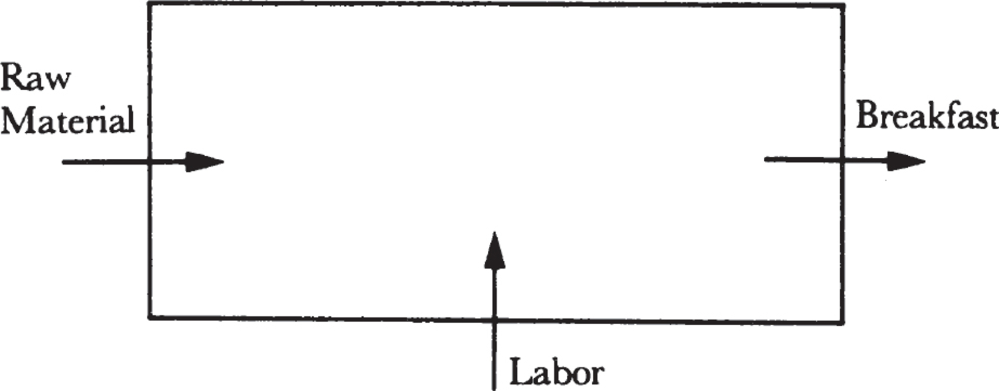
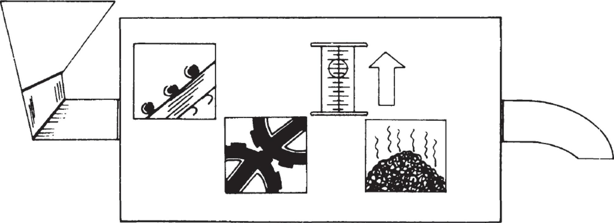
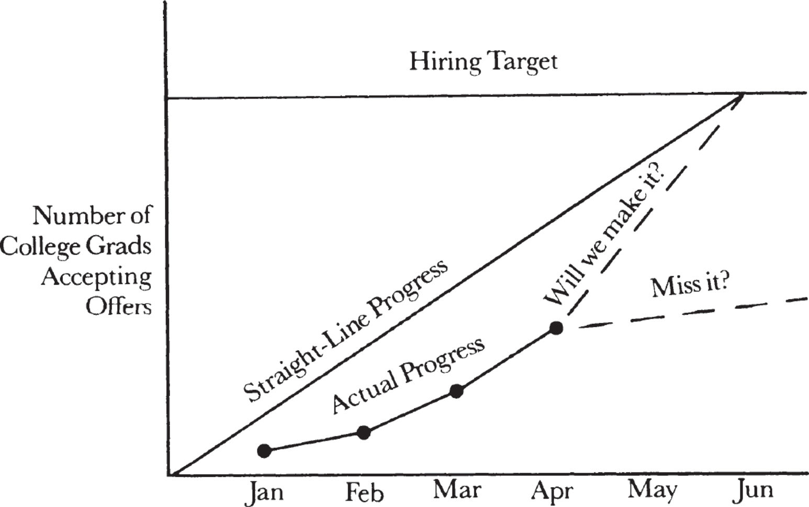
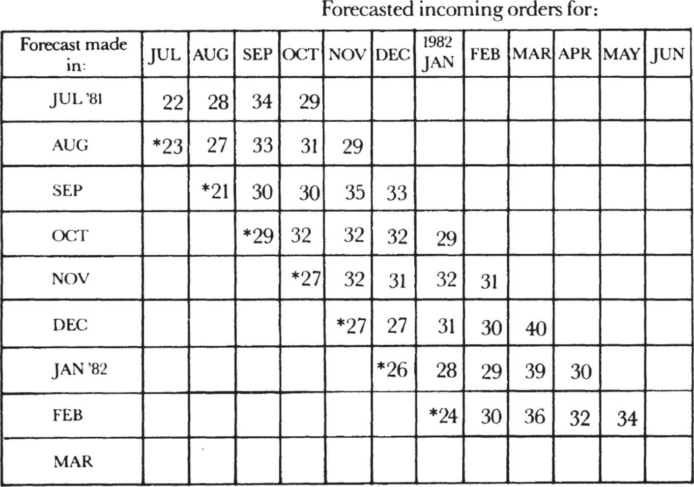
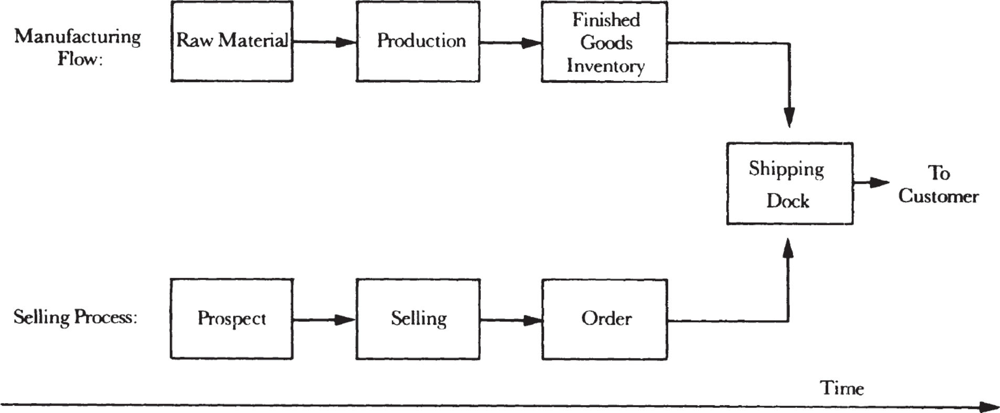
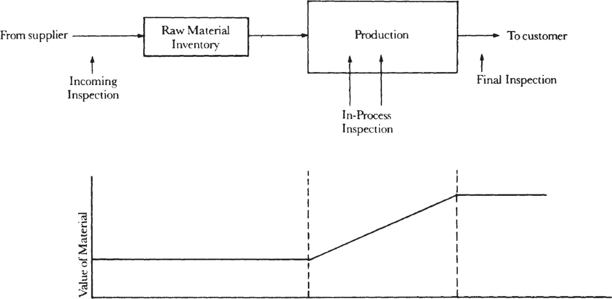
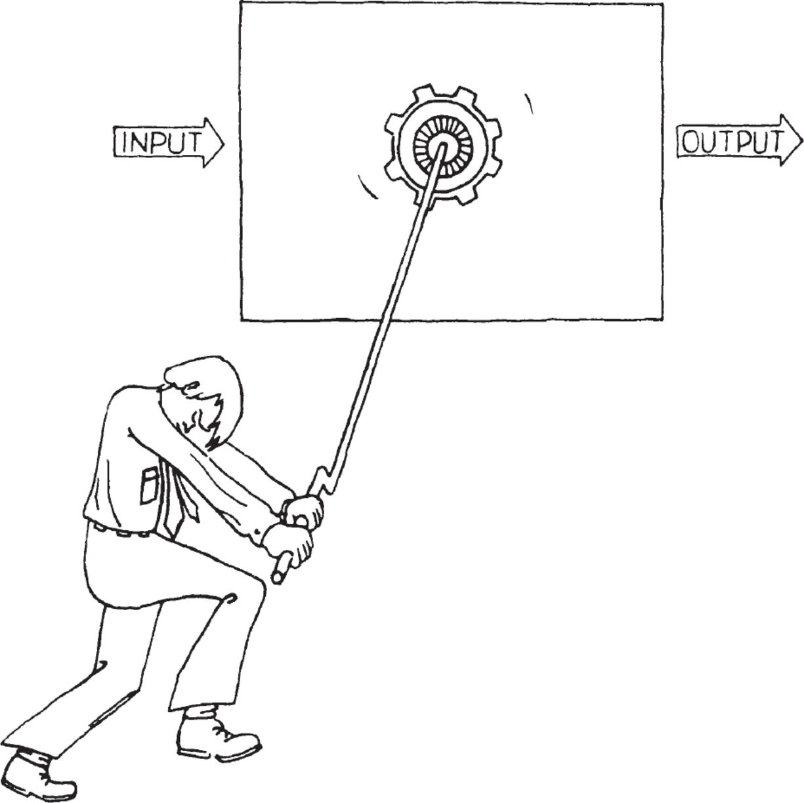
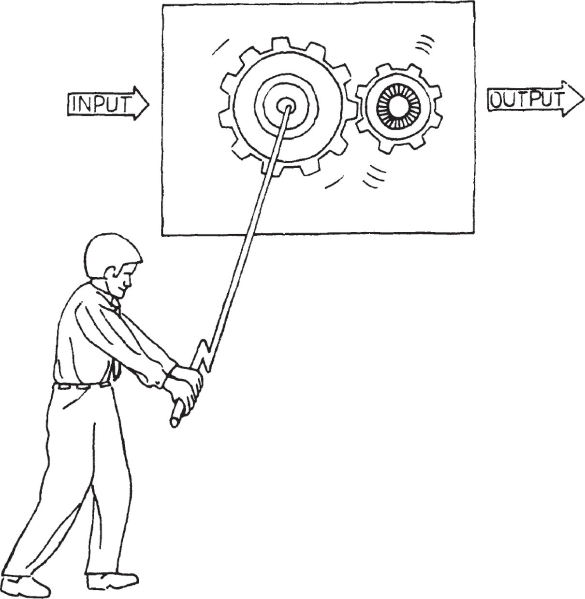

# **2**

# Managing the Breakfast Factory

_Indicators as a Key Tool_

A hungry public has loved the breakfast you’ve been serving, and thanks to the help of your many customers and a friendly banker, you’ve created a _breakfast factory,_ which among other things uses specialized production lines for toast, coffee, and eggs. As manager of the factory, you have a substantial staff and a lot of automated equipment. But to run your operation well, you will need a set of good _indicators,_ or _measurements._ Your output, of course, is no longer the breakfasts you deliver personally but rather all the breakfasts your factory delivers, profits generated, and the satisfaction of your customers. Just to get a fix on your output, you need a number of indicators; to get efficiency and high output, you need even more of them. The number of possible indicators you can choose is virtually limitless, but for any set of them to be useful, you have to _focus_ each indicator on a specific operational goal.

Let’s say that as manager of the breakfast factory, you will work with five indicators to meet your production goals on a daily basis. Which five would they be? Put another way, which five pieces of information would you want to look at each day, immediately upon arriving at your office?

Here are my candidates. First, you’ll want to know your _sales forecast_ for the day. How many breakfasts should you plan to deliver? To assess how much confidence you should place in your forecast, you would want to know how many you delivered yesterday compared to how many you planned on delivering—in other words, the _variance_ between your plan and the actual delivery of breakfasts for the preceding day.

Your next key indicator is _raw material inventory._ Do you have enough eggs, bread, and coffee on hand to keep your factory running today? If you find you have too little inventory, you can still order more. If you find you have too much, you may want to cancel today’s egg delivery.

Another important piece of information is the condition of your _equipment._ If anything broke down yesterday, you will want to get it repaired or rearrange your production line to meet your forecast for the day.

You also must get a fix on your _manpower._ If two waiters are out sick, you will have to come up with something if you are still going to meet the demand forecasted. Should you call in temporary help? Should you take someone off the toaster line and make him a waiter?

Finally, you want to have some kind of _quality_ indicator. It is not enough to monitor the number of breakfasts each waiter delivers, because the waiters could have been rude to the customers even as they served a record number of breakfasts. Because your business depends on people wanting what you sell, you must be concerned with the public’s opinion of your service. Perhaps you should set up a “customer complaint log” maintained by the cashier. If one of your waiters elicited more than the usual number of complaints yesterday, you will want to speak to him first thing today.

All these indicators measure factors essential to running your factory. If you look at them early every day, you will often be able to do something to correct a potential problem before it becomes a real one during the course of the day.

Indicators tend to direct your attention toward what they are monitoring. It is like riding a bicycle: you will probably steer it where you are looking. If, for example, you start measuring your inventory levels carefully, you are likely to take action to drive your inventory levels down, which is good up to a point. But your inventories could become so lean that you can’t react to changes in demand without creating shortages. So because indicators direct one’s activities, you should guard against overreacting. This you can do by _pairing_ indicators, so that together both effect and counter-effect are measured. Thus, in the inventory example, you need to monitor both inventory levels and the incidence of shortages. A rise in the latter will obviously lead you to do things to keep inventories from becoming too low.

The principle here was evident many times in the development of a compiler. Measuring the completion date of each software unit against its capability is one example. Watching this pair of indicators should help us to avoid working on the perfect compiler that will never be ready, and also to avoid rushing to finish one that is inadequate. In sum, joint monitoring is likely to keep things in the optimum middle ground.

Nowhere can indicators—and paired indicators—be of more help than in administrative work. Having come to this realization, our company has been using measurements as a key tool to improve the productivity of administrative work for several years. The first rule is that a measurement—any measurement—is better than none. But a genuinely effective indicator will cover the _output_ of the work unit and not simply the _activity_ involved. Obviously, you measure a salesman by the orders he gets (output), not by the calls he makes (activity).

The second criterion for a good indicator is that what you measure should be a _physical, countable_ thing. Examples of effective measures of administrative output are shown below. Because those listed here are all quantity or output indicators, their paired counterparts should stress the _quality_ of work. Thus, in accounts payable, the number of vouchers processed should be paired with the number of errors found either by auditing or by our suppliers. For another example, the number of square feet cleaned by a custodial group should be paired with a partially objective/partially subjective rating of the quality of work as assessed by a senior manager with an office in that building.

| ADMINISTRATIVE FUNCTION | WORK OUTPUT INDICATOR             |
| ----------------------- | --------------------------------- |
| Accounts payable        | \# Vouchers processed             |
| Custodial               | \# Square feet cleaned            |
| Customer service        | \# Sales orders entered           |
| Data entry              | \# Transactions processed         |
| Employment              | \# People hired (by type of hire) |
| Inventory control       | \# Items managed in inventory     |

_Examples of administrative work output indicators._

Such indicators have many uses. First, they spell out very clearly what the objectives of an individual or group are. Second, they provide a degree of objectivity when measuring an administrative function. Third, and as important as any, they give us a measure by which various administrative groups performing the same function in different organizations can be compared with each other. The performance of a custodial group in one major building can now be compared with that of another group in a second building. In fact, if indicators are put in place, the competitive spirit engendered frequently has an electrifying effect on the motivation each group brings to its work, along with a parallel improvement in performance. More about this later when we examine the “sports analogy.”

_The Black Box_

We can think of our breakfast factory as if it were a “black box”: input (the raw materials) and the labor of waiters, helpers, and you, the manager, flowing into the box, and the output (the breakfast) flowing out of it as illustrated below. In general, we can represent any activity that resembles a production process in a simple fashion as a black box. Thus, we can draw a black box to represent college recruiting, where the input is the applicants on campus and the output is college graduates who have accepted our employment offers. The labor is the work of our on-campus interviewers and the managers and technical people who interview back at the plant. Similarly, the process of field sales training can be seen as a black box with the input being the raw product specifications and the output being trained sales personnel. The labor here is the work of the marketing and merchandising people who turn raw information into usable sales tools and train the field sales personnel to exploit them. In fact, we can represent most, if not all, administrative work by our magical black box. A group whose job is to bill customers has as its input the information about the customer—what he has purchased, the pricing data, and the shipment records; and output is the final bill sent to the customer through which payment is collected. The labor is the work of all personnel involved.

_The breakfast factory—as a “black box.”_

The black box sorts out what the inputs, the output, and the labor are in the production process. We can improve our ability to run that process by cutting some _windows_ in our box so that we can see some of what goes on within it. By looking through the openings, as illustrated below, we can better understand the internal workings of any production process and assess what the future output is likely to be.

_By peering through the windows in the black box, we can get an idea of what the future output is likely to be._

_Leading indicators_ give you one way to look inside the black box by showing you in advance what the future might look like. And because they give you time to take corrective action, they make it possible for you to avoid problems. Of course, for leading indicators to do you any good, _you must believe in their validity._ While this may seem obvious, in practice, confidence is not as easy to come by as it sounds. To take big, costly, or worrisome steps when you are not yet sure you have a problem is hard. But unless you are prepared to act on what your leading indicators are telling you, all you will get from monitoring them is anxiety. Thus, the indicators you choose should be credible, so that you will, in fact, act whenever they flash warning signals.

Leading indicators might include the daily monitors we use to run our breakfast factory, from machine downtime records to an index of customer satisfaction—both of which can tell us if problems lie down the road. A generally applicable example of a “window” cut into the black box is the _linearity indicator._ In the figure below, we provide one for the college recruiting process. Plotted here is the number of college graduates who have accepted our offers versus the month of the year. If all went ideally, we would move along the straight line that would yield our hiring target for the semester by the month of June. If by April the actual progress is as shown here, we will find ourselves far below the ideal straight line. So from reading the indicator, we know that the only way we can hit our target is by getting acceptance at a much higher rate in the remaining two months than we had gotten in the preceding four. Thus, the linearity indicator flashes an early warning, allowing us time to take corrective action. Without it, we would discover that we had missed our target in June, when nothing can be done about it.

_The linearity indicator can give us an early warning that we are likely to miss our target._

If we consider a manufacturing unit in this fashion, we may assume that because it makes monthly goals regularly, all is well. But we can cut a window into the black box here, measure production output against time as the month proceeds, and compare that with the ideal linear output. We may learn that output performance is spread evenly throughout the course of the month or that it is concentrated in the last week of the month. If the latter is the case, the manager of the unit is probably not using manpower and equipment efficiently. And if the situation is not remedied, one minor breakdown toward month’s end could cause the unit to miss its monthly output goal entirely. The linearity indicator will help you anticipate such a problem and is therefore quite valuable.

Also valuable are _trend indicators._ These show output (breakfasts delivered, software modules completed, vouchers processed) measured against time (performance this month versus performance over a series of previous months), and also against some standard or expected level. A display of trends forces you to look at the future as you are led to extrapolate almost automatically from the past. This extrapolation gives us another window in our black box. Also, measurement against a standard makes you think through _why_ the results were what they were, and not what the standard said they would be.

Another sound way to anticipate the future is through the use of the _stagger chart,_ which forecasts an output over the next several months. The chart is updated monthly, so that each month you will have an updated version of the then-current forecast information as compared to several prior forecasts. You can readily see the variation of one forecast from the next, which can help you anticipate future trends better than if you used a simple trend chart.

In my experience, nowhere has the stagger chart been more productive than in forecasting economic trends. The way it works is shown in the figure below, which gives us forecasted rates of incoming orders for an Intel division. The stagger chart then provides the same forecast prepared in the following month, in the month after that, and so on. Such a chart shows not only your outlook for business month by month but also how your outlook varied from one month to the next. This way of looking at incoming business, of course, makes whoever does the forecasting take his task very seriously, because he knows that his forecast for any given month will be routinely compared with future forecasts and eventually with the actual result. But even more important, the improvement or deterioration of the forecasted outlook from one month to the next provides the most valuable indicator of business trends that I have ever seen. I would go as far as to say that it’s too bad that all economists and investment advisers aren’t obliged to display their forecasts in a stagger chart form. Then we could really have a way to evaluate whatever any one of them chooses to say.

(\* means the actual number for that month)

_I have found the “stagger chart” the best means of getting a feel for future business trends._

Finally, indicators can be a big help in solving all types of problems. If something goes wrong, you will have a bank of information that readily shows all the parameters of your operation, allowing you to scan them for unhealthy departures from the norm. If you do not systematically collect and maintain an archive of indicators, you will have to do an awful lot of quick research to get the information you need, and by the time you have it, the problem is likely to have gotten worse.

_Controlling Future Output_

There are two ways to control the output of any factory. Some industries _build to order._ For example, when you go shopping for a sofa, you are going to have to wait a long time to get what you bought, unless you buy it right off the floor. A furniture factory builds to order. When it learns what you want, the factory looks for a hole in its manufacturing schedule and makes the item for you. If you order a new car rather than buying one right off the lot, the same thing happens: the plant will paint the car in the color you want and provide the options you want, but you will have to wait for it. And our breakfast factory, of course, builds breakfasts to order.

But if your competition in the sofa business makes the same product but has it ready in four weeks while you need four months, you are not going to have many customers. So even though you would much rather build to order, you will have to use another way to control the output of your factory. In short, you will have to _build to forecast,_ which is a _contemplation of future orders._ To do this, the manufacturer sets up his activities around a reasoned speculation that orders will materialize for specific products within a certain time.

An obvious disadvantage here is that the manufacturer takes an inventory risk. Since the forecast is an assessment of future requirements, which the manufacturer commits resources to satisfy, the factory could be in an immense amount of trouble if the orders do not materialize or if they materialize for a product other than the one anticipated. In either case, unwanted inventory is the result. To build to forecast, you risk capital to respond to anticipated future demand in good order.

At Intel, we build to forecast because our customers demand that we respond to their needs in a timely fashion, even though our manufacturing throughput times are quite long. Our breakfast factory makes its product to customer order, but buys from its suppliers—like the egg man—on the basis of forecasted demand. Similarly, most companies recruit new college graduates to fill anticipated needs—rather than recruiting only when a need develops, which would be foolish because college graduates are turned out in a highly seasonal fashion. Computer software products, such as compilers, are also typically developed in response to an anticipated market need rather than to specific customer order. So “building” to forecast is a very common business practice.

Delivering a product that was built to forecast to a customer consists of two simultaneous processes, each with a separate time cycle. A manufacturing flow must occur in which the raw material moves through various production steps and finally enters the finished goods warehouse, as illustrated below. Simultaneously, a salesman finds a prospect and sells to that prospect, who eventually places an order with the manufacturer. Ideally, the order for the product and the product itself should arrive on the shipping dock at the same time.

Because the art and science of forecasting is so complex, you might be tempted to give all forecasting responsibility to a single manager who can be made accountable for it. But this usually does not work very well. What works better is to ask both the manufacturing and the sales departments to prepare a forecast, so that people are responsible for performing against their own predictions.

At Intel we try to match the two parallel flows with as much precision as possible. If there’s no match, we end up with a customer order that we can’t satisfy or with a finished product for which we have no customer. Either way we have problems. Obviously, if the match does come off, with a forecasted order becoming a real order, the customer’s requirements can be nicely satisfied with the factory’s product delivery.

_The order for the product and the product itself should arrive at the shipping dock at the same time._

The ideal is rarely found in the real world. More often, customer orders don’t develop in time or the customer changes his mind. As for the other flow, manufacturing could miss deadlines, or make mistakes, or encounter unforeseen problems. Because neither the sales flow nor the manufacturing flow is completely predictable, we should deliberately build a reasonable amount of _“slack”_ into the system. And inventory is the most obvious place for it. Clearly, the more inventory we have, the more change we can cope with and still satisfy orders. But inventory costs money to build and keep, and therefore should be controlled carefully. Ideally, inventory should be kept at the _lowest-value stage,_ as we’ve learned before, like raw eggs kept at the breakfast factory. Also, the lower the value, the more production flexibility we obtain for a given inventory cost.

It is a good idea to use stagger charts in both the manufacturing and sales forecasts. As noted, they will show the trend of change from one forecast to another, as well as the actual results. By repeatedly observing the variance of one forecast from another, you will continually pin down the causes of inaccuracy and improve your ability to forecast both orders and the availability of product.

Forecasting future work demands and then adjusting the output of an “administrative factory” represents a very important way in which its productivity can be increased. Though an old and honored way of operating “widget factories,” the application of forecasting techniques is hardly common as a way to control administrative work. Such work has up to now been considered qualitatively different from work in a widget factory, and has also lacked objective performance standards needed to size or scale the work unit.

But if we have carefully chosen indicators that characterize an administrative unit and watch them closely, we are ready to apply the methods of factory control to administrative work. We can use de facto standards, inferred from the trend data, to forecast the number of people needed to accomplish various anticipated tasks. By rigorous application of the principles of forecasting, manpower can be reassigned from one area to another, and the headcount made to match the forecasted growth or decline in administrative activity. Without rigor, the staffing of administrative units would always be left at its highest level and, given Parkinson’s famous law, people would find ways to let whatever they’re doing fill the time available for its completion. There is no question that having standards and believing in them and staffing an administrative unit objectively using forecasted workloads will help you to maintain and enhance productivity.

_Assuring Quality_

As we have said, manufacturing’s charter is to deliver product at a quality level acceptable to the customer at minimum cost. To assure that the quality of our product will in fact be acceptable, all production flows, whether they “make” breakfasts, college graduates, or software modules, must possess inspection points. To get acceptable quality at the lowest cost, it is vitally important to reject defective material at a stage where its accumulated value is at the lowest possible level. Thus, as noted, we are better off catching a bad raw egg than a cooked one, and screening out our college applicant before he visits Intel. In short, reject before investing further value.

In the language of production, the lowest-value-point inspection where we inspect raw material is called _incoming material inspection_ or _receiving inspection._ If we again use a black box to represent our production process, inspections that occur at intervening points within it are called, logically enough, _in-process_ inspections. Finally, the last possible point of inspection, when the product is ready to be shipped to the customer, is called _final inspection_ or _outgoing quality inspection._ The three types are depicted below.

_The key principle is to reject the defective “material” at its lowest-value stage._

When material is rejected at incoming inspection, a couple of choices present themselves. We can send it back to the vendor as unacceptable, or we can waive our specifications and use the substandard material anyway. The latter would result in a higher reject rate in our production process than if we had used thoroughly acceptable material, but that might be less expensive than shutting down the factory altogether until our vendor provides better material. Such decisions can only be made properly by a balanced group of managers, which typically consists of representatives from the quality assurance, manufacturing, and design engineering departments. This group can weigh all the consequences of rejecting or accepting substandard raw material.

While in most instances the decision to accept or reject defective material at a given inspection point is an economic one, one should _never_ let substandard material proceed when its defects could cause a complete failure—a _reliability problem_—for our customer. Simply put, because we can never assess the consequences of an unreliable product, we can’t make compromises when it comes to reliability. Think of a component going into the making of a cardiac pacemaker. If some of the components don’t work upon receipt by the manufacturer, he can replace them while the unit is still in the factory. This will probably increase costs. But if the component fails later, after the pacemaker has been implanted, the cost of the failure is much more than a financial one.

Inspections, of course, cost money to perform and further add to expense by interfering with the manufacturing flow and making it more complicated. Some material has to be recycled through steps already performed, upsetting the smoothness with which the rest of the material moves. Accordingly, one should approach the need to inspect recognizing that a balance exists between the desired result of the inspection, improved quality, and minimum disturbance to the production process itself.

Let’s consider a few techniques commonly used to balance the two needs. There is a _gate-like_ inspection and a _monitoring_ step. In the former, all material is held at the “gate” until the inspection tests are completed. If the material passes, it is moved on to the next stage in the production process; if the material fails, it will be returned to an earlier stage, where it will be reworked or scrapped. In the latter, a sample of the material is taken, and if it fails, a notation is made from which a failure rate is calculated. The bulk of the material is not held as the sample is taken but continues to move through the manufacturing process. The smoothness of the flow is maintained, but if, for example, three successive samples fail the monitoring test, we can stop the line. What is the trade-off here? If we hold all the material, we add to throughput time and slow down the manufacturing process. A monitor produces no comparable slowdown but might let some bad material escape before we can act on the monitor’s results and shut things down, which means that we might have to reject material later at a higher-value stage. Clearly, for the same money we can do a lot more monitoring than gate-type inspections; if we do the former, we may well contribute more to the overall quality of the product than if we choose less frequent gate-like inspections. The trade-off here is not obvious, and any choice has to be made with a specific case in mind. As a rule of thumb, we should lean toward monitoring when experience shows we are not likely to encounter big problems.

Another way to lower the cost of quality assurance is to use _variable inspections._ Because quality levels vary over time, it is only common sense to vary how often we inspect. For instance, if for weeks we don’t find problems, it would seem logical to check less often. But if problems begin to develop, we can test ever more frequently until quality again returns to the previous high levels. The advantage here is still lower costs and even less interference with the production flow. Yet this approach is not used very often, even in widget manufacturing. Why not? Probably because we are creatures of habit and keep doing things the way we always have, whether it be from week to week or year to year.

Suitably thought through, intelligent inspection schemes can actually increase the efficiency and productivity of any manufacturing or administrative process. Let’s take an example very different from the making of widgets or breakfasts.

I recently read a story in a news magazine that said that the American Embassy in London could not deal with a deluge of visa applications. Some one million Britons apply for visas each year, of which about 98 percent are approved. The embassy employs sixty people, who process as many as 6,000 applications a day. Most applications are received by mail, and at any time, from 60,000 to 80,000 British passports are in the embassy’s hands. Meanwhile, lines of one hundred or more British and other nationals stand in front of the building, looking for an opportunity to walk their passports through. The embassy has tried a number of ways to handle matters more efficiently, including newspaper advertisements asking tourists to apply early and to expect a three-week turnaround. The embassy also installed boxes where applicants could drop off their passports and visa applications if they really needed same-day service. Even so, the lines at the embassy remained long.

In fact, the embassy’s expediting schemes only made the problem worse, because nothing was done to address the basic issue: to speed the processing of visas overall. Time and money were spent to classify various kinds of applications slated for different processing times, but this only created more logistical overhead with no effect on output.

If our government wants British tourists to visit the United States, our government should not irritate these would-be visitors. And if the embassy can’t get the money to increase its staff, a simple solution can be borrowed from basic production techniques. We need, in short, to replace their present scheme with a quality assurance test.

For that, the bureaucratic minds at the embassy would need to accept that a 100 percent check of the visa applicants is unnecessary. Some 98 percent of those applying are approved without any question. So if the embassy were to institute a sampling test of visas (a quality assurance test), and a thorough one at that, the logjam of applications could be broken without materially increasing the chance that the undesirable will enter our country. Moreover, the embassy could select the sample to be checked according to predetermined criteria. The visa processing could then work rather like the Internal Revenue Service. Through the checks and audits that the IRS performs, that government agency induces compliance among most taxpayers without having an agent look at every single return.

Later, when we examine managerial productivity, we’ll see that when a manager digs deeply into a specific activity under his jurisdiction, he’s applying the principle of variable inspection. If the manager examined everything his various subordinates did, he would be meddling, which for the most part would be a waste of his time. Even worse, his subordinates would become accustomed to not being responsible for their own work, knowing full well that their supervisor will check everything out closely. The principle of variable inspection applied to managerial work nicely skirts both problems, and, as we shall see, gives us an important tool for improving managerial productivity.

_Productivity_

The workings of our black box can furnish us with the simplest and most useful definition of productivity. The productivity of any function occurring within it is the output divided by the labor required to generate the output. Thus, one way to increase productivity is to do whatever we are now doing, but _faster._ This could be done by reorganizing the work area or just by working harder. Here we’ve not changed what work we do, we’ve just instituted ways to do it faster—getting more _activities per employee-hour_ to go on inside the black box. Because the output of the black box is proportional to the activity that occurs within it, we will get more output per hour.

There is a second way to improve productivity. We can change the _nature_ of the work performed: what we do, not how fast we do it. We want to increase the ratio of output to activity, thereby increasing output even if the activity per employee-hour remains the same. As the slogan has it, we want to “work smarter, not harder.”

_Productivity can be increased by performing the work activities at a higher rate…_

_…or by increasing the_ leverage _of the activities._

Here I’d like to introduce the concept of _leverage,_ which is the output generated by a specific type of work activity. An activity with high leverage will generate a high level of output; an activity with low leverage, a low level of output. For example, a waiter able to boil two eggs and operate two toasters can deliver two breakfasts for almost the same amount of work as one. His output per activity, and therefore his leverage, is high. A waiter who can handle only one egg and one toaster at a time possesses lower output and leverage. The software engineer using a programming language rather like English, later to be translated by a compiler, can solve many problems per hour of programming. His output and leverage are high. A software engineer using a more cumbersome programming method of ones and zeros will require many more hours to solve the same number of problems. His output and leverage are low. Thus, a very important way to increase productivity is to arrange the work flow inside our black box so that it will be characterized by high output per activity, which is to say high-leverage activities.

Automation is certainly one way to improve the leverage of all types of work. Having machines to help them, human beings can create more output. But in both widget manufacturing and administrative work, something else can also increase the productivity of the black box. This is called _work simplification._ To get leverage this way, you first need to create a flow chart of the production process as it exists. Every single step must be shown on it; no step should be omitted in order to pretty things up on paper. Second, count the number of steps in the flow chart so that you know how many you started with. Third, set a rough target for reduction of the number of steps. In the first round of work simplification, our experience shows that you can reasonably expect a 30 to 50 percent reduction.

To implement the actual simplification, you must question _why_ each step is performed. Typically, you will find that many steps exist in your work flow for no good reason. Often they are there by tradition or because formal procedure ordains it, and nothing practical requires their inclusion. Remember, the “visa factory” at our embassy in Britain didn’t really have to process 100 percent of the applicants. So no matter what reason may be given for a step, you must critically question each and throw out those that common sense says you can do without. We found that in a wide range of administrative activities at Intel, substantial reduction—about 30 percent—could be achieved in the number of steps required to perform various tasks.

Of course, the principle of work simplification is hardly new in the widget manufacturing arts. In fact, this is one of the things industrial engineers have been doing for a hundred years. But the application of the principle to improve the productivity of the “soft professions”—the administrative, professional, and managerial workplace—is new and slow to take hold. The major problem to be overcome is defining what the output of such work is or should be. As we will see, in the work of the soft professions, it becomes very difficult to distinguish between output and activity. And as noted, stressing output is the key to improving productivity, while looking to increase activity can result in just the opposite.
