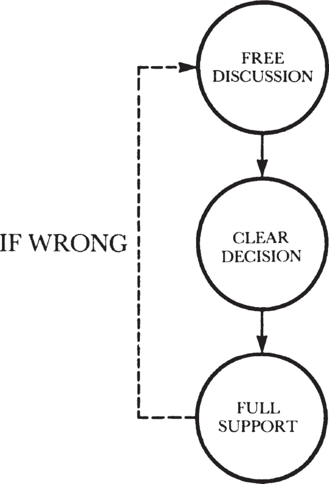

# **5**

# Decisions, Decisions

Making decisions—or more properly, participating in the process by which they are made—is an important and essential part of every manager’s work from one day to the next. Decisions range from the profound to the trivial, from the complex to the very simple: Should we buy a building or should we lease it? Issue debt or equity? Should we hire this person or that one? Should we give someone a 7 percent or a 12 percent raise? Can we deposit a phosphosilicate glass with 9 percent phosphorus content without jeopardizing its stability in a plastic package? Can we appeal this case on the basis of Regulation 939 of the Internal Revenue Code? Should we serve free drinks at our departmental Christmas party?

In traditional industries, where the management chain of command was precisely defined, a person making a certain kind of decision was a person occupying a particular position in the organization chart. As the saying went, authority (to make decisions) went with responsibility (position in the management hierarchy). However, in businesses that mostly deal with information and know-how, a manager has to cope with a new phenomenon. Here a rapid divergence develops between power based on position and power based on knowledge, which occurs because the base of knowledge that constitutes the foundation of the business changes rapidly.

What do I mean? When someone graduates from college with a technical education, at that time and for the next several years, that young person will be fully up-to-date in the technology of the time. Hence, he possesses a good deal of knowledge-based power in the organization that hired him. If he does well, he will be promoted to higher and higher positions, and as the years pass, his position power will grow but his intimate familiarity with current technology will fade. Put another way, even if today’s veteran manager was once an outstanding engineer, he is not now the technical expert he was when he joined the company. At Intel, anyway, we managers get a little more obsolete every day.

So a business like ours has to employ a decision-making process unlike those used in more conventional industries. If Intel used people holding old-fashioned position power to make all its decisions, decisions would be made by people unfamiliar with the technology of the day. And in general, the faster the change in the know-how on which the business depends or the faster the change in customer preferences, the greater the divergence between knowledge and position power is likely to be. If your business depends on what it _knows_ to survive and prosper, what decision-making mechanism should you use? The key to success is again the middle manager, who not only is a link in the chain of command but also can see to it that the holders of the two types of power mesh smoothly.

_Ideal Model_

Illustrated on [this page](id54) is an ideal model of decision-making in a know-how business. The first stage should be _free discussion,_ in which all points of view and all aspects of an issue are openly welcomed and debated. The greater the disagreement and controversy, the more important becomes the word _free._ This sounds obvious, but it’s not often the practice. Usually when a meeting gets heated, participants hang back, trying to sense the direction of things, saying nothing until they see what view is likely to prevail. They then throw their support behind that view to avoid being associated with a losing position. Bizarre as it may seem, some organizations actually encourage such behavior. Let me quote from a news account relating to the woes of a certain American automobile company: “In the meeting in which I was informed that I was released, I was told, ‘Bill, in general, people who do well in this company wait until they hear their superiors express their view and then contribute something in support of that view.’ ” This is a terrible way to manage. All it produces is bad decisions, because if knowledgeable people withhold opinions, whatever is decided will be based on information and insight less complete than it could have been otherwise.

  

_The ideal decision-making process._

The next stage is reaching a _clear decision._ Again, the greater the disagreement about the issue, the more important becomes the word _clear._ In fact, particular pains should be taken to frame the terms of the decision with utter clarity. Again, our tendency is to do just the opposite: when we know a decision is controversial we want to obscure matters to avoid an argument. But the argument is not avoided by our being mealy-mouthed, merely postponed. People who don’t like a decision will be a lot madder if they don’t get a prompt and straight story about it.

Finally, everyone involved must give the decision reached by the group _full support._ This does not necessarily mean agreement: so long as the participants commit to back the decision, that is a satisfactory outcome. Many people have trouble supporting a decision with which they do not agree, but that they need to do so is simply inevitable. Even when we all have the same facts and we all have the interests of an organization in mind, we tend to have honest, strongly felt, real differences of opinion. No matter how much time we may spend trying to forge agreement, we just won’t be able to get it on many issues. But an organization does not live by its members agreeing with one another at all times about everything. It lives instead by people committing to support the decisions and the moves of the business. All a manager can expect is that the commitment to support is honestly present, and this is something he can and must get from everyone.

The ideal decision-making model seems an easy one to follow. Yet I have found that it comes easily to only two classes of professional employees—senior managers who have been in the company for a long time, who feel at home with the way things are done, and who identify with the values of the organization; and the new graduates that we hire, because they used the model as students doing college work. This is the way a team of students working on a laboratory experiment will resolve its differences, so for the young engineer the Intel model is a continuation of what he was used to. But for middle managers, the decision-making model is easier to accept intellectually than it is to practice. Why? Because they often have trouble expressing their views forcefully, a hard time making unpleasant or difficult decisions, and an even harder time with the idea that they are expected to support a decision with which they don’t agree. It may take a while, but the logic of the ideal scheme will eventually win everyone over.

Another desirable and important feature of the model is that any decision be worked out and reached at the _lowest competent level._ The reason is that this is where it will be made by people who are closest to the situation and know the most about it. And by “know” I don’t just mean “understand technically.” That kind of expertise must be tempered with judgment, which is developed through experience and learning from the many errors one has made in one’s career. Thus, ideally, decision-making should occur in the middle ground, between reliance on technical knowledge on the one hand, and on the bruises one has received from having tried to implement and apply such knowledge on the other. To make a decision, if you can’t find people with both qualities, you should aim to get the best possible mix of participants available. For experience, we at Intel are likely to ask a person in management senior to the other members of the group to come to the meeting. But it is very important that everybody there voice opinions and beliefs as _equals_ throughout the free discussion stage, forgetting or ignoring status differentials.

A journalist puzzled by our management style once asked me, “Mr. Grove, isn’t your company’s emphasis on visible signs of egalitarianism such as informal dress, partitions instead of offices, and the absence of other obvious perks like reserved parking spaces, just so much affectation?” My answer was that this is not affectation but a matter of survival. In our business we have to mix knowledge-power people with position-power people daily, and together they make decisions that could affect us for years to come. If we don’t link our engineers with our managers in such a way as to get good decisions, we can’t succeed in our industry. Now, status symbols most certainly do not promote the flow of ideas, facts, and points of view. What appears to be a matter of style really is a matter of necessity.

_The Peer-Group Syndrome_

The model is also hard to implement because anybody who makes a business decision also possesses emotions such as pride, ambition, fear, and insecurity. These tend to come to the surface quickly when people who are not used to working with one another are asked to make a decision. This means we need to think about what keeps decision-making from happening smoothly along the lines we’ve advocated.

The most common problem is something we call the _peer-group syndrome._ A number of years ago, at Intel’s very first management training session, we tried some role-playing to show people what can occur when a group of peers meets to solve a problem or make a decision. We sat the people around a table to tackle what was then a live issue for them in their real jobs. Everyone was an organizational equal. The chairman of the meeting was one level higher, but was purposely sent out of the room so he couldn’t hear what was to happen. Observers in the audience couldn’t believe their eyes and ears as the mock meeting proceeded. The managers working on the problem did nothing but go around in circles for some fifteen minutes, and none of them noticed they weren’t getting anywhere. When the chairman was brought back in, he sat down and listened for a while and couldn’t believe things either. We watched him lean forward as if he were trying to glean more from the conversation. We then saw a black cloud form over his head; finally he slapped the table and exclaimed, “What’s going on here? You people are talking in circles and getting nowhere.” After the chairman intervened, the problem was resolved in very short order. We named this the _peer-plus-one_ approach, and have used it since then to aid decision-making where we must. Peers tend to look for a more senior manager, even if he is not the most competent or knowledgeable person involved, to take over and shape a meeting.

Why? Because most people are afraid to stick their necks out. This is how John, an Intel software engineer, sees things:

> One of the reasons why people are reluctant to come out with an opinion in the presence of their peers is the fear of going against the group by stating an opinion that is different from that of the group. Consequently, the group as a whole wanders around for a while, feeling each other out, waiting for a consensus to develop before anyone risks taking a position. If and when a group consensus emerges, one of the members will state it _as a group opinion_ (“I think _our_ position seems to be…”), not as a personal position. After a weak statement of the group position, if the rest of the mob buys in, the position becomes more solid and is restated more forcefully.

Note the difference between the situation described earlier by the auto executive and the one John describes. In the former instance, the people were expected to wait for their supervisor to state his opinion first. In the latter, members of the group were waiting for a consensus to develop. The dynamics are different, but the bottom line in both is that people didn’t really speak their minds freely. That certainly makes it harder for a manager to make the right decisions.

You can overcome the peer-group syndrome if each of the members has self-confidence, which stems in part from being familiar with the issue under consideration and from experience. But in the end self-confidence mostly comes from a gut-level realization that nobody has ever died from making a wrong business decision, or taking inappropriate action, or being overruled. And everyone in your operation should be made to understand this.

If the peer-group syndrome manifests itself, and the meeting has no formal chairman, the person who has the most at stake should take charge. If that doesn’t work, one can always ask the senior person present to assume control. He is likely to be no more expert in the issues at hand than other members of the group—perhaps less expert—but he is likely to act as a godfather, a repository of knowledge about how decisions should be made, and give the group the confidence needed to make a decision.

One thing that paralyzes both knowledge and position power possessors is the fear of simply _sounding dumb._ For the senior person, this is likely to keep him from asking the questions he should ask. The same fear will make other participants merely think their thoughts privately rather than articulate them for all to hear; at best they will whisper what they have to say to a neighbor. As a manager, you should remind yourself that each time an insight or fact is withheld and an appropriate question is suppressed, the decision-making process is less good than it might have been.

A related phenomenon influences lower-level people present in the meeting. This group has to overcome the fear of being _overruled,_ which might mean embarrassment: if the rest of the group or a senior-level manager vetoed a junior person or opposed a position he was advocating, the junior manager might lose face in front of his peers. This, even more than fear of sanctions or even of the loss of job, makes junior people hang back and let the more senior people set the likely direction of decision-making.

But some issues are so complex that those called on to make a decision honestly aren’t really sure how they feel. When knowledge and position power are separated, the sense of uncertainty can become especially acute, because the knowledge people are often not comfortable with the purely business-related factors that might influence a decision. What is often heard is, “We don’t know what the company \[or division or department\] wants of us.” Similarly, managers holding position power don’t know what to do because they realize they don’t know enough about the technical details to arrive at the correct decision. We must strive not to be done in by such obstacles. We are all human beings endowed with intelligence and blessed with willpower. Both can be drawn upon to help us overcome our fear of sounding dumb or of being overruled, and lead us to initiate discussion and come out front with a stand.

_Striving for the Output_

Sometimes no amount of discussion will produce a consensus, yet the time for a decision has clearly arrived. When this happens, the senior person (or “peer-plus-one”) who until now has guided, coached, and prodded the group along has no choice but to make a decision himself. If the decision-making process has proceeded correctly up to this point, the senior manager will be making the decision having had the full benefit of free discussion wherein all points of view, facts, opinions, and judgments were aired without position-power prejudice. In other words, it is legitimate—in fact, sometimes unavoidable—for the senior person to wield position-power authority if the clear decision stage is reached and no consensus has developed. It is not legitimate—in fact, it is destructive—for him to wield that authority any earlier. This is often not easy. We Americans tend to be reluctant to exercise position power deliberately and explicitly—it is just “not nice” to give orders. Such reluctance on the part of the senior manager can prolong the first phase of the decision-making process—the time of free discussion—past the optimum point, and the decision will be put off.

If you either enter the decision-making stage too early or wait too long, you won’t derive the full benefit of open discussion. The criterion to follow is this: don’t push for a decision prematurely. Make sure you have heard and considered the real issues rather than the superficial comments that often dominate the early part of a meeting. But if you feel that you have already heard everything, that all sides of the issue have been raised, it is time to push for a consensus—and failing that, to step in and make a decision. Sometimes free discussion goes on in an unending search for consensus. But, if that happens, people can drift away from the near consensus when they are close to being right, diminishing the chances of reaching the correct decision. So moving on to make the decision at the right time is crucial.

Basically, like other things managers do, decision-making has an _output_ associated with it, which in this case is the decision itself. Like other managerial processes, decision-making is likelier to generate high-quality output in a timely fashion if we say clearly at the outset that we expect exactly that. In other words, one of the manager’s key tasks is to settle six important questions in advance:

> • What decision needs to be made?
> 
> • When does it have to be made?
> 
> • Who will decide?
> 
> • Who will need to be consulted prior to making the decision?
> 
> • Who will ratify or veto the decision?
> 
> • Who will need to be informed of the decision?

Let me illustrate how these six questions came into play in a recent decision I was involved in. Intel had already decided to expand its Philippine manufacturing plant, roughly doubling its capacity. The next question was where. Only limited space was available next to the existing plant. But, other things being equal, building there was the most desirable thing to do because overhead and communications could be shared, transportation costs between the two plants would amount to virtually nothing, and our employees could be transferred from one plant to the other very easily. The alternative consisted of buying a less expensive plot of land quite some distance away. The land would be not only cheaper but more plentiful, which would allow us to build a relatively inexpensive one- or two-story building. Buying the lot near the existing plant meant that we would have had to build a high-rise to get the amount of floor space we needed, and a high-rise semiconductor manufacturing plant would not be the most efficient. That made us hesitate. But it would be nice to have a second building next to the one we already own. Back and forth and so on and so forth went the discussion.

Let’s apply our six questions here. It is clear _what_ decision needed to be made: we either build a multistory building next to our existing plant, or we build a one- or two-story building at a new outlying location. As for the question _when:_ according to our long-range plans, we needed the new plant in two to two and a half years; if we apply time offsets, we must make the decision within a month. This answers the _when._

_Who_ will decide? Our facilities/construction people or the Intel group that manages the manufacturing plants? The answer is not easy. The first organization is more sensitive to matters pertaining to the costs and difficulties of construction, and will probably lean toward the new location. The plant management group, knowing that operational benefits will come from having the two plants side by side, will probably opt for the high-rise. So the decision-making body is composed of our construction manager for our Far East locations; his supervisor, the construction manager for the corporation; the manager of the Far East manufacturing plant network; and his supervisor, the senior manufacturing manager. The meeting gave us parallel levels of managers from the two organizations. The sensitivities of two interest groups coming to bear on a single decision is quite common in real corporate life. In such meetings, it is important to give to the two sides roughly equal representation, because only from such balance will an even-handed decision emerge. All of these individuals have consulted their staffs prior to the decision and gathered all relevant knowledge and views on the subject.

_Who_ will ratify or veto the decision? The first common person to whom the senior managers of both organizations report is myself. Also, this was a big enough deal that the president of the company should be involved. Moreover, I was somewhat familiar with the locations in the Philippines and how a plant like the one we have there operates. So I was chosen as the person to veto or ratify the decision of the meeting.

_Who_ will need to be informed of this decision? I chose Gordon Moore, our chairman of the board. He’s not directly involved with manufacturing plants like the one contemplated, but we don’t build a new one in the Far East every day, so he should know about what happened.

This is how the decision was made. After studying maps, construction plans and costs, land costs, and traffic patterns, and considering several times everything we thought was important, the group decided to build next to our existing plant but to accept only as much manufacturing area as four stories would yield. The cost would have escalated had we exceeded that. This, with all relevant background, was presented to me at the meeting described on the agenda shown in the previous chapter. I listened to the presentation of the alternatives the group considered and to the reasons why they preferred their choice to these, and after asking a series of questions and probing both the group’s information and its thinking process, I ratified the decision. Subsequently I informed Gordon Moore of the outcome, and as you are reading this, the plant is either under construction or already operating.

Employing consistent ways by which decisions are to be made has value beyond simply expediting the decision-making itself. People invest a great deal of energy and emotion in coming up with a decision. Then somebody who has an important say-so or the right to veto it may come across the decision later. If he does veto it, he can be regarded as a Johnny-come-lately who upsets the decision-making applecart. This, of course, will frustrate and demoralize the people who may have been working on it for a long time. If the veto comes as a surprise, however legitimate it may have been on its merits, an impression of political maneuvering is inevitably created. Politics and manipulation or even their appearance should be avoided at all costs. And I can think of no better way to make the decision-making process straightforward than to apply _before the fact_ the structure imposed by our six questions.

One last thing. If the final word has to be dramatically different from the expectations of the people who participated in the decision-making process (had I chosen, for example, to cancel the Philippine plant project altogether), make your announcement but don’t just walk away from the issue. People need time to adjust, rationalize, and in general put their heads back together. Adjourn, reconvene the meeting after people have had a chance to recover, and solicit their views of the decision at that time. This will help everybody accept and learn to live with the unexpected.

If good decision-making appears complicated, that’s because it is and has been for a long time. Let me quote from Alfred Sloan, who spent a lifetime preoccupied with decision-making: “Group decisions do not always come easily. There is a strong temptation for the leading officers to make decisions themselves without the sometimes onerous process of discussion.” Because the process is indeed onerous, people sometimes try to run away from it. A middle manager I once knew came straight from one of the better business schools and possessed what we might call a “John Wayne” mentality. Having become frustrated with the way Intel made decisions, he quit. He joined a company where his employers assured him during the interview that people were encouraged to make individual decisions which they were then free to implement. Four months later, he came back to Intel. He explained that if he could make decisions without consulting anybody, so could everybody else.
