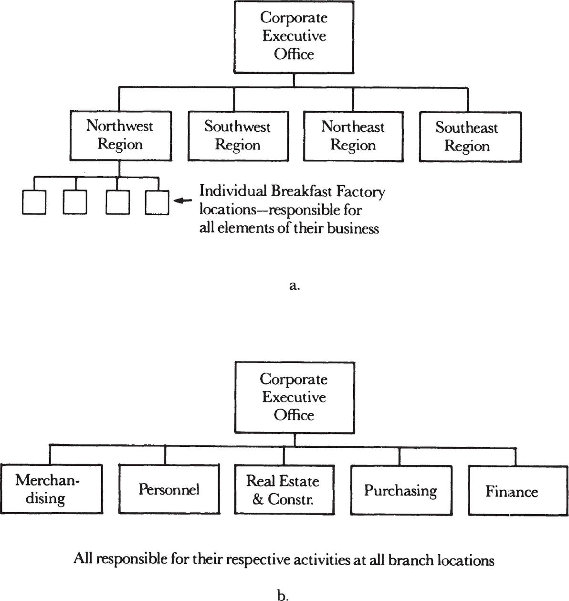
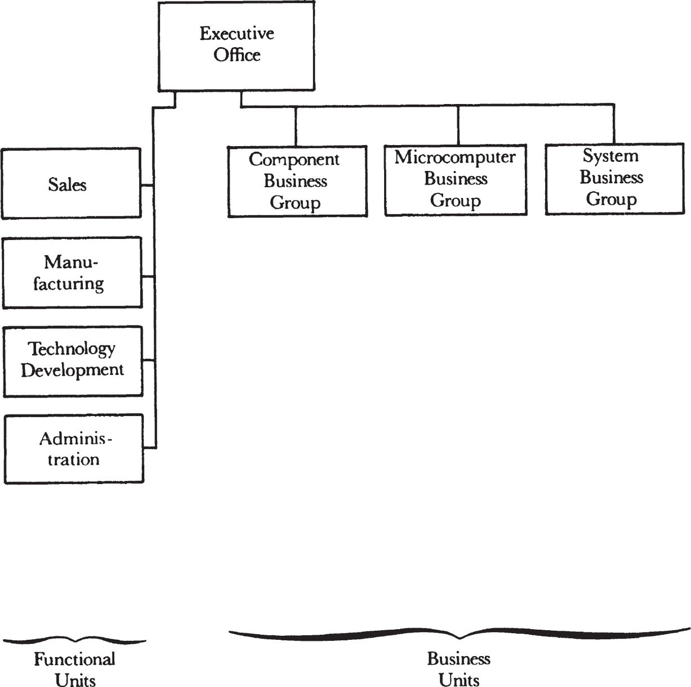

# **8**

# Hybrid Organizations

What happened to the Breakfast Factory has to happen, or has already happened, to every reasonably large organization.

Most middle managers run departments that are a part of a larger organization. The “black boxes” they oversee are connected to other black boxes in much the same way that the Breakfast Factories are linked to each other and to the main office. So let us look more carefully at what happens within an organization composed of smaller units.

Though most are mixed, organizations can come in two extreme forms: in totally _mission-oriented_ form or in totally _functional_ form. The Breakfast Factory Corporation could be organized in one or the other extreme form, as shown on the next page. In the mission-oriented organization (a), which is completely decentralized, each individual business unit pursues what it does—its mission—with little tie-in to other units. Here, each Breakfast Factory is responsible for all elements of its operation: determining its own location and constructing its own building, doing its own merchandising, acquiring and maintaining its own personnel, and doing its own purchasing. In the end it submits monthly financial statements to the corporate executive office.

_The Breakfast Factory network organized in (a) totally mission-oriented and (b) totally functional forms._

At the other extreme is the totally functional organization (b), which is completely centralized. In a Breakfast Factory Corporation set up this way, the merchandising department is responsible for merchandising at _all_ locations; the staff of the personnel organization hires, fires, and evaluates personnel at _all_ branches; and so on.

The desire to give the individual branch manager the power to respond to local conditions moves us toward a mission-oriented organization. But a similarly legitimate desire to take advantage of the obvious economies of scale and to increase the leverage of the expertise we have in each operational area across the entire corporation would push us toward a functional organization. In the real world, of course, we look for a compromise between the two extremes. In fact, the search for the appropriate compromise has preoccupied managers for a long, long time. Alfred Sloan summed up decades of experience at General Motors by saying, “Good management rests on a reconciliation of centralization and decentralization.” Or, we might say, on a balancing act to get the best combination of responsiveness and leverage.

Let’s now look at Intel’s organization form, as shown on the next page. We are a _hybrid_ organization. Our hybrid nature comes from the fact that the form of the overall corporate organization results from a mix of the business divisions, which are mission-oriented, and the functional groups. This is much like the way I imagine any army is organized. The business divisions are analogous to individual fighting units, which are provided with blankets, paychecks, aerial surveillance, intelligence, and so forth by the functional organizations, which supply such services to all fighting units. Because each such unit does not have to maintain its own support groups, it can concentrate on a specific mission, like taking a hill in a battle. And for that, each unit has all the necessary freedom of action and independence.

The functional groups can be viewed as if they were internal subcontractors. Let’s take a sales organization as an example. Though a lot of companies use outside sales representatives, an internal group presumably provides the service at less expense and with greater responsiveness. Likewise, manufacturing, finance, or data processing can all be regarded as functional groups, which, as internal subcontractors, provide services to all the business units.

_Intel is a hybrid organization: balancing to get the best combination of responsiveness and leverage._

Some two thirds of Intel’s employees work in the functional units, indicating their enormous importance. What are some of the advantages of organizing so much of the company in such groups? The first is the economies of scale that can be achieved. Take the case of computerized information processing. Complex computer equipment is very expensive, and the capacity of large electronic machines can be best used if all the various business units draw from them. If each unit had its own computer, very expensive equipment would be sitting idle much of the time. Another important advantage is that resources can be shifted and reallocated to respond to changes in corporate-wide priorities. For instance, because manufacturing is organized functionally, we can change the mix of product being made to match need as perceived by the entire corporation. If each business unit did its own manufacturing, shifting capacity away from one unit to another would be a cumbersome and sticky exercise. And the advantage here is that the expertise of specialists—know-how managers, such as the research engineers who work in technology development—can be applied across the breadth of the entire corporation, giving their knowledge and work enormous leverage. Finally, Intel’s functional groups allow the business units to concentrate on mastering their specific trades rather than having to worry about computers, production, technology, and so forth.

Having so much of Intel organized in functional units also has its disadvantages. The most important is the information overload hitting a functional group when it must respond to the demands made on it by diverse and numerous business units. Even conveying needs and demands often becomes very difficult—a business unit has to go through a number of management layers to influence decision-making in a functional group. Nowhere is this more evident than in the negotiations that go on to secure a portion of centralized—and limited—resources of the corporation, be it production capacity, computer time, or space in a shared building. Indeed, things often move beyond negotiation to intense and open competition among business units for the resources controlled by the functional groups. The bottom line here is that both the negotiation and competition waste time and energy because neither contributes to the output or the general good of the company.

What are some of the advantages of organizing much of a company in a mission-oriented form? There is only one. It is that the individual units can stay in touch with the needs of their business or product areas and initiate changes rapidly when those needs change. _That is it._ All other considerations favor the functional-type of organization. But the business of any business is to respond to the demands and needs of its environment, and the need to be responsive is so important that it always leads to much of any organization being grouped in mission-oriented units.

Countless managers have tried to find the best mix of the two organizational forms. And it’s been no different at Intel, among senior management and throughout the ranks of hundreds of middle managers, who from time to time attempt to improve the organization of the groups they supervise. But no matter how many times we have examined possible organizational forms, we have always concluded that there is simply no alternative to the hybrid organizational structure.

So that is how Intel is organized today. To further my case that hybrid organizations are inevitable, consider a press release that I read recently. One of dozens that show up in the weekly trade newspapers, it is reproduced here with only the names changed.

> ABC TECHNOLOGIES REALIGNS
> 
> (SANTA CLARA, CA) Three-year-old ABC Technologies, Inc., has reorganized into three product divisions. The Super System Division Vice President and General Manager is John Doe, formerly Vice President and Engineering Director and a company founder. Vice President and General Manager of the Ultra System Division is former Sales and Marketing Vice President William Smith. Vice President and General Manager of the Hyper System Division is Robert Worker, formerly Manager of Product Design.
> 
> All three division heads report to ABC Technologies President and Chief Executive Samuel Simon. The divisions will have product marketing and product development responsibilities, while sales and manufacturing responsibilities will remain at the corporate level under newly named Sales Vice President Albert Abel and Manufacturing Vice President William Weary.

Note how the change follows the pattern we outlined and analyzed. As the company grew and its product line broadened, the number of things it had to keep track of multiplied. It made more and more sense to create an organization serving each product line; hence the three product divisions. But as the news release indicates, the major functional organizations of ABC Technologies, such as sales and manufacturing, will remain centralized and will serve the three mission-oriented organizations.

Here I would like to propose Grove’s Law: _All large organizations with a common business purpose end up in a hybrid organizational form._

The Breakfast Factory, an army, Intel, and ABC Technologies provide examples. But just about _every_ large company or enterprise that I know is organized in a hybrid form. Take an educational institution in which one finds individual mission-oriented departments such as mathematics, English, engineering, and so on, and also administration, composed of personnel, security, and library services, whose combined task is to supply the common resources that each of the individual departments needs to function.

Another very different example of the hybrid form can be found in the national Junior Achievement organization. Here each individual chapter runs its own business, with each deciding what product to sell, actually selling it, and otherwise maintaining all aspects of the business. Nevertheless, the national organization controls the way the chapters are to go about their own pursuits: the form in which the individual businesses are to be structured, the paperwork requirements, and the rewards for successful operation.

The use of the hybrid organizational form does not even necessarily depend on how large a business or activity is. A friend of mine is a lawyer in a medium-size law firm. He told me how his firm tried to deal with the problems and conflicts he and his colleagues were having over resources they all shared, such as the steno pool and office space. They ended up forming an executive committee that would not interfere with the legal (mission-oriented) work of the individual attorneys but would address the acquisition and allocation of common, shared resources. Here is a small operation finding itself with the hybrid organizational form.

Do any exceptions exist to the universality of hybrid organizations? The only exceptions that come to my mind are conglomerates, which are typically organized in a totally mission-oriented form. Why are they an exception to our rule? Because they do not have a common business purpose. The various divisions (or companies) in this case are all independent and bear no relationship to one another beyond the conglomerate profit and loss statement. But within each business unit of the conglomerate, the organization is likely to be structured along the hybrid line.

Of course, each hybrid organization is unique because a limitless number of points lie between the hypothetical extremes of the totally functional and the totally mission-oriented forms. In fact, a single organization may very well shift back and forth between the two poles, movement that should be brought on by pragmatic considerations. For example, a company with an inadequate computer acquires a large, powerful new one, making possible centralized economies of scale. Conversely, a company replaces a large computer with small inexpensive ones that can be readily installed in various mission-oriented units without loss of the economies of scale. This is how a business can adapt. But the most important consideration should be this: the shift back and forth between the two types of organizations can and should be initiated to match the operational styles and aptitudes of the managers running the individual units.

As I’ve said, sooner or later all reasonably large companies must cope with the problems inherent in the workings of a hybrid organization. The most important task before such an organization is the optimum and timely allocation of its resources and the efficient resolution of conflicts arising over that allocation.

Though this problem may be very complex, “allocators” working out of some central office are certainly not the answer. In fact, the most glaring example of inefficiency I’ve encountered went on some years ago in Hungary, where I once lived and where a central planning organization decided what goods were to be produced, when, and where. The rationale for such planning was very solid, but in practice it usually fell far, far short of meeting real consumer needs. In Hungary I was an amateur photographer. During the winter, when I needed high-contrast film, none was to be found anywhere. Yet during the summer, everyone was up to his waist in the stuff, even though regular film was in short supply. Year after year, decision-making in the central planning organization was so clumsy that it could not even respond to totally predictable changes in demand. In our business culture, the allocation of shared resources and the reconciliation of the conflicting needs and desires of the independent business units are theoretically the function of corporate management. Practically, however, the transaction load is far too heavy to be handled in one place. If we at Intel tried to resolve all conflicts and allocate all resources at the top, we would begin to resemble the group that ran the Hungarian economy.

Instead, the answer lies with middle managers. Within a company, they are, in the first place, numerous enough to cover the entire range of operation; and, in the second place, very close to the problem we’re talking about—namely, generating internal resources and consuming those resources. For middle managers to succeed at this high-leverage task, two things are necessary. First, they must accept the inevitability of the hybrid organizational form if they are to serve its workings. Second, they must develop and master the practice through which a hybrid organization can be managed. This is _dual reporting,_ the subject of our next chapter.
