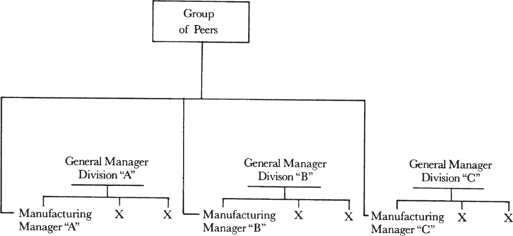
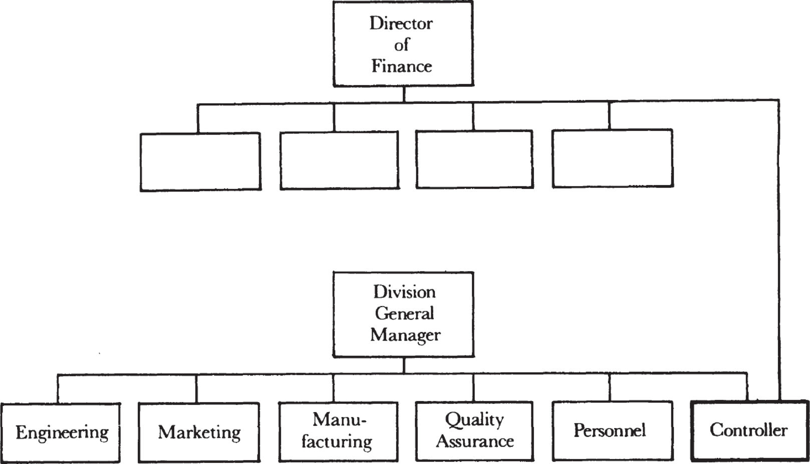
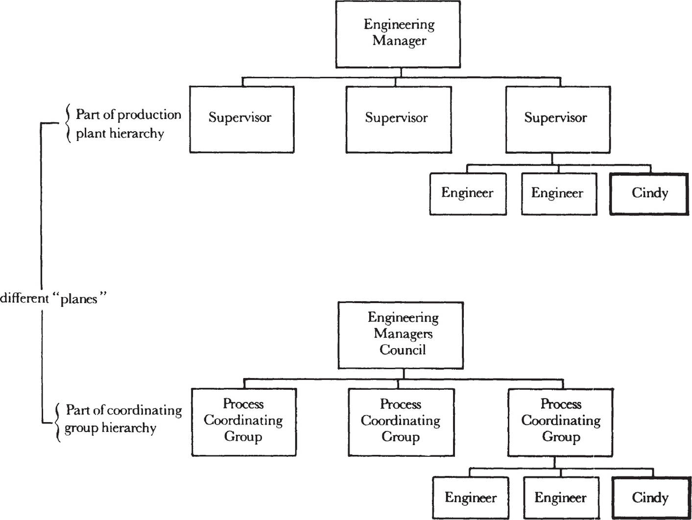

# **9**

# Dual Reporting

To put a man on the moon, NASA asked several major contractors and many subcontractors to work together, each on a different aspect of the project. An unintended consequence of the moon shot was the development of a new organizational approach: _matrix management._ This provided the means through which the work of various contractors could be coordinated and managed so that if problems developed in one place, they did not subvert the entire schedule. Resources could be diverted, for example, from a strong organization to one that was slipping in order to help the latter make up lost time.

Matrix management is a complicated affair. Books have been written about it and entire courses of instruction devoted to it. But the core idea was that a project manager, somebody outside any of the contractors involved, could wield as much influence on the work of units within a given company as could the company management itself. Thus, NASA elaborated the principle of dual reporting on a grand scale. In reality, the basic idea had been quietly at work for many years, enabling hybrid organizations of all types to function, from the neighborhood high school to Alfred Sloan’s General Motors—not to mention the Breakfast Factory franchises. Let’s re-create how Intel came to adopt a dual reporting system.

_Where Should Plant Security Report?_

When our company was young and small, we stumbled onto dual reporting almost by accident. At a staff meeting we were trying to decide to whom the security personnel at our new outlying plants should report. We had two choices. One would have the employees report to the plant manager. But a plant manager, by background, is typically an engineer or a manufacturing person who knows very little about security issues and cares even less. The other choice would have them report to the security manager at the main plant. He hired them in the first place, and he is the expert who sets the standards that the security officers are supposed to adhere to throughout the company. And it was clear that security procedures and practices at the outlying plants had to conform to some kind of corporate standard.

There was only one problem with the latter arrangement. The security manager works at corporate headquarters and not at the outlying plant, so how would he know if the security personnel outside the main plant even showed up, or came in late, or otherwise performed badly? He wouldn’t. After we wrestled with the dilemma for a while, it occurred to us that perhaps security personnel should report _jointly_ to the corporate security manager _and_ to the local plant manager. The first would specify how the job ought to be done, and the second would monitor how it was being performed day by day.

While the arrangement seemed to solve both problems, the staff couldn’t quite accept it. We found ourselves asking, “A person has to have a boss, so who is in charge here?” Could an employee in fact have two bosses? The answer was a tentative “yes,” and the culture of joint reporting relationships, dual reporting, was born. It was a slow, laborious birth.

But the need for dual reporting is actually quite fundamental. Let’s think for a minute about how a manager comes to be. The first step in his career is being an individual contributor—a salesman, for instance. If he proves himself a superior salesman, he is promoted to the position of sales manager, where he supervises people in his functional specialty, sales. When he has shown himself to be a superstar sales manager he is promoted again, this time becoming a regional sales manager. If he works at Intel, he is now not only supervising salesmen but also so-called field application engineers, who obviously know more about technical matters than he does but whom he still manages. The promotions continue until our superstar finds himself a general manager of a business division. Among other things, our new general manager has no experience with manufacturing. So while he is perfectly capable of supervising his manufacturing manager in the more general aspects of his job, the new boss has no choice but to leave the technical aspects to his subordinate, because as a graduate of sales, he has absolutely no background in manufacturing. In other divisions of the corporation, manufacturing managers may similarly be reporting to people who rose through the ranks of engineering and finance.

We could handle the problem by designating one person the senior manufacturing manager and having all the manufacturing managers report to him instead of to the general manager. But the more we do this, the more we move toward a totally functional form of organization. A general manager could no longer coordinate the activities of the finance, marketing, engineering, and manufacturing groups toward a single business purpose responsive to marketplace needs. We want the immediacy and the operating priorities coming from the general manager as well as a technical supervisory relationship. The solution is dual reporting.

But does the technical supervisor’s role have to be filled by a single individual? No. Consider the following scenario, which could be taken from an ordinary day at Intel. Our manufacturing manager is sitting in the cafeteria having a cup of coffee, and the manufacturing manager from another division (whose boss, the general manager, has a finance background) comes over. They start chatting about what’s going on in their respective divisions and begin to realize that they have a number of technical problems in common. Applying the theory that two heads are better than one, they decide to meet a bit more often. Eventually the meetings become regularly scheduled and manufacturing managers from other divisions join the two to exchange views about problems they share. Pretty soon a committee or a council made up of a group of peers comes into existence to tackle issues common to all. In short, they have found a way to deal with those technical issues that their bosses, the general managers, can’t help them with. In effect, they now have supervision that a general manager competent in manufacturing could have given them, but that supervision is being exercised by a _peer group._ The manufacturing managers report to two supervisors: to this group and to their respective general managers, as the figure opposite shows.

To make such a body work requires the _voluntary surrender of individual decision-making to the group._ Being a member means you no longer have complete freedom of individual action, because you must go along with the decisions of your peers in most instances. By analogy, think of yourself as one of a couple who decides to take a vacation with another couple. You know that if you go together you will not be free to do exactly what you want to do when you want to do it, but you go together anyway because you’ll have more fun, even while you’ll have less freedom. At work, surrendering individual decision-making depends on trusting the soundness of actions taken by your group of peers.

_The manufacturing managers report to two supervisors: to their general managers and to a group of their peers._

Trust in no way relates to an organizational principle but is instead an aspect of the corporate culture, something about which much has been written in recent years. Put simply, it is a set of values and beliefs, as well as familiarity with the way things are done and should be done in a company. The point is that a strong and positive corporate culture is absolutely essential if dual reporting and decision-making by peers are to work.

This system makes a manager’s life ambiguous, and most people don’t like ambiguity. Nevertheless, the system is needed to make hybrid organizations work, and while people will strive to find something simpler, the reality is that it doesn’t exist. A strictly functional organization, which is clear conceptually, tends to remove engineering and manufacturing (or the equivalent groups in your firm) from the marketplace, leaving them with no idea of what the customers want. A highly mission-oriented organization, in turn, may have definite crisp reporting relationships and clear and unambiguous objectives at all times. However, the fragmented state of affairs that results causes inefficiency and poor overall performance.

It’s not because Intel loved ambiguity that we became a hybrid organization. We have tried everything else, and while other models may have been less ambiguous, they simply didn’t work. Hybrid organizations and the accompanying dual reporting principle, like a democracy, are not great in and of themselves. They just happen to be the best way for any business to be organized.

_Making Hybrid Organizations Work_

To make hybrid organizations work, you need a way to coordinate the mission-oriented units and the functional groups so that the resources of the latter are allocated and delivered to meet the needs of the former. Consider how the controller works at Intel. His professional methods, practices, and standards are set by the functional group to which he belongs, the finance organization. Consequently, the controller for a business unit should report to someone in both the functional and the mission-oriented organizations, with the type of supervision reflecting the varying needs of the two. The divisional general manager gives the controller mission-oriented priorities by asking him to work on specific business problems. The finance manager makes sure that the controller is trained to do his work in a technically proficient manner, supervises and monitors his technical performance, and looks after his career inside finance, promoting him, perhaps, to the position of controller of a bigger, more complex division if he performs well. Again, as shown opposite, this is dual reporting, the management principle that enables the hybrid organization form to work.

The example has parallels throughout a corporation. Consider advertising. Should each business division devise and pursue its own advertising campaign, or should all of it be handled through a single corporate entity? As before, there are pros and cons on both sides. Each division clearly understands its own strategy best, and therefore presumably best understands what its advertising message should be and to whom it should be aimed. This would suggest that advertising stay in the hands of the divisions. On the other hand, the products of various divisions often all serve the needs of a specific market, and taken together represent a much more complete solution to the customers’ needs than what can be provided by an individual division. Here the customer and hence the manufacturer clearly benefit if all the advertising stories are told in a coherent, coordinated fashion. Also, advertising sells not just a specific product but the entire corporation as well. Because the ads ought to project a consistent image that is right for everybody, we should at the very least not let a division go out and hire its own advertising agency.

_The controller for a business division should be supervised by both organizations._

As with much else in a hybrid organization, the optimum solution here calls for the use of dual reporting. The divisional marketing managers should control most of their own advertising messages. But a coordinating body of peers consisting of the various divisional marketing managers and perhaps chaired by the corporate merchandising manager should provide the necessary functional supervision for all involved. This body would choose the advertising agency, for instance, and determine the graphic image to which _all_ divisional ads should conform. It could also define the way the division marketing managers would deal with the agency, which could reduce the cost of space through the use of volume buying. Yet the specific selling message communicated by an individual ad would be mainly left to the divisional people.

Dual reporting can certainly tax the patience of the marketing managers, as they are now also required to understand the needs and thought processes of their peers. But no real alternative exists when you need to communicate individual product and market messages and maintain a corporate identity at the same time.

We have seen that all kinds of organizations evolve into a hybrid organizational form. They must also develop a system of dual reporting. Consider the following story about Ohio University that appeared in the _Wall Street Journal_ (bracketed comments are mine):

> A university is an odd place to manage. The president of the University said, “There’s clearly a shared responsibility for decision-making between administration \[functional organization\] and faculty \[mission-oriented organization\].” A University Planning Advisory Council \[a group of peers\] was formed with representation from the faculty and administration to help allocate limited resources \[a most difficult and common problem\] in the face of severe budget cuts. “We are being educated to think institutionally,” said one council member. “I’m representing student affairs, which had some projects up for consideration this year. But I made a big pitch for buying a new bulldozer.”

So to put it yet another way, the hybrid organizational form is the inevitable consequence of enjoying the benefits of being part of a large organization—a company or university or whatever. To be sure, neither that form nor the need for dual reporting is an excuse for needless busywork, and we should mercilessly slash away unnecessary bureaucratic hindrance, apply work simplification to all we do, and continually subject all established requirements for coordination and consultation to the test of common sense. But we should not expect to escape from complexity by playing with reporting arrangements. Like it or not, the hybrid organization is a fundamental phenomenon of organizational life.

_Another Wrinkle: The Two-Plane Organization_

Whenever a person becomes involved in coordination—something not part of his regular daily work—we encounter a subtle variation of dual reporting.

Remember Cindy, the know-how manager responsible for maintaining and improving a specific manufacturing process? Cindy reports to a supervising engineer, who in turn reports to the engineering manager of the plant. In her daily work, Cindy keeps things going by manipulating the manufacturing equipment, watching the process monitors, and making adjustments when necessary. But Cindy has another job, too. She meets formally once a month with her counterparts from the other production plants to identify, discuss, and solve problems related to the process for which they are each responsible in their respective plants. This coordinating group also works to standardize procedures used at all plants. The work of Cindy’s group, and others like it, is supervised by another more senior group (called the Engineering Managers Council), which is made up of the engineering managers from all the plants.

Cindy’s various reporting relationships can be found in the figure below. As we can see, as a process engineer in the production plant, where she spends 80 percent of her time, Cindy has a clear, crisp reporting arrangement to her supervising engineer, and through him, to the plant engineering manager. But as a member of the process coordinating group, she is also supervised by its chairman. So we see that Cindy’s name appears on two organization charts that serve two separate purposes—one to operate the production plant, the other to coordinate the efforts of various plants. Again we see dual reporting because Cindy has two supervisors.

_Cindy’s name appears on two organization charts—coordinating groups are a means for know-how managers to increase their leverage._

Cindy’s two responsibilities won’t fit on a single organization chart. Instead, we have to think of the coordinating group as existing on a different chart, or on a different plane. This sounds complicated but really isn’t. If Cindy belonged to a church, she would be regarded a member of that organization as well as being part of Intel. Her supervisor there, as it were, would be the local pastor, who in turn is a member of the church hierarchy. No one would confuse these two roles: clearly operating on different planes, each has its own hierarchies, and that Cindy is a member of both groups at the same time would hardly trouble anyone. Cindy’s being part of a coordinating group is like her church membership.

Our ability to use Cindy’s skill and know-how in two different capacities makes it possible for her to exert a much larger leverage at Intel. In her main job, her knowledge affects the work that takes place in one plant; in her second, through what she does in the process coordinating group, she can influence the work of _all_ plants. So we see that the existence of such groups is a way for managers, especially know-how managers, to increase their leverage.

The two-plane concept is a part of everyday organizational life. For instance, while people mostly work at an operating task, they also plan. The hierarchy of the corporation’s planning bodies lies on a plane separate from the one on which you’ll find the operating groups. Moreover, if a person can operate in two planes, he can operate in three. Cindy could also be part of a task force to achieve a specific result in which her expertise is needed. This is as if Cindy were to work at Intel, to belong to a church, and to do advisory work for the town’s parks department. These are separate roles and do not conflict with one another, though they all do vie for Cindy’s time.

It could also turn out that people who are in a subordinate/supervisory relationship in one plane might find the relationship reversed in another. For example, I am president of Intel, but in another plane I am a member of a strategic planning group, where I report to its chairman, who is one of our division controllers. It’s as if I were a member of the Army Reserve, and on our weekend exercises I found myself under the command of a regimental leader who happens to be this division controller. Back at the operating ranch, I may be his supervisor or his supervisor’s supervisor, but in the Army Reserve he is my commanding officer.

The point is that the two- (or multi-) plane organization is very useful. Without it I could only participate if I were in charge of everything I was part of. I don’t have that kind of time, and often I’m not the most qualified person around to lead. The multi-plane organization enables me to serve as a foot soldier rather than as a general when appropriate and useful. This gives the organization important flexibility.

Many of the groups that we are talking about here are temporary. Some, like task forces, are specifically formed for a purpose, while others are merely an informal collection of people who work together to solve a particular problem. Both cease to work as a group once the problem has been handled. The more varied the nature of the problems we face and the more rapidly things change around us, the more we have to rely on such specially composed _transitory teams_ to cope with matters. In the electronics business, we can’t possibly shift formal organization fast enough to keep up with the pace of advancing technology. The techniques that we have to master to make hybrid organizations work—dual or multiple reporting and also decision-making by peer groups—are both necessary if such transitory teams are to work. The key factor common to all is the use of cultural values as a mode of control, which we will consider next.
