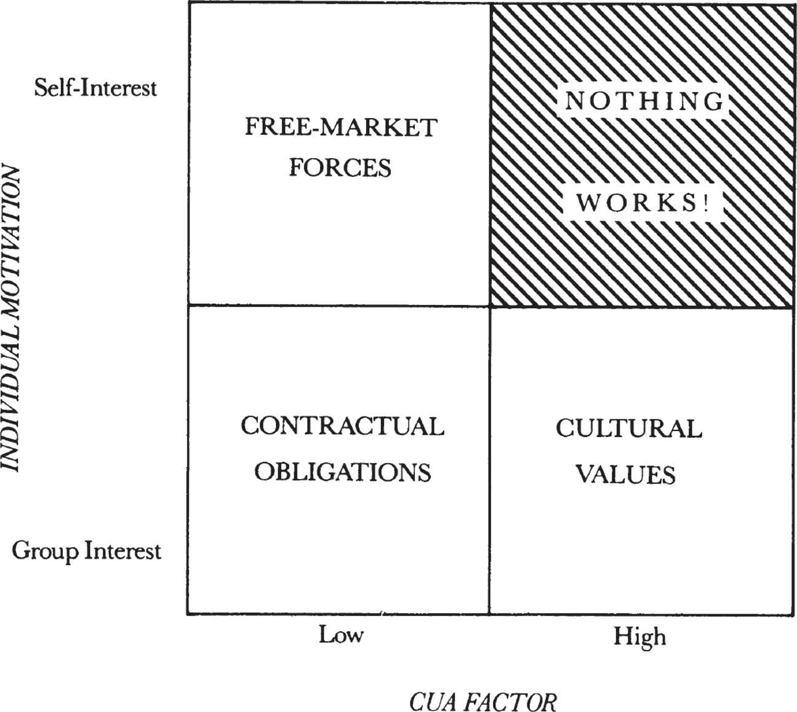

# **10**

# Modes of Control

Let’s look at the ways in which our actions can be controlled or influenced. Say you need new tires for your car. You go down the street to the dealer and take a look at the various lines he has to offer. Then you’ll probably go up the street to see what the competition has. Maybe later you’ll turn to a consumer magazine to help you choose. Eventually, you’ll make a decision based on one thing: your own _self-interest._ You want to buy the tires you think will meet your needs at the lowest cost to you. It is quite unlikely that any personal feelings toward the tire dealer will come to mind. You are not concerned about _his_ welfare—there’s not much chance that you would say to him that he isn’t charging you enough for the tires.

Now you have the tires on your car and you drive off. After a while, you come to a red light. You stop. Do you think about it? No. It’s a law established by the society at large that everybody stops at a red light and you unquestioningly accept and live by it. Vehicular chaos would reign if all drivers had not entered into a _contract_ to stop. The traffic cop monitors adherence and penalizes those who break the law.

After the light changes, you continue on down the road and come upon the scene of a major accident. Quite likely, you’ll forget about laws like not stopping on a freeway and also forget about your own self-interest: you’ll probably do everything you can to help the accident victims and, in the meantime, expose yourself to all kinds of dangers and risks. What motivates you now is not at all what did when you were shopping for tires or stopping at the red light: not self-interest or obeying the law, but concern about someone else’s life.

Similarly, our behavior in a work environment can be controlled by three invisible and pervasive means. These are:

> • free-market forces
> 
> • contractual obligations
> 
> • cultural values

_Free-Market Forces_

When you bought your tires, your actions were governed by free-market forces, which are based on price: goods and services are being exchanged between two entities (individuals, organizational units, or corporations), with each seeking only to enrich himself or itself. This is very simple. It is a matter of “I want to buy the tire at the lowest price I can get” versus “I want to sell the tire at the highest price I can get.” Neither party here cares if the other goes bankrupt, nor do they pretend to. This is a very efficient way to buy and sell tires. No one is needed to oversee the transaction because everyone is openly serving his own self-interest.

So why aren’t the forces of the marketplace used all the time in all circumstances? Because to work, the goods and services bought and sold must possess a very clearly defined dollar value. The free market can easily establish a price for something as simple as tires. But for much else that changes hands in a work or business environment, value is hard to establish.

_Contractual Obligations_

Transactions between companies are usually governed by the free market. When we buy a commodity product from a vendor, we are trying to get it at the best possible price, and vice versa. But what happens when the value of something is not easily defined? What happens, for instance, when it takes a _group_ of people to accomplish a certain task? How much does each of them contribute to the value the business adds to the product? The point is that how much an engineer is worth in a group cannot be pinned down by appealing to the free market. In fact, if we bought engineering work by the “bit,” I think we would end up spending more time trying to decide the value of each bit of contribution than the contribution itself is worth. Here trying to use free-market concepts becomes quite inefficient.

So you say to the engineers, “Okay, I’ll retain your services for a year for a set amount of money, and you will agree to do a certain type of work in return. We’ve now entered into a contract. I’ll give you an office and a terminal, and you promise me to do the best you can to perform your task.”

The nature of control is now based on contractual obligations, which define the kind of work you will do and the standards that will govern it. Because I can’t specify in advance exactly what you will do from day to day, I must have a fair amount of generalized authority over your work. So you must give to me as part of the contract the right to monitor and evaluate and, if necessary, correct your work. We agree on other guidelines and work out rules that we will both obey.

In return for stopping at a red light, we count on other drivers to do the same thing, and we can drive through green lights. But for lawbreakers we need policemen, and with them, as with supervisors, we introduce _overhead._

What are some other examples of contractual obligation? Take the tax system. We surrender the right to some of what we earn and expect certain services in return. Giant overhead is necessary to monitor and audit our tax returns. A utility company presents another example. Its representatives will go to somebody who works for the government and say, “I’ll build a three-hundred-million-dollar generating plant and provide electricity for this portion of the state if you promise me that no one else will build one and try to sell electricity here.” The state says, “Well, that’s fine, but we’re not going to let you charge whatever you want for the power you generate. We’ll establish a monitoring agency called the Public Utilities Commission and they’ll tell you how much you can charge consumers and how much profit you can make.” So, in exchange for a monopoly, the company is contractually obliged to accept the government’s decision on pricing and profit.

_Cultural Values_

When the environment changes more rapidly than one can change rules, or when a set of circumstances is so ambiguous and unclear that a contract between the parties that attempted to cover all possibilities would be prohibitively complicated, we need another mode of control, which is based on cultural values. Its most important characteristic is that the interest of the larger group to which an individual belongs takes precedence over the interest of the individual himself. When such values are at work, some emotionally loaded words come into play—words like _trust_—because you are surrendering to the group your ability to protect yourself. And for this to happen, you must believe that you all share a common set of _values,_ a common set of _objectives,_ and a common set of _methods._ These, in turn, can only be developed by a great deal of common, shared experience.

_The Role of Management_

You don’t need management to supervise the workings of free-market forces; no one supervises sales made at a flea market. In a contractual obligation, management has a role in setting and modifying the rules, monitoring adherence to them, and evaluating and improving performance. As for cultural values, management has to develop and nurture the common set of values, objectives, and methods essential for the existence of trust. How do we do that? One way is by _articulation,_ by spelling out these values, objectives, and methods. The other, even more important, way is by _example._ If our behavior at work will be regarded as in line with the values we profess, that fosters the development of a group culture.

_The Most Appropriate Mode of Control_

There is a temptation to idealize what I’ve called cultural values as a mode of control because it is so “nice,” even utopian, because everybody presumably cares about the common good and subjugates self-interest to that common good. But this is not the most efficient mode of control under all conditions. It is no guide to buying tires, nor could the tax system work this way. Accordingly, given a certain set of conditions, there is always a _most appropriate_ mode of control, which we as managers should find and use.

How do we do that? There are two variables here: first, the nature of a person’s motivation; and second, the nature of the environment in which he works. An imaginary composite index can be applied to measure an environment’s complexity, uncertainty, and ambiguity, which we’ll call the _CUA factor._ Cindy, the process engineer, is surrounded by tricky technologies, new and not fully operational equipment, and development engineers and production engineers pulling her in opposite directions. Her working environment, in short, is _complex._ Bruce, the marketing manager, has asked for permission to hire more people for his grossly understaffed group; his supervisor waffles, and Bruce is left with no idea if he’ll get the go-ahead or what to do if he doesn’t. Bruce’s working environment is _uncertain._ Mike, whom we will now introduce as an Intel transportation supervisor, had to deal with so many committees, councils, and divisional manufacturing managers that he didn’t know which, if any, end was up. He eventually quit, unable to tolerate the _ambiguity_ of his working environment.

_It is our task as managers to identify which mode of control is most appropriate._

Let’s now conceive a simple chart with four quadrants, shown above. The individual motivation can run from self-interest to group-interest, and the CUA factor of a working environment can vary from low to high. Now look for the best mode of control for each quadrant. When self-interest is high and the CUA factor is low, the most appropriate is the market mode, which governed our tire purchase. As individual motivation moves toward group interest, the contractual mode becomes appropriate, which governed our stopping for a red light. When group-interest orientation and the CUA factor are both high, the cultural values mode becomes the best choice, which explains to us why we tried to help at the scene of the accident. And finally, when the CUA factor is high and individual motivation is based on self-interest, _no_ mode of control will work well. This situation, like every man for himself on a sinking ship, can only produce _chaos._

Let’s apply our model to the work of a new employee. What is his motivation? It is very much based on self-interest. So you should give him a clearly structured job with a low CUA factor. If he does well, he will begin to feel more at home, worry less about himself, and start to care more about his team. He learns that if he is on a boat and wants to get ahead, it is better for him to help row than to run to the bow. The employee can then be promoted into a more complex, uncertain, ambiguous job. (These tend to pay more.) As time passes, he will continue to gain an increasing amount of shared experience with other members of the organization and will be ready to tackle more and more complex, ambiguous, and uncertain tasks. This is why promotion from within tends to be the approach favored by corporations with strong corporate cultures. Bring young people in at relatively low-level, well-defined jobs with low CUA factors, and over time they will share experiences with their peers, supervisors, and subordinates and will learn the values, objectives, andmethods of the organization. They will gradually accept, even flourish in, the complex world of multiple bosses and peer decision-making.

But what do we do when for some reason we have to hire a senior person from outside the company? Like any other new hire, she too will come in having high self-interest, but inevitably we will give her an organization to manage that is in trouble; after all, that was our reason for going outside. So not only does our new manager have a tough job facing her, but her working environment will have a very high CUA. Meanwhile, she has no base of common experience with the rest of the organization and no knowledge of the methods used to help her work. All we can do is cross our fingers and hope she quickly forgets self-interest and just as quickly gets on top of her job to reduce her CUA factor. Short of that, she’s probably out of luck.

_Modes of Control at Work_

At any one time, one of the three modes of control may govern what we are doing. But from one day to the next, we find ourselves influenced by all three. Let’s track Bob’s mode of control for a bit. When Bob, a marketing supervisor, buys his lunch in the cafeteria, he’s influenced by market forces. His choices are well defined and based on what he wants to buy and what he wants to pay. Bob’s coming to work in the first place represents a transaction governed by contractual obligations. He is paid a set salary for doing his best, which implies that he has to show up. And his willingness to participate in strategic planning activities shows cultural values at work. This is work outside of his “regular” job as defined contractually, and so represents extra effort for him. But he does it because he feels the company needs what he has to contribute.

Let’s now consider what goes on during the course of a work project. As we know, Barbara’s department is responsible for training the Intel sales force in her division’s products. When she buys materials used in the training program, free-market forces reign as binders of the required quality are purchased at the lowest possible price. The existence of the training program itself, however, presents an example of contractual obligations at work. The salespeople _expect_ that each division will provide training on a regular basis. While the program isn’t a mandated requirement spelled out somewhere in a formal policy statement, its basis is nonetheless contractual. The point is, expectations can be as binding as a legal document.

When a number of divisions share a common sales force, each of them has a vested interest to train representatives to promote and sell its products. At the same time, unless the divisions are willing to sacrifice self-interest in favor of the common interest, the training sessions can easily become disjointed free-for-alls and confuse everybody. So the need to have the individual divisions present coordinated messages is governed by corporate values. Thus, in field sales training, we find all three modes of control at work.

Recently a group of factory marketing managers claimed that our salespeople were governed only by self-interest. They said that they devoted most of their attention to selling those items that produced the most commissions and bonuses. Irritated and a bit self-righteous, the managers felt they were much more concerned about the common good of the company than were their colleagues in the field.

But the marketing departments themselves created the monster. To get the sales force to favor particular products, the divisions had for some time been running contests, with prizes ranging from cash bonuses to trips to exotic places. The marketing managers were competing against one another for a finite and valuable resource: the salesmen’s time. And the salesmen merely responded as one might expect.

But salespeople can also behave in the opposite fashion. At one time, one of our divisions had serious problems, leaving the sales engineers with no product to sell for nearly a year. They could have left Intel and immediately gotten other jobs and quick commissions elsewhere, but by and large they stayed with us. They stayed because they believed in the company and had faith that eventually things would get better. Belief and faith are not aspects of the market mode, but stem from adherence to cultural values.
