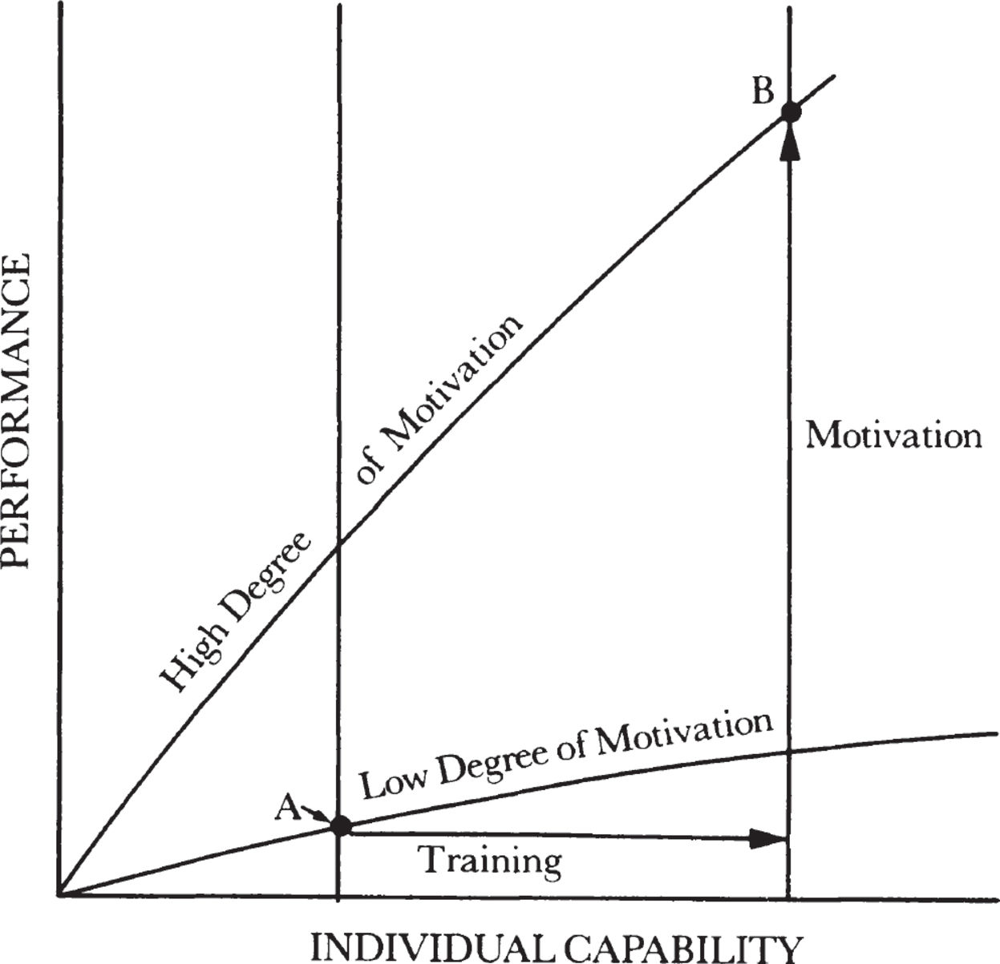
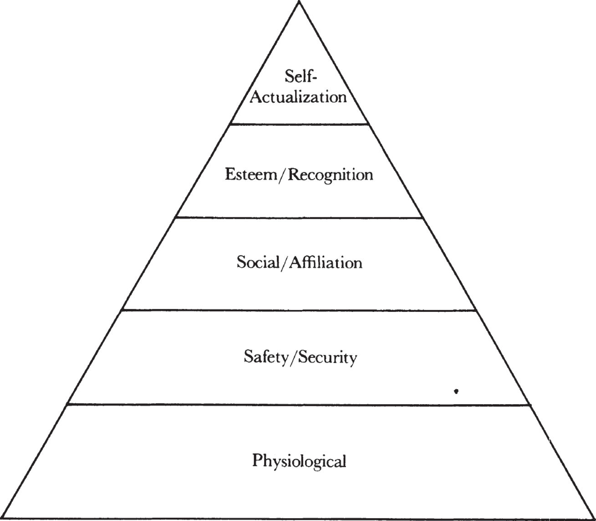

# **11**

# The Sports Analogy

Earlier I built a case summed up by the key sentence: A manager’s output is the output of the organization under his supervision or influence.

Put another way, this means that management is a team activity. But no matter how well a team is put together, no matter how well it is directed, the team will perform only as well as the individuals on it. In other words, everything we’ve considered so far is useless unless the members of our team will continually try to offer the best they can do. The means a manager has at his disposal to elicit peak individual performance are what the rest of this book is about.

When a person is not doing his job, there can only be two reasons for it. The person either can’t do it or won’t do it; he is either not capable or not motivated. To determine which, we can employ a simple mental test: if the person’s life depended on doing the work, could he do it? If the answer is yes, that person is not motivated; if the answer is no, he is not capable. If my life depended on playing the violin on command, I could not do it. But if I had to run a mile in six minutes, I probably could. Not that I would want to, but if my life depended on it, I probably could.

The single most important task of a manager is to elicit peak performance from his subordinates. So if two things limit high output, a manager has two ways to tackle the issue: through _training_ and _motivation._ Each, as we see in the next figure, can improve a person’s performance. In this chapter, our concern is motivation.

_A manager has two ways to improve performance: training and motivation._

How does a manager motivate his subordinates? For most of us, the word implies doing something to another person. But I don’t think that can happen, because motivation has to come from within somebody. Accordingly, all a manager can do is create an environment in which motivated people can flourish.

Because better motivation means better performance, not a change of attitude or feeling, a subordinate’s saying “I feel motivated” means nothing. What matters is if he _performs_ better or worse because his environment changed. An attitude may constitute an indicator, a “window into the black box” of human motivation, but it is not the desired result or output. Better performance at a given skill level is.

For most of Western history, including the early days of the Industrial Revolution, motivation was based mostly on fear of punishment. In Dickens’ time, the threat of loss of life got people to work, because if people did not work, they were not paid and could not buy food, and if they stole food and got caught, they were hanged. The fear of punishment indirectly caused them to produce more than they might have otherwise.

Over the past thirty years or so, a number of new approaches have begun to replace older practices keyed to fear. Perhaps the emergence of the new, humanistic approaches to motivation can be traced to the decline in the relative importance of manual labor and the corresponding rise in the importance of so-called knowledge workers. The output of a manual laborer is readily measurable, and departures from the expected can be spotted and dealt with immediately. But for a knowledge worker, such departures take longer to determine because even the expectations themselves are very difficult to state precisely. In other words, fear won’t work as well with computer architects as with galley slaves; hence, new approaches to motivation are needed.

My description of what makes people perform relies heavily on Abraham Maslow’s theory of motivation, simply because my own observations of working life confirm Maslow’s concepts. For Maslow, motivation is closely tied to the idea of _needs,_ which cause people to have _drives,_ which in turn result in _motivation._ A need once satisfied stops being a need and therefore stops being a source of motivation. Simply put, if we are to create and maintain a high degree of motivation, we must keep some needs unsatisfied at all times.

People, of course, tend to have a variety of concurrent needs, but one among them is always stronger than the others. And that need is the one that largely determines an individual’s motivation and therefore his level of performance. Maslow defined a set of needs, as shown below, that tend to lie in a hierarchy: when a lower need is satisfied, one higher is likely to take over.

_Maslow defined a set of needs that tend to lie in a hierarchy: when a lower need is satisfied, one higher is likely to take over._

_Physiological Needs_

These needs consist of things that money can buy, like food, clothing, and other basic necessities of life. Fear is hitched to such needs: one fears the possible deprivation of food, clothing, and so on.

_Security/Safety Needs_

These come from a desire to protect oneself from slipping back to a state of being deprived of the basic necessities. Safety and security needs are fulfilled, for example, when medical insurance provides employees protection against the fear of going bankrupt trying to pay doctor and hospital fees. The existence of benefits is rarely a dominant source of employee motivation, but if benefits were absent and employees had to worry about such concerns, performance would no doubt be badly affected.

_Social/Affiliation Needs_

The social needs stem from the inherent desire of human beings to belong to some group or other. But people don’t want to belong to just any group; they need to belong to one whose members possess something in common with themselves. For example, when people are excited, confident, or happy, they want to be around people who are also excited, confident, or happy. Conversely, misery loves not just any company, but the company of other miserable people. Nobody who is miserable wants to be around someone happy.

Social needs are quite powerful. A friend of mine decided to go back to work after many years of minding her home. She took a low-paying job, which did little for her family’s standard of living. For a long time, I didn’t understand why she did what she did, but finally it dawned on me: she needed the companionship her work offered. Going to work meant being around a group of people she liked.

Another example of the power of social needs is provided by Jim, a young engineer. His first job after he graduated from college was with a very large, long-established company, while his two college roommates came to work at Intel. Because Jim continued to room with them, he was exposed to what working within Intel was like. Moreover, most of his roommates’ friends from work were also young, unmarried, and just a year or two out of college, while most of the people where Jim worked were married and at least ten years older. Jim felt left out, and his need for a group in which he felt comfortable prompted him to come to work at Intel, though he very much enjoyed his work at the other company.

As one’s environment or condition in life changes, one’s desire to satisfy a particular set of needs is replaced by a desire to satisfy another set. There’s the story of a young Intel manager, Chuck, when he was a first-year student at the Harvard Business School. Initially, he was engulfed by a fear of the class material, of his professors, of failure, of flunking out. After a while his fear gave way to the realization that everyone else was in the same boat, also afraid. Students began to form study groups whose ostensible purpose was to consider class material together, but whose real purpose was to strengthen confidence. Chuck moved from being governed largely by his need for sheer survival—a “physiological” need—to one for security and safety. As time went on, the study groups dissolved and the students started to associate with other members of the class. The entire class, or “section,” as it was called, developed a definite and recognizable set of characteristics; it became, in short, a team. Members enjoyed belonging, associating, and identifying with it, and worked to sustain the section’s image among the professors and other students. Chuck was now satisfying his need for affiliation.

Of course, regressive movement is also possible. Recently, a highly motivated, smoothly working team of manufacturing employees in one of our California plants was suddenly jolted—all too literally—from satisfying a very high level of human needs to abandoning an inventory of silicon wafers, expensive manufacturing equipment, even friends. An earthquake shook their factory. People feared for their lives, dropped everything, and ran to the nearest exit as they found themselves totally consumed by the most fundamental of all physiological needs—survival.

The physiological, safety/security, and social needs all can motivate us to show up for work, but other needs—esteem and self-actualization—make us perform once we are there.

_Esteem/Recognition Needs_

The need for esteem or recognition is readily apparent in the cliché “keeping up with the Joneses.” Such striving is commonly frowned upon, but if an athlete’s “Jones” is last year’s Olympic gold medalist, or if an actor’s “Jones” is Laurence Olivier, the need to keep up with or emulate someone is a powerful source of positive motivation. The person or group whose recognition you desire may mean nothing to someone else—esteem exists in the eyes of the beholder. If you are an aspiring high school athlete and one of the top players passes you in the hall and says hello, you’ll feel terrific. Yet if you try to tell your family or friends how pleased you were about the encounter, you are likely to be met with blank stares, because the “hello” means nothing to people who are not aspiring athletes in your high school.

All of the sources of motivation we’ve talked about so far are self-limiting. That is, when a need is gratified, it can no longer motivate a person. Once a predetermined goal or level of achievement is reached, the need to go any further loses urgency. A friend of mine was thrust into a premature “mid-life crisis” when, in recognition of the excellent work he had been doing, he was named a vice president of the corporation. Such a position had been a life-long goal. When he had suddenly attained it, he found himself looking for some other way to motivate himself.

_Self-Actualization Needs_

For Maslow, self-actualization stems from a personal realization that “what I can be, I must be.” The title of a movie about athletes, _Personal Best,_ captures what self-actualization means: the need to achieve one’s utter personal best in a chosen field of endeavor. Once someone’s source of motivation is self-actualization, his drive to perform has no limit. Thus, its most important characteristic is that unlike other sources of motivation, which extinguish themselves after the needs are fulfilled, self-actualization continues to motivate people to ever higher levels of performance.

Two inner forces can drive a person to use all of his capabilities. He can be _competence_\-driven or _achievement_\-driven. The former concerns itself with job or task mastery. A virtuoso violinist who continues to practice day after day is obviously moved by something other than a need for esteem and recognition. He works to sharpen his own skill, trying to do a little bit better this time than the time before, just as a teenager on a skateboard practices the same trick over and over again. The same teenager may not sit still for ten minutes to do homework, but on a skateboard he is relentless, driven by the self-actualization need, a need to get better that has no limit.

The achievement-driven path to self-actualization is not quite like this. Some people—_not_ the majority—are moved by an abstract need to achieve in all that they do. A psychology lab experiment illustrated the behavior of such people. Some volunteers were put into a room in which pegs were set at various places on the floor. Each person was given some rings but not instructed what to do with them. People eventually started to toss the rings onto the pegs. Some casually tossed the rings at faraway pegs; others stood over the pegs and dropped the rings down onto them. Still others walked just far enough away from the pegs so that to toss a ring onto a peg constituted a challenge. These people worked at the boundary of their capability.

Researchers classified the three types of behavior. The first group, termed gamblers, took high risks but exerted no influence on the outcome of events. The second group, termed conservatives, were people who took very little risk. The third group, termed achievers, had to test the limits of what they could do, and with no prompting demonstrated the point of the experiment: namely, that some people simply _must_ test themselves. By challenging themselves, these people were likely to miss a peg several times, but when they began to ring the peg consistently, they gained satisfaction and a sense of achievement. The point is that both competence- and achievement-oriented people _spontaneously_ try to test the outer limits of their abilities.

When the need to stretch is not spontaneous, management needs to create an environment to foster it. In an MBO system, for example, objectives should be set at a point high enough so that even if the individual (or organization) pushes himself hard, he will still only have a fifty-fifty chance of making them. Output will tend to be greater when everybody strives for a level of achievement beyond his immediate grasp, even though trying means failure half the time. Such goal-setting is extremely important if what you want is peak performance from yourself and your subordinates.

Moreover, if we want to cultivate achievement-driven motivation, we need to create an environment that values and emphasizes _output._ My first job was with a research and development laboratory, where a lot of people were very highly motivated but tended to be knowledge-centered. They were driven to know more, but not necessarily to know more in order to produce concrete results. Consequently, relatively little was actually _achieved._ The value system at Intel is completely the reverse. The Ph.D. in computer science who knows an answer in the abstract, yet does not apply it to create some tangible output, gets little recognition, but a junior engineer who produces results is highly valued and esteemed. And that is how it should be.

_Money and Task-Relevant Feedback_

We now come to the question of how money motivates people. At the lower levels of the motivation hierarchy, money is obviously important, needed to buy the necessities of life. Once there is enough money to bring a person up to a level he expects of himself, more money will not motivate. Consider people who work at our assembly plant in the Caribbean. The standard of living there is quite low, and people who work for us enjoy one substantially higher than most of the population. Yet, in the early years of operation, many employees worked just long enough to accumulate some small sum of money and then quit. For them, money’s motivation was clearly limited; having reached a predetermined notion of how much money they wanted, more money and a steady job provided no more motivation.

Now consider a venture capitalist who after making ten million dollars is still very hard at work trying to make another ten. Physiological, safety, or social needs hardly apply here. Moreover, because venture capitalists usually don’t publicize their successes, they are not driven by a need for esteem or recognition. So it appears that at the upper level of the need hierarchy, when one is self-actualized, money in itself is no longer a source of motivation but rather a _measure of achievement._ Money in the physiological- and security-driven modes only motivates until the need is satisfied, but money as a measure of achievement will motivate without limit. Thus the second ten million can be just as important to the venture capitalist as the first, since it is not the utilitarian need for the money that drives him but the achievement that it implies, and the need for achievement is boundless.

A simple test can be used to determine where someone is in the motivational hierarchy. If the absolute sum of a raise in salary an individual receives is important to him, he is working mostly within the physiological or safety modes. If, however, what matters to him is how his raise stacks up against what other people got, he is motivated by esteem/recognition or self-actualization, because in this case money is clearly a _measure._

Once in the self-actualization mode, a person needs measures to gauge his progress and achievement. The most important type of measure is feedback on his performance. For the self-actualized person driven to improve his competence, the feedback mechanism lies within that individual himself. Our virtuoso violinist knows how the music should sound, knows when it is not right, and will strive tirelessly to get it right. Accordingly, if the possibility for improvement does not exist, the desire to keep practicing vanishes. I knew an Olympic fencing champion, a Hungarian who immigrated to this country. When I ran into him recently, he told me that he had quit fencing shortly after arriving in the U.S. He said that the level of competition here was not high enough to produce someone who could give him a contest, and that he couldn’t bear to fence any longer because every time he did, he felt his skill was diminishing.

What are some of the feedback mechanisms or measures in the workplace? The most appropriate measures tie an employee’s performance to the workings of the organization. If performance indicators and milestones in a management-by-objectives system are linked to the performance of the individual, they will gauge his degree of success and will enhance his progress. An obvious and very important responsibility of a manager is to steer his people away from irrelevant and meaningless rewards, such as office size or decor, and toward relevant and significant ones. The most important form of such _task-relevant feedback_ is the performance review every subordinate should receive from his supervisor. More about this later.

_Fear_

In physiological and security/safety need-dominated motivation, one fears the loss of life or limb or loss of job or liberty. Does fear have a place in the esteem or self-actualized modes? It does, but here it becomes the _fear of failure._ But is that a positive or negative source of motivation? It can be either. Given a specific task, fear of failure can spur a person on, but if it becomes a preoccupation, a person driven by a need to achieve will simply become conservative. Let’s think back to the ring tossers. If a person got an electrical shock each time he threw a ring and missed, soon enough he would walk over to the peg and drop the ring from directly over it to eliminate the pain associated with failure.

In general, in the upper levels of motivation, fear is not something coming from the outside. It is instead fear of not satisfying yourself that causes you to back off. You cannot stay in the self-actualized mode if you’re always worried about failure.

_The Sports Analogy_

We’ve studied motivation to try to understand what makes people want to work so that as managers we can elicit peak performance from our subordinates—their “personal best.” Of course, what we are really after is the performance of the organization as a whole, but that depends on how skilled and motivated the people within it are. Thus, our role as managers is, first, to train the individuals (to move them along the horizontal axis shown in the illustration on [this page](id62)), and, second, to bring them to the point where self-actualization motivates them, because once there, their motivation will be self-sustaining and limitless.

Is there a systematic way to lead people to self-actualization? For an answer, let’s ask another question. Why does a person who is not terribly interested in his work at the office stretch himself to the limit running a marathon? What makes him run? _He is trying to beat other people or the stopwatch._ This is a simple model of self-actualization, wherein people will exert themselves to previously undreamed heights, forcing themselves to run farther or faster, while their efforts fill barrels with sweat. They will do this not for money, but just to beat the distance, the clock, or other people. Consider what made Joe Frazier box:

> It astounds Joe Frazier that anyone has to ask why he fights. “This is what I do. I am a fighter,” he says. “It’s my job. I’m just doing my job.” Joe doesn’t deny the attractiveness of money. “Who wants to work for nothing?” But there are things more important than money. “I don’t need to be a star, because I don’t need to shine. But I do need to be a boxer, because that’s what I am. It’s as simple as that.”

Imagine how productive our country would become if managers could endow all work with the characteristics of competitive sports.

To try to do this, we must first overcome cultural prejudice. Our society respects someone’s throwing himself into sports, but anybody who works very long hours is regarded as sick, a _workaholic._ So the prejudices of the majority say that sports are good and fun, but work is drudgery, a necessary evil, and in no way a source of pleasure.

That makes the cliché apply: if you can’t beat them, join them—endow work with the characteristics of competitive sports. And the best way to get that spirit into the workplace is to establish some rules of the game and ways for employees to measure themselves. Eliciting peak performance means going up against something or somebody. Let me give you a simple example. For years the performance of the Intel facilities maintenance group, which is responsible for keeping our buildings clean and neat, was mediocre, and no amount of pressure or inducement seemed to do any good. We then initiated a program in which each building’s upkeep was periodically scored by a resident senior manager, dubbed a “building czar.” The score was then compared with those given the other buildings. The condition of _all of them_ dramatically improved almost immediately. Nothing else was done; people did not get more money or other rewards. What they did get was a racetrack, an arena of competition. If your work is facilities maintenance, having your building receive the top score is a powerful source of motivation. This is key to the manager’s approach and involvement: he has to see the work as it is seen by the people who do that work every day and then create indicators so that his subordinates can watch their “racetrack” take shape.

Conversely, of course, when the competition is removed, motivation associated with it vanishes. Consider the example of a newspaper columnist reflecting on his past. This journalist “thrived on beating the competition in the column, and his pleasure in his work began to wane after \[his paper and the competitive paper\] merged. ‘I’ll never forget that day of the merger,’ the columnist said. ‘I walked out to get the train, and I just thought: There isn’t anyone else to beat.’ ”

Comparing our work to sports may also teach us how to cope with failure. As noted, one of the big impediments to a fully committed, highly motivated state of mind is preoccupation with failure. Yet we know that in any competitive sport, at least 50 percent of all matches are lost. All participants know that from the outset, and yet rarely do they give up at any stage of a contest.

The role of the manager here is also clear: it is that of the _coach._ First, an ideal coach takes no personal credit for the success of his team, and because of that his players trust him. Second, he is tough on his team. By being critical, he tries to get the best performance his team members can provide. Third, a good coach was likely a good player himself at one time. And having played the game well, he also understands it well.

Turning the workplace into a playing field can turn our subordinates into “athletes” dedicated to performing at the limit of their capabilities—the key to making our team consistent winners.
