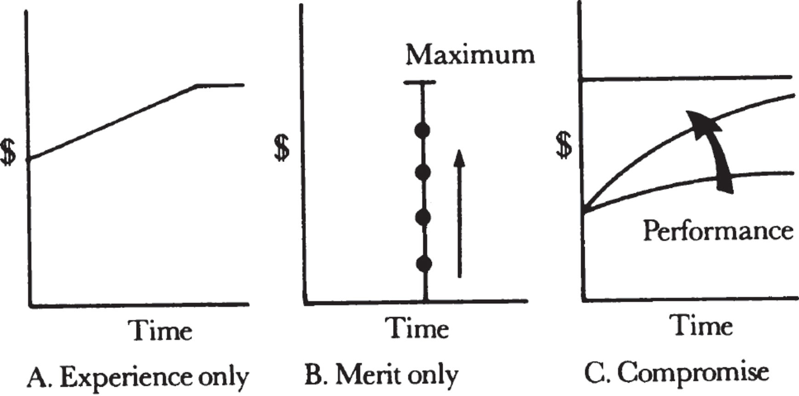
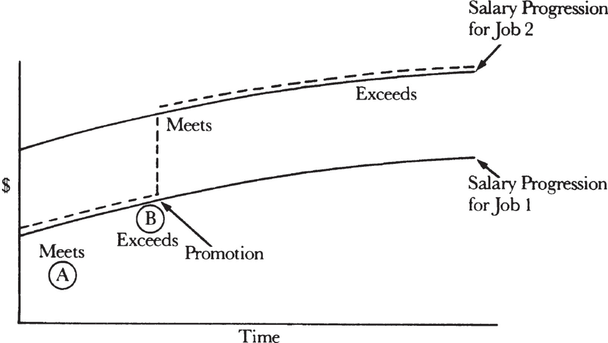

# **15**

# Compensation as Task-Relevant Feedback

Money has significance at all levels of Maslow’s motivation hierarchy. As noted earlier, a person needs money to buy food, housing, and insurance policies, which are part of his physiological and safety/security needs. As one moves up the need hierarchy, money begins to mean something else—a measure of one’s worth in a competitive environment. Earlier I described a simple test that can be applied to determine the role money plays for someone. If the _absolute_ amount of a raise in salary is important, that person is probably motivated by physiological or safety/security needs. If the _relative_ amount of a raise—what he got compared to others—is the important issue, that person is likely to be motivated by self-actualization, because money here is a measure, not a necessity.

At higher levels of compensation, an incremental amount of money gradually will have less and less material utility to the person who gets it. In my experience, middle managers are usually paid well enough that money does not have crucial material significance to them, but not well enough that it is without any material significance. Of course, one middle manager’s needs can differ greatly from another’s, depending on individual circumstances—number of children, a working spouse or not, and so on. As a supervisor, you have to be very sensitive toward the various money needs of your subordinates and show empathy toward them. You must be especially careful not to project your own circumstances onto others.

As managers, our concern is to get a high level of performance from our subordinates. So we want to dispense, allocate, and use money as a way to deliver _task-relevant feedback._ To do this, compensation should obviously be tied to performance, but that, as we’ve seen, is very hard to assess precisely. Because a middle manager cannot be paid by the piece, his job can never be defined by simple output. And because his performance is woven into the performance of a team, it is hard to design a compensation scheme tied directly to the individual performance of a middle manager.

But compromises can be set up. We can base a _portion_ of a middle manager’s compensation on his performance. Let’s call this a _performance bonus._ The percentage the bonus represents of a manager’s total compensation should rise with his total compensation. Thus, for a highly paid senior manager, for whom the absolute dollars make relatively little difference, the performance bonus should be as high as 50 percent, while a middle manager should receive more in the range of 10 to 25 percent of his total compensation this way. Even though what he makes is typically at a level where substantial fluctuations could cause personal hardship, we can at least give a taste of task-relevant feedback.

To design a good performance bonus scheme, we must deal with a variety of issues. We need to figure out if the performance is linked to a team or if it is mostly related to individual work. If it is the former, who makes up the team? Is it a project team, a division, or the entire corporation? We also need to figure out what period the performance bonus should cover, realizing again that cause and effect tend to be offset from each other, often by a long time, but a bonus needs to be paid close enough to the time the work was done that the subordinate can remember why it was awarded. Furthermore, we must think about whether the bonus should be based strictly on countable items (financial performance, for example), on achieving measurable objectives, or on some subjective elements that might get us drawn into a beauty contest. Finally, of course, we don’t want to devise something that pays out lavishly even as the company is going bankrupt.

If you take all of this into account, you are likely to come up with some complex arrangements. For example, you might have a scheme in which a manager’s performance bonus is based on three factors. The first would include his individual performance only, as judged by his supervisor. The second would account for his immediate team’s objective performance, his department perhaps. The third factor would be linked to the overall financial performance of the corporation. When you take, let’s say, 20 percent of a manager’s compensation and split it into three parts, any one will have only a small impact on total compensation, yet attention will still be called to its significance. No matter what way you choose to determine bonuses, none gives you exactly what you want, but most of them will spotlight performance and deliver task-relevant feedback.

Let’s now look at the administration of base salaries. In the abstract, there are two ways to do it. At one extreme, the dollar level is determined by experience only; at the other, by merit alone. In the experience-only approach, an employee’s salary increases with the time he has spent in a particular position. A key point here is that any job has a maximum value; no matter how long an individual has been in it, his salary ultimately has to level off, as shown in the figure on the next page. In the merit-only approach, salary is independent of the time spent in the job. Here the theory says, “I don’t care if you are one year out of college or have spent twenty years in the work force. I only care to see how you perform in this job.” But here too, of course, a given job still has a maximum value. Social norms can force us into some unfortunate compensation practices. For instance, even though we say that every job has a finite value where compensation should level off, we often let an individual become too highly paid because we, management, keep giving routine raises.

_There are two pure forms of salary administration; most companies use a compromise._

Many organizations practice a pure experience-only form of salary administration. Large Japanese companies tend to place no distinction based on performance during the first ten or so years of employment—which are probably the most productive years of a professional’s life. Likewise, unions and most government jobs lean toward pure experience-only salary scales. Apart from whether this is fair or not, the message from management is that performance doesn’t matter much. Consider teachers in many school systems. A good one gets paid the same salary as a bad one if they both have been around for the same length of time. How a teacher is evaluated is not usually tied even symbolically to compensation, which makes me wonder if the pass/fail system of grading did not have its origin in the way the typical teacher is paid.

At the same time, merit-only salary administration is impractical in its pure form. It is very hard to ignore a person’s experience as you try to pay a fair salary. Thus, most companies choose a course between the two extremes, which is a compromise scheme that takes the shape of a family of curves shown in the previous figure. The shapes of all of them approximate the curve representing the experience-only approach, but as you can see, while people start at the same salary level, they move up at different speeds and arrive at different places, depending upon individual performance.

Of the three schemes, the one based on experience only is obviously the easiest to administer. If your subordinate does not like the raise he’s been given, all you have to do is show him the book where it says that for X amount of time on the job he deserves and gets Y amount of pay. A supervisor trying to administer some type of merit-based or compromise scheme has to deal with the allocation of a finite resource—money—and this requires thought and effort. If we want to use such schemes, we have to come to terms with the principle—troubling to many managers—that any merit-based system requires a competitive, comparative evaluation of individuals.

Merit-based compensation simply cannot work unless we understand that if someone is going to be first, somebody else has to be last. As Americans, we have no problem accepting a competitive ranking in a sports event. Even the person who comes in last in a race feels comfortable about the system that says someone has to finish last. But at work, unfortunately, competitive ranking frequently becomes a highly charged issue, difficult to accept and to administer—yet it is a must if we want to use salary as a way to encourage performance.

Promotions, defined as a substantial change in a person’s job, are very important to the health of any organization and should be considered with great care. Obviously, for the individual concerned, promotions often produce a big raise. As we have seen, promotions are also readily seen by other members of the organization, and so take on a vitally important role in communicating a value system to the rest of the company. Promotions must be based on performance, because that is the only way to keep the idea of performance highlighted, maintained, and perpetuated.

If we are going to consider promotions, we have to consider the Peter Principle, which says that when someone is good at his job, he is promoted; he keeps getting promoted until he reaches his level of incompetence and then stays there. Like all good caricatures, this one captures at least some of what really happens in a merit-based promotion system.

Take a look at the illustration opposite, where we track someone’s promotions. At point A the demands of Job 1 so tax him that he can only perform in an average fashion. In the jargon of performance assessment, he “meets the requirements” of the job. As time passes, he receives more training and becomes more motivated, and improves his performance to an above-average level, or, again in the jargon, to a point where he “exceeds the requirements” of the position. At this time we consider the person promotable, and in fact do promote him to Job 2, where he will at first perform only at a “meets requirements” level. With more experience, he again will “exceed the requirements” of the job. Eventually, he probably gets promoted again and the cycle repeats itself. Thus, an achiever will alternate between the “meets requirements” and the “exceeds requirements” ratings throughout his career, until he eventually settles at a “meets requirements” level, at which time he will no longer be promoted. This, perhaps, is a better description of how the Peter Principle works.

_An achiever will alternate between “meets requirements” and “exceeds requirements” ratings throughout his career._

Now, is there an alternative to this? I say there is not. If we take a person at point B and don’t offer him more work and greater challenges even though he “exceeds the requirements” of Job 1, we are not fully utilizing a human resource of the company. In time, he will atrophy, and his performance will return to a “meets requirements” level and stay there.

Thus, you’ll find two basic types of “meets” performers. One has no motivation to do more or faces no challenge to do more. This is the noncompetitor, who has become settled and satisfied in his job. The other type of “meets” performer is the competitor. Each time he reaches a level of “exceeds requirements,” he becomes a candidate for promotion. Upon being promoted, he very likely becomes a “meets” performer again. This is the person Dr. Peter wrote about. But we really have no choice but to promote until a level of “incompetence” is reached. At least this way we drive our subordinates toward higher performance, and while they may perform at a “meets” level half the time, they will do that at an increasingly more challenging and difficult job level.

There are times when a person is promoted into a position so much over his head that he performs in a below-average fashion for too long a time. The solution is to _recycle_ him: to put him back into the job he did well before he was promoted. Unfortunately, this is a very difficult thing to do in our society. People tend to view it as a personal failure. In fact, management was at fault for misjudging the employee’s readiness for more responsibility. Usually the person who was promoted beyond his capability is forced to leave the company rather than encouraged to take a step back. This is often rationalized by the notion that “It is better that we let him go, for his own sake.” I think it is dead wrong to force someone in such circumstances out of the company. Instead, I think management ought to face up to its own error in judgment and take forthright and deliberate steps to place the person into a job he can do. Management should also support the employee in the face of the embarrassment that he is likely to feel. If recycling is done openly, all will be pleasantly surprised how short-lived that embarrassment will be. And the result will be a person doing work we _know_ from past experience he can perform well. In my experience, such people, once they regain their confidence, will be excellent candidates for another promotion at a later time—and the second time they are likely to succeed.

In sum, we managers must be responsible and provide our subordinates with honest performance ratings and honest merit-based compensation. If we do, the eventual result will be performance valued for its own sake throughout our organization.
