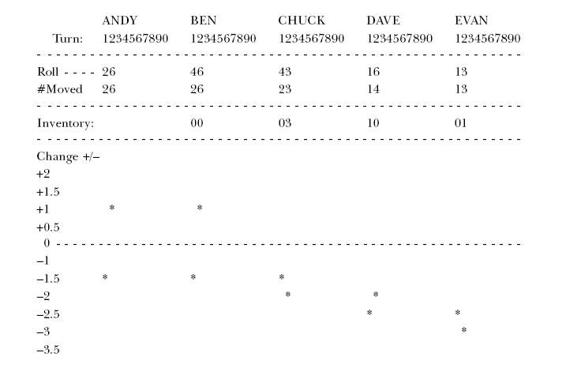
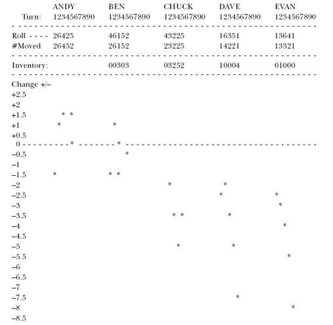
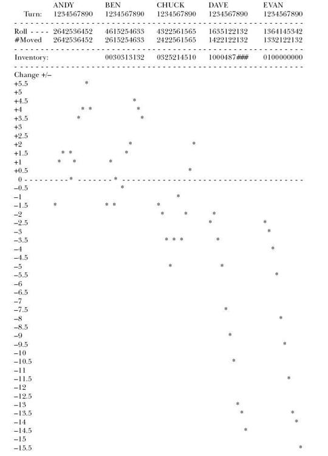

## 14
  
  
"But we’re not supposed to be having lunch here,’’ says one of the kids. "We’re not supposed to eat until we’re farther down the trail, when we reach the Rampage River.’’  
  
"According to the schedule the troopmaster gave us, we’re supposed to eat lunch at 12:00 noon,’’ says Ron.  
  
 "And it is now 12:00 noon,’’ Herbie says, pointing to his watch. "So we have to eat lunch.’’  
  
 "But we’re supposed to be at Rampage River by now and we’re not.’’  
  
 "Who cares?’’ says Ron. "This is a great spot for lunch. Look around.’’  
  
 Ron has a point. The trail is taking us through a park, and it so happens that we’re passing through a picnic area. There are tables, a water pump, garbage cans, barbecue grills—all the necessities. (This is my kind of wilderness I’ll have you know.)  
  
 "Okay,’’ I say. "Let’s just take a vote to see who wants to eat now. Anyone who’s hungry, raise your hand.’’  
  
 Everyone raises his hand; it’s unanimous. We stop for lunch.  
  
 I sit down at one of the tables and ponder a few thoughts as I eat a sandwich. What’s bothering me now is that, first of all, there is no real way I could operate a manufacturing plant without having dependent events and statistical fluctuations. I can’t get away from that combination. But there must be a way to overcome the effects. I mean, obviously, we’d all go out of business if inventory was always increasing, and throughput was always decreasing.  
  
 What if I had a balanced plant, the kind that Jonah was saying managers are constantly trying to achieve, a plant with every resource exactly equal in capacity to demand from the market? In fact, couldn’t that be the answer to the problem? If I could get capacity perfectly balanced with demand, wouldn’t my excess inventory go away? Wouldn’t my shortages of certain parts disappear? And, anyway, how could Jonah be right and everybody else be wrong? Managers have always trimmed capacity to cut costs and increase profits; that’s the game.  
  
 I’m beginning to think maybe this hiking model has thrown me off. I mean, sure, it shows me the effect of statistical fluctuations and dependent events in combination. But is it a balanced system? Let’s say the demand on us is to walk two miles every hour—no more, no less. Could I adjust the capacity of each kid so he would be able to walk two miles per hour and no faster? If I could, I’d simply keep everyone moving constantly at the pace he should go—by yelling, whip-cracking, money, whatever—and everything would be perfectly balanced.  
  
 The problem is how can I realistically trim the capacity of fifteen kids? Maybe I could tie each one’s ankles with pieces of rope so that each would only take the same size step. But that’s a little kinky. Or maybe I could clone myself fifteen times so I have a troop of Alex Rogos with exactly the same trail-walking capacity. But that isn’t practical until we get some advancements in cloning technology. Or maybe I could set up some other kind of model, a more controllable one, to let me see beyond any doubt what goes on.  
  
 I’m puzzling over how to do this when I notice a kid sitting at one of the other tables, rolling a pair of dice. I guess he’s practicing for his next trip to Vegas or something. I don’t mind—although I’m sure he won’t get any merit badges for shooting craps —but the dice give me an idea. I get up and go over to him.  
  
 "Say, mind if I borrow those for a while?’’ I ask.  
  
 The kid shrugs, then hands them over.  
  
 I go back to the table again and roll the dice a couple of times. Yes, indeed: statistical fluctuations. Every time I roll the dice, I get a random number that is predictable only within a certain range, specifically numbers one to six on each die. Now what I need next for the model is a set of dependent events.  
  
 After scavenging around for a minute or two, I find a box of match sticks (the strike-anywhere kind), and some bowls from the aluminum mess kit. I set the bowls in a line along the length of the table and put the matches at one end. And this gives me a model of a perfectly balanced system.  
  
 While I’m setting this up and figuring out how to operate the model, Dave wanders over with a friend of his. They stand by the table and watch me roll the die and move matches around.  
  
 "What are you doing?’’ asks Dave.  
  
 "Well, I’m sort of inventing a game,’’ I say.  
  
 "A game? Really?’’ says his friend. "Can we play it, Mr. Rogo?’’  
  
 Why not?  
  
 "Sure you can,’’ I say.  
  
 All of a sudden Dave is interested.  
  
 "Hey, can I play too?’’ he asks.  
  
 "Yeah, I guess I’ll let you in,’’ I tell him. "In fact, why don’t you round up a couple more of the guys to help us do this.’’  
  
 While they go get the others, I figure out the details. The system I’ve set up is intended to "process’’ matches. It does this by moving a quantity of match sticks out of their box, and through each of the bowls in succession. The dice determine how many matches can be moved from one bowl to the next. The dice represent the capacity of each resource, each bowl; the set of bowls are my dependent events, my stages of production. Each has exactly the same capacity as the others, but its actual yield will fluctuate somewhat.  
  
 In order to keep those fluctuations minimal, however, I decide to use only one of the dice. This allows the fluctuations to range from one to six. So from the first bowl, I can move to the next bowls in line any quantity of matches ranging from a minimum of one to a maximum of six.  
  
 Throughput in this system is the speed at which matches come out of the last bowl. Inventory consists of the total number of matches in all of the bowls at any time. And I’m going to assume that market demand is exactly equal to the average number of matches that the system can process. Production capacity of each resource and market demand are perfectly in balance. So that means I now have a model of a perfectly balanced manufacturing plant.  
  
 Five of the boys decide to play. Besides Dave, there are Andy, Ben, Chuck, and Evan. Each of them sits behind one of the bowls. I find some paper and a pencil to record what happens. Then I explain what they’re supposed to do.  
  
 "The idea is to move as many matches as you can from your bowl to the bowl on your right. When it’s your turn, you roll the die, and the number that comes up is the number of matches you can move. Got it?’’  
  
 They all nod. "But you can only move as many matches as you’ve got in your bowl. So if you roll a five and you only have two matches in your bowl, then you can only move two matches. And if it comes to your turn and you don’t have any matches, then naturally you can’t move any.’’  
  
 They nod again.  
  
 "How many matches do you think we can move through the line each time we go through the cycle?’’ I ask them.  
  
 Perplexity descends over their faces.  
  
 "Well, if you’re able to move a maximum of six and a minimum of one when it’s your turn, what’s the average number you ought to be moving?’’ I ask them.  
  
 "Three,’’ says Andy.  
  
 "No, it won’t be three,’’ I tell them. "The mid-point between one and six isn’t three.’’  
  
 I draw some numbers on my paper.  
  
 "Here, look,’’ I say, and I show them this:  
  
 123456  
  
 And I explain that 3.5 is really the average of those six numbers.  
  
 "So how many matches do you think each of you should have moved on the average after we’ve gone through the cycle a number of times?’’ I ask.  
  
 "Three and a half per turn,’’ says Andy.  
  
 "And after ten cycles?’’  
  
 "Thirty-five,’’ says Chuck.  
  
 "And after twenty cycles?’’  
  
 "Seventy,’’ says Ben.  
  
 "Okay, let’s see if we can do it,’’ I say.  
  
 Then I hear a long sigh from the end of the table. Evan looks at me.  
  
 "Would you mind if I don’t play this game, Mr. Rogo?’’ he asks.  
  
 "How come?’’  
  
 "Cause I think it’s going to be kind of boring,’’ he says.  
  
 "Yeah,’’ says Chuck. "Just moving matches around. Like who cares, you know?’’  
  
 "I think I’d rather go tie some knots,’’ says Evan.  
  
 "Tell you what,’’ I say. "Just to make it more interesting, we’ll have a reward. Let’s say that everybody has a quota of 3.5 matches per turn. Anybody who does better than that, who averages more than 3.5 matches, doesn’t have to wash any dishes tonight. But anybody who averages less than 3.5 per turn, has to do extra dishes after dinner.’’  
  
 "Yeah, all right!’’ says Evan.  
  
 "You got it!’’ says Dave.  
  
 They’re all excited now. They’re practicing rolling the die. Meanwhile, I set up a grid on a sheet of paper. What I plan to do is record the amount that each of them deviates from the average. They all start at zero. If the roll of the die is a 4, 5, or 6 then I’ll record—respectively—a gain of .5, 1.5, or 2.5\. And if the roll is a 1, 2, or 3 then I’ll record a loss of −2.5, −1.5, or −.5 respectively. The deviations, of course, have to be cumulative; if someone is 2.5 above, for example, his starting point on the next turn is 2.5, not zero. That’s the way it would happen in the plant.  
  
 "Okay, everybody ready?’’ I ask.  
  
 "All set.’’  
  
 I give the die to Andy.  
  
 He rolls a two. So he takes two matches from the box and puts them in Ben’s bowl. By rolling a two, Andy is down 1.5 from his quota of 3.5 and I note the deviation on the chart.  
  
 Ben rolls next and the die comes up as a four.  
  
 "Hey, Andy,’’ he says. "I need a couple more matches.’’  
  
 "No, no, no, no,’’ I say. "The game does not work that way. You can only pass the matches that are in your bowl.’’  
  
 "But I’ve only got two,’’ says Ben.  
  
 "Then you can only pass two.’’  
  
 "Oh,’’ says Ben.  
  
 And he passes his two matches to Chuck. I record a deviation of −1.5 for him too.  
  
 Chuck rolls next. He gets a five. But, again, there are only two matches he can move.  
  
 "Hey, this isn’t fair!’’ says Chuck.  
  
 "Sure it is,’’ I tell him. "The name of the game is to move matches. If both Andy and Ben had rolled five’s, you’d have five matches to pass. But they didn’t. So you don’t.’’ Chuck gives a dirty look to Andy.  
  
 "Next time, roll a bigger number,’’ Chuck says.  
  
 "Hey, what could I do!’’ says Andy.  
  
 "Don’t worry,’’ Ben says confidently. "We’ll catch up.’’  
  
 Chuck passes his measly two matches down to Dave, and I record a deviation of −1.5 for Chuck as well. We watch as Dave rolls the die. His roll is only a one. So he passes one match down to Evan. Then Evan also rolls a one. He takes the one match out of his bowl and puts it on the end of the table. For both Dave and Evan, I write a deviation of −2.5.  
  
 "Okay, let’s see if we can do better next time,’’ I say.  
  
 Andy shakes the die in his hand for what seems like an hour. Everyone is yelling at him to roll. The die goes spinning onto the table. We all look. It’s a six.  
  
 "All right!’’  
  
 "Way to go, Andy!’’  
  
 He takes six match sticks out of the box and hands them to Ben. I record a gain of +2.5 for him, which puts his score at 1.0 on the grid.  
  
 Ben takes the die and he too rolls a six. More cheers. He passes all six matches to Chuck. I record the same score for Ben as for Andy.  
  
 But Chuck rolls a three. So after he passes three matches to Dave, he still has three left in his bowl. And I note a loss of −0.5 on the chart.  
  
 Now Dave rolls the die; it comes up as a six. But he only has four matches to pass—the three that Chuck just passed to him and one from the last round. So he passes four to Evan. I write down a gain of +0.5 for him.  
  
 Evan gets a three on the die. So the lone match on the end of the table is joined by three more. Evan still has one left in his bowl. And I record a loss of −0.5 for Evan.  
  
 At the end of two rounds, this is what the chart looks like.  
  
   
  
We keep going. The die spins on the table and passes from hand to hand. Matches come out of the box and move from bowl to bowl. Andy’s rolls are—what else?—very average, no steady run of high or low numbers. He is able to meet the quota and then some. At the other end of the table, it’s a different story.  
  
"Hey, let’s keep those matches coming.’’  
  
 "Yeah, we need more down here.’’  
  
 "Keep rolling sixes, Andy.’’  
  
 "It isn’t Andy, it’s Chuck. Look at him, he’s got five.’’ After four turns, I have to add more numbers—negative numbers—to the bottom of the chart. Not for Andy or for Ben or for Chuck, but for Dave and Evan. For them, it looks like there is no bottom deep enough.  
  
 After five rounds, the chart looks like this:   
  
   
  
"How am I doing, Mr. Rogo?’’ Evan asks me.  
  
 "Well, Evan... ever hear the story of the Titanic?’’ He looks depressed.  
  
 "You’ve got five rounds left,’’ I tell him. "Maybe you can pull through.’’  
  
 "Yeah, remember the law of averages,’’ says Chuck. "If I have to wash dishes because you guys didn’t give me enough matches . . .’’ says Evan, letting vague implications of threat hang in the air.  
  
 "I’m doing my job up here,’’ says Andy.  
  
 "Yeah, what’s wrong with you guys down there?’’ asks Ben.  
  
 "Hey, I just now got enough of them to pass,’’ says Dave. "I’ve hardly had any before.’’  
  
 Indeed, some of the inventory which had been stuck in the first three bowls had finally moved to Dave. But now it gets stuck in Dave’s bowl. The couple of higher rolls he had in the first five rounds are averaging out. Now he’s getting low rolls just when he has inventory to move.  
  
 "C’mon, Dave, gimme some matches,’’ says Evan.  
  
 Dave rolls a one.  
  
 "Aw, Dave! One match!’’  
  
 "Andy, you hear what we’re having for dinner tonight?’’ asks Ben.  
  
 "I think it’s spaghetti,’’ says Andy.  
  
 "Ah, man, that’ll be a mess to clean up.’’  
  
 "Yeah, glad I won’t have to do it,’’ says Andy.  
  
 "You just wait,’’ says Evan. "You just wait ’til Dave gets some good numbers for a change.’’  
  
 But it doesn’t get any better.  
  
 "How are we doing now, Mr. Rogo?’’ asks Evan.  
  
 "I think there’s a Brillo pad with your name on it.’’  
  
 "All right! No dishes tonight!’’ shouts Andy.  
  
 After ten rounds, this is how the chart looks . . .  
  
 I look at the chart. I still can hardly believe it. It was a balanced system. And yet throughput went down. Inventory went up. And operational expense? If there had been carrying costs on the matches, operational expense would have gone up too.  
  
 What if this had been a real plant—with real customers? How many units did we manage to ship? We expected to ship thirty-five. But what was our actual throughput? It was only twenty. About half of what we needed. And it was nowhere near the maximum potential of each station. If this had been an actual plant, half of our orders—or more—would have been late. We’d never be able to promise specific delivery dates. And if we did, our credibility with customers would drop through the floor.  
  
  
  
\# Dave’s inventory for turns 8,9, and 10 is in double digits, respectively rising to 11 matches, 14 matches, and 17 matches.  
  
All of that sounds familiar, doesn’t it?  
  
 "Hey, we can’t stop now!’’ Evan is clamoring.  
  
 "Yea, let’s keep playing,’’ says Dave.  
  
 "Okay,’’ says Andy. "What do you want to bet this time? I’ll take you on.’’  
  
 "Let’s play for who cooks dinner,’’ says Ben.  
  
 "Great,’’ says Dave.  
  
 "You’re on,’’ says Evan.  
  
 They roll the die for another twenty rounds, but I run out of paper at the bottom of the page while tracking Dave and Evan. What was I expecting? My initial chart ranged from +6 to −6\. I guess I was expecting some fairly regular highs and lows, a normal sine curve. But I didn’t get that. Instead, the chart looks like I’m tracing a cross-section of the Grand Canyon. Inventory moves through the system not in manageable flow, but in waves. The mound of matches in Dave’s bowl passes to Evan’s and onto the table finally—only to be replaced by another accumulating wave. And the system gets further and further behind schedule.  
  
"Want to play again?’’ asks Andy.  
  
 "Yeah, only this time I get your seat,’’ says Evan. "No way!’’ says Andy.  
  
 Chuck is in the middle shaking his head, already resigned to defeat. Anyway, it’s time to head on up the trail again. "Some game that turned out to be,’’ says Evan. "Right, some game,’’ I mumble.  
  
