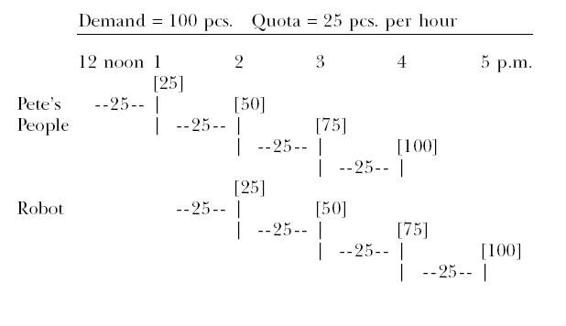
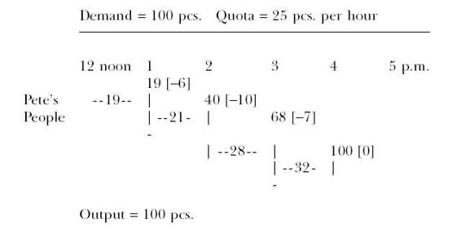
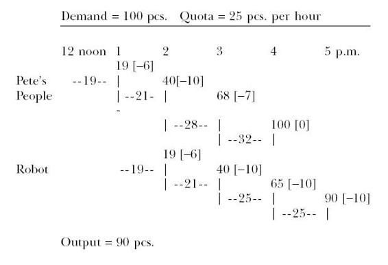

## 17
  
  
Monday morning is a disaster.  
  
 It starts with Davey trying to make breakfast for himself and Sharon and me. Which is a nice, responsible thing to do, but he totally screws it up. While I’m in the shower, he attempts pancakes. I’m midway through shaving when I hear the fight from the kitchen. I rush down to find Dave and Sharon pushing each other. There is a skillet on the floor with lumps of batter, black on one side and raw on the other, splattered.  
  
 "Hey! What’s going on?’’ I shout.  
  
 "It’s all her fault!’’ yells Dave pointing at his sister.  
  
 "You were burning them!’’ Sharon says.  
  
 "I was not!’’  
  
 Smoke is fuming off the stove where something spilled. I step over to shut it off.  
  
 Sharon appeals to me. "I was just trying to help. But he wouldn’t let me.’’ Then she turns to Dave. "Even I know how to make pancakes.’’  
  
 "Okay, because both of you want to help, you can help clean up,’’ I say.  
  
 When everything is back in some semblance of order, I feed them cold cereal. We eat another meal in silence.  
  
 With all the disruption and delay. Sharon misses her school bus. I get Davey out the door, and go looking for her so I can drive her to school. She’s lying down on her bed.  
  
 "Ready, whenever you are, Miz Rogo.’’  
  
 "I can’t go to school,’’ she says.  
  
 "Why not?’’  
  
 "I’m sick.’’  
  
 "Sharon, you have to go to school,’’ I say.  
  
 "But I’m sick!’’ she says.  
  
 I go sit down on the edge of the bed.  
  
 "I know you’re upset. I am too,’’ I tell her. "But these are facts: I have to go to work. I can’t stay home with you, and I won’t leave you here by yourself. You can go to your grandmother’s house for the day. Or you can go to school.’’  
  
 She sits up. I put my arm around her.  
  
 After a minute, she says, "I guess I’ll go to school.’’  
  
 I give her a squeeze and say, "Atta way, kid. I knew you’d do the right thing.’’  
  
By the time I get both kids to school and myself to work, it’s past nine o’clock. As I walk in, Fran waves a message slip at me. I grab it and read it. It’s from Hilton Smyth, marked "urgent’’ and double underlined.  
  
 I call him.   
  
"Well, it’s about time,’’ says Hilton. "I tried to reach you an hour ago.’’  
  
 I roll my eyes. "What’s the problem, Hilton?’’  
  
 "Your people are sitting on a hundred sub-assemblies I need,’’ says Smyth.  
  
 "Hilton, we’re not sitting on anything,’’ I say.  
  
 He raises his voice. "Then why aren’t they here? I’ve got a customer order we can’t ship because your people dropped the ball!’’  
  
 "Just give me the particulars, and I’ll have somebody look into it,’’ I tell him.  
  
 He gives some reference numbers and I write them down.  
  
 "Okay, I’ll have somebody get back to you.’’  
  
 "You’d better do more than that, pal,’’ says Hilton. "You’d better make sure we get those sub-assemblies by the end of the day—and I mean all 100 pieces, not 87, not 99, but all of them. Because I’m not going to have my people do two setups for final assembly on account of your lateness.’’  
  
 "Look, we’ll do our best,’’ I tell him, "but I’m not going to make promises.’’  
  
 "Oh? Well, let’s just put it this way,’’ he says. "If we don’t get 100 sub-assemblies from you today, I’m talking to Peach. And from what I hear you’re in enough trouble with him already.’’  
  
 "Listen, pal, my status with Bill Peach is none of your damn business,’’ I tell him. "What makes you think you can threaten me?’’  
  
 The pause is so long I think he’s going to hang up on me.  
  
 Then he says, "Maybe you ought to read your mail.’’  
  
 "What do you mean by that?’’  
  
 I can hear him smiling.  
  
 "Just get me the sub-assemblies by the end of the day,’’ he says sweetly. "Bye-bye.’’  
  
 I hang up.  
  
 "Weird,’’ I mumble.  
  
 I talk to Fran. She calls Bob Donovan for me and then notifies the staff that there will be a meeting at ten o’clock. Donovan comes in and I ask him to have an expeditor see what’s holding up the job for Smyth’s plant. Almost gritting my teeth as I say it, I tell him to make sure the sub-assemblies go out today. After he’s gone, I try to forget about the call, but I can’t. Finally, I go ask Fran if anything has come in recently that mentions Hilton Smyth. She thinks for a minute, then reaches for a folder.  
  
 "This memo just came in on Friday,’’ she says. "It looks like Mr. Smyth got a promotion.’’  
  
 I take the memo she hands me. It’s from Bill Peach. It’s an announcement that he’s named Smyth to the newly-created position of division productivity manager. The appointment is effective at the end of this week. The job description says that all plant managers will now report on a dotted line to Smyth, who will "give special attention to manufacturing-productivity improvement with emphasis on cost reduction.’’  
  
 And I start to sing, "Oh, what a beautiful morning. . . !’’  
  
Whatever enthusiasm I expected from the staff with regard to my education over the weekend... well, I don’t get it. Maybe I thought all I had to do was walk in and open my mouth to reveal my discoveries, and they’d all be instantly converted by the obvious rightness. But it doesn’t work that way. We—Lou, Bob, Stacey, and Ralph Nakamura, who runs data processing for the plant—are in the conference room. I’m standing in front next to an easel which holds a big pad of paper, sheet after sheet of which is covered with little diagrams I’ve drawn during my explanations. I’ve invested a couple of hours in making those explanations. But now it’s almost time for lunch, and they’re all just sitting there unimpressed.  
  
Looking down the table at the faces looking back at me, I can see they don’t know what to make of what I’ve told them. Okay, I think I see a faint glimmer of understanding in Stacey’s eyes. Bob Donovan is on the fence; he seems to have intuitively grasped some of it. Ralph is not sure what it is I’m really saying. And Lou is frowning at me. One sympathizer, one undecided, one bewildered, and one skeptic.  
  
"Okay, what’s the problem?’’ I ask.  
  
 They glance at each other.  
  
 "Come on,’’ I say. "This is like I just proved two and two equals four and you don’t believe me.’’ I look straight at Lou. "What’s the problem you’re having?’’   
  
Lou sits back and shakes his head. "I don’t know, Al. It’s just that... well, you said how you figured this out by watching a bunch of kids on a hike in the woods.’’  
  
 "So what’s wrong with that?’’  
  
"Nothing. But how do you know these things are really going on out there in the plant?’’  
  
 I flip back a few sheets on the easel until I find the one with the names of Jonah’s two phenomena written on it.  
  
 "Look at this: do we have statistical fluctuations in our operations?’’ I ask, pointing to the words.  
  
 "Yes, we do,’’ he says.  
  
 "And do we have dependent events in our plant?’’ I ask.  
  
 "Yes,’’ he says again.  
  
 "Then what I’ve told you has to be right,’’ I say.  
  
 "Now hold on a minute,’’ says Bob. "Robots don’t have statistical fluctuations. They always work at the same pace. That’s one of the reasons we bought the damn things—consistency. And I thought the main reason you went to see this Jonah guy was to find out what to do about the robots.’’  
  
 "It’s okay to say that fluctuations in cycle time for a robot would be almost flat while it was working,’’ I tell him. "But we’re not dealing just with a robotic operation. Our other operations do have both phenomena. And, remember, the goal isn’t to make the robots productive; it’s to make the whole system productive. Isn’t that right, Lou?’’  
  
 "Well, Bob may have a point. We’ve got a lot of automated equipment out there, and the process times ought to be fairly consistent,’’ says Lou.  
  
 Stacey turns to him. "But what he’s saying—’’  
  
 Just then the conference room door opens. Fred, one of our expeditors, puts his head into the room and looks at Bob Donovan.  
  
 "May I see you for a second?’’ he asks Bob. "It’s about the job for Hilton Smyth.’’  
  
 Bob stands up to leave the room, but I tell Fred to come in. Like it or not, I have to be interested in what’s happening on this "crisis’’ for Hilton Smyth. Fred explains that the job has to go through two more departments before the sub-assemblies are complete and ready for shipment.  
  
 "Can we get them out today?’’ I ask.  
  
 "It’s going to be close, but we can try,’’ says Fred. "The truck shuttle leaves at five o’clock.’’  
  
 The shuttle is a private trucking service that all the plants in the division use to move parts back and forth.  
  
 "Five o’clock is the last run of the day that we can use to reach Smyth’s plant,’’ says Bob. "If we don’t make that trip, the next shuttle won’t be until tomorrow afternoon.’’  
  
 "What has to be done?’’ I ask.  
  
 "Peter Schnell’s department has to do some fabricating. Then the pieces have to be welded,’’ says Fred. "We’re going to set up one of the robots to do the welds.’’  
  
 "Ah, yes, the robots,’’ I say. "You think we can do it?’’  
  
 "According to the quotas, Pete’s people are supposed to give us the parts for twenty-five units every hour,’’ says Fred. "And I know the robot is capable of welding twenty-five units of this subassembly per hour.’’  
  
 Bob asks about moving the pieces to the robot. In a normal situation, the pieces finished by Pete’s people probably would be moved to the robot only once a day, or maybe not until the entire batch was finished. We can’t wait that long. The robot has to begin its work as soon as possible.  
  
 "I’ll make arrangements to have a materials handler stop at Pete’s department every hour on the hour,’’ says Fred.  
  
 "Okay,’’ says Bob. "How soon can Pete start?’’  
  
 Fred says, "Pete can start on the job at noon, so we’ve got five hours.’’  
  
 "You know that Pete’s people quit at four,’’ says Bob.  
  
 "Yeah, I told you it’s going to be close,’’ says Fred. "But all we can do is try. That’s what you want, isn’t it?’’  
  
 This gives me an idea. I talk to the staff. "You people don’t really know what to make of what I told you this morning. But if what I’ve told you is correct, then we should be able to see the effects occurring out there on the floor. Am I right?’’  
  
 The heads nod.  
  
 "And if we know that Jonah is correct, we’d be pretty stupid to continue running the plant the same way as before—right? So I’m going to let you see for yourselves what’s happening. You say Pete’s going to start on this at noon?’’  
  
 "Right,’’ says Fred. "Everyone in that department is at lunch now. They went at eleven-thirty. So they’ll start at twelve. And the robot will be set up by one o’clock, when the materials handler will make the first transfer.’’  
  
 I take some paper and a pencil and start sketching a simple schedule.  
  
 "The output has to be one hundred pieces by five o’clock— no less than that. Hilton says he won’t accept a partial shipment. So if we can’t do the whole job, then I don’t want us to ship anything,’’ I say. "Now Pete’s people are supposed to produce at the rate of twenty-five pieces per hour. But that doesn’t mean they’ll always have twenty-five at the end of every hour. Sometimes they’ll be a few pieces short, sometimes they’ll be a few ahead.’’  
  
 I look around; everyone is with me.  
  
 "So we’ve got statistical fluctuations going on,’’ I say. "But we’re planning that from noon until four o’clock, Pete’s department should have averaged an output of one hundred pieces. The robot, on the other hand, is supposed to be more precise in its output. It will be set up to work at the rate of twenty-five pieces per hour—no more, no less. We also have dependent events, because the robot cannot begin its welding until the materials handler has delivered the pieces from Pete’s department.’’  
  
 "The robot can’t start until one o’clock,’’ I say, "but by five o’clock when the truck is ready to leave, we want to be loading the last piece into the back. So, expressed in a diagram, this is what is supposed to happen . . .’’  
  
 I show them the finished schedule, which looks like this: 

  

  
 "Okay, I want Pete to keep a log of exactly how many parts are actually completed by his department hour by hour,’’ I say. "And I want Fred to keep the same type of log for the robot. And remember: no cheating. We need the real numbers. Okay?’’ "Sure, no problem,’’ says Fred.  
  
 "By the way, do you actually think we’ll be able to ship one hundred pieces today?’’ I ask.  
  
 "I guess it’s up to Pete,’’ says Bob. "If he says he can do it, I don’t see why not.’’  
  
 "Tell you what,’’ I say to Bob. "I’ll bet you ten bucks we don’t ship today.’’  
  
 "You serious?’’ asks Bob.  
  
 "Sure I am.’’  
  
 "Okay, you’re on,’’ says Bob. "Ten bucks.’’  
  
 While everyone else is at lunch, I call Hilton Smyth. Hilton is at lunch as well, but I leave a message for him. I tell his secretary the sub-assemblies will definitely arrive at his plant tomorrow, but that’s the best we can do—unless Hilton wants to pay for a special shipment tonight. (Knowing his concern for holding down costs, I’m sure Hilton won’t want to shell out anything extra.) After that call, I sit back and try to think about my marriage and what to do. Obviously, there has been no news from Julie. I’m mad as hell that she took off—I’m also very worried about her. But what can I do? I can’t cruise the streets looking for her. She could be anywhere; I just have to be patient. Eventually I should hear from her. Or her lawyer. Meanwhile, there are two kids who have to be taken care of. Well, for all practical purposes, we’d better make that three kids.  
  
 Fran comes into my office with another message slip. She says, "One of the other secretaries just gave me this as I got back from lunch. While you were on the phone, you got a call from David Rogo. Is that your son?’’  
  
 "Yes, what’s the problem?’’  
  
 "It says, he’s worried he won’t be able to get into the house after school,’’ she says. "Is your wife gone?’’  
  
 "Yeah, she’s out of town for a few days,’’ I tell her. "Fran, you’ve got a couple of kids. How do you manage to hold a job and take care of them?’’  
  
 She laughs. "Well, ’tain’t easy. On the other hand, I don’t work the long hours you do. If I were you, I’d get some help until she gets back.’’  
  
 When she leaves, I pick up the phone again.  
  
 "Hello, Mom? It’s Alex.’’  
  
 "Have you heard from Julie yet?’’ she asks.  
  
 "No, I haven’t,’’ I say. "Listen, Mom, would you mind staying with me and the kids until Julie gets back?’’  
  
At two o’clock I slip out to pick up my mother and take her to the house before the kids get home from school. When I arrive at her house, she’s at the door with two suitcases and four cardboard boxes filled with half of her kitchen.  
  
"Mom, we’ve already got pots and pans at my house,’’ I tell her.  
  
 "They’re just not the same as mine,’’ she says.  
  
 So we load the trunk. I take her and her pots and pans over to the house and unload. She waits for the kids to come home from school, and I race back to the plant.  
  
Around four o’clock, at the end of first shift, I go down to Bob Donovan’s office to find out what the story is on Smyth’s shipment. He’s waiting for me.  
  
"Well, well, well. Good afternoon!’’ says Bob as I open the door and walk in. "How nice of you to drop by!’’  
  
 "What are you so happy about?’’ I ask him.  
  
 "I’m always happy when people who owe me money drop by,’’ says Bob.  
  
 "Oh, is that right?’’ I ask him. "What makes you think anybody owes you money?’’  
  
 Bob holds out his hand and wiggles his fingers. "Come on! Don’t tell me you forgot about the bet we made! Ten bucks, remember? I just talked to Pete and his people are indeed going to finish the hundred units of parts. So the robot should have no problem finishing that shipment for Smyth’s plant.’’  
  
 "Yeah? Well, if that’s true I won’t mind losing,’’ I tell him.  
  
 "So you concede defeat?’’  
  
 "No way. Not until those sub-assemblies get on the five o’clock truck,’’ I tell him.  
  
 "Suit yourself,’’ says Bob.  
  
 "Let’s go see what’s really going on out there,’’ I say.  
  
 We take a walk out on the floor to Pete’s office. Before we get there, we pass the robot, who’s brightening the area with its weld flashes. Coming the other way are two guys. Just as they pass the welding area, they stop and give a little cheer.  
  
 "We beat the robot! We beat the robot!’’ they say.  
  
 "Must be from Pete’s department,’’ says Bob.  
  
 We smile as we pass them. They didn’t really beat anything, of course, but what the hell. They look happy. Bob and I continue on to Pete’s office, which is a little steel-sided shack among the machines.  
  
 "Hello there,’’ says Pete as we walk in. "We got that rush job done for you today.’’  
  
 "Good, Pete. But do you have that log sheet you were supposed to keep,’’ I ask him.  
  
 "Yes, I do,’’ says Pete. "Now where did I put it?’’  
  
 He sorts through the papers on his desk, talking as he hunts for it.  
  
 "You should have seen my people this afternoon. I mean, they really moved. I went around and told them how important this shipment is, and they really put themselves into it. You know how things usually slow down a little at the end of a shift. But today they hustled. They were proud when they walked out of here today.’’  
  
 "Yeah, we noticed,’’ says Bob.  
  
 He puts the log sheet down on top of a table in front of us.  
  
 "There you are,’’ he says.  
  
 We read it.  
  
  
  
"Okay, so you only got nineteen pieces done in the first hour,’’ I say.  
  
 "Well, it took us a little longer to get organized, and one guy was late coming back from lunch,’’ says Pete. "But at one o’clock we had a materials handler take the nineteen over to the robot so it could get started.’’  
  
 "Then from one to two, you still missed the quota by four pieces,’’ says Bob.  
  
 "Yeah, but so what?’’ says Pete. "Look what happened from two o’clock to three: we beat the quota by three pieces. Then when I saw we were still behind, I went around and told everyone how important it was for us to get those hundred pieces done by the end of the shift.’’  
  
 "So everyone went a little faster,’’ I say.  
  
 "That’s right,’’ says Pete. "And we made up for the slow start.’’  
  
 "Yeah, thirty-two pieces in the last hour,’’ says Bob. "So what do you say, Al?’’  
  
 "Let’s go see what’s happening with the robot,’’ I say.  
  
At five minutes past five o’clock, the robot is still turning out welded sub-assemblies. Donovan is pacing. Fred walks up.  
  
 "Is that truck going to wait?’’ asks Bob.  
  
 "I asked the driver, and he says he can’t. He’s got other stops to make and if he waits for us, he’ll be late all night,’’ says Fred.  
  
 Bob turns to the machine. "Well, what the heck is wrong with this stupid robot? It’s got all the parts it needs.’’  
  
 I tap him on the shoulder.  
  
 "Here,’’ I say. "Look at this.’’  
  
 I show him the sheet of paper on which Fred has been recording the output of the robot. From my shirt pocket, I take out Pete’s log and fold the bottom of it so we can put the two pieces of paper together.  
  
 Combined, the two of them look like this:  
  
 I tell him, "You see, the first hour Pete’s people did nineteen pieces. The robot was capable of doing twenty-five, but Pete delivered less than that, so nineteen became the robot’s true capacity for that hour.’’  
  
 "Same with the second hour,’’ says Fred. "Pete delivered twenty-one, the robot could only do twenty-one.’’  
  
  
  
"Every time Pete’s area got behind, it was passed on to the robot,’’ I say. "But when Pete delivered 28 pieces, the robot could still only do twenty-five. That meant that when the final delivery of thirty-two pieces arrived at four o’clock, the robot still had three pieces to work on from the last batch. So it couldn’t start on the final batch right away.’’  
  
 "Okay, I see now,’’ says Bob.  
  
Fred says, "You know, the most Pete was ever behind was ten pieces. Kind of funny how that’s exactly the number of pieces we ended up short.’’  
  
"That’s the effect of the mathematical principle I was trying to explain this morning,’’ I say. "The maximum deviation of a preceding operation will become the starting point of a subsequent operation.’’  
  
Bob reaches for his wallet.  
  
 "Well, I guess I owe you ten bucks,’’ he says to me. "Tell you what,’’ I say. "Instead of paying me, why don’t you give the money to Pete so he can spring for a round of coffee or something for the people in his department—just a little way to say thanks for the extra effort this afternoon.’’  
  
 "Yeah, right, that’s a good idea,’’ says Bob. "Listen, sorry we  
  
couldn’t ship today. Hope it doesn’t get us in trouble.’’ "We can’t worry about it now,’’ I tell him. "The gain we made today is that we learned something. But I’ll tell you one thing: we’ve got to take a close look at our incentives here.’’ "How come?’’ asks Bob.  
  
 "Don’t you see? It didn’t matter that Pete got his hundred pieces done, because we still couldn’t ship,’’ I say. "But Pete and his people thought they were heroes. Ordinarily, we might have thought the same thing. That isn’t right.’’  
  
