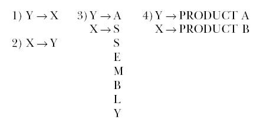

## 25
  
  
D´ ej\`a vu. At the airport next morning, I again greet Jonah as he walks out of Gate Two.  
  
 By ten o’clock, we’re in the conference room at the plant. Sitting around the table are Lou, Bob, Ralph and Stacey. Jonah paces in front of us.  
  
 "Let’s start with some basic questions,’’ he says. "First of all, have you determined exactly which parts are giving you the problem?’’  
  
 Stacey, who is sitting at the table with a veritable fortress of paper around her and looking as if she’s ready for a siege, holds up a list.  
  
 She says, "Yes, we’ve identified them. In fact, I spent last night tracking them down and double checking the data with what’s on the floor out there. Turns out the problem covers thirty parts.’’  
  
 Jonah asks, "Are you sure you released the materials for them?’’  
  
 "Oh, yes,’’ says Stacey. "No problem there. They’ve been released according to schedule. But they’re not reaching final assembly. They’re stuck in front of our new bottleneck.’’  
  
 "Wait a minute. How do you know it’s really a bottleneck?’’ asks Jonah.  
  
 She says, "Well, since the parts are held up, I just figured it had to be...’’  
  
 "Before we jump to conclusions, let’s invest half an hour to go into the plant so we can find out what’s happening,’’ Jonah says.  
  
 So we parade into the plant, and a few minutes later we’re standing in front of a group of milling machines. Off to one side are big stacks of inventory marked with green tags. Stacey stands there and points out the parts that are needed in final assembly. Most of the missing parts are right here and all bear green tags. Bob calls over the foreman, a hefty guy by the name of Jake, and introduces him to Jonah.  
  
 "Yeah, all them parts been sittin’ here for about two, three weeks or more,’’ says Jake.  
  
 "But we need them now,’’ I say. "How come they’re not being worked on?’’  
  
 Jake shrugs his shoulders. "You know which ones you want, we’ll do ’em right now. But that goes against them rules you set up in that there priority system.’’  
  
 He points to some other skids of materials nearby.  
  
 "You see over there?’’ says Jake. "They all got red tags. We got to do all of ’em before we touch the stuff with green tags. That’s what you told us, right?’’  
  
 Uh-huh. It’s becoming clear what’s been happening.  
  
 "You mean,’’ says Stacey, "that while the materials with green tags have been building up, you’ve been spending all your time on the parts bound for the bottlenecks.’’  
  
 "Yeah, well, most of it,’’ says Jake. "Hey, like we only got so many hours in a day, you know what I mean?’’  
  
 "How much of your work is on bottleneck parts?’’ asks Jonah.  
  
 "Maybe seventy-five or eighty percent,’’ says Jake. "See, everything that goes to heat-treat or the NCX-10 has to pass through here first. As long as the red parts keep coming—and they haven’t let up one bit since that new system started—we just don’t have the time to work on very many of the green-tag parts.’’  
  
 There is a moment of silence. I look from the parts to the machines and back to Jake again.  
  
 "What the hell do we do now?’’ asks Donovan in echo to my own thoughts. "Do we switch tags? Make the missing parts red instead of green?’’  
  
 I throw up my hands in frustration and say, "I guess the only solution is to expedite.’’  
  
 "No, actually, that is not the solution at all,’’ Jonah says, "because if you resort to expediting now, you’ll have to expedite all the time, and the situation will only get worse.’’  
  
 "But what else can we do?’’ asks Stacey.  
  
 Jonah says, "First, I want us to go look at the bottlenecks, because there is another aspect to the problem.’’  
  
 Before we can see the NCX-10, we see the inventory. It’s stacked as high as the biggest forklift can reach. It’s not just a mountain, but a mountain with many peaks. The piles here are even bigger than before we identified the machine as a bottleneck. And tied to every bin, hanging from every pallet of parts is a red tag. Somewhere behind it all, its own hugeness obscured from our view, is the NCX-10.  
  
 "How do we get there from here?’’ asks Ralph, looking for a path through the inventory.  
  
 "Here, let me show you,’’ says Bob.  
  
 And he leads us through the maze of materials until we reach the machine.  
  
 Gazing at all the work-in-process around us, Jonah says to us, "You know, I would guess, just from looking at it, that you have at least a month or more of work lined-up here for this machine. And I bet if we went to heat-treat we would find the same situation. Tell me, do you know why you have such a huge pile of inventory here?’’  
  
 "Because everyone ahead of this machine is giving first priority to red parts,’’ I suggest.  
  
 "Yes, that’s part of the reason,’’ says Jonah. "But why is so much inventory coming through the plant to get stuck here?’’  
  
 Nobody answers.  
  
 "Okay, I see I’m going to have to explain some of the basic relationships between bottlenecks and non-bottlenecks,’’ says Jonah. Then he looks at me and says, "By the way, do you remember when I told you that a plant in which everyone is working all the time is very in efficient? Now you’ll see exactly what I was talking about.’’  
  
 Jonah walks over to the nearby Q.C. station and takes a piece of chalk the inspectors use to mark defects on the parts they reject. He kneels down to the concrete floor and points to the NCX-10.  
  
 "Here is your bottleneck,’’ he says, "the X-what-ever-it-is machine. We’ll simply call it ‘X.’’’  
  
 He writes an X on the floor. Then he gestures to the other machines back down the aisle.  
  
 "And feeding parts to X are various non-bottleneck machines and workers,’’ he says. "Because we designated the bottleneck as X, we’ll refer to these non-bottlenecks as ‘Y’ resources. Now, for the sake of simplicity, let’s just consider one non-bottleneck in combination with one bottleneck . . .’’  
  
 With the chalk, he writes on the floor:  
  
Y --> X Product parts are what join the two in a relationship with each other, Jonah explains, and the arrow obviously indicates the flow of parts from one to the other. He adds that we can consider any non-bottleneck feeding parts to X, because no matter which one we choose, its inventory must be processed at some subsequent point in time by X.  
  
"By the definition of a non-bottleneck, we know that Y has extra capacity. Because of its extra capacity, we also know that Y will be faster in filling the demand than X,’’ says Jonah. "Let’s say both X and Y have 600 hours a month available for production. Because it is a bottleneck, you will need all 600 hours of the X machine to meet demand. But let’s say you need only 450 hours a month, or 75 percent, of Y to keep the flow equal to demand. What happens when Y has worked its 450 hours? Do you let it sit idle?’’  
  
Bob says, "No, we’ll find something else for it to do.’’ "But Y has already satisfied market demand,’’ says Jonah. Bob says, "Well, then we let it get a head start on next month’s work.’’  
  
 "And if there is nothing for it to work on?’’ asks Jonah. Bob says, "Then we’ll have to release more materials.’’ "And  that  is the problem,’’ says Jonah. "Because what happens to those extra hours of production from Y? Well, that inventory has to go somewhere. Y is faster than X. And by keeping Y active, the flow of parts to X must be greater than the flow of parts leaving X. Which means . . .’’  
  
He walks over to the work-in-process mountain and makes a sweeping gesture.  
  
 "You end up with all this in front of the X machine,’’ he says. "And when you’re pushing in more material than the system can convert into throughput, what are you getting?’’  
  
 "Excess inventory,’’ says Stacey.  
  
 "Exactly,’’ says Jonah. "But what about another combination? What happens when X is feeding parts to Y?’’  
  
 Jonah writes that on the floor with the chalk like this...  
  
 X --> Y  
  
"How much of Y’s 600 hours can be used productively here?’’ asks Jonah.  
  
 "Only 450 hours again,’’ says Stacey.  
  
 "That’s right,’’ says Jonah. "If Y is depending exclusively upon X to feed it inventory, the maximum number of hours it can work is determined by the output of X. And 600 hours from X equates to 450 hours for Y. After working those hours, Y will be starved for inventory to process. Which, by the way, is quite acceptable.’’  
  
 "Wait a minute,’’ I say. "We have bottlenecks feeding nonbottlenecks here in the plant. For instance, whatever leaves the NCX-10 will be processed by a non-bottleneck.’’  
  
 "From other non-bottlenecks you mean. And do you know what happens when you keep Y active that way?’’ asks Jonah. "Look at this.’’  
  
 He draws a third diagram on the floor with the chalk.  
  
Y →A X→S S E M B L Y  
  
In this case, Jonah explains, some parts do not flow through a bottleneck; their processing is done only by a non-bottleneck and the flow is directly from Y to assembly. The other parts do flow through a bottleneck, and they are on the X route to assembly where they are mated to the Y parts into a finished product.  
  
In a real situation, the Y route probably would consist of one non-bottleneck feeding another non-bottleneck, feeding yet another non-bottleneck, and so on, to final assembly. The X route might have a series of non-bottlenecks feeding a bottleneck, which in turn feeds a chain of more non-bottlenecks. In our case, Jonah says, we’ve got a group of non-bottleneck machines downstream from X which can process parts from either the X or the Y route.  
  
"But to keep it simple, I’ve diagrammed the combination with the fewest number of elements—one X and one Y. No matter how many non-bottlenecks are in the system, the result of activating Y just to keep it busy is the same. So let’s say you keep both X and Y working continuously for every available hour. How efficient would the system be?’’  
  
 "Super efficient,’’ says Bob.  
  
"No, you’re wrong,’’ says Jonah. "Because what happens when all this inventory from Y reaches final assembly?’’  
  
 Bob shrugs and says, "We build the orders and ship them.’’  
  
 "How can you?’’ asks Jonah. "Eighty percent of your products require at least one part from a bottleneck. What are you going to substitute for the bottleneck part that hasn’t shown up yet?’’  
  
 Bob scratches his head and says, "Oh, yeah ...I forgot.’’  
  
 "So if we can’t assemble,’’ says Stacey, "we get piles of inventory again. Only this time the excess inventory doesn’t accumulate in front of a bottleneck; it stacks up in front of final assembly.’’  
  
 "Yeah,’’ says Lou, "and another million bucks sits still just to keep the wheels turning.’’  
  
 And Jonah says, "You see? Once more, the non-bottleneck does not determine throughput, even if it works twenty-hour hours a day.’’  
  
 Bob asks, "Okay, but what about that twenty percent of products  without any bottleneck parts? We can still get high efficiencies with them.’’  
  
 "You think so?’’ asks Jonah.  
  
 On the floor he diagrams it like this...  
  
 Y →PRODUCT A X→PRODUCT B  
  
This time, he says, the X and Y operate independently of one another. They are each filling separate marketing demands.  
  
 "How much of Y’s 600 hours can the system use here?’’ asks Jonah.  
  
 "All of ’em,’’ says Bob.  
  
 "Absolutely not,’’ says Jonah. "Sure, at first glance it looks as if we can use one hundred percent of Y, but think again.’’  
  
 "We can only use as much as the market demand can absorb,’’ I say.  
  
 "Correct. By definition, Y has excess capacity,’’ says Jonah. "So if you work Y to the maximum, you once again get excess inventory. And this time you end up, not with excess work-inprocess, but with excess finished goods. The constraint here is not in production. The constraint is marketing’s ability to sell.’’  
  
 As he says this, I’m thinking to myself about the finished goods we’ve got crammed into warehouses. At least two-thirds of those inventories are products made entirely with non-bottleneck parts. By running non-bottlenecks for "efficiency,’’ we’ve built inventories far in excess of demand. And what about the remaining third of our finished goods? They have bottleneck parts, but most of those products have been sitting on the shelf now for a couple of years. They’re obsolete. Out of 1,500 or so units in stock, we’re lucky if we can sell ten a month. Just about all of the competitive  products with bottleneck parts are sold virtually as soon as they come out of final assembly. A few of them sit in the warehouse a day or two before they go to the customer, but due to the backlog, not many.  
  
 I look at Jonah. To the four diagrams on the floor, he has now added numbers so that together they look like this...  
  
  
  
Jonah says, "We’ve examined four linear combinations involving X and Y. Now, of course, we can create endless combinations of X and Y. But the four in front of us are fundamental enough that we don’t have to go any further. Because if we use these like building blocks, we can represent any manufacturing situation. We don’t have to look at trillions of combinations of X and Y to find what is universally true in all of them; we can generalize the truth simply by identifying what happens in each of these four cases. Can you tell me what you have noticed to be similar in all of them?’’  
  
Stacey points out immediately that in no case does Y ever determine throughput for the system. Whenever it’s possible to activate Y above the level of X, doing so results only in excess inventory, not in greater throughput.  
  
"Yes, and if we follow that thought to a logical conclusion,’’ says Jonah, "we can form a simple rule which will be true in every case: the level of utilization of a non-bottleneck is not determined by its own potential, but by some other constraint in the system.’’  
  
He points to the NCX-10.  
  
 "A major constraint here in your system is this machine,’’ says Jonah. "When you make a non-bottleneck do more work than this machine, you are not increasing productivity. On the contrary, you are doing exactly the opposite. You are creating excess inventory, which is against the goal.’’  
  
 "But what are we supposed to do?’’ asks Bob. "If we don’t keep our people working, we’ll have idle time, and idle time will lower our efficiencies.’’  
  
"So what?’’ asks Jonah.  
  
 Donovan is taken aback. "Beg pardon, but how the hell can you say that?’’  
  
 "Just take a look behind you,’’ says Jonah. "Take a look at the monster you’ve made. It did not create itself. You have created this mountain of inventory with your own decisions. And why? Because of the wrong assumption that you must make the workers produce one hundred percent of the time, or else get rid of them to ‘save’ money.’’  
  
 Lou says, "Well, granted that maybe one hundred percent is unrealistic. We just ask for some acceptable percentage, say, ninety percent.’’  
  
 "Why is ninety percent acceptable?’’ asks Jonah. "Why not sixty percent, or twenty-five? The numbers are meaningless unless they are based upon the constraints of the system. With enough raw materials, you can keep one worker busy from now until retirement. But should  you do it? Not if you want to make money.’’  
  
 Then Ralph suggests, "What you’re saying is that making an employee work and profiting from that work are two different things.’’  
  
 "Yes, and that’s a very close approximation of the second rule we can logically derive from the four combinations of X and Y we talked about,’’ says Jonah. "Putting it precisely, activating a resource and utilizing a resource are not synonymous.’’  
  
 He explains that in both rules, "utilizing’’ a resource means making use of the resource in a way that moves the system toward the goal. "Activating’’ a resource is like pressing the ON switch of a machine; it runs whether or not there is any benefit to be derived from the work it’s doing. So, really, activating a non-bottleneck to its maximum is an act of maximum stupidity.  
  
 "And the implication of these rules is that we must not seek to optimize every resource in the system,’’ says Jonah. "A system of local optimums is not an optimum system at all; it is a very inefficient system.’’  
  
 "Okay,’’ I say, "but how does knowing this help us get the missing parts unstuck at the milling machines and moved to final assembly?’’  
  
 Jonah says, "Think about the build-up of inventory both here and at your milling machines in terms of these two rules we just talked about.’’  
  
 "I think I see the cause of the problem,’’ Stacey says, "We’re releasing material faster than the bottlenecks can process it.’’  
  
 "Yes,’’ says Jonah. "You are sending work onto the floor whenever nonbottlenecks are running out of work to do.’’  
  
 I say, "Granted, but the milling machines are a bottleneck.’’  
  
 Jonah shakes his head and says, "No, they are not—as evidenced by all this excess inventory behind you. You see, the milling machines are not intrinsically a bottleneck. You have turned them into one.’’  
  
 He tells us that with an increase in throughput, it is possible to create new bottlenecks. But most plants have so much extra capacity that it takes an enormous increase in throughput before this happens. We’ve only had a twenty percent increase. When I had talked to him by phone, he thought it unlikely a new bottleneck would have occurred.  
  
 What happened was that even as throughput increased, we continued loading the plant with inventory as if we expected to keep all our workers fully activated. This increased the load dumped upon the milling machines and pushed them beyond their capacity. The first-priority, red-tagged parts were processed, but the green-tagged parts piled up. So not only did we get excess inventory at the NCX-10 and at heat-treat, but due to the volume of bottleneck parts, we clogged the flow at another work center and prevented non-bottleneck parts from reaching assembly.  
  
 When he’s finished, I say, "All right, I see now the error of our ways. Can you tell us what we should do to correct the problem?’’  
  
 "I want you all to think about it as we walk back to your conference room and then we’ll talk about what you should do,’’ says Jonah. "The solution is fairly simple.’’  
  
