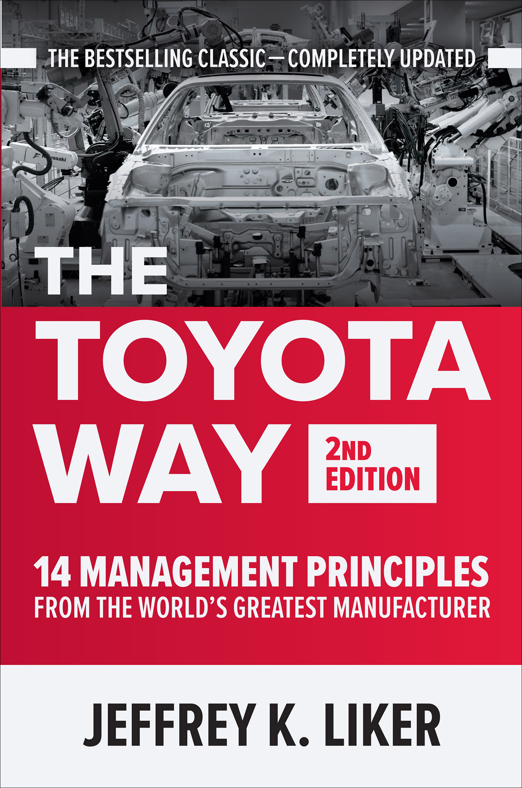
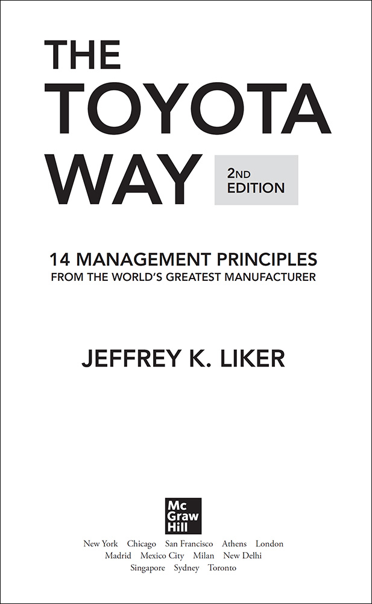

# Annotation

\*\*The bestselling guide to Toyota's legendary philosophy and production system --updated with important new frameworks for driving innovation and quality in your business\*\*

One of the most impactful business guides published in the 21st Century, The Toyota Way played an outsized role in launching the continuous-improvement movement that continues unabated today.

Multiple Shingo Award-winning management and operations expert Jeffrey K. Liker provides a deep dive into Toyota's world-changing processes, showing how you can learn from it to develop your own improvement program that fits your conditions. Thanks in large part to this book, managers across the globe are creating workforces and systems that produce the highest-quality products and services, establish and retain customer loyalty, and drive business profitability and sustainability. Now, Liker has thoroughly updated his classic guide to include:

  
\* Completely revised data and updated...

  
---

---

**PRAISE FOR JEFF LIKER AND _THE TOYOTA WAY_, 2ND EDITION**

New technology is disrupting the automotive industry dramatically and on a massive scale. Toyota is responding by seeking to strengthen its core values and develop new capabilities in software and mobility services. Jeff Liker has brought together both objective data and expert analysis, and has delivered a thought-provoking, insightful narrative on the Toyota Way to navigating challenges.

—James Kuffner, PhD , CEO of Toyota Research Institute–Advanced Development and Toyota Director

An update adding value by providing more guidance for successful implementation of a company excellence system. The additional material on lean deployment characteristics, developing habits, work group structure and leader development, lean in a digital age, and value stream mapping provide a useful insight for all companies in the ever-changing, unpredictable digital world.

—Nicholas Day, Head of Airbus Operating System in France, Central Function, Airbus SAS

In the second edition of _The Toyota Way,_ Dr. Liker brings his valuable insights on execution, the importance of people, and the behaviors of each and every employee that eventually shape an organization’s culture. It dawns on the reader that it’s not just the tools and methods that make the Toyota Production System what it is, but the relentless focus on incremental improvement using meaningful gemba walks, structured toolsets or “scientific thinking,” and the role management plays in promoting the desired behaviors that over time get ingrained in the way work is performed.

—Vic Ganesan, Director Operations Excellence, thyssenkrupp Materials NA

Copyright © 2021 by Jeffrey K. Liker. All rights reserved. Except as permitted under the United States Copyright Act of 1976, no part of this publication may be reproduced or distributed in any form or by any means, or stored in a database or retrieval system, without the prior written permission of the publisher.

ISBN: 978-1-26-046852-6

MHID: 1-26-046852-6

The material in this eBook also appears in the print version of this title: ISBN: 978-1-26-046851-9, MHID: 1-26-046851-8.

eBook conversion by codeMantra

Version 1.0

All trademarks are trademarks of their respective owners. Rather than put a trademark symbol after every occurrence of a trademarked name, we use names in an editorial fashion only, and to the benefit of the trademark owner, with no intention of infringement of the trademark. Where such designations appear in this book, they have been printed with initial caps.

McGraw-Hill Education eBooks are available at special quantity discounts to use as premiums and sales promotions or for use in corporate training programs. To contact a representative, please visit the Contact Us page at [www.mhprofessional.com](./http___www.mhprofessional.com).

This publication is designed to provide accurate and authoritative information in regard to the subject matter covered. It is sold with the understanding that neither the author nor the publisher is engaged in rendering legal, accounting, securities trading, or other professional services. If legal advice or other expert assistance is required, the services of a competent professional person should be sought.

—_From a Declaration of Principles Jointly Adopted by a Committee of the_

_American Bar Association and a Committee of Publishers and Associations_

TERMS OF USE

This is a copyrighted work and McGraw-Hill Education and its licensors reserve all rights in and to the work. Use of this work is subject to these terms. Except as permitted under the Copyright Act of 1976 and the right to store and retrieve one copy of the work, you may not decompile, disassemble, reverse engineer, reproduce, modify, create derivative works based upon, transmit, distribute, disseminate, sell, publish or sublicense the work or any part of it without McGraw-Hill Education’s prior consent. You may use the work for your own noncommercial and personal use; any other use of the work is strictly prohibited. Your right to use the work may be terminated if you fail to comply with these terms.

THE WORK IS PROVIDED “AS IS.” McGRAW-HILL EDUCATION AND ITS LICENSORS MAKE NO GUARANTEES OR WARRANTIES AS TO THE ACCURACY, ADEQUACY OR COMPLETENESS OF OR RESULTS TO BE OBTAINED FROM USING THE WORK, INCLUDING ANY INFORMATION THAT CAN BE ACCESSED THROUGH THE WORK VIA HYPERLINK OR OTHERWISE, AND EXPRESSLY DISCLAIM ANY WARRANTY, EXPRESS OR IMPLIED, INCLUDING BUT NOT LIMITED TO IMPLIED WARRANTIES OF MERCHANTABILITY OR FITNESS FOR A PARTICULAR PURPOSE. McGraw-Hill Education and its licensors do not warrant or guarantee that the functions contained in the work will meet your requirements or that its operation will be uninterrupted or error free. Neither McGraw-Hill Education nor its licensors shall be liable to you or anyone else for any inaccuracy, error or omission, regardless of cause, in the work or for any damages resulting therefrom. McGraw-Hill Education has no responsibility for the content of any information accessed through the work. Under no circumstances shall McGraw-Hill Education and/or its licensors be liable for any indirect, incidental, special, punitive, consequential or similar damages that result from the use of or inability to use the work, even if any of them has been advised of the possibility of such damages. This limitation of liability shall apply to any claim or cause whatsoever whether such claim or cause arises in contract, tort or otherwise.

_To Deb, Emma, and Jesse_ _and Our Amazing Life Journey_

**Contents**

Foreword (to the First Edition) by Gary Convis

Acknowledgments

Preface: The Wonderful Wacky World of Lean

INTRODUCTION The Toyota Way: Using Operational Excellence as a Strategic Weapon

A Storied History: How Toyota Became the World’s Best Manufacturer

PART ONE

PHILOSOPHY: LONG-TERM SYSTEMS THINKING

PRINCIPLE 1 Base Your Management Decisions on Long-Term Systems Thinking, Even at the Expense of Short-Term Financial Goals

PART TWO

PROCESS: STRUGGLE TO FLOW VALUE TO EACH CUSTOMER

PRINCIPLE 2 Connect People and Processes Through Continuous Process Flow to Bring Problems to the Surface

PRINCIPLE 3 Use “Pull” Systems to Avoid Overproduction

PRINCIPLE 4 Level Out the Workload, Like the Tortoise, Not the Hare (Heijunka)

PRINCIPLE 5 Work to Establish Standardized Processes as the Foundation for Continuous Improvement

PRINCIPLE 6 Build a Culture of Stopping to Identify Out-of-Standard Conditions and Build in Quality

PRINCIPLE 7 Use Visual Control to Support People in Decision-Making and Problem Solving

PRINCIPLE 8 Adopt and Adapt Technology That Supports Your People and Processes

PART THREE

PEOPLE: RESPECT, CHALLENGE, AND GROW YOUR PEOPLE AND PARTNERS TOWARD A VISION OF EXCELLENCE

PRINCIPLE 9 Grow Leaders Who Thoroughly Understand the Work, Live the Philosophy, and Teach It to Others

PRINCIPLE 10 Develop Exceptional People and Teams Who Follow Your Company’s Philosophy

PRINCIPLE 11 Respect Your Value Chain Partners by Challenging Them and Helping Them Improve

PART FOUR

PROBLEM SOLVING: THINK AND ACT SCIENTIFICALLY TO IMPROVE TOWARD A DESIRED FUTURE

PRINCIPLE 12 Observe Deeply and Learn Iteratively (PDCA) to Meet Each Challenge

PRINCIPLE 13 Focus the Improvement Energy of Your People Through Aligned Goals at All Levels

PRINCIPLE 14 Learn Your Way to the Future Through Bold Strategy Some Large Leaps, and Many Small Steps

PART FIVE

CONCLUSION: BE THOUGHTFUL AND EVOLVE YOUR ENTERPRISE

Grow Your Own Lean Learning Enterprise—Getting Ideas and Inspiration from the Toyota Way

APPENDIX An Executive Summary and Assessment of the 14 Principles

Glossary

For Further Reading

Index

