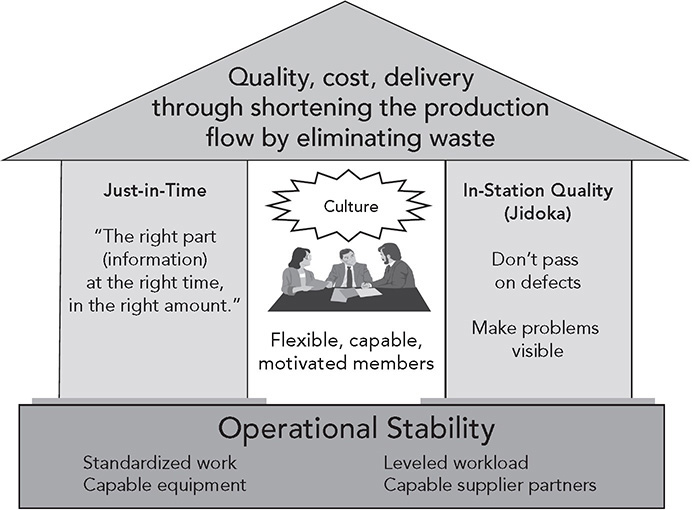
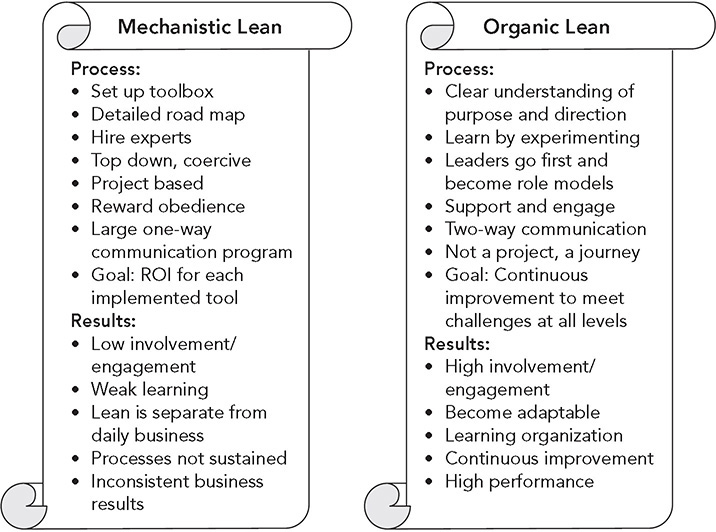

Preface

**The Wonderful Wacky World of Lean**

_We want organizations to be adaptive, flexible, self-renewing, resilient, learning, intelligent—attributes found only in living systems. The tension of our times is that we want our organizations to behave as living systems, but we only know how to treat them as machines._

—Margaret J. Wheatley, author of _Finding Our Way: Leadership for an Uncertain Time_

**THE PROBLEM: MISUNDERSTANDING OF LEAN AND “HOW IT APPLIES HERE”**

Nobody can reasonably question the global impact of Toyota’s system of management and manufacturing on the world today. The Toyota Production System (TPS) is the framework for what is often call “lean” management and has been embraced in mining, retail, defense, healthcare, construction, government, finance, or name your sector. While we might assume that senior TPS experts, called “sensei,” or teachers, are delighted to see the system they are passionate about used in so many different industries, the reality is they are often disappointed and frustrated by how lean programs have turned a beautiful living system into a lifeless tool kit.

The problem is that so many have the view described by Margaret J. Wheatley in the opening quote and think that their organization is like a machine. Too many business executives are driven by the desire for certainty and control, and by the assumption that decisions made at the top of the organization will be carried out in a planned and orderly way. Anyone who has been on the shop floor guiding a “lean conversion” knows this is far from the truth. What happens is disorderly and surprising. A good consultant understands how to take positive advantage of unintended consequences for learning.

I have consulted to and taught leaders of companies all over the world who have the mistaken belief that lean transformation can be planned and controlled, just like updating your computer software (and even that may not go as planned). I consulted with a nuclear energy company whose vice president of continuous improvement believed his lean program was going gangbusters for the last three years. He proudly described a lengthy “lean assessment” that was tied to plant managers’ bonuses and his attempts to quickly deploy lean tools across the enterprise.

The VP was a bit concerned when his CEO requested Toyota’s help and Toyota loaned the organization one of its most senior TPS sensei, a student of the famed Taichii Ohno, father of the Toyota Production System. In Japan “sensei” suggests _honored_ teacher, and it’s expected that students listen respectfully and follow the sensei’s lead. After the VP described the company’s lean program to the TPS master, he expected praise and congratulations. Instead, the sensei said, “Please stop doing that”—meaning stop doing assessments, stop value stream mapping all the processes, stop connecting implementation to bonuses, and stop trying to rapidly deploy the company’s version of lean across all manufacturing and service departments. Instead, the sensei said to start a “model line” example of TPS in a single department on a nuclear fuel production line and stop everything else. This would be a pilot led by the sensei to demonstrate TPS as a system and learn from it.

I spent two hours with the frustrated and confused vice president, who bemoaned: “Why did he want us to stop our good progress? Why did he want us to go slow like a snail when we have hundreds of thousands of people to train? How does he think he is going to get managers on board without any financial incentive?”

I tried to explain the thinking of the Japanese sensei. In a nutshell, I said, the Toyota Production System is a total “living system.” The goal is to produce a continual flow of value to the customer, without interruptions known as wastes. Toyota often uses the analogy of a free-flowing river, without stagnant pools and without big rocks or other obstacles slowing the flow. To accomplish this type of free flow in a business setting requires a system of people, equipment, and processes that operate at peak performance. And since the world is constantly changing, variability has to be addressed through continuous improvement by the people closest to the “gemba” (or properly spelled “genba”),\* which means where the work is performed.

I went on, “The Toyota master trainer looks at your operations and sees assorted tools of TPS mechanistically scattered around. But nowhere is lean operating as an organic system of people using tools for continuous improvement. He wants you to see and experience real TPS and the results that are possible, at least once in one part of your company, before you start broadly trying to spread something nobody really understands. Trying to do it right one time in one area does not seem to him like a lot to ask.”

I could see the lightbulbs going on for the vice president as he listened and asked more questions. It seemed he was getting it. He lamented that the Toyota sensei had not explained TPS in this way before. He also explained that when he told the Toyota advisor that he was bringing me in to teach people about lean product development, the sensei responded that it would be a “waste of time.” I explained that the sensei was saying you are not ready to move beyond manufacturing since you had not a single example of a lean system. It is like asking beginning piano students to learn a Bach sonata before they can even put their fingers on the right keys and play a scale. As I was feeling proud of myself for enlightening this struggling soul, I saw the lightbulbs go dark again.

Finally, the VP confessed that he had not stopped anything—not the lean assessments tied to plant manager bonuses and not the rapid deployment of lean tools across the enterprise. In fact, he had brought me in to help “deploy” lean product development despite the sensei’s warning. He said the Toyota sensei did not understand that the nuclear energy company was very large and it was vital to spread lean as rapidly as possible. Such are my triumphs . . . and failures . . . as a consultant trying to persuade people. The sensei was right—even my best attempts to try to teach lean product development to this organization were a “waste of time.”

Lean, along with variations such as six sigma, theory of constraints, lean startup, lean six sigma, and agile development, is a global movement. As in any management movement, there are true believers, resisters, and those who get on the bandwagon but do not care a lot one way or the other. There is a plethora of service providers through universities, consulting firms of various sizes, not-for-profit organizations, and a book industry promoting the movement. For zealots like me, this is in a sense a good thing—they are building consumers of my message. But there is also a downside. As the message spreads and is passed through many people, companies, and cultures, it changes from the original, like the game of telephone in which the message whispered to the first person bears little resemblance to the message the tenth person hears.

Meanwhile, well-meaning organizations that want to solve their problems are searching for answers. What is lean and how does it relate to six sigma and agile? How do we get started? How do these tools that were developed in Toyota for making cars apply to our organization that has a completely different product or service? Can lean work in our culture, which is very different from Japanese culture? Can we upgrade lean methods using the latest digital technology? Do the tools have to be used exactly as they are in Toyota, or can they be adapted to our circumstances? And how does Toyota reward people for using these tools to improve?

These are all reasonable questions, and there are lines of people ready to answer them, often in very different ways. But the starting point should be the questions themselves. Are these the right questions? As reasonable as they seem, I believe they are the wrong questions. The underlying assumption in each case is that lean is a mechanistic tool-based process to be implemented as you would install a hardware or software upgrade. Specifically, the assumptions can be summarized as:

1\. There is one clear and simple approach to lean that is very different from alternative methodologies.

2\. There is one clear and best way to get started.

3\. Toyota is a simple organization that does one thing—builds cars—and uses a core set of the same tools in the same way everyplace.

4\. The tools are the essence of lean and therefore must be adapted to specific types of processes.

5\. There may be something peculiar about lean, as it was developed in Japan, that has to be modified to fit cultures outside Japan.

6\. Toyota has a precise method of applying the tools in the same way everyplace that others need to copy.

7\. The formal reward system is the reason why people in Toyota are engaged in continuous improvement and motivated to support the company.

In fact, none of these assumptions are true, and that is the problem—there is a huge gap between common views of lean and the reality of how Toyota evolved this powerful management system for over one century and how it can help your organization accomplish its goals.

My goal in this book is to give you a very clear understanding of what “lean,” or “lean six sigma,” or whatever you want to call it, really is: a philosophy and a system of interconnected processes and people who are working to continuously improve how they work and deliver value to customers. We will start by dismissing the common and simplistic notion that it is a program of using tools to remove waste from processes. If this is your organization’s view, you are doomed to mediocre results, and you likely will embrace the next management fad with similar mediocre results. I have seen this happen time and time again.

To help break through this cycle, I will demonstrate the real meaning of what Toyota discovered through discussions of the origin of the Toyota Way, the 14 principles I have distilled (summarized in the Appendix), and actual examples of organizations in manufacturing and services that have made progress on the challenging road to becoming a lean enterprise.

**THE REAL TOYOTA PRODUCTION SYSTEM**

Until recently, Toyota never used the term “lean” to refer to its production system. At first it had no name at all. It was simply the way the fledgling auto company learned to manufacture cars and trucks in the 1940s in order to deal with very real problems the company faced when first formed. The problems were clear—the company did not have money, it had limited factory space, and parts suppliers had to take a risk and invest in factories and equipment along with Toyota. Demand for automobiles in Japan after the devastation of World War II was low. The company struggled to get funding and had no choice but to eliminate waste. In response, it made low volumes of multiple models of vehicles on the same production line. It kept inventories low, because it lacked storage space and could not afford to tie up cash in parts or finished vehicles. And it kept lead times short both in the procurement and utilization of parts and in the production and sale of vehicles. All of this lowered production costs and enabled Toyota to get cash fast and, in turn, to pay suppliers (which were also struggling financially) quickly. (See a further discussion of Toyota’s history in “A Storied History: How Toyota Became the World’s Best Manufacturer” in the Introduction.)

A cornerstone of the Toyota Way is “challenge,” and there was no shortage of challenges. When Toyota was struggling to survive in its early years, with few resources and very low demand, Taiichi Ohno was asked to find a way to match Ford Motor Company’s productivity, which, owing to its size and economies of scale, was about nine times greater than that of Toyota. Faced with a seemingly impossible task, Ohno did what every Toyota leader has done before and after—go to the gemba, experiment, and learn. And like other great Toyota leaders he succeeded. He built on the core philosophies and methods of founders Sakichi Toyoda and his son Kiichiro Toyoda to develop the framework now called the Toyota Production System.

Ohno originally did not want TPS drawn as a picture, because he said TPS was something live on the shop floor, not something dead in a drawing. He said, “If we write it down, we kill it.” Nonetheless, it was eventually drawn as a house with two pillars and a foundation (see Figure P.1), a structure that is only as strong as all the parts working together.

**Figure P.1** The Toyota Production System.

The in-station quality pillar is attributed to Sakichi Toyoda, who invented the first fully automated loom for making cloth. One of his many inventions along the way was a device that automatically stopped the loom when a single thread broke, which called attention to the problem so humans could fix it as quickly as possible. He called this “jidoka,” a machine with human intelligence. These days it is often referred to as in-station quality—which means, don’t let a defect escape your station. The second pillar is just-in-time, attributed to Kiichiro Toyoda, who founded the automotive company. He declared Toyota would “remove slack from all work processes” and follow the principles of JIT—a move that was necessary at the time just to avoid bankruptcy. He designed detailed processes for doing this. The foundation of the house in the figure, or the company by extension, is operational stability, which means a level, stable workflow. A smooth and steady flow of work is necessary to have any chance of achieving just-in-time flow (Principles 2, 3, and 4) and fixing problems as they occur (Principle 6). And at the center of these processes are flexible, capable, motivated people who are devoted to continually improving (Principles 9, 10, and 11).

If we step back from the model, we see a brilliant logic. It is a living, organic system. The missing safety net—lots of inventory (or time or information buffers)—means problems show themselves very quickly and must be solved quickly. Built-in quality comes about as abnormalities are identified by every team member and addressed before they can bleed out to later processes or to the customer. As the problems are solved, the foundation of stability becomes stronger, allowing for less inventory, better flow, and a smaller number of problems, most of which can be effectively controlled as they occur.

At the center of surfacing and solving problems are developed people (Principle 12). They are the brains doing the problem solving. Take away their brains and motivation to improve, and what you have left is a system that hopelessly runs itself into the ground. Continuous improvement means getting better every day and is the driver for building a sustainable enterprise. Only those at the gemba can understand the problems fast enough to react quickly. Continuous improvement depends on a different paradigm of the role of the human—all humans are problem detectors and problem correctors—thinking scientifically.

James Womack, Dan Jones, and Dan Roos called “lean production” the next paradigm beyond craft production and mass production in their classic 1991 book _The Machine That Changed the World_:1

_The lean producer . . . combines the advantages of craft and mass production, while avoiding the high cost of the former and the rigidity of the latter. . . . Lean production is “lean” because it uses less of everything compared with mass production—half the human effort in the factory, half the manufacturing space, half the investment in tools, half the engineering hours to develop a new product in half the time. Also, it requires keeping far less than half the needed inventory on site, results in many fewer defects, and produces a greater and ever-growing variety of products._

One of the greatest insights in this simple explanation is the idea of combining the “advantages of craft and mass production.” Lean production was not entirely new, and it did not toss away concepts from craft or mass production; rather, it built on the strengths of each, with a few twists. Even in today’s digital age Toyota reveres the craftsworker. I emphasize throughout this book how much Toyota places people at the center of its systems and expects that they spend a lifetime working to perfect their craft. “Use all your senses” is a common Toyota refrain to fully understand what you are working on and how to improve it.

**THE TOYOTA PRODUCTION SYSTEM AS A MIX OF ORGANIC AND MECHANISTIC**

In contrast to mechanistic organizations, “organic organizations are living systems, evolving, adapting, and innovating to keep pace with our complex, rapidly changing world.” According to BusinessDictionary.com, an organic organization is an:

_organizational structure characterized by (1) Flatness: communications and interactions are horizontal, (2) Low specialization: knowledge resides wherever it is most useful, and (3) Decentralization: great deal of formal and informal participation in decision making. Organic organizations are comparatively more complex and harder to form, but are highly adaptable, flexible, and more suitable where external environment is rapidly changing and is unpredictable._

My fascination with production systems began when I was an undergraduate industrial engineering student at Northeastern University and was first exposed to organic organization structure. In 1972, I began a cooperative-education assignment at General Foods Corporation (since merged and acquired several times). Little did I know at the time that General Foods was a pioneer in sociotechnical systems, which were intended to “jointly optimize the social and technical systems.” General Foods had applied the approach in dog food plants where “self-directed work teams” were at the center of processes. It worked. Performance improved over traditional top-down command and control organizations.

In 1982, after taking a job as an assistant professor of industrial and operations engineering at the University of Michigan, I was exposed to Japanese manufacturing. What I discovered was that Toyota, in particular, stood out to me as an example of an organization with a systems perspective, but its focus was different from the autonomous work groups I first saw at General Foods. It contained some elements that were mechanistic and others that were organic.

The source of my confusion started to come into focus when I read the work of then Stanford assistant professor Paul Adler. Adler was excited to study the new Toyota–General Motors joint venture, NUMMI, in Fremont, California. He had read about the incredible quality and productivity of the plant and how Toyota was bringing organic forms of organization to the most rigid of bureaucracies—the assembly plant. How in the world was Toyota making such a regimented process as a moving assembly line organic? When he toured the plant, what he saw was baffling. In many ways it was one of the most bureaucratic organizations he had ever seen. Rules and procedures were visible everywhere. All these artifacts suggested a highly regimented organization in which workers were tightly controlled.

Yet on further study he found workers were organized in work groups with team leaders and group leaders and everyone was deeply engaged in improvement (Principle 10), what the Japanese called “kaizen.” Morale was high, absenteeism and turnover were low, and the general climate was one of openness and learning. Toyota had hired back over 80 percent of the workers from when the plant was owned and managed by General Motors. Back then, the employees were reported to be angry and rebellious—and were represented by a militant union. Absenteeism, wildcat strikes, drugs, alcohol, prostitution, and every other societal ill imaginable ran rampant in the GM plant. Everyone wanted to know, how did Toyota turn around this plant in its first year of production and create an organization that combined mechanistic and organic organizations?

Adler came up with a bold new distinction. He concluded that bureaucracy was not a single and monolithic organizational form, but rather had different flavors. Most bureaucracies at the time were “coercive” and focused on control of people. Workers were expected to keep their heads down, do what they were told, and avoid thinking. At NUMMI, Adler observed what he called an “enabling bureaucracy,” which served to empower the workforce to generate creative ideas and continuously improve. He described Toyota as turning classical industrial engineering on its head. As Adler, in his article “Time and Motion Regained,”2 observed:

_Formal work standards developed by industrial engineers and imposed on workers are alienating. But procedures that are designed by the workers themselves in a continuous and successful effort to improve productivity, quality, skills, and understanding can humanize even the most disciplined forms of bureaucracy. Moreover, NUMMI shows that hierarchy can provide support and expertise instead of a mere command structure._

John Krafcik, who originally came up with the term “lean production” as a student at MIT, tells a great story in his seminal article on lean production.3 As an undergraduate student, he had the opportunity to work at NUMMI. He recounts:

_One GM industrial-engineering manager, intent on discovering the real secret of the plant’s superb productivity and quality record, asked a high-ranking NUMMI executive (actually a Toyota executive from Japan on loan to the joint venture) how many industrial engineers worked at NUMMI. The executive thought for a while and replied, “We have 2100 team members working on the factory floor; therefore, we have 2100 industrial engineers.”_

**MECHANISTIC, ORGANIC, MIXED, AND LEAN MANAGEMENT**

Given all the distinctions among mechanistic organization, organic organization, and innovative combinations in enabling bureaucracy, how do most organizations deploy lean systems? I teach a three-day master class on lean leadership and pose this question to my “students,” who are mostly executives. With only a broad definition of the distinction between organic versus mechanistic deployment of lean, I ask them to call out characteristics of each. They typically do so enthusiastically. Figure P.2 is an example of some of the items generated in classes in England in 2019\. The participants delineated a clear difference between the mechanistic approach—project based, expert driven, top down, tools—and the organic approach—purpose driven, a journey, engaging people, coaching.

When I ask the students which they prefer and believe is most effective, they overwhelmingly vote for the organic approach. They usually say the mechanistic approach is faster and more efficient, but the organic approach is more robust and sustainable. Someone will inevitably point out that maybe it is not either-or, but there may be a role for both. I then describe enabling bureaucracy, and the lightbulbs go on. Heads nod, and they all agree that is what they are aiming for.

**Figure P.2** Master class delegate input—characteristics of mechanistic and organic lean deployment.

Most report that they are using a mechanistic approach and wonder if they should abandon that and move toward an organic approach. I answer that there may be some sense in starting with a broad mechanistic deployment led by lean specialists, as we saw at the beginning of the chapter, and then build on that base more organic approaches. The mechanistic approach often leads to measurable results and captures the interest of senior executives. There is an ROI. And the mechanistic approach can begin to establish a flow in the process and educate people about basic lean concepts. But if the rollout of lean is limited only to mechanistic deployment, the new systems are likely to devolve toward the original mass production systems when the lean specialists move on to other projects. In contrast, Toyota prefers to start organically with the model line process—learn deeply by starting with developing the system in one place—which takes more time and does not provide the quick results across the enterprise that many senior executives impatiently expect. On the other hand, the model line approach leads to deep learning and ownership by the managers and workforce, which is critical to building sustainability and continuous improvement in the new systems. We will discuss deployment approaches in the “Conclusion” chapter.

**LEARNING FROM TOYOTA WAY PRINCIPLES VERSUS COPYING TOYOTA PRACTICES**

Like any other author, I have my pet peeves about the way readers and reviewers interpret my books compared with my intentions. I’m sometimes accused of being a biased Toyota lover and not believing Toyota can do anything wrong. They believe I am portraying Toyota as organizational nirvana and that I am advocating that every company should try to be like Toyota. Yes, I greatly admire Toyota, and my battery is recharged every time I visit one of the company’s sites. But Toyota is far from perfect, and copying it is a bad idea.

I have spent enough time in Toyota to hear many complaints from Toyota managers and team members about the company and to learn of many chinks in the armor. For example, I once visited a plant and later got an email from an employee who informed me that the managers avoided showing me all the cars being repaired that day for defects. A veteran manager in that plant lamented to me that in the old days when there were Japanese trainers, metrics were used as a guide for improvement, and now “making the numbers” had become the main goal. Toyota is made up of people with all our human imperfections. Even when I lead tours of Toyota plants, employees openly share short periods where they went backward on key principles, such as failure to regularly update standardized work as improvements were made, difficulties in developing managers who deeply understand the Toyota Way, defects not being caught in process, and more.

Takahiro Fujimoto, a student of the Toyota Production System, explains that Toyota’s system can be best understood as developing in an evolutionary way, not in a brilliantly planned, prescient way:

_Although Toyota’s manufacturing system looks as if it were deliberately designed as a competitive weapon, it was created gradually through a complex historical process that can never be reduced to managers’ rational foresight alone.4_

Even Toyota factories do not blindly copy the “best practices” of other Toyota factories. Sure, all the plants have similar processes to stamp, mold, weld, paint, and assemble; that being the case, why not simply identify the best practices and require that they be replicated everywhere? But Toyota sensei will tell you that TPS should really stand for “Thinking Production System.” They want people to think. Copying is not thinking or learning. Toyota could try to enforce best practices from headquarters so everyone does things the same way, but then continuous improvement would die. The company would get compliance, not thinking.

The journey of learning from Toyota for more than 35 years has been life changing for me, and after all that time, I continue to admire Toyota as a great company. Toyota’s approach to scientific thinking and improving is a model to learn from. How can Toyota as a model help you develop a vision for your organization? What can you learn from the principles? What specific, high-priority challenges are you working on, and how can ideas from Toyota possibly help? There are no “solutions” from Toyota, but there is great wisdom that can help in crafting your vision for the future. It is also now clear to me that even great manufacturing processes that yield quality, low cost, and high-speed delivery are not enough. You need products and services customers want to buy and an appealing business proposition. You need strategy, and that will be unique to your company (Principle 14).

**WHAT IS NEW IN THE SECOND EDITION?**

In the original _The Toyota Way_, I introduced 14 principles of lean management organized around 4 Ps—philosophy, process, people, and problem solving. I have learned a lot since 2004 when the book was published. I wrote 11 more books about specific aspects of Toyota and consulted to many organizations. I learned so much from these experiences that I decided to update the original book. Here is a high-level summary of what is new:

1\. **Distinction between mechanistic and organic approaches.** I started using this as a framework in my courses to give students a clearer picture of what is different about the Toyota philosophy. It also helps bring the systems perspective to life.

2\. **Lean deployment as developing the mindset of scientific thinking.** My former student Mike Rother gave me his book _Toyota Kata_, and I found it corresponded with my observations at Toyota and filled in some gaps in my thinking. He noticed that despite the initial success of lean interventions, managers tended to resort to their previous habits and sustainment was difficult. He took to heart that Toyota worked to create a new way of thinking based on facts and experimenting in a scientific way. Rother researched how people learn new behaviors and skills and was inspired by the martial arts, where students learn to develop extraordinary physical capabilities. In karate, the term “kata” refers to small skills that are taught as habits through repeated practice with corrective feedback from the black belt. He applied this to developing in people the habit of thinking scientifically through repeated practice and corrective feedback. I discuss his approach under Principle 12 and often draw on the insights I gained from Mike throughout the book.

3\. **Revision of the 4P model.** The four Ps are the same, but I put in the center scientific thinking, which Taiichi Ohno referred to as the core of TPS and Mike Rother teaches through kata. There are still 14 principles, but I updated some of the wording, combined some, and added others. In particular, I almost completely revamped the “problem-solving” principles to focus on scientific thinking, policy deployment to align goals, and the connection between strategy and execution.

4\. **New examples.** I included descriptions of how lean has been applied in services and knowledge work, which drew on my research and writing for _The Toyota Way to Service_ _Excellence_5 and _Designing the Future_.6

5\. **A detailed explanation of Toyota’s work group structure.** I find there is a great deal of interest in the way Toyota develops leaders and organizes work groups, and it is quite different from the typical organization. Among other things, Toyota’s organizational structure encourages coaching and learning. I provide examples of this in Principle 10.

6\. **Streamlined parts of the book**_._ In the original, it took 6 chapters and 68 pages to reach the first principle, including chapters on developing the first Prius and first Lexus. In this new edition, I moved examples of how Toyota designs cars and its long-term product strategy into Principle 14\. I also tightened up the discussions of Toyota’s history and lean concepts.

7\. **Discussion of lean in the digital age.** In Principle 8 the discussion is about technology, including the internet of things, and in Principle 14 it is about how lean thinking can help more effectively develop and use new technology as part of a business strategy.

8\. **Glossary.** There are quite a few words that have specific meanings in the lean lexicon, so I included a short Glossary.7

The Toyota Way—the philosophy, not the book—is centered on learning by doing under the watchful eyes of a knowledgeable coach. You learn it at the gemba, not sitting in a comfortable chair reading a book. Nonetheless, I hope this book helps to stretch your vision about what is possible in your own organization. The people I know who have been part of a serious lean journey describe how much they learned and how they changed as individuals. It is about personal growth, clarifying your values, and developing confidence that you can make a difference. Please read, but then please do!

 KEY POINTS 

 _The Machine That Changed the World_ was based on studies of the Toyota Production System and popularized concepts of “lean production” across most sectors of society.

 The Toyota Production System is represented by a house with the twin pillars of just-in-time and jidoka resting on a foundation of stable, leveled processes. In the center are people continuously improving.

 In many ways, TPS methods resemble classical industrial engineering methods, but Toyota turned traditional IE on its head by empowering frontline team members to use the tools to improve their own processes.

 When an organization is looked at as a machine, mechanistic lean becomes a tool kit that is used to eliminate waste, as prescribed in classical industrial engineering.

 When an organization is viewed as a living system, organic lean focuses on people at all levels challenging the system and continually improving.

 The term “enabling bureaucracy” was introduced by Paul Adler to refer to a mix of mechanistic and organic elements, where structure, policies, and management support empower people to improve their processes.

 Toyota practices are not effective if benchmarked and copied, because they were developed as solutions to Toyota’s problems at a point in time. It is much better to learn from the principles and use them as ideas or inspiration in pursuit of your vision of excellence.

 The digital age has advanced to the point that there is a whole new level of lean systems possible that appropriately use these technologies to support people and processes.

**Notes**

1\. James P. Womack, Daniel T. Jones, and Daniel Roos, _The Machine That Changed the World: The Story of Lean Production_ (New York: Harper Perennial, November 1991).

2\. Paul S. Adler, “Time and Motion Regained,” _Harvard Business Review_, January–February 1993, pp. 97–108.

3\. J. F. Krafcik, “Triumph of the Lean Production System,” _Sloan Management Review_, 30, 1988, 41–52.

4\. Takahiro Fujimoto, _The Evolution of a Manufacturing System at Toyota_ (New York: Oxford University Press, 1999), pp. 5–6.

5\. Jeffrey Liker and Karyn Ross, _The Toyota Way to Service Excellence_ (New York: McGraw-Hill, 2016).

6\. James Morgan and Jeffrey Liker, _Designing the Future: How Ford, Toyota, and Other World-Class Organizations Use Lean Product Development to Drive Innovation and Transform Their Business_ (New York: McGraw-Hill, 2018).

7\. Chet Marchwinski, et. al., _Lean Lexicon: A Graphical Glossary for Lean Thinkers_, Brighton, Mass.: Lean Enterprise Institute, 2006.

\_\_\_\_\_\_\_\_\_\_\_\_\_\_\_\_\_\_\_\_\_\_\_\_\_\_\_\_

\* There is no _m_ sound in Japanese, and “genba” is the correct English version, though “gemba” has become common usage. Jim Womack explains this and other similar terms well in http://artoflean.com/index.php/2016/03/25/is-it-genba-or-gemba/.

