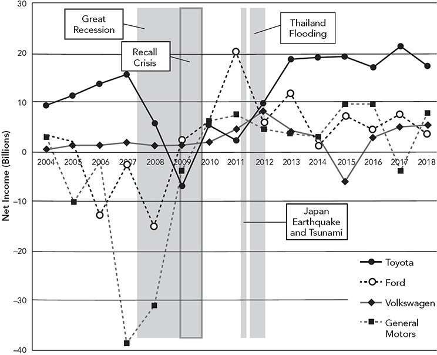
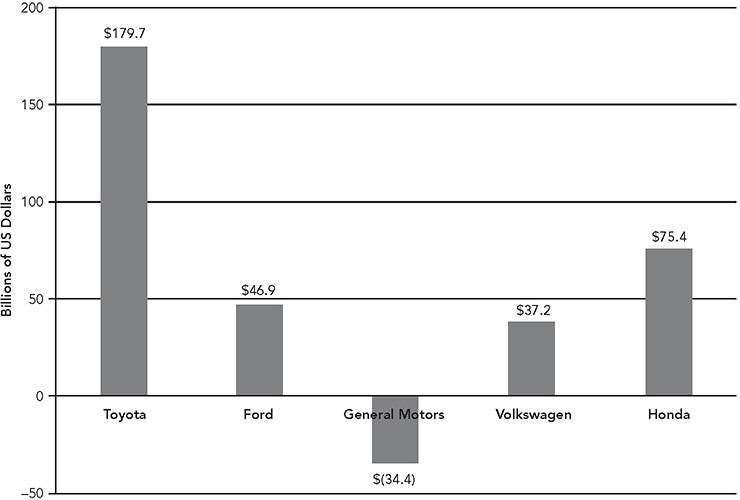
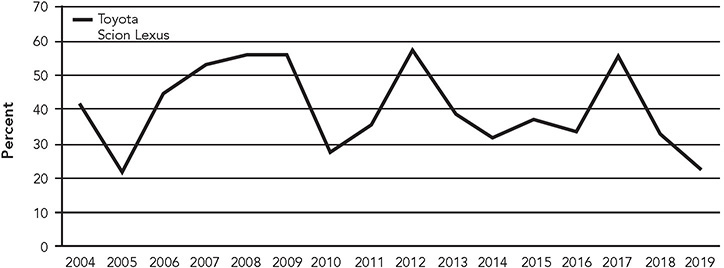
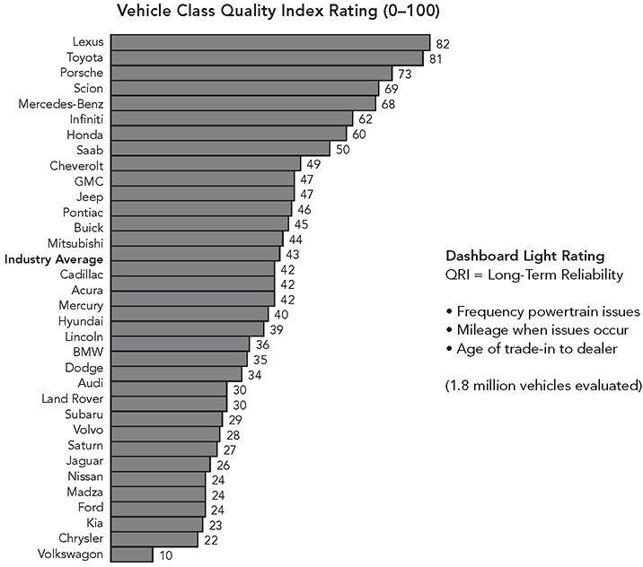
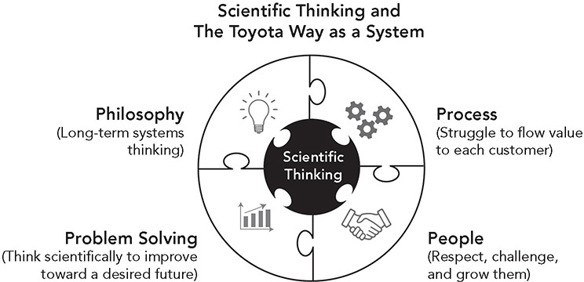
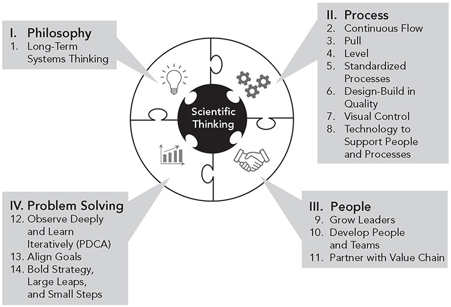

Introduction

**The Toyota Way: Using Operational Excellence as a Strategic Weapon**

_We place the highest value on actual implementation and taking action. There are many things one doesn’t understand and therefore, we ask them why don’t you just go ahead and take action; try to do something? You realize how little you know and you face your own failures and you simply can correct those failures and redo it again and at the second trial you realize another mistake or another thing you didn’t like so you can redo it once again. So by constant improvement, or, should I say, the improvement based upon action, one can rise to the higher level of practice and knowledge._

—Fujio Cho, President, Toyota Motor Corporation, 2002

Toyota first broadly caught the world’s attention in the 1970s, when it became clear that there was something special about Japanese quality and efficiency. Japanese cars were lasting longer than American and European cars and required much less repair. And by the 1980s, it became apparent that there was something even more special about Toyota compared with other automakers in Japan.1 It was not eye-popping car designs or performance—though the rides were smooth and the designs pleasant. It was the way Toyota went about engineering and manufacturing autos that led to unbelievable consistency in the process and product. The result of the culture, methods, processes led to designing and making autos more quickly, cheaper, and better than their competitors. Equally impressive, every time Toyota showed an apparent weakness and seemed vulnerable, the company miraculously fixed the problem and came back even stronger—as was illustrated in the dramatic recall crisis of 2009–2010 that at the time seemed like it could bury the company.2 Toyota remained profitable through that difficult period, and after it addressed the problems, its quality ratings again surged.

There are many metrics that can be used to judge an auto company. We will focus on two indicators for illustrative purposes: profits and quality experienced by the customer. Toyota’s success cannot be appreciated by selecting a single year; rather, one must look at its remarkable consistency of high performance over long periods of time. For profits, I used annual net income/loss in US dollars over a 15-year period, starting in 2004, when the original _Toyota Way_ was published, through 2018 (see Figure I.1). For comparison, I used several large automakers with full vehicle lineups—Toyota, Ford, Volkswagen, and General Motors, although the same pattern would apply if we added in other automakers.

**Figure I.1** Annual net income/loss across automakers, 2004–2018\. The data were compiled by James Franz. Toyota data were converted from yen based on the exchange rate quarter by quarter, and the fiscal year data were converted to calendar years. Note that Ford’s profit in 2011 was inflated by over $11 billion by an accounting change for “deferred tax assets.”

In most years, Toyota is the clear winner. In the year of the Great Recession of 2008, after 50 straight years of profits, Toyota lost just over $5 billion, worse than Ford and Volkswagen. Otherwise, Toyota was profitable in each of the other 14 years despite the recall crisis, the Japan earthquake and tsunami that shut down parts supplies, and the worst recorded flood ever in Thailand that shut down parts supply and vehicle production. Take out those bad years due to crises and natural disasters, and the pattern tilts strongly upward. In 2007, just before the recession, Toyota earned almost $14 billion, an auto industry record. By 2013, it again earned record industry profits of almost $19 billion and then surpassed that record with $21 billion in 2017\. Only Ford earned near a similar amount, over $20 billion in 2011, but most of that was due to an accounting change.\*

If we look at the cumulative profits minus losses of auto companies over the 15-year period, Toyota really stands out (see Figure I.2). On net, Toyota earned $179.7 billion. Honda, which we added in this comparison, was next at $75.4 billion, less than half of what Toyota earned. Ford, which ranked third, managed $46.9 billion, and even that was a bit overstated due to the accounting change in 2011\. Volkswagen, which was the world’s largest automaker when I wrote this book, came in at $37.2 billion, about 20 percent of Toyota’s net profits. It is interesting that the cumulative earnings of Ford, GM, Volkswagen, and Honda of $125.1 billion over this period are still far less than Toyota’s earnings. Even taking out the negative contribution of General Motors in this period, the other three companies’ total of $159.5 billion still fell short of Toyota’s profits.

**Figure I.2** Total net income for automakers, 2004–2018.

As a result of its industry-leading profitability, Toyota always has a strong credit rating (Aa3 by Moody’s as I write this) and plenty of cash available to invest in this tumultuous transformation of the industry toward connected, autonomous, shared, electrified vehicles. For example, in 2019 it had a record $57.5 billion in cash on hand.3

To some stock market analysts, having this much cash on hand is criminal. Why isn’t it using the money to reward shareholders through acquisitions, stock repurchases, or larger dividends? Toyota violates conventional business practice and follows your grandparents’ advice: save for a rainy day. Toyota’s purpose is to contribute to society, contribute to its customers, contribute to the well-being of the communities where it does business, and to contribute to the well-being of its team members and business partners. A key to achieving these goals is to smooth out the natural ups and downs in the market through a large buffer of cash. The wisdom of this philosophy was never more apparent than in 2020 when the Covid-19 pandemic swept the world and threatened the future viability of many companies.

Toyota and Lexus are consistently near or at the top of quality measures that different organizations use to compare automakers. One of the most respected rating organizations in the United States is J.D. Power, which is frequently quoted on its initial quality ratings that cover the first three months of ownership. I prefer the three-year dependability ratings, which reflect the natural wear and tear on the vehicle and measure the problems experienced in the final year of the three. The biggest honor is winning the best dependability award within a vehicle segment (e.g., small car, midsize car, compact SUV, midsize pickup, etc.). Figure I.3 shows how many segment awards Toyota and its brand received from 2004 to 2019\. The graph is up and down, but we can see that out of all the automakers selling in the United States, Toyota brands won between 20 percent and almost 60 percent of the first-place awards depending on the year. In 2019, Lexus was the number one brand in three-year vehicle dependability, and the Toyota brand was number three.4

Toyota vehicles do even better over longer periods. Consider vehicles that people keep for over 200,000 miles in the United States:5 Number one was the Toyota Sequoia (nine times more likely to be kept over 200,000 miles versus average); number five was the Toyota 4Runner; number seven, the Toyota Highlander; tenth, the Toyota Tacoma; eleventh, the Toyota Tundra; and twelfth, the Toyota Avalon. In short, six of the top fourteen vehicles that Americans keep for over 200,000 miles were made by Toyota.

**Figure I.3** Percent of first-place segment award winners for J.D. Power three-year dependability, 2004–2019.

The data for the graph were compiled by James Franz adding up the segment award winners by year.

Evaluations by other firms reach similar conclusions. Autobytel, which looks at vehicle history and the judgment of mechanics, forecasted the 2019 models that are likely to last the longest. Not a surprise—Camry, Corolla, Prius, and Lexus ES were all in the top 10.6 Another firm, Dashboard Light, considers vehicles toward their end of life. It focuses on the powertrain, since historically failure of the conventional gas engine or transmission is the costliest repair, as well as focusing on the age when the failure occurs and the time when the vehicle is first turned in to a dealer at wholesale price. Dashboard ranked Lexus number one, Toyota number two, and the canceled brand Scion number five for long-term reliability (see Figure I.4).

**Figure I.4** Long-term reliability according to Dashboard Light.

I am not arguing that all that matters in mobility is absence of defects. As I discuss under Principle 14, excitement about the vehicle may be more important, particularly as we move forward into the future of mobility, and Toyota is working hard at this. Tesla has become a model of how exciting customers with the features of the cars can override nagging quality issues. But to this point the distinguishing features that propelled Toyota have been extreme reliability, affordable price, and functionality.

**THE TOYOTA WAY MODEL**

What is the secret of Toyota’s success? Toyota gets credit for developing the Toyota Production System (TPS) and leading the way in the “lean manufacturing” revolution. But tools and techniques are no secret weapon for transforming a business. Toyota’s continued success stems from a deeper business philosophy rooted in its understanding of people and human motivation. Ultimately, its success derives from its ability to cultivate leadership, teams, and culture; to devise strategy; to build relationships across the value chain; and to maintain a learning organization.

This book describes 14 principles that, based on over 35 years of studying the company, constitute my perspective on the Toyota Way. I divided the principles into four categories, all starting with “P”—philosophy, process, people, and problem solving (see Figure I.5). I revised the model for the new edition. Instead of using a pyramid as I did in the first edition, I show the principles as pieces of a puzzle that represent a system of interconnected parts. I also added a new construct at the center, “scientific thinking,” which brings the four Ps to life, as described later in the chapter. Practical scientific thinking in this context means taking a fact-based, iterative learning approach to working toward a difficult challenge. It starts with recognizing that the world is far more complex and unpredictable than we often think . . . by a lot.

**Figure I.5** The 4P model.

The 14 principles associated with the 4P model are summarized in Figure I.6\. For an executive summary of the 14 principles of the Toyota Way, along with a table for assessing where you are and where you want to be, see the Appendix. Those familiar with the first edition of this book will notice that there are still 14 principles, but some have been reworded and the sequence changed a bit, with the section on problem solving changed the most. I now place far greater emphasis on “scientific thinking” by observing deeply and learning iteratively (Principle 12), by aligning plans and goals through policy deployment (Principle 13), and by incorporating a new principle on the connection between strategy and execution by large leaps and small steps (Principle 14). Following the next chapter, which focuses on the history and philosophy of the Toyota Production System, each of the 14 subsequent chapters will discuss one principle with examples from manufacturing and service.

**Figure I.6** The 4P model and the 14 principles.

The Toyota Way and the Toyota Production System (Toyota’s manufacturing philosophy and methodology) are the double helix of Toyota’s DNA; they define Toyota’s management style and what is unique about the company. I hope to explain and show how the Toyota Way principles can help any organization in any industry to improve any business process, including sales, product development, software development, marketing, logistics, and management. To assist you in this journey, I offer numerous examples of how Toyota maintains a high level of achievement, as well as highlighting companies from a variety of manufacturing and service operations that have effectively applied Toyota’s principles.

**SCIENTIFIC THINKING IS THE HUB . . . AND WE ARE NOT GREAT AT IT**

The biggest change in the Toyota Way model in this second edition is placing scientific thinking in the center. This is not a new idea for Toyota. The first TPS manual, published by Toyota’s Education and Training Department in 1973, taught Ohno’s view of the “scientific mindset”: “On the shop floor it is important to start with the actual phenomenon and search for the root cause in order to solve the problem. In other words, we must emphasize ‘getting the facts,’ . . .”\*

This was reiterated years later by an Ohno student, Mr. Ohba, who started the Toyota Production System Support Center (TSSC) in the United States. In a public presentation, he explained:†

_TPS is built on the scientific way of thinking. . . . How do I respond to this problem? Not a toolbox. \[You have to be\] willing to start small, learn through trial and error._

The image of scientific thinking may bring to mind professional scientists rigorously using a defined method to formulate and test their hypotheses, perhaps in a lab, so they can publish a paper and advance a body of knowledge. The goal of pure science is identifying general principles that get peer-reviewed evaluating the rigor of the research process. The normal pattern is to identify a gap in our knowledge and explain why it is important (problem definition), advance a notion about the way things might work (hypothesis), explain the study design (methods), present the findings (results), discuss the implications of the study, and suggest further research (discussion/reflection). The process should be done objectively and without bias. By contrast, Ohno was not trying to prove generic hypotheses about the nature of the world, but rather he was, as Ohba said, trying to address “this” problem. He was dealing with messy real-world circumstances and wanted team members to think scientifically about problems they identified, which meant gathering data and facts, taking time to test their ideas, examining results, and reflecting on what they learned. One can even say that the core of Toyota culture is a practical approach to scientific thinking.

If, in fact, improvement based on scientific thinking is what brings TPS to life, how do we develop people who think this way? Toyota’s answer is the coach-learner relationship and daily practice. Toyota has developed each of its executives, managers, and supervisors as coaches over many decades, something few other organizations have done.

Mike Rother’s book _Toyota Kata_7 offers a simple step-by-step process, along with starter kata (practice routines) to develop scientific thinking skills—which might help organizations interested in adapting Toyota’s approach. I discuss this in some detail under Principle 12: “Observe deeply and learn iteratively (PDCA) toward a desired future state.”

In the abstract, science is hard to define, and there are endless philosophical debates over what it means. Rother is not focused as much on defining science per se, but rather on developing a practical approach to teaching people to think scientifically in everyday life. He describes it as:8

a mindset, or way of looking at the world/responding to goals and problems, that’s characterized by . . .

 _Acknowledging that our comprehension is always incomplete and possibly wrong._

 _Assuming that answers will be found by test rather than just deliberation. (You make predictions and test them with experiments.)_

 _Appreciating that differences between what we predict will happen and what actually happens can be a useful source of learning and corrective adjustment._

By contrast, when we respond to goals and problems by assuming we already understand the current reality and solution, by neglecting to test our assumptions, and by viewing failed predictions as personal failures that have no learning value, we are not using a scientific mindset, and we are not learning to think more scientifically in the future.

Of course, we encounter problems where we have some level of experience and knowledge to guide our decision-making, and we do not need to pretend we know nothing. Rother calls this a “threshold of knowledge.” What is within our threshold of knowledge, and what are assumptions to be tested? In the physical sciences, for example, there is a huge body of knowledge, and it would be wasteful to pretend we know nothing about rich topics like physics, chemistry, and biology when we design a manufacturing process. There is also a huge body of knowledge on how to engineer software. We can apply that knowledge, though generally tailoring it to the specific situation and even generating new ideas. Unfortunately, our general human tendency is to assume with great certainty that we know far more than we really do. Our primitive brain hates uncertainty and drives us to assume we know the right answer or there is a known best way.

I discussed in the Preface the fallacy in thinking about lean as a mechanistic process of applying off-the-shelf solutions to an organization’s problems. This is decidedly unscientific. As an example, when I teach short courses or give public presentations, I am usually bombarded with questions from people asking me to solve their problems on the spot: How can we level our schedule if our customers are not level? How does TPS apply in a highly regulated environment like ours? Do we need to hang paper documents on the wall, or can we put all our information on a computer? Do we need to use pull systems for everything, or can we schedule our thousands of end items? Have you seen lean applied to oil exploration in deep ocean waters? How do I convince our CEO to come to the gemba? What these people are really asking is, “Can you give me the correct solution to my problem?”

I used to struggle to give a general, but hopefully sensible answer to prove my credibility. But what could these people do with my answers? I now realize that throwing out solutions in a public forum is totally contrary to scientific thinking and is no help to the people posing the questions. I am not sure exactly what their goals are. I have not studied their current condition. And I certainly have not experimented at their gemba. In other words, generic “solutions” are simply uninformed guesses, even coming from a so-called expert like me. We are used to how-to books, road maps, and IT and consulting companies boldly advertising they are “solution providers.” Plug in these solutions and play. It would be nice, but it rarely works.

Spoiler alert for our discussion of Principle 12—scientific thinking is not our default. We are not naturally good at it. Nobel Prize winner Daniel Kahneman provides an exhaustive and science-based explanation of the many biases that interfere with scientific thinking.9 He boils it down to “fast thinking,” which is fast, automatic, and emotional and feels really good. Jumping to conclusions based on something we thought worked in the past is fast thinking. Scientific thinking is based on “slow thinking,” which is slow, deliberate, and systematic, and generally speaking we find it arduous, boring, and even painful. He presents the “law of least mental effort,” which is how our brains prefer us to live, because thousands of years ago survival required jumping to conclusions, acting fast, and conserving energy. Global conditions have changed, and we now need more humans who can think scientifically, but our hardware is quite old and does not naturally function that way.

**SCIENTIFIC THINKING UNDERLIES EACH OF THE FOUR Ps**

**Philosophy** 

Toyota’s philosophy is based on long-term systems thinking and a clear sense of purpose. What is our vision and what are we trying to accomplish? Thinking long term and thinking in terms of systems require complex reasoning. It is easy to implement _X_ to immediately get _Y_. But what if you introduce _X_ (such as developing employees) as part of a system that indirectly over some years, in combination with other parts of the system (such as one-piece flow), is likely to improve business outcomes? Toyota works hard at planning and setting challenging goals (see Principle 13), but then expects to pursue those goals through continuous improvement. The direction is clear, but the pathway to get there is fuzzy at best. Solving complex system problems requires leadership to oversee the entire process, but also to work toward the vision by dividing and conquering, breaking down the desired future system into pieces, and putting people close to each process in charge of learning through continual experimentation. As Mr. Cho queries in the opening quote: “Why don’t you just go ahead and take action; try to do something?”

**Process**

Processes are not static things, but rather dynamic approaches to work that can be improved through experiments and learning. We often see in the lean community so-called experts implementing their pet lean methods that have worked for them in the past—build cells, make it neat and tidy, and put up a board for daily huddles. The Toyota Way does not assume you can implement solutions to repair or build a high-performing system. In fact, for Toyota a major reason for creating lean, or what Krafcik called “fragile” systems, is to surface problems so people can scientifically solve the problems one by one and learn.

**People** 

As mentioned, our evolutionary past did not reward slow and deliberate thinking, and we are still products of that evolution. We have many nasty habits such as letting our faulty impressions of past experience cloud our judgment of future possibilities and seeing the current situation through cloudy and biased lenses. At Toyota, every leader is a coach who teaches new ways of thinking at the gemba (where the work is done), often with relatively little classroom or online training. After a great deal of repetition, neural pathways are created, and those new ways of thinking scientifically begin to feel comfortable.

**Problem Solving**

In many organizations, problem solving often amounts to putting Band-Aids on processes; typically, the problems reoccur, and the organization never gets to a higher level of performance. While Toyota does a lot of reactive problem solving when there is a deviation from standard, it tries to get to the root cause. More fundamentally, Toyota’s heavy investment in proactive improvement to meet challenges tends to anticipate and reduce future problems.

**THE TOYOTA PRODUCTION SYSTEM AND LEAN PRODUCTION**

The Toyota Production System is Toyota’s unique approach to manufacturing and the basis for much of the “lean production” movement that has dominated manufacturing trends for the last 30 years or more. I discuss the history of TPS in more detail in the next chapter. Despite the huge influence of the lean movement, I hope to show that most attempts to implement lean have been superficial. Most companies have focused too heavily on tools such as 5S (cleaning and organizing the place) and work cells, without understanding lean as an entire system that must permeate an organization’s culture. In most companies where lean is implemented, senior management is not involved in the day-to-day operations and continuous improvement efforts that are at the center of lean.

Toyota developed TPS to address pressing problems—not as a way to implement known solutions. Toyota was fighting for survival after World War II and faced very different business conditions than Ford and GM faced. While Ford and GM used mass production, economies of scale, and big equipment to produce large volumes of parts as cheaply as possible, Toyota’s market in postwar Japan was small. Toyota had to make a variety of vehicles on the same assembly line to satisfy its customers. Thus, the key to its operations was flexibility. As it confronted this challenge, Toyota made a critical discovery: when you make lead times short and focus on keeping production lines flexible, you actually achieve higher quality, better customer responsiveness, better productivity, and better utilization of equipment and space. This discovery became the foundation for Toyota’s success globally in the twenty-first century.

In some ways, the TPS improvement tools look a lot like classical industrial engineering methods that seek to eliminate waste, but in fact the TPS philosophy in other ways almost the opposite of traditional industrial engineering. Consider the following counterintuitive truths about non-value-added waste within the philosophy of TPS:

 **Often, the best thing you can do is to idle a machine and stop producing parts.** You do this to avoid overproduction, which is considered the fundamental waste in TPS.

 **Often, it is best to build up an inventory of finished goods in order to level out the production schedule, rather than produce according to the fluctuating demand of customer orders.**

 **Often, it is best to selectively add and substitute overhead for direct labor** **.** When waste is stripped away from your value-adding workers, you need to provide high-quality support for them as you would support a surgeon performing a critical operation. Toyota has an additional level called “Team Leaders,” who are offline ready to jump in when any team member pulls the andon cord asking for help.

 **It may not be a top priority to keep your workers busy making parts as fast as possible.** You should produce parts at the rate of customer demand. Working faster just for the sake of getting the most out of your workers is another form of overproduction and actually can lead to employing more labor overall.

 **It is best to selectively use automation and information technology and sometimes better to use manual processes even when automation is available and would seem to justify its cost in reducing your headcount.** People are the most flexible resource you have. Automation is a fixed investment. And people, not computers, can continually improve processes.

 **Often, planning slowly and carefully, then experimenting, then deploying efficiently, is faster than rushing to judgment and implementing immediately.** Toyota plans in great detail and will pilot anything new before spreading the new practice throughout the organization. Further deployment is then fast and efficient.

In other words, Toyota’s solutions to particular problems often seem to add waste rather than eliminate it. The reason for these seemingly paradoxical approaches is derived from Ohno’s experiences walking the shop floor. He discovered that non-valued-added waste had little to do with running labor and equipment as hard as possible, and had everything to do with the manner in which raw material is transformed into a salable commodity. He learned to observe the _value_ _stream_ of the raw material moving to a finished product that the customer was willing to pay for, and he learned to identify “stagnation” where value was not flowing. This was a radically different approach from the mass production thinking that focused on identifying, enumerating, and eliminating the wasted time and effort in separate production processes.

As you make Ohno’s journey for yourself and examine your organization’s processes, you will see materials, information, service calls, and prototype parts in R&D (you fill in the blank for your business process) being transformed into something the customer wants. But on closer inspection, they are often diverted into a pile of material or a virtual information file where they sit and wait for long periods of time, until they can be moved to the next process. Certainly, people do not like to be diverted from their journeys and to wait on long lines. Ohno viewed material and information as having the same degree of impatience. Why? If any large batches of material are produced and then sit and wait to be processed, if service calls are backed up, if R&D is receiving prototype parts before it has time to test them, then this sitting and waiting to move to the next operation becomes waste. It is overproduction and often means quality problems are hidden and we do not have the right stuff that our customers want. This results in both your internal and external customers becoming impatient and frustrated.

This is why TPS starts with the customer. Always ask, “What value are we adding from the customer’s perspective?” _Because the only thing that adds value in any type of process—be it a manufacturing, service, or development process—is the physical or information transformation of that product, service, or activity into something the customer wants_.

**WHY COMPANIES OFTEN THINK THEY ARE LEAN—BUT AREN’T**

When I first began learning about TPS, I was enamored of the power of one-piece flow. I learned that all the supporting tools of lean, such as quick equipment changeovers, standardized work, pull systems, and error proofing, were essential to creating flow. But along the way, experienced leaders within Toyota kept telling me that these tools and techniques were not the key to TPS. Rather the power behind TPS is a company’s management commitment to continuously invest in its people and promote a culture of continuous improvement. I nodded like I knew what they were talking about and continued to study how to calculate kanban quantities and set up one-piece flow cells.

Let’s say you bought a book on creating one-piece flow cells or perhaps went to a training class or maybe even hired a lean consultant. You pick a process and do a lean improvement project. A review of the process reveals lots of “muda,” or waste, muda being Toyota’s term for anything that takes time but does not add value for your customer. The process is disorganized, and the place is a mess. So you clean it up and straighten out the flow in the process. Everything starts to flow faster. You get better control over the process. Quality even goes up. This is exciting stuff, so you apply it to other parts of the operation. What’s so hard about this?

The world has been exposed to TPS for decades. The basic concepts and tools are not new. TPS has been operating in some form in Toyota since shortly after World War II. Yet, organizations that to some degree embrace lean tools often do not understand what makes them work together as a system. Typically, management adopts a few of these technical tools and struggles to go beyond a basic application in an effort to get immediate results. The problem is that the people in charge do not understand the power behind true TPS: the development of a continuous improvement culture that brings to life the principles of the Toyota Way. Within the 4P model, most companies are dabbling at only one level—“process.” Without adopting the other three Ps, and missing the scientific thinking mindset, they will do little more than dabble, because the improvements they make will not have the heart and intelligence behind them to make them sustainable throughout the company. Their performance will continue to lag behind that of companies that adopt a true culture of continuous improvement.

I heard a great story of a retired lean sensei from Toyota who was invited by the CEO of a large manufacturing company in Europe to visit and tell him whether the company was “world class.” After the expensive sensei spent most of the day visiting plants and observing carefully, he finally was ready for his report. At the end of the day, the CEO asked, “So are we world class?”

The sensei replied, “I do not know. I was not here yesterday.” The sensei was making the profound point that he could only judge by whether he saw improvement from day to day, not the state at a point in time.

The quote at the beginning of this chapter from Mr. Fujio Cho, former president of Toyota, is not just rhetoric. From the executives to the shop floor workers performing the value-added work, Toyota challenges people to use their initiative and creativity to experiment and learn. Toyota is a true learning organization that has been evolving and learning for most of a century. This investment in its employees should frighten those traditional mass production companies that merely focus on making parts and counting quarterly dollars and adopting new “cultures” with every change in CEO.

**IF THE TOYOTA WAY DOES NOT OFFER SOLUTIONS, WHAT IS ITS VALUE?**

Critics often describe Toyota as a “boring legacy auto company.” If boring means high levels of performance consistently over decades, I will take it any day. Top quality year in and year out. Steadily growing sales. Consistent profitability. Huge cash reserves to fund innovation for the future. Long-term contributions to society and local communities.

Toyota remains a model for careful and efficient delivery of on-time products that customers pay a premium for based on high quality, reliability, and high value. The Toyota Way provides a model for fast, efficient, and effective execution of long-term strategy based on:

 Carefully studying the market and planning in detail future products and services

 Putting safety first for team members and customers

 Eliminating wasted time and resources in execution of those plans

 Building quality into every step of design, manufacturing, and service delivery

 Using new technology effectively to work in harmony with people, not simply replace people

 Building a culture of people who learn and think scientifically to achieve aligned, challenging goals

I’ve included in this new edition of _The Toyota Way_ case examples from a diverse group of organizations that have had success in using Toyota’s principles to improve quality, efficiency, and speed. While many people feel it is difficult to apply Toyota’s way of thinking outside Japan, Toyota is in fact doing just that—building learning organizations in overseas operations throughout the world and even teaching TPS to other companies.

This book is not intended as a blueprint on how to copy Toyota; there is no such blueprint, and blindly copying is a bad idea. Nor am I attempting to describe Toyota as the perfect company that does everything superior in every way; in fact, Toyota people will tell you they are far from perfect and make mistakes every day. I will not try to detail those mistakes made by self-confessed imperfect humans. _The Toyota Way_ is not an evaluation of Toyota as a company, but rather a set of principles and ideas derived from Toyota and other sources that might help your vision and inspire you to become better at adapting and succeeding in a complex, unpredictable environment.

 KEY POINTS 

 Toyota’s success can only be appreciated over long time periods. For example, its cumulative profits from 2004 to 2018 were greater than the sum of earnings for Ford, General Motors, Volkswagen, and Honda.

 Toyota repeatedly scores at or near the top for quality and especially stands out for long-term reliability.

 My version of the Toyota Way is based on four Ps: philosophy, process, people, and problem solving. In this new edition, I represent the four Ps as interconnected pieces of a puzzle with scientific thinking at the center.

 Practical scientific thinking in this context means taking a fact-based, iterative learning approach to working toward a difficult challenge. Test assumptions!

 This second edition builds on the 14 principles of the original with some wording changes and some major revisions. For example, I now emphasize under the philosophy category the importance of system thinking in the Toyota Way. The biggest changes focus the problem-solving principles on developing a scientific thinking mindset and applying that to strategy, planning, and execution.

 There is no blueprint to mimic Toyota’s way, but the principles can help inform your vision and act as guidelines while you work on finding your way.

**Notes**

1\. Womack, Jones, and Roos, _The Machine That Changed the World_, 1991.

2\. Jeffrey Liker and Timothy Ogden, _Toyota Under Fire: Lessons for Turning Crisis into Opportunity_ (New York: McGraw-Hill, 2011).

3\. https://www.macrotrends.net/stocks/charts/TM/toyota/cash-on-hand.

4\. https://www.jdpower.com/business/press-releases/2019-us-vehicle-dependability-studyvds.

5\. “The 14 Cars Americans Drive Past 200 Thousand Miles,” Business Insider, <https://www.businessinsider.com/cars-americans-drive-the-most-are-suvs-2019-11>.

6\. [https://www.autobytel.com/car-buying-guides/features/10-of-the-longest-lasting-cars-on-the-road-128961/#](./https___www.autobytel.com_car-buying-guides_features_10-of-the-longest-lasting-cars-on-the-road-128961_.md).

7\. Mike Rother, _Toyota Kata_ (New York: McGraw-Hill, 2009).

8\. <http://www.katatogrow.com> (click on “scientific thinkers”).

9\. Daniel Kahneman, _Thinking Fast and Slow_ (New York: Farrar, Straus and Giroux, 2011).

\_\_\_\_\_\_\_\_\_\_\_\_\_\_\_\_\_\_\_\_\_\_\_\_\_\_\_\_

\* Of Ford’s $20 billion in profits in 2011\. According to autoblog.com, $11.5 billion was “the result of a valuation allowance held against deferred tax assets, which the company needed as it saw profits disappear. As profitability returned, the valuation was no longer necessary.”

\* As conveyed by Art Smalley, former Toyota manager.

† I received a PowerPoint file of this presentation in 2011, and I am not sure where or when it was presented.

