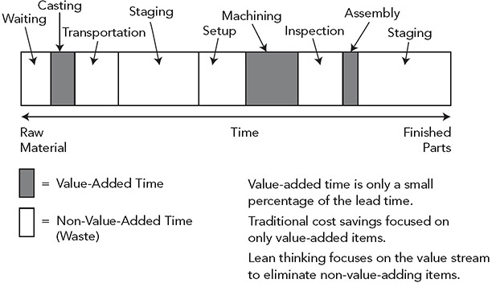
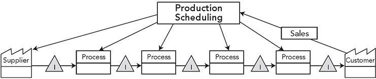
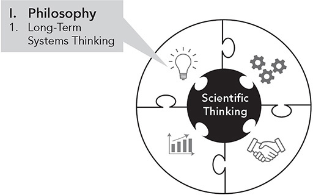

**A Storied History: How Toyota Became the World’s Best Manufacturer**

_I plan to cut down on the slack time within work processes and in the shipping of parts and materials as much as possible. As the basic principle in realizing this plan, I will uphold the “just in time” approach. The guiding rule is not to have goods shipped too early or too late._

—Kiichiro Toyoda, founder of Toyota Motor Company, 1938

The most visible product of Toyota’s quest for excellence is its manufacturing philosophy, called the Toyota Production System (TPS). The importance of TPS in revolutionizing manufacturing cannot be overstated. The mass production system often associated with Henry Ford was a smashing success at the time. The focus was on large-volume production with little variety in a growing market. Toyota developed TPS in a time of low demand and high need for variety in Japan. The result is now called “lean production,” which has transformed and improved countless organizations throughout the world, helping them to become more efficient and more profitable and to better serve their customers and employees.

In order to understand TPS and the Toyota Way, and how the company became the world’s best manufacturer, it is helpful to appreciate the history and the personalities of the founding family members who left an indelible mark on the Toyota culture. What is most important about this is not that the family had an enduring influence (Ford is similar in this respect), but that there was remarkable consistency of leadership and philosophy throughout the history of Toyota. The roots of the Toyota Way principles can be traced back to the very beginnings of the company. And the “DNA” of the Toyota Way is encoded in every Toyota leader whether a Toyoda family member or not.

**SAKICHI TOYODA AND HIS LOOMS**

The story begins with Sakichi Toyoda, a tinkerer and inventor, who grew up in the late 1800s in a remote farming community in Yamaguchi, about a ½-hour drive southeast of Toyota City. At that time, weaving was a major industry. Wishing to promote the development of small businesses, the Japanese government encouraged the creation of cottage industries across the country. Small shops and mills employing a handful of people were the norm. Housewives made a little spending money by working in these shops or in their homes. As a boy, Toyoda learned carpentry from his father and eventually applied that skill to designing and building wooden spinning machines. In 1894, he began to make manual looms that were cheaper but worked better than existing looms.

Toyoda was pleased with his looms, but he was disturbed that his mother, grandmother, and their friends still had to work so hard spinning and weaving. He wanted to find a way to relieve them of this punishing labor, so he set out to develop power-driven wooden looms.

This was an age when inventors had to do everything themselves. There were no large R&D departments to delegate work to. When Toyoda first developed the power loom, there was no power available to run the loom, so he turned his attention to the problem of generating power. Steam engines were the most common source of power, so he bought a used steam engine and experimented with using it to run the looms. He figured out how to make this work going through trial and error and getting his hands dirty—an approach that would become part of the foundation of the Toyota Way, “genchi genbutsu.” In 1926, he started Toyoda Automatic Loom Works, the parent firm of the Toyota Group and still a central player in the Toyota conglomerate today.

Through endless tinkering and inventing, Toyoda eventually developed sophisticated automatic power looms that became “as famous as Mikimoto pearls and Suzuki violins” (Toyoda, 1987). His process was continuous improvement. Every experiment had a purpose—to address a specific need—a process we now call plan-do-check-act (PDCA).

At one point the looms were sufficiently automated that they could almost operate alone, with a human loading and unloading and watching to respond when a problem occurred. A frequent problem was that when a single thread broke, the loom would make defective cloth until the person shut the loom down. Toyoda observed that the person watching for this was wasting a large part of his human capacity. In response, Toyoda developed a mechanism to automatically stop a loom whenever a thread broke—freeing the person to take responsibility for multiple machines and to utilize a larger range of problem-solving skills. This simple invention evolved into a broader system that became one of the two pillars of the Toyota Production System: jidoka (automation with a human touch). Today, jidoka is often thought of as building in quality as you perform your work. The most visible symbol is the “andon,” which is a light that goes on when a machine senses and abnormality or a human identifies an out-of-standard condition and pushes a button or pulls a cord (Principle 6).

Throughout his life, Sakichi Toyoda was a great engineer and later was referred to as Japan’s “King of Inventors.” But while his inventions and engineering skills were essential to Toyota’s early success, his broader contribution to Toyota’s development was his philosophy and his zeal for continuous improvement in all things. Interestingly, this philosophy, and ultimately the Toyota Way, was significantly influenced by his reading of a book, _Self-Help_ by Samuel Smiles, first published in England in 1859.1 It preaches the virtues of industry, thrift, and self-improvement, and was illustrated with stories of great inventors like James Watt, who helped develop the steam engine. The book so inspired Sakichi Toyoda that a copy of it is on display under glass in a museum at his birth site.

As I read Samuel Smiles’s book, I could see how it influenced Toyoda. First, Smiles’s inspiration for writing the book was philanthropic, not to make money. Smiles hoped the book would help young men in difficult economic circumstances who wanted to improve themselves. Second, the book chronicles inventors whose natural drive and inquisitiveness led to great inventions that changed the course of humanity. For example, Smiles concludes that the success and impact of James Watt did not originate from his natural abilities—but rather through hard work, perseverance, and discipline. These are exactly the traits displayed by Sakichi Toyoda in making his power looms work with steam engines. There are many examples throughout Smiles’s book of “management by facts” and the importance of getting people to pay attention actively—a hallmark of Toyota’s approach to problem solving—which is based on going to the gemba to observe the actual situation firsthand.

Sakichi Toyoda’s personal and professional philosophy continues to influence Toyota today through what the company has distilled as his “five main principles”:

1\. Always be faithful to your duties, thereby contributing to the company and to the overall good.

2\. Always be studious and creative, striving to stay ahead of the times.

3\. Always be practical and avoid frivolousness.

4\. Always strive to build a homelike atmosphere at work that is warm and friendly.

5\. Always have respect for spiritual matters and remember to be grateful at all times.

**KIICHIRO TOYODA AND THE FOUNDATION OF TPS**

_Sakichi Toyoda’s “mistake-proof” loom became Toyoda’s most popular model. In 1929, he sent his son, Kiichiro, to England to negotiate the sale of the patent rights to Platt Brothers, the premier maker of spinning and weaving equipment. His son negotiated a price of 100,000 English pounds, and in 1930, he used that capital to start building the Toyota Motor Corporation.2_

It is perhaps ironic that the founder of Toyota Motor Company, Kiichiro Toyoda, was frail and sickly as a boy, who many felt did not have the physical capacity to become a leader. But his father disagreed, and Kiichiro Toyoda persevered. When Sakichi Toyoda tasked his son with building a business of his own, it was not to increase the family fortune. He could just as well have handed over to him the family loom business. He expected his son to make his own mark on the world. He explained to Kiichiro:

_Everyone should tackle some great project at least once in their life. I devoted most of my life to inventing new kinds of looms. Now it is your turn. You should make an effort to complete something that will benefit society.3_

Kiichiro’s father sent him to the prestigious Tokyo Imperial University to study mechanical engineering, where he focused on engine technology. Kiichiro worked in his father’s company and helped him to complete the first fully automated loom. He also went overseas to study loom making for one year in the United States and then for two years working at the Platt Brothers loom company in England. The Platt Brothers were world renowned in loom making, and it was there that the seeds of Kiichiro’s ideas for TPS developed. Kiichiro Toyoda was never a great student, so he compensated by taking excellent notes and making detailed sketches. When working for the Platt Brothers loom company in England, he sketched the walking patterns of workers—which enabled him to identify a great deal of waste. He timed both the workers’ actions and every step of the loom-making process. He was unimpressed by what he observed: “The workmen act as if they’re half playing around; it takes them a long time to do something. They’re only working about 3 out of 8 hours.”\* He also noticed that the poor layout of the plant floor led to additional waste. For example, the biggest part of the workman’s job was rework to fit parts together that did not fit properly at assembly, which was in the center of the shop. But the fitting required a vise and other tools that were located around the walls of the assembly shop. Throughout the day, the workman had to walk over with the part to file it down and then go back and forth to assembly until it fit. Kiichro Toyoda’s insights from seeing these wastes led him to make improvements in the Toyota Loom Works manufacturing process, and later provided seminal ideas in the development of the Toyota Production System in automotive manufacturing.

Kiichiro’s belief in the power of learning by doing at the gemba mirrored that of his father. After World War II, Kiichiro wrote, “I would have grave reservations about our ability to rebuild Japan’s industry if our engineers were the type who could sit down to take their meals without ever having to wash their hands.”

Along the way to building a car company, World War II happened, and Japan lost. The American victors could have halted car production. Kiichiro Toyoda was very concerned that the postwar occupation forces would shut down his company. The opposite occurred. The Americans realized trucks were needed to rebuild Japan, and they even purchased Toyota trucks, which helped Toyoda to expand production and establish a new plant in Koroma (later named Toyota City).

Kiichiro incorporated three principles that he developed in the loom company to become the core of TPS: just-in-time, jidoka (from his father), and standardization of processes and labor harmony.

**Just-in-Time**

In 1938, in the industry magazine _Motor_, Kiichiro wrote the golden words that headline this section: just-in-time (JIT). Wada and Yui4 argue that Kiichiro created JIT because missing trains in England made him realize that arriving one second early wasted time and arriving one second late meant he missed the train. In fact, he missed the train on his first day of work at the Platt Brothers.

Toyoda’s vision for the Koromo plant was to eliminate the need for a warehouse. In preparation, he developed a four-inch-thick binder that described in meticulous detail how the system should operate—which later was the basis for the kanban system that was developed and refined by Ohno. At the outset, slips of paper were used. For example, managers, using the plan for building engines that day, called for the exact number of castings from inventory that would be needed. As the castings moved through different stages of machining, slips of paper authorized production and movement to the next stage. His cousin, Eiji Toyoda, who had the task of introducing the new system, explained:

_What Kiichiro had in mind was to produce the needed quantity of the required parts each day. To make this a reality, every single step of the operation, like it or not, had to be converted over to his flow production system. Kiichiro referred to this as the Just-In-Time concept.5_

**Built-in Quality**

Kiichiro embraced his father’s andon concept and took it a step further. He realized that in order for JIT to work, he needed quality built into the product at every step. A quality defect either would stop production because there were no inventory buffers or would require rework at the end of the line like what he saw at the Platt Brothers. In fact, in the early stages of automotive production, Toyota was doing an enormous amount of rework after the vehicles were built. Eiji Toyoda (later president and then chairman) was responsible for putting Kiichiro’s production system into practice in a machinery shop in the plant. In his biography, he explained:

_Each shop had three managers, of which one was responsible for inspection. Kiichiro’s intention here was to catch any defective product and correct whatever processes were at fault. The task of the inspection manager was not simply to differentiate between a good and bad product, but to find a way to fix whatever had to be fixed. After the war, we studied quality control and actively incorporated this concept into our operations. The basic idea behind QC of “creating product quality within the process” is essentially identical to Kiichiro’s thinking._

**Standardization of Processes and Labor Harmony** 

At Platt Brothers, Kiichiro noticed that the craft knowledge developed by individual workers who controlled processes often was not shared or codified across the shop floor—which created a variety of problems. Standardization was slow to come to the spinning industry. In 1912, one company, Kanebo, adopted a “scientific method” of documenting and standardizing operations. When Kiichiro learned about what Kanebo had done, he wanted to introduce that to the Toyoda spinning companies.

Workers intentionally kept their secrets from management to maintain some control—which was the situation at Toyoda Boshoku’s spinning factory when Kiichiro first joined the company in 1921\. Kiichiro observed that “the standard methods the spinning technicians were keeping to themselves were something akin to professional secrets.”6

At first, Kiichiro had to learn these “secrets” on his own, and he spent a whole year studying the jobs. He also learned from Toyoda Boshoku’s sister company, Kikui Boshoku, which had been started with the philosophy of labor-management harmony and gave shares of the company to employees.

As time went on, Kiichiro worked hard to improve poor labor-management relations; he saw it as critical in building the right culture. Standardized work in Toyota is considered essential for continuous improvement, and continuous improvement depends on all workers sharing what they learn—from both successes and failures.

**CONTINUITY OF PHILOSOPHY**

As the economy revitalized under the occupation, Toyota had little difficulty getting sales orders, but rampant inflation eroded the value of money, and getting paid by customers was very difficult. Cash flow became so horrendous that at one point in 1948, Toyota’s debt was eight times its total capital value.7 To avoid bankruptcy and in lieu of layoffs, Toyota adopted strict cost-cutting policies, including voluntary pay cuts by managers and a 10 percent salary reduction for all employees. Unfortunately, the pay cuts were not enough. Despite a policy against firing employees, Kiichiro Toyoda was forced to ask for 1,600 workers to “retire” voluntarily—an action that led to work stoppages and public demonstrations by workers, which at the time were becoming commonplace across Japan.

Companies go out of business every day. Often, we hear stories of CEOs of failing enterprises taking no responsibility for bad decisions and fighting for huge golden parachutes. Kiichiro Toyoda took a different approach. He accepted responsibility for the demise of the automobile company and resigned as president. His personal sacrifice helped to quell worker dissatisfaction. More workers voluntarily left the company, and labor peace was restored. However, his tremendous personal sacrifice had a more profound impact on the history of Toyota. Everyone in Toyota knew what he did and why. The philosophy of Toyota to this day is to think beyond individual concerns to the long-term good of the company, as well as to take responsibility for problems. Kiichiro Toyoda was leading by example in a way that is unfathomable to most contemporary business executives.

No matter how emotionally charged an event might be, Toyota will take time to reflect and learn. In this case, Kiichiro’s resignation was largely driven by money lenders who insisted that Kiichiro lay off people, even though Kiichiro had earlier promised the union that he would not lay off more people. The money lenders then pressured Kiichiro to resign. The lesson learned by Toyota from this episode was to never again allow an outside agent to determine its fate. The principle became self-reliance. Hino describes Toyota documents that illustrate its perspective on borrowing money:8

**Financial Rule 1**

_Know that all loans are fearsome enemies._

_No enemy is more terrible than money, and no friend is more trustworthy. Other people’s money—borrowed money—quickly turns into an enemy. Money is a trustworthy ally only when it is your own; only when you earn it yourself._

It is all too common today for new leaders to arrive and put their personal stamp on the company. Out with the old and in with their new. As Toyota developed a distinctive culture, Toyoda family members built on the past and the philosophies that served the company through its inception and growth, creating a company DNA that continues today under Akio Toyoda’s leadership. They all learned to get their hands dirty, embraced challenges enthusiastically, learned the spirit of innovation, understood the values of the company in contributing to society, and committed to self-reliance. Moreover, they shared a vision of creating a special company that would endure through successive generations.

After Kiichiro Toyoda, one of the Toyoda family leaders who shaped the company was Eiji Toyoda, the nephew of Sakichi and younger cousin of Kiichiro. Eiji Toyoda also studied mechanical engineering, entering Tokyo Imperial University in 1933\. When he graduated, his cousin Kiichiro assigned him the task of building, all by himself, a research lab in a “car hotel” in Shibaura.9

A car hotel is a large parking garage. At the time, Toyota and other firms jointly owned many of these facilities, because they felt the “hotels” were necessary to encourage car ownership among the small number of wealthy individuals who could afford cars. Eiji Toyoda started by cleaning a room in one corner of the building and obtaining basic furniture and drafting boards. He worked alone until he got his bearings and then built a group of 10 people by the end of year one. His first task was to research machine tools, which he knew nothing about. He was also charged with checking and servicing defective cars and developing Toyota’s initial quality control process. In his spare time, he investigated companies that could make auto parts for Toyota. Toyota was mostly purchasing parts from the United States and wanted to localize its supply chain.

So Eiji Toyoda, like his cousin and uncle, grew up believing that the only way to get things done was to do it yourself and get your hands dirty. When a challenge arose, the answer was to try things—to learn by doing.

Eventually Eiji Toyoda became (as mentioned earlier) the president and then chairman of Toyota Motor Manufacturing. He helped lead and then presided over the company during its most vital years of growth after World War II and through its expansion into a global powerhouse. Eiji Toyoda played a key role in selecting and empowering the leaders who shaped sales, manufacturing, and product development—perhaps, most notably, Taiichi Ohno, who led the creation of the Toyota Production System. Taiichi Ohno was unusually strong willed and aggressive for Toyota culture, and arguably he survived and gained influence under the protective cover of Eiji Toyoda.

**THE OHNO PRODUCTION SYSTEM**

In the 1930s, Toyota’s leaders visited Ford and GM to study their assembly lines. They carefully read Henry Ford’s book _Today and Tomorrow_.10 They tested the conveyor system, precision machine tools, and economies-of-scale ideas in their loom production. Even before World War II, Toyota realized that the Japanese market was too small and demand too fragmented to support the high production volumes of US companies. A Ford auto line might produce 9,000 units per month, while Toyota would produce only about 900 units per month, which made Ford about nine times more productive. Toyota managers knew that if they were to survive in the long run, they would have to adapt the mass production approach for the Japanese market. But how?

Taiichi Ohno, who at the time was managing a Toyota machining plant for engine parts, was given the challenge of matching the productivity of Ford. Based on the mass production paradigm of the day, and given that Ford was nine times as productive, the economies of scale alone should have made this an impossible feat for tiny Toyota. This was David trying to take on Goliath. And like David, Ohno succeeded. He built on the concepts of Kiichiro Toyota to develop lean manufacturing processes, which eventually led to TPS.

Ford’s mass production system was designed to make huge quantities of a limited number of models. This is why all Model Ts were originally black. In contrast, Toyota needed to churn out low volumes of different models using the same assembly line, because consumer demand in Toyota’s auto market was too low to support dedicated assembly lines for one vehicle. Ford had a great deal of cash and a large US and international market. Toyota had little cash and operated in a small country. With few resources and little capital, Toyota needed to turn cash around quickly (from receiving the order to getting paid), so it could pay suppliers. Toyota didn’t have the luxury of taking cover under the high volume and economies of scale afforded by Ford’s mass production system. It needed to adapt Ford’s manufacturing system to simultaneously achieve high quality, low cost, short lead times, and flexibility. While Ohno and his team learned from other companies, especially Ford, they had to develop unique solutions given the nature of the challenges. Through the 1950s, Ohno evolved an approach that originally had no name and was referred to as Ohno’s Production System, until it eventually was named the Toyota Production System.\*

Henry Ford wrote great words about flow and the elimination of waste in his book _Today and Tomorrow_.11 For example, in Chapter 8, entitled “Learning from Waste,” he said:

_Saving material because it is material, and saving material because it represents labor might seem to amount to the same thing. But the approach makes a deal of difference. We will use material more carefully if we think of it as labor. For instance, we will not so lightly waste material simply because we can reclaim it—for salvage involves labor. The ideal is to have nothing to salvage._

While Henry Ford seemed to appreciate the value of flow, as his manufacturing system evolved with larger volumes spread across many departments, the assembly line seemed to be the only place where flow was visible. Most of Ford’s system was based on pushing large batches of material into huge inventory piles and then on to the next process.

Like Kiichiro before him, Ohno knew he could not afford to tie up cash in inventory, and he wanted to extend one-piece flow beyond the final assembly line. He successfully experimented with a one-piece flow cell in machining (Principle 2), but he still had to deal with all the materials coming into the cell, particularly those from inherent batch processes like casting. To connect batch processes, or distant processes from suppliers, to assembly, he extended Kiichiro’s JIT concept into a direct communication mechanism called “kanban.” Kanban means a sign or signal. Physically at that time the kanban was a card that was used by the downstream process—the direct customer—to pull material from the upstream process when workers were ready for more (Principle 3).

Some say this pull system was inspired by American supermarkets. In any well-run supermarket, individual items are replenished as each item begins to run low on the shelf. That is, material replenishment is initiated by consumption. Applied to a shop floor, it means that Step 1 in a process shouldn’t make (replenish) its parts until the next process (Step 2) utilizes its original supply of parts from Step 1 (down to a small amount of “safety stock”). In TPS, when Step 2 is down to a small amount of safety stock, it triggers a pull signal to Step 1 asking for more parts.

When Ohno and his team emerged from the shop floor with a new manufacturing system, it wasn’t simply a set of tools to solve a problem for one company in a particular market and culture. What they had created was a new paradigm in manufacturing and service delivery—a new way of seeing, understanding, and interpreting what is happening in a production process—that ultimately led to the demise of traditional mass production in many respects and the rise of lean production.

**THE SEVEN WASTES: OBSTACLES TO VALUE-ADDED FLOW**

I mentioned that Kiichiro was very disappointed with all the waste he saw at the Platt Brothers’ plant. While he was impressed by the final quality, it came at the expense of a lot of waste, including a great deal of rework filing down parts to get them to fit together. Within TPS, one-piece flow is the ideal to strive toward: pure value added from the start to the delivery to the customer—without interruption and without rework. The blockages to flow are all waste. Toyota categorized seven major types of non-value-adding waste in manufacturing processes, which are described below. In addition to production lines, with some small modifications, you can apply these ideas to product development, software development, operations of hospitals, and any office process.

1\. **Overproduction.** Producing ahead of or in anticipation of demand, which generates such wastes as overstaffing and unnecessary storage and transportation costs because of excess inventory.

2\. **Waiting (time on hand).** Watching or waiting for a machine, waiting for key inputs, or having slack with no immediate deadlines.

3\. **Unnecessary transport or conveyance.** Carrying work in process (WIP) long distances, creating inefficient transport, or moving materials or information into or out of storage or between processes.

4\. **Overprocessing or incorrect processing.** Taking unneeded steps to process the parts. Inefficiently processing due to poor tool and product design, causing unnecessary motion and producing defects. Waste is also generated when providing higher-quality products or services than is necessary.

5\. **Excess inventory.** Excess raw material, WIP, or finished goods causing longer lead times, obsolescence, damaged goods, transportation and storage costs, and delay. Also, extra inventory hides problems such as production imbalances, late deliveries from suppliers, defects, equipment downtime, and long setup times.

6\. **Unnecessary movement.** Any wasted motion employees perform during their work, such as looking for, walking to, reaching for, or stacking parts, tools, etc.

7\. **Defects.** Production of defects and correction. Repair or rework, scrap, replacement production, and inspection waste time, effort, and handling.

(In _The Toyota Way to Service Excellence_, we broaden this list of wastes for services.12)

It may seem counterintuitive, but Ohno considered the fundamental waste to be overproduction, since it causes most of the other wastes. Producing more than the customer wants by any operation in the manufacturing process necessarily causes a buildup of inventory somewhere downstream—which means the material is just sitting around waiting to be processed in the next operation. Mass or larger-batch manufacturers might ask, “What’s the problem with this, as long as people and equipment are producing parts?” The problem is that big buffers (inventory between processes) lead to other suboptimal behaviors, like reducing your motivation to continuously improve your operations. Why worry about preventive maintenance on equipment when shutdowns do not immediately affect final assembly anyway? Why get overly concerned about a few quality errors when you can just toss out defective parts? Because by the time a defective piece works its way to the later operation where an operator tries to assemble that piece, there may be weeks of bad parts in process and sitting in buffers.

Figure S.1 illustrates some of these wastes through a simple timeline for the process of casting, machining, and assembling. In most traditionally managed operations, much of the timeline is waste; yet the customary focus of improvement is limited to taking small amounts of time out of the value-added processes—for example, increasing the throughput of machines so they become more “efficient.”

**Figure S.1** Waste in the value stream.

I experienced an astonishing example of this while consulting for a manufacturer of steel nuts. The engineers and managers in my seminar assured me that their process could not benefit from lean manufacturing because it was so simple. Rolls of steel coil came in and were cut, tapped, heat-treated, and put into boxes. Material flew through the automated machines at the rate of hundreds of nuts a minute. When we followed the value (and non-value) stream, their claim became comical. We started at the receiving dock, and every time I thought the process must be finished, we walked across the factory one more time to another step or pile of inventory. At some point, the nuts left the factory for a few weeks to be heat-treated, because management had calculated that contracting out heat-treating was more economical. When all was said and done, the nut-making process that took seconds for most operations—except for heat-treating, which could take a few hours—typically took weeks and sometimes months for this manufacturer.

We calculated the percent value added for different product lines and got numbers ranging from 0.008 to 2 or 3 percent. Eyes opened! To make matters worse, equipment downtime was a common problem, idling machines and allowing for large buildups of material around them. Some clever manager had figured out that contracting outside maintenance was cheaper than hiring full-time people. So often there was nobody around to fix a machine when it went down, let alone do a good job on preventive maintenance. Local efficiencies were emphasized at the cost of slowing down the value stream by creating large amounts of in-process and finished-goods inventory and taking too much time to identify problems (defects) that reduced quality. As a result, costs were high, and the plant was not flexible to changes in customer demand.

In the original _Toyota Way_, I described an eighth waste, unused employee creativity, which I still think is perhaps the most fundamental waste. But it does not fit cleanly into this list. The seven wastes are obstacles to flow and are observable, while waste of employee creativity is a broader concept of what could have been. Throughout the book, I emphasize the centrality of continuous improvement at all levels to reduce waste in the process and how Toyota develops people to use their creativity.

**STRIVING TOWARD A FUTURE STATE: THE ROLE OF VALUE STREAM MAPPING**

The traditional approach to process improvement focuses on identifying local inefficiencies and making point improvements. For example, go to the equipment or value-added processes, and improve uptime, make it cycle faster, or replace the person with automated equipment. The result might be a significant percent improvement for that individual process, but it often has little impact on the overall value stream. In contrast, lean thinking focuses much of its attention on reducing the non-value-added.

Inside Toyota, the group tasked with teaching TPS to suppliers developed a way of visualizing at a high level the flow of material and information and identifying the big wastes. This technique was made available to the public through the bestselling book _Learning to See_ by Mike Rother and former Toyota manager John Shook.13 You pick a starting point in the value stream, often at the beginning of one large unit, such as the receiving docks in a manufacturing plant, and walk the value stream as the product is transformed—and draw a diagram of the journey. At first you are mostly documenting individual processes that push into inventory, represented by triangles, or time waiting in a queue. There is usually so much waste in the process, it can be humorous.

Figure S.2 is a generic example of a current-state map (I did not include data). Once you see all the inventory, which is one of the seven wastes, you may want to reduce inventory. A simple way to do this is to calculate minimum and maximum levels and create a visual with instructions to replenish when you reach the minimum. This is a simple type of pull system. Inventory will probably decrease. You now have eliminated waste—congratulations! But what is the purpose? This isolated action may not help much.

**Figure S.2** Current-state value stream map.

Let’s say that to be competitive your company needs to make a greater variety of products and shorten the order-to-delivery lead time so your customers can hold less inventory and still get what they want when they want it. You assemble a group of people with different specialties, including someone knowledgeable in lean concepts, and create a vision of a future state. What would the value stream need to look like to achieve your objectives?

The result might look something like the future-state map in Figure S.3\. In this case, you designed a system of material flow that levels out the different products so you do not build batches of one product in the morning and batches of another product in the afternoon (Principle 4). You have eliminated scheduling of individual operations that tend to push lots of inventory and replaced the information flow with pull systems so each process only builds what the next process needs when it needs it (Principle 3). You probably would have to do other things to support the flow, like reduce the time to change over a machine between products and reduce equipment downtime. In value stream mapping, you show these other activities as point-kaizen bursts. The tendency is to go into the workplace and start to implement what is on the map, perhaps dividing into teams. Unfortunately, what you have in the future state is not a list of solutions to be implemented. Instead, what you have is a high-level picture of what you aspire to. You would be unlikely to get to this future-state vision if you simply chased wastes through point kaizen. And you probably will not achieve the overall vision the first time you try to implement lean tools. It is likely to take a set of experiments to try your ideas and learn your way to the future state.

**Figure S.3** Future-state value stream map.

Let’s consider a service example. Thedacare emerged as one of the models for lean healthcare. In _On the Mend_,14 its leaders describe examples of various parts of the system they improved. One example is inpatient care. Anyone like waiting a long time to get checked in? They mapped out the current state, in this case following the journey of a patient, rather than materials. They found large periods of wait time, such as waiting for a room, waiting for tests, and waiting for the doctor to arrive. Not only was this waiting annoying to patients, but it could be dangerous because it delayed providing healthcare. But instead of jumping in and eliminating waste in the current state, Thedacare spent months developing a vision for the future state:

_In early 2007, a core team of nurses, pharmacists, administrators, social workers, and physicians was assigned to work for six months on redesigning the inpatient care process—addressing the facility design, the work duties, and the specialized skills of everyone involved. . . . The new unit, operational since late 2007, is essentially a large square, with all patient rooms facing an open meeting area where healthcare teams meet to confer on patient care. . . . Now, in the Collaborative Care unit, a nurse, physician, and pharmacist gather with the patient and family within 90 minutes of admission to develop a care plan.15_

The result was a dramatic reduction in wait times, better care plans, better-quality patient treatment, and lower costs. While huge amounts of waste were eliminated, that was not the focus of the effort. It was to improve overall patient care. It took a reimagining of the future state as a guide and then systematic improvement in the direction of that vision. This is the difference between cleaning up what exists and striving to achieve a bold new vision.

As Rother and Shook point out,16 always develop a future state to strive for. Don’t stop at mapping the current state and chasing waste. In _Toyota Kata Culture_, Rother and Aulinger challenge us to view the future-state value stream map as a set of nested challenges so each level of the organization understands what it needs to achieve to support the next level up from individual processes to the high-level value stream.17 These challenges are beyond what we know today and need to be achieved through relentless PDCA. Each PDCA cycle is another experiment—hypothesize, test, reflect, and learn.

**CONCLUSION**

To understand the Toyota Way, we must start with the Toyoda family. They were innovators, they were pragmatic idealists, they learned by doing, and they always believed in the mission of contributing to society. They were relentless in achieving their goals. Most importantly, they were leaders who led by example.

TPS evolved to meet the particular challenges Toyota faced as it grew as a company. It evolved as Taiichi Ohno and his contemporaries put these principles to work on the shop floor through years of trial and error. When we take a snapshot of this at a point in time, we can describe the technical features and accomplishments of TPS. But the way that Toyota developed TPS, the challenges it faced, and the approach it took to solving these problems are really a reflection of the Toyota Way. Toyota’s own internal _Toyota Way_ document talks about the “spirit of challenge” and the acceptance of responsibility to meet that challenge. The document states:

_We accept challenges with a creative spirit and the courage to realize our own dreams without losing drive or energy. We approach our work vigorously, with optimism and a sincere belief in the value of our contribution._

And further:

_We strive to decide our own fate. We act with self-reliance, trusting in our own abilities. We accept responsibility for our conduct and for maintaining and improving the skills that enable us to produce added value._

These powerful words describe well what Ohno and the team accomplished. Out of the rubble of World War II, they accepted a seemingly impossible challenge—match Ford’s productivity. Ohno accepted the challenge, and “with a creative spirit and courage,” he solved problem after problem and evolved a new production system. This same process has been played out time and time again throughout the history of Toyota.

 KEY POINTS 

 The Toyota Way and the Toyota Production System evolved out of decades of practice and of learning to address the specific problems Toyota faced.

 The Toyota Production System is a system of people, equipment, and work methods aligned to achieve the objectives of the business. At a general level, these are quality, cost, delivery, safety, and morale.

 The goal of TPS is often defined as eliminating waste, but simply chasing 36waste will not create a high-performing system.

 A better approach is to develop a vision of a system that will achieve the organization’s goals and then systematically strive to achieve that vision through kaizen. Always make the purpose clear.

 Value stream mapping is one tool that helps to understand the current state and to develop a high-level vision of how material and information needs to flow to achieve business objectives. This vision provides you a direction to strive toward through relentless PDCA.

**_Notes_**

1\. Samuel Smiles, _Self Help_ (Canton, OH: Pinnacle Press, 2017).

2\. Fujimoto, 1999.

3\. Edwin Reingold, _Toyota: A Corporate History_ (London: Penguin Business, 1999).

4\. Kazuo Wada and Tsunehiko Yui, _Courage and Change: The Life of Kiichiro Toyoda_, Toyota Motor Company, 2002.

5\. Eiji Toyoda, _Toyota: Fifty Years in Motion_ (New York: Kodansha International, 1985), p. 58.

6\. Wada and Yui, 2002, p. 116.

7\. Reingold, 1999.

8\. Satoshi Hino, _Inside the Mind of Toyota: Management Principles for Enduring Growth_ (New York: Productivity Press, 2002).

9\. Toyoda, 1987.

10\. Henry Ford, _Today and Tomorrow_ (London, UL. CRC Press, Taylor & Francis Group, 1926/1988).

11\. Henry Ford, 1926/1988.

12\. Jeffrey Liker and Katherine Ross, _The Toyota Way to Service Excellence_ (New York: McGraw-Hill, 2016).

13\. Mike Rother and John Shook, _Learning to See_ (Boston, MA: Lean Enterprise Institute, 1999).

14\. John Toussaint and Roger Gerard, with Emily Adams, _On the Mend: Revolutionizing Healthcare to Save Lives and Transform the Industry_ (Cambridge, MA: Lean Enterprise Institute, 2010).

15\. Touissant and Gerard, 2010, pp. 22–23.

16\. Rother and Shook.

17\. Mike Rother and Gerd Aulinger, _Toyota Kata Culture_ (New York: McGraw-Hill, 2017).

\_\_\_\_\_\_\_\_\_\_\_\_\_\_\_\_\_\_\_\_\_\_\_\_\_\_\_\_

\* For a brief history of Kiichiro Toyoda, see Jeffrey Liker, “Toyota and Kiichiro Toyoda: Building a Company and Production System Based on Values,” Chapter 16 in _Handbook of East Asian Entrepreneurship_, edited by Fu-Lai Tony Yu and Ho-Don Yan (New York: Routledge, 2015). A more detailed history is in K. Wada and T. Yui, _Courage and Change: The Life of Kiichiro Toyoda_ (Tokyo: Toyota Motor Company, 2002).

\* A succinct and informative discussion of the history of the Toyota Production System is provided in Takahiro Fujimoto’s book, _The Evolution of a Manufacturing System at Toyota_ (New York: Oxford University Press, 1999).

 **PART ONE** 

**PHILOSOPHY**

_Long-Term Systems Thinking_

