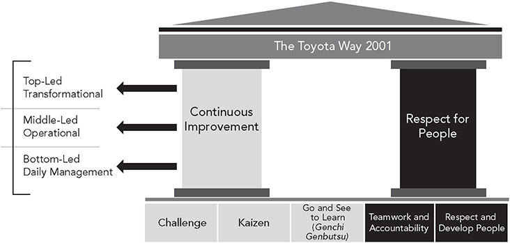
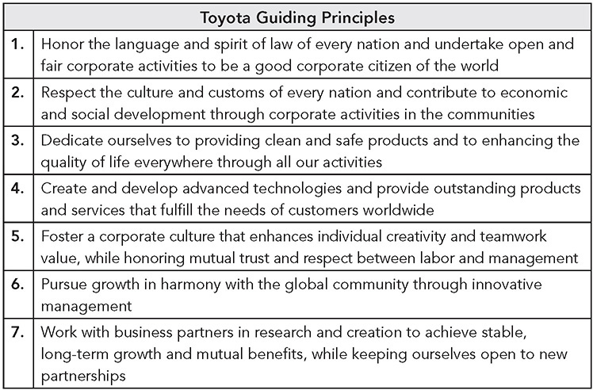
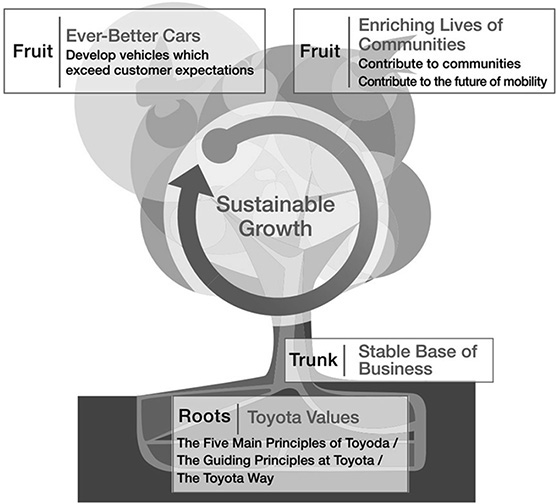
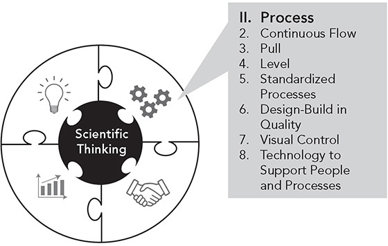

Principle 1

**Base Your Management Decisions on Long-Term Systems Thinking, Even at the Expense of Short-Term Financial Goals**

_The most important factors for success are patience, a focus on long-term rather than short-term results, reinvestment in people, product, and plant, and an unforgiving commitment to quality._

—Robert B. McCurry, former Executive VP, Toyota Motor Sales

Over the last century, the world has moved in the direction of capitalism as the dominant socioeconomic system. The prevailing belief is that as individuals and companies pursue their self-interests, the invisible hand of supply and demand will lead to innovation, economic growth, and the overall economic well-being of humanity. The evidence is clear that money motivates business activity and innovation, but it is also clear that it motivates mostly short-term results. While it is comforting to think we can each simply do what is best for our pocketbooks in the short term and all will be well in the world, there is a dark side to the pursuit of self-interest as the engine for economic growth. We saw it as Enron and other scandals left in their wake an extreme distrust of large corporations and the morality of corporate executives. We saw it in the Great Recession when the moneymaking scheme of subprime mortgages led to millions of people losing their jobs and homes. We see it in the huge economic inequality throughout the world. And we are seeing it as nations struggle to focus resources on fighting the existential threat of human-induced global warming, with many interested parties denying it is even real.

In a fascinating article in the _Atlantic_, Yale professor [Daniel Markovits](./https___www.theatlantic.com_author_daniel-markovits_.md) attributes this profit focus, and the shrinking of the middle class, to large consulting firms.1 He goes back to post–World War II when business was booming and the idea of a job for life was common.

_The mid-century corporation’s workplace training and many-layered hierarchy built a pipeline through which the top jobs might be filled. The saying “from the mail room to the corner office” captured something real, and even the most menial jobs opened pathways to promotion._ 

Much of this pathway to the top ended as professional executives were hired from outside and worked with large consulting firms to cut labor costs and “rationalize” the enterprise:

_When management consulting untethered executives from particular industries or firms and tied them instead to management in general, it also led them to embrace the one thing common to all corporations: making money for shareholders. Executives raised on the new, untethered model of management aimed exclusively and directly at profit: their education, their career arc, and their professional role conspire to isolate them from other workers and train them single-mindedly on the bottom line._

Toyota apparently did not get the memo. The primary company mission is still to add value to society. It invests in its team members, value chain members, and local communities. It begins by providing employees with a stable income. Profits will come, but they are an input to Toyota’s broader purpose—and definitely are not the ultimate goal. Outdated thinking? Yesterday’s news? Need a consulting firm to rationalize them? When we understand how interconnected and uncertain the world is, we can begin to see the business case for a more people-centered way of thinking and acting for the long term.

Toyota, for a variety of reasons, traces its roots to leaders who were natural systems thinkers. For example, any knowledgeable Toyota leader today will emphasize that the Toyota Production System is a system. The parts are all interconnected. Just-in-time exposes problems, but it is only useful if people are trained and motivated to solve problems. Daily problem solving leads to stable operations, a requirement for effective just-in-time. Remove one part, and the house will degrade and eventually collapse. To run a successful business, Toyota believes it needs every piece of the system to function at a high level, which means having the best people and processes in place, and everyone working to continuously improve in a common direction and toward a shared goal. As David Hanna asserts in his seminal book, _Designing Organizations for High Performance_, one of the key tenets of systems thinking is design for purpose.2 It requires companies to ask: “Why does our organization exist? What is our long-term vision?”

In a meeting of Toyota investors on May 12, 2020, after it was revealed that because of the Covid-19 crisis, forecasted profits would be 80 percent below those of 2019, Akio Toyoda explained his priorities for the company:

_As for the immediate crisis, the priorities are the same we always have at Toyota: first safety, second quality, third volume, and fourth profit-making. As times change, these priorities may need to be revisited. But, in the midst of this crisis, our traditional prioritization has continued to be very important. And based upon these priorities, we will try to develop the Toyota people, and this is also very important.3_

His chief risk officer then elaborated:

_We cannot stop investment in the future. This is one of the things that you have to continue forever, and it has to be supported with proper funding. At the time of the Great Recession, we had JPY3 trillion cash on hand. Today, we have JPY8 trillion cash on hand. This is still smaller than we’d like: Apple, for example, has JPY20 trillion. All companies experience ups and downs, of course, but expenditures in the future will be necessary to fund continued growth while ensuring we also continue to contribute to society. . . . However, I am keeping a keen eye on spending. If I see any wasteful spending, I will cut it._

A reason Toyota could continue investing in the future was because it had the highest amount of cash on hand in its history, which by late 2019 had grown to over $50 billion. I have referred to this as saving for a rainy day, though it should be noted that it is not simply hoarding, but investing in human resources and strategically in the future of the company . . . for the long term. This seems like such an obvious virtue. I was reminded how unusual it is when corporate financial advisor Stephen Givens, in an opinion piece in the _Nikkei Asian Review_, reprimanded this very practice: “Japanese companies must stop gloating about cash-hoarding. They should be returning money to shareholders instead of letting it pile up for a rainy day.”4

His rationale was that successful modern corporations prove their worth through the investments shareholders are willing to make in purchasing stock:

_In a healthy and dynamic economy, a CEO must constantly return to the equity markets for fresh capital. The CEO’s ability to raise fresh capital depends on being able to show investors that prior rounds resulted in attractive returns. . . . Instead, Japanese CEOs have been liberated to appeal to fuzzy performance metrics—sustainable development goals, creating social value, fulfilling obligations to our (non-shareholder) stakeholders._

There you have it. The purpose of a corporation is to enrich shareholders, not fuzzy goals like “creating social value.” The only scorecard that matters is stock price. Given this purpose, Toyota is mediocre or worse. Its stock has rarely been a good short-term investment. Taking an opposing perspective, journalist Michael Steinberger wrote of stock buybacks, a favored way of transferring earnings from the company to shareholders:

_Whatever the reason, some estimates indicate that between buybacks and dividends, the largest U.S. companies returned roughly 90 percent of their earnings to shareholders in the last decade. That’s money that could have been used to give employees a raise, or to increase spending on research and development, or to cushion a future downturn, but instead it went to investors.5_ 

Toyota’s public relations policy is to avoid criticizing the philosophies of other companies, but its purpose is clear and unwavering: add value to customers and society for the long term, and in that it has been remarkably successful. This is not simply a do-good philosophy, but a sound business strategy. It is the right principle for building a sustainable company that lasts: _base your management decisions on long-term systems thinking, even at the expense of short-term financial goals._

**A SOCIETAL MISSION GREATER THAN EARNING A PAYCHECK**

Can a modern corporation thrive in a capitalistic world and be profitable while doing the right thing for all its stakeholders and society, even if it means that short-term profits are not always the first goal? I believe that Toyota’s biggest contribution to the corporate world is demonstrating this is indeed possible and, ultimately, is good for business.

Throughout my visits to Toyota in Japan and the United States, in every department—engineering, sales, purchasing, and manufacturing—one theme stands out. All the people I talked with have a sense of purpose greater than earning a paycheck. They feel a sense of mission for the company and can distinguish right from wrong with regard to that mission. They have learned the Toyota Way from more senior leaders and internalized the values: _Do the right thing for the company, its employees, the customer, and society as a whole._ Toyota’s strong sense of mission and commitment to its customers, employees, and society _is the foundation for all the other principles_ and the missing ingredient in most companies that try to emulate Toyota.

When I interviewed Toyota executives and managers for this book, I asked them why Toyota existed as a business. The responses were remarkably consistent. For example, Jim Press, former executive vice president and chief operating officer of Toyota Motor Sales in North America, explained:

_The purpose of the money we make is not for us as a company to gain, and it’s not for us as associates to see our stock portfolio grow or anything like that. The purpose is so we can reinvest in the future, so we can continue to do this. That’s the purpose of our investment. And to help society and to help the community, and to contribute back to the community that we’re fortunate enough to do business in. I’ve got a trillion examples of that._

This is not to say that Toyota does not care about cutting costs. As we discussed in the last chapter, Toyota’s near bankruptcy after World War II and dismissal of workers led to the resignation of the company founder—Kiichiro Toyoda. After that experience, Toyota leaders pledged to become debt-free, and that requires aggressive cost-cutting. Cost reduction has been a passion since Taiichi Ohno began eliminating wasted motions on the shop floor. Often this led to removing a process from a line or cell, but that didn’t and doesn’t translate into removing employees. The person was and still today is placed in another job. As Toyota views it, that’s one less worker that has to be hired and trained in the future.

Toyota has a rigorous Total Budget Control System, in which monthly data are used to monitor the budgets of all the divisions down to the tiniest expenditure. I asked many of the Toyota managers I interviewed if cost reduction is a priority, and they just laughed. Their answers amounted to “You haven’t seen anything until you’ve experienced the cost-consciousness of Toyota—down to pennies.”6 Former Toyota manager Michael Hoseus tells the story of a trip to Japan when a Toyota manager opened his desk drawer and showed him a pencil. It was made up of several taped-together old pencils that had been used until they were too small to hold.

Yet cost reduction is not the underlying principle that drives Toyota. For example, Toyota would no sooner fire its employees because of a temporary downturn in sales than most of us would put our sons and daughters out on the street because we just lost money in a stock market downturn.

Professor Hirotaka Takeuchi and his students studied many such cases in Japan and concluded that a focus on the social good was a key asset in surviving crises. For example, the great earthquake of 2011 and accompanying tsunami devastated many businesses and manufacturing plants, and yet company after company kept its people employed to rebuild and provided goods and services free to the community. One such company, Yakult, manufactures probiotic drinks, and they are delivered directly to customers homes by “Yakult Ladies” (yes, gender bias is still alive in Japan). Despite losing 30 percent of sales, Yakult’s CFO Hiromi Watanabe reassured employees that the company would do everything possible to retain jobs, deliver food and drink to victims, and contribute to the recovery of the community, even if it meant “using all cash and earning reserves of the company.” Professor Takeuchi reports:7

_He distributed $300 in cash to each Yakult Lady from the company’s safe, since banks were closed; used the firm’s delivery center as a temporary shelter for employees and their families; and guaranteed jobs to the Yakult Ladies forced to evacuate their homes. When the supply of the probiotic drinks dwindled due to the Yakult factory shutting down and the Yakult Ladies ran out of products to deliver, some decided on their own to deliver water and instant noodles to their customers, for free. When Watanabe found out, he urged the workers to deliver more items to victims at shelters._

Putting the community and customers first is also in the DNA of Toyota. The company is like an organism nurturing itself, constantly protecting and growing its offspring, so that it can continue to contribute to customers, communities, and society. In this day and age of cynicism about the ethics of corporate officers and the place of large capitalistic corporations in civilized society, the Toyota Way provides an alternative model of the great things that happen when you align almost 400,000 people to a common purpose that is bigger than making money.

**THE NUMMI STORY: RESEARCH TO UNDERSTAND HOW TO EXPORT TPS OVERSEAS**

In the early 1980s, Toyota realized it needed to build cars where it would sell them if it wanted to become a viable global company, but it was deeply concerned about how to bring TPS overseas. Could it translate outside Japanese culture? In 1972, Toyota had set up a small operation in California to make truck beds, referred to as TABC, where it introduced TPS successfully. But an entire vehicle manufacturing and assembly plant was a different animal. It is natural for Toyota to learn by doing, and it is always willing to experiment. The company thought there was value in a partnership and in 1984 launched a 50-50 joint venture with General Motors that became New United Motor Manufacturing, Inc., or NUMMI. Toyota was to teach GM the principles of the Toyota Production System. Toyota agreed to take over a light truck factory in Fremont, California, which had been closed by GM in 1982, and run it according to TPS principles. They also agreed to accept the United Auto Worker’s union. Toyota lawyer Dennis Cuneo, who later became senior VP of Toyota Motor Manufacturing North America, was an attorney for Toyota at the time. He explains some of the challenges:

_The perception that everybody had at that time was that the Toyota Production System just worked people to death. It was just basically “Speed up!” In fact, I remember the first meeting we had in the union hall with union leadership and there was this gentleman by the name of Gus Billy. He was sitting at the end of the table and we were talking about the Toyota Production System and kaizen, etc. He said, “It sounds like a production speed-up to me. It’s the whole concept of making all these suggestions, trying to suggest your way out of a job.”_

Gus Billy’s hostile attitude was widely shared by other workers. When the plant was run by GM, the union local had the reputation of being militant and had even called for illegal wildcat strikes. Workers would intentionally sabotage vehicles. Drugs, alcohol, and prostitution ran rampant. One supervisor was pushed by a worker in front of a moving forklift truck and other workers pointed and laughed.8 Nevertheless, when Toyota and GM formed NUMMI, the United Auto Workers came as part of the package deal. The agreement included a commitment to hire back up to 85 percent of the former GM workers. Against the advice of GM, Toyota decided to bring back the original UAW local leadership who were largely responsible for the militant attitude of the workforce. Cuneo says:

_I think it surprised GM. Some of the labor relations staff advised us not to. We took a calculated risk. We knew that the former GM workforce needed leadership—and the Shop Committee comprised the natural leaders of that workforce. We had to change their attitudes and opinions. So we sent the shop committee to Japan for three weeks. They saw firsthand what the TPS was all about. And they came back “converted” and convinced a skeptical rank and file that this Toyota Production System wasn’t so bad._

Toyota shocked the automotive world when the old factory reopened in 1984 and in its first year surpassed all of GM’s plants in North America in productivity, cost, and quality.9 It is often used as an example of how TPS can be successfully applied even in a unionized US plant with workers who had grown up in the adversarial labor-management culture of General Motors. Cuneo explained that the key was building trust with the workers:

_We built trust early on with our team members. GM had problems selling the Nova in 1987 to ’88, and they substantially cut the orders to our plant. We had to reduce production and were running at about 75 percent capacity, but we didn’t lay anybody off. We put people on kaizen teams and found other useful tasks for them. Of all the things we did at NUMMI, that did the most to establish trust._

According to Cuneo, GM’s initial motivation for entering the venture was to outsource production of a small car. As GM learned more about TPS, the company became more interested in using NUMMI as a learning laboratory. Hundreds of GM’s executives, managers, and engineers visited NUMMI and were impressed by the teachings of TPS and brought back lessons to their jobs at GM. In the late 1990s through about 2003, I visited several GM plants in the United States and China and discovered that the bible for manufacturing they used was a version of the Toyota Production System, first written by Mike Brewer, an early “alum” of NUMMI, who was sent by GM to learn TPS. After several versions, GM’s “Global Manufacturing System” was a direct copy of the Toyota Production System.

Unfortunately, it took about 15 years for GM to take the lessons of NUMMI seriously, beyond words and into action. When it finally made a concerted effort to embrace what it learned from Toyota, it took GM about five years before productivity and quality improved corporatewide (as seen in the auto industry’s _Harbour Reports_ and customer surveys by J. D. Powers and _Consumer Reports_).

You might ask, “Why would Toyota teach its coveted lean manufacturing system to a major competitor, GM?” At the time, Toyota’s purpose was to learn how to bring TPS to life in American culture. Toyota leaders thought there was value in having an American partner with a supply base, administrative and legal systems, and an understanding of America. Toyota offered to teach TPS in exchange. Now Toyota teaches TPS to many organizations, including to not-for-profit companies and charitable organizations for free.

But why teach a competitor? Toyota believes competition is good for everyone and is willing to help other automakers when they are struggling. For example, Toyota shared hybrid technology with Ford and Nissan when each company was struggling, and more recently opened all its hybrid patents, based on its belief in the value of competition. Part of the spirit of “challenge,” as described in _The Toyota Way 2001_ (a document that lays out Toyota’s philosophy), is valuing competition. Toyota will “learn from the challenge and become stronger because of it.” When American auto companies were struggling in the 1980s, Toyota was concerned it might become too dominant. Executive Vice President Yale Gieszl, speaking as the American companies in the 1980s were discovering quality methods and strengthening sales, is quoted in _The Toyota Way 2001_ as saying:

_We at Toyota welcome Detroit’s resurgence and this fierce competition. First, because it proves that auto makers can learn from one another. Second, because competition drives the continuous 47improvement that is the best guarantee of corporate survival. Third, because competition is the only way we can assure a strong growing economy. And finally, because competition benefits all of our customers by providing the improved products they have a right to expect._

**THE TOYOTA WAY 2001 AS THE GUIDING PHILOSOPHY**

For most of Toyota’s existence, there was no talk about the “Toyota Way.” It was simply the way things were. Toyota was a Japanese company that developed and produced vehicles in Japan, and employees of the company were hired, often as their first job, and stayed with the company until they retired. From their first day, employees were immersed in Toyota’s way. They saw no reason to document the theory behind the culture. But all this changed as Toyota globalized. Fujio Cho, the first president of the Georgetown, Kentucky, plant and later president of Toyota Motor Company, saw the need to explain the Toyota Way to people overseas who did not grow up in the company. When he became president of Toyota in 1999, he led an effort to document and teach the Toyota Way and was instrumental in creating the first formal document on the subject in 2001.

_The Toyota Way 2001_, as it is still called, is defined as a house with two pillars—respect for people and continuous improvement (see Figure 1.1). Respect for people extends from the team members on the shop floor to every one of Toyota’s vast network of partners, to its customers, and to the communities in which Toyota does business. Some versions of the model show respect for people as the foundation of continuous improvement, because only highly developed people who care passionately about their work and about the company will put in the effort needed for continuous improvement. Continuous improvement literally means continually improving products, processes, and people at all levels of the organization. Note that continuous improvement does not only refer to small, incremental change. In fact, senior executives take responsibility for large, transformative changes, such as transforming the company to face the new age of electrified, autonomous vehicles. Toyota recognizes that even large, transformative change is the result of solving thousands of smaller problems spread out over time. The twin pillars of respect for people and continuous improvement are further defined by a foundation of five core principles that we summarize here.

**Figure 1.1** Toyota Way 2001 house.

**Challenge**

Toyota was founded on the willingness to tackle tough problems and work at them until they were solved. Every Toyota employee is expected not just to excel in his current role, but to work toward higher levels of performance with enthusiasm. Hoshin kanri, discussed under Principle 13, is a way of cascading challenging goals through all levels of the company. As _The Toyota Way 2001_ puts it, “We accept challenges with a creative spirit and the courage to realize our own dreams without losing drive or energy.”

**Kaizen**

Kaizen is a mandate to constantly improve performance for the better. Kaizen is now a fairly famous concept, and the term will be familiar to many readers. But the vast majority of people, we’ve found, misunderstand kaizen. Too often it has come to mean assembling a special team to tackle a discrete improvement project, or perhaps organizing a kaizen “event” for a week to make a burst of changes. At Toyota, kaizen isn’t a set of projects or special events. It’s the way people in the company work toward goals scientifically, harking back to Deming’s never-ending PDCA (plan-do-check-act) cycles.

**Genchi Genbutsu, or Go and See to Learn**

It would seem that going to see something firsthand is simply a practical matter—although one that is infrequently practiced in most firms—rather than a value. The value of genchi genbutsu isn’t necessarily the specific act of going and seeing, but the philosophy of deeply understanding the current condition before making a decision or trying to change something that you think will be an improvement. There are two main aspects of genchi genbutsu. First, decisions are made based on observed facts about the issue, rather than on hunches, assumptions, or perceptions. Second, decisions should be put into the hands of those closest to the problem and those who have gone to see it and have a deep understanding of its causes and the possible impact of proposed solutions.

In his Foreword to _The Toyota Way to Lean Leadership_, President Akio Toyoda explained his commitment to learning at the gemba:

_In a speech I made shortly after becoming president in 2009 I vowed to be closest to the_ gemba. _Whenever there are real objects there is a_ gemba. _When customers drive our cars the_ gemba _is how they are using our products and what works for them and what causes them difficulties. As the current leader of the company I must model the behavior I expect from others. Going to the_ gemba _means observing firsthand how our products are being designed, built, used, and what problems we have. There are always problems because we are never perfect. The only way we can really understand the problems is at the_ gemba.10

**Teamwork and Accountability**

Most companies say that teamwork is critical to success, but saying this is much easier than living it. At Toyota, the view is that individual success can happen only within the team and that strong teams require strong individuals. Critical to Toyota’s success is single-point accountability. One person’s name goes up next to each item in an action plan. But in order to succeed, the individual responsible must work with the team, draw on its collective talents, listen closely to all team members’ opinions, work to build consensus, and ultimately give credit for success to the team.

**Respect and Develop People**

In many ways, this is the most fundamental of the core values. Respect for people starts with the desire to contribute to society through producing the best possible products and services. This extends to respect for the community, customers, employees, and all business partners.

For Toyota, respect does not mean encouraging a relaxing, work-at-your-own-pace environment. Toyota deliberately creates a steady flow of challenges for its people. The Toyota Production System, with its just-in-time system and andon to surface problems immediately, creates constant challenges on the shop floor. Toyota needs every employee to always be thinking about how to improve processes—continuous improvement—just to keep up with the demands of the highly competitive automobile business. That requires Toyota to invest in team members so that they can be problem solvers. It is these skills in deeply understanding the gemba, solving problems as they occur, and systematically improving through PDCA that make Toyota team members the company’s most valuable asset. Thus, the scientific thinking skills of challenge, kaizen, and genchi genbutsu are integrally connected to respect and teamwork.

**PUTTING THE TOYOTA WAY INTO PRACTICE IN THE GREAT RECESSION**

Perhaps the most dramatic example of Toyota sticking to its core philosophy of respect for people and continuous improvement was during the Great Recession in 2008–2009\. Even before the Lehman Brothers crisis, the auto industry was reeling from rapidly rising gasoline prices. By the summer of 2008, gasoline prices in the United States had almost doubled, topping the prices during the worst of the 1970s’ oil crises on an inflation-adjusted basis. In most of the country, regular gasoline was going for more than $4 a gallon; in states such as California and New York, it was over $5\. That meant that filling up the 20-gallon or larger tanks of large vehicles cost many people more than $100, a high enough threshold to make Americans question whether big was really better. Understandably, the sales of large vehicles all but came to a halt.

But then the bottom really fell out of the market in a way that Toyota did not anticipate. By the fall of 2008 there was no doubt that a major global recession was under way. Credit markets seized up, and suddenly no loans were available. That’s truly a crisis for the automotive industry, since most vehicles are financed. Even consumers who still had access to credit or who could finance a car through other means stopped buying because they feared they might lose their jobs or decided it was a good time to reduce their debt burdens.

As each month passed, Toyota’s North American year-over-year sales numbers plummeted further. By May 2009, sales were 40 percent below those of the previous year. To add insult to injury, the US dollar weakened in relation to the Japanese yen by 15 percent between July and December 2008\. Every 1 percent reduction in the strength of the dollar translated to roughly a $36 million decline in operating income for Toyota in yen terms. As a result of the combined impact of plummeting sales and the currency adjustment, Toyota lost more than $4 billion in fiscal 2009 (April 2008 to April 2009), its first loss as a company since 1950\. Vehicle sales plunged by 1.3 million units to 7.6 million units in 2009, the kind of drop in sales that would lead many companies to close plants and lay off workers.\* Toyota had two plants in the United States that made large vehicles at the time, the Princeton, Indiana, plant made the Sequoia SUV and the Tundra, and in 2006 a new plant had been built near San Antonio, Texas, to also build the Tundra. Both saw sales drop by over 40 percent. Nonetheless, in the face of this calamity, Toyota kept both plants open and did not lay off regular workers. (A more detailed discussion of what happened is found in Chapter 2 of _Toyota Under Fire_.11)

When the loss was announced, reporters began calling me daily to ask for a comment. “What will Toyota do now that it is in crisis?” “Whose decision was it to introduce the Tundra and build a new plant dedicated only to these large fuel guzzlers?” “Who is getting fired over the decision to build the new plant?” “Will the president be fired?”

Those are typical questions from the press when a company announces a $4 billion loss. We’ve become conditioned to the ways in which businesses react to losing money: executives lose their jobs; plants are closed down; people are laid off; projects are canceled; assets are sold. It’s a fairly predictable recipe. In fact, it is the recipe that most of the automotive industry followed. Nissan, for instance, dumped 12 new models and laid off more than 20,000 people. A CNN article in July 2010 reported that the automobile industry in the United States alone laid off 300,000 workers because of plant closings.12 The CEOs of Chrysler, GM, and Kia lost their jobs.

Early in the summer of 2008, when gas prices in the United States were skyrocketing, Toyota already had months of inventory of trucks and large SUVs. It decided to shut down the Indiana and Texas plants for three months from August through October (except Sienna minivan production in Indiana). Then the financial crisis hit . . .

In the winter of 2009, I decided to visit the Indiana and Texas plants to see for myself how Toyota was responding. Neither plant had laid off any regular “team members,” though both had let go their “variable workforce.” The variable workforce is employed by an outside agency that supplies temporary workers. For Toyota in the United States, these temporary workers can stay for up to two years and then must be either let go or made full-time. They provide a buffer that allows Toyota to offer what generally amounts to lifetime employment for the regular workforce. The temporary workers were let go during the downturn.

Both plants had planned in advance how to deal with the three-month shutdown. They developed courses to be taught on the shop floor by group leaders and planned for intensive kaizen to achieve higher levels of performance for when the shutdown ended. When it only partly ended because of the recession, they operated at one shift instead of two. They pulled all the workers onto the day shift. While some worked production, others were training and working on kaizen. In Indiana the plant had an A team working production and a B team doing kaizen for half of each shift. In the middle of the shift, the teams reversed roles.

I learned that the managers had all given up their bonuses and took voluntary pay cuts months earlier, a development that was not even announced to the workforce by Toyota. When that was not enough, as part of a “shared pain” program, workers were required to take every other Friday off without pay.

What was striking during my visits was how busy everyone was, practically running from place to place. All the workers had a detailed schedule of things to do when they were not on production. One reason for the workload was that Toyota took this as an opportunity to move all Tundra production to Texas and bring the Highlander SUV from Japan to Indiana. There was a lot of work to do in both plants to prepare for the move, particularly in Texas because that plant would also be producing a brand-new Tundra model. To reduce costs, Indiana took a lot of the product launch work that would have been done by outside engineers and pulled it in-house. Workers were repurposing equipment where they could, saving Toyota much of the cost of carrying the extra team members. Team members learned to program robots so they could rebuild and reuse the old models they had instead of buying new ones.

One hourly employee, a team leader, explained it this way:

_The difference between Toyota and the other companies is that instead of forcing us to go on unemployment, they are investing in us, allowing us to sharpen our minds. I don’t think there’s one person out there who doesn’t realize what an incredible investment Toyota is making._

As the new products were launched, the Indiana and Texas plants came back on stream, and eventually the company had to hire new workers. The experienced and committed employees that Toyota retained during the recession were now being asked to lead and train the new hires.

Not all was rosy, however. NUMMI became a casualty of the recession and General Motors’ bankruptcy. In June 2009, the iconic plant was closed. After General Motors emerged from bankruptcy, it retained some assets, but it decided to let go of the NUMMI plant and its joint venture with Toyota. Toyota faced the choice to take over 100 percent of NUMMI or let it go. After agonizing discussions and attempts to find a new joint venture partner, Toyota shut it down, doing what it could like paying out severance to workers beyond the legal agreements.

**SYSTEMS THINKING SEEMS TO COME NATURALLY IN TOYOTA**

There are many possible reasons why Toyota’s early leaders were systems thinkers. Sakichi Toyoda was a practicing Buddhist, a philosophy that tends to take a holistic perspective. The company was formed in a rice-growing region, and rice farming is complex, interacting with the environment, and requires cooperation among farmers. Japan is a small island nation that is tossed and turned by tsunamis and earthquakes; the impact of the environment is always visible. Whatever the reasons, Toyota leaders think long term and think in systems.

By “systems,” I mean the parts interact in complex ways that make prediction and control difficult, if not impossible. This is why Toyota sees TPS as a system, and at its heart are people solving problems. If the world were simple, linear, and predictable, as the mechanistic world view suggests (see the Preface), we could forecast, schedule, develop elaborate rules and procedures, and expect the organization to behave according to our plans. Toyota never expects that to happen. Toyota recognizes that living systems are dynamic and unpredictable. People have to continually make adjustments as life happens. People trained in disciplined problem solving will make informed adjustments based on the facts of the situation.

Since Toyota leaders are natural systems thinkers, it allows them to make investments without always expecting a simple cause-and-effect relationship between the action and a bottom-line result. For example, Principle 4 is about leveling the schedule as the foundation of the Toyota Production System. Toyota works exceptionally hard at this, even when there is not a clear and direct effect on profits. Yet it is part of a system that over the long term consistently yields impressive profits.

Toyota’s Global Vision 2020 focused on becoming a leader in “mobility.” exceeding customer expectations, and, of course, engaging the talent and passion of its people.13 While earlier visions focused on automobiles, the company broadened this vision to become the leader in many forms of mobility, including robots for assisting the disabled and people in hospitals, moon vehicles, and vehicles for single individuals. The document stated:

 _Toyota will lead the future mobility society, enriching lives_ _around the world with the safest and most responsible ways of moving people._

 _Through our commitment to quality, ceaseless innovation, and respect for the planet, we strive to exceed expectations and be rewarded with a smile._

 _We will meet challenging goals by engaging the talent and passion of people who believe there is always a better way._

Systems thinking begins with a clear picture of the organization’s purpose. Toyota’s Global Vision and Guiding Principles (see Figure 1.2 and 1.3) make clear that the company must serve its customer with ever-better cars, but it cannot operate in a vacuum. Toyota must also contribute to society through new technologies and “enrich the lives of communities” where it does business. This is yet another reason why Toyota works so hard at maintaining job security and keeping manufacturing plants open. Communities and all the ancillary businesses that support Toyota are dependent on these well-paying jobs. Toyota challenges its workers to contribute to Toyota and make a mark on its history. Toyota genuinely wants its associates to grow, learn, and create lasting customer satisfaction—while contributing to the shared goal of getting repeat customers for life.

**Figure 1.2** Guiding Principles of the Toyota Motor Corporation.

These principles were established in 1992 and revised in 1997\. (Translation from the original Japanese.)

**Figure 1.3** Toyota Global Vision.

Unfortunately, most companies whose leaders are not systems thinkers still suffer from short-term myopia. I give presentations about Toyota throughout the world, and I often get questions that make perfect sense for companies whose only goal is today’s profits. Examples include:

 “Will Toyota abandon JIT if a major disaster shuts down the supply chain?”

 “Doesn’t Toyota lay off employees when business is bad for a particular product in a plant?”

 “If Toyota does not lay off employees, what does it do with them and how can it justify the cost of keeping them idle?”

The simple answer is that Toyota’s business decisions are guided by its purpose and systems thinking. It will not decompose its systems at the drop of a hat. The only way it would change its philosophies of manufacturing, investment, and development of people is if there is a fundamental shift in the world that threatens its long-term survival . . . after very thorough analysis. John Shook, reflecting on what he learned as a manager at Toyota, explains this well:

_Toyota intuited many years ago that it must focus on survival and the integration of all corporate functions toward ensuring that survival. TPS, then, is the result of efforts to 56direct all activities to support the goal of firm survival. This is vastly different from the narrow goal of “making money.”. . . I posit here that Toyota has evolved the most effective form of industrial organization ever devised. At the heart of that organization is a focus on its own survival. It is this focus that enables Toyota to behave as a natural organism, enabling it to evolve as a truly emergent system.14_

**CONSISTENCY OF LEADERSHIP DIRECTION IS KEY TO DELIBERATE CULTURE**

In my master class on lean leadership, we visit a Toyota plant and then have a debrief. One thing that stands out to class members is the remarkable consistency of philosophy and thinking of leaders at all levels. In one class, the first observations that class members made were (1) “Consistency of the principles and values across all levels and time,” (2) “They repeat historical Toyota stories so often,” and (3) “There is a strong culture that is evident everyplace.”

Even in a one-day visit, it is evident that Toyota leaders walk the talk. And the people in the class would have come to the same conclusions if they had visited any other Toyota manufacturing plant in the world. Toyota’s culture is deliberate and consistent, and the company’s words correspond well to actions.

I will discuss as part of Principle 12 on scientific thinking the role of _deliberate_ practice. Often people just play at sports or music or cooking, doing things in the same way over and over, and assume they are practicing. Deliberate practice is goal oriented, focused on determining, for example, “What is my next step to get to a higher skill level? What is the gap between my current way and the desired way? And what exercises can I do to close the gap?” Culture can also be thought about in this way. _Deliberate_ culture\* means we have a very clear idea of the beliefs, values, and basic assumptions that we want our people to hold dear and act upon. It takes work to close the gap between the natural way people think and act and the desired way. _Toyota Culture_15 gives a detailed account of how Toyota selects and develops people to fit the desired culture, which is essential to living its philosophy.

The key to a strong culture is stability. If CEOs and their philosophies come and go as through a revolving door, people simply get confused. They never have a chance to develop deeply held beliefs and certainly will not develop the habitual behaviors required of a positive and vibrant culture. Instead, each new CEO will preach his or her version of a desired culture. Some people will try to support the CEO and will use the right words—but in all likelihood the words will not match the deeds. Toyota’s consistency of philosophy extends back to the founding of the firm. The culture runs unusually deep and is the foundation for excellence.

 KEY POINTS 

 Toyota’s mission goes far beyond short-term profitability, and Toyota is willing to invest for the long term.

 Toyota thinks of its organization as a living sociotechnical system rather than mechanical parts guided by simple and direct cause-and-effect relationships. Investing in developing people allows them to locally control complex system dynamics.

 Toyota is a model for the world in demonstrating how doing the right thing is a profitable business strategy.

 What drives Toyota forward is people who believe there is always a better way and trust the company to do right by them.

 The foundation of team member trust is job security, and Toyota goes to unusual lengths to protect the jobs of its employees.

 The five foundational elements of _The Toyota Way 2001_ drive continuous improvement in pursuing challenging goals through kaizen and a daily focus on developing people and teams.

 Toyota has a deliberate culture that is consistent across locations, levels, and time. Toyota walks the talk.

**_Notes_**

1\. Daniel Markovits, “How McKinsey Destroyed the Middle Class,” _Atlantic_, February 3, 2020.

2\. David P. Hanna, _Designing Organizations for High Performance_ (Reading MA: Addison-Wesley, 1988).

3\. https://planet-lean.com/akio-toyoda-crisis-management/.

4\. https://asia.nikkei.com/Opinion/Japanese-companies-must-stop-gloating-about-cash-hoarding.

5\. https://www.nytimes.com/interactive/2020/05/26/magazine/stock-market-coronavirus-pandemic.html?action=click&module=Top%20Stories&pgtype=Homepage.

6\. Jeffrey Liker and Michael Hoseus, _Toyota Culture: The Heart and Soul of the Toyota Way_ (New York: McGraw-Hill, 2008).

7\. Hirotaka Takeuchi “Why Japanese Businesses Are So Good at Surviving Crises,” _Harvard Business School Working Knowledge_, June 26, 2020.

8\. The supervisor was Leroy Morrow who went on to management positions at NUMMI and later Toyota’s Georgetown, Kentucky, plant and later worked for me as a consultant.

9\. James Womack, Daniel Jones, and Daniel Roos, _The Machine That Changed the World: The Story of Lean Production_ (New York: Harper Perennial, 1991).

10\. Jeffrey Liker and Gary Convis, _The Toyota Way to Lean Leadership_ (New York: McGraw-Hill, 2011).

11\. Jeffrey Liker and Timothy Ogden, _Toyota Under Fire: How Toyota Faced the Challenges of the Recession and the Recall Crisis to Come out Stronger_ (New York: McGraw-Hill, 2011).

12\. Chris Isidore, “7.9 Million Jobs Lost—Many Forever,” CNNMoney.com, July 2, 2010: http://money.cnn.com/2010/07/02/news/economy/jobs\_gone\_forever/index.htm.

13\. http://www.toyota.com.cn/company/vision\_philosophy/guiding\_principles.html.

14\. Personal interview with John Shook, 2002.

15\. Liker and Hoseus, _Toyota Culture_.

\_\_\_\_\_\_\_\_\_\_\_\_\_\_\_\_\_\_\_\_\_\_\_\_\_\_\_\_

\* We should note that in 2008, General Motors lost $30.9 billion, $9.6 billion in the fourth quarter alone. The firm’s survival required that it be taken over by the US government and that it cut tens of thousands of jobs. Ford, meanwhile, lost almost $15 billion in 2008 and had already lost $30 billion in the three years since 2006.

\* Richard Sheridan of Menlo Innovations first introduced me to the concept of deliberate culture.
 **PART TWO** 

**PROCESS**

_Struggle to Flow Value to Each Customer_

