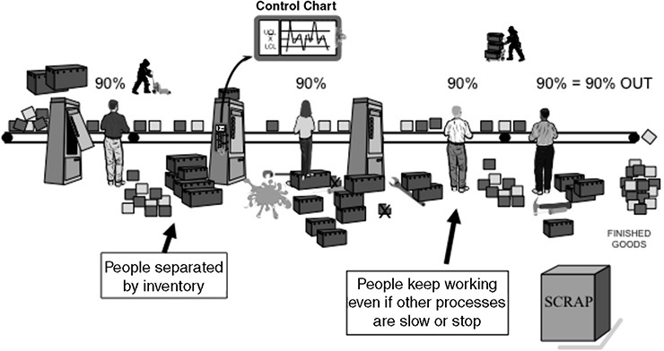
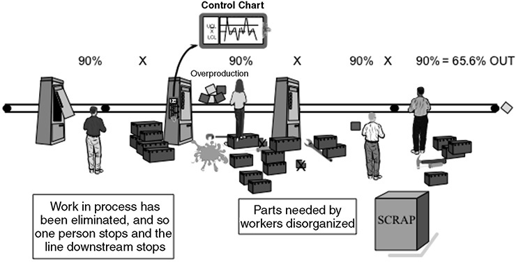
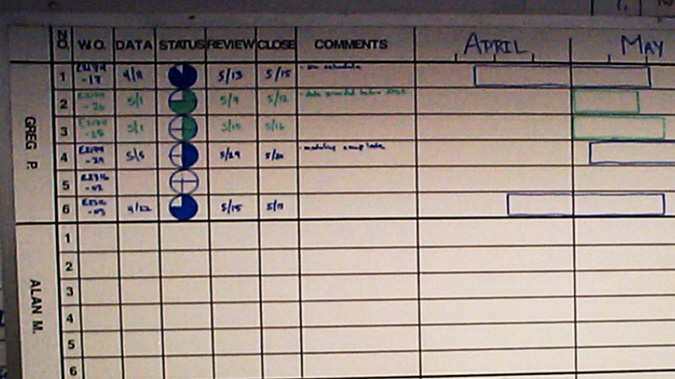
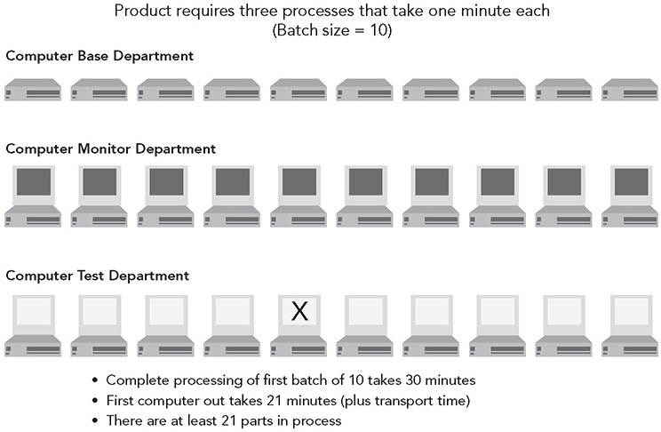
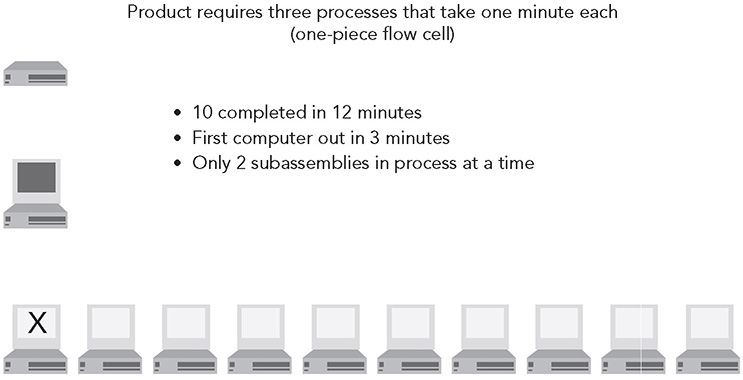
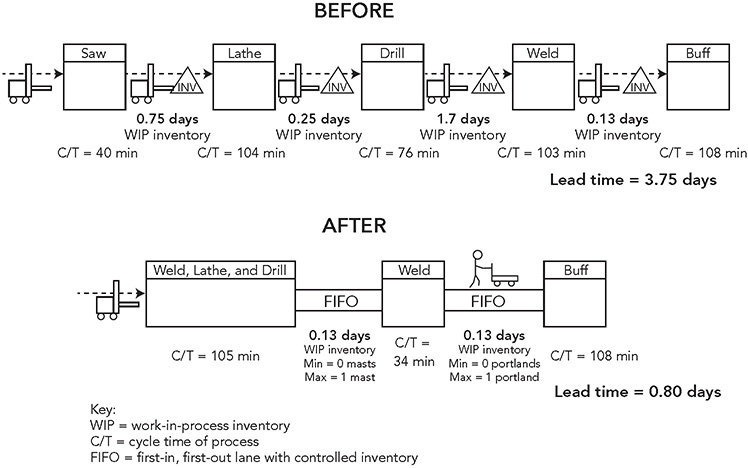
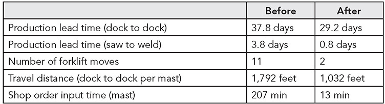
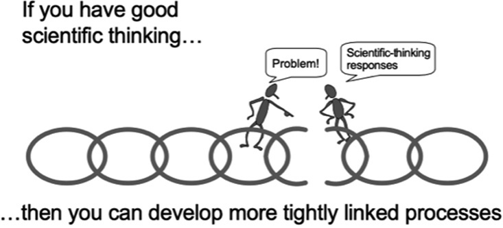

 Principle 2 

**Connect People and Processes Through Continuous Process Flow to Bring Problems to the Surface**

_If some problem occurs in one-piece flow manufacturing then the whole production line stops. In this sense it is a very bad system of manufacturing. But when production stops everyone is forced to solve the problem immediately. So team members have to think, and through thinking team members grow and become better team members and people._

—Teruyuki Minoura, former President, Toyota Motor Manufacturing, North America

In the early days of Ohno’s journey toward TPS, he discovered a fundamental principle that became the backbone of the system. Flow value to each customer, ideally one by one, without stagnation! Waste gets in the way of flowing value. The ideal process, perfectly executed, is all value-added work with zero waste. The iconic symbol of this is the one-piece flow cell. Processes with their associated equipment and tools are lined up in sequence, and workers move through the processes doing value-added work with minimum waste.

It is comforting to believe that if we could only implement the right cells and other lean tools to eliminate waste in the process, we could let it rip and get great results forever . . . or at least for a long time. But processes do not work that way. In fact, when we define and set up a lean process, it is just the starting point for the real action. As Mr. Minoura explains in the opening quote, the whole production line will stop when a problem occurs in one-piece flow. So physically shifting from batch and queue operations (explained in greater detail later in the chapter) to one-piece flow without inventory almost guarantees you will encounter many more problems. So why do it? Precisely to allow the processes to break so we can discover the weak points and improve through kaizen. John Krafcik, who came up with the term “lean production,”1 later described it as “fragile production,” designed to break and expose problems.

In this chapter, we begin looking at the first of 7 of the 14 Toyota Way principles that are part of the second broad category, “Struggle to Flow Value to Each Customer.” Within these 7 principles are the TPS methods for improving routine manufacturing processes and routine parts of service processes. While these tools are important and powerful, the point is not to implement them as if they were physical things, but rather to use them to reveal obstacles that can be solved one by one. It is indeed a struggle. A “lean process” is actually a vision to strive for and an outcome of repeated problem solving. Building on the foundation of Principle 1, these tools come to life when they are part of a companywide, long-term management philosophy of developing people.

**ONE-PIECE FLOW IS NOT FOR THE FAINT OF HEART**

In Toyota, the ideal of continuous flow has become a core belief. Flow is at the heart of the lean message that shortening the elapsed time from raw materials to finished goods (or services) will lead to the best quality, lowest cost, and shortest delivery time. But there is a reason for buffers. Inventory buffers and gaps in time between steps in the process protect downstream processes from upstream processes. If you have a buffer of inventory of a supplier’s parts, you will not be affected by short-term downtime of your supplier or late shipments. You can even sort out quality defects in large shipments to avoid disrupting your production.

On the other hand, this comfort level leads to complacency. Connected processes force all team members to strive for perfection. Ohno taught that lowering the “water level” of inventory exposes problems (like rocks in the water), and you are forced to deal with the problems. Coupling steps in the process so that there is little material or time buffer lowers the water level and exposes inefficiencies that demand immediate solutions. Everyone concerned is motivated to fix the problems and inefficiencies because the process will shut down if they aren’t fixed. As Ohno disciple Mr. Minoura explained:

_When they run one-piece production, they can’t have the quantity that they want so everybody gets frustrated and doesn’t know what to do. But then, within that, they have to find ways to think: what is the way to get the quantity? That is the true essence of TPS and, in that sense, we create confusion so we have to do something different in approaching this problem._

I should warn that one-piece flow is not for the faint of heart . . . or something to plunge into in one big step. A simple calculation illustrates the pressure you will face if you suddenly jump from batch processing to continuous flow. Let’s say you have four sequential processes like the ones shown in Figure 2.1, and each operates properly 90 percent of the time on average. The company has been using a batch and queue approach as long as you can remember, and there is a good deal of inventory between each process and other wastes, but it works pretty well most of the time. Since everyone keeps busy working from inventory, even when upstream or downstream processes break down, you end up with an average of 90 percent output (see Figure 2.1). By maintaining some finished goods in inventory and utilizing overtime when needed, you do not miss any shipments.

**Figure 2.1** A batch and queue system with inventory buffers allows each process to work independently. As long as there is enough inventory, even if an upstream process stops, the downstream process can continue working from the inventory buffer.

All is well until you learn about this new lean stuff and decide to eliminate all excess inventory and enforce one-piece flow, so that when any process slows down, all other processes will be forced to stop and wait for that operation to catch up. Voilà! You have just bought a ticket to disaster and unhappy customers (see Figure 2.2). Now the average output at the end of the line is the product of all the inefficiencies of the four processes, or

90% × 90% × 90% × 90% = 65.6% overall output

**Figure 2.2** Disorganized “one-piece flow” filled with waste, so any process down shuts all processes down. In a sequential process without inventory, you multiply the uptime across processes to get the average output at the end of the line.

Toyota has high expectations for its factories. In a typical plant, Toyota expects about 97 percent of the scheduled vehicles to be built on time during planned operating hours (what’s called OPR, or operational ratio). It has hundreds of processes lined up sequentially without inventory buffers in between, and so we might expect bottlenecks to occur almost continuously. And it even asks team members to pull a cord that may stop the line when they see a problem. Maybe “continuous line stop” is a more accurate term than “continuous flow.” How can the company be so arrogant to expect a success rate of 97 percent?

At Toyota, it is not arrogance, but, in fact, the opposite. The company does not believe it can predict the future, and it expects to have many problems. It cannot guess at all the ways production will fail, so it connects operations with small amounts of inventory, and then as the inevitable failures occur, the employees solve the problems one by one. If no problems occur, there is too much inventory, and the company reduces it some more.

**MOST OPERATIONS ARE FULL OF WASTE, EVEN IF WE DO NOT NOTICE**

Traditional business processes have the capacity to hide vast inefficiencies without anyone noticing—people just assume that a typical process takes days or weeks to complete. They don’t realize that a lean process might accomplish the same thing in a matter of hours or even minutes.

Let’s say you have been promoted and you place an order for new office furniture with a genuine wood desk with drawers and compartments galore and a fancy ergonomic chair. You can’t wait to get rid of that old scuffed and stained furniture from your predecessor. But don’t turn in the old stuff just yet. For one thing, the promised delivery date is eight weeks out, and if you look at online comments of customers, the furniture is likely to be late. Why does it take so long? Your inconvenience is a result of a clumsy manufacturing process called “batch and queue.” Your desk and office chair are mass-produced in stages. Large batches of material and parts sit in a queue at each stage of the production process and wait for long periods of (wasted) time until they are moved to the next stage of production.

Consider the custom-made office chair that is delivered two months after you order it. The value-added work (i.e., the work actually performed) in the assembly process consists of covering standard foam cushions and then bolting together the chair. This takes less than one hour. Actually, making the fabric and foam and frame and parts, which are done in parallel, takes another day at most. Everything else during the two months you are waiting is waste (muda). Why is there so much waste? The department making seat covers, the supplier making springs and frames, and the plant making foam are all producing big batches of these items and then shipping them to the final assembly operation—where they wait in piles of inventory. Then you, the customer, wait for someone to pull the components from inventory and build the chair. More wasted time. Add several weeks for the chair to get out of inventory at the plant and through the warehouse and distribution system to your office. Meanwhile, you have been waiting months sitting in that uncomfortable old chair. In a TPS/lean environment, the goal is to create one-piece flow by constantly eliminating wasted effort and time that is not adding value to your chair. Office furniture maker Herman Miller has spent more than two decades working with Toyota (discussed under Principle 10: “People”) and has cut its process of making and shipping chairs to days. You can get the popular Aeron chair built and delivered to you in 10 days or less.

In the chapter “A Storied History: How Toyota Became the World’s Best Manufacturer,” we summarized the seven wastes that Toyota continually seeks to remove from its processes. That is fine for physical manufacturing processes like making chairs, but how do you distinguish the value-added work from waste in knowledge work? Consider an office where engineers are all very busy designing products, sitting in front of their computers, looking up technical specifications, and meeting with coworkers or suppliers. Are they doing value-added work? The truth is, you do not know. You cannot measure an engineer’s value-added productivity by looking at what he or she is doing or thinking. You have to follow the progress of the actual product the engineer is working on as it is being transformed from concept into a final product (or service). Engineers transform information into a design, so you look at such things as (1) at what points do the engineers make decisions that directly affect the product? and (2) when do the engineers actually conduct important tests or do an analysis that impacts those decisions? Or on the other hand, (3) how much rework is there? Even more complex some of the “rework” is actually useful creative thinking ruling out some ideas that do not prove out. In any case you’re likely to find that typical engineers (or any other white-collar professionals) are working like maniacs churning out all sorts of information. The problem is that very little of their work is truly “value added,” i.e., work that ends up actually shaping the final product.

We worked with one supplier of automotive exhaust systems that needed to reduce its product development lead times to meet customer demands. In one piece of the value chain, the client was doing finite element analysis (FEA) to measure the impact of stress on the muffler to determine how likely it was to fail. Engineers submitted the design of the muffler, and the FEA analysts ran the computer program and provided data on the stresses and strains. Seemed simple enough.

My consultant worked with the FEA group in a three-day workshop. FEA is required by the client’s customers for all muffler design projects, and the client had just received a big contract from General Motors. With the current capacity, the client company could not complete the work. Hiring analysts was difficult, as the work usually requires an advanced degree and analysts with the right credentials were in big demand. The objective of the company was to increase the capacity to handle the additional work with no new hires while reducing lead time.

After setting targets, the FEA group analyzed the current condition by examining a set of completed projects. There was a big difference between an iterative analysis of a partial change in the design and a full analysis of a completely new exhaust system, so the group members separated these out. They found that the average lead time was 18 days for the partial and 38 days for the full analysis. Only 8 percent of this lead time for the partial and 12 percent for the full were value added—about 90 percent was waste! In other words, engineers who needed the analysis results required by the customer were waiting weeks for no apparent reason.

The analysis further revealed that there was no obvious rationale for which projects were worked on and which were in a queue. Moreover, there was a great deal of rework, which seemed to be the result of incomplete or inaccurate data or poor assumptions. The group suggested a number of countermeasures:

 Improve upfront data collection to better understand customer requirements.

 Screen and reduce non-value-added FEA analyses.

 Create a cap on work in process (WIP).

 Create a standard worksheet for the process.

 Provide a visual status of FEA work orders and people loading, by recording the information on a whiteboard.

The WIP cap was on the number of FEA projects each analyst could work on at a time. The group calculated a reasonable maximum limit of six projects per analyst, split between partials and full. As new projects came in, they would be posted on a visual board and assigned to analysts in rows—set up for a maximum of six per analyst (see Figure 2.3). When an analyst’s six slots were full, he or she would not start work on an additional project until after completing one of the six that were assigned—one comes out and another one is started, creating a flow.

**Figure 2.3** Work status board for engineering analysis.

The results were impressive:

1\. Lead time on conducting the analysis and getting results to the engineers was reduced from 18 days to 7 days for the partial redesigns and from 38 days to 16 days for the complete redesigns.

2\. A full 25 percent of capacity was freed up for new projects, enough to handle the forecasted demand and then some, with no additional people.

3\. Quality went up, and rework became rare, satisfying the engineering customers.

4\. The engineers could ask about the status of their projects and get an accurate answer for the first time—which was very important to their customers.

5\. The analysts were no longer feeling stressed.

Note the paradox here. In order to increase throughput, the analysts had to work on _fewer_ projects at a time. Toyota uses these kinds of methods routinely in its product development process, as documented in _Designing the Future_.2

**MASS PRODUCTION THINKING VERSUS FLOW THINKING**

The traditional way to schedule an operation that is organized into separate processes is to send individual schedules to each department. For example, if schedules are developed weekly, then each department head can decide independently what to make each day in order to optimize equipment and utilize people for that week. A weekly schedule also provides flexibility for people missing work. You just make less that day and make it up with more production another day in the week. As long as by Friday you meet the production target, everything is OK.

Lean thinking looks at this way of organizing production and predicts it will result in a lot of work-in-process inventory. The fastest equipment, such as stamping, will build up the most WIP. Material sitting in inventory is caused by the most fundamental waste, overproduction. Inventory sitting idle will cost money, take up valuable space, and, more importantly, hide problems.

Figure 2.4 illustrates a simplified view of a computer maker that is organized into three departments. One department makes computer bases, the second makes monitors and attaches them, and the third tests the computers. In this model, the material handling department decided it wants to move a batch size of 10 units at a time. Each department takes 1 minute per unit to do its work, so it takes 10 minutes for a batch of 10 computers to move through each department. Setting aside material handling time to move between departments, it would therefore take 30 minutes to make and test the first batch of 10 to be shipped to the customer. And it would take 21 minutes to get the first computer ready to ship, even though only 3 minutes of value-added work is needed to make that computer.

Figure 2.5 illustrates a view of the same computer-making process above, organized into a one-piece flow work cell. If Ohno were to manage this process, he would take the equipment needed to make one base from the base department, the equipment for making a monitor from the monitor department, and a test stand from the test department—and then put these three processes next to each other, organized by product family. That is, he would have created a cell to achieve one-piece flow. The differences are stark. The operators in the cell take 12 minutes to make 10 computers, while the batch flow process takes 30 minutes for 10 computers. Moreover, it takes the lean process just 3 minutes (all pure value-added time) instead of 21 minutes to make the first computer ready to ship.

**Figure 2.4** Batch processing example.

**Figure 2.5** Continuous flow example.

**WHY CONTINUOUS FLOW CAN BE FASTER AND BETTER**

It seems logical that making equipment go faster will increase speed. We want to believe that changing A has a simple and direct effect on B. In this case, A is making a piece of equipment go faster, and B is the speed of the entire value stream. With systems thinking we can see that there are more complex relationships. For example, replacing large batch-building equipment with smaller machines that might even be slower but can fit into flow cells can speed the value stream. And going fast but creating defects will slow the value stream even if machines are fast.

In Figure 2.4, the batch processing case, we show one defective computer, with an X on the monitor. It failed to turn on in the test stage. In this large-batch approach, by the time the problem is discovered, there are at least 21 parts in process that might also have that problem. And if the defect occurred in the base department, it could take as long as 21 minutes to discover it in the test department. Notice that speeding up the first process would lead to even more WIP and possibly even more defects.

In Figure 2.5, the one-piece flow cell, when we discover a defect, there can be only two other computers in process that also have the defect, and the maximum time it will take to discover the defect is two minutes from when it was made. The reality is that in a large-batch operation there are probably weeks of work in process between operations, and it can take weeks or even months from the time a defect was caused until it is discovered. By then the trail of cause and effect is cold, making it difficult to track down and identify why the defect occurred.

The same logic applies to a business or engineering process. Let individual departments do the work in batches and pass the batches to other departments, and you are almost certain to experience major delays in getting work done. Lots of excessive bureaucracy will creep in, governing the standards for each department, and lots of non-value-adding positions will be created to monitor the flow. Most of the time will be spent with projects waiting for decisions or action. The result will be chaos and poor quality. Take the right people who do the value-added work, line them up (physically or virtually), and flow the project through those people with appropriate meetings to work on integration, and you will get speed, productivity, and better quality. We have done this many times and it works.

**TAKT TIME: THE HEARTBEAT OF ONE-PIECE FLOW**

In competitive rowing, a key position is the coxswain—the little person in the back of the boat who is calling “row, row, row.” He or she is coordinating the activities of all the rowers so they are rowing at the same speed. Get a maverick rower who outperforms everyone else and guess what!—the boat gets out of kilter and slows down. Extra power and speed can actually slow the boat down.

When you set up one-piece flow in a cell, how do you know how fast the cell should be designed to go? What should be the capacity of the equipment? How many people do you need? The starting point to answering these questions is to calculate the takt.

“Takt” is a German word for rhythm or meter. Takt is the rate of customer demand—the rate at which the customer is buying product. If we work 7 hours and 20 minutes per day (440 minutes) for 20 days a month and the customer is buying 17,600 units per month, then the customer demand requires us to make 880 units per day, or 1 unit every 30 seconds. In a true one-piece flow process, every step of the process should produce a part every 30 seconds. If the process goes faster, it will overproduce; if it goes slower, there will be a bottleneck. Takt can be used to set the pace of production and alert workers whenever they are getting ahead or behind.

Continuous flow and takt time are most easily applied in repetitive manufacturing and service operations. But with creativity, the concepts can be extended to any repeatable process in which the steps can be written out and non-value-added activities can be reduced or eliminated to create a better flow.

**BENEFITS OF ONE-PIECE FLOW**

When you try to attain one-piece flow, you are also setting in motion numerous activities to identify and reduce waste. Let’s take a closer look at a few of the benefits of flow:

1\. **Builds in quality.** It is much easier to build in quality in one-piece flow. Every operator is an inspector and works to fix any problems in his or her station before passing the product to the next station. But if defects do get missed and passed on, they can be detected very quickly, and the problem can be quickly diagnosed and corrected.

2\. **Creates real flexibility.** If we dedicate equipment to a product line, it would seem we have less flexibility in scheduling it for other purposes. But if the lead time to make a product is very short, we have more flexibility to respond and make what the customer really wants. Instead of putting a new order into the system and waiting weeks to get that product out, if lead times are a matter of mere hours, we can fill a new order in a few hours. And changing over to a different product mix to accommodate changes in customer demand can be almost immediate.

3\. **Creates higher productivity.** The reason it appears that productivity is highest when your operation is organized by department is because each department is measured by equipment utilization and people utilization. More pieces produced per machine and per person seems to indicate greater productivity. But in fact, it is hard to determine how many people are needed to produce a certain number of units in a large-batch operation because productivity is not measured in terms of value-added work. Who knows how much productivity is lost when people are “utilized” to overproduce parts, which then have to be moved to storage? How much time is lost tracking down defective parts and components and repairing finished products? In a one-piece flow cell, there is very little non-value-added activity such as moving materials around. You quickly see who is too busy and who is idle. It is easy to calculate the value-added work and then figure out how many people are needed to reach a certain production rate. In every case of the Toyota Production System Support Center (TSSC), set up by Toyota to teach TPS through a demonstration project, when the company changed a mass-producing supplier to a TPS-style line, it achieved a large productivity improvement, often exceeding 100 percent.

4\. **Frees up floor space.** When equipment is organized by department, there are a lot of bits of space between equipment that are wasted, but most of the space is wasted by inventory—piles and piles of it. In a cell, everything is pushed close together, and there is very little space wasted by inventory. By making greater use of the floor space, you can free up space for new products or add new products without expanding the facility. Often companies will use ropes to separate freed-up space with a sign saying “reserved for new business.”

5\. **Improves safety.** Wiremold Corporation, one of the early adopters of TPS in America, decided not to set up a separate safety program. Yet when Wiremold worked to transform its large-batch-process company to one-piece flow, its safety improved, and it even won a number of state safety awards. Smaller batches of material were moved through the factory, which meant getting rid of forklift trucks, a major cause of accidents, and also meant lighter lifting of materials and reduced handling of materials. Safety was getting better because of a focus on flow—even without a formal safety program.\*

6\. **Improves morale.** Wiremold, in its lean transformation, also found its morale improved in every year of the transformation. Before the transformation, only 60 percent of employees agreed that the company was a good place to work. That went up each year, to over 70 percent by the fourth year of transformation. In one-piece flow, people do much more value-added work and can immediately see the results of that work, giving them both a sense of accomplishment and job satisfaction.

7\. **Reduces cost of inventory.** Capital not tied up in inventory is cash flow that can be invested elsewhere. And companies do not have to pay the carrying costs of the capital they free up. On top of that, inventory obsolescence goes down. This was especially important at Dana Corporation, when under chapter 11 bankruptcy reorganization, the company freed up hundreds of millions of dollars of cash tied up in inventory to pay off high-interest-rate loans.3

8\. **Unleashes creativity of people.** One of the greatest benefits of one-piece flow is that problems surface and challenge people to think and improve.

**REAL FLOW VERSUS FAKE FLOW**

Many companies change the physical layout of equipment and think that one-piece flow will automatically follow. But they often are creating fake flow. An example of fake flow would be moving equipment close together to create what looks like a one-piece flow cell, then batching product at each stage with no sense of customer takt. It looks like a cell, but it works like a batch process.

For example, the Will-Burt Company in Orrville, Ohio, makes many products based on steel parts. One of its larger-volume products is a family of telescoping steel masts that are used in vans for radar or for camera crews. Each mast is custom designed, depending on the application, so there is variation from unit to unit built. The company called its mast-making operation a cell and believed it was doing lean manufacturing. In fact, before I helped lead a lean consulting review of Will-Burt’s processes, a production manager warned us that with the variety of custom products the company made, we would not have any luck improving the flow.

In a one-week kaizen workshop, we analyzed the situation and determined that this was a classic case of fake flow.\* The work time (value added) it took to build one of these masts was 431 minutes. But the pieces of equipment for making each mast were physically separated, so forklifts were moving big pallets of masts from workstation to workstation. WIP built up at each station. With the WIP, the total lead time from raw material to finished goods was 37.8 days. Most of this was the storage of tube raw material and finished goods. If you just looked at the processing time in the plant, it still took almost 4 days from sawing to final welding to do 431 minutes of work. The travel distance of the mast within the plant was 1,792 feet.

The group came up with a new design and began moving the equipment closer together, moving one piece at a time through the system, eliminating the use of the forklift between the operations (a special dolly had to be created to move this large unit at workstation height between two of the operations that could not be placed next to each other), and creating a single shop order for one mast instead of batches of shop orders for a set of masts on one order. Figure 2.6 depicts the process flow before and after the one-week kaizen workshop. You can see that the “before” situation was really a case of fake flow. Pieces of equipment were sort of near each other, but there was not really anything like a one-piece flow. And the people working in the plant did not understand flow well enough to see that it was fake flow. The “after” situation was a marked improvement that surprised and delighted everyone in the company. People were shocked that such a transformation could be done in one week.

**Figure 2.6** Mast-making operation before and after one-week lean transformation.

These changes led to significant improvements in lead time, reduced inventory, and reduced floor space (see Figure 2.7). One side benefit of the workshop was that the time to set up a shop order was investigated. The batching of shop orders created a lot of waste; and when the system was eliminated, time was reduced from 207 minutes to 13 minutes. This is not to say that the transformation was complete and after the workshop we could pack up and go home confident the patient would thrive. We advised the company that this was only the starting point to demonstrate the power of one-piece flow and warned that even more problems would become visible and the key to sustainability was continuous improvement.

**Figure 2.7** Fake flow versus one-piece flow.

**ONE-PIECE FLOW IS A VISION TO STRUGGLE TOWARD, NOT A TOOL TO IMPLEMENT**

Toyota’s vision for any process is true one-piece flow that is waste-free. Creating flow means linking together processes that otherwise are disjointed. When operations are linked together, there are opportunities for more effective teamwork, rapid feedback on problems, control over the process, and direct pressure for people to solve problems and think and grow. Ultimately, within the Toyota Way, the main benefit of one-piece flow is that it challenges people to think and improve. Toyota is willing to risk shutting down production in order to surface problems and challenge team members to solve them. The Toyota Way is to stop and address each problem as it is exposed. Principle 6 (on stopping to fix problems_)_ explains this in more detail.

As the title of the “Process” set of principles suggests, flowing value to each customer without interruption is a vision, and a struggle. There is often confusion about one-piece flow, as in a work cell, being a solution versus a vision. For example, I hear things like “We can’t implement one-piece flow because we have a lot of downtime on one finicky robot, and we would just shut down all production.” Or “We are a job shop, and orders vary every hour and follow different routes, so there is no defined sequence of processes to put in a cell.” In both these cases, a work cell is seen as a solution that people believe is a bad fit for their situation—and they are right that it probably is a bad solution for them. Their problem is that they think it is supposed to be a solution.

I recall one of the early examples of TSSC working with an automotive supplier, Grand Haven Stamped Products in Michigan, that made gear shift mechanisms. Mr. Ohba, who ran the center, walked the value stream, which included a robot that welded together steel parts and a series of assembly operations and asked then to make a one-piece flow cell with these processes grouped together. The President and other key leaders described to me staying up all night to create the cell including pushing the robot across the shop floor. When they ran the cell, they could barely finish a single gear shift level. Some process always seemed to break down and stop production. Mr. Ohba came back and asked them to fix the problems. The cell was revealing many problems, and they had to either solve them or production would stop.

As Mr. Minoura pointed out, one-piece flow will, in fact, cause stoppage in production and is only a good idea if you use this as an opportunity to improve the process. Process flow and problem solving go hand in hand. In Figure 2.8, we flip the script. We often think of one-piece flow as an independent variable, something to technically manipulate to get the results (dependent variables) that we want. In this figure we view one-piece flow as a dependent variable (or at least intermediate to the outcomes we want).\* We get closer and closer to one-piece flow as we think scientifically about why the chain is being broken and we improve the process. And in response, as we get closer to one-piece flow, the chain will tighten and expose new problems; one by one we solve them and get even closer to the ideal of one-piece flow. It is a repeated virtual cycle of continuous improvement.

**Figure 2.8** One-piece flow and scientific thinking.

 KEY POINTS 

 The core concept in Toyota’s just-in-time system is struggling toward the vision of one-piece flow of value to the customer, with zero waste.

 We often think of a process as if it were a physical thing, but it is actually an ideal to strive for, not a tool to implement.

 Mass production thinkers often have the mistaken impression that if they minimize the cycle time of individual processes, they will make the overall operation more efficient, but more often than not they simply create mountains of waste, slow the speed of materials and information to the customer, and create a lot of confusion.

 Not only does one-piece flow increase productivity, but it can lead to better quality, shorter lead time, enhanced customer responsiveness, higher morale, and better safety.

 While there are immediate benefits of shifting from process islands to a flow line, longer-term benefits come from surfacing problems so they can be addressed quickly, enhancing continuous improvement.

 The companion to one-piece flow is developing in people at the worksite a scientific mindset to solve problems as they surface.

**Notes**

1\. J. F. Krafcik, “Triumph of the Lean Production System,” _Sloan Management Review_, 1988, vol. 30, pp. 41–52.

2\. James Morgan and Jeffrey Liker, _Designing the Future: How Ford, Toyota, and Other World-Class Organizations Use Lean Product Development to Drive Innovation and Transform Their Business_ (New York: McGraw-Hill, 2018).

3\. Jeffrey Liker and Gary Convis, _The Toyota Way to Lean Leadership_ (New York: McGraw-Hill, 2011), chap. 6.

\_\_\_\_\_\_\_\_\_\_\_\_\_\_\_\_\_\_\_\_\_\_\_\_\_\_\_\_

\* For a detailed analysis of Wiremold and its lean transformation, see Bob Emiliani, David Stec, Lawrence Grasso, and James Stodder, _Better Thinking, Better Results_ (Kensington, CT: Center for Lean Business Management, 2002).

\* The kaizen workshop was led by Jeffrey Rivera, former senior lean consultant in my company, and Eduardo Lander, at that time my doctoral student at the University of Michigan.

\* Thanks to Mike Rother, who proposed the concept of thinking about many lean techniques, such as one-piece flow, as dependent variables and modified Figure 2.8 accordingly.

