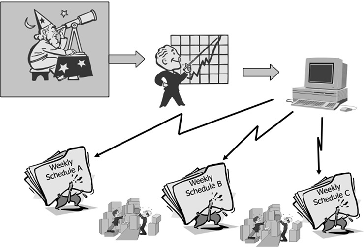
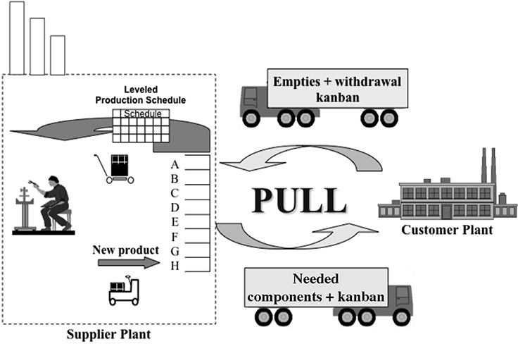
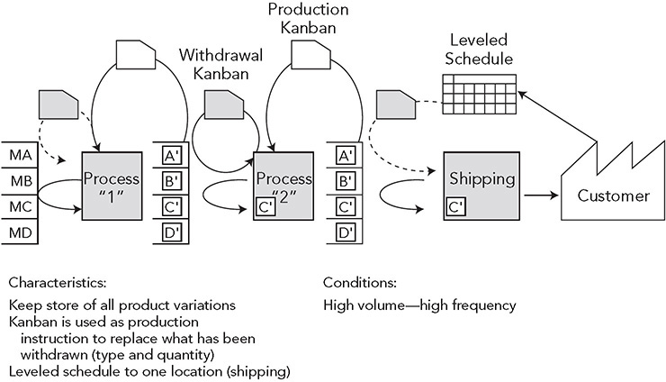

 Principle 3 

**Use “Pull” Systems to Avoid Overproduction**

_The more inventory a company has, . . . the less likely they will have what they need._

—Taiichi Ohno

Imagine you discover a great internet service where you can get all your dairy products delivered directly to your house at a significant discount. The only hitch is that you must sign up and specify a weekly quantity of each item for the coming month. The company has to schedule weekly shipments of goods to its warehouse, so it wants advance orders locked in to make sure it sells all the inventory that it receives. If you’re not home when your order arrives, the delivery person will leave it on your front porch in a thermo container to keep it cold. Since you are not sure how much you will use, you estimate the quantity of eggs, milk, and butter that you will need for a week and then add a little extra for a safety factor. The problem is that if you don’t use everything you ordered in one week, it will accumulate in your refrigerator and possibly go bad. Week after week, your inventory grows, so you buy a second refrigerator and put it in the garage—a major expense. Another problem: if you go on vacation and happen to forget to cancel the order for that week, you will have a week’s worth of bad dairy products on your front porch when you return.

This is an example of a scheduled _push_ system. In business, goods and services are often pushed onto the retailer based on sophisticated scheduling systems. Some even use AI and big data. Perhaps they guess right more often than past systems, but it is still an educated guess about the future, and the goods are pushed onto the retailer, whether or not it can sell them right away. In response, the retailer tries to push them onto you, the consumer, through price discounts or other merchandising strategies. If you respond to the promotions, you very well may end up with an inventory of stuff that you do not need immediately; and most likely, the retailer is still left with a boatload of inventory.

Now imagine that the internet service we talked about earlier gets a lot of complaints and decides to benchmark Toyota’s pull system and make major changes in its logistics system. The service sends you a wireless device that attaches to your refrigerator and has buttons for each of your frequently used dairy goods. When you open your next-to-last container of milk or begin to use your next-to-last carton of eggs, you push the button for that item. The next day, the company will deliver one unit to replenish the item you just started using. This means you will have the partially used unit, if you did not finish it, plus one more. Some inventory, but not a lot. If you anticipate you’ll use a lot of a product in the near future, like milk, then you can send your order via the internet or an app, and the company will immediately deliver what you need. On its end, the internet retailer renegotiated agreements with its dairy suppliers so that when customers order more product, it triggers a signal to dairy companies to send the retailer that amount. These are examples of _pull_ systems, aka just-in-time (JIT). You receive items only when you demand them, and the retailer receives product based on actual customer demand. To avoid having items pushed on you, you might even be willing to pay a little more for this “on-demand” service.

Many companies and service organizations within companies work to their own internal schedule. They do what is convenient for them within that schedule. So they produce parts, goods, and services according to their planned schedule and push products onto their customers, who must stockpile those products in inventory (see Figure 3.1).

**Figure 3.1** From forecast to push systems.

I was impressed by an article about the fast-growing Sweetgreen chain of healthy food restaurants.1 The founders are not cooks and did not know much about food when they started up. They were techies and developed a mobile app for advanced ordering and delivery—a pull system. Many companies seem to think if they have an app, all the logistics will take care of themselves. The founders could have viewed their new business as a tech company that happens to serve food—but they did not. The article described the challenges one of the company founders faced:

_Mr. Neman said he was acutely aware that Sweetgreen is not a tech company. It is very much a restaurant company, beholden to the laws of gravity that define food service expansion: its employees chop every vegetable, roast every chicken thigh and make hummus and prepare nearly 60 other ingredients from scratch every day, at each and every restaurant. The company is in the business of atoms, not bits. . . . “Sometimes I complain that it’s so hard, for all those operational reasons,” Mr. Neman said. “Then I remind myself that maybe that’s good, because it’s hard for everyone else, too.”_

Toyota has always been clear that it is at its core a manufacturing company. And unlike an internet company, supply chain logistics have to do with “atoms, not bits.” Amazon is as much a warehousing and delivery company as an internet company. As you already know, the Toyota Way is not about managing inventory; it is about satisfying customers through lean value streams. Very early on, Ohno started thinking about pulling inventory based on immediate customer demand, rather than using a push system that tries to anticipate customer demand through forecasts. In the Toyota Way, “pull” means the ideal state of just-in-time manufacturing: giving the customers (which may be the next step in an internal process) what they want, when they want it, and in the amount they want. The purest form of pull is one-piece flow, discussed under Principle 2\. If you can take a customer order and make a single product just for that order—using a one-piece flow production cell—that would be the leanest imaginable system. It is 100 percent on-demand, and you have zero inventory. But because there are natural breaks in flow in the process of transforming raw materials into finished products delivered to customers, some inventory is usually necessary.

The internet example we used above is not a zero-inventory system, even in its improved and leaner state. There is inventory, which can be thought of and referred to as a buffer. The (improved) internet service is asking you to simply indicate when you begin to use an item so the service can replenish what you have started to use while you still have some inventory in your refrigerator. It is replenishing what you are removing. This is how most supermarkets work. In fact, supermarkets are simply warehouses that operate in a particular way. There is a specific amount of inventory kept on the store shelves, based on past purchase patterns and expected future demand. Customers pull items they want off the shelves, and the supermarket clerks periodically look at what has been removed from the shelves and replenish it from the backroom inventory. The clerks are not simply pushing inventory onto shelves, nor are they directly ordering goods from the manufacturer to put on the shelf. The clerks draw from the supermarket’s small and measured inventory through a replenishment system.

**THE PRINCIPLE—USE PULL SYSTEMS TO AVOID OVERPRODUCTION**

Taiichi Ohno and his associates were fascinated by the importance of the supermarket in daily life in America in the 1950s. Ohno recognized from the start that in many cases inventory was necessary to allow for smooth flow. He also recognized that individual departments building products to a schedule using a push system would naturally overproduce and create large banks of inventory, and as we learned, “overproduction” is the fundamental waste.

Ohno needed a compromise between the ideal of one-piece flow and push. Building on the earlier work of Kiichiro Toyoda on JIT systems, Ohno (and his associates) came up with the idea of creating small amounts of “shop stock” between operations to control the inventory. The idea was simple: When the customer begins to use a container of parts, the customer sends a signal and material handling brings to the customer the next container of parts, which triggers producing another container of parts. When the customer does not need the parts, the container sits in the customer’s buffer and nothing needs to be produced. There is little overproduction, and at least indirectly, there is a clear and simple connection between what customers want and what the company produces—the customer simply signals in some way that “I am ready for some more of this product.”

Since factories are often large and spread out and parts suppliers may be some distance away, Ohno needed a way to signal that the assembly line was getting low on parts and needed more. He used simple signals—cards, empty bins, empty carts. Collectively, these signals are called “kanban,” which means signs, posters, billboards, cards—although the word is taken more broadly to indicate a signal of some kind. Send back an empty bin—a kanban—and it is a signal to refill it with a specific number of parts. Or instead of an empty bin, send back a card that specifies the item and number of parts in a batch.

In today’s world of high-speed electronic communications, Toyota uses electronic kanban, but it also utilizes paper kanban on bins that have bar codes for scanning. This redundant system allows for the possibility that there will be errors in the electronic system and lets people still see the visual—for example, noticing if a container is traveling without any kanban attached. It is a remarkable, simple, effective, and highly visual communication system. This is not to say Toyota does no production scheduling. As we will see in the next chapter, production control uses a complex algorithm that takes customer orders and creates a leveled schedule. In Toyota, the ideal is to establish a production schedule in one place—which is the pacemaker of the operation—and let that operation pull parts to it based on kanban.

We have emphasized that the Toyota Way is based on systems thinking. One might think that planning for a complex system requires equally complex scheduling systems that have a macro view of the whole and also that planning optimizes what should be happening at each point in the process. Unfortunately, the world is too complex for even the most sophisticated scheduling systems, particularly when they are based on predicting the future. So Toyota’s version of systems thinking is to break processes down into smaller parts and distribute local control to local customers—which creates small feedback loops based on the most recent information. Kanban gives the scheduling power to each customer in the value chain and allows each to flexibly place orders based on actual need. The faster the response time, the less inventory is needed, so Toyota is constantly taking waste out of the system to flow faster.

One of Spear and Bowen’s four rules in their DNA of TPS article speaks to this approach of distributed control:

**Rule 2**

_Every customer-supplier connection must be direct, and there must be an unambiguous yes-or-no way to send requests and receive responses.2_

The kanban is one such yes-or-no communication device. In effect, by posting the kanban the customer is saying, “Based on my actual situation now, I am ready for what is on this card—yes.”

**PULL-REPLENISHMENT SYSTEMS IN EVERYDAY LIFE**

One way to demystify the concept of kanban is by thinking of simple examples of pull-replenishment systems in everyday life. How do you decide when to buy standard grocery items you keep at home? You notice when inventory is running low on an item and say, “Yep, I better go and buy this amount of that.” Similarly, for filling your auto with gas or replenishing your windshield wiper fluid, you look at the level and decide when to replenish.

On the other hand, not everything can be replenished based on a pull system; some things must be scheduled. Take the example of high-end products, like a Rolex watch, a sports car, or those killer high-tech golf clubs advertised by Tiger Woods. Whenever you are buying a special or single-use item, you have to think about what you want, consider the costs and benefits, perhaps save money in advance, and plan when to get it. In a sense, you create a schedule to purchase, since there is no immediate need for it.

Personal services are another type of scheduled purchase. They usually aren’t needed immediately and generally have to be scheduled in advance. For example, we make appointments for our routine dental cleaning, medical exam, or haircut. If our medical needs are urgent and require a pull system, we go to urgent care or the emergency room.

**TOYOTA’S KANBAN SYSTEM—PULL WHERE YOU MUST**

The ideal one-piece flow system would be a zero-inventory system where everything in the value chain appears when needed. Toyota sees one-piece flow as a vision, a true north to provide a direction, not something you can perfectly achieve. Sometimes, one-piece flow is not possible because processes are too far apart, cycle times to perform the operations vary a great deal, or there is changeover time. In those situations, the next best choice is often Toyota’s kanban system, utilizing small inventory buffers that you should try to shrink over time.

Rother and Shook, in their _Training to See Kit_, explain how to teach value stream mapping and provide guidance for developing the future-state map.3 They suggest answering the question, “Where will you flow, where do you need to pull?” Rother began to use the catchier saying, “Flow where you can, pull where you must.” You can go far with this simple slogan. The point is to aim for one-piece flow when you can, but if that is not possible, the next best thing is often a pull system with some type of material or information buffer.

Consider a pull system in a Toyota assembly plant. Orders accumulate from car dealerships. Production control creates a leveled schedule (discussed in Principle 4). That schedule is sent to the body shop, where stamped steel panels (from a “supermarket” of prestamped panels) are welded together into a body, which flows through small buffers to assembly, maintaining the sequence. On the other hand, stamping the panels (taking a few seconds each) is a much faster operation than the speed of the body shop. If you were to put a stamping press in a cell with welding that is doing 60 seconds of work to the takt, the stamping press would do work for a few seconds than stop and wait for the rest of the 60 seconds, so putting stamping into a one-piece flow is not practical. Instead stamping builds in batches to an inventory buffer based on kanban. At a certain trigger point when a certain number of steel panels have been used by the welding shop, a kanban goes back to a stamping press, ordering it to make another batch to replenish the store.

Similarly, when assembly-line workers begin to use parts from small batches in bins (hinges, door handles, windshield wipers), they take out a kanban and put it in a mailbox. A material handler on a timed route will pick it up, along with the empty container, and go back to a store to replenish what was used on the assembly line. Another material handler will replenish the store based on parts from a supermarket of supplier parts, which, in turn, will trigger an order back to parts suppliers. And so on.

Figure 3.2 illustrates a system like this, where parts in the assembly plant are replenished by a supplier. The process starts at the assembly factory (on the right side of the diagram); then “withdrawal kanban” and empty containers are sent back by truck to the supplier to be refilled (or electronic pull signals can be used). The supplier keeps a small store of finished parts in a “parts store,” but may not want to build new parts in the exact sequence the kanban arrive. Rather, the supplier looks at the kanban and levels its own schedule, as we discuss in Principle 4 next. Figure 3.3 illustrates what this might look like internally from the perspective of the supplier plant.

**Figure 3.2** External pull system with suppliers.

**Figure 3.3** Example of internal pull systems.

**USING PULL IN A GENERAL MOTORS TRAINING OFFICE**

You can effectively use pull-replenishment systems in the office to save money and help avoid shortages of supplies. Most offices use some form of pull system already. Nobody knows exactly how many pencils, erasers, or reams of paper will be used in an office. If there were a standing, scheduled order for all these things, you would guess right in some cases, have too much in other cases, and run out of some critical items at other times. So in a well-run office, somebody’s job is to keep the supply store stocked by looking and seeing what is used. You replenish when needed.

General Motors at one point had a Technical Liaison Office in California when the NUMMI plant was still open and used the office as a training ground for TPS coupled with NUMMI tours. Many GM employees had their first lesson on TPS at this office. Appropriately, GM made this a model lean office. For example, it created a formal kanban system for supplies, and as a result, the office rarely ran out of anything. There was a place for everything and everything in its place—in the storeroom, on desks, or by the computer. For example, in the supply storage area, it placed little, laminated kanban (cards) by every item that indicated when the item should be triggered. So, for instance, when the aspirin bottle reached one-quarter full, the aspirin kanban was put into a coffee can for reordering. And another example: The office originally had a conventional refrigerator that held soft drinks, and some drinks were always overstocked while others ran out. Since you could not see through the door, it was easy to hide the mess inside. So the office purchased a big soda machine with a glass front that allowed people to easily see the state of soft drink supplies. The soda machine was stocked with a variety of juices and soft drinks on marked shelves. When a certain soft drink reached a certain level, the user took out the kanban for that soft drink and put it in a box to get the drink reordered.

You might think a pull system in a small office is not appropriate—it would be too elaborate and bothersome to maintain when measured against the promised cost savings. You might even conduct a cost-benefit analysis to decide if it is a good use of time. But understand this: in conducting the analysis, you would be displaying traditional mass production thinking. The point is—and this gets closer to the heart of TPS—the benefits may go beyond the pennies saved. The power of the Toyota Production System is that it unleashes creativity and continuous improvement. So putting in place these kanban systems is likely to intrigue your office workers, get them interested in improving the process of ordering supplies, and ultimately lead them to find ways to create flow in their core work. Waste in offices is generally far greater than in factories. A little creative effort to improve the process will have huge multiplier effects.

Pull systems can also be used to regulate information flow. Under Principle 2, we saw how a simple visual board regulated how many projects the finite element analyst worked on. This was also a type of pull system. There was a defined amount of work-in-process inventory, and then when one project was complete, a replacement project could be pulled into the process.

**SETTING UP PULL SYSTEMS IS ONLY THE BEGINNING**

It is fascinating to watch a pull system work. A huge number of parts and materials move through the facility in a a kind of rhythmic dance. In a large assembly plant, like the Toyota plant in Georgetown, Kentucky, thousands of parts are constantly moving about. Alongside the assembly line, small high-frequency parts in small bins arrive from neatly organized stores while empty bins go back. It is hard to imagine how a central scheduling system could do such a good job of orchestrating an intricate movement of parts given the inherent uncertainty in complex systems.

At the same time, TPS experts get very impatient and even irritated when they hear people rave about kanban and declare that it is the be-all and end-all of the Toyota Production System. Kanban is a fascinating tool, and it is fun to watch. I have led many tours of lean plants, and you can spend hours talking about the technical details of many different types of kanban systems and fielding a variety of questions: “How is the kanban triggered?” “Should you replenish just what has been used or trigger the next order in a predetermined sequence?” “How are the quantities calculated?” “What do you do if a kanban gets lost?” But that is not the point. You do have to know those things when you set up your system, but they are pretty straightforward technically. The real purpose of kanban is to eliminate the kanban.

The challenge is to develop a learning organization that will find ways to reduce the number of kanban and thereby reduce and finally eliminate the inventory buffer. Remember, the kanban is an organized system of inventory buffers, and according to Ohno, inventory is waste, whether it is in a push system or a pull system. So kanban is something you strive to get rid of, not to be proud of. In fact, one of the major benefits of kanban is that it forces improvement in your production system. Let’s say that you have printed up four kanban. Each one corresponds to a bin of parts. The rule is that a bin cannot move unless a kanban is traveling with it. Take one kanban and throw it away. What happens? There will now be only three bins of parts circulating in the system. So if a machine goes down, the next process will run out of parts 25 percent faster. It may stress the system and cause some shutdowns, but it will force teams to come up with process improvements.

Kanban is a simple visual system that sends a signal from a customer to a supplier. It is binary communication: “I see I reached the trigger point; please send more.” Try it—it’s fun and works!

 KEY POINTS 

 Most companies assume that they can use demand forecasts and complex scheduling algorithms to give instructions to each individual process.

 The traditional way of production scheduling often leads to push systems where even small changes in demand or conditions can throw off the process, leading to inventory banks, parts shortages, and missed shipments.

 Toyota uses scheduled systems, often to create leveled schedules, but prefers to schedule only at one point in the factory—the pacemaker.

 Ideally, Toyota would only use one-piece flow operations without work-in-process inventory, but for many situations this is not practical.

 When one-piece flow is not practical, Toyota pulls parts from small inventory buffers and then replenishes the buffers much like the modern supermarket does.

 Kanban (a physical or electronic signal) is often used so the upstream process (customer) can inform the downstream supplier process when it is ready for more of a particular part.

 The biggest value of the kanban system is to help visualize the flow, study it, and find ways to reduce inventory in order to get closer to one-piece flow.

 Pull systems are frequently used in service environments, like hospitals and offices, to regulate the internal flow of materials and are also powerful to regulate information flow.

**Notes**

1\. Elizabeth G. Dun, “In a Burger World, Can Sweetgreen Scale Up?,” _New York Times_, January 4, 2020.

2\. Steven Spear and Kent Bowen, “Decoding the DNA of the Toyota Production System,” _Harvard Business Review_, September–October 1999, p. 98.

3\. Mike Rother and John Shook, _Training to See Kit_ (Cambridge, MA: Lean Enterprise Institute, October 2002).

