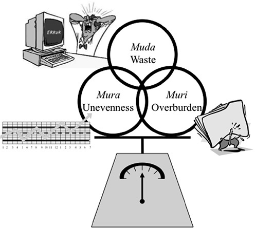
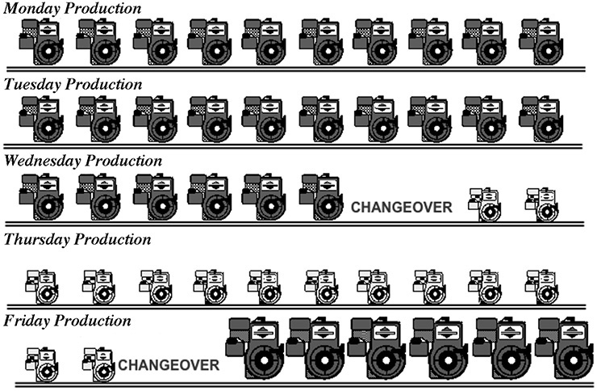
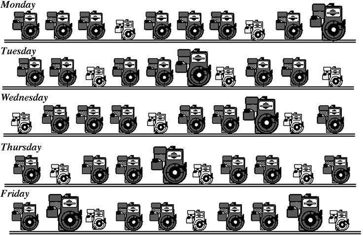
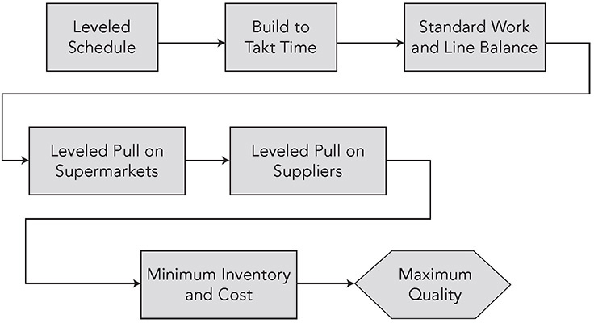
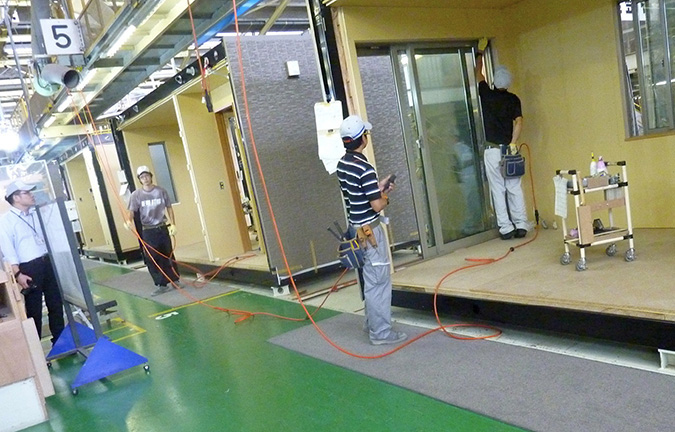
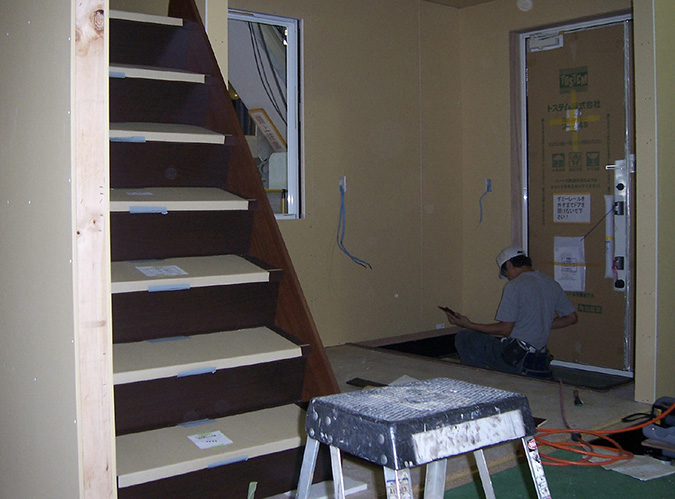
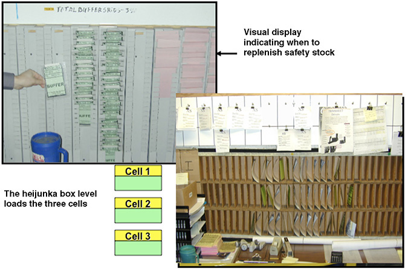
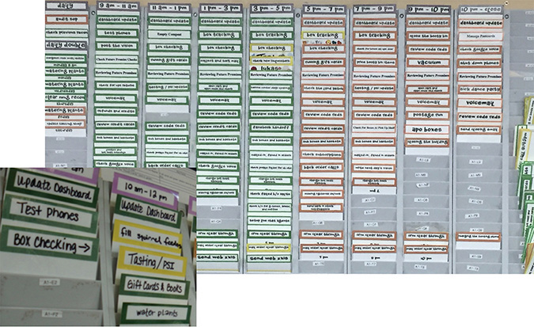

 Principle 4 

**Level Out the Workload, Like the Tortoise, Not the Hare (Heijunka)**

_In general, when you try to apply the TPS, the first thing you have to do is to even out or level the production. And that is the responsibility primarily of production control or production management people. Leveling the production schedule may require some front-loading of shipments or postponing of shipments and you may have to ask some customers to wait for a short period of time._

—Fujio Cho, President, Toyota Motor Corporation

Following the early lead of Dell Computer and other successful companies, many businesses in America rushed to a build-to-order model of production. In the on-demand world we live in, they seek to make exactly what the customers want when they want it—the ultimate lean solution? Unfortunately, customers are not predictable, and orders vary significantly from day to day and week to week. If you build customized products as they are ordered, you may build huge quantities one week, paying overtime and stressing your people and equipment, but then if orders are light the next week, your people will have little to do and your equipment will be underutilized. You won’t know how much to order from your suppliers, so you will have to stockpile the maximum possible amount of each item the customers might possibly order, or pressure your suppliers to hold stockpiles, perhaps at a warehouse near your plant (as Dell did). It is impossible to run a lean operation this way. A strict build-to-order model creates piles of inventory, hidden problems, and possibly poorer quality. Ironically, lead times are likely to grow because the factory will become disorganized and chaotic.

Often “build to order” turns into “pick to order” from a large warehouse of finished goods. Toyota has found it can create the leanest operation, and ultimately give customers better service and better quality, by leveling out the production schedule and not always building in the sequence of customer orders.

Some of the businesses I have worked with that try to build to order are in actuality asking customers to wait six to eight weeks for their “built-to-order” product. A few “special” customers may cut in line and get their orders expedited at the expense of the large majority of customers. In between the factory and the customers are distribution centers, local warehouses, and inventory in stores. Yet the manufacturing plants are under severe stress to build exactly what the customer has ordered day by day. This seems rather absurd. Why torture your manufacturing managers and create a huge amount of waste in the process to build an order received today when the customer will not get the product for weeks? Instead, why not accumulate some orders and level the schedule? Following that approach, you may be able to reduce production lead times, cut your parts inventories, and quote much shorter standard lead times to all your customers—resulting in greater overall customer satisfaction than you’ll get from a “hurry up, then slow down” build-to-order method. To many companies, the concept of going slow to go fast seems absurd—that is, until someone can get them to try it.

Toyota managers and employees use the Japanese term “muda” when they talk about waste—and eliminating muda and the seven forms of muda are often the main focus of lean efforts because they are the most obvious. But two other Ms are just as important in making lean work, and all three Ms fit together as a system. In fact, focusing exclusively on the seven wastes of muda can actually hurt labor productivity and the production system. The _Toyota Way 2001_ document refers to the “elimination of _Muda_, _Muri_, _Mura_” (see Figure 4.1). The three Ms are:

**Figure 4.1** The three Ms: muda (waste), mura (unevenness), and muri (overburden). Eliminate all three to get to true flow.

 **Muda—non-value added.** The most familiar M, muda includes the seven wastes mentioned in earlier chapters. These wasteful activities lengthen lead times, cause extra movement to get parts or tools, create excess inventory, require rework time because of errors, or result in any type of waiting.

 **Mura—unevenness.** In normal production systems, at times there is more work than the people or machines can handle, and at other times there is a lack of work. Unevenness results from an irregular production schedule or fluctuating production volumes due to internal problems, such as downtime, missing parts, or defects. Mura will also cause muda. Unevenness in production levels makes it necessary to have on hand the equipment, materials, and people for the highest level of production—even if the average requirements are far less. And _unevenness leads to too little work sometimes and overburden at other times—leading directly to Muri._

 **Muri—overburdening people or equipment.** In some respects, muri is on the opposite end of the spectrum from muda. Muda is underperforming, while Muri is pushing a machine or person beyond natural limits. Overburdening people results in safety and quality problems. Overburdening equipment causes breakdowns and defects. In other words, muri can cause muda. And even worse, overburdening people can cause health and safety problems.

Let’s say you have a production schedule that swings wildly and a production process that is not well balanced or reliable. You’ve decided to start applying lean thinking and focus only on “eliminating muda” from your production system. You start to reduce inventory in your system. Next you look at the work balance and reduce the number of people from the system. Then you organize the workplace better to eliminate wasted motion. Finally you step back and let the system run. What you’ll sadly witness is a system that will run itself into the ground. When work first begins to flow one piece at a time across work centers, without inventory, the only thing you will get is erratic one-piece flow. Workers will at times have little to do and at other times be overburdened. Equipment will break down even more than before. You will run out of parts. Then you’ll conclude, “Lean manufacturing doesn’t work here” and increase the inventory.

Interestingly, focusing on muda is the most common approach to implementing lean tools, because it is easy to spot the seven wastes. But many companies fail to pursue the more difficult process of stabilizing the system and creating “evenness”—which is essential to creating a true, balanced, lean flow of work. Toyota calls this concept of leveling out the work schedule “heijunka_,_” and it is the foundation of TPS and perhaps the Toyota Way’s most counterintuitive principle. Achieving heijunka is fundamental to eliminating mura, which is fundamental to eliminating muri and muda. As explained by Taiichi Ohno:

_The slower but consistent tortoise causes less waste and is much more desirable than the speedy hare that races ahead and then stops occasionally to doze. The Toyota Production System can be realized only when all the workers become tortoises.1_

I have heard this repeated from other Toyota leaders: “We would rather be slow and steady like the tortoise than fast and jerky like the rabbit.” US production systems force workers to be like rabbits. They tend to work really hard, wear themselves down, and then take a siesta. In many US factories, workers will sometimes double up on the assembly line, one doing two jobs while the other has free time, and though the workers make production quotas for the day, they overburden themselves. At Toyota, muda is viewed as something that can be worked on by the frontline work group, but overburden and unevenness are the responsibility of management. Since I find that leveling is confusing to many businesspeople, and often seems impossible given the unpredictable fluctuations in customer orders, I will give examples in a number of different types of businesses.

**HEIJUNKA—LEVELING SCHEDULES FOR LOW-VARIETY PRODUCTION**

In manufacturing, heijunka is the leveling of production by both volume and product mix. It does not build products according to the actual flow of customer orders, which can swing up and down wildly, but takes the total volume of orders in a period and levels them out so approximately the same amount and mix are made each day for a period of time. The approach of TPS from the beginning was to keep batch sizes small and build what the customer (external or internal) wants. In a true build to order, you build products A and B in the actual production sequence of customer orders (e.g., A, A, B, A, B, B, B, A, B, B . . .).

The problem with building to an actual production sequence is that it causes you to build parts irregularly. If orders on Monday are twice those on Tuesday, you must pay your employees overtime on Monday and then send them home early on Tuesday. To smooth this out, you take the actual customer demand, determine the pattern of volume and mix, and build a level schedule every day. For example, you know you are making five As for every five Bs. Now you can create a level production sequence of ABABAB. . . . This is called leveled, mixed-model production, because you are leveling the customer demand for different models to a predictable sequence, which spreads out the different product types and leveling volume.

Figure 4.2 gives an example of an unleveled schedule from an engine plant that makes engines for lawn care equipment (based on an actual case).

**Figure 4.2** Traditional production (unleveled).

In this case, a production line makes three sizes of engines—small, medium, and large. The medium engines are the big sellers, so these are made early in the week—Monday through part of Wednesday. After a several-hour changeover of the line, small engines are made the rest of Wednesday through Friday morning. Finally, the large engines—in smallest demand—are made Friday afternoon. There are at least four things wrong with this unleveled schedule:

1\. **Customers usually do not buy products predictably.** The customer is buying medium and large engines throughout the week. If the customer unexpectedly decides to buy an unusually large number of large engines early in the week, the plant is in trouble. You can get around this by holding a lot of finished-goods inventory of all engines, but this leads to an unnecessary high cost of inventory.

2\. **There is a risk of unsold goods.** If the plant does not sell all its medium engines built Monday to Wednesday, it must keep them in inventory. If there is a design change, they can become obsolete.

3\. **The use of resources is unbalanced.** Most likely, there are different labor requirements for these different-size engines, with the largest engines taking the most labor time. The plant needs a medium amount of labor early in the week, then less labor in the middle of the week, and then a lot of labor at the end of the week. The unbalance creates the potential for lots of muda and muri.

4\. **There is an uneven demand placed on upstream processes.** This is perhaps the most serious problem. Because the plant purchases different parts for the three types of engines, it asks its suppliers to send certain parts Monday through Wednesday and different parts the rest of the week. Experience tells us that customer demand always changes and the engine plant will be unable to stick to the schedule anyway. Most likely, there will be some big shifts in the model mix, e.g., an unexpected rush order of large engines and the need to focus on making those for a whole week. The supplier will need to be prepared for the worst-possible scenario and will need to keep at least one week’s worth of all parts for all three engine types. And something called the “bullwhip effect” will multiply these erratic ordering patterns backward through the supply chain.2 Think of the small force in your wrist creating a huge and destructive force at the end of the whip. Similarly, a small change in the schedule of the engine assembly plant will result in ever-increasing inventory banks at each stage of the supply chain as you move backward from the end customer.

In a batch-processing mode, the goal is to achieve economies of scale for each piece of equipment. Changing over tools to alternate between making product A and making product B appears to be wasteful because parts are not being produced during the changeover time. You are also paying the equipment operator while the machine is being changed over. The logical solution is to build large batches of product A before changing over to product B. But this approach leads to mura and muri_._

Guided by a lean advisor, the engine plant did a careful analysis and discovered that the long time to change over the line was due to moving in and out parts and tools for the larger engine and then moving in and out parts and tools for the smaller engine. There were also different-size pallets for the different engines. The plant tackled the problem by placing a small amount of all the parts on flow racks located next to the operator and mounting the tools needed for all three engines within easy reach. The plant also created a flexible pallet that could hold any size engine. These changes eliminated the equipment changeover completely, allowing the plant to build the engines in any order it wanted on a mixed-model assembly line. They then moved to a repeating (level) sequence of all three engine sizes matching the mix of parts ordered by the customer (see Figure 4.3). There were four benefits of leveling the schedule:

**Figure 4.3** Heijunka production (leveled).

1\. **Flexibility to make what the customers want when they want it.** This reduced the plant’s inventory and its associated problems.

2\. **Reduced risk of unsold goods.** The plant built only what the customers ordered, reducing the costs of owning and storing obsolete inventory.

3\. **Balanced use of labor and machines.** The plant could then create standardized work that took into account that some engines required less work and others required more work. Toyota calls this the weighted-average standardized work. As long as a big engine that takes extra work is not followed by another big engine, the workers can handle the big engine, taking a little extra time, and then make up for it on the small engine. Once the plant took this into account and kept the schedule level, it had a balanced and manageable workload over the day with more productive operators.

4\. **Smoothed demand on upstream processes and the plant’s suppliers.** If the plant uses a just-in-time system for upstream processes and the suppliers deliver multiple times in a day, the suppliers will get a stable and level set of orders. This will allow the suppliers to reduce inventory and then pass some savings on to the customer so that everyone gets the benefits of leveling.

None of this would have been possible if the plant hadn’t found a way to reduce or, in this case, eliminate the setup time for changeover. Though dramatically reducing setup time in most plants may seem unrealistic at first, Toyota did exactly that in the 1960s. Shigeo Shingo, an industrial engineer who was not a Toyota employee but worked closely with Toyota, helped the company achieve an average changeover time reduction of over 97 percent. A meticulous industrial engineer who paid attention to every microscopic reach and grasp of the worker, Shingo, in true Toyota style, thoroughly analyzed the setup process for large stamping presses and discovered that most of the work fell into one of two categories: it was muda, or it was something that could be done while the press was still making parts. He called the second category “external setup,” as opposed to “internal setup,” which was work that had to be done while the press was shut down.3

In traditional mass production, the first thing the setup teams did when they performed the changeover of a production line from one model to another was to shut down the press. Shingo wondered how much of the changeover he could perform while the press was still running, so he organized an operator’s workplace for that purpose and made other technical improvements until there was no more setup the operator could do while the press was running. He found that things like getting the next die and tools, preheating the die, and setting it in place beside the press were external and could be done while the press was making parts. When he finally shut down the press, all that was basically left to do was to disconnect some hoses, swap the dies, and reconnect the hoses and start it up again. Amazingly, these several-hundred-ton presses that previously took many hours to change over could, it turned out, be changed over in minutes—a process that Shingo called single-minute exchange of dies (SMED). Think of it like a racing pit crew that quickly services and gets the car back on the track, often in less than a minute. The pit crew developed and continually improved this method, because it was a competitive advantage.

Southwest Airlines figured out early on that quickly changing over aircraft was a competitive advantage and worked hard at it, even changing aircraft engines when necessary. There was more air time, versus time sitting at airports. Customers did not have to wait as long. And it reduced the number of planes needed for a given number of flights.

Over the years, changeover has become a kind of a sport in Japan, a manufacturing equivalent of an American rodeo. On one trip I took to Japan in the 1980s, I visited a Mazda supplier of stamped door panels whose team had recently won a prize in a national competition for changing over a several-hundred-ton press in 52 seconds.

Toyota may seem obsessive about leveling the schedule, but it is a necessity to make the Toyota Production System work. The thought process behind heijunka is summarized in the flowchart in Figure 4.4\. Leveling enables takt (stable rate of demand), which is necessary for doing standardized work and balancing work on the line, which is a requirement for leveled pull from upstream processes and suppliers, which leads to minimum inventory, minimum cost, and best quality.

**Figure 4.4** Why does Toyota level the schedule?

**BUILDING SEMI-CUSTOM HOMES IN A LEVELED FACTORY**

Few people outside of Japan have ever heard of Toyota Housing Corporation. Surprise! Toyota has been designing and building homes in Japan since 1975\. Toyota Housing Corporation is a viable business and expanded from private detached homes to condominiums and rental units. In fiscal 2017, the housing services business sold 10,321 units on a consolidated basis and generated net revenues of ¥300.8 billion (about $2.7 billion). Toyota builds most of the homes in factories on assembly lines. It looks more like an auto factory than a home construction site. The shortest time to build a home for a customer when I visited in 2013 was 15 days. We think of modular homes built in a factory as inexpensive and less desirable than homes built from scratch on-site, but Toyota homes are expensive and desirable, with the top-line 2,600-square-foot custom model selling for over $1 million. The homes are durable, resistant to earthquakes, and environmentally friendly. While profitable, the contribution to Toyota’s overall bottom line is small, but they may have an equal, if not greater, benefit to Toyota as an experimental center for learning.

One research question addressed in the housing company is how to level the schedule when building such a complicated product with so many variants—heijunka in a high-mix, high-variety environment. One of Toyota’s best TPS experts at the time, Kenji Miura, oversaw the effort. The process started with something that looked familiar in an auto plant—robots welding together the steel structures, only in this case the robots were outlining the various rooms of the house. From there, the steel structure moves to an assembly line, where rooms, not automobiles, flow through various stations (see Figure 4.5). Each room is a cubicle to be later assembled on-site, like building a Lego house. The room leaves the assembly line with plumbing, electrical, and most fixed features installed, like cabinets, and with the drywall and wiring piled inside the room to be installed on-site. Toyota is experienced in heijunka for mixed-model automotive assembly plants, but houses are a different animal. Each room is very different, and the level of customization is comparatively large.

**Figure 4.5** Rooms for a Toyota home built on an assembly line with the workload balanced to takt.

The first step to level the line is to define the tasks for each room and time each task. The tasks are then allocated to different workstations. Some rooms take a lot more time than others, and Toyota can help the cause by making sure high-task-time rooms are not built one after another, but rather spread out. Some individual tasks take longer than the rest of the tasks combined, and these are taken offline, for example, hand-built wooden stairs (see Figure 4.6). There is a very detailed schedule posted visually for the assembly line and a separate one for the offline stations.

**Figure 4.6** Offline module (customized stairs take a lot of labor that varies with choices).

I visited Toyota’s housing plant three times a few years apart, and each time there were major improvements. For example, on my first two visits, the team members built one house at a time—with all the rooms done one by one. This allowed them to level the workload across the rooms in that one house. On my third visit, managers had learned there was a big advantage to intermingling the rooms for two houses, which allowed for more rooms to level across. For example, one kitchen might be high end with more custom features than a smaller, standard kitchen that was just following it on the line. A group of team members could do tasks walking back and forth between the rooms, and the average of the two rooms could be completed within the takt. Intermingling rooms between two houses also allowed them to take some of the offline work online.

Lean construction has become a major global movement, but I have not seen this level of commitment to heijunka and attention to detail outside Toyota. It is easy to throw up your hands and say, “There is so much variation, heijunka is impossible.” For Toyota, the impossible simply means the company needs to think harder and experiment more.

**LEVELING THE SCHEDULE FOR SEASONAL ALUMINUM GUTTERS—SOMETIMES IT IS BETTER TO INTENTIONALLY BUILD EXTRA INVENTORY**

These days seamless aluminum gutters for houses, at least in the United States, are mostly built to order, on-site at the house. Rolls of materials are brought to the jobsite, where they are cut to length, shaped, endcaps are added, and the gutters are installed. A plant in the Midwest makes much of the rolls of painted aluminum that installers use. While these rolls of aluminum are not complex, there is variation in the width of the gutters, the length, and the colors. They also are packaged in different boxes, for different businesses and stores.

This company originally adopted a build-to-order model. Deliveries were mostly made just in time, but the process of getting raw materials, scheduling operations, building the product, moving the finished goods to a warehouse, and then shipping those goods from the dozen or so shipping docks was chaotic, to say the least. There was inventory everywhere. Yet the plant regularly was short of critical materials needed to make the gutters ordered by customers. Costs of expediting shipments to large customers were getting higher and higher. People were added and laid off with regularity. A big problem was the seasonality of the business. Big-box warehouse stores like Home Depot bought large quantities of gutters in the spring and early summer, and then business dropped dramatically the rest of the year. A large number of temporary and inexperienced workers were added in the peak season and let go a few months later.

The Midwestern gutter plant decided to hire a consultant who used to work for the Toyota Production System Support Center. The consultant said the unthinkable—the overall operation would be leaner if the plant built select products to store away in inventory allowing for heijunka. Build more inventory to get leaner? Nuts! While it sounded unreasonable at first, the company followed the consultant’s advice. Perhaps his Toyota credentials helped overcome the disbelief.

He made the proposition sound even more absurd because he wanted the company to keep four types of inventory in four different places. The first was real built-to-order product set in a staging lane so that it could be loaded on a truck immediately. The second was to build ahead seasonal product for high-volume items the plant knew it would later sell. It should be built steadily throughout the year, accumulated in a seasonal inventory buffer, and then drawn down in the busy spring-summer season. The third was safety stock, which is inventory used to buffer against unexpectedly high demand for products that are not in the seasonal buffer and that experience occasional spikes in demand. The fourth was buffer stock, which is held to cushion against downtime in the factory, so customers will continue to get their product even when machines are down for repair—essentially, inventory for plant-driven variation.

On the consultant’s recommendation, each of these four types of inventory was stored in a separate area at the aluminum gutter plant with visual indicators, so that everyone would always be able to see at a glance the status of the inventory of each type (Principle 7).

The inventory was replenished by using a kanban system (cards instructing the production line to make a specific quantity of a particular product) as explained under Principle 5\. For example, the largest amount of inventory is the seasonal inventory buffer. It is built up during the off-season and reaches a peak just before the spring, when sales are highest. There is a prespecified amount of seasonal buffer, and based on that forecasted amount, kanban is used by the production cell to make only that remaining number of packages needed. In front of the inventory stockpile is what looks like a clothesline labeled with months of the year. For example, the amount that should be completed by August, based on a constant level of production over the year, has a sign saying “August.” In August, if the inventory pile is larger than should be built by that time, the pile of inventory will have moved beyond the August sign, alerting everyone that there is an excess inventory problem that needs to be addressed.

In kanban, the information flow begins with the customer order and works backward through the operation as a pull system. In this company, a final cutting and packaging (one-piece flow) cell gets real customer orders. But when those orders are low, the workers do not have to sit around with nothing to do. They can build to the seasonal inventory buffer or build to replace any safety stock or buffer stock that has been used. The seasonal inventory, safety stock, and buffer stock that need to be built are represented by kanban cards. The cards are sorted by a planner into a visual scheduling box called a “heijunka box,” which levels the schedule (see Figure 4.7). For each product, the box says what to make at 8:00 a.m., 8:10 a.m., 8:20 a.m., etc. Cards are put in the slots and delivered to the production cell. These tell the cell what to make and at what pace. As the cell uses materials, like the painted aluminum product, a kanban is sent back to the prior operation asking it to make more. Leveled pull was established all the way back to suppliers, like the paint manufacturer.

**Figure 4.7** Scheduling the trim sheet cells for aluminum gutters.

At the suggestion of the TPS consultant, other improvements were made, such as standardizing work procedures, reducing changeover time, and putting in error-proofing devices. The result was a very smooth flow of product through the facility, so smooth that all outbound shipping could be handled through two docks, enabling the plant to close down the other ten shipping and receiving docks. In addition, the plant achieved incredible performance improvements. The overall lead time for making product was reduced by 40 percent, changeover time was reduced by 70 percent, WIP of painted product was reduced by 40 percent, inventory obsolescence was reduced by 60 percent, and on-time delivery was close to 100 percent. A larger number of experienced workers could be kept on in the slow selling period and fewer temporary workers were needed in the busy period because the plant could ship high-volume items from the seasonal inventory buffer. Another lean paradox: hold more of the right inventory to have less overall inventory. This is systems thinking at its best!

**LEVELING WORK IN AN UNPREDICTABLE CALL CENTER**

Even with the digital age storming the business landscape, we are far from eliminating people who answer phones to talk to customers. Many companies seem to want to make it as difficult as possible to reach real people, with endless menus and terrible music playing while you are on hold. This is not true at Zingerman’s Mail Order (ZMO) in Ann Arbor, Michigan, which ships high-end artisanal food all over the United States. When you call, it’s likely a real person will answer immediately and will treat you like you are “the best part of their day.”

ZMO has worked intensively on lean transformation in its warehouse since 2004, incorporating all the lean tools and developing an engaged workforce.4 Along the way, the folks at ZMO turned their sights on improving the call center. When they examined the data on call volumes, they found clear patterns, within the day, week, and year—so they could come up with reasonable estimates of staffing needs for forecasted peak volume in a day. Still, there was variation in call volume within the day, leading to idle time during slow periods, because they could not smooth out when customers called or how long the conversations lasted. Unevenness was the nature of the beast.

They decided to use a different concept of heijunka, not leveling the customer orders, but rather leveling the way people worked. How could they fill in time gaps of associates in a flexible way and create a smooth flow of work? They started by setting up call-in computer stations in work cells. The seats were numbered, with number one as the “hot seat.” The hot seat gets the first call, and then as additional calls come in, service representatives fill the seats in sequence. In the busy Christmas holiday season when volumes explode, they have a hot cell and then staff additional cells as volumes grow. Those who are not on a call go to the visual board (shown in Figure 4.8) to pick the next card, which displays an off-cycle task such as processing credit card orders, organizing products on shelves, responding to voice mail, and processing gift cards. The cards on the board are organized at the beginning of the day in two-hour blocks and are placed red side facing out. As the tasks are completed, they are flipped to the green side so there is a visual indication of whether they were completed within the two-hour window—simple, but powerful. Without supervision, associates know what to do next, whether devoting all the attention needed to a customer or working on the various ancillary tasks that need to be completed.

**Figure 4.8** ZMO call center ancillary work board.

The board is organized in two-hour time blocks. Each card has a task on it (e.g., “back-order calls,” “check voice mail,” “write out gift cards”). In the morning all the cards are loaded with their red side facing out, and as the tasks are completed, the cards are turned over to the green side.

**PUTTING LEVELING AND FLOW TOGETHER—A TOUGH SELL**

Every business would like to have a consistent volume over time so there is a consistent and predictable workload. But if you cannot control sales, are you stuck? The answer is that you are never stuck as long as you have your creative mind.

The TPS expert might suggest that a manufacturer hold some finished-goods inventory and build at a leveled pace to replenish what the customer takes away in a pull system, as in the aluminum gutter case. The manufacturer screams, “But we have 15,000 part numbers!”

The expert says, “Look for a smaller number of part numbers that are in big demand and perhaps even seasonal, build those when you have fewer real orders, and then keep those in inventory.” This sounds reasonable to the manufacturer. But then comes the hard sell. The TPS expert asks the manufacturer to work hard to learn how to change over between product types more frequently to level the mix of products built every day. Many manufacturers balk. After all, it is so convenient to build in batches, making product A for a while, then retooling and making product B for a while, and so on. Quick retooling does not seem possible, until an expert shows the manufacturer how it can do a three-hour changeover in ten minutes. Even then, it is difficult for many manufacturers to maintain the discipline of quick changeover. And the real root cause of the problem may be sales promotion strategies that contribute to uneven customer demand, and heaven forbid sales people should be constrained. As organizations become more sophisticated in lean, they often begin to move to the enterprise level and change their policies in sales to maintain a more level customer demand. This requires a deep commitment at the very top of the company, but these organizations quickly find that the enormous benefits of heijunka make it a worthwhile investment.

It cannot be overstated. To achieve the lean benefits of continuous flow, you need Principle 4: “Level out the workload, like the tortoise, not the hare.” Eliminating muda is only one-third of achieving flow. Eliminating muri and smoothing mura are equally important. Standardized work is far easier, cheaper, and faster to manage. It becomes increasingly easy to see the waste caused by missing parts or defects. Without leveling, wastes naturally increase, as people and equipment are driven to work like mad and then stop and wait, like the hare. Working according to a leveled schedule applies to all parts of Toyota, including sales. Everyone in the organization works together to achieve it.

 KEY POINTS 

 To get to lean flow requires seeking to eliminate the three Ms: muda (waste), mura (unevenness), and muri (overburden).

 The three Ms are all interrelated. Eliminating muda alone when there are high levels of unevenness and overburden can actually reduce productivity and value-added flow.

 In a Toyota mixed-model production plant, reducing mura and muri requires a leveled pattern of vehicles, for example Camry, Camry, Avalon, Camry, Camry, Avalon . . .

 Along with creating a leveled schedule, factories need to reduce setup time in order to quickly change over between products and build in small batches.

 Sometimes it is best to hold extra inventory of high-volume finished goods as a buffer against fluctuations in customer demand and allow building to order low-volume product types while replenishing the inventory for high-volume items.

 Heijunka may be different for service operations but still applies, as illustrated by the example of the Zingerman’s call center.

 The challenge of heijunka is that it requires system thinking, instead of thinking about local optimization of individual operations.

**Notes**

1\. Taichi Ohno, _Toyota Production System: Beyond Large-Scale Production_ (New York: Productivity Press, 1988).

2\. Hau L. Lee, V. Padmanabhan, and Seungjin Whang, “The Bullwhip Effect in Supply Chains,” _Sloan Management Review_, April 15, 1997.

3\. Shigeo Shingo, _A Revolution in Manufacturing: The SMED System_ (New York: Productivity Press, 1985).

4\. Eduardo Lander, Jeffrey Liker, and Tom Root, _Lean in a High-Variety Business: A Graphic Novel About Lean and People at Zingerman’s Mail Order_ (New York: Productivity Press, 2020).
