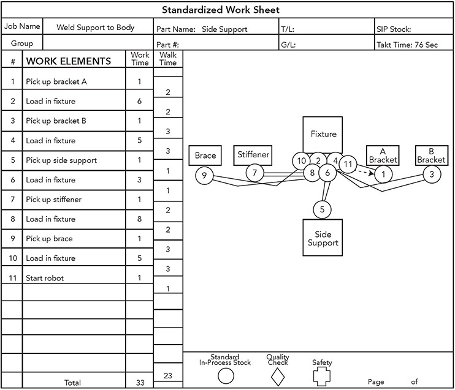
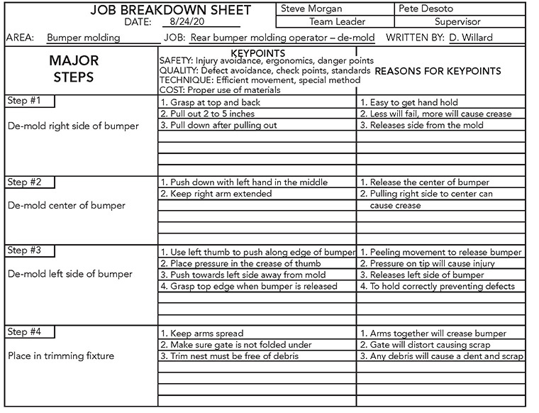
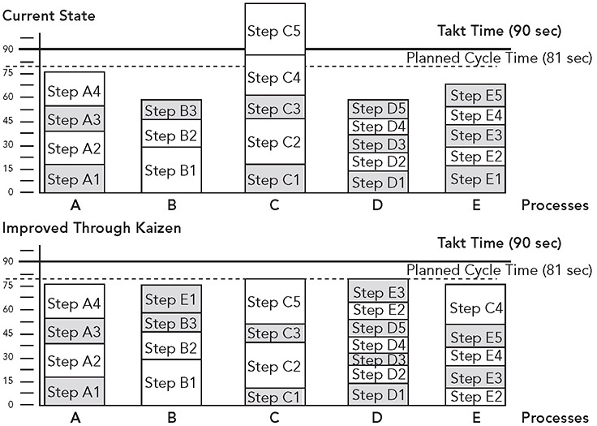
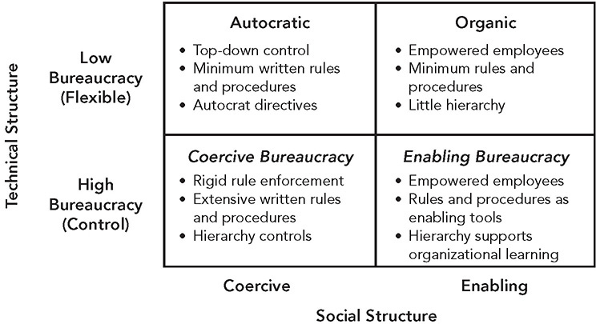
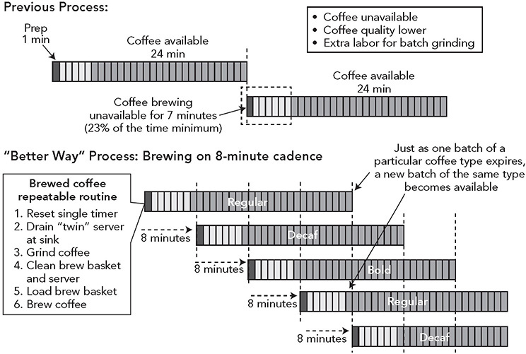
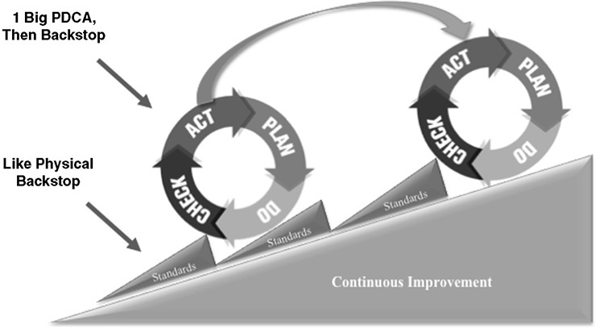
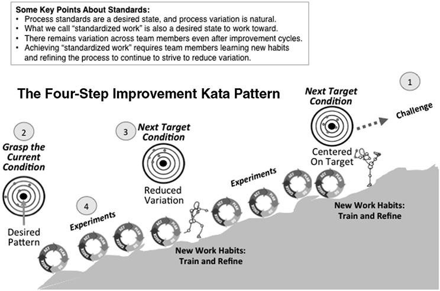

 Principle 5 

**Work to Establish Standardized Processes as the Foundation for Continuous Improvement**

_Standard work sheets and the information contained in them are important elements of the Toyota Production System. For a production person to be able to write a standard work sheet that other workers can understand, he or she must be convinced of its importance. . . . High production efficiency has been maintained by preventing the recurrence of defective products, operational mistakes, and accidents, and by incorporating workers’ ideas. All of this is possible because of the inconspicuous standardized work sheet._

—Taiichi Ohno

Whether your employees are designing intricate new devices, styling new attractive products, processing accounts payable, developing new software, or working as nurses, they are likely to respond with skepticism to the idea of standardizing their work: “We are creative, thinking people, not robots.” If you are not in manufacturing, you may be surprised to learn that even workers on the assembly line believe they have a knack for doing the job best their own way and that standardized work methods will simply set them back. But some level of standardization is possible and, as we will see, is the backbone of Toyota Way processes.

Standardizing tasks became a “science” when mass production replaced the craft form of production. Much of modern manufacturing is based on the principles of industrial engineering first set forth by Frederick Taylor, the “father of scientific management.”1 He preached that industrial engineers should scientifically design the work, supervisors should enforce compliance with the standards, and workers should do as told. He identified the fastest worker and used that as a model for the standardized work forced on others.

In the automotive world, plants had armies of industrial engineers who implemented Taylor’s approach of time studies. Industrial engineers (IEs) were everywhere, timing every second of workers’ tasks and trying to squeeze every extra bit of productivity out of the labor force. Open and honest workers who shared their work practices with the IEs would quickly find the job standards raised, and they would soon be working harder for no extra money. In response, workers withheld techniques and labor-saving devices they invented and hid them whenever the IEs were around. They deliberately worked slower when the IEs were doing a study, so expectations were set low. The IEs caught on to this and would at times sneak up on the operator or hide behind something to time them at work. Often companies changed the job descriptions and responsibilities based on efficiency and time studies, which sometimes led to union grievances and became a major source of conflict between management and workers. At American auto companies, unions negotiated prohibitions against IEs involving workers in changing work standards, and IEs were only allowed certain windows of time in the year when they could redefine standards.

Now companies use computers and cameras to monitor output and instantly report on the productivity of individual workers. As a result, people know they are being monitored, so they will work to make the numbers, often regardless of quality. Sadly, they become slaves to the numbers, rather than focus on a company’s mission statement or philosophy. It doesn’t have to be this way, as we will see with Toyota’s approach to standardized work.

Ford Motor Company was one of the early mass production giants associated with rigid standardization on the moving assembly line, and Toyota’s approach to standardized work\* was partially shaped by Henry Ford’s view. While the Ford Motor Company eventually became a rigid bureaucracy that followed the destructive practices of Taylor’s scientific management, Henry Ford himself espoused a different view of standards:

_Today’s standardization . . . is the necessary foundation on which tomorrow’s improvement will be based. If you think of “standardization” as the best you know today, but which is to be improved tomorrow—you get somewhere. But if you think of standards as confining, then progress stops.2_

Even more influential for Toyota than Henry Ford was the methodology and philosophy of the American military’s Training Within Industry (TWI) service.3 Established in 1940 during World War II to increase production to support the Allied forces and train civilians taking over factory jobs from men going to war, the program was based on the belief that the way to learn about industrial engineering methods was through application on the shop floor and that standardized work should be a cooperative effort between the foreman and the worker (Huntzinger, 2002). During the US occupation and rebuilding efforts of Japan after World War II, a former TWI trainer and his group, called the “Four Horsemen,” taught Japanese businesses this approach. It included job methods (how to design efficient and safe workplaces), job instruction (how to train on standard methods), job relations (how supervisors should manage based on cooperation), and program development (how to spot, analyze, and resolve problems).

Toyota’s training on standardized work was heavily influenced by TWI, and it became the backbone of Toyota’s standardization philosophy. Toyota’s job instruction training to this day has changed little since the 1950s and is almost exactly modeled after the TWI documents.

Standardized work in manufacturing at Toyota is much broader than writing out a list of steps the operator must follow. Former Toyota president Cho describes it this way:

_Our standardized work consists of three elements—takt time (time required to complete one job at the pace of customer demand), the sequence of doing things or sequence of processes, and how much inventory or stock on hand the individual worker needs to have in order to accomplish that standardized work. Based upon these three elements, takt time, sequence, and standardized stock on hand, the standardized work is set._

By “standardized work,” we are referring to the most efficient and effective combination of people, material, and equipment to perform the work that is presently possible. “Presently possible” means it is today’s best-known way, which can be improved.

There are many other types of standards, such as technical specifications for products, settings for equipment, rules for safety, inspection requirements for quality, minimum requirements for air quality, and on and on. I am often asked how Toyota can trust workers to make any changes they want to these standards. Quite the contrary, Team members do not have discretion to change professionally-defined standards without the approval of the highly regarded technical specialty groups who know the underlying science. These externally defined standards become inputs to standardized work. How can we perform the work to consistently achieve these specifications with minimum waste? What adjustments need to be made to the equipment to meet these standards?

In this chapter, we will see that, like so many organizational practices, the Toyota Way has turned the practice of standardized work on its head. What can be perceived as negative and stifling becomes positive and flexible within the Toyota Way and builds collaborative teams rather than conflict between workers and management. Standardized work was never intended by Toyota to be a management tool to be imposed coercively on the workforce. On the contrary, rather than enforcing rigid standards that can make jobs routine and degrading, standardized work is the basis for empowering workers, sharing ideas for improvement, and driving innovation in the workplace.

**THE PRINCIPLE: WORK TO ESTABLISH STANDARDIZED PROCESSES AS THE FOUNDATION FOR CONTINUOUS IMPROVEMENT** 

Toyota’s standards have a much broader role than making shop floor workers’ tasks repeatable and efficient. Some degree of standardization is used throughout the company’s white-collar work processes, even in engineering. For example, Toyota has standardized ways of training engineers, has macro-level standards for the stages and timing of product development, and extensively applies technical standards to the design of products and manufacturing equipment.

Managers have a misconception that standardization is all about finding the scientifically one best way to do a task and freezing it. As Imai explained so well in _Kaizen_,4 it is impossible to improve any process until it is standardized. If the process is shifting from here to there, then any improvement will just be one more variation that will be altered by the next variation. One must standardize, and thus stabilize, the process before continuous improvements can be made. As an example, if you want to learn golf, the first thing an instructor will teach you is the basic golf swing. Then you need to practice, practice, and practice to stabilize your swing. Until you have the fundamental skills needed to swing the club with some consistency, there is little hope of learning the finer details of direction, fade, distance, and how the ball will land.

Standardized work is also a key facilitator of building in quality. Talk with any well-trained group leader at Toyota and ask how that leader believes zero defects are possible. The answer will be, “Through standardized work.” Whenever a defect is discovered, the first question asked is, “Was standardized work followed?” As part of the problem-solving process, the leader will watch the worker and go through the standardized worksheet step-by-step to look for deviations. If the worker is following the standardized work and the defects still occur, then the standardized work may need to be modified.

In fact, traditionally in Toyota, the standardized worksheet is posted outward, away from the operator. The operator is trained using the standardized work but then must do the job without looking at the standardized worksheet. The standardized worksheet is posted outward for the management to audit to see if it is being followed by the operator.

Any good quality manager at any company knows that you cannot guarantee quality without standard procedures for ensuring consistency in the process. Many quality departments make a good living turning out volumes of such procedures. Unfortunately, the role of the quality department is often to assign blame for failing to “follow the procedures” when there is a quality problem. The Toyota Way enables those doing the work to design and build in quality by writing the standardized task procedures themselves. For quality procedures to be effective, they must be simple and practical enough to be used every day by the people doing the work.

A sample standardized worksheet from Toyota for a job of welding a side support onto a steel vehicle body is shown in Figure 5.1\. The actual welding is done by a robot, but the team member does the loading and unloading into a fixture. In this case, the takt is 76 seconds, and the cycle time of the manual steps of the person is 56 seconds. The figure does not show the robot time to do the welding; that would be displayed on a separate “standard work combination sheet” that shows the member’s motions in relation to the robot’s work.

**Figure 5.1** Standardized worksheet for welding a side support to a body.

_Source:_ Jeffrey Liker and David Meier, _The Toyota Way Fieldbook_

(New York: McGraw-Hill, 2006).

The standardized worksheet is useful for analysis of the job. At a glance, where is there waste in this process? It is apparent from the walk pattern in the diagram that there is a great deal of movement waste. In total, about 40 percent of the job is walk time to and from the fixture. Clearly, that would be a prime target for reducing waste.

Once the standardized work is defined it provides a picture of what should be happening. To turn the desired behavior into actual behavior requires training through enough repetitions that the new way becomes a habit. To use job instruction training to develop the skills and habits of standardized work, we have to drill down to another level of detail—the Job Breakdown Sheet. Figure 5.2 shows a different Toyota job: removing a plastic-injection molded bumper from a mold. Demolding takes a fair amount of skill. On this sheet, each step that would go on a standardized worksheet with its associated time is broken down into further steps with key points that relate to safety, quality, technique, or cost. The reason for the key points is also provided, the why. In many cases, even for a 60-second job, each step on a standardized worksheet is broken down into about three to five substeps, each with key points. There are often photos that illustrate how to perform the steps. For example, each work element, as in Figure 5.1, would have an additional page breaking down the step.

**Figure 5.2** Job Breakdown Sheet for rear bumper demolding.

_Source:_ Jeffrey Liker and David Meier, _Toyota Talent_ (New York: McGraw-Hill, 2007).

You will not see these voluminous documents on a usual tour of a Toyota plant. They will be in notebooks hung by the process or stored in a cabinet where the group leader sits. They are pulled out for training purposes, then put away.\* Standardized work, and some degree of stability, is necessary before you can train someone new to do the job. Job instruction training that comes from TWI is a very specific training method that consists of starting with a piece of the job; demonstrating that piece for the worker; letting the worker do it; then explaining key points while demonstrating a second time; letting the worker demonstrate and explain; then explaining key points and reasons while demonstrating a third time; and then having the worker imitate. This process is repeated as many times as necessary until the worker has mastered one piece; then the process begins again with the next piece. In a Toyota plant with one-minute-cycle jobs, it can take two weeks of this repeated teaching before the worker is left alone, more training than many people get in some professional roles.

But when you have developed standardized work and it is being reasonably followed, the magic really begins—at that point, standardized work becomes the basis for continuous improvement. One powerful tool for this is the work-balance chart (see Figure 5.3). With the work broken down into pieces, and some stability in the time it takes to do each piece, you can line up various jobs and compare them with the takt. In Figure 5.3, we show the “planned cycle time” (PCT), which is a bit faster than the takt and the current target. As long as there is variation in the process, for example, because of equipment downtime and quality issues, the team member needs to work faster than the takt in order to consistently stay within takt. The goal is for each job to match, but not exceed, the planned cycle time.

In the current state, process C is overburdened with work and cannot meet the PCT, while the other processes are light. After kaizen, the work has been balanced. In Toyota, you may see large versions of these charts with magnets for each work step so the work group can visualize the current state and then try moving some work elements around, and reducing the time for others, to balance the work. Eliminating waste from individual jobs that add to the PCT can lead the group to rebalancing and eliminating a process—a cause for celebration if you trust that none of the members of the team will lose their job. The key word here is “trust.” Trust must be built up and maintained through consistently positive behavior.

**Figure 5.3** The work-balance chart to visualize the work and balance processes to planned cycle time.

**STANDARDIZING WORK FOR A NEW PRODUCT LAUNCH**

When a new vehicle is introduced, standardized work must be redesigned for all processes. The Toyota Way of handling the chaos of getting an army of people involved in creating and launching a new vehicle is to standardize the work in a balanced way that doesn’t give complete control to any group of employees. Having only engineers devise the standards would be a form of Taylorism. On the other hand, having all the workers come to consensus on every step could be overly organic, resulting in a different type of waste.

Toyota’s answer is to develop a “pilot team.” When a new product is in the early planning stages, workers representing the major areas of the factory are brought together full-time to an office area where, as a team, they help with product design and vehicle launch. They begin by critiquing the design with an eye to making the vehicle easier to manufacture and assemble, which sometimes involves workers flying to Japan to join in the discussion. As the product is developed and the focus shifts to preparation of the plant, they work closely with production engineering to develop the initial standardized work for the launch. That work is then turned over to the production teams to improve. As Gary Convis, former president of Toyota’s Kentucky manufacturing operations, explained:

_Pilot teams are put together, especially when we launch a new model, like we just launched the Camry. Team member voices are heard by way of that link. Usually it’s a three-year assignment. We have a four-year model change cycle, so we’ll have an Avalon model change, then we’ll have a Camry model change, and we’ll have a Sienna model change. So there are enough big model changes to have these guys go through at least one or two before they rotate back out._

Team members on the pilot team learn a great deal about the design and production of the new vehicle, and when they finish their rotation, they are often promoted to team leaders to contribute to and improve the standardized work. This is important, because launching a new vehicle is an exercise in coordinating thousands of parts, with thousands of people making detailed design decisions—and everything must fit together at the right time.

When my associates and I studied Toyota’s product development system, we found that standardization promotes effective teamwork by teaching employees similar terminology, skills, and rules of play. From the time they are hired into the company, engineers are trained to learn the standards of product development. They all go through a similar training regimen of “learning by doing.”5, 6 Toyota engineers also make extensive use of design standards that have been developed and refined over decades. Within each part of the vehicle—plastic bumpers, steel body panels, seats, instrument panels—engineering checklists have evolved as the company learned about good and bad design practices. The engineers use these checklist books from their first days at Toyota and develop them further with each new vehicle program. Today these books are computerized in know-how databases, and finding the right balance between enough detail to be helpful, but not so much that checking becomes onerous and the standards confining is an ongoing process.

US companies have tried to imitate Toyota’s engineering approach by utilizing computer technology at the start and creating large databases of engineering standards—often with limited success. The problem is, they have not trained their engineers to have the discipline to use and improve upon the standards. Organizing a bunch of standards into a computer database is not difficult. The hard part is getting knowledgeable people to selectively develop the most important standards and then use them in their engineering work. Toyota spends years working with its people to instill in them the importance of using and improving standards.

**COERCIVE VERSUS ENABLING BUREAUCRACIES**

Standardized work is like a drug to managers in a coercive bureaucracy—control

the workers! Under Taylor’s scientific management,7 industrial engineers viewed workers as machines that needed to be made as efficient as possible. The process consisted of the following:

 Scientifically determine the one best way of doing the job.

 Scientifically develop the one best way to train someone to do the job.

 Scientifically select people who are capable of doing the job in that way.

 Train foremen to teach their “subordinates” and monitor them so they follow the one best way.

 Create financial incentives for workers to follow the one best way and exceed the performance standard scientifically set by the industrial engineer.

Taylor did achieve tremendous productivity gains at that time by applying these principles to very simple manual jobs like shoveling coal. But he also created very rigid bureaucracies in which industrial engineers were supposed to do the thinking, managers were to enforce the standards, and workers were to blindly execute the standardized procedures. After all, any change by the managers or workers to what the “experts” designed was assumed to be a step backward. The results were predictable:

 Red tape

 Top-down control

 Large staff groups

 Books and books of written rules and procedures

 Resistance to change

 Static and often poorly conceived rules and procedures

Most bureaucracies are static, internally focused on efficiency, controlling of employees, unresponsive to changes in the environment, and generally unpleasant to work in.8 But bureaucracies can be efficient if the environment is very stable and if technology changes very little. However, as discussed in the Preface, most modern organizations need to be flexible, to focus on effectiveness, to be adaptable to change, and to do this by empowering their employees. Organic organizations are more effective when the environment and technology are changing rapidly. Given how the world around us is changing at the speed of thought, perhaps it’s time to throw out slow-moving bureaucratic standards and policies and allow frontline teams to be flexible and creative. The Toyota Production System follows an interesting blend of the two approaches.

We discussed in the Preface how Paul Adler, an organizational theory expert, noticed at NUMMI that the team members followed very detailed and standardized procedures in performing highly repetitive work; and there was a place for everything and most everything was in its place. Waste was eliminated continually to increase productivity. Wasn’t this exactly what Fredrick Taylor’s scientific management tried to attain?

But NUMMI also had many of the characteristics associated with flexible organizations, that organization theorists call “organic”: extensive employee involvement, good communication, innovation, flexibility, high morale, and a strong customer focus. This caused Adler to rethink some of the traditional theories about bureaucratic organizations.

He concluded that there are not two types of organizations—bureaucratic/mechanistic versus organic—but at least four, as shown in Figure 5.4\. You can distinguish organizations with extensive bureaucratic rules and structures (mechanistic) from those unencumbered by bureaucracy (organic). The rules and procedures are all part of the technical structure of the organization. But there is also a social structure, which can be either “coercive” or “enabling.” When you put together the two technical structures with the two social structures, you get the four types of organization and two types of bureaucracy. TPS at NUMMI was proving that technical standardization, when coupled with enabling social structures, could lead to something different—an “enabling bureaucracy.”

**Figure 5.4** Coercive versus enabling bureaucracy.

_Source:_ Adapted from P. S. Adler, “Building Better Bureaucracies,” _Academy of Management Executive_, vol. 13, no. 4, November 1999, pp. 36–47.

The key difference between Taylorism and the Toyota Way is that the Toyota Way preaches that the worker is the most valuable resource—not just a pair of hands taking orders, but an analyst and problem solver. From this perspective, suddenly Toyota’s bureaucratic, top-down system becomes the basis for flexibility and innovation. Adler called this behavior “democratic Taylorism” resulting in a “learning bureaucracy.”

**STANDARDIZATION TO BETTER SERVE CUSTOMERS AT STARBUCKS**

As I write this Starbucks has over 30,000 stores globally and serves 87,000 different combinations of espresso beverages. Demand changes minute by minute. In any given store at any given time, no customers can come through the door, a few customers can come through the door, or a busload of customers can enter the store. How could standardized work possibly apply? After all, baristas are like artists, cleverly decorating each latte. Standardization and bureaucracy coming from headquarters makes more sense for a fast-food joint like McDonald’s than for stores serving high-priced individualized espresso drinks. Would it surprise you to know Starbucks improved quality, reduced cost, provided better customer service, and even responded more effectively to a crisis through flexible standardization?

Starbucks learned from former Toyota managers and took lean principles seriously, including JIT, flow, 5S, problem solving, and standardized work. The book _Steady Work_,9 written by former Starbucks regional director Karen Gaudet, chronicles the story of how this humongous company adapted and used standardized work with game-changing results.

Outside consultants helped develop coaches at the headquarters level, but the job of experimenting, learning, and leading was assigned to regional directors like Gaudet, who was responsible for district managers and 110 stores. When the lean program was first introduced in 2008, the regional directors were called together and taught to learn to see and measure work processes and waste. Suddenly, the daily routines of managers, shift supervisors, and partners, who worked in the stores and got shares of stock, came into focus. The picture was ugly:

 Cashiers put a bean in a cup each time they had to say no to a customer or “I am sorry we are out of that type of brewed coffee.” Everyone was shocked to learn that 25–30 percent of customers warranted a bean. (Scott Heydon, vice president at the time, said he would never forget having to tell the CEO about this problem: “He was anxious to hear my solution.”)

 The quality of espresso beverages was compromised when milk (per the standards from corporate) was steamed in large pitchers and then “held” for some period of time for use in future beverages. Over a short period of time, this steamed milk degraded in quality as it sat waiting for a beverage order. Sometimes, the milk “expired,” resulting in unnecessary dairy waste.

 The corporate standard allowed for batch grinding of beans as part of the daily preopening process. This was mostly because of the way most stores were set up—where the grinder was far away from the brewing machine. It was a surprise to all leaders that there was a noticeable taste difference between freshly ground cups of coffee and cups created with coffee ground six to eight hours prior to brewing. Ultimately, as part of the Brewed Coffee Better Way standards, stores relocated their grinders near the brewers (as learned from one of the pilot lean sites).

 Coffee in urns that was supposed to be freshly made every 30 minutes was changed out late, resulting in lower-quality and thrown-out coffee.

When a target came down from corporate to save $25 million in a year by eliminating waste the goal seemed daunting, but after observation at the gemba, opportunities were abundant.

With the help of consultants, corporate developed “A Better Way” standards for common high-frequency activities in the stores (brewing coffee, making other beverages, preparing FrappuccinoTM, loading the pastry case, etc.). In formulating the system, corporate made a number of discoveries. For example, the lead time for espresso drinks was faster if two beverages were prepared in parallel, with the machine processing one while the barista prepared the other. Astonishingly, it was discovered that there was no standard system for making urns of brewed coffee.

Another big problem was running out of brewed coffee from large urns, leaving customers waiting. The existing process called for the four urns to be assigned to a particular coffee type: two for medium roast, one for bold, and one for decaf. An obnoxious buzzer went off every 30 minutes when a timer expired and it was time to make the next batch. It took 7 minutes to make the batch, and so there was a minimum of 7 minutes until that type of coffee would become available again (1 minute changeover and 6 minutes brewing). So roughly 25 percent of the time—by design of the recommended SOP—bold and decaf coffee weren’t available for customers, and that’s if everything went as planned. And there was no clear role responsible for making the coffee, and it often was delayed further, waiting for someone to get freed up. With the Better Way, the coffee in urns was now brewed in an 8-minute cadence. Just as a specific type of coffee (e.g., bold) was expiring, that same type of coffee was finishing the brewing process and thus becoming available (see Figure 5.5). A floater, who previously supported mainly the barista and cashier, now was expected to prepare coffee every 8 minutes and fit in the other tasks in between. As it turned out, this also improved the quality of the coffee and reduced wasted labor.

**Figure 5.5** Better Way for brewed coffee—prior condition compared with new standardized work.

_Source:_Starbucks.

As sensible as these ideas seemed, they did not always work as planned at the store level. For example, there was not always staffing for a floater, and what happened when the floater was busy with support work that he or she could not just drop? Fortunately, the corporate team had learned the value of flexibility and local adaptation. Scott Heydon, the VP who led the effort, explained:

_There was no way any corporate team can come up with one best way for all stores—or even one store. Instead each leader was asked to select and adopt a “seed store” and try out the Better Way for themselves. Then, with their store team, use the problem solving skills they were trained in to tailor the routine to that specific store’s situation (layout of equipment and customer flow, beverage demand and mix, etc.)._ 

This approach, which fit Adler’s enabling bureaucracy, led to local adaptation. As Gaudet wrote:

_Every Better Way led us to the next problem and to thousands of solutions being created for those problems around the country. Over the next two years, we made small changes, adopted some 123practices, and rejected others. Still it was difficult to make these Better Ways stick. We had learned a lot about how to observe and improve work, but we still did not know what we did not know: how to create an environment around the work that supported a standardized routine._ 

The Better Way led to dramatic improvements in product quality, availability, cost (exceeding the $25 million savings target), and rapid customer response, and it reduced team member burden like walking and bending and also reduced wasted product, but something was still missing. Under pressure of high customer demand, it was not enough for managers to shout “All hands on deck” and expect the Better Way to create a calm, smooth flow of work. Two years after the Better Way, “Playbook” was introduced as a comprehensive operating and management system that pulled all this thinking together. Starbucks needed managers to act like coaches who wrote out the “plays” and then called the plays throughout the shift based on circumstances on the field. How many baristas, cashiers, and store support roles did a store team need at different parts of the day, and what were their assignments? They taught this skill to managers, who controlled the standardized roles and acted like Toyota group leaders (see Principle 10). Creativity _and_ adherence to the standards increased.

Standardization and empowerment at the local level is what allowed the baristas, shift supervisors, and the manager in Newtown, Connecticut, in 2012 to get through a horrible week following a mass shooting in a school. Grieving parents, teachers, and reporters came flooding into the store; for one week, demand went from 500 to 1,500 espresso drinks a day. Gaudet writes about how the manager called the plays, how she enlisted help from other regional stores, and how the team developed a steady work cadence and successfully served each customer exactly what the customer wanted:

_Using techniques from the Playbook, we were able to ramp up operations and serve everyone who came into the store—from grieving families and townspeople to the international press—as well as carting out to-go urns of coffee to first responders and to memorials and other gatherings. With the help of standardization, we were able to provide the best comfort we could._ 

**STANDARDIZED WORK IS A GOAL TO WORK TOWARD, NOT A TOOL TO IMPLEMENT** 

The critical task for standardized work is to find that balance between providing employees with rigid procedures to follow and providing the freedom to innovate and to be creative in consistently meeting challenging targets for cost, quality, and delivery. The key to achieving this balance lies in the way people write standards, as well as who contributes to them.

First, the standardized work must be specific enough to be a useful guide, yet general enough to allow for some flexibility. Repetitive manual work can be standardized to a high degree going into detail about sequences of steps and times. On the other hand, it would not make sense in engineering to specific a step-by-step way of performing the work. There are general plans with milestones, and then technical information about the product that appears in engineering checklists. For example, knowing how the curvature of the hood of a car will relate to the air/wind resistance of that body part is more useful than dictating a specific parameter for the curve of all hoods. In product development, this is often represented as trade-off curves.

Second, the people doing the work are in the best position to improve the standardized work. There is simply not enough time in a workweek for industrial engineers to be everywhere writing and rewriting standards. Nor do people like following someone’s detailed rules and procedures when they are imposed on them. Imposed rules that are strictly policed are often viewed as coercive and become a source of friction and resistance between management and workers. However, people happily focused on doing a good job appreciate getting tips and best practices, particularly if they have some flexibility in adding their own ideas. In addition, it is very empowering to find that your team is going to use your improvement as a new standard. Using standardization at Toyota is the foundation for continuous improvement, innovation, and employee growth.

What Karen Guadet learned about standardized work at Starbucks gives a very different picture from the Tayloristic view of people as erratically functioning robots:

_Humans just are not hardwired for repetition, it seems. And in service industries, quality human contact is central to the work. Human contact and standardization can seem like oil and water. But here is the truly important discovery from our observations: when task standardization is adopted and steady work cadences are achieved, people are freer to do the satisfying work of making human connections. When work tasks are both repeatable and rote, managers, executives, and frontline baristas all have more space in their lives to chat a little, to ask questions, and to listen to others._

I think the problem with how standardization is used in many organizations is a result of our old nemesis, the mechanistic perspective. When the organization is viewed as a machine, then standardized work is a tool that is intended to make it a better machine. Figure 5.6 presents a common graphic in lean training that shows standards as backstops. You figure out the best known way to do the job, write out the worksheet, teach it, and then shove the standardized work in place to prevent the process from slipping back. This ignores the fact that it is the person who can slip back, not the process. People have a way of doing the work that they are comfortable with, and developing any new habit takes repetition—practice.

**Figure 5.6** Mechanistic view of standards as a tool to implement.

Figure 5.7 presents a more dynamic, fluid view of standardized work that recognizes the time and effort required for humans to learn a new way of doing things. In this case, I used the model for improvement developed by Mike Rother that is part of Toyota kata and discussed under Principle 12\. Kata are ways of doing things in the martial arts that you have to practice repeatedly with a coach to develop the skill and reduce variation. Kata also form the basis for job instruction training, practicing small pieces of the job repeatedly with a coach. The ideal state is to have standardized work that is practiced consistently by people coupled with step-by-step improvement through rapid PDCA cycles. The next level of performance can be thought of as a “target condition” that people need to strive for. You do this by experimenting with different methods for doing the work, and then when a performance threshold is achieved, you document the process and teach it as the best known way at that time. You turn the standardized work document into consistent behavior through job instruction training, which develops the new habits through repetition. Then the work group starts on the next lap with the next target condition (level of performance), experimenting and finding a better way. In this way standardized work and continuous improvement become two sides of the same coin.

Standardized work can be an ugly thing in the hands of control-oriented bureaucrats and a beautiful thing when it enables creativity and continuous improvement. Enabling bureaucracy takes more effort, but it is well worth it.

**Figure 5.7** Fluid view of standards—reaching new levels of performance requires learning new habits and continued improvement.

 KEY POINTS 

 Classical industrial engineering focused on efficiency by designing the “one best way” to do a job.

 Under Taylor’s scientific management, industrial engineers did the thinking, managers enforced their designs, and workers complied.

 Henry Ford had a different idea about standardized work, which he saw as only the best way until we could find a better way.

 Toyota turned scientific management on its head, giving the stopwatch to work groups who were responsible for designing and continuously improving their work.

 Job instruction training was taught to Toyota as part of Training Within Industry, and is the key to turning standardized work into a habitual way of working by focusing on key points for each tiny step.

 Even in a customer-facing service business like Starbucks, with a myriad of drink combinations and customer demand changing by the minute, it is possible to create a steady work cadence that reduces stress and enhances the customer experience.

 When standards become a tool owned by those who perform the work, bureaucracy turns from coercing to enabling.

 Standardized work is something to be achieved through continuous improvement and rigorous training based on practice until the new way becomes a habit.

**Notes**

1\. Frederick Taylor, _The Principles of Scientific Management_ (New York, Dover Publications, July, 1997).

2\. Henry Ford, _Today and Tomorrow: Special Edition of Ford’s 1929 Classic_ (Boca Raton, FL: CRC Press, Taylor & Francis Group, 2003).

3\. War Manpower Commission, Bureau of Training, Training Within Industry Service, _The Training Within Industry Report: 1940–1945_ (Washington, DC: U.S. Government Printing Office, September 1945).

4\. Masaaki Imai, _Kaizen: The Key to Japan’s Competitive Success_ (New York: McGraw-Hill, 1986).

5\. Durward Sobek, Jeffrey Liker, and Alan Ward, “Another Look at How Toyota Integrates Product Development,” _Harvard Business Review_, vol. 76, no. 4, July–August 1998, pp. 36–50.

6\. James Morgan and Jeffrey Liker, _The Toyota Product Development System: Integrating People, Process, and Technology_ (New York: Productivity Press, 2006).

7\. Frederick Taylor, _The Principles of Scientific Management_.

8\. Tom Burns and G. M. Stalker, _The Management of Innovation_ (New York: Oxford University Press; revised edition, 1994).

9\. Karen Gaudet with Emily Adams, _Steady Work_ (Boston: Lean Enterprise Institute, 2019).

\_\_\_\_\_\_\_\_\_\_\_\_\_\_\_\_\_\_\_\_\_\_\_\_\_\_\_\_

\* The difference between “standardized work” and “standard work” is vague in the lean literature. I adopted the convention of “standardized work” because it is commonly used in Toyota. One Toyota explanation is that standard work implies a standard and standards are not regularly updated as improvements are made to the work. It can be argued either way, but I had to pick one.

\* There are detailed discussions of training techniques in Jeffrey Liker and David Meier, _Toyota Talent_ (New York: McGraw-Hill, 2007).

