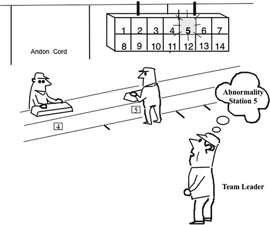
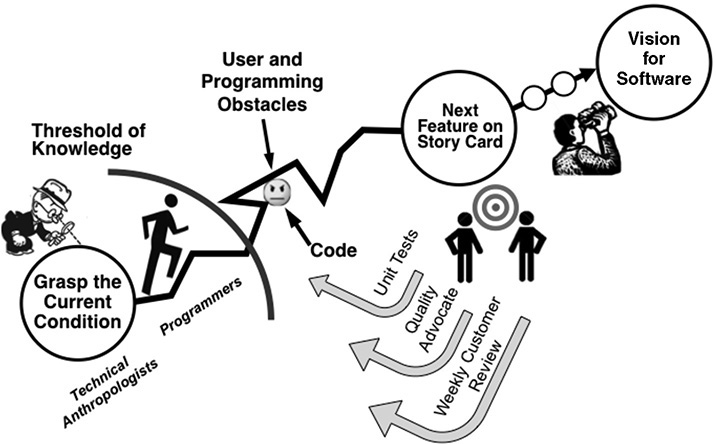

 Principle 6 

**Build a Culture of Stopping to Identify Out-of-Standard Conditions and Build in Quality**

_Mr. Ohno used to say that no problem discovered when stopping the line should wait longer than tomorrow morning to be fixed. Because when making a car every minute we know we will have the same problem again tomorrow._

—Fujio Cho, President, Toyota Motor Corporation

Russ Scaffede was vice president of Powertrain for Toyota when it launched the first American powertrain plant to make engines in Georgetown, Kentucky, for the on-site assembly plant. He had worked decades for General Motors and had an excellent reputation as a manufacturing guy who could get things done and worked well with people. He was excited about the opportunity to work for Toyota and to help start up a brand-new plant following state-of-the-art TPS principles. He worked day and night to get the plant up to the demanding standards of Toyota and to please his Japanese mentors, including Fujio Cho, who was president of Toyota Motor Manufacturing in Kentucky.

Before joining Toyota, Scaffede had learned the golden rule of automotive engine production: do not shut down the assembly plant! At General Motors, managers were judged by their ability to deliver the numbers. Get the job done no matter what—and that meant getting the engines to the assembly plant to keep it running. Too many engines, that was fine. Too few, that could send you to the unemployment line.

So when Cho remarked to Scaffede that he noticed he had not shut down the assembly plant once in a whole month, Scaffede perked up: “Yes sir, we had a great month, sir. I think you will be pleased to see more months like this.” Scaffede was shocked to hear from Cho:

_Russ-san, you do not understand. If you are not shutting down the assembly plant, it means that you have no problems. All manufac130turing plants have problems. So you must be hiding your problems. Please take out some inventory so the problems surface. You will shut down the assembly plant, but you will also continue to solve your problems and make even better-quality engines more efficiently._

When I interviewed Mr. Cho for this book, I asked him about differences in culture between what he experienced starting up the Georgetown plant and managing Toyota plants in Japan. He did not hesitate to note that his number one problem was getting group leaders and team members to stop the assembly line. They assumed that if they stopped the line, they would be blamed for doing a bad job. Cho explained that it took several months to “re-educate” them that it was a necessity to stop the line if they wanted to continually improve the process. He had to go down to the shop floor every day, meet with his managers, and, when he noticed a reason to stop the line, encourage the team leaders to stop it.

**THE PRINCIPLE: BUILD A CULTURE OF STOPPING TO IDENTIFY OUT-OF-STANDARD CONDITIONS AND BUILD IN QUALITY (JIDOKA)**

Jidoka, the second pillar of TPS, traces back to Sakichi Toyoda and his long string of inventions that revolutionized the automatic loom. We discussed in the history chapter his device that allowed looms to stop themselves when a single thread broke, a breakthrough invention that improved the quality of cloth and freed up operators to operate multiple looms and assume their rightful place as problem solvers. One of the leading American students of TPS, Alex Warren, former executive vice president, Toyota Motor Manufacturing, Kentucky, defined “jidoka” and how it relates to employee empowerment:1

_In the case of machines, we build devices into them, which detect abnormalities and automatically stop the machine upon such an occurrence. In the case of humans, we give them the power to push buttons or pull cords—called “andon cords”—which can bring our entire assembly line to a halt. Every team member has the responsibility to stop the line every time they see something that is out of standard. That’s how we put the responsibility for quality in the hands of our team members. They feel the responsibility—they feel the power. They know they count._

Jidoka is also referred to as “autonomation”—equipment endowed with human intelligence to stop itself when it has a problem. In-station quality (preventing problems from being passed down the line) is much more effective and less costly than inspecting and repairing quality problems after the fact.

Lean manufacturing dramatically increases the importance of building things right the first time. With very low levels of inventory, there is little buffer to fall back on in case there is a quality problem. Problems in operation A will quickly shut down operation B. When equipment shuts down, flags or lights, usually with accompanying music or an alarm, are used to signal that help is needed to solve a problem. This signaling system is referred to as “andon.”

In addition to calling attention to quality problems, team members are instructed to pull the cord when they identify any out-of-standard conditions, which enables continuous improvement. As discussed later this does not immediately stop the line but rather alerts the team leader that this may be necessary. One of the more common reasons for pulling the cord is when team members get behind in the work cycle. There are marks on the conveyor that show the members what percentage of the standardized work should be complete so they can see if they are behind. The members are highly skilled and usually can catch up on their own if need be—but then that out-of-standard condition would not be identified and the problem would not be solved.

While it may seem obvious that you should catch and address problems immediately, the last thing management in traditional mass manufacturing permits is a halt in production. For example, bad parts, when they happen to be noticed, are simply labeled and set aside to be repaired at another time and by another department. The mass production mantra seems to be “Produce large quantities at all costs and fix problems later.” As Gary Convis, former president of the Toyota factory in Georgetown, explained to me:

_When I was at Ford, if you didn’t run production 100% of the shift, you had to explain it to Division. You never shut the line off. We don’t run 100% of the scheduled time out here. Toyota’s strength, I think, is that the upper management realizes what the andon system is all about . . . . They’ve lived through it and they support it. So in all the years I’ve been with Toyota, I’ve never really had any criticism over lost production and putting a priority on safety and quality over hitting production targets. All they want to know is how are you problem solving to get to the root cause? And can we help you? I tell our team members there are two ways you can get in trouble here: one is you don’t come to work, and two is you don’t pull the cord if you’ve got a problem. The sense of accountability to ensure quality at each station is really critical._

The built-in quality created by jidoka has never been more important to Toyota than with the Lexus because of the necessity of meeting the extremely high expectations of Lexus owners. When the brand was first introduced, Lexus vehicles were built only in Japan, where the culture and quality systems were undisputedly world class. But could Lexus be built in North America and still maintain the unbelievably meticulous levels of quality that customers have come to expect? The answer turned out to be yes. Toyota began manufacturing the Lexus in its Cambridge, Ontario, facility and later in its Kentucky plant.

Ray Tanguay, former president of Toyota Motor Corporation, Canada, knew that the bar was now higher as he moved from making the Toyota Corolla and Matrix models to the Lexus RX 330\. There were a number of innovations designed into the processes, and technologies of the new Lexus line to ensure that Lexus buyers received Lexus quality. For example, production tools and robots on the line were designed with built-in sensors to detect any deviation from standard and used radio transmitters to send electronic signals to team leaders wearing headphone sets. Because not every problem can be caught in process, Lexus managers developed a highly detailed 170-point quality check for every finished RX 330\. Tanguay wore a BlackBerry personal digital assistant on his belt wherever he went, and every time an error was found on a finished vehicle, a report was instantly sent to his BlackBerry, along with a digital photo of the problem. Tanguay had the ability to transfer the photo to a large electronic billboard in the plant that could be seen by all the workers if he felt that would increase awareness of the problem and prevent the same mistake from occurring again. While the technology was new, the execution still depended on alert, thinking people at the gemba and the principle remained the same: bring problems to the surface, make them visible, and go to work immediately on countermeasures.

**“YOU MEAN THE LINE DOES NOT REALLY STOP?”**

We seem to have a paradox. Toyota management says it is OK to run less than 100 percent of the time, even when the line is capable of running full-time, and yet Toyota is consistently ranked among the most productive plants in the auto industry. Why? Because Toyota learned long ago that solving problems at the source saves time and money downstream. By continually surfacing problems and fixing them as they occur, you eliminate waste, productivity soars, and competitors who are running assembly lines flat out and letting problems accumulate get left in the dust.

When Toyota’s competitors finally did start using Toyota’s andon system, they made the mistake of assuming that the line-stop system was hardwired to each and every workstation—push the button, and the entire assembly line comes to a screeching halt. I consulted to one of the large automakers in the United States to help its assembly plant engineering group understand TPS. The engineers became irate when I explained that most of the time the line does not really stop. “They are cheating,” exclaimed one engineer. I explained that the line does stop, just not every time the cord is pulled. The purpose of most of the line stops is to call attention to problems so they can be first contained, then solved, not to shut everything down so the problem can be solved immediately while the line is down. Of course, in potentially dangerous situations that threaten safety and quality, the line will stop.

At Toyota, the andon is called a “fixed-position line-stop system.” As shown in Figure 6.1, when an operator in Workstation 5 pulls the andon cord, Workstation 5 will light up in yellow, but the line will continue moving, allowing each team member to finish work on the current vehicle. The responsibility for deciding whether to stop the line falls on the team leader, a production team member who spends time in production and time offline responding to the andon. This is a unique role at Toyota and is critical to the functioning of the andon system (it is explained in detail in Principle 10). The team leader has until the vehicle moves into the next workstation zone to respond, before the andon turns red and the line segment automatically stops. On a normal assembly line that builds cars at a rate of one a minute, the team leader likely has 10–20 seconds to decide what to do. In that time, the team leader might immediately fix the problem or note it can be fixed while the car is moving into the next workstation. In that case, the team leader pulls the cord again, canceling the line stoppage. Or the team leader might conclude the line should stop. Team leaders are carefully trained in standardized procedures on how to respond to andon calls. Offline, team leaders examine andon pulls and pick the most common or serious ones to address through problem solving.

**Figure 6.1** Andon and fixed-position line stop.

Even if the team leader allows the line to stop, the entire assembly line does not shut down. The assembly line is divided into segments with small buffers of cars in between (typically containing 7 to 10 cars). Because of the buffers, when a line segment stops, the next line segment can keep working for 7 to 10 minutes before it will shut down, and so forth. Rarely does the whole plant shut down. Toyota achieved the purpose of andon without taking needless risks of lost production. It took US auto companies years to understand how to apply this TPS tool, which perhaps explains why workers and supervisors were hesitant to stop the line—because it actually stopped the entire line! When they gained a better understanding of andon, the engineering group I consulted to that afternoon constructed a computer simulation of the assembly line to identify the number of buffers to put in and their size.

**USING COUNTERMEASURES AND ERROR PROOFING TO FIX PROBLEMS**

This point has been made earlier in the book, but it bears repeating: the closer you are to one-piece flow, the quicker problems will surface to be addressed. This hit home for me personally in the summer of 1999 when I was given a unique opportunity to learn more about TPS. General Motors had a program through its joint venture with Toyota, the NUMMI plant, in Fremont, California, to which GM sent employees for one week of training in TPS. The week included two days of working on the NUMMI assembly line—actually building cars. I was given the opportunity to participate.

I was assigned to a subassembly operation off the main assembly line that made axle assemblies for the Toyota Corolla and the equivalent GM model. In unibody cars, where there is no chassis, there is not a real axle, but four independent modules that include the wheel, brakes, and shock absorber. The axle assemblies were built in the same sequence as the cars on the assembly line, put on pallets, and delivered in the order of cars moving down the assembly line. It took about two hours from the time a module was built until it was attached to the car, so if there was a problem, you had a maximum of two hours to fix it before the main assembly line segment might be shut down.

The job I was assigned was an easy “freshman” job: attach a cotter pin to hold a ball joint in place. You put in the cotter pin and spread out the ends, and it locked the ball joint in place. This affected braking, so it was a very important safety item. At one point early in the afternoon, I saw people scrambling around and holding a number of impromptu meetings. I asked the team member working next to me what was going on, and he explained that a unit had gotten to the assembly line without a cotter pin. It was a big deal, he said. An assembly line worker who installed the subassembly on the car had caught it. The team knew it happened only a couple of hours earlier. I assumed it was my mistake and immediately felt terrible for having missed installing a cotter pin. The team member claimed that it happened while I was on break. Who knows? But his response to my guilt feelings was even more important. He said:

_What is important is that the error went through eight people who did not see it. We are supposed to be inspecting the work when it comes to us. And the guy at the end of the line is supposed to check everything. This should never have gotten to the assembly line. Now we as a team are embarrassed because we did not do our jobs._

Although this missing cotter pin went undetected through the entire system of inspection, there were a remarkable number of countermeasures that had already been put in place on the axle line to prevent things like this from occurring. In fact, at every workstation there were numerous poka-yoke devices. “Poka-yoke” refers to error proofing (aka mistake proofing or fool proofing). These are creative devices that make it nearly impossible for an operator to make an error . . . nearly. Obviously, there was not a poka-yoke to detect whether the cotter pin was in place. Nonetheless, the level of sophistication on the line was impressive—there were 27 poka-yoke devices on the front axle line alone. Each poka-yoke device also had its own standard form that summarized the problem addressed, the emergency alarm that will sound, the action to be taken in an emergency, the method and frequency of confirming the error-proof method is operating correctly, and the method for performing a quality check in the event the error-proof method breaks down. This is the level of detail that Toyota uses to build in quality.

As an example, though there was no poka-yoke to check if the cotter pin was in place, there was a light curtain over the tray of cotter pins. If the light curtain was not broken by the operator reaching to pick up a cotter pin, the moving assembly line would stop, an andon light would come on, and an alarm would sound. Another poka-yoke device required that I replace a tool (somewhat like a file, used to expand the cotter pin) back in its holder after I used it or the line would stop and an alarm would sound. It sounds a bit bizarre—and it might be perceived as one step removed from getting electric shocks for any misstep. But it is effective. Of course, there are ways around the system, and the workers on the line could find them all. But at Toyota, workers tend to be disciplined about following the standard tasks and adhering to quality processes.

Standardized work (Toyota Way Principle 6) is itself a countermeasure to quality problems. For example, the job I had was designed so it could be accomplished in 44.7 seconds of work and walk time. The takt time (line speed in this case) was 57 seconds per job, so there was plenty of slack time; hence it was a freshman job. Yet even for this simple job there were 28 steps shown on the “standardized work chart,” right down to the number of footsteps to take to and from the conveyor. This standardized work chart was posted at my jobsite, where there were visuals that also explained potential quality problems. A more detailed version in a notebook had each of the 28 steps on its own sheet, described in greater detail, along with digital photos of each step being performed correctly. Very little was left to chance. Whenever there is a quality problem, the standardized work chart is reviewed to see if something is missing that allowed the error to occur, and if so, the chart is updated accordingly.

**KEEP QUALITY CONTROL SIMPLE AND INVOLVE TEAM MEMBERS**

If American and European companies learned anything from the arrival of competitive Japanese products into the US market in the 1980s, it was quality fever. The level of quality consciousness in Japanese companies made our heads spin. They crafted fine art while we were slapping parts together. But we woke up and worked hard to fix this. J.D. Power’s recent surveys of the quality of new vehicles (during the first three months of ownership) show that the gap between Japanese auto companies and US and European competitors has shrunk to the point of being barely noticeable. But as discussed in the Introduction, longer-term data show that the quality differential has not been erased—it has just been hidden. It is relatively easy to inspect an assembled vehicle and fix all the obvious problems before the customer has a chance to see them. But inspected-in quality is often temporary quality; problems surface over the long term as there is wear and tear on the vehicle.

Unfortunately, for many companies, the essence of building in quality has gotten lost in bureaucratic and technical details. Things like ISO-9000, an industrial quality standard that calls for detailed, written standard operating procedures, for whatever good they have done, have made many companies believe that if they put together detailed rule books, the rules will be followed. Quality planning departments are armed with reams of data that they analyze using the most sophisticated statistical methods. Six sigma has brought us roving bands of black belts who attack major quality problems with a vengeance, armed with an arsenal of sophisticated technical methods.

In contrast, at Toyota, people tend to use simple visual charts and graphs to display quality problems and their causes, like Pareto charts and cause-and-effect diagrams. The main focus is on addressing problems as they occur, one by one.

Don Jackson, former VP of manufacturing for Toyota’s Georgetown plant, was a quality manager for a US auto supplier before joining Toyota. He had been a stickler for detail and defended the complex quality manuals he had helped write. At Toyota, he learned the power of simplicity. As he described it, “Before joining Toyota I made a lot of policies and procedures too difficult to follow. They were doomed for failure.” He still participated in quality audits of suppliers at Toyota, but his approach and philosophy were completely different from the more coercive-bureaucratic mindset he had before joining Toyota:

_You can write a complex procedure that covers the operator, equipment maintenance, and a quality audit—and theoretically, the process will run forever. But my philosophy is support the team members who are running the process. I want them to be able to know everything because they’re the ones producing the product. So those team members have to know that the preventative maintenance was done on schedule, and their equipment is in good shape by some visual control system. The quality check every hour . . . those team members should know that it was done and it was OK every hour or they stop the line. Then finally, they must know what their job requirements are and know that they’re getting good built-in quality by some means. So those team members are in total control. I want team members to know that they have everything they need to build that product correctly . . . man, material, method, machine._

Obviously, this audit is very different from the typical quality audit that follows detailed procedures from a manual, perhaps analyzes some statistical data, and maybe even checks to see if the procedures are being followed. Jackson is looking with a different set of eyes—the eyes of the operator controlling the process. He is looking at quality from the point of view of the shop floor—the actual situation (genchi genbutsu).

One of the most powerful tools in Toyota production besides the andon is the quality gate. The production line is laid out in sections, and at the end of each section is a place where quality is checked. Any defect is examined to determine the origin of the error, and that information is provided to the correct group leader who takes action to solve the problem. This goes on day in and day out. If the problem gets through to the final line, it is elevated to the attention of management. If it flows out to customers, it is a major crisis.

**LONG-TERM LEARNING FROM A QUALITY CRISIS**

On August 28, 2009, an off-duty California Highway Patrol officer was driving a Lexus ES 350 sedan with his family when the vehicle sped up out of control leading to a fiery crash. A passenger called 911 and desperately asked for help as the incident occurred. The call got on the internet and went viral. The _Los Angeles Times_ speculated that electronic interference caused the car’s computer to send the car accelerating out of control. The paper assigned two reporters to find the dirt and try to win a Pulitzer Prize. One year later, NASA, in an attempt to find an electronic cause for the accident, bombarded test vehicles with electromagnetic waves and analyzed hundreds of thousands of lines of computer code. It concluded there was no evidence of an electronic failure.

In the aftermath of the accident, a little-known police report was filed that showed convincingly that the cause of the sudden acceleration was the wrong size floor mat—it was a rubber all-weather mat and was intended for a larger SUV—that was placed in the vehicle by the Lexus dealer who loaned the car to the police officer while his car was being repaired. Millions of vehicles were recalled. Billions of dollars were paid out to settle disputes. Toyota cut down the accelerator pedal so it could not be impacted by floor mats that were piled one on another too high. A few unrelated problems with accelerators and brake pedals were discovered, but there were few instances reported and no reported serious accidents. Nonetheless, the media kept claiming Toyota had massive, sudden unintended acceleration problems and that its vehicles were not safe to drive. For Toyota, it was the worst blow to its reputation in the history of the company.

How do you deal with a crisis like this when the technical problems are greatly exaggerated by the media? Akio Toyoda was unexpectedly called to testify before Congress and was grilled on February 24, 2010\. He apologized for the concern his company caused customers, he took responsibility, but he also claimed that Toyota cars were safe, an assertion supported by objective evidence.

Henry Ford said that “quality means doing it right when no one is looking.” In 2020, no one is looking, and all the external quality studies put Toyota and Lexus at or near the top. Toyota’s recall crisis is old news, but not within Toyota. Each year on February 24, the anniversary of Akio Toyoda’s grilling by Congress, departments within Toyota across the globe do something to recognize the occasion and reaffirm the importance of quality. In each headquarters globally and every Toyota factory in the world, there is now a Quality Learning Center to raise quality awareness among all Toyota employees. Each location develops its own version that fits local circumstances.

At Toyota’s assembly plant in the United Kingdom, every member went through the quality center in 2019\. The center features a display of Akio Toyoda explaining that he requested each location to “gather and exhibit as unattractive matters as possible, such as sternly-worded articles in newspapers, customers’ scolding voices, and the many issues from the market which have caused inconvenience to our customers.” He asks everyone going through the center to “actively listen to what our customers are saying and to act quickly on what we learn.”

The program begins with a video of the 911 call and images of the car crashing. It then moves on to a display of “unattractive matters.” I was unpleasantly surprised to see a congresswoman waving my original _Toyota Way_ around at the hearing admonishing Akio Toyoda to feel ashamed that MBA students were reading this book and thought Toyota was a model company. As you walk on you see an actual Toyota vehicle with an all-weather mat stacked on the carpet mat, which demonstrates how the accelerator pedal can get stuck. Then it moves on to quality problems that have been experienced at that plant and provides interactive exhibits to show how quality defects can be avoided, for example through standardized work. It ends with some good news—customers raving about the quality of their Toyota vehicles. Most of the world has forgotten the quality crisis, but Toyota continues to use it as motivation to always put the customer first.

**DESIGNING IN QUALITY IN SOFTWARE DEVELOPMENT**

Designing or building in quality is not just for manufacturing. It applies to every activity, including writing software code. Defective software can lead to critical data losses, and complex user interfaces can lead to losing customers. Ever happen to you? Ever not happen to you? In addition, defects lead to rework. Some software projects have almost as many hours dedicated to fixing the code as they did to writing the original code.

At Menlo Innovations, a small custom software development firm in Ann Arbor, Michigan, this almost never occurs. Customers use the software out of the box, without user manuals, and rave about it. The company credits its success to involving customers every step of the way, getting quality feedback to programmers, and designing in quality as the programmers create the code (see Figure 6.2).\*

**Figure 6.2** Menlo Innovations’ system of designed-in quality in coding software.

Once there is agreement on a vision for the software, Technical Anthropologists™ go to work to understand the customer by going to the gemba. What is the nature of the work the users do? How experienced are they with software? Where do they experience pain points in using current software? The Tech Anthropologists must develop the skills of deep observation and be empathetic, putting themselves in the place of the user.

The Tech Anthropologists develop a vision for the software and then develop “key personas,” fictional stories of users in different roles, and work with customers to select the primary persona who will use the software. Next, the Tech Anthropologists draw the screens and show them to customers and users until they have agreement. The software features on the screen are converted to individual story cards that the program manager and customer post on a work authorization board for pairs of programmers to work on week by week. In essence, the Tech Anthropologists are creating the standard against which programmers’ work will be judged.

Pairs of programmers take a story card and together do the coding. Two pairs of eyes keep the programmers focused; often, one person notices issues the other misses. They write unit tests for each small segment of code to test if it does what it is supposed to do. These are automated tests of the code that will repeatedly run as the code is further developed and compiled with new code—providing instant feedback on whether it works as intended. When programmers believe they have completed a story card, a quality advocate tests it, not to look at the technical details of the code, but to check if it does what the customer wants. This will generally happen during the same day shortly after the code is written. Then, on a set day every single week, the programmers meet with the customers who try to use the code, without instruction—which can lead to acceptance of the code as is or with some rework. Based on how this meeting goes, story cards are authorized for another week of work, and the process continues like this until the software is delivered—error free and with 100 percent customer satisfaction. All-nighters to fix problems just before release of the software are an alien concept at Menlo.

Menlo Innovations works obsessively to build a culture of stopping to identify out-of-standard conditions and build in quality. It has made designed-in quality and customer satisfaction a deliberate part of its culture, from employee selection to daily activities. “Menlonians” are selected for their propensity to think creatively, learn quickly, and work in pairs. I have talked to Menlo programmers who make it clear they would not want to go back to a traditional software organization where they would work in isolation with only guesses about what the customer really wants.

Continuous improvement of websites is becoming more common with the ability to quickly and cheaply run huge numbers of experiments.2 In some companies, it has penetrated into the culture where employees are encouraged to propose any ideas, even outlandish ones, that they think will improve the web page. Online testing can be easily done by analyzing the responses of a random sample of users who see a new feature or function in the website compared with the people in a control group who do not see the change. The ideas that work, according to predetermined criteria like the number of hits on the site, are integrated into the site. Stefan Thomke, who has been studying this phenomenon, observes that success is achieved by conducting tests frequently and making experimentation and innovation a matter of culture and a normal expectation of daily work, even when budgets are tight. People at all levels must learn to value “surprises,” even if they are disruptive in the short term. When things are going too smoothly, it probably means problems are being hidden.

**BUILDING IN QUALITY IS A PRINCIPLE AND SYSTEM, NOT A TECHNOLOGY**

A story I heard from a plant manager at Reiter Automotive (supplier of sound-dampening materials) helped put into perspective what it takes to build in quality. He ran a plant in Chicago and supplied Toyota. He had a Toyota mentor teaching him TPS. The Toyota mentor had suggested the plant needed an andon system to immediately alert people to quality problems. The plant manager energetically got his engineers to spec out an andon system similar to the kind Toyota uses, with light boards hung from the rafters and directly connected to buttons the operator pushed. While this was a relatively small plant compared with the Toyota plant, the plant manager wanted to use the very best technology to prove his sincerity to his mentor. The Toyota mentor said, “No, no, no. You do not understand. Come with me.” He then drove the plant manager to a local hardware store. He picked out a red flag, a yellow flag, and a green flag. He handed them to the plant manager and said, “Andon.”

His point was that a working andon system is not the same thing as buying fancy new technology. Andon works only when you teach your employees the importance of bringing problems to the surface so they can be quickly solved. Unless you have people who quickly identify problems and a problem-solving process that they follow, there’s no point in spending money on fancy technology. Americans tend to think that buying expensive new technology is a good way to solve problems. Toyota prefers to first use people and processes to solve problems, then supplement and support its people with technology later.

General Motors early on copied Toyota’s NUMMI plant system of team leaders when it introduced andon. But the team leaders spent a good deal of their time in the back room smoking cigarettes or playing cards. What good is pushing the andon button if nobody is around to respond? In a later incarnation, GM got schooled on the philosophy of andon. In its Cadillac plant in Hamtramck, Michigan, it put in sophisticated fixed-position stop andon with all the technical bells and whistles. When the button was pushed, the line kept going until the car entered the next workstation and then the line automatically stopped at a “fixed position.” Fortunately, Michael Brewer, one of the original GM managers sent to work at NUMMI to learn TPS, asked the plant to turn off the automatic stop system. He saw that the culture was not ready. Each work group had to pass a lean audit in order to earn the right to turn on the automatic system to stop the line. Were the operators following standardized work? Was the kanban system being used properly so all containers of parts were in the right place and in the proper quantity? Were quality key points built into standardized work and taught properly? Were the team leaders available near each process and responding to problems? As a result, each work team struggled to pass the audit and to gain the privilege of having the complete andon system turned on in the team’s workstations. There were celebrations each time a group succeeded.

In the Toyota Way of doing things, what matters when improving quality is enabling the process and the people. You can spend a great deal of money on the latest and greatest andon and have no impact whatsoever on quality. Instead, you need to constantly reinforce the principle that quality is everyone’s responsibility throughout the organization. Quality for the customer drives your value proposition, so there is no compromising on quality, because adding value to your customer is what keeps you in business and allows you to make money so everyone can continue to be part of the company.

Designing and building in quality has become common across business sectors. Still, the number of companies like Menlo Innovations that have made quality an integral part of their culture, so it becomes the way work is done, is quite small. It should be clear to the reader by now that all aspects of the Toyota Way—philosophy, processes, people, and problem solving—support building in quality to satisfy customers.

 KEY POINTS 

 The customer is the final arbiter of how good a job the company is doing.

 The voice of the customer must be driven through every process from design to manufacturing.

 Toyota’s famous andon system of stopping to fix problems is one of a number of ways to surface problems immediately so they can be solved quickly.

 One of the most dramatic examples of facing and addressing problems for Toyota has been its response to the sudden acceleration recall crisis. Over a decade later, Toyota is still using it to raise quality consciousness.

 Designing in quality also applies to digital companies. The best companies have built processes for getting rapid feedback as code is being written and to run experiments with customers to get continual feedback to improve the software.

 Quality is more than tools; it is a matter of creating a culture where even negative feedback is valued and used for continuous improvement from design through customer use.

**Notes**

1\. _The Toyota Way 2001_, Toyota Motor Corporation, internal document, 2001.

2\. Stefan Thomke, “Building a Culture of Experimentation,” _Harvard Business Review,_ March–April 2020.

\_\_\_\_\_\_\_\_\_\_\_\_\_\_\_\_\_\_\_\_\_\_\_\_\_\_\_\_

\* See a detailed discussion of the process and culture in Richard Sheridan, _Joy, Inc_. (New York: Portfolio, 2013).

