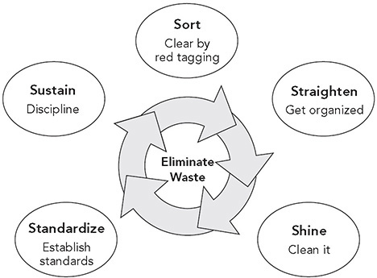
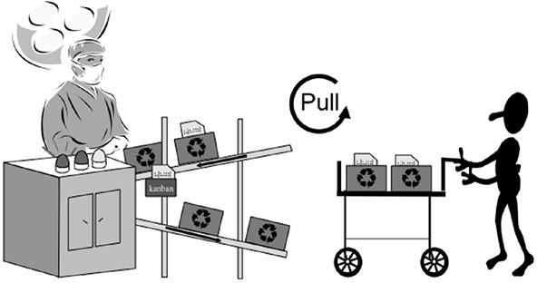
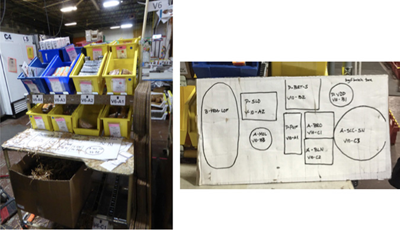
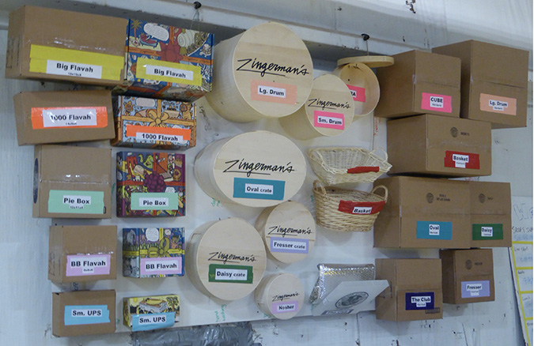
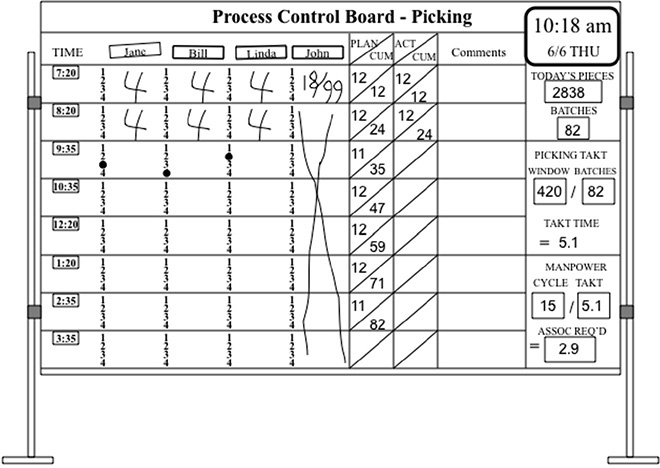

 Principle 7 

**Use Visual Control to Support People in Decision-Making and Problem Solving**

_Mr. Ohno was passionate about TPS. He said you must clean up everything so you can see problems. He would complain if he could not look and see and tell if there is a problem._

—Fujio Cho, President, Toyota Motor Corporation

We can take in information through our five senses—see, hear, touch, smell, and taste. There is a lot of evidence that for most of us sight is the most powerful sense for learning, recalling, and using the information. In John Medina’s popular book _Brain Rules_,1 he gives us “Rule #10: Vision trumps all other senses.” Medina summarizes:

 **_We are incredible at remembering pictures._** _Hear a piece of information, and three days later you’ll remember 10% of it. Add a picture and you’ll remember 65%._ 

 **_Pictures beat text as well, in part because reading is so inefficient for us._** _Our brain sees words as lots of tiny pictures, and we have to identify certain features in the letters to be able to read them. That takes time._ 

 **_Why is vision such a big deal to us?_** _Perhaps because it’s how we’ve always apprehended major threats, food supplies and reproductive opportunity._ 

 **_Toss your PowerPoint presentations._** _It’s text-based (nearly 40 words per slide), with six hierarchical levels of chapters and subheads—all words. Professionals everywhere need to know about the incredible inefficiency of text-based information and the incredible effects of images. Burn your current PowerPoint presentations and make new ones._2

So rather than fight our natural human tendencies, Toyota has chosen to build on them. Like anything else, Toyota did not figure this out by reading books, but through experience and reflection. Toyota has made an art form out of visual management. Walk through any part of Toyota, and visual management is glaring, everywhere—color-coded green safe walking areas; big inverted triangles with a Q in them for critical quality processes; standardized work sheets posted; andon lights blinking green, yellow, or red; boards with metrics identified as green, yellow, or red; shadow boards showing if tools are in place; and kanban that indicate when to replenish supplies.

**THE 5S BASICS—CLEAN IT UP. MAKE IT VISUAL**

If you walked into most manufacturing plants outside Japan in the 1980s, you would see a mess. But more critical was what you would _not_ see. You would not be able to see around the piles of inventory that were stacked to the roof. You would not be able to tell whether items were in place or out of place. Certainly, you could not see if there were problems with how work was being done. The accepted dysfunction of the day was to see no problems and hear no problems—until the hidden problems jumped up and bit you in the face. By that time, a problem usually wasn’t just a problem, but a firefighting crisis, and managers would spend much of their time jumping from putting out one fire to putting out the next. In short, crisis management was the accepted mentality of the day.

The Donnelly Mirrors (now Magna Donnelly) plant in Grand Haven, Michigan, which produces exterior automotive mirrors, was so disorganized in the early 1990s that it looked more like a warehouse than a manufacturing plant. One day, a Ford Taurus mysteriously disappeared. It was in the factory being used to fit with prototype mirrors. When it vanished, the plant managers even filed a police report. It turned up months later. Guess where it was? In the back of the plant, surrounded by inventory. Donnelly associates later used this story to illustrate how far they had come since beginning a lean transformation.3

Outrageous as the Donnelly story may seem, it dramatizes what happens in many workplaces daily. Try this little exercise at your place of work. Approach a coworker and ask to see a specific document on his or her computer or the company’s intranet. Watch to see if the person can immediately find and extract the document on the first try. The time it takes, and perhaps the person’s frustration level, will most likely tell you at a glance whether your coworker’s way of visually organizing is in control or out of control. Or observe a conference room that is used for important planning meetings. Is it easy to see at a glance what is going on in the room? What do you see when you look at the walls? Are there charts and graphs that tell you if today the managers are ahead of or behind schedule? Are any abnormalities or delays in the project or operation easily visible? Are the documents up to date? That is, is there active visual information that provides the ability to see abnormalities at a glance? At Toyota, project management meeting rooms are called _obeya_, or big rooms, and looking at the walls you can understand the status of the project (discussed later in the chapter).

When Americans were making pilgrimages to Japanese plants in the 1970s and 1980s, the first reaction was invariably, “The factories were so clean you could eat off the floor.” For the Japanese, this was simply a matter of pride. Why would you want to live in a pigpen? But their efforts go beyond making the factory look clean and orderly. In Japan, there are “5S programs” that comprise a series of activities for eliminating wastes that contribute to errors, defects, and injuries in the workplace. Here are the five Ss (seiri, seiton, seiso, seiketsu, and shitsuke) translated into English:\*

1\. **Sort.** Sort through items and keep only what is needed while disposing of what is not.

2\. **Straighten (orderliness).** “A place for everything and everything in its place.”

3\. **Shine (cleanliness).** The cleaning process often acts as a form of inspection that exposes abnormal and prefailure conditions that could hurt quality or cause machine failure.

4\. **Standardize (create rules).** Develop systems and procedures to maintain and monitor the first three Ss.

5\. **Sustain (self-discipline).** Maintaining a stabilized workplace is an ongoing process of continuous improvement as conditions change.

In mass production, without the five Ss, many wastes accumulate over the years, covering up problems and becoming an accepted dysfunctional way of doing business. The five Ss create a continuous process for improving the work environment, as illustrated in Figure 7.1.

**Figure 7.1** The five Ss.

Here’s how to incorporate the five Ss: Start by sorting through what is in the office or shop to separate what is needed every day to perform value-added work from what is seldom or never used. Mark the rarely used items with red tags and move them outside of the work area. Next create permanent locations for each part or tool you do use regularly. Store infrequently used items outside the workplace and dispose of the rest. Then shine, making sure everything stays clean every day. Visually standardize the quantities and locations to make clear where things belong and to make it clear when something is missing (such as a red square where the box should be).

The fifth S, sustain, is vital to realizing the benefits of 5S over time by making a habit of properly maintaining the correct procedures and creating new ones as conditions change. Sustain is a team-oriented continuous improvement process that is the responsibility of managers, group leaders, team leaders, and team members—in other words, clean up your own mess. It should be part of the core job role of everybody rather than a separate function by support staff.

Do 5S audits periodically, give scores to different groups, and hold them accountable for improving their scores. Toyota team leaders and group leaders audit their processes regularly, often with daily scores. The results of the audits, and the impetus they provide to make positive change, are part of continuous improvement. A deviation is a gap to improve through problem solving. What in the system allowed that to happen? Less mature plants rely on managers or specialists to do audits and tie specific rewards to keeping the place clean and orderly. One plant awarded the best team with a golden broom and rotated the award when another team scored better in a subsequent audit. In advanced lean plants, work teams take the responsibility to audit their own areas weekly or even daily, and managers inspect periodically to provide feedback.

**STANDARD LOCATIONS NEED STABLE PROCESSES**

Unfortunately, some companies seem to think 5S is lean production. More than one company I have visited related some version of the following story:

_A few years back, management decided to try this lean stuff. They paid a million dollars to a training company who taught us 5S and did a lot of 5S workshops. The place got cleaned up and looked better than it ever had since I started working here. But we did not save any money, quality did not get better, and soon all the great 5S results started to degrade. Eventually management stopped the program. We ended up right back where we started._

The Toyota Production System is not about using 5S to neatly organize and label everything, including waste, to make the place appear tidy and shiny. It is not lipstick on a pig. Many companies with poorly organized mass production systems, little real flow, push systems, and an erratic schedule thought they could solve all their problems with 5S. But since processes and amounts of inventory fluctuated so much, 5S was like trying to hit a moving target. Just when you have places for everything neat and labeled a tsunami of inventory arrives and there is no place to put it.

Visual control of a well-planned lean system is different from making a mass production operation look neat and shiny. Lean systems use 5S to support a smooth flow to takt. 5S is also a tool to help make problems visible and, if used in a sophisticated way, can be part of the process of continuous improvement.4 For example, in a well-organized inventory buffer there are clearly marked minimum and maximum levels, and if the process is stable the inventory should mostly stay within those boundaries. If there is too little or too much inventory it becomes apparent, and that should lead to problem-solving starting with: Why did this happen?

Consider, for example, a manual assembly process. Materials that will be assembled are brought to the operator. It is useful to think of the operator as a surgeon. Obviously, a surgeon needs to focus completely on the patient. The last thing you want is the surgeon to be distracted by having to go looking for an instrument or material. In a well-run operating room, every effort is made to predict what will be needed and make it available when required. Nurses place in the surgeon’s hand exactly what is needed next, and the surgeon does not even turn around. That is the exact ideal for an operator in a plant—everything needed should be available within easy reach without turning away from the work.

Toyota plants traditionally used flow racks with boxes of each part as shown in Figure 7.2 (more frequently these days they use carts with exactly what is needed for each vehicle so team members need not search through different boxes of parts). Standard parts in bins on gravity-fed conveyors roll down to the assembler. There is room for a specific number of bins, and there are standard locations for the bins with easy-to-see labels. The bins are then replenished based on a pull system. In a pull system, a material handler will bring just enough to replenish what has been used. This works great, and 5S is very helpful. But in a push system, extra bins of the same part will come at the same time on occasion. Where will you put the extra bins of parts? Most likely they will be placed on the floor. Now the operator is bending down to get parts, and the great “standard organization” is all messed up. The lesson: TPS is a system, and changing only one part of the system rarely works. What we really want is visual control of a stable process, so when there are deviations, they will become immediately apparent.

**Figure 7.2** Operators as surgeons pull what is needed, when needed, in the amount needed, through visual signals.

**VISUAL CONTROL AT THE WORKSITE**

“Visual control” is any communication device used in the work environment that tells us at a glance how work should be done and whether it is deviating from the standard. It helps employees who want to do a good job see immediately how they are doing and in some cases what to do next. It might show where items belong, how many items belong there, what the standard procedure is for doing something, the status of work in process, and many other types of information critical to the flow of work activities. In the broadest sense, visual control refers to the design of just-in-time information of all types to ensure fast and proper execution of operations and processes. There are many excellent examples in everyday life, such as traffic signals. Because it is a matter of life and death, traffic signals tend to be well-designed visual controls. Look up—if the traffic light is red, then stop; if it’s green, then go; if it’s yellow, it will soon turn red. Good traffic signs don’t require you to stop and study them: their meaning is immediately clear, or we may get into an accident.

Visual control goes beyond capturing deviations from a target or goal on charts and graphs and posting them publicly. Visual controls at Toyota are integrated into the process of the value-added work. The “visual” aspect means being able to look at a process, a piece of equipment, inventory, information, or a worker performing a job and immediately see the standard being used to perform the task and if there is a deviation from the standard. Ask this question: Can your manager walk through the shop floor, office, or any type of facility where work is being performed and recognize if standardized work or procedures are being followed? For example, if you have a clear standard for every tool to be hung in a certain place and it’s made visual (perhaps through a shadow board), then the manager can see if anything is out of place. This practice can also help in the kitchen for preparing meals, or for organizing arts and crafts for your five-year old.

Zingerman’s Mail Order (ZMO) uses a visual standard for the assembly of a standard gift box. ZMO ships artisanal foods, and its most frequent orders are gifts for others. Customers can customize a gift box or pick a standard set of items. Since the standard gift boxes such as the “weekender” tend to be high volume, and ZMO knows what items are needed, it has drawn outlines of the shape on a cardboard template (see Figure 7.3). The assembler places each item on the correct shape on the template and then puts those items in the gift box, and presto—it is difficult to miss items or pick the wrong items!

**Figure 7.3** ZMO’s mistake-proofing template for items in a standard gift box.

Selecting the right outer shipping box for gift boxes is more difficult. Picking one that’s too large increases the shipping cost, and picking one that’s too small requires extra labor to start over. About half the orders ZMO ships include a gift box or basket assembled in a standard container. On the wall, the company puts a sample of each standard container, color-coded to correspond to the outer box it goes into (see Figure 7.4). The box display covers about half the cases, so it is not complete, but it certainly helps.

**Figure 7.4** ZMO visual box size guide.

Principle 7 of the Toyota Way is to use visual controls to support people. In fact, many of the tools associated with lean production are or have built in visual controls. Examples include kanban, the one-piece flow cell, andon, and standardized work. If there is no kanban card requesting that you refill a bin, then the bin should not be there. The filled bin without a kanban is a visual signal of overproduction. A well-designed cell will immediately reveal extra pieces of WIP through clearly marked places for the standard WIP. The andon lights up and signals a deviation from standard operating conditions. Standardized work sheets are posted, so it is clear what the best-known method is for achieving flow at each operator’s station. Observed deviations from the standard procedure indicate a problem. In essence, Toyota uses an integrated set of visual controls, or a visual control system, designed to create a transparent and waste-free environment.

**CASE EXAMPLE: VISUAL CONTROL IN A SERVICE PARTS WAREHOUSE**

Let’s look at a most unlikely place where visual control enhances flow—a “lean” mega-warehouse.

Automakers in the United States, as well as in Japan, are required by law to keep service parts for vehicles for at least 10 years after they stop making the vehicles. This adds up to having millions of different parts available. Toyota’s goal is to have them available just in time, as its manufacturing philosophy preaches.

Hebron, Kentucky, is home to one of the largest Toyota service parts facilities in the world. This facility ships parts all over North America to regional distribution centers, which ship them to Toyota dealers. Contrary to the tenets of JIT, it is a true warehouse, with 843,000 square feet of space and about 232 hourly and 86 salaried associates working there. In 2002 when I first visited the facility, the workers shipped an average of 51 truckloads of service parts a day, which constituted about 154,000 items every day. At the same time, parts were coming in from over 400 suppliers in the United States and Mexico, with most of the parts placed on the shelves until a Toyota dealer needed them. Being global and modern, the facility used sophisticated information technology, though the basic Toyota principles were apparent, and some pretty primitive tools were used for visual control. You might ask: Given the huge number of parts and the variability in demand, how could you possibly use the tools of TPS like takt, one-piece flow, and standardized work?

First, the warehouse is organized into cells called “home positions.” The home positions have similar-size parts, e.g., small parts, stored in the same way. Teams of associates are dedicated to home positions. Second, Toyota uses a powerful custom-designed computer system. The volume of each part and the location of each part are meticulously entered into the computer. A batch of different small parts is packaged into a standard-size box to be shipped to a regional distribution center. A computer algorithm figures out what parts going to a particular location will just fill the box going to that destination, based on the part volume and location in the home position, and simultaneously develops a parts-picking route that can be completed in 15 minutes. Pickers have a handheld radio frequency–controlled device with a small screen; it tells them what to pick next, and they scan each item as they pick it. Third, even with this digital program, visual control is used extensively. Throughout the facility, you will see various types of whiteboards called “process control boards.” These are the nerve centers of the operation. Figure 7.5 illustrates a process control board with actual data from the Hebron facility in 2002\. The data were handwritten with dry-erase markers. This one was for picking parts in a home position to be put into a box for shipment. It captures an enormous amount of information, including the status of the operation every 15 minutes. It is worth describing how it operates to illustrate the power of visual control to pace an operation with highly variable demand and monitor progress versus takt time.

**Figure 7.5** Process control board at the Kentucky parts distribution center.

Each morning before the pickers arrive to work, the parts orders for the day come in by computer. The computer sorts them by home position. Then the algorithm described above assigns parts to 15-minute batches, and identifies picking routes. The supervisor of the team fills in the process control board by hand.

The supervisor starts with the data to the right. In this case, he wrote in the number of pieces that would be picked for the day—2,838—which the computer assigned to 82 (15-minute) batches. The total “time window” for picking those parts is 420 minutes in the shift, after breaks are taken out. Dividing 420 minutes by 82 batches gives a takt time of 5.1 minutes per batch—the rate at which boxes must be filled with parts to satisfy the customers. A 15-minute cycle time per batch divided by the takt time of 5.1 minutes means that 2.9 people will be needed to pick the orders for the day.

To the left, the team supervisor notes that three of his four team members will be needed to pick parts for that day, so he finds another assignment that day for John. He then writes in the planned number and cumulative number of batches to be picked, spread evenly throughout the shift. There are a few light periods during which there will be 11 boxes filled instead of 12 to allow for breaks. At the beginning of each 15-minute part-picking route, the associates will put a small round magnet on the batch they are picking—a green magnet if they are on time or a red magnet if they are running late. In this case, you can see that Jane is right where she should be, since it is 10:18 a.m., while Bill is ahead, and Linda is behind. But in this period the load is light—11 boxes—so they are taking breaks, and there is some flexibility. Everyone is OK. Immediately, the supervisor knows the status of the operation. Moreover, the board helps to enforce a continuous flow of work throughout the day. Associates will immediately know if they are getting behind and call for help to catch up. If they try to work ahead of the leveled schedule, it will be clear to the supervisor. A leveled workload, heijunka_,_ is reinforced daily.

This system at Hebron is quite powerful and is a good example of the ingenuity of the Toyota TPS experts who figured out how to create continuous flow in a nontraditional, pick-to-order, high-variety environment—an environment in which many people would have thrown up their hands and said TPS tools “do not apply here.” Although complex computer systems are utilized, the key tools that govern daily operations are visual management tools. One of the bigger stories at Hebron is how hard people have worked to build a culture of associate involvement to improve this world-class system (discussed under Principle 10).

But even before this huge distribution center was built, Toyota’s smaller service parts facilities using these same TPS methods led the industry in productivity and facing fill rates and system fill rates—the key indicators that track and measure such facilities. (The facing fill rate is the percentage of time a part ordered is immediately available at the distribution center assigned to that dealer. The system fill rate is the percentage of time a part ordered is immediately available somewhere in a Toyota parts distribution center.) For example, from 1992 to 1998, Toyota’s parts distribution center in Cincinnati, Ohio, had the highest fill rates in the industry: the facing fill rate was 95 percent, and the system fill rate was over 98 percent. Toyota’s fill rates are routinely among the top three in the industry.

**VISUAL CONTROL FOR PLANNING AND PROJECT MANAGEMENT—OBEYA**

I have spent a lot of time at the Toyota Technical Center in Michigan, where employees engineer vehicles such as the Camry and Avalon. For much of this time, Kunihiko (“Mike”) Masaki was the president there. Masaki had worked in many different engineering and manufacturing organizations during his career at Toyota, always using excellent visual management, so it seemed quite natural to him that the office environment at the Toyota Technical Center should follow the principles of 5S. Twice a year, Masaki would visit each person at his or her desk and ask to see a file cabinet (as part of Toyota’s document retention program). He audited the file cabinets to see that they were organized properly and no documents were there that were not needed. There is a standard way to organize files at Toyota, and Masaki was looking for deviations from the standard. A report is then filed, and a grade is given. If an area is deficient, associates in the area must prepare a plan for countermeasures, and a follow-up review is scheduled to be sure any deficiencies are taken care of.

Though this may seem excessive or even intrusive for such mundane activities as filing, for the employee it clearly signals the importance of visual control, especially in light of the fact that this was the _president_ following the Toyota principle of teaching by going directly to the source and seeing for himself (genchi genbutsu). Some years later, this responsibility shifted to a vice president and has been expanded to spot auditing of each employee’s email organization system, to make sure messages are well organized in folders and old messages are discarded.

One of the biggest visual control innovations in Toyota’s globally benchmarked product development system is the “obeya” (big room), which was used in the development of the first Prius model discussed in the next-to-last chapter (Principle 14). For the first Prius, the chief engineer resided in the obeya_,_ along with the heads of the major engineering groups working on the project. It is a very large conference “war room” in which many visual management tools are displayed and maintained by representatives of the various functional specialties. These tools include the status of each area (and each key supplier) compared with the schedule, design graphics, competitor tear-down results, quality information, financial status, and other important performance indicators. Any deviation from schedule or performance targets is immediately visible in the obeya. The system has continued to evolve for Toyota product development projects and is a common part of lean transformation in other companies.5

The obeya is a high-security area, and Toyota team members and select suppliers are given access. Toyota has found that the obeya system enables fast and accurate decision-making, improves communication, maintains alignment, speeds information gathering, and creates an important sense of team integration.

I had the opportunity to interview Ichiro Suzuki, the chief engineer of the first Lexus. Suzuki was a legend and was sometimes referred to as the “Michael Jordan” of chief engineers. He returned to the Toyota Technical Center just before retirement to teach one final lesson. He chose to teach “the secret to excellent engineering.” Not a shock, his focus on this trip was visual management. He emphasized the importance of using visual management charts and graphs (showing schedule, cost, etc., on one sheet of paper). He also pointed out that “using an electronic monitor does not work if only one person uses that information. Visual management charts must allow for communication and sharing.”

**KEEPING IT VISUAL THROUGH TECHNOLOGY AND HUMAN SYSTEMS**

In today’s world of computers, information technology, and automation, one of the goals is to make the office and factory paperless. You can now use computers, the internet, and the corporate intranet to access large storehouses of data, both written and visual, at lightning speed and share information via software and email. As we will discuss in the next chapter, Toyota has resisted this information technology–centric trend. As Suzuki pointed out, looking at a computer screen is typically done by one person in isolation. Working in a virtual world removes you from hands-on teamwork and, more importantly, usually (unless you do all your work on the computer) takes you away from where the “real” work is performed. There are certainly ways to make good use of visual computer systems, for example when people work in different locations, but it takes work and a well-designed visual display, and it depends on people using the information effectively.

The Toyota Way recognizes that visual management complements humans because we are visually, tactilely, and audibly oriented. And the best visual indicators are right at the worksite, where they can jump out at you and clearly indicate by sound, sight, and feel the standard and any deviation from the standard. A well-developed visual control system increases productivity, reduces defects and mistakes, helps meet deadlines, facilitates communication, improves safety, lowers costs, and generally gives the workers more control over their environment.

As digital technology continues to replace the work of people and as companies continue to move whole departments to countries like India that have a workforce steeped in technology, Toyota has been challenged to take advantage of these digital tools. It is not an either-or. The question is, how can Toyota continue to make the workplace visual and people oriented while utilizing the power and benefits of computer technology? The answer is to follow Toyota Way Principle 7: Use visual control to support people in decision-making and problem solving. The principle does not say to avoid information technology: it simply means to think creatively and use the best available means to create true visual control. Toyota has already replaced some physical prototype models with digital models on large screens, an effort that involved engineers and even production team members in critiquing the design. One thing is certain: Toyota will not readily compromise its principles and goals for something that is merely faster and cheaper. Simply putting everything on the corporate intranet and using information technology to cut costs can produce many unintended consequences that can profoundly change and even damage a company’s culture.

The Toyota Way will seek a balance and take a conservative approach to using information technology to maintain its values. This may entail a compromise, such as maintaining a physical visual signal along with a computer in the background, like in the Toyota service parts warehouse in Hebron. Or it may mean using a wall-size screen to display a 3-D image of a complete vehicle. But the important principle will remain: support your employees through visual control so they have the best opportunity to do work efficiently and effectively.

 KEY POINTS 

 Humans are naturally visual creatures and are more likely to recall and use information if it is in a visual format, preferably pictures.

 5S—sort, straighten, shine, standardize, sustain—is a powerful tool to help create a visual workplace, but it is most powerful as part of a lean system with stable operations, standardized work, and continuous improvement.

 Visual control at the worksite should make it clear at a glance what the standard is and if anything is out of standard.

 For project management, Toyota uses a big visual meeting room, the obeya, so each specialty group can present up-to-date information on project status and any problems the group needs help on.

 Many companies see physical visuals as a waste of paper and inefficient and view the use of digital tools as modern and admirable. Computers often distract a group rather than enable it, but when properly designed and used, computer systems can help provide visual control.

**Notes**

1\. John Medina, _Brain Rules: 12 Principles for Surviving and Thriving at Work, Home, and School_ (Seattle, WA: Pear Press, 2014).

2\. http://www.brainrules.net/pdf/mediakit.pdf.

3\. Jeffrey Liker (editor), Chapter 8 in _Becoming Lean: Inside Stories of U.S. Manufacturers_ (Boca Raton, Florida: CRC Press, 1997).

4\. Hiroyuki Hirano, _5 Pillars of the Visual Workplace_ (New York: Productivity Press, 1995).

5\. James Morgan and Jeffrey Liker, _Designing the Future_ (New York: McGraw-Hill, 2018).

\_\_\_\_\_\_\_\_\_\_\_\_\_\_\_\_\_\_\_\_\_\_\_\_\_\_\_\_

\* Toyota only uses 4S. The company jokes that it is a little backward and has not caught up to 5S. Actually, Toyota drops the fifth S, sustain, because it says that is assumed. Without sustaining, why bother?

