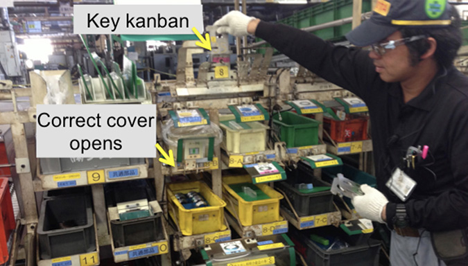
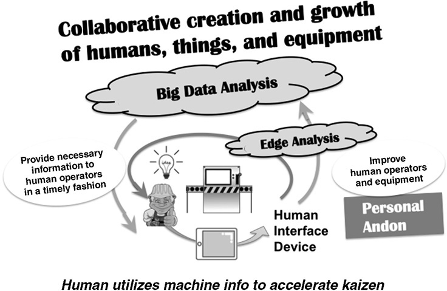
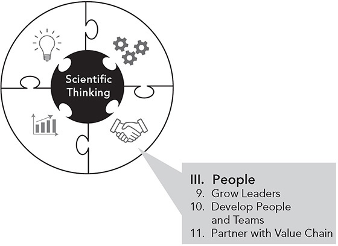

 Principle 8 

**Adopt and Adapt Technology That Supports Your People and Processes**

_Society has reached the point where one can push a button and be immediately deluged with technical and managerial information. This is all very convenient, of course, but if one is not careful there is a danger of losing the ability to think. We must remember that in the end it is the individual human being who must solve the problems._

—Eiji Toyoda, _Creativity, Challenge and Courage_, Toyota Motor Corporation, 1983

In 1991, toward the end of the Japanese bubble economy, Toyota launched the Lexus LS400 with the most advanced automation in the company at its plant in Tahara, Japan. As usual, almost all the paint and welding was automated with robots, but automation was also selectively introduced in the assembly for engine-transmission-suspension installation decking and installation of air conditioner units, batteries, instrument panels, and windshields. Toyota made the automation work and meticulously maintained it at high levels. Quality was among the best in the world. The problem was that when the investment bubble burst, vehicle sales declined, and “the plant was criticized for its high capital investment, which was a high fixed-cost burden for Toyota.”1

Toyota prides itself on only building to actual demand, and when demand declines, the company wants the flexibility to reduce costs to remain profitable. Typically, in downturns, the company reduces labor costs by eliminating overtime, reducing the temporary labor pool, and redeploying people to work on kaizen. But fixed capital cannot be temporarily removed. After the Tahara experience, Toyota raised the hurdle on introducing new automation. Toyota’s principles of production equipment became “simple, slim, and flexible.”

This lesson was painfully learned once again during the Great Recession of 2008\. The pickup truck and large-SUV market tanked, and Toyota lost money as a corporation for the first time in 50 years. Toyota’s reflection: fixed costs were too high leading to high breakeven points. The countermeasure: review every aspect of design and manufacturing and lower the breakeven points of all plants from about 80 to 70 percent of planned capacity. If a plant is running at full capacity and sales drop quickly by 30 percent, the plant should at least break even.

One implication of this could be to go slow and be cautious in adopting new technology. In today’s age of lightning-speed technological change, particularly in the digital world, I believe that would be a mistake. The real message is to _adopt and adapt technology that supports your people and processes_. The starting point is this: where are real needs that technology can address to help achieve your goals? It is a question of pulling the technology based on the opportunity, instead of pushing the technology because it is the latest fad. And streamline processes that can be improved with little investment, before introducing expensive technology. As Bill Gates wisely observed:

_The first rule of any technology used in a business is that automation applied to an efficient operation will magnify the efficiency. The second is that automation applied to an inefficient operation will magnify the inefficiency._

Over the years, Toyota has tended to lag behind its competitors in acquiring the latest technology. Notice that I said “acquiring,” not “using.” Toyota uses an amazing number of robots in painting and welding vehicle bodies. Toyota’s engine and transmission plants are filled with automated machining and forging equipment. Toyota has supercomputers and very advanced computer-aided technology to support product development. The company is investing billions of dollars in artificial intelligence for autonomous vehicles and is building and selling “mobility” robots to help patients in hospitals and the sick or elderly at home. Toyota’s philosophy of automation has remained consistent over time: “Regardless of expansion in research fields, we would keep ‘automation with a human touch’ which have been always cherished by our predecessors of Toyota as the most important elements in technologies, which means the system such as robotics or AI should not replace the human, but always cherish ‘the sense of agency’ of humans.”2

Unfortunately, a great deal of technology acquired by so-called leading-edge companies does not get effectively used. The notion of plug and play may work for hooking up a printer to your laptop, but most computer systems are far more complicated, and there is plenty that can and does go wrong. One example is Tesla’s dive into advanced automation for automotive assembly at the former NUMMI plant in California, which was touted by Elon Musk in a fourth-quarter 2017 investor call as the greatest breakthrough since Henry Ford’s integrated River Rouge complex. The goal was to eliminate all human touching of the product and to produce vehicles at superfast speed.3 Interestingly, even with the “advanced” automation, labor productivity was far worse than when the plant was run by Toyota. A few months later when Musk admitted that the company was in “production hell” and could not meet production goals for the Model 3, Tesla built a second, simpler assembly line under a tent. Musk learned a valuable lesson: “We had this crazy complicated network of conveyor belts. And it was not working. So, we got rid of the whole thing.”4 Musk then tweeted “humans are underrated,” and perhaps had turned the corner in appreciating the value of people.5

This is not to say that technology in the digital age does not fit with lean thinking, or that Elon Musk will never fulfill some version of his advanced manufacturing dreams. To take that perspective would mean putting on blinders and ignoring some of the greatest technological advances of our time. I believe the issue is to avoid the temptation to buy and implement the latest gee-whiz digital tools, and instead to thoughtfully integrate technology with highly developed people and processes. Later in the chapter, we will consider an example from Toyota’s largest supplier, Denso, which has made remarkable progress in adapting real-time data collection, the internet of things (IoT), and data analytics to support lean systems and amplify kaizen. At the center of Denso’s approach are people, and their ability to sense reality and think creatively. Denso demonstrates that technology has the greatest potential with highly developed people who are continuously improving.

**COMPUTERS PROCESS THE INFORMATION. PEOPLE DO THE THINKING**

I have taught plenty of courses on TPS basics like kanban, which is mainly a manual visual process. Information technology specialists immediately want to eliminate the paper kanban and digitize the process. Toyota successfully used paper kanban for many years. It has the advantage that it is tactile and physically travels with the containers of parts so you can see at a glance whether it is present or absent. No kanban and the container should not be moved. On the other hand. Toyota switched some years ago to electronic kanban, though there is also a parallel system of paper kanban to be scanned and disposed of. The point of using various kinds of artifacts is for people to easily visualize whether the process is in or out of standard as they do the work.

The folly of pushing technology became clear to me on a consulting job with an American automotive seating supplier that had worked with Toyota for years and learned TPS. My client’s CEO got hooked on the idea of increasing inventory turns as a major corporate “lean” goal. He gave every business unit an aggressive target for inventory turns, which on the surface seemed to support the TPS principles of eliminating waste. It became a corporate mania.

A large group of “supply chain engineers” within the company was tasked with reducing inventory. The background of the leader of the supply chain group was in information technology, and he wanted to use internet technology to provide “visibility into the supply chain.” There are many supply chain software “solutions” that promise to radically cut inventory and provide control over the process. They supposedly do this by showing anyone who logs into the website how much inventory there is in real time at every stage of the supply chain and to alert users when they are under or over preset inventory ranges.

The CEO’s subordinates were very proud of their bright, well-spoken boss, and they often repeated a story he would tell. He described supply chain visibility software as analogous to a bulldozer. You can dig ditches manually, and it will work. But a bulldozer will do the same thing in a fraction of the time. IT was like this—speeding up dramatically work that was previously done by hand.

I was floored by this belief. How does keeping track of inventory on the computer give you any control over making it go away? From my TPS training, I knew that inventory is generally a symptom of poorly controlled processes. Ultimately, manufacturing is about making things. I talked to the boss and gave him my perspective. I explained that software may monitor inventory very quickly, but real people and machines are producing product based on some logic and, in the process, creating inventory. In fact, “supply chain visibility” is more analogous to setting up a video camera at the worksite and hooking up a remote monitor in another state so you can kick back with your coffee and watch the ditchdiggers work. Nonetheless, he pressed on with the technology.

My perspective was confirmed when we were asked to do a parallel project in one plant without the technology for comparison. Without any information technology, we were able to cut inventory by 80 percent on the assembly line, while the pilot plant using the supply chain software had only a marginal impact. We did this by moving from a push system based on schedules to a manual pull system, using kanban. Lead time was reduced by one-third—with no new technology. To eliminate most of the parts inventory required our working with a supplier in Mexico—owned by the same company—that was pushing as much inventory as it could onto this customer plant so its inventory turns metric would look good. Improving the process is how you get to sustainable inventory control.

**IMPLEMENTING THE LATEST INFORMATION TECHNOLOGY IS NOT A BUSINESS GOAL AT TOYOTA**

Toyota has had a variety of negative experiences with pushing too much automation into processes, as happened in Tahara. One example was an experiment in the 1990s in Toyota’s Chicago Parts Distribution Center, where the company installed a highly automated rotary-rack system. At the time the warehouse was built, Toyota’s dealers placed weekly stock orders for parts. But soon after the warehouse was completed, the company introduced daily ordering and daily deliveries to reduce lead time and lower inventories in the dealerships. With the change to daily deliveries, it expected to fill the now smaller (one-fifth the size) containers faster and speed up the whole process, but this did not happen. Some quick problem solving revealed the root cause. The center still had a long, fixed conveyor installed, and the person at the end of the conveyor had to wait for the smaller boxes of parts. The technology had created a waste of waiting. The benefit of the technology was short-lived, and the Chicago facility became one of Toyota’s least productive warehouses. In 2002, the company again made a significant investment in Chicago, but this time it was to remove the automation and unwind the computer system that supported it. By comparison, Toyota’s most productive regional parts depot was in Cincinnati, where there was very little automation.

Jane Beseda, former general manager and vice president, North American Parts Operations, explained:

_When you live in the logistics world, nothing moves without information. But, we’re conservative in our approach to applying automation. You can kaizen people processes very easily, but it is hard to kaizen a machine. Our processes got far more productive and efficient, but the machine didn’t. So, the machine had to come out._

_First work out the manual process, and then automate it. Try to build into the system as much flexibility as you possibly can so you can continue to kaizen the process as your business changes. And always supplement the system information with “genchi genbutsu,” or “go look, go see.”_

Beseda went on to give an example of the power of a simple visual for pull systems. When you set up a kanban, you specify the maximum level of inventory, above which there is too much, and a minimum level that you do not want to go below. The quantity of inventory depends on a number of factors including the takt and the amount of variability in the customer orders and in the process. More variability means a need for more inventory to protect the next customer from shortages. There are mathematical equations to calculate these amounts based on assumptions and that can be computerized. But Baseda was not interested in complex calculations. Instead, she asked her people in one of the warehouses to come up with some numbers based on clear reasoning and then run the system and watch what happens. They should visually mark how many days the inventory exceeds the maximum or goes below the minimum and then take action when they see a consistent pattern, adding or subtracting kanban and then troubleshooting the reasons for having too little inventory. They found this process of adjustment and problem solving based on real circumstances far more effective than trying to guesstimate based on a math model.

In another interesting experience, I visited a Toyota plant in Japan that did machining of engine parts and I was amazed by a simple _chaku chaku_ line that used a robot instead of a person. The idea of chaku chaku is to have a semi–automated line, usually two banks of machines lined up in parallel, with a person going up and down the line feeding parts into the machines and removing parts from the machines. The machines are designed to automatically spit the parts out when they are done so the person can simply grab them as they go. The person is taught to follow standardized work that uses both hands so the person can be very productive. But what fascinated me was seeing a simple pick-and-place robot doing the work of the human. It was designed and built by Toyota to be inexpensive and simply picked up a completed part with one “hand” and then inserted it into the next machine with the other. My guide explained that it saved on cost and also on space as the machines could be moved very close together with just enough room for the robot. People required more space for safety reasons.

We then walked to another line where there were a lot of people manipulating parts for a similar product. I asked why that was not robotized. My guide explained that there was much more product variety and the parts were more complex. The tasks required more dexterity and adjustment by people. The plant would like to use robots in the future, but the process and perhaps the product had to be greatly simplified through kaizen, which was being done by the production workers. I remember thinking, “One size does not fit all.”

**AUTOMATION AND EQUIPMENT CAN ALSO BE IMPROVED BY CREATIVE, THINKING PEOPLE**

To be honest, my experience with kaizen was mainly limited to the knowledge and manual work people do, and I had not thought about continuously improving highly automated equipment. This changed when I met Mitsuru Kawai, the first person hired into Toyota as a production team member to rise to the position of executive vice president and board member. He joined Toyota in 1966 after graduating from Toyota Technical Skills Academy, a high school. He spent most of his career in Toyota’s Honsha (headquarters) plant where the company machined and forged metal transmission parts. When Kawaii was a member of the production team, Taiichi Ohno took an interest in and personally developed him.

Ohno’s teaching always started with a challenge to accomplish something that seemed impossible. Kawai explained that he had a standing order in the plant for 50 years to increase productivity by 2 percent every _month_. Each month he went back to zero. If one month he achieved a 4 percent increase, he still needed to improve 2 percent the next month. He started when the processes were mostly manual and continued for five decades, by which time the processes were almost completely automated.

Kawai was convinced that the same TPS principles applied to manual or automated work. He explained:

_Materials will be flowing while changing shape at the speed we can sell the product. All else is waste. Operators need to learn how to use the machine and the materials and their five senses to create a good part at a reasonable price. Then intelligent automation can be developed to reduce as much as possible any transportation or movement that does not change the shape or form._

Kawai expected team members to get inside the equipment and redesign it to eliminate waste, but most were hired after everything was automated. He was deeply concerned by the mentality he witnessed that “you push a red button and a part comes out.” Managers, engineers, and production team members needed to develop the following four skills:

 Visualize production.

 Develop explicit knowledge of the process.

 Standardize the knowledge.

 Develop intelligent automation through kaizen.

He did a number of things over the years to develop people. First, people had to get their hands dirty. He required all team members, engineers, and managers to perform the forging and machining jobs manually. Second, Kawai assigned to each equipment operator one piece of equipment, called “my machine.” The job of each operator was to hand-draw in detail everything that happened to the part, second by second, as it was moved, oriented, and transformed. He explained to the managers that they needed to teach the workers and answer any questions they had, fully aware that the managers did not know enough to do this. The managers had to go back to the gemba and study the processes intensively. The learning curve was steep, but defects were reduced exponentially over time to almost zero as the footprint of the equipment shrunk. Third, he created a manual assembly line so that each employee could experience a traditional application of TPS and improve upon it. There was a primitive transmission plant in Brazil in the 1940s that Toyota wanted to close because the volumes were too low for it to be profitable. Ohno had personally visited the plant and proved that TPS could make it profitable. But 75 years later it had run its course and was shut down. Kawai asked to have the transmission assembly line boxed up and moved to his plant in Japan to use for TPS training.

The task assigned to team members was to work on the line and manually assemble a high variety of low-volume models economically, and to do it without electricity. He called it the “TPS basic learning line.” The students received specific assignments for kaizen and learned on the manual line. Then they went to the forging and machining lines to improve the automated processes. Over time, they cut the floor space of what was already an efficient transmission assembly cell in half, while increasing productivity several times over.

There were many innovations born of the challenging objectives on the TPS line with the constraints of using simple, mechanical devices at almost no cost. For example, one of the challenges was to find a way to accurately pick the right parts for a transmission among a large variety of choices manually. With today’s technology, this would be done electronically with light curtains, bar codes, and computers. The bin of the next part to pick would light up, and if a worker tried to pick the wrong part, alarms would go off and lights would blink. How could this be done without computers or electricity?

The students came up with an ingenious device that performed two functions: it acted as a kanban and enabled them to replenish parts at low volume, and it acted as a mistake-proof device. They called it the “key kanban.” A small number of each part was kept on the assembly line. When the production operators used enough parts that they reached a point to trigger replenishment, a rectangular metal kanban (unique for that part) would be used as a key to open the correct bin. The kanban was color-coded and had identifying information that corresponded to a specific bin where those parts were stored. A plastic see-through cover had a picture of the part and the identifying information. You put the key kanban into a slot and pulled down, and it would lift one and only one bin cover—the one for that part (Figure 8.1).

**Figure 8.1** Manual key kanban opens only the cover of the correct part to pick next.

The implication: trash all the new digital tools and go back to the craft days of manual work and simple machines? Not at all. Kawai was developing people so they could be even more effective in running and improving the automated processes.

**WHEN THE TOYOTA WAY MEETS INDUSTRY 4.0**

I am by no means an expert on this, but my understanding is that Industry 4.0 uses software to manage assets through the internet of things: data collection devices (e.g., wireless sensors and high-definition cameras), big data mining to identify patterns, predictive algorithms, and artificial intelligence that can learn. There are many applications. One use of the technology is to monitor machines, predict failures, and in some cases take corrective action by automatically adjusting the machines. Another example is smart robots that can adapt to different conditions and learn, simulating human decision-making and motions.

Without realizing it, I experienced the power of this new technology when practicing golf in February of 2020\. A friend contacted me to try out a driving range that was the first in the area to install new technology that could track swings and provide data on your smartphone. The driving range had installed radar towers spread over the range to collect data in three dimensions. I downloaded the “Trackman” app, went to the range, entered the number of the bay I was hitting out of, entered the golf club I was using, hit a ball, and then watched on my phone the path of the ball, the distance carried in the air, the distance it continued on the ground, and the height. It could adjust the results based on weather conditions at the time. There was even a measure of variability of my shots by club. How cool was that?

I could then look back and ask questions like “How far do I hit each club on average?” “Which clubs are more reliable?” “Should I use a lesser-distance club in some cases to get the increased reliability?” The key was the data collectors (radar), the connection to the internet to process the data, the analysis of the data, the connection to my phone through the internet, and the application software.

Later I thought some more about this technology and its power. I really enjoyed using it, and it enhanced my overall experience at the driving range, like playing a video game, but did I learn more? The goal of going to the driving range is to practice and get better. Did it aid my practice and skill level? It seemed like a yes in theory, but maybe was a no in reality. It could help if I used it as part of a good regimen of deliberate practice. That meant I had to go beyond just hitting balls and watching on my cell phone what happened. I had to have specific skills I was working toward, a standard for what I wanted my swing to be like, and for each swing of the club I needed to note deviations from the standard and then think of and practice a countermeasure to those deviations. Otherwise it was just fun (not a bad thing). The technology plus the human discipline of deliberate practice could add up to something.

What I saw at Denso was a lot like this technology at the driving range, though on a larger scale and more sophisticated. Denso’s culture included the discipline of developing people to think and solve problems based on the gap between the standards and actual conditions, which when combined with IoT, was a very powerful combination.

**ELECTRONIC WALLPAPER?\***

When I first joined the University of Michigan in 1982, the “factory of the future” was all the rage. I studied the “social impacts” of computer-integrated manufacturing (CIM), which was predicted to disrupt industry, potentially putting millions of workers out of a job. Design something on the computer, create a digital database, upload it to automatic machine tools, and out comes the product. The media was abuzz with this disruptive technology, so I was shocked to learn that at that time it was mostly a myth, and there were far more failures than successes. A group of us studied a small company, a maker of bearings for material handling systems, that advertised itself as an early adopter of CIM. It installed new computerized equipment and displaced the operators of the old equipment; but when the new system failed, it had to put back into use the old equipment and hire back the displaced operators to keep production running.6 Eventually the company went bankrupt. We wrote an article, “Changing Everything All at Once,” and documented why everything turned out so badly. Basically, they were ambitious early adopters, but rushed unproven technology into operation prematurely. Given that experience, I was skeptical when I started hearing all the buzz about Industry 4.0\. Meeting Raja Shembekar at Denso both reinforced my skepticism and began to persuade me that this advanced digital technology was the missing piece from those early efforts at computerized manufacturing.

Raja Shembekar, vice president of Denso’s North American Production Innovation Center, became the chief architect of Denso’s use of IoT. He worked for Ford for 12 years, where he learned the basics of automotive design and manufacture, and then he joined Denso in 2004, learning the culture and system and spending two years in Japan in production engineering. When he was back in the United States in 2012, he had an aha moment when he sensed how far the U.S. was ahead of Japan in modern software, particularly in the budding technologies of the internet of things and artificial intelligence. He was determined to bring these technologies to Denso. At the time, he believed Denso was far behind and needed to quickly catch up, so he set out to hire an IoT vendor. Raja explained:

_Back in 2017 we made many site visits. They showed us great PowerPointTM presentations and they said we can do this, we can do this. And at that point we really thought we were way behind compared to the rest of US industry. So we talked with five different companies, did actual trials with them, and set up their software inhouse._

Much like what my research group experienced in the 1980s with the “factory of the future,” when Raja and his team delved deeper into supposed Industry 4.0 benchmark companies, he was shocked to learn how little they had done. There was a lot of fanfare and wonderful displays of data, but almost no action to solve real problems. He lamented:

_We learned a lot but quickly realized that if you go to plants and they show you a lot of monitors and dashboards—I call it electronic wallpaper—unless you show me what action you took from that real time data, and that the data is true data, it is just electronic wallpaper. I visited more than a dozen plants in large prominent companies and many of them had good activities, but they were not fully integrated and those who showed a lot of dashboards, when we started digging deeper into it, we found not much action being taken._

He visited a plant of another major automotive supplier that was receiving a great deal of attention as a best-practice case of IoT use. The supplier had beautiful data displays with lots of bar charts. He looked at one monitor that was measuring overall equipment effectiveness to gauge uptime of equipment. The numbers on the display for one line said the equipment was running at 135 percent. Raja was surprised by the number and asked if it was accurate. He was told, “No, that’s not really true on that line because the software has not been adjusted for the issues we had today.” Raja thought, “What would the associates think if they see 135 percent when they know they are not achieving the target output for the day?”

He also found that the software was designed by technology specialists with no understanding of real manufacturing and was often not adaptable to real-world circumstances. An example Raja encountered when checking out possible software vendors:

_We did proof of concept with 2 companies, one from Germany and 170one from the US. Let’s say your shift starts at 8am and they plug that into the software. At 8 it starts to monitor the productivity of your line. But let’s say that we have a message from the team leader on some safety issue or something so the line starts at 8:07\. Our associates should not be held accountable for this 7 minutes of lost production because management decided to postpone the start for a different reason. Believe it or not, you would think it would be easy, but they could not easily adjust the software so a team leader can go in and say we started at 8:07._

**IOT APPLICATIONS AT DENSO, BATTLE CREEK**

When I visited in February 2020, many IoT applications were live and working at Denso’s testing ground factory in Battle Creek, Michigan. In the hallway entering the plant was a large screen with a map showing various zones. All the zones were green in our winter visit, which meant they were fine on wet-bulb heat-stress indexes. If the temperature is above 95.5°F, associates must legally take a 15-minute break each 4 hours. In the past, people would walk through the plant checking temperatures and calculating an average temperature. If the average temperature was above target, the entire plant would shut down for 15 minutes. Now, continuous data collection by zone will in real time reveal one or more zones going over the limit, and only those zones will be immediately shut down, saving production and wasted labor.

In another area, we saw dashboards based on live data that continuously updated safety, quality, cost, and lead-time measures. If there were official quality claims, the display would show where it happened, what happened, and what countermeasures were taken. If no action was taken within 20 minutes, the problem automatically escalated.

At one workstation, the operator watched a screen that in real time created a quality process control chart with upper and lower control limits. Just glancing at the screen at the time, it was clear that the process had very recently gone out of control, and the operator had seen it, acted, and got it back in control.

One of the biggest successes was the use of predictive maintenance for brazing ovens that are part of the process for making aluminum heat exchangers. The ovens are large and long, and each one has 12 expensive fans that are about the size of a round dinner table and provide a controlled atmosphere for circulation to keep a specific temperature constant through the oven. If a single fan stops, the oven must be brought down, and at almost 1300°F, it takes 12 hours to cool it down, 12 hours to replace the fan, and 12 hours to bring it back up. Each time the fan stops, the plant loses 36 hours of production and 30,000 pieces a day. In addition, 60 people are idled by the production stoppage. There were four to six unexpected stops per year at a cost of about $70,000 to $80,000 each time.

Denso hired a vendor that attached a sophisticated wireless sensor to each fan motor that monitors harmonics in two dimensions (since the fans operate on a dual axis), temperature, and fan speed—and the data are analyzed by predictive analytics software. The software is smart enough to predict not just that a fan is going to fail, but in some cases the cause; for example, the bearing is hot. In one case, Denso data scientists reported to maintenance that a fan was going to fail in 58 hours and that the maintenance people should replace it. Raja explained:

_Maintenance did not believe it. But we asked them to change it anyway. They took the fan out. Half the blades on the fan had disintegrated. They were totally shocked that they had no idea this was happening and we could provide that prediction. They became much more accepting of the new technology._

**HOW DID DENSO MAKE IT WORK?**

After benchmarking presumed leaders in Industry 4.0, it became clear to Raja that Denso had to take control of the technology internally and selectively work with outside vendors with particular expertise. The company needed to do what had been hammered into his head since he joined Denso—solve real problems and take action. It also needed to build consensus around the technology at all levels, and particularly among those people on the production floor who were responsible for production work and maintenance.

**Develop Internal Expertise to Develop and Customize Software**

Raja assembled a cross-functional team of about 10 programmers at the Battle Creek plant to lead the effort for North America. About half were hired from outside with specific IoT expertise, and about half were internal with extensive manufacturing experience. Three had quality auditor experience, so they knew the problems Denso had in production. North America IoT manager Chad Orbeck had over 26 years of experience, including running a production line. Raja explained:

_They are really good at software but they are engrained for over 20 years in how production is to be run the TPS way. That is why I think Denso has been far more successful than any of the companies that I have benchmarked in the US. They could develop software 172that they knew would work because they knew what the issues would be._ 

His team even developed the software used to move the data between systems. One of the keys for transforming a company that has many legacy systems is to allow those systems to share data seamlessly. Raja continued:

_The User Interface is easy to do but getting that data from different legacy systems requires an effective API \[Application Programming Interface\] so they could pull in the data. The vendors we benchmarked were not able to create good interoperability with our legacy systems. Only our guys could do it because they were the ones that had built the legacy systems. And they learned the new systems so they were able to make the APIs work._ 

For big data, Raja hired two data analysts who had expertise in analyzing large data sets. They collaborated with team members on the shop floor and with outside software companies on real projects at the gemba. They began to get great results. At one point, one of their customers, a large American automotive manufacturer, heard about what they were doing and brought a group of people to benchmark their use of data analytics. The customer had made a major investment hiring 50 data analysts. Raja asked one of the group members what the group was working on and described how disappointed he was at the visitor’s answer:

_He laughed and he said, “Not much. We just collect a bunch of data.” So 6 months later we were keeping in touch and I showed him some of the examples we are doing with the data scientists, people actually use it, and he was shocked, saying, “You only have 2 people and you already have working examples?”_

**Collaborating with a Startup for Motion Technology**

Another key to Denso’s success has been networking and collaboration. One example was the discovery of a company that developed technology that digitizes human motion and provides real-time data about standardized work. Denso found out about this through a contact at the Stanford Research Institute.

The company is Drishti Technologies, and it was founded by Dr. Prasad Akella. Dr. Akella started with the belief that technology should augment people, not displace them. He partnered with A.T. Kearney who surveyed 100 large manufacturing companies and found that human employees performed 72 percent of factory tasks. He then asked the question: What happens when you combine the creativity and adaptability of people with the cognitive power of AI? The advantage of people is our flexibility and ingenuity. The disadvantage is our variability.

 Standardized work is a way to reduce that variability. What if AI could analyze video data, recognize cycles of work, recognize work elements, and alert workers immediately when there is a deviation from standard? It would be like an automatic andon giving the worker in real time feedback on their work. Did they skip a step? Did they grab the wrong part? Did they exceed the timing for the work cycle? Immediate feedback leads to rapid learning.

Drishti’s technology has multiple cameras continuously recording work from different angles and storing the data in the cloud and then a proprietary AI system based on neural networks analyzes the video data and identifies times over the planned cycle time, finds bottlenecks, and even generates work balance charts. It also brings traceability to a whole new level. Your customer calls about a defective product they received. You call it up by serial number and you can watch the part being built and look at the data generated by the AI. Root cause analysis is now a real possibility rather than a guessing game.

When Raja visited it was clear that Dr. Akella had experience with manufacturing, but no in-depth training in TPS. Raja and his team taught Dr. Akella and his team about lean systems, and after one year of intensive collaboration, they created something that just may revolutionize standardized work.7 Raja explains how this breakthrough technology works:

_There is a camera focused on each associate on a manual assembly line. Videos record action in real time, send the data to the Google cloud where analysis is done using AI, and report back within 2 seconds and it tells the person whether they did the action in the right sequence. Before we had this technology for real time analysis you would have to have video cameras mounted and someone would have to go through it manually taking many hours. This technology digitizes the human motion and provides bottleneck analytics. It is a global first. It covers many of the technical TPS tools including standardized work, not passing defects to the next process, having a pace setter, and achieving the cycle time at each station and reports it back instantly. We’ve eliminated hand-written hour-by-hour charts. This system recognizes every part by human action and sees how many parts are done. And it tells me where I am against takt. It produces yamazumi \[work balance\] charts that break down the work elements for each of the functions. The analyst can extract data for any time period and go back to look at videos of interest, across associates, shifts, and at the bottleneck, so it really is a revolution in TPS._ 

Perhaps it is no surprise that Drishti has found that the AI system is most useful for customers like Denso and Toyota that already have strong lean systems. Toyota department general manager Akiharu Engo refers to the total system as “TPS+AI,” suggesting that the two go hand in hand. For example, the AI is useful when the factory has achieved some level of standardized work that is stable and being used effectively. This depends on a smooth flow of work that depends on all the technical TPS factors in Principles 2 to 7 working together. Visualization continues to be important. Drishti uses a tablet computer hung in front of the operator that shows each step as it is being performed, and it is red if there is a deviation. The role of the technology is alerting people to issues so they can quickly respond with creative problem solving, and as we will learn under Principle 10, lean companies are organized around work groups with members trained in problem solving. Undergirding the system of people and technology is a culture built on mutual trust. The worst situation is when management and workers fight over performance standards and team members believe the AI system is a management attempt to control them and speed up production.

**DOES THE TECHNOLOGY DESKILL, REPLACE, OR ENHANCE?**

The answer is, it depends on management philosophy. Recall the discussion in the Preface about mechanistic and organic approaches. From a mechanistic perspective, the value of technology is clear—replace people, monitor those remaining, and control them with clear instructions on what to do. Implement the technology quickly and broadly to remove the unpredictable human element.

From an organic systems perspective, the value of the technology is very different. When combined with the ingenuity of highly developed people motivated toward the goals of serving the customer and helping the company, it can multiply kaizen—faster and better.

Raja made it clear what side of the fence he was on. Denso’s focus was not on using the technology to eliminate people, though he had no doubt that over time there would be a need for fewer people in the factory. While there would be cases where a closed-loop technical system diagnosed and automatically corrected problems, there would be plenty of issues that required human ingenuity and intervention. In fact, Raja became convinced that the skill requirements of the people need to grow:

_We will always need people, but their skill level needs to be completely shifted over time. The technology provides data that allows the associate and the team leaders at the gemba to provide a far higher level of decision-making. In the past they would just fill out the paperwork, but by the time they did all that, they had either no time or no energy to really comprehend the data. If they want to see trends from say five days ago or across people, that just wasn’t 175there. What this has provided is what we now call fast PDCA. We can’t afford to have PDCA that takes three weeks anymore. We want a PDCA done before the end of that shift._

Raja gave an example from the technology to predict failures of fans:

_I was able to tell there was a problem with the fan faster and better than the guy with 26 years of experience. Before, he would connect an ultrasonic device and listen and say this vibration is kind of bad. Now, he is looking at time-series data, a Fourier series. Imagine his shift in knowledge from just listening to really understanding an amplitude frequency curve. So you have shifted his skill level significantly up the curve—kind of like a low-level engineer. People will still be there but at that level._ 

At Denso in Japan, executives and engineers also explained that IoT is not intended to cut people out of the loop, but actually provides superior information to people about the process (see Figure 8.2). The power of big data and artificial intelligence is to give the operator information just in time that they previously could only guess at. But Denso then expects the operator to use that information creatively to find the root cause and solve the problem through kaizen. Denso calls this “collaborative creation and growth of humans, things, and equipment.” One irony might come out of this. Historically, a major role of industrial engineers was to reduce the number of workers needed. Now, the technology might enable the workers to the point where they can eliminate the industrial engineers.

**Figure 8.2** Denso depiction of the internet of things supporting people.

**BALANCING THE RUSH FOR THE LATEST TECHNOLOGY WITH EFFECTIVENESS**

Toyota is a technologically advanced company and has been for decades—shut down its computer systems, and you shut down the company. Now Toyota is putting super computers into its vehicles. But Toyota is not interested in being trendy and making adoption of new technology an end unto itself. Just as Toyota refuses to schedule parts made in one department to be pushed onto another department, Toyota refuses to allow an information technology department or advanced manufacturing technology department to push technology onto departments that do the value-added work of designing and building cars. Any information technology must meet the acid test of supporting people and processes and prove it adds value before it is implemented broadly. And then the ownership for introducing the new technology falls on existing management. Managers are responsible for its operation and for meeting targets, and so they should lead the introduction.

Toyota is willing to spend several years to first pilot the technology in one plant (like Battle Creek) and then spread it globally plant by plant, even though it could get the payback quickly if it were introduced everywhere in the first year led by corporate experts. Each introduction in a new plant is a learning experience to build on for the next plant, and each plant introduction is an opportunity to develop local managers and engineers in that plant to maintain and improve the technology.

The problem as I see it is that people living in the computer software world seem to believe if they can do a demonstration based on a digital simulation, it should translate seamlessly into solving real problems in the outside material world. That is the thinking that got companies in trouble back in the 1980s. And it was the situation that Raja of Denso encountered in the twenty-first century when he was exploring Industry 4.0 software. I was skeptical before talking to Raja about the bold concept of a fully automated factory with everything run by internet connections, big data, and AI—and Raja confirmed my suspicions that it could be a lot of smoke and mirrors. On the other hand, I also was awakened to the strength of the technology. I am still skeptical that completely computerized lights-out factories without people will be practical, but the capability of the technology with AI and the internet is far beyond anything possible in the 1980s. It seems people were not completely wrong about the potential, but just early.

It also became clear in seeing what Raja has been doing at Denso’s plant in Battle Creek that Industry 4.0 is not a disruptive force that makes TPS irrelevant, but rather can be an enabler that builds on TPS culture and thinking. After all, the internet of things necessarily includes things. And if the things are poorly designed, poorly laid out, and poorly maintained, software will not solve the problem.

The difference between Denso and the companies that are creating electronic wallpaper seems to be a matter of mindset. Denso starts with the problem and then builds the social and technical systems to help address the problem. It builds on its existing culture of disciplined execution and problem solving. As we discuss scientific thinking under Principle 12, think back to the systematic approach Denso is taking. Without this, companies are left to throwing the technology at the wall and hoping it sticks. The principles of TPS will not disappear from a company like Denso, but the way the factory operates under TPS + IoT will be very different.

I was fascinated by the IoT technologies I saw at Denso, but in the back of my mind I could not help but guess at what Mr. Kawai would think. He was deeply concerned in his highly automated factory that people were not thinking critically. They were happy to push a button and wait for the part to pop out. So he forced them to dig deep to understand the automated process at a very granular level and then improve it. When computers begin to do the thinking, will people abdicate responsibility? A lot of data are coming out of these systems, and with analytics and AI, even some conclusions. But these systems are still primitive compared with the human brain, and they are not creative. How can we marry the powerful information coming out of the computers with the creativity of people in developing and testing ideas for improvement?

Akio Toyoda seems to have similar thoughts. In a speech he said:

_Two concepts—automation with people and Just-in-Time—are the pillars of the TPS. What both have in common is that people are at the center. I believe that the more automation advances, the more the ability of the people using it will be put to the test. Machines cannot improve unless people do, too. Developing people with skills that can equal machines and senses that surpass sensors is a fundamental part of Toyota’s approach.8_

 KEY POINTS 

 Toyota has had bad experiences loading up plants with automated equipment only to find in a business downturn that the company had too much money tied up in fixed capital costs.

 After several such experiences, including in the Great Recession, the mantra became “simple, slim, and flexible,” with the right balance of people and automation.

 Kaizen does not end with automation, but rather continuous improvement of automated equipment can help organizations move closer to the lean vision of one-piece flow without interruption.

 The internet of things has the potential to build on TPS principles and take operations to a whole new level of performance, with people being fed real-time and continuous information to accelerate and amplify kaizen.

 People in Toyota are still viewed as master craftsworkers who use all their senses to understand the state of the process and can perform even automated processes manually.

**Notes**

1\. Takahiro Fujimoto, _The Evolution of a Manufacturing System at Toyota_ (New York: Oxford University Press, 1999).

2\. https://www.toyota-global.com/innovation/partner\_robot/index.html.

3\. Joann Muller, “Musk Thinks Tesla Will School Toyota on Lean Manufacturing; Fixing Model 3 Launch Would Be a Start,” _Forbes_, February 16, 2018.

4\. http://www.businessinsider.com/elon-musk-says-model-3-production-using-to-many-robots-2018-4.

5\. https://techcrunch.com/2018/04/13/elon-musk-says-humans-are-underrated-calls-teslas-excessive-automation-a-mistake/.

6\. Jeffrey Liker, David Roitman, and Ethel Roskies, “Changing Everything All at Once: Work Life and Technological Change,” _Sloan Management Review_, 1987, vol. 28, no. 4, pp. 29–48.

7\. https://www.prnewswire.com/news-releases/denso-and-drishti-bring-innovation-to-the-production-floor-with-ai-based-action-recognition-technology-301003329.html.

8\. Akio Toyoda speech, December 2019, https://global.toyota/en/company/messages-from-executives/details/.

\_\_\_\_\_\_\_\_\_\_\_\_\_\_\_\_\_\_\_\_\_\_\_\_\_\_\_\_

\* The term “electronic wallpaper” was coined by Dave Grimmer, who was SVP of Denso’s North American Production Innovation Center when he noticed the gap between data displays and use.

 **PART THREE** 

**PEOPLE**

_Respect, Challenge, and Grow Your People and Partners Toward a Vision of Excellence_

