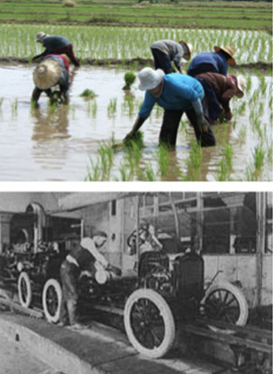
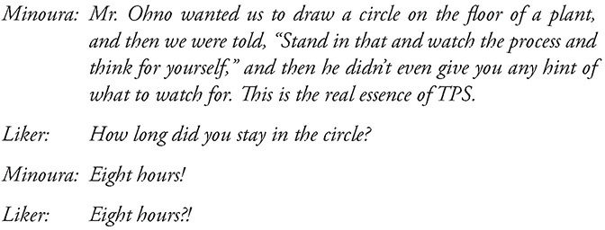
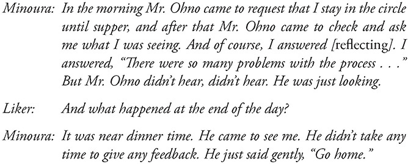
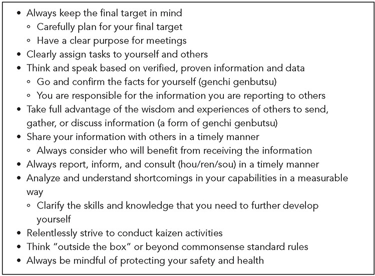
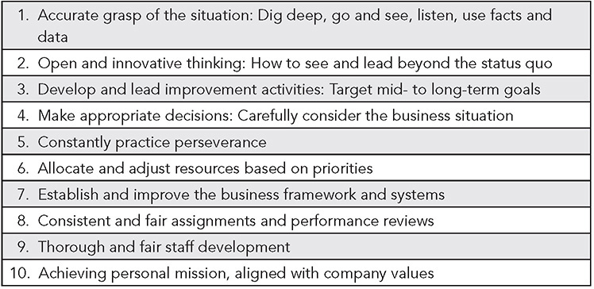

 Principle 9 

**Grow Leaders Who Thoroughly Understand the Work, Live the Philosophy, and Teach It to Others**

_There is no magic method. Rather, a Total Management System is needed, that develops human capability to its fullest capacity to best enhance creativity and fruitfulness, to utilize facilities and machines well, and to eliminate all waste._

—Nampachi Hayashi, Ohno disciple, Toyota Motor Manufacturing

**GROWING HUMBLE LEADERS FROM WITHIN**

The _Automotive News_ wraps up each year by recognizing the biggest newsmakers in the industry. Some time ago, the Newsmakers of 20021 included Bill Ford (CEO of Ford), Robert Lutz (GM executive vice president), Dieter Zetsche (Chrysler Group president), Carlos Ghosn (Nissan president), and Fujio Cho (president of Toyota). The contrast in accomplishments between Cho and several of the other recognized leaders revealed differences in culture across companies. Here is what _Automotive News_ admired about each leader:

_**Bill Ford** (Ford CEO): Talks up revitalization, brings back Allan Gilmour, promotes David Thursfield, and stars in TV commercials. But it’s tough out there. Ford Motor stock remains mired in the $10 range._

_**Robert Lutz** (GM executive VP): At 70, former Marine pilot inspires GM’s troops and revolutionizes (and simplifies) product development, giving car guys and designers a bigger voice._

_**Dieter Zetsche** (Chrysler Group president): Turns the Chrysler group around a year early with three quarters in the black._

_**Carlos Ghosn** (Nissan president): Perennial newsmaker produces more incredible results at Nissan. U.S. market share moves up again. Ghosn truly deserves to be called the “Mailman.” He delivers._

_**Fujio Cho** (Toyota president): Toyota president presides over rise in operating profit to industry record. Takes lead on hybrids. Grabs 10 points of U.S. market. Joins with Peugeot for plants in Eastern Europe._

All of the non-Toyota leaders made a positive impact on their companies, at least for some time, until they didn’t. They were brought in from outside to turn around ailing companies. They each, in turn, brought in a group of their own handpicked, outside lieutenants to help in the turnaround. They also reorganized the company and brought their own philosophy and approach to transform it. Bill Ford, a Ford employee and family member, is the exception. However, he was appointed largely on a temporary basis to get the company out of trouble; his biggest accomplishment was hiring wizard CEO Alan Mulally from Boeing as his successor. None of these non-Toyota leaders naturally progressed through promotions to become presidents and CEOs at their companies. They abruptly came in from the outside to shake up the culture and to reform the direction of a company that was going bad.

In fact, it seems the typical US company regularly alternates between the extremes of stunning success and borderline bankruptcy. This roller-coaster ride is exciting, and for a time, it’s great. Then, when something suddenly goes wrong, the organization turns to a new CEO preaching a very different direction. It is business leadership like the hare in the fable, running madly and then going to sleep—an erratic pattern that leads to uneven results.

In contrast, Cho grew up in Toyota and was a student of Taiichi Ohno. He helped provide a theoretical basis for the Toyota Production System (TPS) and presided over the introduction of _The Toyota Way 2001_ to strengthen the culture in overseas operations. Cho was the first president of the Kentucky plants, Toyota’s first wholly owned engine and assembly plants in the United States. He was a board member and became president when the company was already successful. He moved into the position naturally and built on the momentum that had been ongoing for decades. At Toyota, the new president does not need to come in and take charge to move the company in a radically new direction or put his imprint on the company. The leadership role of Cho focused more on continuity than change. Perhaps like its vehicles, Toyota leaders are not always exciting, but they are highly effective.

Even when Toyota promoted someone from an unusual part of the company to lead a shift in strategic direction, there was never a sudden change of culture. Think of this as eliminating muri (unevenness) at the executive level. It seems that throughout Toyota’s history, key leaders were found within the company, at the right time, to shape the next step in Toyota’s evolution. That’s been true across the enterprise—in sales, product development, manufacturing, and design.

The first non-Toyoda family member to take the reins in decades, Hiroshi Okuda, became president at a time when Toyota needed to globalize more aggressively. He ruffled some feathers along the way. He pushed forward the development of the Prius, which launched the company into the twenty-first century. After this aggressive period, Fujio Cho, in a calmer, quieter way, continued the globalization of Toyota, building on his experiences in the United States and focusing on reenergizing the internal Toyota Way culture. Despite major differences in personal style, neither of these leaders deviated from the basic philosophies of the Toyota Way.

Eventually Akio Toyoda, grandson of Kiichiro Toyoda, was appointed president. Akio Toyoda explained to me that he did not get a free ride, but had to start at the bottom, working in a boot camp–like environment in the Operations Management Consulting Division. He was challenged to meet a seemingly impossible target in a department of a supplier plant. Like Ohno, his sensei was demanding and punishing. Akio Toyoda struggled, but succeeded in meeting the challenge. The biggest challenge he had to face as president was to position the company for what he proclaimed would be a “once-in-a-century” industry disruption as a result of digital technology and electrification. Along the way he had to deal with crisis after crisis. When asked what he learned, Akio Toyoda emphasized calm and stability, rather than a knee-jerk reaction:2

_The number one thing I have learned and that I am prioritizing from my learning is that I am not panicking. I am managing the company very efficiently and stably. In managing the company during these past 10 years, no years were peaceful. Every year, year on year, we have witnessed and experienced a large, drastic change on the scale of a one-in-a-100-year event. So, I think that the calmer I am, the calmer things are within the company._

Toyota does not go shopping for “superstar” CEOs and presidents because its leaders must live and thoroughly understand the Toyota culture. Since a critical element of the culture is genchi genbutsu, which means deeply observing the actual situation in detail, leaders must demonstrate this ability and understand how work gets done at the front lines of Toyota. According to the Toyota Way, a superficial impression of the current situation in any division of Toyota will lead to ineffective decision-making and leadership. Toyota also expects its leaders to teach their subordinates the Toyota Way, which means they must first understand and live the philosophy. In his first speech as president, Akio Toyoda vowed to be the most active president at the gemba in Toyota history. He explained:

_“Genchi genbutsu” \[go and see the actual situation\] means imagining what you are observing is your own job, rather than somebody else’s problem, and making efforts to improve it. Job titles are unimportant. In the end, the people who know the gemba \[where the actual work is done\] are the most respected._

The vision for a Toyota leader is well summarized in the _Toyota Way 2001_: lead continuous improvement while treating people with respect. Respect starts with treating people fairly and as part of the team, but goes beyond that to challenging people to grow.

**GROWING “LEVEL 5 LEADERS” INSTEAD OF PURCHASING LEVEL 4 LEADERS**

I often contrast Toyota to Western companies. If you asked me to describe the common view of the ideal CEO in the United States, I would say we value the rugged individualist who is charismatic and articulates loudly a bold vision for the company, then gets the right executives on board, who either make the vision happen or are pushed out—swim or sink. Since our CEOs tend to be portable, they take some recipe that worked for them in the past and impose it on whatever new companies they take over. CEOs that come from the outside to turn around a company are brought in because the company is not performing to expectations, so the new CEOs are likely to talk about a “broken culture” and how they will install their new performance culture. Often, this includes bringing in consultants they have used in the past to build the leadership team and help drive the new culture.

When I first read Jim Collins’ book _Good to Great_,3 I was shocked by his hierarchy of five leadership levels. What I thought of as Western leaders (which I described above) corresponded to his “level 4” leaders, who run companies adequately over time. But every one of the 11 Western “great companies” had what he called “level 5” leaders, who resembled what I observed at Toyota. It provided some validation that what I observed at Toyota was not unique to one Japanese company. His 11 great companies experienced exceptional growth and superior stock market performance, when compared with 11 average competitors and 6 “unsustained” companies that temporarily appeared great but then declined. The level 5 leaders’ characteristics included:4

 Intense professional will, yet personal humility

 Understated, yet fearless

 Transformational leaders

 Dedicated their lives to building an enduring and great company

 Selected the best people for jobs, even bypassing family members of the founders

 Founded the company or grew the organization from within

 Looked in the mirror and assigned self-blame, looked out the window to assign credit

 Obsessive about knowing their business in detail

 Brutally honest about reality, even when it is bad news

One example of a level 5 leader was Darwin E. Smith, a relatively unknown CEO. He led the transformation of Kimberly-Clark from a struggling paper company that experienced a 36 percent drop in its stock price into the leading consumer paper products company in the world. Under Smith, cumulative stock returns over the next 20 years were 4.1 times greater than for the general market. Smith had been a mild-mannered in-house lawyer for the company, an unlikely choice for CEO. Collins described Smith’s level 5 leader characteristics as:

_People generally assume that transforming companies from good to great requires larger-than-life leaders—big personalities like Iacocca, Dunlap, Welch, and Gault, who make headlines and become celebrities. Compared with those CEOs, Darwin Smith seems to have come from Mars. Shy, unpretentious, even awkward, Smith shunned attention.5_

How successful were these bold, outspoken CEOs that we treated as celebrities? They were usually one-step-down, level 4 leaders, who could be effective to a degree and “catalyze commitment to and vigorous pursuit of a clear and compelling vision and stimulate the group to high standards.”6 But they were leaders of the mediocre companies, and their main goal was splashy short-term results, with most seeing the job as a stepping-stone to their next gig. More than two-thirds of the not-so-great companies had level 4 leaders “with a gargantuan ego that contributed to the demise or continued mediocrity of their company.” Collins concludes:

_The moment a leader allows himself to become the primary reality people worry about, rather than reality being the primary reality, you have a recipe for mediocrity, or worse. This is one of the key reasons why less charismatic leaders often produce better long-term results than their more charismatic counterparts.7_

**LEADERSHIP AND CULTURE**

Every new “level 4” CEO of a struggling company I have met loves to talk about culture change. I hear statements like:

 “This company culture lacked discipline, and I am going to build a culture of disciplined execution.”

 “This company became like a luxury resort where underperforming managers could hang out. Those people are gone, and in my culture every manager will earn their keep.”

 “Here is my new organizational chart where I have product divisions with their own profit and loss. Every tub must stand on its own bottom.”

 “This company was a culture of I, and _I_ am making it a culture of we.” (The term “I” appears often in their proclamations, even when talking about teamwork.)

These kinds of statements make me doubt that these CEOs really understand culture or what real culture change entails. They do succeed in disrupting the business and scaring legacy executives into leaving or conforming, but is management by fear building a new culture? Edgar Schein, one of the gurus of culture, defines “culture” as “a pattern of shared basic assumptions learned by a group as it solved its problems of external adaptation and internal integration. . . . A product of joint learning.”8

Creating broadly and deeply held “shared basic assumptions learned by a group” takes time. Think a decade or more, not a month or a year. Changing the culture each time a new leader takes over usually means jerking the company about superficially, without developing depth or loyalty from the employees. The “shared” part is missing, which is the very definition of culture. The problem with an outsider leading radical shifts in the culture is that the organization will never learn—it loses the ability to build on achievements, mistakes, or enduring principles. This affects the ability of leaders to make effective changes. On the other hand, in Deming’s terms, Toyota strives for “constancy of purpose” throughout the organization, which lays the groundwork for consistent and positive leadership as well as an environment for learning.

More broadly, Toyota’s longstanding culture seems like an amalgamation of many influences, as summarized in Figure 9.1\. Japan is known as a society built on people working together and, at least publicly, acting very politely toward each other. Mutual dependence, an obligation to help others, and the determination to reach a goal together are all basic assumptions of Japanese life. One study argues that this aspect of Japanese culture derives in large part from rice farming, which requires a high level of cooperation, interconnectedness, and holistic thinking compared with wheat farming in the West, which can be done independently.9 The theme of passionate commitment to a cause is characteristic of the samurai who spent a lifetime mastering fighting skills to protect their ruler or die trying. The more reflective mindfulness and deep study of the gemba brings to mind the state of Zen.

• Group identity as rice farmers in Japan

• Samurai tradition: Honor and the leader as protector

• Zen: Empty one’s mind and use senses for new insight; mindfulness

• Confucius: Respect elders’ wisdom; develop others; contribute to society; rules, and structure

• Deming: Most problems are “management” issues; build in quality; PDCA

• Toyoda family: Strive to contribute (looms); follow Toyota precepts

• Henry Ford: Pragmatism; fairness to working class; integrated flow

**Figure 9.1** Some of Toyota’s cultural roots. (Information derived from personal discussions with Dan Prock, PhD.)

The commitment to hierarchy, respect for the wisdom of elders, importance of following standards, and obligation of elders to actively develop younger people are tenets preached by Confucius. Dr. W. Edwards Deming had a profound impact on Toyota in many ways, but one thing in particular stands out: a deep belief that most problems are system problems that are the responsibility of management. Toyota leaders are taught that team members are rarely to blame for an error, but rather there is usually something about the system that allowed the error to occur. Henry Ford introduced many of the core tenets of TPS in _Today and Tomorrow_,10 and then, of course, there are the cultural roots from the company founders.

I have come to think of leadership and culture as so intertwined that one cannot exist without the other. It is leaders who model the cultural norms and values and encourage adoption of the deeply held beliefs by others through their consistent example. Just as consistency between parents is key to raising children to become healthy adults, consistency across leaders and over time is key to building a healthy organizational culture.

Toyota recognized the difficulty of building a culture when it was launching its joint venture plant with General Motors in 1984\. For Toyota, the point of NUMMI was to experiment and learn how to bring TPS culture overseas. For several years, many Toyota people from Japan moved to the United States and taught the Americans, studied what was happening, and called into Japan each evening to discuss what they had observed and learned. It was almost like a research institute of applied anthropologists set up to study some newly discovered tribe, though in this case the Japanese leaders were active participants in creating the phenomenon. The long-term goal was to develop American leaders to the point where they could run North American operations as self-sufficient regional entities that adapted locally but still lived the basic precepts of Toyota culture.

**CASE EXAMPLE: DEVELOPING THE FIRST AMERICAN PRESIDENT OF TOYOTA MOTOR MANUFACTURING IN KENTUCKY**

When Toyota set up its joint venture plant, NUMMI, and then its Kentucky plant, it needed a president who could model and teach the Toyota Way, which at first meant a Japanese executive. There were armies of expatriate Toyota “executive coordinators” and “trainers” from Japan mentoring American leaders. So it was big news when Gary Convis was hired away from running NUMMI and named the first American president of Toyota Motor Manufacturing in Kentucky in 1999\. His selection for this critical position—leading Toyota’s largest manufacturing complex outside Japan—represented a coming of age for Toyota in the United States. It took Toyota executives about 15 years to develop Convis into someone they could trust to carry the banner of the Toyota Way, but the result was a true Toyota leader. Yet despite all these years of development, Convis was not hired in as president immediately, but rather he was named executive vice president and was expected to earn his way to the higher position. For the first six months, Toyota retained the Japanese president, while Convis prepared to take over the position. He visited all Toyota North American sites, worked in each department in the plant, and led kaizen activities.

Even when Convis became president of the Kentucky facility, he was as upbeat, energized, and humble about learning from Toyota as if he were a new employee coming to his first orientation.

_I learn all the time, but I don’t think I’ll finish developing as a human being. One of my main functions now is growing other Americans to follow that path. They call it the DNA of Toyota, the Toyota Way and TPS—they’re all just very integrated._

Like other Toyota executives, Convis stressed on-the-job experience more than brilliant theoretical insights, which underscores Toyota executives’ proclamation, “We build cars, not intellectuals.” The fact is, they are as apt to talk philosophy as they are nuts and bolts. But the philosophy driving the principles of the Toyota Way is always rooted in nuts-and-bolts practice. Even after 18 years at Toyota, Convis spoke in the self-deprecating, yet proud way characteristic of his Japanese brethren:

_I got where I am because of trial and error and failure and perseverance. That trial and error was on the floor under the direction of my Japanese mentors. I’m very proud to have grown up with Toyota. Some people would look at 18 years and say, “Well, gee, you spent 20 years in the auto industry before the 18 you just spent with Toyota; you’re sort of a slow bloomer!” But this business, I don’t think it’s one where there are fast bloomers. There’s a lot to be said for experience and, if you enjoy what you’re doing, it’s not a long day, it’s a fun day, and it’s something you look forward to doing tomorrow._

Toyota’s approach to developing people grew out of the master-apprentice model that has long been a characteristic of Japanese culture and continues to this day. When Convis was plant manager of NUMMI he saw team members struggling to get body welding robots running to the same level as in Japan. With very little inventory, any equipment breakdowns would quickly shut down the plant. Fumitaka Ito, a finance executive who had been named the Japanese president of NUMMI, remarked that that when walking into the plant each morning he saw the engineers sitting at their desks. He suggested that Convis ask the production engineers to go out to the floor every day and fill out a breakdown report (on A3-size paper) for every breakdown lasting more than 30 minutes. Ito asked that they meet with the engineers every Friday to review the reports.

The engineers diligently prepared the breakdown reports and, with Gary, met with Ito. The downtime was reduced somewhat in the next few weeks, but Ito was not happy. He pointed out to Gary that each week the engineers presented their reports, and each week he had to mark up with red ink all the weak points of the reports. He asked, “Gary-san, what are you teaching these engineers?” Finally, the lightbulb came on. Convis realized it was his responsibility to teach the engineers how to problem-solve. After spending time directly coaching the engineers, the body shop approached Japan’s levels, and in the process, Gary learned a great deal about being a Toyota leader.\* He also learned the power of the simple A3 report for coaching. Ito was no expert on manufacturing, but through the A3 process he could understand the way the engineers were thinking and teach them a more scientific approach to problem solving.

**GO AND SEE FOR YOURSELF TO THOROUGHLY UNDERSTAND THE SITUATION**

Kiichiro Toyoda learned from his father the importance of getting your hands dirty and learning by doing—and he insisted on this from all his engineers. A famous story about Kiichiro Toyoda has become part of Toyota’s cultural heritage:11

_One day Kiichiro Toyoda was walking through the vast plant when he came upon a worker scratching his head and muttering that his grinding machine would not run. Kiichiro took one look at the man, then rolled up his sleeves and plunged his hands into the oil pan. He came up with two handfuls of sludge. Throwing the sludge on the floor, he demanded: “How can you expect to do your job without getting your hands dirty?” \[The metal shavings in the sludge offered clues about the problem.\]_

When I asked American managers who had worked for another company and then came to Toyota what was different about Toyota leadership, they quickly talked about genchi genbutsu. It would be relatively easy for management attempting to learn from the Toyota Way to mandate that all engineers and managers spend a half hour every day observing the floor to understand the situation, and possibly following “leader standard work.” But this would accomplish very little unless they had the skill to analyze and understand the current situation. There is a surface version of genchi genbutsu and a much deeper version that takes many years for employees to master. What the Toyota Way requires is that employees and managers must “deeply” understand the processes of flow, standardized work, etc., as well as have the ability to critically evaluate and analyze what is happening. Analysis of data is also very valuable, but it should be backed up with a more detailed look at the actual condition.

Taiichi Ohno took on a series of “students” over the years, and the first lesson was always the same—stand in the circle and look. It became known as the Ohno circle. I was fortunate to speak in person with Teryuki Minoura, who learned TPS directly from the master and participated in the circle exercise:

Of course, it is difficult to imagine this training happening in a US factory. Most young engineers would be irate if you told them to draw a circle and stand for 30 minutes, let alone all day, and then explained nothing. But Minoura understood this was an important lesson as well as an honor to be taught in this way by the master of TPS. What exactly was Ohno teaching? The first step of genchi genbutsu, which is the power of deep observation. He was teaching Minoura to “think for himself” about what he was seeing, hearing, smelling—that is, to question, analyze, and evaluate what he learned through his senses.

I learned a lot about genchi genbutsu from Tahashi (George) Yamashina, former president of the Toyota Technical Center (TTC):

_It is more than going and seeing. “What happened? What did you see? What are the issues? What are the problems?” Within the Toyota organization in North America we are still just going and seeing \[as of 2001\] “Okay I went and saw it and now I have a feeling.” But have you really analyzed it? Do you really understand what the issues are? At the root of all of that, we try to make decisions based on factual information, not based on theory. Statistics and numbers contribute to the facts, but it is more than that. Sometimes we get accused of spending too much time doing all the analysis of that. Some will say, “Common sense will tell you. I know what the problem is.” But collecting data and analysis will tell you if your common sense is right._

When Yamashina became president, he laid out his 10 management principles (see Figure 9.2), which include principles 3 and 4 that relate to genchi genbutsu:

_3\. “Think and speak based on verified, proven information and data:_

 _Go and confirm the facts for yourself._

 _You are responsible for the information you are reporting to others.”_

_4\. “Take full advantage of the wisdom and experiences of others to send, gather or discuss information.”_

**Figure 9.2** The management philosophy of George Yamashina, president of the Toyota Technical Center through 2001.

There are many great genchi genbutsu stories during the formative years of the Toyota Way in America. When Toyota launched a version of the Camry in 1997, it was discovered that the car had a wire harness problem. Yazaki Corporation, a parts supplier to Toyota in Japan, supplied the problem wire harness. What happened next is not typical of most companies. A quality engineer from Yazaki called Toyota to explain the corrective action Yazaki was taking. Yazaki sent an engineer to the Camry plant. But then the president of Yazaki went to the Camry plant in Georgetown personally to watch how workers assembled the wire harness onto the vehicle.

Contrast this to a story told to me by Jim Griffith, then a vice president of TTC. A problem similar to the wire harness problem occurred with a US parts supplier. In this case, the vice president of the business unit that serves Toyota visited the Toyota Technical Center to discuss what he was doing to solve the problem. He was very reassuring, explaining: “I am deeply sorry about this. Do not worry. This will get my personal attention. We are going to solve this problem. There are no excuses.” When Jim Griffith asked him what the problem was and what his plans were, he responded: “Oh, I do not know yet, and I do not get into that kind of detail. But do not worry. We are going to get to the bottom of this and solve the problem. I promise.” Jim Griffith looked exasperated as he told the story:

_And I was supposed to feel better about that? It would be unacceptable in Toyota to come to a meeting like that so poorly prepared. How could he give us his assurance if he did not even go and see for himself what the problem was? . . . So we asked him to please go back and do this and then return when he truly understood the problem and countermeasure._

Go and see also applies to what we typically think of as office functions. When Glenn Uminger, an accountant, was given the assignment to set up the first management accounting system for the Toyota plant in Georgetown, Kentucky, he decided that he must first understand what was actually happening on the shop floor, which meant learning about the Toyota Production System. He spent six months in Toyota plants in Japan and the US learning by doing—actually working in manufacturing. It became evident to Uminger that he did not need to set up the same complex accounting system he had set up at a former company. He explained:

_If the system I set up in the parts supplier I previously worked for was a 10 in complexity, the Toyota system I set up was a 3\. It was simpler and far more efficient._

The system was simpler because Uminger took the time to understand the manufacturing system, the _customer_ for which he was a _supplier_ of services. He needed to build an accounting system that supported the real needs of the actual manufacturing system that Toyota set up. Through genchi genbutsu and hands-on kaizen, he developed a deep understanding of the Toyota Production System in action. He learned that Toyota’s system is based on pull and has so little inventory that the complex computerized inventory tracking systems used in his former company were unnecessary. And the arduous and expensive task of taking physical inventory could be greatly streamlined. Toyota does physical inventory twice per year and uses the work teams to facilitate it. Tags are prepared for the work teams for inventory counting, and the team leader does a count in 10 minutes at the end of the shift and writes the numbers on the tags. Someone from accounting collects the tags and enters the information in the computer. That same evening the inventory count is completed. The teams spend a few hours twice a year, and it is done!

**HOURENSOU—DAILY REPORT, INFORM, CONSULT**

Another of Yamashina’s principles (Figure 9.2) is to report, inform, and consult (hou/ren/sou) in a timely manner. Since Toyota leaders know the importance of keeping involved at a detailed level, training and developing subordinates through questioning and giving carefully targeted advice, they make a big effort to find efficient ways to gather information and to give feedback and advice. There is no one magic bullet for accomplishing this, but one important approach is to teach subordinates to communicate efficiently and give brief daily reports on key events that happened during the day. When they can, the executives will still travel to where the work is being done.

For example, George Yamashina, as president of TTC, had the responsibility for five areas: (1) the main technical center in Ann Arbor, Michigan, (2) the prototyping center in Plymouth, Michigan, (3) the Arizona proving grounds, (4) the technical center in California, and (5) product engineers stationed at Toyota’s manufacturing plants. Yamashina scheduled meetings with all the departments in TTC once a month, which included all levels, and traveled from site to site to have these meetings in remote locations. Though Yamashina had a great understanding of what was happening by Western standards, that was not enough to satisfy him. He also insisted that each vice president and general manager give him a report every single day, a little update, instead of waiting until the end of the month. This gave Yamashina an opportunity to share live information he got that day across parts of the company. “Maybe you should talk to Fred at the proving grounds about this,” he might advise. While Toyota is not the most computerized company in the world, it was learning to use email effectively for hourensou. As Yamashina explained:

_One young engineer explains his test through email and its purpose and asks if others have any experience with similar tests. Suddenly a very experienced engineer sends an email saying “I tried that test under similar circumstances and the test did not work.” His advice to the young engineer is to find another way to perform the test or stop the test. If there were no system to share the information, probably that young engineer will waste a lot of time and energy. I insist that those who report to me send me a daily journal. So I get 60–70 emails from VPs or General Managers per day. I insist that they make bullet points in the messages. What are the key things you are doing? It has to be designed in such a way that others will read it. That stimulates thinking and sharing information. It is part of how Toyota does learning._

The first reaction of US managers to hourensou was that it was another form of micromanagement; and they resisted it, that is, until they began to practice and experience the benefits at Toyota. According to several managers I spoke to, over time it became an essential part of their management repertoire, and they could no longer imagine leading without it.

**FIRST MANAGEMENT PRINCIPLE—PUT THE CUSTOMER FIRST**

Shotaro Kamiya was to Toyota Motor Sales what Ohno was to the Toyota Production System. His leadership defined the sales philosophy of Toyota. Like most Toyota leaders, Kamiya could be described as a self-made man. He joined Toyota in 1935, when the auto company was first started, after working at Mitsui Trading Company (a close partner of Toyota). Kamiya created the Toyota dealer network in Japan and was also responsible for expansion of Toyota sales in the United States. Eventually, he became the honorary chairman of Toyota. One famous quote from Kamiya reflects the “customer-first” philosophy he preached and ingrained in others throughout his career:

_The priority in receiving benefits from automobile sales should be in the order of the customer, then the dealer, and lastly, the manufacturer. This attitude is the best approach in winning the trust of customers and dealers and ultimately brings growth to the manufacturer._

Unlike the use of auto showrooms in the United States to boost sales, Japan’s tradition is door-to-door sales. In Japan, auto companies have extensive data on customers and know when to come knocking at the door. For example, when a young woman, Mika, is about to become the age to drive, a salesperson will contact her to outfit her with just the right Toyota for her needs. The personal attention creates a bond between customers and the company. If customers need auto repairs, they are likely to call the salesperson for help rather than deal with an impersonal maintenance department. This supports the goal of Toyota to have customers for life . . . and for the lives of their descendants.

Toyota used this practice of door-to-door sales, and later its dealerships, as a way to teach new employees how to see and understand the customer’s perspective. I asked Toshiaki “Tag” Taguchi, former president and CEO of Toyota Motor North America, about this, and he recalled an early experience selling Toyota cars:

_The first assignment I got as a freshman trainee . . . , I had to go through various operating departments of Toyota Motor Sales Company and three of us were sent to the dealerships to see if 196factory people would benefit by spending a few months at dealerships. So I spent about five months at the dealership in Nagoya, where I visited house to house carrying brochures, and sold a total of nine new and used cars during that time. But the point was learning about our customers. I think Toyota is trying to give freshmen an opportunity to learn about themselves. Even today, freshmen have a baptism to go to the dealership for a month or two to learn._

This experience also applies to Toyota engineers who, as part of their freshman training, must go out and sell vehicles. Going to the source to see and understand extends to understanding what customers want. It is not sufficient for leaders to pore over marketing data or listen to marketing presentations and get an abstract sense of the customer. Selling door to door is one way to get inside the heads of customers and develop a visceral sense of what purchasing a Toyota means to them. Another is through Toyota’s chief engineer system.

The chief engineer is like the CEO of an entrepreneurial venture. He owns the vehicle development program. His first responsibility is to deeply understand the customer and develop a vision for the vehicle.

The 2004 Sienna was pivotal, as it transformed Toyota from a bit player in minivans to one of the leaders. The chief engineer’s job of developing this Sienna was assigned to Yuji Yokoya. The primary markets for the vehicle were the United States and Canada with some sales in Mexico. Yokoya had worked on Japanese and European projects, but never a North American vehicle. He felt that he did not really understand the North American market. Other managers may have hit the books on marketing data, but that is only one thing you do at Toyota. Yokoya went to his director and requested to take a trip. He said, “I want to drive all 50 states and all 13 provinces and territories in Canada and all parts of Mexico.”

Andy Lund was an American program manager at the Toyota Technical Center assigned to assist Yokoya. He had an opportunity to take part of the trip through Canada with him. He was amazed at how deeply Yokoya observed and learned, and gave an example of his determination to visit even a small town in Canada called Rankin Inlet in Nunavut:

_He arrived at a very small airport and tried to reserve a car, but there were no rental car companies there or in the whole town. So Yokoya-san called a taxi, and a minivan-type taxi picked him up. He tried to speak to the taxi driver to make a request, but the driver did not speak English well enough for Yokoya-san to understand. Eventually the taxi driver’s son came out and translated. The taxi driver agreed to Yokoya-san’s request to hire the car but drive it himself. As it turned out, the town was so small Yokoya-san drove the taxi through the only roads in minutes and was done._

Yokoya-san achieved his goal of driving in every single US state including Alaska and Hawaii and every part of Canada and Mexico. Often, he was able to rent a Toyota Sienna looking for ways to improve it. As a result, he made many design changes that would make little sense to a Japanese engineer living in Japan. For example:

 The roads in Canada have a higher crown (bowed up in the middle) than in the United States, perhaps because of the amount of snow Canada gets. Driving through Canada, he learned that controlling the “drift” of the minivan is very important.

 When driving on a bridge over the Mississippi River, a gust of wind shook the minivan, and Yokoya realized that side-wind stability was very important.

 When he was driving the narrow streets of Santa Fe, Yokoya found it hard to turn the corner with his Sienna, so he significantly reduced the turning radius, despite the larger vehicle size.

 By practically living in the Sienna for all these driving trips, Yokoya learned the value of cup holders. In Japan, distances are usually shorter. You may buy a can of juice, but it is more common in Japan to drink this outside the car. In America, on a long trip it was common for one person to have one half-empty cup of coffee or bottle of water and one full one. Therefore, you really need two cup holders per person, or even three if a person wants a cup of coffee plus two bottles of water. He designed 14 cup and bottle holders into the Sienna, as well as numerous compartments and pockets that would be helpful for long trips.

 Yokoya also noted the American custom of eating in vehicles rather than taking the time to stop and eat. In Japan, it is very uncommon to eat in the car, partly because the roads are narrower and with heavy truck traffic you need to focus on the road and periodically stop to take a break from the stress. He learned the value of having a place for hamburgers and fries and put in a flip-up tray accessible from the driver position.

**FROM INTERESTING CONCEPTS TO CONSISTENT DAILY BEHAVIOR**

One way to understand what a company values in its leaders is to look at its performance appraisal system. Typically, for managers and executives we expect pay for performance. What business targets did they sign up for, and how successful were they in delivering on those outcomes? How they did it is less important. At Toyota, over half the formal appraisal is based on a clearly stated set of “universal” competencies, so as people rotate and are promoted, there is high consistency in leadership behavior—which sustains a consistent culture. By “universal,” Toyota means the competencies apply to every leadership role any place in the company. The other half of the performance appraisal focuses on targets for key performance indicators, but even these look at how the targets were achieved—in other words, was the leader’s approach consistent with the core values? Evaluation of competencies ties to an annual merit increase, while the results are tied to a bonus.

Toyota retiree Glenn Uminger progressed within the company over 27 years in many different leadership roles, including executive-level positions in TPS, production control, and North America logistics. In that time, Toyota identified 10 core competencies foundational to the official performance evaluation system for all management levels that are part of Toyota’s Global Appraisal Process (nicknamed GAP) for executives (see Figure 9.3). Glenn explained to me:

_Each person is required to have a Development Plan registered in the HR Development system. Each person, in agreement with their manager, must choose 3 of the 10 competencies for their development focus. The development plan then includes certain, mostly on the job, activities that will provide opportunities for development. There is a wide range of what these activities can be, but all are within the natural flow of one’s job responsibilities. The full range of competencies are looked at, but the three receive closer focus with greater supervisor involvement and coaching._

**Figure 9.3** Toyota core competencies for management (used for performance appraisal, development, and promotion). _Source:_ TMMK, Georgetown, Kentucky, 1995.

One obvious question is how do you precisely measure each of the 10 core competencies? Each competency has its own matrix describing what “meeting the requirement” and “exceeding the requirement” mean by management level. Of course, the higher the level, the broader and more complex the requirement. The formal evaluation requires the reviewee to write up one specific situational example where each expectation was applied, and that one example needs to be representative of everyday practice. Feedback is gathered from lower-management tiers as a check on subjectivity. Still, it is very important for leaders doing the evaluation to learn about the person they are evaluating firsthand at the gemba, observing and spot-coaching subordinates and developing a concept of strengths and weaknesses. Methods like hourensou are part of the ongoing process of learning about subordinates and coaching just in time.

Toyota leaders share a lot of the basic characteristics of any good leader. For example, in the 10 core competencies, there are elements common to leaders in any field: “leading improvement activities toward mid- to long-term goals,” “making appropriate decisions,” “allocating and adjusting resources based on priorities,” and “consistent and fair assignments and performance reviews.” These are basic management responsibilities that any organization would expect from its leaders. But Toyota goes beyond most organizations in its emphasis on teaching, coaching, and constantly developing oneself and others—which are beacons of Toyota’s core values. Toyota is a learning organization, and the learning is transmitted through its leaders. The starting point of learning is Competency 1: “Accurate grasp of the situation: Dig deep, go and see, listen, use facts and data.” This is the foundation for scientific thinking and moving step-by-step toward any goal, and the way to move step-by-step in developing people.

Glenn also identified from his own experience several daily leadership behaviors, four of which are critical to coaching and developing people:

 Ask challenging and intelligent questions.

 Challenge constantly for continuous improvement.

 Coach and be supportive of your staff . . . give them room to fail.

 Set challenging goals; allow the person responsible to decide method to achieve.

These four behaviors could be taken right out of the Ohno playbook for developing people. This is what Ohno did. He asked questions, rarely even hinting at answers. He was constantly challenging his students to think, think, think and improve, improve, improve. “Try something and do it now.” Failure was OK, as long as his students were trying many things and learning from the failures. His challenges were monumental, but his students needed to do the thinking on how to achieve them. One of Ohno’s students, Fujio Cho, described to me a bit tearfully this paradox:

_Mr. Ohno could be very critical when he saw something wrong. It was very difficult for some people to take. And often we would work into the evening to solve problems. But then at the end of the day, even at 7 pm at night, he would gather us all together and explain why he was critical that day. Everyone, even the junior workers, appreciated that he was trying to teach them. He was interested in developing everyone to their potential._

**PRINCIPLE 9: GROW LEADERS WHO THOROUGHLY UNDERSTAND THE WORK, LIVE THE PHILOSOPHY, AND TEACH IT TO OTHERS**

The roots of Toyota leadership go back to the Toyoda family, who evolved the Toyota Way. If we look at all the great leaders in Toyota’s history, we see they share several common traits:

 Focusing on a long-term purpose for Toyota as a value-added contributor to society

 Staying consistent with the precepts of the Toyota Way DNA and living and modeling the behaviors for all to see

 Going to the gemba—the actual place where the real value-added work is done. Getting their hands dirty and working their way up the organization

 Seeing problems as opportunities to train and coach their people

A common saying heard around Toyota is, “Before we build cars, we build people.” The leader’s goal at Toyota is to develop people so they are strong contributors who can think and follow the Toyota Way at all levels in the organization. A company growing its own leaders and defining the ultimate role of leadership as “building a learning organization” is laying the groundwork for genuine long-term success. In the next chapter, we will see with granularity how daily leader behavior is formed at the level of the work group and its group leader.

 KEY POINTS 

 Toyota has a history of great leaders, grown from within, who believe in and model the values of the Toyota Way.

 The core values can be traced back to the company founders, Sakichi Toyoda and Kiichiro Toyoda, and were formalized in the _Toyota Way 2001_ under the direction of President Fujio Cho.

 Jim Collins’ study identified 11 “great companies,” and all 11 had level 5 leaders who shared the duality of personal humility yet intense professional will, and who had many of the same characteristics as those of Toyota leaders.

 Leadership and culture are intertwined—through their behavior and coaching, leaders at all levels spread the culture broad and deep.

 Toyota’s longstanding culture has had many influences, including some distinctively Japanese, but the company has had success in spreading the culture in countries where it has set up shop.

 The approach to spreading the culture is through the master-apprentice model in which every leader from the president to team leaders on the shop floor is at the gemba with the people, seizing opportunities to provide challenges and feedback.

 Genchi genbutsu—go and see to understand and learn—is one of the most important core values for coaching and spreading the culture.

 Customer first is reinforced in all parts of Toyota, including among new engineers, who in their first year spend time at a dealership selling cars.

 To achieve consistency of behavior globally, Toyota uses a powerful performance appraisal system that emphasizes universal competencies reflected in behavior. Getting results is not sufficient for a positive review; you must also learn and demonstrate these competencies.

**Notes**

1\. “Newsmakers of 2002,” December 20, 2002.

2\. https://planet-lean.com/akio-toyoda-crisis-management/.

3\. Jim Collins, _Good to Great_ (New York: HarperBusiness, 2001).

4\. Jim Collins, “Level 5 Leadership: The Triumph of Humility and Fierce Resolve,” _Harvard Business Review_, January 2001.

5\. Collins, “Level 5 Leadership.”

6\. Collins, “Level 5 Leadership.”

7\. Collins, _Good to Great_.

8\. Edgar Schein, _Organizational Culture and Leadership_, 4th ed. (San Francisco: Jossey-Bass, 2010).

9\. T. Talhelm, X. Zhang, S. Oishi, et al., “Large-Scale Psychological Differences Within China Explained by Rice Versus Wheat Agriculture,” _Science_, 2014, vol. 344, no. 6184, pp. 603–608.

10\. Henry Ford, _Today and Tomorrow: Special Edition of Ford’s 1929 Classic_ (Boca Raton, FL: CRC Press, Taylor & Francis Group, 2003).

11\. _Toyota Way 2001_, Toyota Motor Corporation.

\_\_\_\_\_\_\_\_\_\_\_\_\_\_\_\_\_\_\_\_\_\_\_\_\_\_\_\_

**\*** This and more stories are in Jeffrey Liker and Gary Convis, _The Toyota Way to Lean Leadership_ (New York: McGraw-Hill, 2011).

