 Principle 10 

**Develop Exceptional People and Teams Who Follow Your Company’s Philosophy**

_Respect for people and constant challenging to do better—are these contradictory? Respect for people means respect for the mind and capability. You do not expect them to waste their time. You respect the capability of the people. Americans think teamwork is about you liking me and I liking you. Mutual respect and trust mean I trust and respect that you will do your job so that we are successful as a company. It does not mean we just love each other._

—Sam Heltman,\* former Senior Vice President of Administration, Toyota Motor Manufacturing North America

**SERVANT LEADERSHIP SUPPORTS THE PEOPLE DOING THE VALUE-ADDED WORK**

No matter how progressive the company, most organization charts end up as some type of pyramid. There are relatively few people at the top in executive roles. There is a somewhat larger mass of managers in the middle, and the majority of people are at the bottom. Pay starts at a certain level at the top and gets lower, often by a lot, as you move down the chart.

Toyota often flips the chart upside down on paper—as an inverted pyramid. Now the people assigned leadership roles are at the bottom and middle, and still get paid more, but the people doing the value-added work are at the top. This is sometimes referred to as “servant leadership,” a philosophy often attributed to Robert Greenleaf, who admonished leaders to help those served grow as people and as a result “become healthier, wiser, freer, more autonomous, more likely themselves to become servants.”1

Toyota naturally adopted “servant leadership” early in its history based on the commonsense notion that the only people doing value-added work are the workers, and therefore they are at the “top.” Toyota calls them team members, and managers speak almost with reverence about how team members contribute to building the product and their devotion to continuous improvement. In the Preface, we heard from a former NUMMI executive who referred to every team member as an industrial engineer.

Why would we think of workers doing short-cycle, repetitive manual jobs as drivers of continuous improvement? After all, they usually have less formal education than management, they may not be as articulate or well read, they are paid less, and they have control over a very limited part of the factory. Toyota’s answer is that what really matters is making improvements at the gemba, and the team members are the ones at the gemba, personally experiencing the processes and living with the equipment. Toyota needs team members to be observing, thinking, and experimenting.

Because Toyota expects so much from people, it has an intensive selection process, but like with many other things, it breaks accepted norms. Often, the people hired do not have the experience or technical skills for the job they are hired into. Toyota rarely hires veteran electricians, or mechanics, or welders, or painters. Instead, people are hired for their potential to learn those skills. While work experience in those skills is helpful, the ability to work in teams, and most of all to learn to think critically and solve problems, is more important. Toyota believes it can develop these people to be exceptional.

Carol Dweck refers to this as a growth mindset.2 The growth mindset assumes we as individuals, even in adulthood, can learn and grow throughout our lifetime. People with a growth mindset are willing to try new things even if they fail at first. Constructive feedback is viewed positively as an opportunity to learn. This reflects beautifully the human-resource philosophy of Toyota. Hire people who are good raw material and then grow them through challenging experiences and coaching to guide them along the way.

I read an interesting opinion piece about how the Scandinavian school system educates the “whole person,” which suggested this was a reason for the success of the Scandinavians both economically and as a civilized society:3

_They look at education differently than we do. The German word they used to describe their approach, bildung, doesn’t even have an English equivalent. It means the complete moral, emotional, intellectual and civic transformation of the person. It was based on the idea that if people were going to be able to handle and contribute to an emerging industrial society, they would need more 205complex inner lives. . . . It is devised to help them understand complex systems and see the relations between things—between self and society, between a community of relationships in a family and a town._

I quickly connected this to how Toyota builds a culture of respect for people and continuous improvement—how Toyota takes ordinary people and makes them exceptional. Broadly study the environment, set a great challenge, and harness the power of the organization through aligned goals, and it seems they can achieve anything. Education in Toyota’s case is what is happening day by day, hour by hour, under the watchful eye of servant leaders who are being developed by their servant leaders. It is at the gemba, and it is not always easy. It is fair and respectful and educates the whole person.

**THE POWER OF TEAM MEMBERS AND WORK GROUPS**

Talk to somebody at Toyota about the Toyota Production System, and you can hardly avoid getting a lecture on the importance of teamwork. All systems are there to support the team doing value-added work. But teams do not do value-added work. Individuals do. The teams coordinate the work and motivate and learn from each other. Teams can inspire, and even influence through peer pressure. Nevertheless, for the most part, it is more efficient for individuals to do the actual detailed work necessary to produce a product or to advance a project.

Excellent individual performers are required for teams to excel. This is why Toyota puts such a tremendous effort in finding and screening prospective employees. It requires great potential to thrive in the Toyota culture. But Toyota does not leave its new employees alone to perform; they intensively develop them.

Toyota’s assumption is that if you make teamwork the foundation of the company and develop strong leaders, individual performers will give their hearts and souls to contribute to the team and make the company successful. As you will read, the Toyota Way is not about lavishing goodies on people whether they have earned them or not; it is about simultaneously challenging _and_ respecting team members.

**The Upside-Down Organization Chart**

In a conventional automotive plant, white-collar or skilled maintenance staff are responsible for problem solving, quality assurance, equipment maintenance, and productivity. By contrast, shop floor work groups are the focal point for daily problem solving in the Toyota Production System (see Figure 10.1).

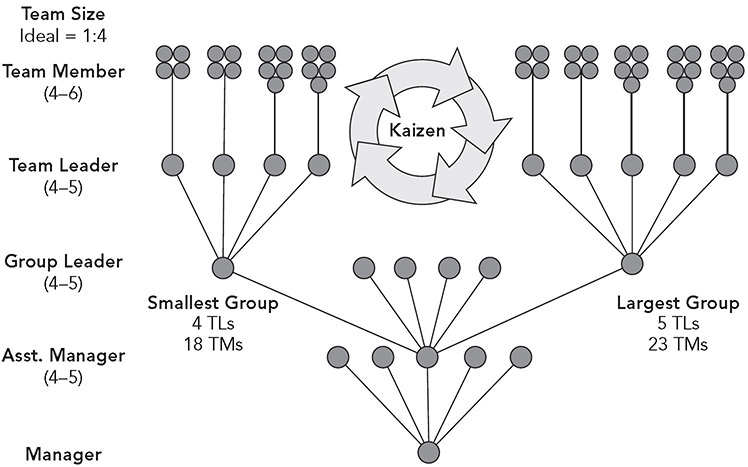

**Figure 10.1** Typical Toyota organization of an assembly operation, where TMs are team members and TLs are team leaders. _Source:_ Bill Costantino, former group leader, Toyota, Georgetown.

As discussed, the _team members_ are at the top of the hierarchy, with the rest of the hierarchy there to support them. The next line of defense is the _team leader_, an hourly team member who mastered jobs on the line, was energetic about learning problem solving, and went through an intensive training and development process. The Toyota team leader in most countries is still an hourly employee but gets a small bump in pay per hour. Team leaders are not responsible for performance reviews or disciplinary action but are there to support and develop the team members. The first-line supervisor is the _group leader_, the first management level, who is responsible for leading and coordinating a number of teams in the production work group.

The largest _quantity_ of kaizen activity happens at the level of the production work group, although those improvements individually may not generate large impacts. Engineers and managers often lead individual projects, such as introducing new technology or changing the architecture of material flow, that have huge impacts. Once these large changes are made, the system is generally in flux with a lot of nagging problems, and working through all the fine details of production is the responsibility of the work groups. They make the difference between good and great.

The roles and responsibilities for team members, team leaders, and group leaders are summarized in Figure 10.2\. (Note that both Figure 10.1 and 10.2 are courtesy of Bill Costantino; Bill was one of the first group leaders at the Toyota plant in Georgetown, Kentucky.) Noteworthy is the progression of responsibilities from team members to group leaders. _Team members_ perform manual jobs to standard and are responsible for surfacing problems and aiding in problem solving. _Team leaders_ take on a number of the responsibilities traditionally done by “white-collar” managers, though they are not formally managers and do not have formal authority. Their prime role is to keep the line running smoothly to produce quality parts (immediate response to andon) and to resolve problems when there are deviations from standard. _Group leaders_ do many things that otherwise would be handled by specialty support functions in human resources, engineering, and quality. They are responsible for HR functions such as performance appraisal, attendance, training, safety, and discipline, but also much more. They are integral to major improvements in the process, even introducing new products and processes. They regularly teach short topics. If needed, they are capable of getting on the line and performing the jobs. There is no such thing as a hands-off leader at Toyota.

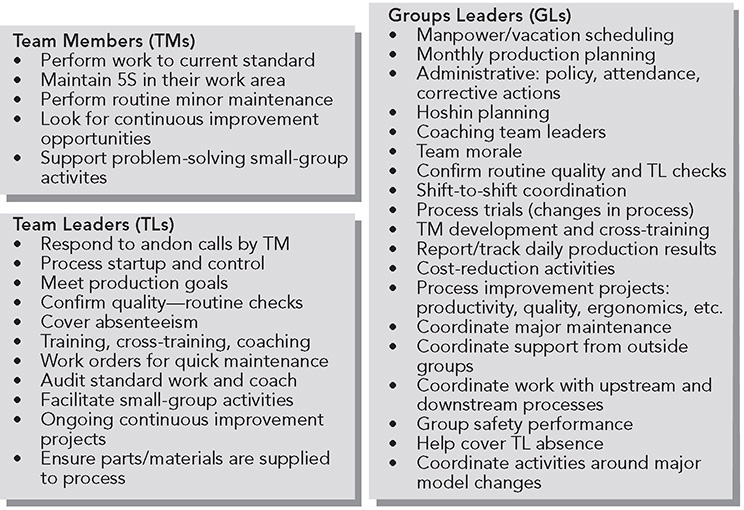

**Figure 10.2** Toyota work group roles and responsibilities. _Source:_ Bill Costantino, former group leader, Toyota, Georgetown.

**Four to One: Work Groups and the Mysterious Team Leader Role**

This would appear to be a tall hierarchy for a company that prides itself on being lean. After all, many Western companies have “leaned out” their org chart by eliminating layers of management, which inevitably means each frontline supervisor has a very large span of control, perhaps 30 to 50 direct reports. This large span of control is supposedly “empowering” workers to do the right thing based on their own judgment. Managers only need to deal with exceptions and individual discipline problems.

As we discussed in the last chapter, Toyota’s view of the role of the leader is quite different. It is not to discipline and react to problems, but rather to plan, lead by example, and coach. And continuous improvement is critical. On their own, team members may not participate in continuous improvement. They need to be coached, and one person cannot effectively coach dozens of people. Toyota’s ideal standard is a four-to-one ratio, that is, four team members for each team leader, and four team leaders for one group leader, though in reality there is variation in group size.

The Toyota team leader plays a broader set of roles than team members (see Figure 10.2). The first priority in preparing for the shift is to ensure sufficient resources to staff the production line, and team leaders become potential team members if someone is absent. Once the shift starts, the priority of the team leader is to respond to the andon. As discussed under Principle 6, the team leader has a matter of seconds to respond or the line segment can shut down. The team leader will later use a record of andon pulls for problem solving.

I call the team leader role “mysterious,” because when I teach about the Toyota Way, most people sense this role is important but are concerned it means adding expensive indirect labor. One common question is, “Do Toyota team leaders work a full-time job on the line?” because they are wondering if they have to pay for extra overhead to have team leaders. The answer is no and yes.

The no is because team leaders could not possibly fulfill all their role responsibilities if they were working on the line. For example, they could not stop their work and run to answer the andon at a different process because that would cause the line to stop. They could not do all the other offline tasks either, and they certainly could not work on problem solving.

At the same time, the answer is yes. The Toyota standard is to have just enough team members to staff all the positions on the line, with half the team leaders working a production job and the other half offline, and they rotate (though often team leaders spend more time working on the line than is desired). So Toyota gets two team leaders for the price of one, e.g., typically two are working production and two are offline.

This still seems unrealistic to many continuous improvement leaders in companies strictly governed by target ratios of direct labor to indirect labor. As soon as a worker is pulled out of the direct labor headcount and made a team leader, that person adds to the indirect headcount and then gets targeted for elimination. Toyota also has a strict budget, but it is a budget for headcount without distinctions made between the team member and team leader count. The ratio is not the issue, but rather the team leader role is simply considered standard headcount and part of the budget. It would not occur to a Toyota plant manager to question the role and consider eliminating it. Some think it is the most critical role in the plant for the continuous improvement of individual production processes and quality. Later in the chapter, we look at how Herman Miller, an American office furniture company, addressed this issue.

**Group Leaders—the Most Challenging Role** 

The group leader has an even broader set of responsibilities. This is the first management level, the equivalent of the frontline supervisor, but it is much more than that. In the UK plant, people like to refer to group leaders as the managing directors of their own business.

The group leader has many responsibilities, as summarized in Figure 10.2, from planning the day for the teams, to coordinating launches of newly designed vehicles, to developing and working toward an annual plan for improvement through the hoshin kanri process (Principle 13). In many companies, engineers view the factory as their domain. They make plans and execute as they wish. The frontline supervisors need to be informed and involved to a degree, such as communicating what is coming to workers, but then they get out of the way and let the engineers do their jobs. Not so at Toyota. The factory is the domain of group leaders, and anyone who wants to do work on the production line needs to treat the group leaders as customers. After all, group leaders have to make the new system work, and improve it.

Each work group has its own meeting area on the shop floor next to the group’s work processes where the group leader’s desk sits. It is an “open office” and includes lockers, microwave ovens, and large tables. The team leader boards and some of the group leader boards are here. This is the place for daily briefings before the shift starts, as well as the place for breaks, lunch, and a lot of informal interaction.

**Japanese Students in Elementary School Are Socialized to Work Not Just in a Group, but as a Group** 

Toyota had an advantage organizing around small work teams in Japan because that is how Japanese children are taught all the way back to elementary school. One of my former students, Jennifer Orf, split time between going to school during the regular sessions in the United States and then going to school in Japan during the summers, when Japanese schools are still in session. She wrote about her experiences.4 She describes how Japanese elementary school students identify with their class and also with their small group (called a “han”) of four to six students:

_In Japan, students are taught how to work together as a group as distinct from working in a group. . . . This means that not only do the children learn that they can accomplish more as a group than they could individually, but also that they feel a sense of collective 210identity with the group and recognize the special responsibilities that come from being part of a group, such as the ability to listen to the other members in the group and to delegate responsibility._ 

Students in han take responsibility for learning through various projects assigned to the groups, such as science projects. Tools like standardized work and visual management are common in the daily lives of these students. Consider Jennifer’s description of lunchtime when the classroom is converted by the students into a dining room:

_In my experience, groups looked forward to being on lunch duty, and the faces on the other side of the “cafeteria counter” were more often than not beaming under the chef’s hats. . . . The student-management of this chore, which even first graders perform daily, is made possible because of the standardized nature of the process. Charts list the responsibilities for the different lunch duties, so that students can check off the steps as they perform their duties._

**DEVELOPING TEAMS IN A TOYOTA WAREHOUSE: MORE THAN A ONE-MINUTE PROPOSITION**

Toyota started its first North American parts distribution center in California and hired many people without experience, assigning some to team leader and group leader roles. It did not go as well as hoped, and after many years the company was still working to develop these leaders and develop teamwork. So when Toyota started a second North American Parts Center in Hebron, Kentucky, it decided to get teams right from the beginning. Ken Elliott, who launched the new operation, explained to me in 2002:

_We are not building a warehouse; we are building a culture. This is why we have been as successful as we are. We had one shot at this to get the culture right._ 

What he meant is that years out, he did not want to be in a position of trying to fix the culture like he experienced in California. Get it right the first time.

When I visited Hebron, I heard a frequent reference to “situational leadership,” which people had learned about from Ken Blanchard, famed author of _The One-Minute Manager_. Blanchard describes four stages of team development (in parentheses are the descriptors from another popular model) and the leader’s role for each stage:

**Stage 1: Orientation** (forming). The group needs strong task direction from the leader and must understand the basic mission, rules of engagement, and tools the members will use.

**Stage 2: Dissatisfaction** (storming). The group goes to work, which is a lot less fun than talking about great visions of success, and the members discover it is harder than they thought to work as a team. In this stage, they continue to need strong task direction from the leader, but also need social support to get through the social dynamics they do not understand.

**Stage 3: Integration** (norming). The group starts to develop a clearer picture of the roles of various team members and begins to exert control over team processes. The leader does not have to provide much task direction, but the team still needs social support.

**Stage 4: Production** (performing), The group puts it all together and is functioning as a high-performing team with little task direction or social support from the leader.

Blanchard was describing a committee or task force and the development takes a few weeks. Combining the concepts of situational leadership with the highly evolved work processes of TPS led to something new that requires far more than one minute. Toyota decided to start out with no team-leader roles. The group leaders were trained in TPS and provided task direction directly to the stage 1 team members. As the group matured through stages 2 and 3, members with leadership potential were identified, and at the same time, TPS matured. After several years (not weeks), the group leaders finally felt the associates had matured to the point that the leaders could assign members to team leader roles and move the group toward becoming more self-directed. But even this happened situationally, and different groups matured at a different pace and started up the team leader role at different times over several years. The level of investment Toyota was making at Hebron in developing people and teams was far beyond anything I had seen before. As we will see at General Motors, too often the team leader is just thrown into the job, as though creating a job title on an organization chart creates the leader.

**REENERGIZING THE FLOOR MANAGEMENT DEVELOPMENT SYSTEM AT TMUK**

The Toyota plant in Burnaston, United Kingdom (TMUK), the first Toyota plant in Europe launched in 1992, was a mature organization that struggled with work group leadership, despite making huge investments early on. As I am writing this, the plant is building the 2020 Corolla, hybrid and gas engine. TMUK launched with many Japanese executives, managers, and engineers who moved there to train new hires in basic automotive production skills and TPS. After several years, the Japanese members were moved elsewhere, and because of the high visibility of the Toyota plant, British members became hot commodities for poaching by other companies. This started a more challenging period for TMUK, as it lost and had to replace many group leaders and managers. Years later, when the Great Recession took its toll and sales dropped, one of the two lines was closed, and separation agreements were offered and accepted by many members.

Performance across the plant became inconsistent and not up to Toyota standards. Some of the symptoms of this weakness included a drop-off in solving problems revealed by the andon, less rigorous focus on standardized work and job instruction training, less than stellar 5S, more unexpected absences than usual, and quality problems discovered in inspection. The root cause pointed to a weakness in the group leader role, and particularly to the time spent coaching team leaders.

TMUK had Toyota’s standard Floor Management Development System (FMDS)—which included daily stand-up meetings, a visual management system, and clearly defined roles and responsibilities and training for team leaders and group leaders. TMUK studied the problem and concluded it needed to further develop FMDS and bring it to a new level. It launched the redesigned FMDS in the paint department as a pilot over several years and spread the practices throughout the plant.

There are, of course, key performance indicator boards for group leaders, the boards being organized around the categories of safety and environment, quality, production, cost, and human resource development. These are reviewed each day in meetings led by group leaders with a focus on red items—those below target. But there is far more to it. The TMUK group defined in great detail the roles for each level of leadership, skill requirements, and training and introduced new visual management boards to stimulate kaizen.

**Core Role Definition**

Roles were defined and expectations documented on a series of A3-size papers for team members, team leaders, group leaders, and section managers. For team members, 21 roles are defined, including understanding TPS, performing equipment startup-TPM-shutdown, identifying abnormalities, serving as a primary process owner, perfecting the execution of standardized work, knowing the fundamental skills, and using andon. As an example, the A3 for the team member role for andon use is shown in Figure 10.3: to follow standardized work exactly, alert the group to any abnormalities, and actively engage in kaizen through process ownership. The plant uses job rotation between two processes, and each team member is assigned to be the primary process owner responsible for one process on that shift and for communicating across shifts.

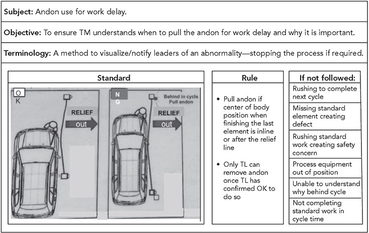

**Figure 10.3** Team member expectations for andon use. _Source:_ Toyota Motor Manufacturing UK.

For team leaders, there were 40 core roles defined, including such responsibilities as andon response, andon analysis, safety training, posture confirmation, quality management, preshift team meeting, TPS house knowledge, change point management, 4S leadership, kaizen, quick problem-solving report, and standardized work confirmation. As an example, the A3 for the core team leader role for confirming healthy posture for members is shown in Figure 10.4\. Overall, team leaders set up the team members for success, run the preshift meeting, respond to andon, and lead kaizen.

Group leaders have 44 core roles defined. According to one TMUK manager, group leaders have the “toughest job in the business.” Their responsibilities include managing the KPI board, managing the production control board (hour-by-hour chart of units produced versus actual with reasons), knowing how to hold meetings, managing personal protection equipment, confirming employees’ posture, confirming standardized work, ensuring Toyota Business Practices are followed, managing scrap and reject materials, attaining hoshin objectives, coaching, and giving performance feedback. Group leaders are like managing directors of their business for planning, daily management, personnel management, and kaizen toward annual hoshin objectives.

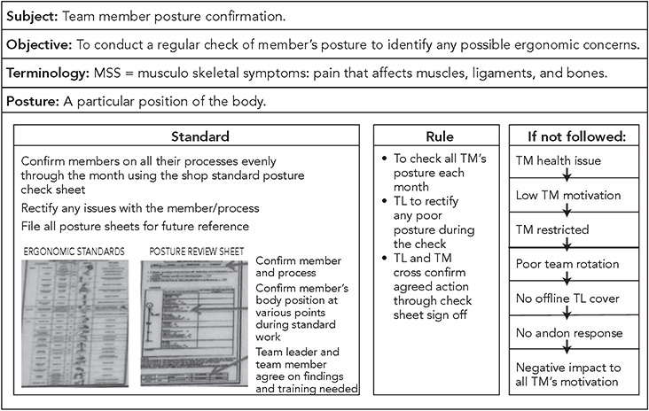

**Figure 10.4** Team leader expectations for posture confirmation. _Source:_ Toyota Motor Manufacturing UK.

Section (sometimes called assistant) managers have about 100 to 120 people reporting to them, with about four group leaders as direct reports. They spend an intensive two hours on the shop floor at the beginning of the shift, making sure things are running smoothly, and then have more flexibility for the rest of the shift. The saying at TMUK is “Lose the first two hours, lose the shift.” They have only 11 core roles defined, and these are very general and focused on living and modeling the Toyota Way, including finding facts and analyzing problems, engaging in creative and innovative thinking, creating action plans and building consensus, taking action and persevering, monitoring progress, and coaching.

**Global Minimum Critical Role for Group Leaders**

Toyota Motor Manufacturing in Japan defined in more detail the minimum critical roles that are like standardized work for the group leader. They are checked off and expected to be completed every day (see Figure 10.5). Of course, for this management position, the day will never go exactly according to plan, but as a starting point, these are things that should happen, along with estimates of time. Some are regularly scheduled meetings that have an allotted time. There are four broad categories of activities—gemba (where most of the coaching is done), office, meeting, and breaks. Gemba time is supposed to constitute about half of the time of the group leader, but in reality, group leaders spend much more time on the floor and in meetings (usually on the floor).

I highlighted some examples of standard daily activities in Figure 10.5, such as coaching the Delta S quality audit done by team leaders on the most critical safety items; attending the shipping quality audit (SQA), which is a teardown of a small number of cars each day; attending the team leader meetings to coach; calling the quality gate, which happens after the group leader processes and gives feedback on any quality deviations that arose in his or her area; coaching team leaders on process kaizen; and attending the manager’s meeting with the other group leaders. These things need to happen. The group leader keeps track of these items, checking them off, and then the section manager checks the sheet each day.

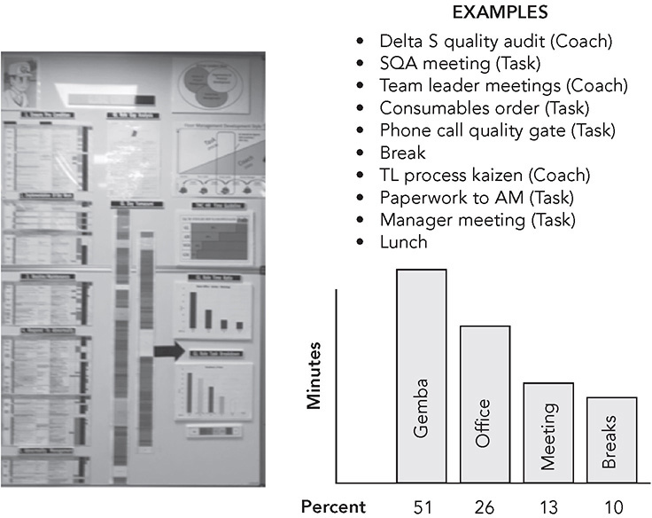

**Figure 10.5** Minimum critical role for the group leader and the Yamazumi chart. _Source:_ Toyota Motor Manufacturing UK.

**Transitional Roles and Structured Learning**

Roles were formalized for the transitions between leadership positions: advanced team members, advanced team leaders, and advanced group leaders. These included new titles, pay levels, and role definitions. New training programs were developed for these transitions.

The advanced team member training is 17 weeks of structured learning and focuses mostly on standardized work, including writing out the processes, auditing, and responding to deviations. The advanced team leader also gets 17 weeks of structured learning, focused heavily on leading improvement projects and coaching team leaders. In both cases, these are mainly work-based leadership assignments—acting in the leader role or improving something. They are scheduled day by day and tracked day by day, and there are intensive reviews at various stages. Some are formal training sessions off work time, and many assignments need to be completed by the team member and team leaders off work time, like working on coached kaizen projects. The team members have to be seriously committed to put in this unpaid time.

**Visual Boards and Daily Meetings**

Arguably the most powerful new innovations at TMUK were new team leader and group leader boards and daily meetings focused on 1x1 problem solving. A prototype “team leader control board” with fictional data is shown in Figure 10.6\. This is the board used for daily 5-minute preshift meetings. There are some traditional things on the board, like a place in the upper left-hand corner for quality, safety, and other points to be highlighted to the team in the preshift meeting. Change point management is very important, which highlights anything that has changed in a process that may impact the shift and actions to be taken. Changes could include a temporary team member filling in on a process, a new member being trained, an engineering change in a part, or a new tool being trialed. There is an area for A3s of the bigger team leader problem-solving projects by shift.

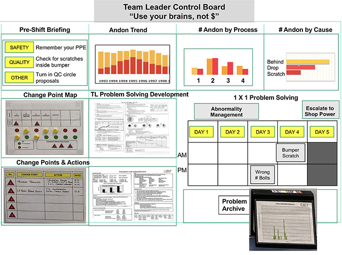

**Figure 10.6** Example of a TMUK team leader control board._Source:_ Toyota Motor Manufacturing UK.

The rest of the board is what is new—an emphasis on 1x1 problem solving. Remember the andon is pulled because an abnormality is detected, and the team leader and team member are responsible for abnormality management. There are charts to capture the number of andon pulls, including an overall trend and the number of andon pulls the prior day by process. This data is generated automatically by the computer in real time as the cords are pulled. Team leaders are expected to write down the cause by hand for each pull and then make a Pareto chart of the causes. The biggest problem is then selected for problem solving by writing it on a tag, which is placed in day 1\. Each day until the problem is solved, the tag moves from day to day until on day 5 it hits the red spot (gray in this figure), and the card is physically escalated to the group leader “power board.”

The new group leader power board was a countermeasure to a problem noted in the old meetings (see Figure 10.7). Group leaders felt left on their own. They had problems to address that required support from engineering, maintenance, or staff specialists, and they had to chase down these people for help. In the power meetings, these people are already in the meeting, every day—engineering, maintenance, production specialists, the section manager, quality, and anyone else needed. The group leader has a microphone, and only the one with the mic speaks. Everyone is there as a “servant” to the group leader.

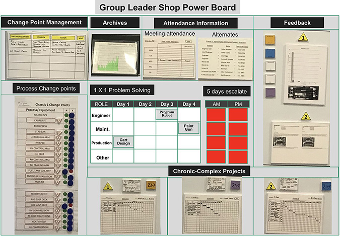

**Figure 10.7** Example of a TMUK group leader power board._Source:_ Toyota Motor Manufacturing UK.

Each card that comes up from the team leader or new cards that the group leader generates for 1x1 problem solving are assigned to the appropriate group. Chronic-complex projects are managed through Gantt charts on the board. The power that the visuals and meeting give to the group leader can’t be overstated, and the speed of response is lightning quick.

**FORM VERSUS FUNCTION OF TEAMS AT GENERAL MOTORS**

General Motors had a unique opportunity through its joint venture with Toyota at the NUMMI plant to learn the Toyota Production System firsthand. The company was not committed to learning for many years, but after about a dozen years it was making good progress. It took this long to move from copying features of TPS to working on an effective culture, and then in 2009 bankruptcy hit, and GM was back to the beginning.

In the early stages of the joint venture, General Motors sent 16 “commandos” to NUMMI to work as managers for a few years and then come back and teach what they learned. The commandos were immersed in TPS culture and had a lot to teach, but they were scattered in different locations and had little power to change the organization. Larry Spiegel, one of the commandos, later lamented:5

_The lack of receptiveness to change \[at a GM plant on Long Beach\] was so deep. There were too many people convinced that they didn’t need to change. It’s not logical. They just didn’t \[believe it was necessary to change\]._

After about a decade, GM formalized its version of TPS in its “Synchronous Manufacturing” program, and where GM did not have leaders experienced in lean, the attempt became more of a carbon-copy activity. Some GM leaders reportedly took photos throughout NUMMI and then worked to make the GM factories look exactly the same. Among the things GM copied was the work group structure, including the team leader role. The company created the job description, worked with the union to get agreement on the role, and deployed it broadly and quickly. The result was GM got the form right—but not the function.

At some point an executive wanted to know how the groups were performing. Industrial engineers conducted a time study to measure how the GM team leaders were using their time throughout the company compared with the NUMMI team leaders’ time. The overarching difference between GM and NUMMI team leaders was that GM team leaders didn’t really understand or fulfill their role. In fact, only 52 percent of the time were the GM team leaders doing anything that you could regard as work, while NUMMI team leaders were actively supporting the assembly-line workers and spent 90 percent of their time doing work on the shop floor. As examples, NUMMI team leaders spent:

 21 percent of their time filling in for workers who were absent or on vacation. GM team leaders did this 1.5 percent of the time.

 10 percent of their time ensuring a smooth flow of parts to the line. GM team leaders were at 3 percent.

 7 percent of their time actively communicating job-related information. This was virtually absent at GM.

 5 percent of their time observing the team working in order to anticipate problems. This did not happen at all at GM.

Basically, GM team leaders focused on emergency relief of workers (e.g., so workers could use the restroom) and quality inspection and repair. When there were no immediate problems and no fires to put out, they were not sure of what to do, sometimes going to a back room for a break. What GM was lacking was obvious: it did not have the Toyota Production System or the supporting culture. It merely copied and appended the work group structure onto traditional mass production plants. The lesson was clear: don’t introduce work teams unless you also commit to the hard work of developing the system and culture to support them, as we saw at Toyota’s warehouse in Kentucky.

**TAKING TEAM LEADER AND GROUP LEADER DEVELOPMENT SERIOUSLY AT HERMAN MILLER**

In contrast to what General Motors was doing in its early years, office furniture designer and manufacturer Herman Miller made a serious long-term investment in the team leader and group leader roles. Herman Miller began working with the Toyota Production System Support Center, and Mr. Ohba, in 1996\. The company began with a model line in one filing cabinet plant and went through the pain and struggles of any student of a Toyota sensei. What does he want? Why doesn’t he give us any answers? But the company struggled, and learned, and got remarkable results. For example, it increased production, even though it eliminated one shift and reduced the number of direct production workers from 126 to 30 people with little capital investment.

The sensei had an agreement with the CEO that no people would lose their jobs because of TPS; and so as people’s positions were eliminated, the people were moved to other roles, sometimes temporarily on a kaizen team. Later, the productivity increases across the company allowed Herman Miller to keep production in the United States, which saved many jobs, while its competitors were moving to Mexico to chase lower labor costs (more on this in final chapter).

Out of the model line, the Herman Miller Performance System (HMPS) spread across all manufacturing with stunning results. This is not to say the journey was linear and easy. It was filled with ups and downs, and the company learned that the key to sustainability was the management system and people development. In 2004, to address the need for qualified people, the HMPS group piloted development of versions of the team leader and group leader roles with several months of intensive, one-on-one coaching. It called the team leader a “facilitator” and the group leader a “work team leader,” but the roles were similar to those at Toyota. The roles were so successful that all the plants started their own version of training, although with inconsistent results.

One of the issues the company encountered early on was getting the sequence of development right. When facilitators were developed before the work team leaders they reported to, they were underutilized and frustrated. Seeing the need for centralized, programmatic development, in 2009 the company introduced a 12-week “Bridge” learning program for facilitators (team leaders) and a program called “Propel” for work team leaders (group leaders) run out of the HMPS group. Note that 13 years passed from when Herman Miller first started learning from Toyota until it introduced formal training for this new role of facilitator, so the company was already quite mature in its use of the tools and systems. It also had skilled “continuous improvement leaders” in each plant.

At Toyota, these roles are ingrained in the culture, but there was a bit of a sales job needed at Herman Miller since operations divisions had to pay the cost. At first, senior leadership had some struggles accepting the facilitator role, believing that it would add wasteful overhead. The programs’ creators believed otherwise. As explained by Matt Long, vice president for continuous improvement at the time:

_Early on in this journey when we were developing the Bridge program we were challenged about the funding for those positions, because it looks like just more overhead and your indirect to direct ratio seems to be going the wrong way. But when we tracked the payback for those students in the first Bridge class, two members of the Bridge class paid for the whole class \[10 people\] within six months of coming out of the Bridge program._

This is not a bad return on investment for a training program. The cost was simply the payroll of the 10 people who attended the first class. This was a full-time assignment for three months, and “students” were intentionally placed in a different plant so they were not held back by familiarity with the people and processes—one of the best decisions made at Herman Miller. As it became clear that there was a great payback and as senior leaders began to believe in the program, they did not press for tracking costs and return. They just wanted more trained facilitators.

The HMPS group had learned enough from Toyota to understand the difference between classroom training of concepts and on-the-job development of actual skills. It wanted skills and people who would behave appropriately for the situation. The agenda for the 12-week Bridge program for facilitators is shown in Figure 10.8\. Nothing was taught without a specific purpose, and almost everything was immediately applied and assessed.

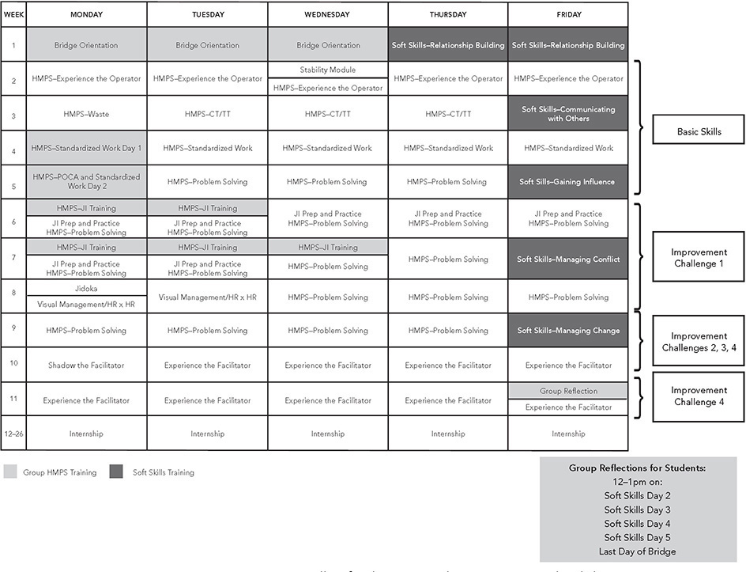

**Figure 10.8** Herman Miller facilitator Bridge program schedule.

Week 1 is general orientation and some “soft skills training,” and then each of the students is sent to an assigned work area to do production jobs for a week and get familiar with the area and the people and experience what a team member experiences. The students begin to learn about the “stability” of the operation with the goal of identifying struggles that impact the smooth operations a team member needs in a standardized work condition. When the Bridge students learn about standardized work, they practice it: they time work elements, they develop standardized worksheets, and they look at the balance between the cycle times of the jobs in the area and the takt. Where are there light jobs? Where are there heavy jobs? They develop in this early stage a “critical eye.” As described by Jill Miller the leader of the program:

_They learn and apply tools, like identifying waste, cycle time versus takt time, building a work-balance chart, prioritizing problems to solve, standardized work. With these tools they are building a current condition and looking at the work differently than they had ever looked at the work before._

Weeks 2–12 are spent in the learning area, practicing all the skills they were taught in the classroom, under the overall theme of problem solving through PDCA. The work team leader in the area assigns them a problem to work on, and the trainees need to define the problem and then work on rapid problem solving. The problems are generally small and specific, like items in the hour-by-hour chart that caused underproduction. The students are not on their own for any of this. In addition to the support given by the team members and leadership in the learning area, they are assigned a continuous improvement leader who is part of the staff of the plant and spends two to three hours per day with the trainees.

After the three months of training, the trainees spend another three months as interns practicing what they have learned and taking on greater facilitator responsibility. If they pass, and a large majority do, then they are eligible for a facilitator position when one opens up, perhaps in the plant they came to for learning or in their original plant.

As a result of the program, processes are improved, costs are paid back, and most importantly, there is a fundamental transformation in the trainees. It is an experience that will change the rest of their lives, and their level of enthusiasm is off the charts. Jill gushed:

_I tell people all the time I have the best job ever getting to watch these people learn and grow week after week. The students even talk about the impact it has on their families because their families can see how much they have grown and changed. It’s really amazing. It’s a life changing opportunity for these people._

An unexpected benefit of the Bridge program is that it created a leadership pipeline that didn’t exist before. Previously, Herman Miller looked outside the organization for work team leader candidates, but now the company develops them from within. There are numerous examples of team members that have moved through the ranks of facilitator, work team leader, continuous improvement leader, and even manager. It has also helped drive diversity in leadership by intentionally developing diverse candidates.

The Propel program for work team leaders begins with a one-week review of the skills taught in facilitator training and with identifying any weaknesses. It is important that work team leaders have the fundamental skills of the people they are leading. They learn additional concepts and skills such as writing a monthly A3 plan, developing a cadence for management, and charting material and information flow. These skills are used to understand the current condition of an area and effectively manage it. Problem-solving training is learned on the job, again with intensive coaching from the continuous improvement leader.

The problem solving in this case is a bigger project for the trainees and follows Toyota’s eight-step process called Toyota Business Practices (discussed under Principle 12). In this case, the trainees are defining a big problem, including identifying the gap between the ideal state and the actual state and breaking the problem down to manageable chunks working in the direction of the ideal state. Along the way, they learn to teach the classroom sessions that were taught to the facilitators, develop presentation skills, and learn more deeply by being forced to think about the tools and concepts and how to explain them to others. After their HMPS training, the learning shifts to human resources skills and how to apply them situationally. There is a three-month internship, but Propel students are in such demand that they often are grabbed by operations before they complete the internship.

We asked graduates of Bridge and Propel about the highlights of the program, what they are most proud of, and how it changed them and helped them grow. In all, 27 people answered with heartfelt and glowing essays that went far beyond the specific lean tools to the relationships they built, how they learned to become leaders, and a new way of thinking about solving problems. Here are examples from facilitators:

 Making improvements in our assigned areas and having it become successful is the most rewarding feeling. Also successfully making people’s ideas come to reality especially when it’s a problem that’s been around for a while. I am also proud that I was able to change people’s perspective about facilitators, that they are someone you can trust, to see them as support where they are doing things in your best interest.

 My coach was a highlight of mine. He sensed my ambition but tempered it with making sure to focus on fixing the smaller problems first. It was really quite humbling since I think almost everybody wants to solve the world’s problems the moment they have the freedom to. . . . The nice thing is that a coach is always there beside you to make sure you have the support when you need it, a challenge to keep you engaged, and someone to remind you that it’s alright to make mistakes.

 I am most proud of how confident the process made me. I knew no one . . . I challenged myself to forge relationships and friendships I still have to this day. It drove me out of my comfort zone, but I like myself a lot more for it. The program taught me to be me . . . I learned to lead with what was inside of me. To show compassion, a willingness to assist and a side of humbleness that everyone loves in a leader. I learned to be a forward thinker and to work with character as if no one was watching.

 Prior to the development, “leader” would have been one of the last words I would have used to describe myself. Now, it is in my job title. I didn’t just develop in learning the tools of HMPS, but also being put out of my comfort zone, practicing presentation and communication skills, and learning to network in different plants—all of which has helped put me on the career path I am on now.

Then there were Work Team Leaders:

 Bridge taught me to not be arrogant and prideful but to be a servant leader. It continues to teach me to ask for help. To have ownership for everything I do whether it is good or bad. It continues to teach me . . . people are your most valuable resource. They are not to be blamed, they are valuable and we need to make their job easier.

 Personally, I honestly did not see myself practicing lean in manufacturing. I did think about gaining a better understanding, perhaps developing a greater appreciation for lean principles but not really DOING IT! It’s been challenging to put pencil to paper, go see, measure, and collectively with team members solve problems and sustain improvements.

 The amount of personal growth I’ve noticed in myself and others, both as a leader and as a human of the earth. A great leader at Herman Miller is a great leader across the world. In a nonintentional way we develop not just business leaders to accomplish a demand but also community leaders to guide the world into a better tomorrow. In every single facet of my being, every nook and cranny of my character I have learned and developed into a strong leader and support. . . . Bridge not only gives you the skills, tools, and proficiency in those tools to lead a business but also grows you in a moral and logical way.

Herman Miller has many visitors who come to learn about these programs, and Matt and Jill realized that few have experienced such an intense learning program. Most leadership development programs are five days or less—primarily classroom training with some experiential exercises. Herman Miller has been working on this for over 23 years since it first started learning from Toyota in 1996; yet the Bridge and Propel training are both still being refined, and even after all this development, not all lines have facilitators. It is a long-term effort, far longer than the life span of most corporate programs. And the program is effective because the basic tools and management systems are in place and working for leaders to learn from and improve upon. This level of commitment may not be realistic for all companies, but Herman Miller is providing one model of what it means to take developing leadership skills seriously.

**MOTIVATING WORK GROUPS THROUGH INTRINSIC REWARDS OR EXTRINSIC OR BOTH?**

How do you motivate team members to care about their work enough to continuously improve it? I often hear that “workers are only interested in getting through the day and getting paid.” I am asked how to motivate them to go beyond the minimum effort and make suggestions for improvement. What seems to automatically come to mind is extrinsic rewards and punishments—which means you give people something if they perform well, or you take something away if they do not. For example, American auto companies used to provide a bonus for implemented suggestions proportional to the cost savings. Some workers even got cars. It led to conflict over whose idea it was and union grievances over the proper amount of the bonus, but it did produce some good ideas.

Karl Duncker published a study in 1945 that looked at how extrinsic versus intrinsic rewards impacted how subjects performed a task focusing on speed. The challenge was to attach a candle in some way to a wall as fast as possible. He divided subjects into an experimental group that received intrinsic rewards—doing this for the benefit of science—and a control group offered extrinsic rewards—money if the subject won. In experiment 1, he provided some supplies laid out, as in Figure 10.9, including tacks in a box. Subjects ended up trying various things that failed, like melting wax and trying to use the wax to stick the candle to the wall. Nothing worked until they discovered the simple solution of removing the tacks from the box, tacking the box to the wall, and using it as a holder for the candle. Who did better? Surprisingly, those with intrinsic motivation won, by a lot. Money actually hurt performance, and the financially incentivized subjects on average took longer to discover the secret.

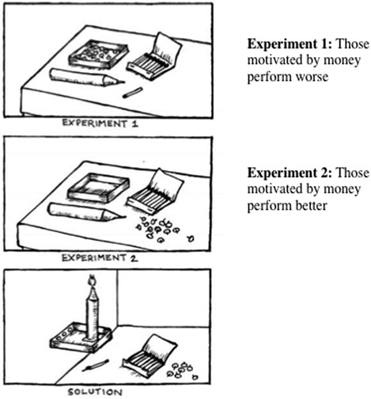

**Figure 10.9** Candle experiments with extrinsic rewards and intrinsic rewards. (Drawing by Karyn Ross, based on Karl Duncker, “On Problem Solving,” Psychological Monographs 58, American Psychological Association.)

In experiment 2, the box was empty and the tacks were laid out separately. In this case, it was more apparent how the box could be used, and subjects often went right to the correct solution, with those incentivized by money easily beating out subjects not offered money.

His conclusion was that extrinsic rewards can be powerful motivators when the work to be done is very clear and creative thinking is not required. When “outside the box” thinking is needed, money causes people to try to rush toward the goal, and they think less deeply.

There have been many other studies with similar conclusions—for creative tasks, extrinsic rewards are less helpful and can actually reduce discretionary effort, and subjects enjoy the work less.6 Since people are getting paid per unit of activity, they tend to do the minimum required to get the reward.

With repetitive manual work, you would think rewarding people with pay per piece would make sense. Or if you want creative ideas for improvement, why not pay per idea? Yet Toyota works hard to avoid extrinsic rewards when possible. Everyone gets competitive pay for their positions, but there are no performance-based bonuses for production workers. Even for managers, discretionary pay is small and mostly tied to how well the company does and how well the organization, e.g., the factory, performs. A small part is an individual bonus.

Toyota wants more than a lot of pieces produced or ideas generated quickly. It wants production work done with high quality to the takt, not overproduction. It wants workers thinking about how to improve their work. It wants problems to be solved thoughtfully, usually as a team. It wants creative contributions by everyone.

One exception to only giving intrinsic rewards is using recognition as a reward. For example, at the TMUK plant these include an eagle eye award for spotting a hard-to-notice quality problem, recognition and small awards for the best quality circles, and recognition for particularly good kaizen activities. Moreover, all leaders are taught to identify positive behaviors and recognize individuals and teams.

**TRUST IS THE FOUNDATION FOR RESPECT FOR PEOPLE, AND JOB SECURITY AND SAFETY ARE THE FOUNDATIONS FOR TRUST**

Toyota leaders are firmly committed to respect for people and job security. It is nonnegotiable. A human resource model that’s taught at TMUK puts job security as the foundational item and _essential_ for all the other levels (see Figure 10.10). This is one of the most difficult Toyota concepts to transfer. I frequently hear, “We understand Toyota is committed to job security, but we have too much instability in demand to make that kind of commitment to our workforce.”

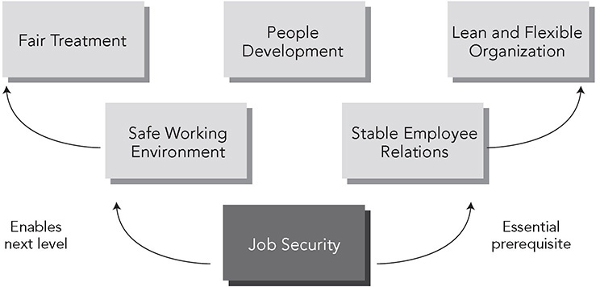

**Figure 10.10** Building blocks of respectful human resource management. _Source:_ Toyota Motor Manufacturing UK.

The problem is the assumption that the current condition is fixed and cannot be changed. Most people are correct that if they take their system as it is and then try to simply guarantee job security, they will have a problem. Their systems are not designed for this. Toyota, with an improvement mindset, has evolved systems to support job security over time, not just because the leaders are nice people, but because job security becomes a design constraint. If a cultural assumption is that both long-term employment _and_ cost competitiveness are necessary for survival, then there is little choice but to find creative ways to do both. For the long term, a strong support for ensuring job security and keeping plants open is Principle 4 on heijunka. One reason (not the only one) that Toyota wants to make multiple vehicles on the same production line and to level the production schedule is to stabilize volumes and thus employment. The passenger car is not selling well, but the sport utility version is going gangbusters, or vice versa. If they are made on the same line, there will be stable work over time.

One important tool for adjusting to demand changes is the “variable” workforce, as opposed to the regular work force that has tremendous job security. All Toyota plants use a temporary workforce as a buffer, adding or dismissing based on need. A common Toyota standard is that 20 percent of team members are from the temporary workforce. Pay policies for temporary workers vary by country and may be lower than or equal to the pay of regular team members, and Toyota does its best to treat the temporary workers with respect; the company even invites them to participate in quality circles and invests in their training. Those that perform well become first in line for hiring if there is a long-term upward trend in demand.

In the short term, Toyota uses a variety of tools for flexing working time (see Figure 10.11). Many visitors wonder why Toyota is not running production around the clock and prefers two shifts with several hours in between. In addition to using the third shift for preventative maintenance, it provides flexibility for scaling up and down work hours. At TMUK, when sales increase temporarily—for example, when a new model is first introduced—Toyota can add up to 1½ hours of overtime per shift. When volume goes down, the company can cancel the ½hour of overtime it pays per shift in normal conditions to cover line stops. At TMUK, management has negotiated with its union partners various policies, such as adding nonproduction members to do production work and banking up to five shifts in a month. Banked hours work this way: If volume is down and Toyota would like to reduce the hours in the week, it might shut down production for two shifts in a week. It still pays team members who stay home, but then at another time, it can add a Saturday and pay only the overtime premium.

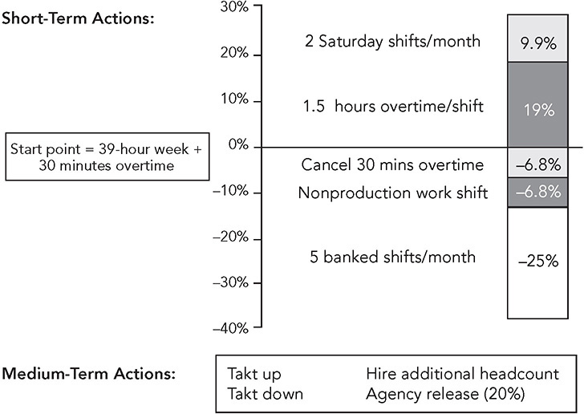

**Figure 10.11** TMUK: Working time flexibility = protect job security.

The combination of the variable workforce and tools for short-term hours adjustments leads to flexibility to shift work hours up or down by about one-third each way to adjust to sudden demand changes. I am not suggesting that these are generic solutions for all companies. I often hear, “Our union does not have that kind of flexibility, and our laws do not permit temporary workers.” The point is that because of its commitment to job security and its belief it is critical for success, Toyota has developed local solutions to achieve flexibility in the very difference conditions of each country where it has manufacturing operations. The principle remains the same: establish mutual trust between management and team members and construct a win-win partnership. If team members think management is playing games it is over.

Job security enables other key elements of human resources as shown in Figure 10.10\. The most important, safety, is a given at Toyota and has evolved over time. At TMUK, every meeting begins with a personal safety commitment from whoever speaks. Warning signs against unsafe practices are everywhere. Personal protective equipment is a must. Standardized work builds in key points on how to do the job safely. Single-point lessons on safety are a regular occurrence. Team members stop and point in the direction they will walk in the plant every time they make a turn in the plant. The number of days without a lost-work incident is posted prominently and is usually in the hundreds of days. Any safety incident is instantly sent to the cell phones of senior leaders. A safety culture communicates to everyone that “we value you and your health, and safety comes above anything else.”

**PEOPLE DRIVE CONTINUOUS IMPROVEMENT**

Toyota invests in people and in return gets committed associates who show up to work every day on time and are continually improving their operations. On one of my early visits, I found that in the past year at the Toyota, Georgetown, assembly plant, associates made about 80,000 improvement suggestions. The plant implemented 99 percent of them.

So how can you get your employees to work diligently to do their jobs perfectly and strive to improve every day? Build a system that follows Toyota Way Principle 10: **“**Develop exceptional people and teams who follow your company’s philosophy.” First, look at the system dynamics of your organization. Building excellent people who understand and support your company’s culture is not a matter of adopting simple solutions or an afterthought of applying motivational theories. Training exceptional people and building high-performing work groups need to form the backbone of your management approach—an approach that integrates your social systems with your technical system. Throughout this book, you have seen how one-piece flow drives positive problem-solving behaviors and motivates people to improve. However, you need a social system and culture of continuous improvement to support this behavior.

Of course, you cannot pull a ready-made culture out of a wizard’s hat. Building a culture takes years of applying a consistent approach with consistent principles. You must design jobs to be challenging. People need to feel they have a degree of control over their job. Moreover, in a supportive context, there seems to be nothing as motivating as challenging targets, constant measurement and feedback on progress, and meaningful recognition for effort. The rewards can be symbolic and not all that costly. In the end, building exceptional people and teams derives from a culture of respect for people.

 KEY POINTS 

 Toyota culture is based on a growth mindset that with the right leadership anyone can develop and grow to face new challenges with dedication and passion.

 Toyota embraced servant leadership long before it was fashionable, turning the organization chart upside down, with value-added workers at the top.

 The Toyota standard is to develop work groups who own their processes and are served by support organizations.

 The standard structure is a group leader who is viewed as a managing director of a company’s small businesses with team leaders who lead their small work teams.

 The “mysterious” team leader is a pivotal role responsible for supporting team members, ensuring standardized work, responding to abnormalities, and leading kaizen, with a small enough team (ideally four people) to allow for daily coaching.

 Developing and sustaining effective leadership is even challenging for Toyota, and the company is regularly experimenting with new approaches to reenergize the work group.

 Some organizations make the mistake of assuming if they create a version of the team leader and group leader roles on paper, their work groups will function the same way Toyota’s do, but they usually fail.

 Herman Miller committed to developing high-performing teams and trains facilitators and work team leaders in a rigorous hands-on program over a three-month period plus a three-month internship.

 Toyota work groups are supported by a human resource system that focuses on a fair, safe, and secure environment with job security as the foundational element.

**Notes**

1\. Robert Greenleaf, _The Servant as Leader_ (pamphlet), Greenleaf Center for Servant Leadership, 2015.

2\. Carol Dweck, _Mindset: The New Psychology of Success_ (New York: Ballantine Books, 2007).

3\. David Brooks, “This Is How Scandinavia Got Great: The Power of Educating the Whole Person,” _New York Times_, February 13, 2020.

4\. Jennifer Yukiko Orf, “Japanese Education and Its Role in Kaizen,” in Jeffrey Liker (ed.), _Becoming Lean: Inside Stories of U.S. Manufacturers_ (Portland, OR: Productivity Press, 1998).

5\. https://www.linkedin.com/pulse/30-years-later-original-nummi-commando-shares-lessons-mark-graban/.

6\. Daniel Pink, _Drive: The Surprising Truth About What Motivates Us_ (New York: Riverhead Books, 2012).

\_\_\_\_\_\_\_\_\_\_\_\_\_\_\_\_\_\_\_\_\_\_\_\_\_\_\_\_

\* One of the first five Americans hired by Toyota Motor Manufacturing, Kentucky.

