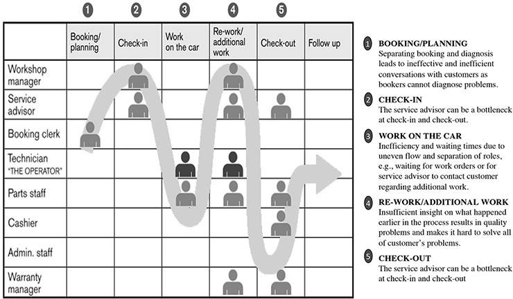
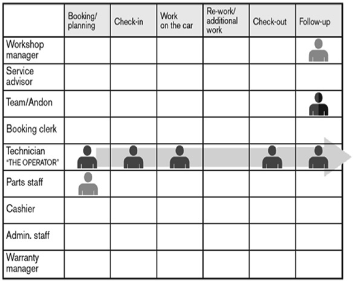
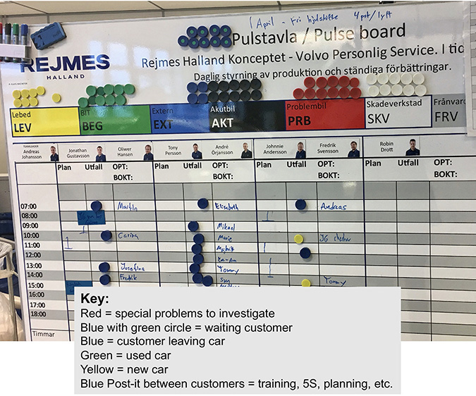
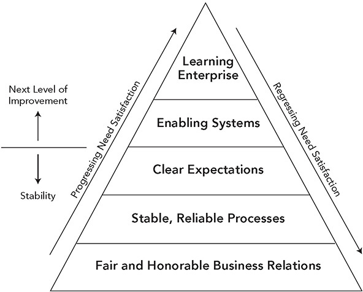
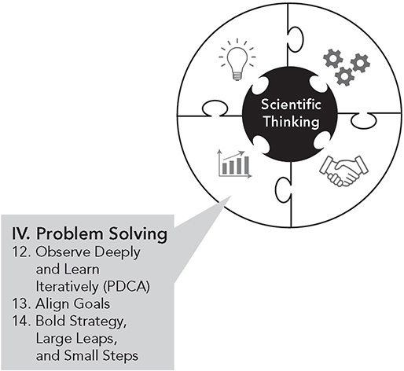

 Principle 11 

**Respect Your Value Chain Partners by Challenging Them and Helping Them Improve**

_Toyota is more hands-on and more driven to improving their own systems and then showing how that improves you. . . . Toyota will do things like level their production systems to make it easier on you. Toyota picks up our product 12 times per day. They helped move presses, moved where we get the water from, trained our employees. On the commercial side they are very hands-on also—they come in and measure and work to get cost out of the system. There is more opportunity to make profit at Toyota. We started with Toyota when we opened a Canadian plant with one component and, as performance improved, we were rewarded, so now we have almost the entire cockpit. Relative to all car companies we deal with, Toyota is the best._

—An automotive supplier

We have been looking at lean processes and people development within Toyota. Let’s consider the broader value chain that links inputs from suppliers to the company and to customer-facing distributors. In the auto industry, it is common that 70 percent or more of vehicle content comes from outside suppliers, so the automobile is only as good as the supplied parts. With the new world of innovative technologies to support connected, autonomous, shared, electrified vehicles, partnerships are increasing in importance. Distribution for many industries is done through outside agents or dealers. In the US automotive industry (with the exception of Tesla), the dealers are independent business owners who have been selected by the automakers to represent them. Toyota views outside companies it does business with as “partners,” whether they are suppliers, dealers, IT providers, lawyers, or you name it. Long-term partners are entitled to the same respect afforded to team members—treat them fairly based on mutual trust, challenge them, develop them, and help them grow. Let’s look first at auto suppliers, and later in the chapter we’ll look at developing dealers who sell and service the vehicles.

**SUPPLIER PARTNERING**

Auto industry suppliers consistently report that Toyota is their best customer—and also their toughest. We often think of “tough” as difficult to get along with or unreasonable. In Toyota’s case, it means it has very high standards of excellence and expects all its partners to rise to those standards. More importantly, it will help all its partners rise to those standards.

Let’s start with an example of an _ineffective_ (but sadly typical) approach to supplier relationships. In 1999, one of the Big Three US auto companies, which I’ll call “American Auto,” decided it wanted to make its supplier relationships the best in the industry. American Auto was tired of hearing how great Toyota and Honda were at teaching and developing their suppliers to be lean. American Auto decided to create a supplier development center that would become the global benchmark for best practice. Even Toyota would benchmark American Auto.

This became a highly visible project with champions for its success at the vice president level. From the start, the vice presidents had a vision for a supplier development center, including preliminary blueprints for a state-of-the-art building with the latest instructional technology. The building would be the biggest and best, and suppliers would come together to learn best practices, including lean manufacturing methods.

I joined as a consultant to help design training programs for the center, so I got an inside look—which beyond the blueprints was not pretty. The first step in the project was to collect data on the current situation by interviewing 25 American Auto suppliers to understand their training needs. Most of these suppliers already had internal lean manufacturing programs that surpassed American Auto on lean. We listened to supplier after supplier as they angrily railed against their customer. Typical example:

_Tell American Auto not to waste their money building a big expensive building to train us, but instead to get their own house in order so they can be a capable and reliable partner we can truly work with. Fix their broken product development process and ask them to implement lean manufacturing internally. We will even help teach American Auto._

And another supplier:

_The problem is American Auto has inexperienced \[supplier\] engineers who think they know what they are supposed to do. I would rather have those who realize they need to learn and train them. I 235have worked with American Auto for almost 18 years and saw the wave of good people back then who were trying to help you. Now relationships have deteriorated tremendously._

Clearly, American Auto needed to do a great deal of work before any benefit would come from constructing a fancy supplier development building. The basic problems were inherent in the weaknesses of American Auto’s own internal systems, the lack of development of its own people, and its focus on mechanistic carrot-and-stick management without understanding its suppliers’ processes. It needed to earn the right to be a leader before it could expect its suppliers to be followers and learn from it. Ultimately, cost-cutting killed the whole effort to build a supplier development center.

In the meantime, Toyota has spent decades building a strong lean enterprise in Japan and later building a world-class global supplier network. Suppliers typically react positively to Toyota’s demanding but fair partnership approach. For example, John Henke has developed a “working relations index” that measures relationships between auto companies and first-tier suppliers.1 Toyota is almost always on top. From 2012 to 2019, Toyota was number one in working relationships. A close second was Honda. North American–based automakers were far behind. Toyota regularly leads in several areas, perhaps most importantly in supplier trust. The study looks at how the index relates to performance outcomes and concludes:

_The Working Relations Index® is highly correlated to the benefits that the OEM receives from its suppliers, including more investment in innovation and technology, lower pricing, and better supplier support, all of which contribute to the OEM’s operating profit and competitive strength._

Toyota has been rewarded time and time again for its serious investment in building a network of highly capable suppliers. Much of the award-winning quality that distinguishes Toyota and Lexus vehicles results from the excellence in innovation, engineering, manufacturing, and overall reliability of Toyota’s suppliers. Toyota suppliers will often give Toyota access to new technology ahead of selling it to competitors. And Toyota suppliers are integral to the just-in-time philosophy, both when it is working smoothly and when there is a need to address breakdowns in the system.

While many companies would abandon just-in-time when the first crisis hits, Toyota works its way through the rare crises, working hand in hand with suppliers. For example, on February 1, 1997, a fire destroyed an Aisin factory.2 Aisin is one of Toyota’s biggest and closest suppliers. Normally, Toyota dual-sources parts, but Aisin was the sole source for something called a “p-valve,” which was an essential brake part used in all Toyota vehicles worldwide—at that time producing 32,500 per day. Toyota’s vaunted JIT system meant only two days of inventory were available in total in the supply chain. Two days and disaster would strike. Was this evidence that JIT is a bad idea? Instead of faltering, 200 suppliers self-organized to get p-valve production started within two days. Sixty-three different firms took responsibility for making the parts, piecing together what existed of engineering documentation, using some of their own equipment, rigging together temporary lines to make the parts, and keeping Toyota in business almost seamlessly. Toyota’s reflection did not include abandoning JIT, but rather avoiding the mistake of sourcing a critical part from only one location.

**THE PRINCIPLE: RESPECT YOUR VALUE CHAIN PARTNERS BY CHALLENGING THEM AND HELPING THEM IMPROVE**

Go to a conference on supply chain management, and what are you likely to hear? You will learn a lot about “streamlining” the supply chain through advanced information technology. If you can get the information in nanoseconds, you should be able to speed the supply chain to nanosecond deliveries, right? Perhaps you will learn of the benefits of shifting your supply to low-wage countries. It is all based on a mechanistic view of the supply chain as a predictable, technical process that can be instantly redesigned to meet any needs. What you are not likely to hear about is the enormous complexity of coordinating detailed, daily activities to deliver value to the customer. You are not likely to hear about relationships across firms—about how to work together toward common goals.

When Toyota started building automobiles, it did not have the capital or equipment for building the myriad components that go into a car. One of Eiji Toyoda’s first assignments as a new engineer was to identify high-quality parts suppliers that Toyota could partner with. At that time, Toyota did not have the volume to give a lot of business to suppliers. In fact, some days it did not build a single vehicle because it did not have enough quality parts. Toyoda understood the need to find solid local partners for the company’s major complex component systems (this is less the case for commodities like nuts and bolts). All that Toyota could offer was the opportunity for all partners to grow the business together and to mutually benefit in the long term. So, like the associates who work inside Toyota, suppliers became part of the extended family who grew and learned the Toyota Production System.

Even when Toyota became a global powerhouse, it maintained the principle of building partnerships with high-value-added suppliers. In general, Toyota likes to have two to three suppliers of a given part type in each region of the world. Competition is encouraged, though long-term partners tend to get a consistent share of the business over time. Once a supplier earns the position of partner in a region, it becomes a long-term supplier, which means it is difficult for new suppliers to break into the business. Toyota views new suppliers cautiously, and initially it tests them with small orders. If they dedicate themselves to quality and reliable delivery over several years, new suppliers are rewarded with bigger orders.

One very grateful Toyota supplier is Avanzar, which produces seats and other interior parts in sequence, just-in-time, right across the wall from Toyota’s truck plant in San Antonio, Texas. Avanzar is part of a grand experiment to create a supplier park on Toyota’s truck plant site and to source from minority suppliers. There are 23 suppliers on-site, and Avanzar is one of the largest. It was founded in 2005 as a joint venture between established supplier Johnson Controls (now Adient), and a minority Latino group, headed by Berto Guerro, who had majority ownership.

Avanzar, which means “to move forward,” has embraced the Toyota Production System and has grown several times in size, even adding a location in Mexico. With Toyota right across the wall, there is a constant stream of managers and engineers teaching Avanzar. And Avanzar is a hungry student. Gradually, over the years, Avanzar has developed an entire system of people, processes, and problem solving based on a philosophy of long-term development and commitment to all team members. When the Great Recession hit, Avanzar decided to follow Toyota’s lead and keep its people employed. On the verge of failing to meet payroll, Berto approached partner Toyota and asked for relief. Toyota paid ahead tooling costs and agreed to a retroactive price increase based on a strong rationale. Avanzar made payroll, and Berto was further committed to becoming the best partner Toyota ever had. Avanzar regularly wins J.D. Power awards for quality seats, including highest-quality seat supplier in 2010–2012 and 2017 (with Adient).

There is always fear suppliers will take advantage of customers who treat them well. Berto, and every other Toyota supplier I know of, has great respect for Toyota, but none would say working as a Toyota supplier is easy. Toyota challenges its suppliers to improve, just as it does its own people. One example of this is the target cost system. Large system suppliers participate in the vehicle development process, designing their part of the vehicle in collaboration with Toyota engineers. There is a bidding process, but it is often pretty clear up front that Toyota has designated a supplier for the business. That supplier is invited to “design in” its system collaboratively. Like Toyota’s own engineers who develop systems and components, each suppliers is given a target cost. Toyota develops an overall price for the vehicle based on the market. Then it takes out its profit, and what is left over is what the vehicle must cost. Suppliers get a “checkbook” for what their part can cost. “Please design the component with these characteristics and at this cost,” they are asked. The target will require intense engineering work to figure out how to achieve the challenging target and to make money. After the vehicle is in production, Toyota asks for annual price reductions. It assumes that with kaizen, the cost should continually come down.

This is not to say that Toyota closely partners with all of their hundreds of suppliers. Think of the supply chain like a hierarchy on an organization chart. Participation in product development, and close working relationships, are mostly focused on the “first tier” of suppliers who build and ship major component systems like instrument panels, seats, exhaust systems, brake systems, and tires, directly to Toyota plants. These suppliers in turn have a second tier they work with directly, and there is a third tier as well.

Toyota has many people who can add real value in teaching suppliers how to achieve their targets, whether in purchasing, the quality department, or the manufacturing plant, and is not concerned that benefits may spread to parts sold to competitors. Suppliers want to work for Toyota because they know they will get better and develop respect among their peers and other customers. From Toyota’s perspective, having high expectations for their suppliers, treating them fairly, and teaching them is the definition of respect. And simply switching supplier sources because another supplier is a few percentage points cheaper (a common practice in the auto industry) would be unthinkable. As Taiichi Ohno said, _“_Achievement of business performance by the parent company through bullying suppliers is totally alien to the spirit of the Toyota Production System_.”_

**PARTNERING WITH SUPPLIERS WHILE MAINTAINING INTERNAL CAPABILITY**

These days, a management buzzword is “core competency.” Define what the company needs to be good at so it can outsource the rest. Toyota has a clear image of its core competency, but seems to look at it quite broadly. This goes back to the creation of the company when Toyota decided to go it alone instead of buying designs and parts of cars from established US and European automakers.

One of the philosophical roots of Toyota is the concept of self-reliance. It states in _The Toyota Way 2001_ document: “We strive to decide our own fate. We act with self-reliance, trusting in our own abilities.” So handing off key capabilities to outside firms would contradict this philosophy. Toyota sells, engineers, and makes mobility vehicles. If Toyota relied on the technology of its suppliers and outsourced 70 percent of its vehicles to the same suppliers that worked with its competitors, how could Toyota excel or distinguish itself? If a new technology is core to the vehicle, Toyota wants to be an expert and best in the world at mastering it. It wants to learn with suppliers, but never transfer all the core knowledge and responsibility in any key area to suppliers.

Under Principle 14, I discuss the development of the Prius. One of the core components of the hybrid engine is the insulated gate bipolar transistor, or IGBT (a “semiconductor switching device \[IGBT\] boosts the voltage from the battery and converts the boosted DC power into AC power for driving the motor”).

Toyota engineers were not experts at making electronic parts, but rather than outsource this critical component, Toyota developed it and built a brand-new plant to make it—all within the tight lead time of the Prius development. Toyota saw hybrid vehicles as the next step into the future. The company wanted “self-reliance” in making that step. Once it had that internal expertise, it could selectively outsource. Senior managing directors insisted on making the transistor in-house because they saw it as a core capability for the design and manufacture of future hybrid vehicles and beyond that to any electrified vehicle. Toyota wants to know what is inside the “black box.” It also did not trust other companies to put the effort into cost reduction it knew it could apply.

Also, in developing the Prius, Toyota decided to work with Matsushita (Panasonic) on the development and manufacture of the battery, which is central to successful hybrids and future energy-efficient vehicles. Toyota sorely wanted to develop this capability in-house but concluded it did not have the time. Rather than simply handing off responsibility to Matsushita, Toyota established a joint venture company—Panasonic EV Energy. This was not Toyota’s first experience working with Matsushita. The Electric Vehicle Division of Toyota had already codeveloped with Matsushita a nickel-metal hydride battery for an electric version of the RAV4 sport utility vehicle, so Toyota had a prior relationship with Matsushita, and the two companies had a track record of successfully working together.

Even with this history of working together, the joint venture tested the company’s differing cultures. Yuichi Fujii, then general manager of Toyota’s Electric Vehicle Division and Prius Battery supervisor, at a point of frustration, said:3

_I have a feeling that there is a difference between an auto maker and an electric appliance maker in the way they feel the sense of crisis about lead time. A Toyota engineer has it in his bones to be fully aware that preparing for production development should occur at a particular point in time. On the other hand, I feel that the Matsushita engineers are a little too relaxed._

There were also concerns about Matsushita’s quality control discipline and whether the level of quality required for this new, complex battery was too high for Matsushita’s normal practices. Fujii was reassured when he found a young Matsushita engineer one day looking pale. He learned the engineer had been working until four in the morning to finish some battery tests. Yet he had come back the next day to “make sure of just one thing.”4 At that point, Fujii realized that there was a “Matsushita style” that could work together with Toyota’s style.

**WORKING WITH SUPPLIERS FOR MUTUAL LEARNING OF TPS**

One way that Toyota has honed its skills in applying TPS is by working on projects with suppliers. Toyota needs its suppliers to be as capable as its own plants at building and delivering high-quality components just in time. Moreover, Toyota cannot cut costs unless suppliers cut costs, lest Toyota simply push cost reductions onto suppliers weakening the supplier’s financial condition, which is not the Toyota Way. There are many methods Toyota uses to learn with its suppliers, and in the Toyota Way style, these are all “learning by doing” processes, keeping classroom training to a minimum.

All key suppliers are part of Toyota’s regional supplier associations. These are core Toyota suppliers that meet throughout the year sharing practices, information, and concerns. There are committees that work on specific things, including joint projects. In the United States, BAMA (Bluegrass Automotive Manufacturers Association) was created in the Kentucky area, since Toyota suppliers started there, and has since expanded to a North American association. BAMA members are core suppliers, representing more than 65 percent of Toyota North America’s annual purchases and accounting for 60 percent of the total vehicle cost. Members of BAMA can participate in many activities, including study groups that meet to develop greater skills in TPS. These are called “jishuken,” or voluntary study groups.

The jishuken was started in 1977 in Japan by the Operations Management Consulting Division (OMCD). OMCD is the elite corps of TPS experts started by Ohno in 1968 to improve operations in Toyota and its suppliers. At that time, this included six senior TPS gurus and about fifty consultants—some of whom were fast-track, young production engineers on a three-year rotation who were being groomed to be manufacturing leaders.

Only the best TPS master trainers have directed OMCD. About 55 to 60 of Toyota’s key suppliers (representing 80 percent of parts in value) were organized into groups of 4 to 7 suppliers by geography and part type. TPS trainers rotated across companies, working on three- to four-month projects in each company, one by one. They chose a theme and went to work. Representatives of the other suppliers visited regularly and made recommendations. The OMCD TPS expert visited the plant every week or so to give advice. The projects involved radical transformation, not incremental improvement, often tearing up the floor and creating one-piece flow cells, leveling the schedule and the like, to create huge improvements in cost, quality, and delivery. Strict targets were set and achieved.

Kiyoshi Imaizumi, an executive with seat supplier Araco Corporation, one of Toyota’s most sophisticated suppliers in Japan, explained that jishuken taught TPS in the spirit of the harsh approaches originally used by Taiichi Ohno:

_Toyota’s suppliers’ jishuken in Japan is completely different from that in the U.S. It is compulsory. You cannot say no. Toyota picks suppliers to participate. From each supplier they pick three to five members. Toyota sends their own TPS expert to the target plant and they review this plant’s activity and give a theme, e.g., this line must reduce 10 people from the plant. The supplier’s member has one month to come up with a solution. The TPS expert comes back to check to see if the supplier has met the target. In the past some of the participants had a nervous breakdown and quit work. Toyota has a gentler version of TPS in the U.S. Once you clear Toyota’s jishuken in Japan, you can feel so much more confidence in yourself. One of the former Trim Masters presidents went through this and became so confident he never compromised anything with anybody._

Toyota has gradually changed its style to one that is more supportive and less punitive, particularly in the United States. The closest thing in America to OMCD is what used to be called the Toyota Supplier Support Center (TSSC) and is now called the Toyota Production System Support Center (still referred to as TSSC). It was established in 1992 and led by Hajime Ohba, a former leader of OMCD and an Ohno disciple. A variation on the theme of OMCD was created to fit the American culture, while continuing the focus on real projects. Suppliers, and even companies outside of the auto industry, like New Balance Shoes, Viking Range, and Herman Miller, had to petition to be accepted as clients. The service was originally free, but then became a pay-for-service consulting arrangement in which private companies covered costs only.

The TSSC identifies a business need and then picks a product line for a project. The project consists of developing a “model line.” A typical model line includes a manufacturing process that makes parts that go to an assembly process. A full TPS transformation is done by the company’s management with all the elements of JIT, jidoka, standardized work, visual management, daily management, total productive maintenance, etc. Toyota mentors teach and demonstrate TPS as a system. Over time, TSSC was set up as an outside, not-for-profit corporation, which was the time it changed its name to the Toyota Production System Support Center. It targets one-third of the business to private companies, one-third to not-for-profits, and one-third to charitable organizations. Only private businesses pay for the service.

The TSSC results were spectacular right out of the gate. From 1992 to 1997 TSSC completed its first 31 projects, getting impressive results in every case. It had reduced inventory an average of 75 percent and improved productivity an average of 124 percent. Space was reduced, quality improved, and emergency freight shipments were eliminated.5 In 25 years of service, TSSC served over 320 organizations, including food banks, hospitals, schools, charitable home-building organizations, software development companies, and more.

For example, the Community Kitchen & Food Pantry of West Harlem, New York serves over 50,000 free meals to clients each month. In the past, lines were long, even on freezing cold days, yet dining room space was only 77 percent utilized. Community Kitchen went to TSSC for help. TSSC looked at the operation as an assembly process, focusing on improving flow and eliminating waste:6

_The team quickly determined that instead of serving 10 clients at one time, it is more efficient to serve clients one-by-one. The team also suggested the idea of creating an on-deck area for the next batch of customers to wait on stand-by and assigned a “point person” to ensure customer flow by assisting clients to open seats. With these changes, once a client finished eating, the Community Kitchen was able to more quickly and efficiently serve the next client._

After teaching and supporting the leaders of the service over an eight-week period, the waiting lines outside dropped from 1½ hours to 18 minutes and the number of people served dramatically increased. The transformation continued to spread across the vast New York City Food Bank network of 900 agencies.

One thing I had noticed while visiting Toyota suppliers was that they often served multiple auto companies in the same plant—and even with the same labor practices throughout, the Toyota production line seemed to perform better. To test this, we collected data on 91 supplier plants that served both Toyota and at least one US-based automaker, thus holding many variables constant. Sure enough, on the Toyota line, inventory turns were higher, work-in-process inventory was lower, cost reduction was greater, and on-time delivery was superior.7 We believe this had to do with Toyota’s logistics policies like heijunka, multiple deliveries daily, and the steady stream of teaching the suppliers got from Toyota on TPS. A separate study by Jeffrey Dyer and Nile Hatch got similar results which they attribute to knowledge sharing and faster learning.8

**PARTNERING WITH DEALERS BY TEACHING, NOT FORCING**

Any manufacturer is only as good as its relationship with its distribution network. In the auto industry, this means the dealers who are the face of the company to customers. Toyota dealers are independent businesses that Toyota respects as partners. Bullying is no more effective with dealers than it is with suppliers. Toyota has developed a version of its _Toyota Way_ document for sales and service\* and writes: “Set up dealer networks for pleasure, convenience, and high value and provide integrated 3S services (sales, spare parts, service), engaging in direct communication with customers to develop a long-term relationship.”\*

Toyota long ago developed a version of the Toyota Production System for dealers—but it does not impose it. It offers it and teaches it. One example in the United States is Toyota Express Maintenance. Repair bays are dedicated to oil, lubrication, and routine service visits. The maintenance system resembles what happens in separate quick oil change businesses. Toyota developed the system and certified a network of consultants to teach it by helping the dealer set it up. The dealer pays for the consultant, but then when the dealer has achieved a milestone, it is reimbursed by Toyota.

One of the best examples I have seen of developing a comprehensive lean dealer system was outside Toyota in Volvo Sales and Service. Einar Gudmundsson was the vice president for sales and service globally and read _The Toyota Way to Lean Leadership_. Gudmundsson decided to go all in, starting with developing himself with a top-notch external coach. He never let up from there. He developed an obeya to plan the year, the month, and the day and met with his staff daily to review progress. This visual daily management spread through all functions, and sales of vehicles, accessories, and service parts increased.

One area the company deep-dived in was the redesign of dealerships. The starting point was the customer experience. Customers buy a vehicle once, but then they repeatedly go back to the dealership for tire rotation, scheduled service, and repairs. Volvo pays for any warranty work, but after the warranty period is up, customers can go to other repair shops, which means they possibly lose the connection to the vehicle manufacturer.

The Volvo team used its own form of value stream mapping to display the journey of a customer bringing a car in for service (see Figure 11.1), and it was far from excellent. First, you called and described the problem and scheduled an appointment with a booking clerk. Then you braced yourself for a long day, drove into the dealership, and checked in (and probably needed to repeat what you told the booking clerk on the phone). Next, if you didn’t have a ride, you likely sat in a waiting area for much of the day. At some point, you learned that the dealer did not have the parts needed for your car but they would be in the very next morning. So you drove your vehicle home and brought it back the next day or perhaps left it at the dealership. Finally, the vehicle was serviced, and you were asked to go to a separate part of the dealer to pay the bill.

**Figure 11.1** Customer value chain in a traditional Volvo auto repair workshop._Source:_ Volvo.

Volvo rethought everything from the customer viewpoint. What would be ideal? The answer: the vehicle is repaired and ready to go in one hour, and you only deal with one person from your first explanation of the problem through paying and driving off (see Figure 11.2).

**Figure 11.2** Lean customer value chain in one-hour-stopVolvo auto repair workshop. _Source:_ Volvo.

After a good deal of experimenting and learning, Volvo redesigned the customer experience. Rather than calling in to a clerk, the customer directly calls a technician—assigned to the customer when the car was purchased—who understands the issues, asks diagnostic questions, and schedules the appointment. If the technician suspects you need parts, he or she calls the service parts warehouse and orders them, where they are put on trays organized by type of service or repair. The trays arrive in time for the repair and are put on carts on wheels, along with needed tools. You check in and talk to the technician and may choose to wait in a well-appointed living room environment with lattes and snacks and a play area for children. Within one hour you get briefed by the technician, pay the technician, and are on your way.

Gudmundsson put together a team of lean leaders who traveled the world to help dealers set up the system. The system had great success, usually more than doubling the throughput of each repair bay, very important in urban centers where there was no room to expand. But Gudmundsson was still not satisfied. Dealers picked and chose what to implement and only got a portion of the potential benefits of the system. When he got an opportunity to become CEO of a business with two Volvo dealerships in Halmstad, Sweden, he decided to leave Volvo for that job in order to introduce the whole system and use it as a teaching laboratory for Volvo and other dealerships.

Behind the scenes (through large windows visible to customers), the repair area is organized like a set of cells run by Toyota work groups. When Gudmundsson first took over, one technician was assigned to each bay. The technician spent more time walking around and around the vehicle than repairing. Experiments showed that two technicians, one on each side of the vehicle, were more than twice as productive . . . if they followed standardized work and communicated effectively. The technicians are supported by a team leader who schedules, tracks, and responds to andon calls.

The team leader is aided by a “pulse board” to visually plan the day and respond to deviations (see Figure 11.3). Across the top of the pulse board are the names of the pairs of technicians, and underneath are their appointments and how long each job is predicted to take. Color-coded magnets display the status of the job, such as whether the customer is waiting or leaving the car, whether the car is new or used, or whether there are special problems that need investigating. Time between customers is also scheduled for things like training, 5S, and planning. The times can be predicted and achieved because standardized work was developed for common types of service and repairs.

**Figure 11.3** Volvo dealership pulse board for visually planning a day’s work. _Source:_ Volvo dealer.

Lean management is used throughout the dealership including visual planning and daily stand-up meetings for salespeople. When Gudmundsson first took over the dealership was in a shambles, losing money with among the worst customer satisfaction scores among Volvo dealers in Sweden. Within a few years it became one of the most profitable with the highest customer satisfaction scores of any Volvo dealership in Sweden. As Gudmundsson hoped, his shop became a destination for dealers from around the world to learn. It holds training classes, and he has continued to advance the understanding of lean dealerships.

**BEYOND SUPPLIERS, TOYOTA SEEKS HARMONY AND MUTUAL LEARNING WITH SERVICE PROVIDERS AND IN THE COMMUNITY**

If you have bought a house, you probably signed a zillion documents at closing, trusting and hoping that they were all standard documents and none would come back to haunt you. Perhaps your lawyer reviewed the documents and told you that everything was in order, and you faithfully signed each document. This seems like a natural way of doing business in most companies, but not if you are following the Toyota Way.

Richard Mallery was engaged by Toyota in 1989 as its lawyer to help acquire 12,000 acres just northwest of Phoenix. Today, it is the Toyota Arizona Proving Ground, where vehicles are driven on test tracks and evaluated. The acreage comprised the northern one-fourth of the Douglas Ranch. Mallery has handled much larger transactions, and from his perspective, the acquisition was routine. But he had not worked for a client like Toyota. As Mallery explained:

_I came away with a far more complete knowledge of the legal history of Arizona and the development of its statutory and common law than I ever had before_ (laughing), _because I had to answer all of the Toyota team’s questions. I could not just point to the title policy and say either, “That is how we have always done it” or “Do not worry; the seller will indemnify us.” To answer all of their questions, I became a student again and learned a lot about the federal system that established Arizona first as a territory and then as a state._

Toyota wanted to know how the seller acquired title and how the title traced back to the original owner, the federal government. After supporting Toyota for 14 years, Mallery concluded, “Toyota stands out as the preeminent analyst of strategy and tactics. Nothing is assumed. Everything is verified. The goal is getting it right.”

Richard Mallery had another profound learning experience in 2002\. Toyota became aware that a planned mega-housing development near its Arizona Proving Ground threatened the long-term water supply of the entire surrounding area. Toyota took legal action to stop the developers and worked to get a citizens’ committee organized to protest the plan. But instead of taking an adversarial approach, Toyota tried to get consensus from all the parties involved—the developer, the surrounding towns, and their local governments. And they all searched for a solution to benefit everyone. Ultimately, the developers agreed to set aside 200 acres and pay several million dollars in infrastructure costs to create a groundwater replenishment site. Basically, for every gallon of water they used, they would purchase a gallon to replace it in the aquifer. As Mallery, who led the consensus-building process, explained:

_The Mayor, the developers, and the citizens’ committee—all of the contending parties agreed that Toyota had served each of them well and had satisfied all of the parties from each of their perspectives. The town ended up with a more responsible, long-term solu248tion to groundwater subsidence concerns, the problem was solved for the developers, who would have had to address it eventually—maybe 30 years from now. It is the what and the how that makes the difference—protecting the land for the next 50–100 years, not just for the short term._

Now let’s translate this consensus-building behavior into a company’s day-to-day business. Inside most companies, everyone is expected to be on the same team. There does not seem to be a reason to act in an adversarial way. Yet the most common problem I hear in large corporations is the “silo” phenomenon. Many different groups are in their own silos and seem to care more about their own objectives than about the company’s success. These groups could be functional departments like purchasing, accounting, engineering, and manufacturing, or they could be project teams that are implementing new software or even implementing lean manufacturing. The groups often seem to act as though they want their particular department or project to get all the resources and that their perspective should dominate decision-making. Sometimes, it appears they want to win at all costs, even if other groups lose in the process.

Not so in Toyota. The same process used to gain consensus with these outside community groups in Arizona is used every day to get input, involvement, and agreement from a broad cross-section of the organization. This does not mean all parties get what they personally want, but they will get a fair hearing.

**DEVELOPING AN EXTENDED-LEARNING ENTERPRISE MEANS ENABLING OTHERS**

While musing over American Auto’s debacle with suppliers and wondering why it wanted to take an elevator to the top without stopping at any of the floors in between, I began to conceptualize the problem as a pyramid or hierarchy. Thinking back to college social psychology, I thought of Maslow’s needs hierarchy, which assumes humans can work on higher-level needs like self-actualization (developing themselves) only if lower-level needs like food and shelter are satisfied. So I developed a value chain needs hierarchy that can extend up and down the value stream (see Figure 11.4).9

The message suppliers were desperately trying to get to American Auto was that they were not interested in supplier development help until more fundamental issues were addressed. As a starting point, they wanted fair and equitable commercial relations. A lot of American Auto’s practices were simply unfair. For example, American Auto had adopted the Toyota practice of target pricing, setting targets for suppliers instead of relying on competitive bidding, but they had not executed it effectively. One supplier explained:

**Figure 11.4** Value chain needs hierarchy.

_We have gone through a different target cost process for every group we deal with \[in American Auto\]. If you are above target, they cannot issue a purchase order. We have gone around and around and reached launch without a purchase order._

American Auto also developed a long and complex process of certifying that a supplier’s process is capable from a quality perspective. Although it was burdensome, suppliers accepted it—but American Auto kept changing it. In fact, it changed it multiple times during a new vehicle program, and every time it extended out the supplier certification process. Until they were certified, suppliers did not get reimbursed for investments in production tooling, even when they were already in production supplying parts that met American Auto’s quality standards.

This comes back to the concept of “coercive” versus “enabling” bureaucracy discussed in the Preface. Both American Auto and Toyota are very bureaucratic in their dealings with suppliers. By this, I mean there are extensive standards, auditing procedures, rules, and the like. While suppliers view American Auto as highly coercive, they rarely view Toyota that way. Even though Toyota uses similar quality methods and procedures, its bureaucracy is generally viewed favorably as enabling. For example, an American automotive interior supplier described working with Toyota in this way:

_When it comes to fixing problems, Toyota does not come in and run detailed process capability studies 15 times like American Auto. They just say, “Take a bit of material off here and there and that will be OK—let’s go.” In 11 years, I have never built a prototype 250tool for Toyota. Knee bolsters, floor panels, instrument panels, etc. are so similar to the last one it is not necessary to build a prototype. When there is a problem, they look at the problem and come up with a solution—focus on making it better, not placing blame._

Beyond their customers using fair and honorable business practices, suppliers need their customers to have their own processes in order. This starts with stable, reliable processes—including what is often the elephant in the room, heijunka_—_discussed under Principle 4\. If the customer is not level, the supplier is constantly being jerked around and cannot have strong lean systems. The supplier has little choice but to build a wall of inventory to ship whatever product the customer happens to request, while replenishing it through internal pull systems. One supplier showed me a huge amount of inventory for one unleveled customer, calling it the customer’s “wall of shame.”

The value chain needs hierarchy in Figure 11.4 suggests that until the relationship has stabilized to the point where the business relationship is fair, processes are stable, and expectations are clear, it is impossible to get to the higher levels of enabling systems and truly learning together as an enterprise. The same principles apply to the sales side of dealer networks. I do not know how many times I have heard dealers of American automakers complain that sales were sluggish for particular vehicles but that they were forced to buy more of those vehicles anyway to make the sales numbers for the automakers look good. They felt more pressure than help from the automakers and did not feel the automakers were even capable of helping. Programs by American automakers to give their dealers some sort of rewards, like a star ranking, were viewed by dealers as another form of external pressure without any support. By contrast, Toyota regularly has people coming to the dealers who can actually help. These people provide exceptional local marketing data and offer programs to truly help the dealers learn lean methods, and in a crisis, they will even financially support their dealers.

Toyota Way Principle 11 is “Respect your value chain partners by challenging them and helping them improve.” What really cements Toyota as the model for value stream management is its approach to learning and growing together with its partners. It has achieved, in my view, something unique: an extended learning enterprise. This is, to me, the highest form of the lean enterprise.

 KEY POINTS 

 Toyota carries respect for people and continuous improvement to the value chain, challenging and developing its key outside partners.

 From the customer’s perspective, it is a Toyota vehicle, and so all supplied parts have to be of the same quality of design and function as Toyota parts. Similarly, independent dealers are still viewed as Toyota by consumers, and they must reflect the Toyota brand.

 Toyota challenges suppliers with perfect delivery of parts and aggressive cost targets.

 The first-tier suppliers of large component systems are engaged early in the cycle to design in components, collaborating with Toyota engineers and working toward the same aggressive targets of cost, quality, weight, and functionality.

 Toyota has a variety of ways to develop suppliers, including regional supplier associations; direct support from knowledgeable professionals in purchasing, quality, and manufacturing; and model-line projects coached by master TPS trainers.

 Despite the pressure of Toyota challenges and high standards, suppliers typically rate Toyota the most trusted and respected customer.

 Toyota carefully selects new suppliers with small bits of business, building over a period of years to full partnership, and rarely “fires” a supplier.

 Toyota extends respect and challenge throughout the value chain including to dealers who are the direct point of contact to customers.

 The foundation of strong supplier relationships starts with their customer’s fair and honorable business practices and stable, reliable processes.

 The ultimate goal is to build a stable learning enterprise across the value chain.

**Notes**

1\. https://www.plantemoran.com/get-to-know/news/2019/06/working-relations-study-shows-uphill-road-for-oems.

2\. T. Nishiguchi and A. Beaudet, “The Toyota Group and the Aisin Fire,” _Sloan Management Review_, Fall 1998, vol. 40, no. 1.

3\. Hideshi Itazaki, _The Prius That Shook the World: How Toyota Developed the World’s First Mass-Production Hybrid Vehicle_ (Tokyo, Japan: The Nikkan Kogyo Shimbun, LTD, 1999).

4\. IHideshi Itazaki, _The Prius That Shook the World: How Toyota Developed the World’s First Mass-Production Hybrid Vehicle_.

5\. Jeffrey Dyer and Nile Hatch, “Using Supplier Networks to Learn Faster,” _Sloan_ _Management Review_, Spring vol. 45, no. 3, 2004.

6\. https://www.tssc.com/projects/nfp-fbny.php.

7\. Jeffrey Liker and Yen-Chun Wu, “Japanese Automakers, U.S. Suppliers, and Supply-Chain Superiority,” _Sloan Management Review_, 2000, vol. 41, no. 2.

8\. Jeffrey Dyer and Nile Hatch, “Relation-Specific Capabilities and Barriers to Knowledge Transfers: Creating Advantage through Network Relationships,” _Strategic Management Journal_, vol. 27, no. 8, August 2006, pp. 701–719.

9\. Jeffrey Liker and Thomas Choi, “Building Deep Supplier Relationships,” _Harvard Business Review_, December 2004, pp. 104–113.

\_\_\_\_\_\_\_\_\_\_\_\_\_\_\_\_\_\_\_\_\_\_\_\_\_\_\_\_

\* This is described in detail in Yoshio Ishizaka, _The Toyota Way in Sales and Marketing_ (Tokyo: Asa Publishing, 2009).

\* An explanation of the Toyota way philosophy for sales and service dealers can be found in Jeffrey Liker and Karyn Ross, _The Toyota Way to Service Excellence_ (New York: McGraw-Hill, 2016).
 **PART FOUR** 

**PROBLEM SOLVING** 

_Think and Act Scientifically to Improve Toward a Desired Future_

