 Principle 12 

**Observe Deeply and Learn Iteratively (PDCA) to Meet Each Challenge**

_During the testing of the 200 looms (to test if they would work in real world operating conditions) I came out with various suggestions, and \[Father\] tried every single one of them. Humans come up with a surprising number of useless ideas; when you actually try them out, the ones you thought were good ideas sometimes prove to be unexpectedly useless, and the ones you thought were bad ideas sometimes turn out to be unexpectedly good. This is the principle that practice is number one. In a discussion about a certain thing with my father, I won the discussion. The conclusion to be drawn from our discussion was that it was not worth trying it out. But Father said, “Anyway, let’s give it a try,” so I tried it. Contrary to what I had expected, the thing worked well. From that time on, I stopped putting discussion first.1_

—Kiichiro Toyoda, Toyota Motor Company founder

The beginning of the twenty-first century has continued the turbulence, uncertainty, and intense competition that marked the end of the twentieth century. Long gone are the days when a company could set up shop, make a product or offer a service well, and then milk that product for years, hanging on to its original competitive advantage. Adaptation, innovation, and flexibility have knocked this old business approach off its pedestal and have become necessary ingredients for survival as well as the hallmarks of a successful business. Even nonprofits and charitable organizations must compete for resources to stay afloat. To sustain such organizational behavior requires an essential attribute: the ability to learn. In fact, the highest compliment we can pay to any organization in today’s business environment is that it is a true “learning organization.”

Peter Senge popularized this concept in his book _The Fifth Discipline,_ in 1990, defining a learning organization as:2

_a place where people continually expand their capacity to create 256the results they truly desire, where new and expansive patterns of thinking are nurtured, where collective aspiration is set free, and where people are continually learning how to learn together._

Senge focused on “expansive patterns of thinking,” with systems thinking at the very top, and learning to learn. In other words, a learning organization not only adopts and develops new business or technical skills, it evolves a second level of learning—_how to learn_ new skills, knowledge, and capabilities. To become a true learning organization, the very learning capacity of the organization should be developing and growing over time, as it helps its members adapt to a continually changing competitive environment.

Of all the institutions I’ve studied or worked for, including world-class companies and major universities, I believe Toyota is among the closest to Senge’s learning organization. Toyota did not read about systems thinking in Senge’s book on the “fifth discipline.” Nor did Toyota offer seminars on how to be a learning organization. Toyota did it the hard way—years and decades of practice developing the mindset of scientific thinking and learning, one person at a time. Toyota recognized that learning organizations are built on learning individuals, and individuals need to develop the mindset through repeated practice, with a coach. Taiichi Ohno was the consummate coach, training his students to observe, try, reflect, and learn. The greatest sin under Ohno was to take things for granted and assume you know—“Back to the gemba!” he would shout.

**LEARNING TO DELIBERATELY WORK TOWARD BIG CHALLENGES\***

Steven Spear had a unique opportunity to experience firsthand the Ohno way of teaching and developing people as part of his doctoral research. He traveled with the Toyota Production System Support Center and met and interviewed many people, including Dallis (pseudonym), who was hired from outside to be a manager in the plant in Georgetown, Kentucky. This bright, young manager with two master’s degrees in engineering already believed he understood TPS, but even so, his orientation in Toyota started with going to the gemba to learn the Toyota approach to kaizen.

His Japanese mentor (code named Takahashi) asked him to help a group of 19 team members at the Georgetown engine plant assembly line to improve labor productivity, operational availability, and ergonomic safety. For six weeks, he was asked to perform short cycles of observing and changing work processes, over and over. He worked with the group leader, team leaders, and team members and identified small problems, made changes, evaluated the changes, rinse and repeat. On Mondays, Dallis regularly met with his mentor, who would ask him to explain what he observed about work processes, what he thought the problems were, what changes he and others had introduced, and what was the expected impact of his recommendations. On Fridays, the mentor reviewed what Dallis had done during the week, comparing _expectations_ with _results_. (We will see this pattern again later in the chapter on Toyota Kata).

In six weeks, 25 changes were made to individual processes along with 75 recommendations for redistributing the work that required a larger reconfiguration of the equipment, which was done over a weekend. In week six, Dallis and his mentor reviewed the changes and their impact. The results were impressive, including reducing the number of people needed to do the work from 19 to 15 team members.

After Dallis focused on team member work, his mentor had him do the same thing for six weeks focusing on machine work, with a target of reaching 95 percent operational availability (runs as designed 95 percent of the planned run time). Dallis managed to achieve 90 percent, an accomplishment but still below target.

By now Dallis had studied more intensively than he could have imagined, but the training was not done. He was shipped to Japan to do similar work in Toyota’s famous Kamiga engine plant. Spear explains:

_After 12 weeks at the US engine plant, Takahashi judged that Dallis had made progress in observing people and machines and in structuring countermeasures as experiments to be tested. However, Takahashi was concerned that Dallis still took too much of the burden on himself for making changes and that the rate at which he was able to test and refine improvements was slow. He decided it was time to show Dallis how Toyota practiced improvements on its home turf._

Dallis was assigned an area for three days with the target of making 50 changes (or 1 change every 22 minutes). In the first shift, Dallis, with help from a Japanese member of the production cell, generated seven ideas, of which four were implemented. He then was humbled to learn that two lower-ranking Japanese team leaders were also going through this training and had generated 28 and 21 change ideas, respectively, in the same shift. Dallis picked up the pace and kept working and learning, with great results.

Still not done, Dallis was sent back to the American engine plant to try to close the gap on the operational availability. Why did he get to 90 percent and not 95 percent? What was he missing? He continued the relentless kaizen he had been trained in and achieved 99 percent. More important, Dallis’s image of his role as a leader and problem solver and his respect for the work group had changed dramatically. Spear reflected on Dallis’s life-changing experience and what he learned:

**Lesson 1:** There is no substitute for direct observation.

**Lesson 2:** Proposed changes should always be structured as experiments.

**Lesson 3:** Workers and managers experiment as frequently as possible.

**Lesson 4:** Managers should coach, not fix.

Lessons 1–3 all acknowledge that we don’t fully understand the problems or solutions and have to go and find out. In fact, managers cannot sit in meetings or in front of a computer and do any of the four. All require time at the gemba observing, testing ideas, and collaborating with people at the front line.

**UNDERSTANDING THE CURRENT CONDITION—ASK WHY FIVE TIMES**

Toyota’s famous five-why analysis has become almost synonymous with how Toyota solves problems, but it is misunderstood. Taiichi Ohno emphasized that true problem solving requires identifying “‘root cause’ rather than ‘source’; the root cause lies hidden beyond the source.” For example, a simple five-why example often used as a teaching case in Toyota starts with an oil spill on the floor. You could simply clean it up, but without your solving the root cause of the problem, it is likely to keep returning. As you dig down through successive whys, you get deeper and deeper into the cause until you discover that without changing how purchasing agents are evaluated, you will keep having similar problems (see Figure 12.1). Asking five whys does not give you a deterministic right answer. Even in this seemingly simple case of the oil change, one might argue that after we agree the gasket has deteriorated, we might have asked why the design allowed this to happen, which could lead to thoughts of redesigning the part and perhaps eliminating the gasket. What I think is most important is that the answers to why are grounded in deep observation and even trying some experiments, rather than abstract understanding. Ohno disciple Nampachi Hayashi emphasizes that to get to the root cause, we must go the gemba: “Use your feet to investigate processes and not your computer; use your hands to draw the flow.”3

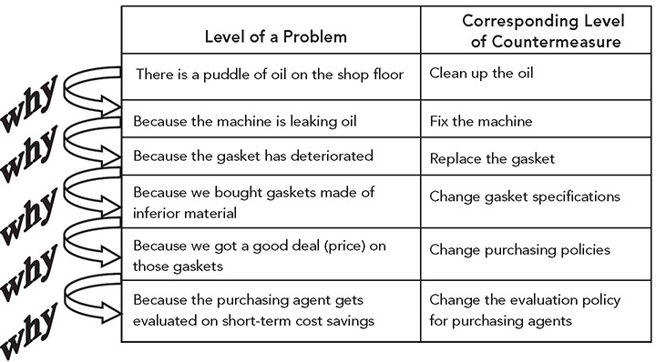

**Figure 12.1** “Five whys” cause investigation questions.

_Source:_ Peter Scholtes, _The Leader’s Handbook_ (Toyota Motor Company).

A life-and-death example\* of the importance of going to the gemba to understand the actual cause revolves around a problem that arose in 2013 at a Midwest US pediatrics hospital. The presenting problem was three blue babies, meaning they stopped breathing and turned blue. Sensors were attached to the babies, and there was an elaborate signaling system run by computer. When a signal indicated a problem, the expected response time was 30 seconds, but the average was an alarming 150 seconds. This was a crisis—heads would roll; serious changes needed to be made. It was serious enough to rise to the attention of the president of the hospital, who convened a group of 30 subject-matter experts to fix the problem.

The team set aside four hours to discuss this serious issue. Unfortunately, the members of the team began with a conclusion in mind: “We need a new computer system to fix the problem.” Their main rationale was “our clinicians were highly trained and good people. They would not intentionally harm babies.” Therefore, the fault must rest with the computer system. The estimated cost for the new computer system was a hefty $5 million. Nonetheless, they felt certain they knew the root cause and this was the necessary solution, and they were angry at the existing IT vendor for doing this to them. At that point, expecting the group to ask the five whys would have quickly devolved into the five whos, getting them even angrier as they identified more and more people to blame.

Edward Blackman, who headed up continuous improvement for IT, had been asked to the meeting. He was pretty certain he was invited just to rubber-stamp the team’s conclusion, but he could not stand by idly and let the hospital spend millions of dollars on computer technology that might not even solve the problem. He had to find a way to get this powerful group to reopen the investigation of the causes of the problem, and he had always learned important things by going to the gemba. What he did not want to do was to go off on his own and investigate and then have to report back to the team members that they were wrong—which would almost certainly lead to defensive reactions. Instead, he respectfully asked them if they would be willing to go to the gemba to investigate the problem further. The actual clinic was just a walk upstairs, so they agreed as long as it was quick. They had plenty of time since the meeting had been scheduled for four hours, and they had spent less than an hour getting to what they were sure was the root cause and solution.

Before beginning to study the gemba, Blackman gathered key stakeholders, including the director of the wing, nursing managers, nurses, IT analysts, quality coordinators, technicians, and administrative assistants, and spent 10 minutes in a conference room discussing what was really going on. The driving question was “What is actually happening?,” not just what should be happening according to procedure. It was clear that nobody really knew, so they hit the gemba and proceeded to investigate for two hours. They interviewed people responsible for the process, they videotaped and timed responses, they played the roles of patients and responding clinicians, and they value-stream mapped the current-state process.

A picture started to emerge, and it became clear to all that the problem had little to do with a bad computer system. It was an issue of how the existing software was set up and how people, including patients’ families, were trained. The map of the floor in Figure 12.2 gives a picture of what was happening. On one side of the oval-shaped floor are the patient rooms for babies. In the center of the oval, out of the line of sight and sound of the patient rooms, is the registration desk, where the alert messages were received.

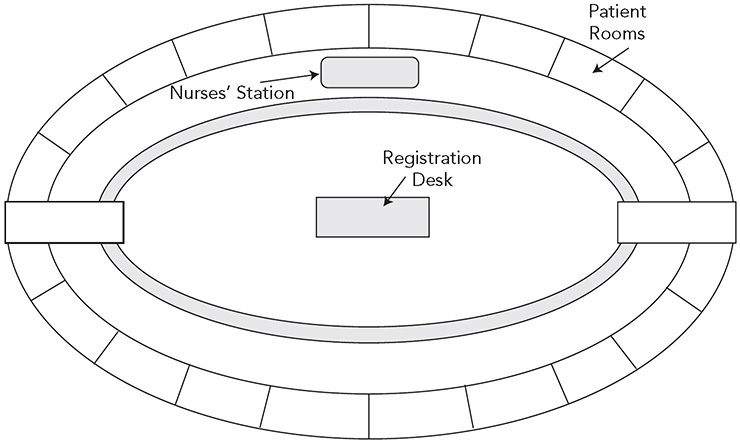

**Figure 12.2** Hospital floor layout for babies.

When the group went to talk to the administrative assistant at the desk, Edward asked to do the questioning, as he did not want a bunch of high-powered people intimidating her and casting blame. He asked what happened when she received an alert. The answer: “I turn it off.” The crowd was getting restless. He calmly asked why. Answer: “Because they are always false alarms.” The murmuring of the crowd grew louder. Edward asked how she knew that. Answer: “When there is an alert, I am supposed to get a voice follow-up. If there is no voice follow-up, I assume it is a false alarm. The parents can signal for help or I can get an automated signal from sensors on the babies detecting a breathing problem. The babies roll around all the time and trigger the sensors stuck onto them, causing mainly false alarms” (see the process flow in Figure 12.3). The crowd started questioning whether they really understood what was going on and were now more open to investigation.

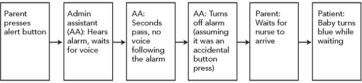

**Figure 12.3** Current process for parents alerting of blue baby to get action.

There were other discoveries. For example, purchasing had ordered the wrong sensors, ones designed for adults, which were less sticky than the version for highly active babies. When they came off the baby, they would automatically trigger. In addition, the sensors were supposed to be changed out every 12 hours, but there was no way of telling if the 12 hours had passed and the sensors were expired. There were multiple colored lights outside each patient room to alert responders to what was happening in the room, but nobody seemed to know what they all meant.

Two short-term changes with the biggest impact were made that same day: (1) The administrative assistant could no longer remotely turn off alarms; only a clinician in the patient room could turn off an alarm. (2) All parents/guardians of children were trained in how to use the manual bedside alarm along with instructions posted bedside.

Longer term, other inexpensive changes were made to engineer and pilot a new process, like simplifying the light system and getting proper sensors for the babies, but none involved buying a new computer system. Results: post-intervention response time went down from 150 seconds to 20 seconds (better than target), and no babies turned blue. In addition, some of the changes were then introduced in other areas of the hospital that were experiencing similar problems.

What is the lesson from this case? It was clear that very intelligent and well-meaning people sat in a conference room and dreamed up a nonexistent scenario with no real evidence. At this point asking why five times would not have moved their knowledge threshold forward and gotten them closer to real understanding.\* They had to seek answers to why based on real facts and data, which required going to the gemba.

Ohno admonished his students to “observe the production floor without preconceptions and with a blank mind. Repeat why five times to every matter.” The real lesson was not to ask why a specific number of times, but to get facts and somehow wipe away preconceptions of both what is happening and what we assume is the solution.

**GENCHI GENBUTSU AND THE FIVE WHYS IN THE DIGITAL AGE**

Let’s consider how new technologies are changing the way we approach learning and problem solving. In Principle 8, we saw how a sophisticated company like Denso is using IoT to enhance people thinking deeply, not to replace thinking. For example, in standardized work, a lot of the detailed work of observing and recording data can be done with Drishta’s intelligent computer systems. Data are collected in real time and can be cataloged and analyzed by AI. People can call up videos and see what happened at a specific point. That allows them to focus on improvement, but it does not let them off the hook on going to the gemba. Armed with the information from the computer systems, people can arguably be more intentional about what they look for at the gemba.

As part of the annual financial results presentation on May 12, 2020, Akio Toyoda was asked what he wants to protect in this time of once-in-a-century transformation of the mobility industry. He replied:

_We have a “genba” or frontline where work gets done. That genba is real, and what we have been able to cultivate in our genba over these many years is something that no digitization or telework system, no matter how advanced they become, can ever replace in the real world. It is the real world where people have work to do, doing the work only people can, and where Toyota people capable of further kaizen or improvement are trained. With this ability to improve, I would like to make Toyota into a company that all people can have high expectations from into the future._

However, he did qualify that in the digital age some aspects of genchi genbutsu have to be rethought based in part on his experience with online tools in the Covid-19 crisis. For example, he noted that he has found some benefits to virtual meetings:

_\[By staying in Toyota City\], I have reduced 80% of my travel time, also 85% the number of people I meet, 30% of time in meetings and 50% of the documents that were prepared for meetings._ 

He further explained:

_For Toyota’s “genchi genbutsu” philosophy, going to the actual site, looking at the actual goods, I believe that we have to make a clear definition of this once again. Up to now, we placed importance on, first of all, going to the actual site, go to the “genchi,” and it was done as a matter of course. Even if we look at products, we will always have to look at the actual product and place it in front of our own eyes. No one questioned this philosophy up to now. But in the past month, we have been looking at products more through images on monitors. I think at certain stages, it is fine to see the product on the monitor but there will always be times that you will have to see the actual product. Some things can only be felt when you are at the gemba. So, for those kinds of things where you need to feel the actual products, the actual people, then that should be done at the actual site. I think we should not just say we do “genchi genbutsu” everywhere, but we need to clarify under what conditions it is necessary to actually go see._

I do not believe Akio Toyoda abandoned understanding the current condition in detail. I discussed this with former Toyota manager John Shook, who aptly pointed out the difference between the principles and the specific methods for gathering information and analyzing it:

_I believe Akio Toyoda is talking about getting back to purpose, not only in terms of being selective about when to literally go and see, but clarifying the purpose of going to see. Genchi genbutsu (or the shortened “genba”) means grasping the real situation. How you get facts and grasp the situation is actually secondary. It doesn’t mean you must always literally go and see. It means confirm what’s really happening. Same with genba’s matched pair of the five whys. The point is not to literally ask why 5 times; it means pursue understanding of causality. As for how to understand reality, use the simplest means possible, starting with the five whys. When you need more than simply asking why a few times, pull out your more sophisticated tools. Together genchi gembutsu and five whys, defined as confirm what’s really going on with any situation and understand the causes of it, must surely remain foundational._

Once again, we see a distinction between the tools and the way of thinking. The tools, in this case digital tools, can be blunt instruments if the human using the information is not thinking scientifically and solving real problems, or the tools can be fantastic enablers when coupled with critical thinking and experimentation. We saw in the case of the blue babies how computer systems were first thought of as the problem and solution, which actually could have prevented uncovering the actual causes and solving the problem.

**WHEN FEASIBLE, GO BACK TO FIRST PRINCIPLES OF SCIENCE**

When Charlie Baker was in Honda R&D, he also learned about problem solving.4 He brought that model with him when he left for other companies—but with one critical difference. The problem-solving steps were similar, except in place of “Find the root cause” was “Understand the physics.” For many of the physical hardware problems that engineers face in the automotive industry, there are opportunities to ask why in a deep technical sense. The root cause is often some known physical phenomenon. Medical doctors, engineers, and physicists draw on hundreds of years of study to identify the root cause for a given case.

When Baker left Honda to become VP of automotive seat engineering for Johnson Controls (JCI), he brought this thinking with him. Often, this did not lead to a complex mathematical model, but rather a trade-off curve; for example, as you use more of this, you increase the cost according to this curve. When it came to meeting a challenge to reduce costs for making seats, he started with first principles. What are the raw components of seats, and how much does each component cost for our competitor to make? After looking at those data, he looked at the gap between the lowest cost competitor and the JCI cost for each component. He then created a “Frankenstein” model of a seat. Theoretically, if JCI used all of the lowest-cost components, it could build a seat for about half of what it cost the company at the time. This might not be feasible since these components may not work together, so Baker set the challenge to a design team at a 30 percent cost reduction. Going a step further, Baker worked with finance to develop cost models. What in the manufacturing process influenced the cost of a component? Then reversing the logic, what would the manufacturing process need to look like to achieve the best-practice cost targets? The design team achieved the 30 percent cost-reduction target through creative product and process engineering.

I found it interesting that Elon Musk was using the same type of first-principle logic for his breakthrough engineering of electric car components. “What are the physics of it? How much time will it take? How much will it cost?”5 For example, batteries are one of the biggest costs of an electric car and one of the key constraints is having enough battery power for the desired range. Musk became impatient with generic talk about what batteries cost from vendors and pushed his engineers to go back to first principles. When they broke the battery down to its raw materials, they concluded they ought to be able to build one at about half the cost of purchasing one and could control the supply of the huge numbers of batteries they would need—leading to the huge gamble of building Tesla’s famous battery Gigafactory 1.

**WHAT ARE OBSTACLES TO SCIENTIFIC THINKING, AND HOW DO WE OVERCOME THEM?**

I have not found it difficult to convince executives and managers that scientific thinking is a good thing. “Management by fact,” as preached by Dr. Deming, is widely accepted and easily embraced. But what this ends up meaning in the context of a high-control organization is “get the data on key performance indicators and hold people accountable for results.”6 Accountable means extrinsic motivation—tie results to rewards and punishment—get on the bus or off the bus.

What Toyota is doing is something different—developing in people a way of thinking to clearly understand the direction; go and see and ask why to deeply understand the current condition; and experiment and learn on your way to the goal. This can be thought of as “practical scientific thinking” and fits the model of the improvement kata that is explained later in the chapter. In a sense, we can view the practice of coaching people to think scientifically as a countermeasure to our natural inclination to jump to conclusions, assume we know, and commit to solutions before we have evidence that they work.

Our neurological apparatus was formed over millions of years through an evolutionary process of survival of the fittest. Some researchers suggest that evolution may have started with the reptile brain that has basic life preservation functions like breathing, eating, procreating, and the the fight, flight, or freeze survival responses. Then evolving on top of that was the mammal brain and the limbic system, where memories and emotions live—pleasure, pain, fear, defensiveness, and seeking safety. These emotions tend to be reflexive and do not lead to well-thought-out plans. Finally, the neocortex is the distinctively human part of the brain, where we evolved language, self-consciousness, abstract thought, a sense of time, reasoning, and the ability to imagine things.

For most of the time period that the human brain evolved, survival meant gathering food, fighting off human and animal predators, and procreating to spread our genes. Deep reflection and “scientific thinking” did not ensure survival and the spreading of genes as well as quick reactions and physical prowess. It is therefore not surprising that cognitive psychologist and Nobel Prize winner Daniel Kahneman found in humans a natural tendency toward “fast thinking.” Slow thinking, he found, comes much less naturally and can even feel painful.7 Those who succeeded in passing on genes had brains that discouraged slow thinking, punishing them with pain for thinking too deeply. Kahneman suggests the useful simplification of thinking of the brain as having two systems operating in parallel:

 “System 1” (FAST) thinking is _intuitive thinking_ **_—_**fast, automatic, and emotional—and based on simple mental rules of thumb (“heuristics”) and thinking biases (cognitive biases), that result in impressions, feelings, and inclinations. Fast thinking dislikes uncertainty and wants the “right answer” now.

 “System 2” (SLOW) thinking is _rational thinking_ **_—_**slow, deliberate, and systematic—and based on considered evaluation that results in logical conclusions. Slow thinking requires concentration and broad consideration of problem definition and possible solutions.

He also introduced the “law of least mental effort,” which was a requirement for survival in more primitive times. Slow thinking takes a lot of working memory and is an energy hog. Natural selection did not favor slow thinkers who wasted a lot of energy thinking instead of taking actions needed to survive. So our genetic background produced in us a desire for certainty, _knowing_ what will happen and what did happen and why. As Mike Rother put it in the book _Toyota Kata_:8

_. . . humans have a tendency to want certainty, and even to artificially create it, based on beliefs, when there is none. This is a point where we often get into trouble. If we believe the way ahead is set and clear, then we tend to blindly carry out a preconceived implementation plan rather than being sensitive to, learning from, and dealing adequately with what arises along the way._

This subjects us to a litany of cognitive biases that have been well researched. With confirmation bias we seek information to confirm our predetermined attitudes and beliefs. Hindsight bias is the belief in retrospect that we knew what would happen all along. One of the most potentially damaging for society is the Dunning-Kruger effect where people who are beginners in a particular skill greatly overestimate their ability—when people are low in mastery they tend to think they are at least average or above.9 This is dangerous because if we assume we are already skilled, there is little incentive to submit ourselves to the struggle of developing skills and understanding. Think of Dallis earlier in the chapter who thought he was already expert at TPS before being subjected by his coach to the harsh realities of solving real problems.

In part, these biases reflect a physiological limitation of our brains. While remarkably we can process 11 million bits of information every second, our conscious minds can only handle 40 or 50 bits of information per second.10 We are almost forced to simplify to understand the world and act on that oversimplification. Therefore, we naturally develop templates that fill in the gaps. We see someone with certain physical traits in a certain context, then we layer onto this relatively small amount of information we can quickly process a lot of assumptions about their other characteristics. That is the basis for stereotyping people based on such things as race, religion, and gender. See a big, strong man wearing tattered clothes in an isolated alley, and you might assume he is someone violent who is on the hunt to rob or abuse you. See a young woman with a baby, and you may assume you are safe. It was also the basis for those medical staff assuming they knew the cause of the blue babies.

So what are we to do in a day and age where slow, scientific thinking is often more effective for dealing with modern-day complexity than our initial off-the-cuff conclusions? The answer is practice, practice, practice what does not come naturally, to make it more natural. As Toyota grew and globalized, with too many people for the TPS masters to coach, how could this discipline continue to be developed?

**TOYOTA BUSINESS PRACTICES TO DEVELOP SCIENTIFIC THINKING**

President Fujio Cho led the creation of _The Toyota Way 2001_. While the document laid out Toyota’s philosophy and principles, Cho realized that wasn’t enough. People needed something to practice, with a coach, to develop the mindset for continuous improvement and learn how to respect and develop people. Within a few years, he introduced Toyota Business Practices (TBP)—which, on the surface, was an eight-step problem-solving process. But Cho did not set out to create a rigid problem-solving method that always has to be followed; rather his intention was to provide a framework for developing Toyota Way thinking through practice on real-world problems:11

_The Toyota Business Practices—a standard approach of business processes and a common language for all of Toyota. Such a standardized approach is not intended to limit an individual’s way of conducting business. Rather, the standard approach provides a basic framework from which the individual can express their unique talent._

The steps of TBP, along with the drive and dedication the coach is trying to instill, are summarized in Figure 12.4\. A good TBP project is not intended to fix a nagging issue, but rather to strive in the direction of an aspirational challenge—typically with a target of four to eight months in the future. In the original version of this book, we talked about the seven-step “practical problem-solving” method. The new version of TPS has eight steps, and the largest differences are comparing the current state with the ideal state in step 1 and breaking down this big gap into tractable, smaller subproblems in step 2:\*

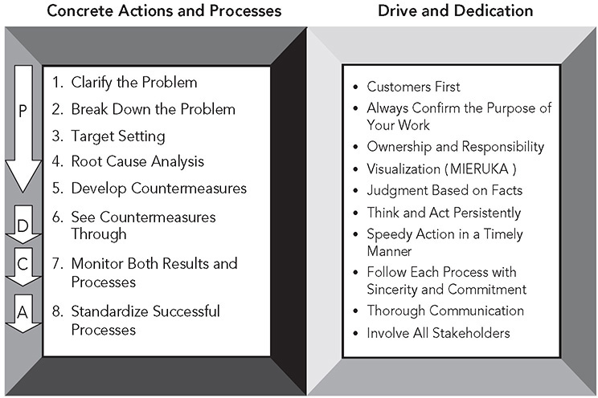

**Figure 12.4** Toyota Business Practices—Toyota’s kata for people development.

_Source:_ _The Toyota Business Practices_ (Toyota Motor Company, 2005).

1\. **Clarify the problem.** This starts with a big challenge that is appropriate for the person leading the activity and learning TBP. Then, the learner must grasp the current condition. Finally, the learner defines the ideal condition, which is compared with the current condition to visualize the large gap. In this step, there is no root cause analysis because the gap is too large and multifaceted.

2\. **Break down the problem (to a set of subproblems).** The gap between the big challenge and the current condition is too large and vague to get started. So the learner goes to the gemba to learn and break down the problem into smaller, more tractable problems—and prioritizes, selecting one to start. Learning to prioritize is important in this step.

3\. **Set a target (for the prioritized subproblem).** According to the booklet, “With enthusiasm and commitment, set challenging targets.”

4\. **Analyze the root cause (for the prioritized subproblem).** This is not to be done by asking why five times in a conference room. Go to the gemba and thoroughly investigate the process involved, based on actual facts.

5\. **Develop countermeasures.** “Broadly consider all stakeholders and risks involved.” The learner should think creatively, beyond preconceived ideas or one’s own position. It is also critical at this stage to engage key stakeholders and work to build consensus. This is where you get signoffs on your plans.

6\. **See countermeasures through (by coordinated and speedy implementation).** This is a collaborative process with those directly affected by the change as well as about informing, reporting, and consulting key stakeholders outside that group.

7\. **Monitor both results and processes.** Learn from the success and failure of the countermeasures and the effectiveness of the process you used. Be objective and consider the perspectives of the customer, company, and personal development.

8\. **Standardize successful processes.** The learner is not done until these become the new way of operating and the new processes are shared with other people across the company who might benefit.

The term “countermeasure” is an important one at Toyota. You will hear there are no solutions, just countermeasures. These are measures that members hypothesize might help counter (reduce) the gap between the desired condition and the current condition. The measures are tested, and if they help to reduce the gap, they are continued until better ones are developed. Proven countermeasures lead to standards—the best we know today until we set a better, perhaps more challenging, standard.

Even though the problem-solving process as it is laid out in documents appears to be very linear, in practice it is intended to be about iterative learning. In the first pass, the learner breaks down the challenge into subproblems, prioritizes, and then starts with number one. Addressing this first subproblem rarely gets you to the challenge. The learner goes back to review the new current condition and selects the next prioritized subproblem, and so on. As we discuss Toyota kata later in the chapter, we will see similarities to TBP. For example, the subproblem being addressed and its targets are similar to the “target condition.”

When Toyota began to use TBP for teaching, it started at the top executive level with senior sensei as coaches. You cannot coach something you have not yourself experienced. The executives, after a career of learning how to problem-solve, humbly followed the process, typically over eight months, for very large issues appropriate for their level. Then, they had to report out to a board of examiners, including Fujio Cho. In about 80 percent of the cases, they were asked to go back and do some more work. Having completed the work, they began to teach their subordinates who worked through TBP projects, acting as coaches and serving on the board of examiners—and this continued to cascade down the company. This mirrors the approach Steven Spear observed, mentioned earlier in this chapter.

The goal of TBP is to develop the management hierarchy into a chain of coaching, so that developing people becomes a core responsibility of managers, and managers do not wait for someone from the staff to do the teaching. I was at a Toyota plant where TBP had finally gotten to the level of group leaders eight years after it was first introduced to senior executives. It is a long-term process at Toyota with proven staying power.

In Figure 12.4, notice the competencies listed under “Drive and Dedication,” including “Customers first,” “Ownership and responsibility,” “Visualization,” “Judgment based on facts,” “Thorough communication,” and “Involve all stakeholders.” It is not enough for the learner to execute the eight steps well. The learner should be learning these competencies and demonstrating them to others. The apparent task of the learner is to follow the eight steps and achieve the goal, but there is a deeper, parallel process of developing this set of leadership competencies. The coach (manager) takes advantage of being with the learner who is following the steps to find occasions to provide feedback on all these competencies.

Some keys to effective feedback are to give it immediately after the behavior, focus on the behavior not the person, and do this in a context of true compassion for the person you are coaching. The coach cannot artificially create behaviors in the learner, so the coach must identify them when they occur and immediately provide feedback. That is why it is so important that the manager of the person is the coach and is around the person enough to observe behaviors in real time and provide feedback.

The TBP pattern is something that Toyota leaders should follow for addressing any complex project. It encapsulates a way of thinking that should be learned at a deep level so that it becomes the natural way to approach any problem, large or small. At the Toyota plant in the United Kingdom, taking part in a formal, coached TBP project is done at each level of a person’s career as the person is promoted, typically once every three to four years. A person undertaking a TBP is mentored by someone who has passed at least the level the person is aspiring to as “ready to mentor.” The report-out is presented as an A3 summary in a strict 15 minutes to a panel of three people, who quiz the person on the document and then pass or fail the person (pass can be “ready to mentor,” and fail can be “requires level up”).\*

Some years later Toyota developed a third phase of training focused on on-the-job development (OJD), which was designed to develop the coach. The training starts with a few days of classroom training but then is learned by coaching a TPB project. The coach in training picks a subordinate to coach through a TPB project and is coached on how to coach. So you have the learner, the coach in training, and what Toyota kata refers to as the “second coach.”

Having started in 2001, the training on the Toyota Way, TPB, and OJD is still going strong in 2020 and has become an institutionalized part of building Toyota culture.

**QUALITY CIRCLES TO DEVELOP SCIENTIFIC THINKING IN TEAM MEMBERS**

I am often asked how Toyota provides time for production team members to practice kaizen. The short answer is it does not during the workday—at least for the most part. In a sequential build process like an assembly plant, every worker is tied to the line, and if a worker leaves the process, the line will shut down. As we discussed under Principle 10, there are members who have been given the responsibility of a team leader, and there are always team leaders offline, where they have more flexibility to run experiments, collect data, and engage team members. And they can take over performing a job to allow that team member a little time to work on kaizen. But for team members to experience the entire life cycle of problem solving, Toyota uses “quality circles.”

Quality circles were introduced in Toyota in the 1960s as part of total quality control, but evolved to addressing any problem—quality, productivity, safety. These are offline activities with meetings generally after hours. Every Toyota plant in the world has an active program, and some service jobs, such as in call centers, also use quality circles. Since Toyota rarely dictates exactly how programs should be run, different plants have different ways of structuring quality circles. In Japan they are “voluntary,” though the expectation is that all production team members participate, and for the most part they do. In the US plants, they are voluntary, and participation rates are generally lower than in Japan, perhaps half the members participating at a given point in time.

The United Kingdom plant makes quality circle participation an expectation, and nearly all members are in one. In this case, the circles consist of intact teams. Each circle is led by the team leader, and the members are that person’s team. The group leader must agree on the problems selected and coaches the team leader. The members of the circle work on a given problem for six months and thus have two significant problems per year. Section managers and managers regularly check in. Quality circles do not follow the eight-step TPB process. Rather they follow a simplified six-step version with less time spent on problem definition or breaking down the problem, since the problems are relatively straightforward, for example, reducing scratches on painted vehicles.

It is an important developmental experience. As Andy Heaphy, general manager of body manufacturing at TMUK, explained:

_If we get away from the paper side of it and they start to follow the steps in everyday business, they may solve many more problems. That is what we are after._

Competition and recognition are fostered by selecting the best projects in each section and providing public recognition. Then each plant selects two of the best projects: One winning team will represent the plant in a regional presentation to the European CEO, and the other will go to Japan and present in a global forum with a senior VP presiding. The winners get awards and an all-expense-paid trip.

In addition to participating in quality circles, some team members are taken offline for a period of two to three years to work on special kaizen activities with managers, and in some cases they are placed on a pilot team to launch new products. This can become a pathway for promotion to team leader and then group leader.

**KATA TO HELP DEVELOP THE HABIT OF SCIENTIFIC THINKING: WHAT ARE THE IK AND THE CK?**

Toyota has been investing in hands-on development of people since its inception and has many people highly developed as problem solvers and coaches. That is fine, but how can those organizations outside Toyota that have not been doing this for decades get started on the journey of developing a scientific mindset? That is the challenge Mike Rother set out to address. He had written two popular workbooks on lean methods, _Learning to See_ (with coauthor John Shook) which introduced value stream mapping and _Creating Continuous Flow_ (with coauthor Rick Harris).12 Mike worked with many organizations to put these ideas into practice, but he wasn’t satisfied with the results. He did not want to leave behind just tools or one transformed process, but rather a way of thinking he was beginning to uncover from studying Toyota, as well as a way of practicing that at any gemba. So he went back to the drawing board and began a six-year research project that included testing all findings and ideas at the gemba of five companies that agreed to participate and learn together. There were two research questions:

1\. What are the unseen managerial routines and thinking that lie behind Toyota’s success with continuous improvement and adaptation?

2\. How can other companies develop similar routines and thinking in their organizations?

The first question led to identifying an underlying pattern of thinking that Rother observed, particularly among Toyota sensei and how they taught TPS through model-line projects. We have seen examples throughout this book in the work of TSSC, and we saw it earlier in this chapter in how Dallis was introduced to Toyota leadership by working intensely with guidance from a coach to achieve challenging goals. This pattern led to the improvement kata (IK) model of scientific thinking. The second question led to the conclusion that people change their habitual ways of thinking by deliberately practicing new ways, initially with some simple practice routines, aka kata.

Mike Rother discussed with me how he came upon the idea of using the term “kata.” Near the end of his research, he came across a little book about martial arts that highlighted the concept of kata. “Kata” has two meanings: One is the form, or way of doing things.\* The second is the pattern of movements to be practiced to develop fundamental skills. Martial arts black belts will teach one kata at the time that the student practices until they can naturally duplicate what they are shown. Rother describes a deep physical and emotional response when he first read about kata because it so remarkably fit what he had come to learn by studying Toyota and was trying to define for a non-Toyota audience. The improvement kata (IK) model represents a practical, everyday way of thinking scientifically, the form, and Rother then developed practice routines, or what he calls “starter kata,” for the learner and the coach. The IK is designed to be more fundamental and less complicated—more meta—than specific problem-solving methods like TBP. It represents the underlying pattern of thinking. The IK is not intended to replace problem-solving methods, but to teach a fundamental scientific pattern of thinking with the result that any method will be used in a more effective way.

The model of scientific thinking is represented in Figure 12.5, which is an intuitive visual summary of the desired pattern:†

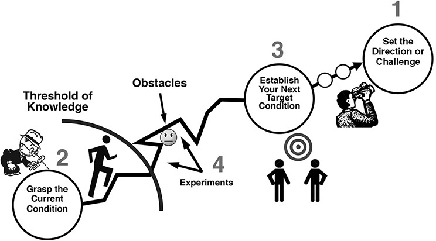

**Figure 12.5** The improvement kata pattern.

_Source:_ Mike Rother, _Toyota Kata Practice Guide_ (New York: McGraw-Hill, 2017).

1\. **Set the direction or challenge.** The challenge, usually set by management, may often seem out of reach, maybe even impossible, and thus forces the learner to break down the problem and learn through shorter-term target conditions. It is typically six months to one year out.

2\. **Grasp the current condition.** Where are we now in relation to the challenge? It is useful, but not sufficient, to calculate statistics describing the current condition. Rother recommends a routine, a starter kata, for process analysis that includes understanding the current process steps and making run charts—repeatedly observing the current process pattern and documenting the variation across trials and identifying reasons for the variation.

3\. **Establish your next target condition** **.** Based on the learner’s initial grasp of the current condition, the target condition is a shorter-term next goal that is a significant step beyond the current condition on the way to the challenge. It includes a target (outcome metric) and a condition (desired process characteristics, or operating pattern, and a process metric). This is typically one to four weeks out. Shorter is better for novices, as it is easier to envision the condition. Smaller, short-term goals have been shown to be more motivating than big long-term challenges, and the beginner learner gets more repetitions of the entire improvement kata cycle. _Warning:_ Do not attempt to plot out all the target conditions in advance, because that is way beyond your threshold of knowledge. Start with one, and when you reach it, reflect back and then set the next one in light of what you have learned, and so on.

4\. **Experiment.** Go crazy! Have fun! Be creative! This is the most enjoyable part for most people. Most of the planning to this point has been holding the learner back from trying out their ideas. Finally, some doing. Test one factor at a time if possible, predicting what will happen, running the experiment, and reflecting on what you learned. Repeat rapid cycles of PDCA until you reach the target condition, set your next target condition, and continue toward the challenge.

It is recommended this be done in pairs—a learner with a coach. The learner is leading the project and often acts as the leader of a team. The coach meets regularly, ideally daily, with the learner. Rother also developed a coaching kata (CK) that helps get the coach engaged with a “five-question” starter kata (see Figure 12.6). The learner documents his or her IK process on a storyboard, which itself is one of the starter kata routines. The coach asks questions from each category, which mirrors the IK pattern. They are nested questions beginning with the target condition and actual condition, and on the flip side are questions to reflect on the last experiment that the learner has run. Each experiment is practiced via another starter kata, following the pattern of description, prediction, results, and reflection (PDCA). The comparison between prediction and actual results provides an opportunity for learning.

Asking the predefined questions on the card is a starting point, a mental patternmaker, as they demarcate phases of a coaching cycle. As the coach matures, he or she will ask deeper and deeper clarifying questions and eventually develop an individual style. There is research under way by Tilo Schwarz to build on the coaching kata and address specific ways to respond to the learner, with the opportunity to practice in rapid cycles offline in a dojo (simulated environment for practice).13

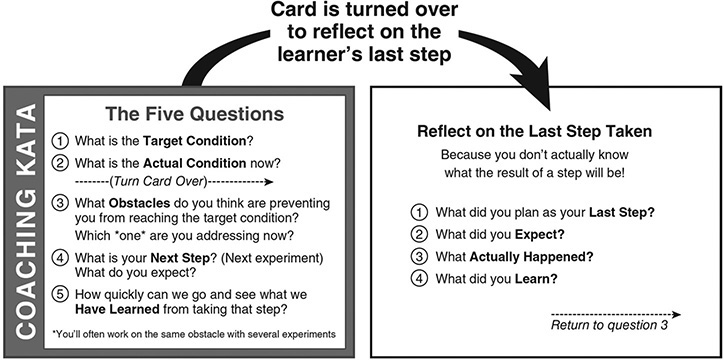

**Figure 12.6** A starter kata for the coach.

_Source:_ Mike Rother, _Toyota Kata Practice Guide_ (New York: McGraw-Hill, 2017).

**A CASE EXAMPLE: ZINGERMAN’S MAIL ORDER**

**Practicing Toyota Kata Through Collaboration Between UM and ZMO**

For several years I taught a University of Michigan course focused on the IK and CK for graduate students in industrial and operations engineering who were working on projects with local companies. Zingerman’s Mail Order (ZMO), a business discussed earlier in the book that sells online artisan foods, was the most active. The projects were done at the ZMO warehouse where it picks items, assembles gift boxes, and ships to customers. The company started its lean journey in 2004, and as I write this, it is still an avid practitioner and the UM course continues.

Students teamed with Zingerman’s production associates. ZMO management would select pressing problems and assign them to groups. One group got the most pressing problem—that of running out of items that were to be picked. Food items were organized in a market where the pickers would select the items ordered and put them in bins. This group had the challenge of reducing instances where the company ran out of an item at the picking line. The company was using a kanban system to replenish what it set out in the market for order pickers. It was highly effective most of the time, but there also were some serious failures that disrupted the timing of the order. The challenge was zero OOMs, or zero out of markets, meaning the pickers would always have what they need. This challenge was revisited for three classes of my students over three years. Experimenting records for experiments 1, 2, and 4 done by the first class are presented in Figures 12.7, 12.8, and 12.9\. As you can see, there were experiments that supported hypotheses and others that did not. For these high-achieving engineering students, it was surprising when they were wrong—and very helpful in building their scientific thinking skills. Here is a broad summary of the project and results:

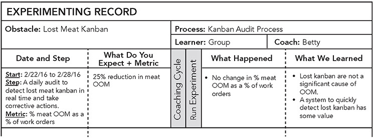

**Figure 12.7** Out-of-market experiment 1.

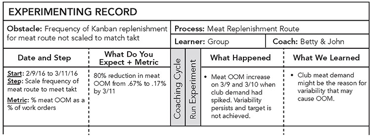

**Figure 12.8** Out-of-market experiment 2.

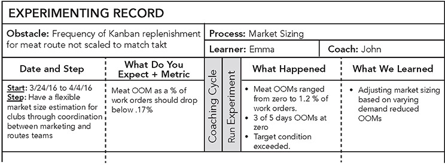

**Figure 12.9** Out-of-market experiment 4.

1\. **2016 Challenge: Zero OOMs.** While zero was the long-term aspirational vision, management set a more realistic shorter-term challenge of “limiting the stock-out defect occurrences to 0.75 percent of the total number of work orders across all product groups over an eight month period.” The project continued over several years.

2\. **Current condition (start of semester): 3 percent OOMs with continued backups at checking.** Mapping the process led to identifying kanban replenishment as the bottleneck, and the team chose to focus on one of the biggest offenders—meat products. The students spent many hours observing the process steps, following material handlers, and performing the material handling route. Among other things, the team observed that there was little connection between changing customer demand (takt) and changes in the material handling frequency or routes, that products were sometimes in the wrong locations, and that kanban were lost.

3\. **First target condition (set on February 29, 2016).** A target of 1 percent OOMs (outcome metric) by semester’s end on April 15 with the following operating conditions (desired process characteristics):

 The frequency of replenishment is aligned to the established takt.

 Number of material handlers and routes are scaled to changing takt.

4\. **Experiment.** The team conducted five experiments over the semester. Some failed to support the hypotheses, but the team learned from each one. The three experiments summarized in the figures illustrate the step-by-step learning process.

In experiment one the kata team worked to overcome the obstacle of lost kanban which they hypothesized was a significant cause of OOM. They set up a system to audit kanban and take corrective actions immediately when lost kanban were detected. There was no reduction in OOM and the team learned lost kanban were not a significant cause. (A good example of how learning via experiments works!)

In experiment two they found a way to scale the frequency of the meat route to takt and expected a big improvement, but OOM actually increased on two of the days when demand spiked. They observed that the cause of the increases on those two days was an increase in “club demand.” Food clubs are subscriptions that are shipped to customers monthly. When marketing holds a club sale it can create a sudden bump in meat orders. Experiment three focused on testing the idea that club demand was a major source of variability and supported that hypothesis.

It was in experiment four where marketing and the route team communicated directly about the club orders and adjusted the size of the market based on demand that the team hit a home run with zero out of market for three of five days. Experiment five focused on a different obstacle—gaps between the planned material handling route and what actually occurred—but the team ran out of time to collect all the data needed.

By the end of the semester, the team saw an 80 percent reduction in OOMs for meat products and reached its target condition. The project continued in subsequent years adding product groups to the scope, and although OOMs continued to peak when the temp workers started each year in December, progress was clear:

 December 2016 = 2.6%

 December 2017 = 2%

 December 2018 = 1.6%

More importantly from the perspective of the students’ future roles as managers and leaders, their thinking was changing. As the students ran experiments and participated in coaching sessions, I could see that they were moving away from their deterministic mindset, where they assumed with certainty they had the right answer, to taking a more provisional and exploratory scientific outlook. They were moving away from an “implementation” mindset, for example, viewing kanban as a solution to implement, to a learning mindset, seeing kanban as a way to help make problems visible. I also observed a marked increase in scientific thinking among management at ZMO.

**Scientific Thinking to Adapt to Covid-19**

In March 2020, ZMO, like most businesses in the world, faced a great deal of uncertainty about what Covid-19 meant for the company. As an “essential business” selling food, it was not forced to shut down operations, but initially it shrank staff and daily capacity. Staffing was inconsistent, and day to day the company did not know if it would be allowed to remain open. But then something unexpected and delightful happened. ZMO was now receiving orders in droves from customers who would normally go out to stores and restaurants, resulting in a record number of orders. The company was used to huge increases in demand around Christmas time and planned for it all year, but high demand in the spring overwhelmed it; on some days the demand was double what it had been the year before. With spacing of people and no easy way to instantly bring on more staff, fulfilling orders was getting behind. The standard practice was to fulfill orders the same day they were received, but over a three-month period, the company was now at filling capacity and quoting wait times of 8 to14 days—horrifying! Yet customers continued to buy.

Sales and finances were not a problem, but ZMO had to overcome many obstacles to create a safe and productive work environment. It was an opportunity to see if the years of learning lean and practicing scientific thinking led to a responsive, learning organization.

ZMO did not put up kata storyboards or hold daily coaching sessions, as it had to immediately react. But it had internalized the patterns and did to a great degree follow scientific thinking. This illustrates the role of any starter kata. The point is not the starter kata themselves, but the patterns of thinking and acting—fundamentals to build on—that practicing them leaves behind. Commonplace in sports and music, this deliberate-practice approach to skill and mindset development is now finding its way into the business world.

As one example, in the early stages the three managers were in disagreement on expected capacity (number of boxes that could be shipped each day) and how much they could reasonably expect people to work. One manager felt that the staff didn’t want to work full-time hours. When the discussion heated up, one manager pointed out, “Kata has taught us to look at the facts; we are assuming the staff don’t want to work. Let’s ask them.” They took a poll that day—everyone except two staff members wanted to work full-time. The power of facts.

Following the improvement kata model, the managers set long-term goals and short-term target conditions. The big challenge was to be prepared by the Christmas rush to meet demand safely using the prior year’s demand as a target. Shorter-term target conditions focused on nearer-term holidays—with goals to safely meet the increased demand for the spring sale, then Mother’s Day, then Father’s Day, then the summer sale. Each event had its unique current condition and mix of orders.

Warehouse managers deeply trained in lean and scientific thinking led the way. For example, one manager led the effort to define how to sanitize work stations every two hours. She decided to develop a safety checklist, but she realized two things. First, she should not assume there was a one-size-fits-all set of practices that could apply to all areas of the warehouse. Different practices were needed for preparing bread, picking orders, filling boxes, and material delivery, because each faced different task requirements. Second, the area leads were already overwhelmed trying to get work done, and each area could not be expected to develop its own standardized practices. So she did what a good lean manager does; she headed out to the gemba observing and even doing the jobs herself in each area to see what was being touched. She developed initial checklists and then met with staff, and for three days they tested and refined and learned, resulting in customized checklists for each type of process that then required almost no additional changes.

Beyond these checklists, problem after problem was addressed at the gemba, by studying the current condition and testing ideas—at breakneck speed. One manager, Betty Gratopp, explained:

_What did we try? Physical changes to stations, adding stations in some areas, mothballing stations on others, rescheduling when we start prep work for the next day’s orders, additional fulfillment happening at an offsite location. Screening and cleaning processes were created and documented and handed off to frontline staff. Our staffing levels were more variable than ever with quarantines and people simply opting for unemployment. We had to figure out how and when it was ok to hire. We don’t have orientation or training classes or huddles right now. We created a message board and information share wall in place of the huddles and classes._

The results were impressive. The delays in fulfilling orders shrank and shrank until most days got close to same-day shipping. Even more impressive, nobody got the virus at work. Betty described the calm she felt through this crisis:

_The scientific approach brought a calmness to how we adapted. What do we improve today? The problems we tackled were more bite size._ 

Management wanted to reward the employees who were taking risks each day coming to work. The company gave each employee, even temporary staff, a $3 per hour raise, and it increased profit sharing to 10 percent of the large profits earned—resulting in a more than a 10-fold increase in payouts from the prior year.

A survey of many businesses by the Barret Values Centre conducted from April 21 to May 5, 2020, resulted in responses from over 2,500 people around the world and suggested ZMO was not alone in accomplishing remarkable feats in the face of the virus.14 Many of the companies reported making changes in a fraction of the normal time, at one extreme making changes that would have required five to seven years in just six weeks. The survey asked the respondents to rate a set of values and behaviors as they were before the crisis, then as they were during the initial adaptation to the crisis, and finally as they were after things had calmed down a bit. There was significant movement in the reported strength of these values. From the perspective of the Toyota Way, there was both good news and bad news.

The good news was that at the middle level of staff, there was a shift from a focus on performance, control, and hierarchy (mechanistic characteristics) toward a focus and values placed on people, adaptability, and working together (organic characteristics). Engagement, trust, and communication increased in importance to mid-level staff. But the bad news was that this shift was not evident among the C-suite respondents, who increased their focus on external strategic and performance issues. The C-suite people wanted increased adaptability and innovation, but they did not increase their beliefs in the importance of engagement, trust, or communication or in general the culture of the workplace. You could say they were blind to the transformation that was taking place at the gemba and were only focused on results—a recipe for great short-term adaptation but little long-term culture change.

**PDCA AS LEARNING VERSUS IMPLEMENTING WHAT WE ASSUME WE KNOW**

Underlying assumptions of scientific thinking are that we cannot know the future in advance and that uncertainty is a fact of life, while our fast-thinking brain desires certainty and assumes we know. Repeated practice of the Toyota kata patterns helps us make the scientific-thinking zone, where we question our assumptions, more habitual. As with any new skill, scientific thinking is deliberate and slow when first practiced, which eats up a lot of our limited conscious brainpower and feels awkward. But as the scientific-thinking patterns grow more automatic, slow-thinking brain capacity is freed up and we can focus more on the details of a particular situation to address the problem at hand. Through practice your brain is trained to automatically react in a more scientific-thinking way, often without conscious thought.

Problem solving is central to the Toyota Way, but what I see all too often is the steps of the _method_ being viewed with an implementation mindset. We define the problem, collect some data about the current condition, brainstorm a root cause, and then select “lean solutions” to be implemented. Or in some lean circles, we “countermeasure the problem.” We quickly become committed to what we think is the root cause and to our pet solutions, mostly solutions we have used in the past with some success. In this version of PDCA (see Figure 12.10), we make commitments to implement our guesses about what will work, before we have even tried anything—in fact, this is the point of maximum uncertainty.

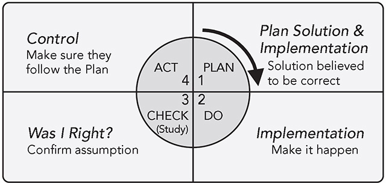

**Figure 12.10** PDCA with assumed certainty to implement known solutions.

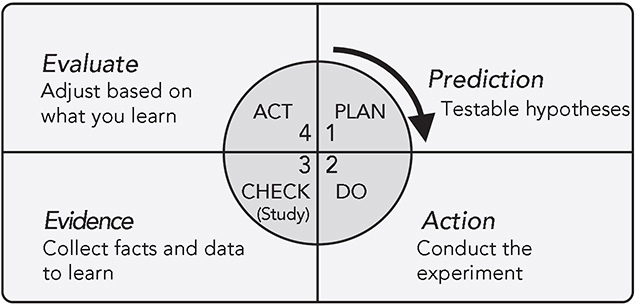

**Figure 12.11** PDCA to scientifically learn your way to a challenge.

_Source:_ Mike Rother, _Toyota Kata Practice Guide_ (New York: McGraw-Hill, 2017).

A more scientific way to think about PDCA is shown in Figure 12.11\. A plan leads to direction and to a series of hypotheses, which are each tested through experiments. In this way, we are learning and extending our threshold of knowledge step-by-step. Rother advises we might better think about the journey as navigating with a compass that shows a direction instead of starting with a detailed road map that we then follow. John Shook recalls at NUMMI that people used to say there is no GPS for getting to TPS. Many consulting firms offer their road maps to lean, but that ignores the complexity and unpredictability of the journey. Training our brain to accept uncertainty and creatively test ideas to overcome unexpected obstacles as we discover them is a fundamental skill in today’s complex, rapidly changing world. We are learning how to learn.

As President Cho warned, TBP was not intended to create a rigid way of thinking, but rather build a foundation for creative problem solving. Similarly, Mike Rother sees the IK in this same way. Here are a few key points about practicing the IK pattern with starter kata:

1\. It represents a practical, scientific thinking approach. It’s practical because it is about pursuing specific goals as opposed to the basic science purpose of understanding the nature of something.

2\. It starts with an aspirational challenge—usually six months to one year out. What big improvement will make an important difference in achieving our vision?

3\. It assumes uncertainty. If the challenge is well conceived, the solutions will not be clear at the outset, and any presumed “solutions” will quickly move beyond our threshold of knowledge.

4\. It makes rapid, iterative learning cycles explicit. Each target condition is intentionally short, such as one to four weeks. Each experiment tests one idea quickly and cheaply and includes a prediction and reflection.

5\. There generally is one coach and one learner; the learner is accountable and often leading a team to follow the process and results, and the coach is accountable for developing the learner’s skill and mindset.

6\. The practice is a small amount per day (e.g., 20 minutes), fits into busy people’s schedules, and is best for learning—by doing something every day and constantly expanding your threshold of knowledge.

Too often we problem solve in batches—a batch of specific issues leads to a batch of root causes and then a batch of solutions that get “implemented” and checked as a batch. Then we broadly deploy the batch of solutions everywhere. This is often done in a batch of time, such as full-time for one week in a kaizen event. I started to think of the Toyota Kata pattern as one-piece flow problem solving. Break down the problem into pieces, set one target condition at a time, run one experiment at a time, learn from each experiment to inform the next. Spend a little time each day learning something new. The benefits of one-piece flow should be clear by now.

**CHANGING THINKING BY CHANGING BEHAVIOR**

The term “scientific thinking” can be confusing in a number of ways. First, as we mentioned, it brings to mind trying to make everyone into a professional scientist. We are actually trying to develop people who work to achieve difficult goals in a scientific way. Second, when people imagine how to change thinking, they often think of communicating. What can I tell this person to persuade the person to think differently?

Decades of research have shown that it is difficult to change behavior by telling people things. Even successfully getting them to repeat what you said, with intellectual understanding, is not likely to impact daily behavior, which is governed more by habits. To get to habits we need to change behavior through deliberate practice, repeatedly. What matters is what we do, not what we think we _should_ do.

As we look at how Toyota develops people, we see that the company creates conditions that foster certain behaviors, like reducing inventory so problems surface quickly and visibly, which puts pressure on problem solving. But challenging people is not enough. The company also teaches managers how to coach—to find opportunities in the course of daily work to give corrective procedural feedback to their team members as they strive to move toward a goal.

Toyota kata is a structured approach for getting started with practice and feedback; it does this by utilizing small “starter kata” practice routines. You are put in a situation in which you deliberately practice working toward a challenging goal facing real-world obstacles. The more you practice the behaviors of scientific thinking, the more you develop in your brain the neurological pathways that make this a habit you are likely to repeat in the future (see Figure 12.12). Corrective feedback, preferably from a coach, is key to deliberate practice so you do not develop the wrong pathways that lead you to skip over defining goals, grasping the current condition, and testing your ideas, and instead jump to conclusions. The coach will explain some concepts but mostly will ask questions to trigger thoughts and if necessary interject a focused learning point when the time is right. Kata for practicing an intellectual task like problem solving may seem unusual, but it is much like using kata to develop a variety of skills such as a playing a musical instrument, cooking, dancing, martial arts, and sports.

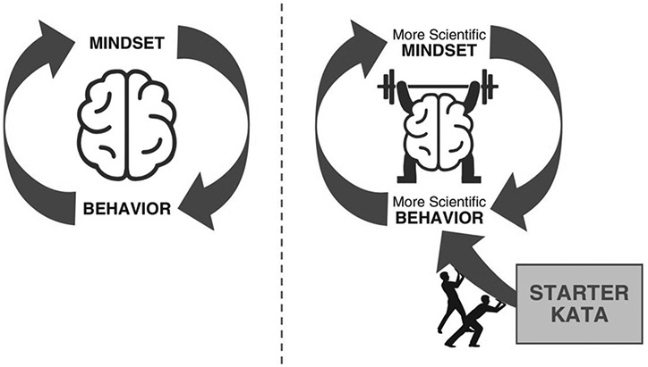

**Figure 12.12** Increase scientific thinking by increasing scientific behavior.

_Source:_ Mike Rother, _Toyota Kata Practice Guide_ (New York: McGraw-Hill, 2017).

**THE ROLE OF HANSEI (REFLECTION) IN KAIZEN**

Ultimately, the core of kaizen and learning is an attitude and way of thinking by all leaders and associates—an attitude of self-reflection and even self-criticism, a burning desire to improve. Westerners view being criticized and admitting to a mistake as something negative and a sign of weakness. People with a “fixed” mindset will see it as an attack on who they are, on their competence. So we blame others, defend ourselves, or hide the problem. In Japan, people learn the art of reflection, called “hansei,” at a young age.

Toyota found teaching hansei to American managers to be very challenging, but it is an integral ingredient in Toyota’s organizational learning. George Yamashina, past president of the Toyota Technical Center (TTC), explained it as something like the American “time-out” for children:

_In Japan, sometimes the mother and the father say to the children, “Please do the Hansei.” Some child did a bad thing. It means he or she must be sorry and improve his or her attitude—everything is included, spirit and attitude. So once the child is told, “Please do the Hansei,” he understands almost everything about what the mother and the father want him to do._

Toyota finally introduced hansei, translated as “reflection,” to its US managers at TTC in 1994 as part of introducing hoshin kanri and A3 thinking. According to Yamashina, it had to be introduced at some point:

_Without hansei it is impossible to have kaizen. In Japanese hansei, when you do something wrong, at first you must feel really, really sad. Then you must create a future plan to solve that problem and you must sincerely believe you will never make this type of mistake again. Hansei is a mindset, an attitude. Hansei and kaizen go hand in hand._

At Toyota, even if you do a job successfully, there is a “hansei-kai” (reflection meeting). Bruce Brownlee, retired general manager of the Toyota Technical Center, helped clarify this, drawing on his experience as an American who grew up in Japan:

_Hansei is really much deeper than reflection. It is really being honest about your own weaknesses. If you are talking about only your strengths, you are bragging. If you are recognizing your weaknesses with sincerity, it is a high level of strength. But it does not end there. How do you change to overcome those weaknesses? That is at the root of the very notion of kaizen. If you do not understand hansei, then kaizen is just continuous improvement. We want to overcome areas of weakness._

**INDIVIDUAL LEARNING AND ORGANIZATIONAL LEARNING GO HAND IN HAND**

The concept of a learning organization can quickly become a theoretical abstraction. What does it mean for an organization to learn? The organization is not a creature, but a concept. When we think of a learning organization, it might be more useful to think about a learning culture. Culture ties people together toward shared beliefs, values, and assumptions. In mechanistic organizations, learning becomes difficult. Some parts of the organization become the keepers of learning for their specialty and then dictate standards to the rest of the organization to be obeyed, not questioned. A learning culture brings to mind a more organic organizational form. Learning becomes a pattern. For individuals we think of “habits,” and for organizations we can think of “routines” that help people learn to work in a synchronized way.15

There are a number of ways to learn:

 Grasping a concept

 Storing information

 Retrieving and applying information

 Developing new habits or routines

This seems pretty clear when applied to an individual. And we saw how this applies to scientific thinking. You can grasp a model, like the improvement kata. You can try to simply store the _model_ in memory. You can even try to retrieve the information and apply it from time to time. But the purpose of the starter kata is to deliberately practice until elements of thinking scientifically become _habit patterns_ in your memory and then continue to evolve.16

When applied to an organization, if we take the view that the goal is simply to store and retrieve information, we can utilize all sorts of online computer programs to capture and disseminate “best practices.” Unfortunately, just because I see what you have done as a best practice does not mean that I can do it, or that I really understand it, or that it applies to my situation. At Toyota, people use the term “yokoten_,_” which means “gain widespread adoption,” but in practice it is more than that. I like Alistair Norval’s description:

_Yokoten is horizontal and peer-to-peer, with the expectation that people go see for themselves and learn how another area did kaizen and then improve on those kaizen ideas in the application to their local problems. It’s not a vertical, top-down requirement to “copy exactly.” Nor is it a “best practices” or “benchmarking” approach. Rather, it is a process where people are encouraged to go see for themselves and return to their own area to add their own wisdom and ideas to the knowledge they gained.17_

**LEARNING ORGANIZATIONS EVOLVE; THEY ARE NOT IMPLEMENTED**

It took Toyota several decades to build an organization in North America that bears a resemblance to the learning enterprise it built over most of the last century in Japan. Moving people from firefighting and short-term fixes to long-term improvements is an ongoing process at Toyota.

The Toyota Production System itself embodies the learning cycle of plan-do-check-act. The house in Figure 12.13 depicts the cycle. In the plan stage, you develop a vision of one-piece flow, something to strive for. Then, in the do stage, you experiment and learn in the direction of the targets in the roof. Jidoka is the check, comparing the actual to the target to surface problems, including unexpected problems arising from the changes you made. Every andon pull signifies a new problem to address. The foundation is where we standardize the new practices with the goal of developing new routines. And the cycle repeats.

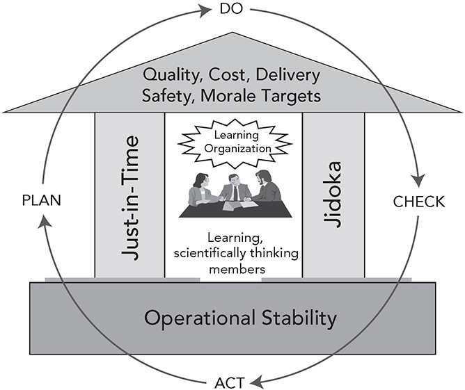

**Figure 12.13** The Toyota Production System as cycles of plan-do-check-act.

When he became president of Toyota, Fujio Cho saw the company devolving into local cultures around the world, without strong bonds or common language and thinking. The countermeasure was to develop a global standard of principles and ways of thinking, along with coached practice routines—Toyota developed some kata. These were the Toyota Way 2001 model, Toyota Business Practices, and on-the-job development, and they were transformational.

Mike Rother has created more universal kata for scientific thinking for the rest of us outside of Toyota, which can even apply in everyday life. These days he spends a lot of his time with elementary, middle, high, and vocational schools showing teachers how to coach their students in an everyday scientific way of thinking. It is a way to learn with a purpose. And it can lead to a common vocabulary and way of thinking that is the basis for shared culture.18 In the next principle, we consider how cascaded planning can clarify the direction of the company and connect the improvement goals and efforts of scientific-thinking individuals and teams horizontally and vertically.

 KEY POINTS 

 In the rapidly changing environment of the twenty-first century, organizational learning and adaptation are becoming critical for success.

 The concept of a learning organization can remain an abstraction until it is translated into a mindset and behavior of scientific thinking. People naturally prefer certainty and want to believe they are right, without taking the time to think deeply or study the actual condition.

 Fujio Cho recognized this and realized that as Toyota grew and globalized, it needed to develop people through practice and coaching. He led the creation of the Toyota Way 2001, Toyota Business Practices, and OJD. Individuals were coached in these methods through projects, one by one.

 Mike Rother has developed a non-Toyota-specific approach for developing scientific thinking based on his research into Toyota’s management system. It includes a practical, scientific thinking model and “starter kata,” which are practice routines. Using this approach and through repetition and corrective feedback from a coach, the learner builds the neural pathways to think and act scientifically.

 There is some evidence that the shock of Covid-19 pushed many companies to cut through coercive bureaucracy and become more people centered, quickly adapting and learning and even changing values toward higher levels of trust, engagement, and communication. Unfortunately, those changes often did not reach the thinking in the C-suite, which makes them unlikely to sustain over the long term.

 Think of iterative learning as one-by-one problem solving where you break the problem into pieces and learn from each experiment informing the next. It is not just that small changes can make a difference, but many small changes with a clear direction toward a big challenge.

**Notes**

1\. Kazuo Wada and Tsunehiko Yui, _Courage and Change: The Life of Kiichiro Toyoda_ (Toyota Motor Corporation, 2002), p. 130.

2\. Peter Senge, _The Fifth Discipline_ (New York: Doubleday Business 1990).

3\. https://vimeo.com/300443389.

4\. Charlie Baker, “Transforming How Products Are Engineered at North American Auto Supplier,” in J. Liker and J. Franz (eds.), _The Toyota Way to Continuous Improvement_ (New York: McGraw-Hill, 2011), chap. 11.

5\. Ashlee Vance, _Elon Musk_ (New York: Ecco Press, 2017).

6\. W. Edwards Deming, _Out of the Crisis_, MIT Center for Advanced Engineering Study (Cambridge, MA; 2nd Edition, 1988).

7\. Daniel Kahneman, _Thinking, Fast and Slow_ (New York: Farrar, Straus and Giroux, 2011).

8\. Michael Rother, _Toyota Kata_ (New York: McGraw Hill, 2009), p. 9.

9\. Justin Kruger and David Dunning, “Unskilled and Unaware of It: How Difficulties in Recognizing One’s Own Incompetence Lead to Inflated Self-Assessments,” [_Journal of Personality and Social Psychology_](./https___en.wikipedia.org_wiki_Journal%5Fof%5FPersonality%5Fand%5FSocial%5FPsychology.md), 1999, vol. 77, no. 6, pp. 1121–1134.

10\. https://www.britannica.com/science/information-theory/Physiology.

11\. Fujio Cho, _The Toyota Business Practices_ (Toyota Motor Corporation, 2005).

12\. Mike Rother and John Shook, _Learning to See:_ _Value Stream Mapping to Create Value and Eliminate Muda_ (Cambridge, MA: Lean Enterprise Institute, 1998); Mike Rother and Rick Harris, _Creating Continuous Flow: An Action Guide for Managers, Engineers & Production Associates_ (Cambridge, MA: Lean Enterprise Institute, 2001).

13\. <https://www.kata-dojo.com>.

14\. https://www.valuescentre.com/covid/.

15\. Robert E. Cole, “Reflections on Learning in U.S. and Japanese Industry,” in Jeffrey K. Liker, W. Mark Fruin, and Paul S. Adler (eds.), _Remade in America: Transplanting and Transforming Japanese Production Systems_ (New York: Oxford University Press, 1999), chap. 16.

16\. Charles Duhigg and Mike Chamberlain, _The Power of Habit: Why We Do What We Do in Life and Business_ (New York: Random House, 2012).

17\. https://www.leanblog.org/2011/05/guest-post-what-is-yokoten/.

18\. Mike Rother and Gerd Aulinger, _Toyota Kata Culture: Building Organizational Capability and Mindset Through Kata Coaching_ (New York: McGraw-Hill, 2017).

\_\_\_\_\_\_\_\_\_\_\_\_\_\_\_\_\_\_\_\_\_\_\_\_\_\_\_\_

\* This section is summarized from Steven J. Spear, “Learning to Lead at Toyota,” _Harvard Business Review_, May 2004, pp. 1–9.

 As conveyed to me by Edward Blackman who led continuous improvement for this healthcare provider.

\* Based on _The Toyota Business Practices_ booklet, Toyota Motor Company, 2005.

\* Explained to me by Rob Gorton, Corporate Planning & External Affairs, describing what people do at Toyota Motor Manufacturing United Kingdom.

\* One translation of “Toyota kata” is “Toyota Way.” My former student Mike and I still laugh about this and smile at what has turned out to be an interesting confluence in our investigations around Toyota.

† An intuitive and visual guide is found in Mike Rother, _Toyota Kata Practice Guide_ (New York: McGraw-Hill, 2017).
