 Principle 13 

**Focus the Improvement Energy of Your People Through Aligned Goals at All Levels**

_Life is what happens to you while you’re busy making other plans._ 

—John Lennon, lyrics from “Beautiful Boy (Darling Boy)”\*

I first learned about hoshin kanri, aka policy deployment, in the 1980s when consulting for Ford as it adopted it as part of a package of Toyota management practices. The concept was simple. At the top of the company, develop the policy that will allow the company to perform well in the business environment (mainly profits in Ford’s case), deploy the policy down into the organization with some give-and-take discussions called “catchball,” and when all the people in the organization have their targets aligned to the top-level policy, let it rip. Those who met their targets were rewarded, and those who didn’t . . . well. What sane CEO would not want that? In a command and control organization, which Ford was at that time, it was like giving candy to a baby. And to make it even more sweet, it was all done in the name of collaboration and participative management. After all, the little people got to play catchball.

After spending more time studying the philosophy behind hoshin kanri (HK) at Toyota and how it operated, I realized there was a night-and-day difference in the thinking at Toyota compared with what I saw at Ford. Toyota had introduced HK as part of total quality control in the early 1960s. By then TPS was spread across Toyota plants, and quality at the plant level was good. But senior executives wanted excellent, and they realized it was necessary to develop aligned quality improvement plans vertically and horizontally across the company. They set as a challenge to win the prestigious Deming Prize for Total Quality Management, which they did in 1965\. Toyota never looked back. HK became a core part of Toyota’s culture.

The way of thinking was clarified for me about 25 years later when I was working with the vice president of sales and service at Volvo, Einar Gudmundsson. Gudmundsson took my work with Gary Convis on developing lean leadership1 to heart and worked on transforming his leadership approach to stimulating improvement through coaching. As part of this work, his organization adopted hoshin kanri. He had been at the nexus of Volvo’s traditional command and control style and this new way of leading. He modified the Toyota diagram of HK from our book and contrasted it to Volvo’s traditional way of planning (see Figure 13.1).

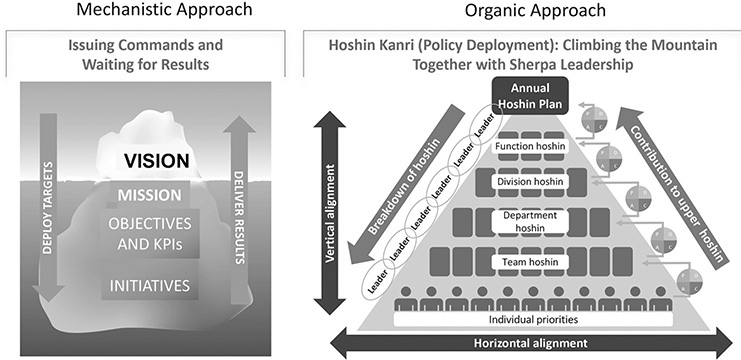

**Figure 13.1** Mechanistic versus organic view of hoshin kanri (aka policy deployment).

_Sources:_ Volvo Car Corporation (left); adapted from Toyota Motor Company (right).

The CEO of Volvo developed the strategy and led an annual planning process with something they thought of as catchball with vice presidents, leading to a business plan for each business unit. The vice presidents then deployed their objectives down through the organization. Once the objectives were determined, the senior executives met in a classy boardroom to review the results and issue orders. Gudmundsson realized that the executives’ approach was unsatisfactory. It made him think of an iceberg metaphor. The senior executives could only see as far as their own desired goals and the results that were rising above the water level. What was happening in the larger part of the iceberg, below the water level, was largely invisible, and the executives did not believe the details concerned them.

Gudmundsson started to think about hoshin kanri in a different way. It was like mountain climbing. Selecting the mountain, setting the schedule, getting the resources, and planning the climb happened from the top, but then as a senior leader in the execution stage, he had to climb down the mountain and act as a sherpa—guiding, supporting, and developing leaders. Climbing a mountain never goes as planned, so the initial plan is just a starting point. The ability to adapt and respond to the obstacles faced is the difference between success and failure, sometimes life and death.2

In an organic approach, the leaders are connected through interlocking goals and plans, and the ability to achieve results is as strong as the weakest link, so leadership development must be a priority. In fact, the intense discussion of challenging goals and plans and the process of working to achieve these objectives are a great opportunity for leadership development. Hoshin kanri is as much a process of developing people and culture as it is a tool for deploying strategy and getting results. Gudmundsson informed the CEO that his chair in the executive meetings would often be empty because he was out at the gemba. He proceeded to deliver record profits from his sales and service organization that helped at a time when auto sales were losing money.

**HOSHIN KANRI IS AN ANNUAL PROCESS OF WORKING TOGETHER TOWARD A VISION AND STRATEGY**

The overall flow of the annual process is summarized in Figure 13.2\. Hoshin planning starts at the top of the organization with an environmental scan and a strategic plan. What are the risks? What trends will influence the organization’s success? How can we position the organization for long-term success? What is the distinctive competence of the organization? We discuss the role of strategy and how it relates to effective execution under Principle 14\. Suffice it to say at this point, many companies we have worked with do not have much of a strategy other than—sell more, lower the costs, and make more profit. In contrast, the strategy should tell me why customers should prefer your products and services over those of competitors. What is distinctive? What will you focus on doing, and what will you not do?

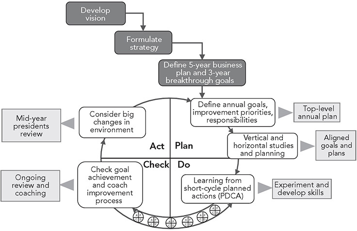

**Figure 13.2** Overview of the hoshin kanri process.

Toyota creates a ten-year global vision roughly every decade, which is converted into more concrete goals in a five-year business plan and then gets translated into one-to-three-year breakthrough objectives. At the time of this writing, the company’s Global Vision states, “Toyota will lead the future mobility society, enriching lives around the world with the safest and most responsible ways of moving people.” It will do this by “engaging the talent and passion of people who believe there is always a better way.”

A key milestone of hoshin kanri is the president’s address at the beginning of the fourth quarter of the year when he presents the global hoshin items and launches three months of hoshin planning across the company. However, individual units have a good idea of what is expected in advance and work in the third quarter on reflection and preparation. The detailed hoshin process across the company involves planning, communicating horizontally and vertically, building consensus, and committing to targets (see “Hoshin Kanri at TMUK” later in the chapter). The end result of this annual planning is many A3 reports that cascade through the organization and become increasingly focused on specifics the further down in the organization you go.

At the end of this planning period, it would be a mistake to send people off to go implement. As Gudmundsson discovered at Volvo, it’s more effective to view achieving challenging objectives as mountain climbing. You have a plan, you have made all the preparations you can, and now you have to face all the unanticipated obstacles of climbing the actual mountain. This is a process of many PDCA cycles; it requires a great deal of learning and scientific thinking. It is also where leaders take the time to develop their people and coach and challenge them to achieve great things. In Toyota, they teach that the keys to effective hoshin kanri are leader competencies in problem solving and on-the-job development.

In a mechanistic organization, the review process is formally scheduled and usually complex—but at Toyota this is not the case. At Toyota, there are two major reviews for the whole company, midyear and year-end. But there are constant reviews and dialogues throughout the year, including within Toyota’s board of directors, which is mostly an internal board led by the president. Most reviews are local in various parts of the organization, from shopfloor work groups to engineering product groups to sales groups focused on particular vehicle segments. There are checkpoints and daily reviews of progress nested within the management hierarchy. In Toyota manufacturing, each level of the management hierarchy from group leaders to the plant manager meets daily in standup meetings next to visuals on a board and wall to discuss yesterday, today, and tomorrow and consider overall progress. As a result, there are no big surprises in milestone reviews; mostly, they are reflection events. At the halfway point in the year, there may be some major changes in the environment that call for adjusting the hoshin. For example, the coronavirus pandemic greatly affected the original 2020 hoshin.

**THOROUGH CONSIDERATION IN PLANNING AND DECISION-MAKING (NEMAWASHI)**

Throughout the hoshin process many decisions must be made. Employees outside Japan who joined Toyota after working for another company faced the challenge of learning the Toyota approach to planning and decision-making. Because Toyota’s process of consensus decision making deviates so dramatically from the way most other firms operate, this is a major reeducation process. New employees wonder how an efficient company like Toyota can use such a detailed, slow, cumbersome, and time-consuming process. Some Americans jokingly refer to Toyota Motor Manufacturing as “Too Many Meetings.” But all the people I have met who have worked for or with Toyota for a few years become believers in the process and have been greatly enriched by it—even in their personal lives.

For Toyota, _how you arrive at the decision is as important as the results of the decision_. Taking the time and effort to do it right is mandatory. In fact, management will forgive a decision that does not work out as expected if the process used was a good one. A decision that by chance works out well, but was based on a shortcut process, is more likely to lead to a reprimand from the boss. Toyota’s secret to smooth and often flawless implementation of new initiatives is careful, up-front planning. Underlying the entire process of planning, problem solving, and decision-making is careful attention to every detail. Often part of the planning process is running experiments in a pilot. This behavior is associated with many of the best Japanese firms, and Toyota is a master at it. No stone is left unturned.

Thorough consideration in planning and decision-making follows a scientific approach similar to what we saw with problem solving. It includes five major elements:

1\. Understanding the problem or issue and explaining its importance and priority.

2\. Understanding the current condition including possible causes for the issue, asking “Why?” five times.

3\. Broadly considering alternative approaches and developing a detailed rationale for the preferred approach.

4\. Building consensus within the team, including Toyota employees and outside partners.

5\. Using very efficient communication vehicles to execute steps 1 through 4, preferably one side of a sheet of paper (A3 size).

There are a variety of decision-making methods used at Toyota in different situations. These range from a manager or expert making a decision unilaterally to a group developing a consensus. As shown in Figure 13.3, the preferred approach at Toyota to making important decisions is group consensus with management approval. But management reserves the right to seek its own group input and then make and announce a decision. The manager will generally decide only if the group is struggling to develop a consensus and there is an urgent need for a decision. The philosophy is to seek the maximum involvement appropriate for each situation when there is time available and the quality of the decision is important, and to seek the least involvement if there is urgency to the decision or it is a straightforward issue.

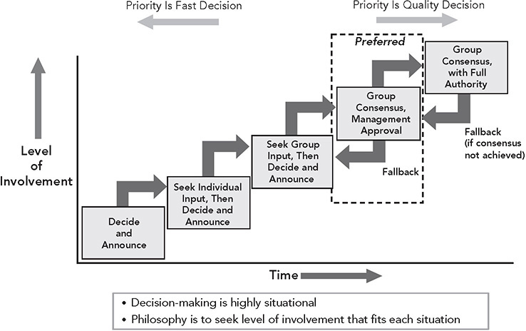

**Figure 13.3** Situational involvement and consensus in planning and decision-making.

_Source:_ Glenn Uminger, former general manager, Toyota Motor Manufacturing North America.

Getting consensus is done through “nemawashi,” which translates to “going around the roots,” a process of digging around the roots to prepare the tree for transplant. At Toyota, it means gathering broad input from people with a stake or with special knowledge and, in the process, building consensus. You are preparing the people, and generally by the time the final decision is made, all have agreed to it even before a formal meeting. Consensus does not mean everybody agrees 100 percent, but it does mean that everybody’s input is considered. It’s expected that everyone involved will support the final decision 100 percent.

One example of the nemawashi process is the way the broad circulation of ideas works in the early stages of product development. Before the styling of a vehicle is even determined, Toyota puts an enormous amount of effort into evaluating the early designs and thinking through possible engineering and manufacturing issues. Each design is meticulously analyzed, and countermeasures are developed through “study drawings”—sketches that include possible problems and alternative solutions. When the study-drawing phase is completed, the collective drawings across all engineering departments are put together into a binder called the K4 (shorthand for “kozokeikaku”_—_a Japanese word referring to a structure plan—the study drawings that collectively address the structure and integration of the vehicle). One day I met with Jim Griffith, who at the time was vice president of technical administration. He looked frazzled. I asked him why, and he told me he had just gotten a K4 on a new vehicle to review. Griffith is not an engineer, so I asked why an administrator would get this document. He seemed surprised I would ask and responded that Toyota is always looking for broad input, and he, too, will have opinions about the vehicle.

He was frazzled because this was clearly a challenging task for a nonengineer, and he felt obliged to take it seriously and provide some useful input. As it was, well over a hundred signatures were required on the K4\. Jim was a vice president and very well established at Toyota, so he could have just blown off the assignment. But he knew that if the chief engineer was asking for a nonengineering opinion and he had to sign off on the document, there was a reason. The process matters, and every member must take the process seriously. Perhaps he might see things that others missed. In any event, he knew his opinions would count.

Alan Ward was a professor of mechanical engineering but prior to that was a practicing product development engineer. He had endured the trap of getting committed to a particular idea, creating the engineering drawings, and then discovering problems in the test stage which required many design iterations to fix the original idea. He thought of this as “point-based design” and believed it was a trap. Better, he thought, was “set-based design” where you consider a broad set of alternatives, then systematically narrow the alternatives considering a range of factors and a range of perspectives. Alan and I traveled through Japan to see if Japanese engineers were more likely to think in terms of sets of alternatives. We hit gold at Toyota where set-based design seemed to be everywhere.3 This same way of thinking applies to any complex decision. Toyota prefers a broad and creative search process at first, to avoid getting locked into an inferior plan or solution that has to be corrected through wasteful iterations. Like a funnel, they start broadly with many alternatives and then narrow toward a decision.

**THE A3 STORY FOR COLLECTIVE WISDOM AND MAKING THINKING VISIBLE**

The inconspicuous A3 report is documented on A3-size paper, about 11 inches by 17 inches (ledger size) in the United States. At Toyota many years ago, it became the standard for telling a story with facts—one side of one sheet of paper to tell a story, preferably with figures and diagrams and few words. At Toyota, it is a key tool for nemawashi, a crisp and clear explanation of the current thinking that is used to get critiques and generate ideas.

Most commonly adopted outside Toyota is one type of A3: problem-solving stories. If you type “A3 problem-solving template” into your search engine, you’ll find bunches of free downloads. The formats are abundant, but effective use is scarce. What many organizations miss is that the A3 is not just a problem-solving report that summarizes what happened, but also the start of a problem-solving process that unfolds over time with give-and-take with the coach and other stakeholders. Looking at it through the lense of kata, instead of viewing the steps on the A3 as a method, think about these processes as practice routines for developing a scientific way of thinking. Perhaps the most important use of an A3 is to make the thinking of a learner visible for coaching. This was well explained by John Shook in _Managing to Learn_.4 Shook encountered A3 in 1983 when he became the first American manager for Toyota in Japan. His first boss emphasized that he needed to learn how to “use the organization” to get anything important accomplished. His boss coached him on how to use A3 as a tool for using the organization.

The A3 report came to be a hot tool for lean practitioners outside of Toyota. After all, Toyota was the benchmark and used A3, so lean companies should use A3 too. When Shook saw how it was being used, he shuddered. He had gone through so many years of training and practice on how to define a problem, how to deeply observe the actual process, how to ask questions, and how to conduct nemawashi—all the while constantly responding to questions and challenges from his various coaches. It was typically intense and exhausting.

Shook wrote _Managing to Learn_ to introduce the Toyota management process. He was not trying to teach the format of an A3 report, but rather he said the A3 should be thought of as a hook or an artifact to assist a manager in coaching others. As John writes in the book:

_I discovered the A3 process of managing to learn firsthand during the natural course of my work in Toyota City. . . . My colleagues and I wrote A3s almost daily. We would joke, and lament, that it seemed we would regularly rewrite A3s 10 times or more. We would write and revise them, tear them up and start over, discuss them and curse them, all as ways of clarifying our own thinking, learning from others, informing and teaching others, capturing lessons learned, hammering down decisions, and reflecting on what was going on._ 

There are versions of A3s for problem solving, proposals, status reporting, and information sharing. Sobek and Smalley discuss these various A3s with many examples drawn from Toyota in _Understanding A3 Thinking_.5 Whether problem solving or planning or proposing, the point is to reflect and embed PDCA into the entire process. Good A3s have PDCA built in, except perhaps “information sharing” or status report A3s, and in those cases, they are often interim stages to support a broader PDCA story.

As we will see later in the chapter in the example from Toyota in the United Kingdom, A3 reports are key tools throughout the planning and execution of hoshin kanri, including the initial stage of reflecting on the previous year’s hoshin and results. The proposal story becomes central in the planning phase. One example of a proposal A3 is in Figure 13.4\. This was not driven by hoshin; rather it originated from a problem brought up by engineers at the Toyota Technical Center and championed by the head of purchasing.

The problem was that most purchases were for less than $500, yet these small purchases required the same arduous paperwork as major equipment costing hundreds of thousands of dollars. It seemed like a reasonable request, but at Toyota the executives want the facts and data and rationale, and they want to know that this was all well thought through with input from key stakeholders. The A3 report recommended Toyota issue credit cards for minor purchases. It included a description of the various controls to be put in place to prevent misuse, such as blocking out personal purchases from grocery stores and jewelry stores. They had already started a pilot to test the idea. By the time the proposal was formally presented, the executives involved had already contributed to the process and knew well what was in the proposal. It was approved in a few minutes. What was important was the process. We do not see here all the ideas that were considered, rejected, and refined; the torn-up A3s; the nemawashi; and the research done—but it is evident there was careful thinking about many details. The person who created the A3 was self critical about all the words in the document and would have preferred more figures.

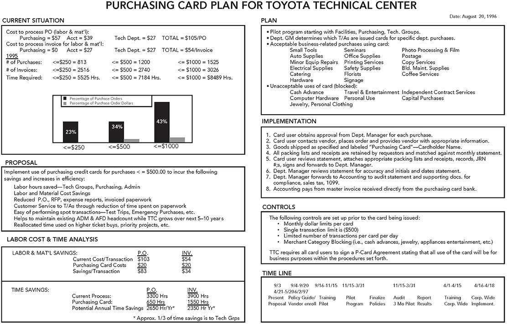

**Figure 13.4** Example A3 proposal story for planning at Toyota.

**HOSHIN KANRI AND DAILY MANAGEMENT GO HAND IN HAND**

Let’s return to hoshin kanri. Technically speaking, hoshin kanri focuses on breakthrough objectives led by senior management, while the work groups focus on smaller improvements directed toward targets on key performance indicators (KPIs), but at Toyota they are blended together (see Figure 13.5).\* Within TMUK, people use an analogy that identifies the strategic plan as the intended “road” to the desired future state of the organization and the boulders and rocks as the obstacles to get through. The boulders make the journey uncertain and detailed road maps unrealistic, although in most cases even the road is not clearly laid out in advance. At TMUK people are taught that “big boulders require organizational hoshin to remove, while small rocks can be improved through daily kaizen.” The heavy lifting of the big boulders, which generally cuts across individual work groups and even departments, is the responsibility of managers as they have the authority and the access to resources to make systemic changes. Managers are taught to lead PDCA to overcome obstacles on the way to the hoshin targets.

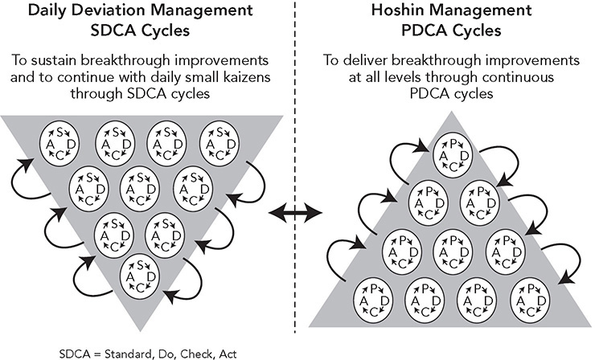

**Figure 13.5** Hoshin kanri and daily management work together.

For the smaller rocks you will often hear in a Toyota plant, “We are an abnormality (or deviation) management company.” When Toyota talks about abnormality management, what the company means is a gap from a standard. In fact, Toyota’s definition of a “problem” is a deviation from standard.

As you go into a factory and observe the production line where work is short cycle and regimented, you’ll find that there are standards for everything. At the front line, most of the problem solving is to remove the small rocks by finding and solving deviations from existing standards. Examples might be that the filters are not being changed on schedule or that there are scratches on the product that violate quality standards; or perhaps process 5 keeps getting behind the planned cycle time, or the person on process 3 is repeatedly violating ergonomic posture standards, or there was a missing bolt on one vehicle for process 6\. Thus, Toyota uses the acronym SDCA (standard-do-check-act), where the starting point is not defining a big problem and breaking it down into smaller problems, but instead focusing on individual deviations from a standard. As you solve problems one by one at the root cause, you will have fewer abnormalities and can spend less time fixing specific deviations and more time focusing on daily kaizen toward KPI targets. The KPI targets are a form of a standard.\*

I have found the distinction between PDCA and SDCA helpful at a high level of abstraction. More ambitious projects based on large challenges require a good deal of time in the plan stage to define the problem, as we saw in the last chapter with Toyota Business Practices, while smaller, more constrained issues in a specific process often can be defined more easily as a deviation from a specific standard. In reality, it is all PDCA, and includes understanding the goal versus the actual condition, getting the facts, identifying causes, and then experimenting to reach the target. This may happen more quickly for SDCA, but it still needs to happen.

Toyota developed a conceptual model to illustrate how SDCA and PDCA work together and what happens when one is missing (Figure 13.6). The model shows a disruptive process of breakthrough changes driven by hoshin, followed by a period of SDCA, and then gradually working toward KPI targets. Life, of course, is not so orderly, but it illustrates an important point. When there is a big change, there is a lot of disruption, which means a lot of variation. To reduce the variation and get closer to the standards requires a great deal of SDCA at the front line.

As we discuss TMUK’s approach to hoshin kanri and daily management in the next section, an important context is that the plant had recently launched a new model Corolla, gas engine and hybrid, based on a recently developed global architecture that was very different from the previous models—new equipment, changes in all processes, and a new product. Predictably, this led to an expected increase in deviations from quality, safety, and productivity standards—life got crazy—and a good deal of kaizen was focused on addressing these issues through daily kaizen. The plan was for people to do what they could in the launch according to plan and then deal with all the unexpected deviations through daily problem solving at the front line.

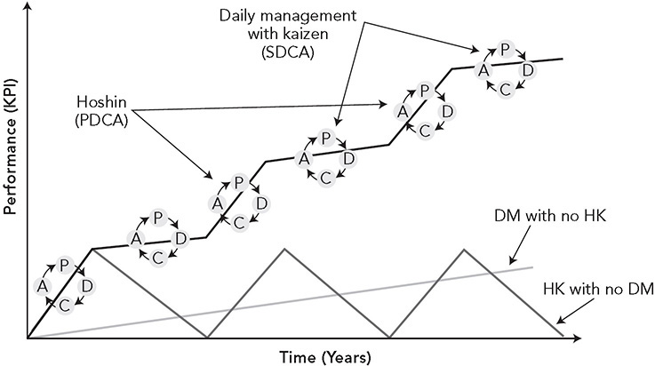

**Figure 13.6** Relationship between hoshin kanri and daily management: how top-down and bottom-up meet.

_Source:_ Toyota Motor Corporation.

At the bottom of this graph is an illustration of what can happen when a company introduces HK without effective daily management (DM). It looks like the sawtooth effect: a big jump on selected measures to meet the challenge until senior management changes the focus to the next big, new thing, and the initial effort degrades. On the other hand, killer daily management with frontline teams passionately engaged in SDCA will lead to steady improvement, but not the breakthrough architectural change needed to adapt to changing products, technology, and environments.

The idea that HK and DM go together has received widespread acceptance in the lean community. Yet there are many consulting groups that will come in and simultaneously “implement” both HK and DM broadly and rapidly. They will generally promise large cost savings that are several times their hefty fees. Usually neither will be effective for the long term. As I write this, one of my clients is facing this issue, as it was forced by headquarters to shift from a more gradual approach of developing people to what I call a smashmouth get-the-numbers-now approach. Don’t get me wrong; the company will get results, and the consultants will get paid and move on to their next engagement, with all parties happily counting their money. Many big ideas will be generated quickly by managers, long action lists with associated names and dates will be created, and the CEO will watch and pressure for results. Big changes will get done, some people will get promoted, and others will be asked to leave. Production workers will be laid off. And the processes will be in turmoil—there will be lots of variation.

The problem with rapid implementation of so many things at once is that people have not been developed to continue to improve the systems and the culture has not changed. Most of the ideas that managers under extreme pressure will generate will be big, transactional changes, like automating processes, pressuring suppliers, cutting anything or anybody not needed to get production out the door, focusing attention on large losses like scrap, changing layouts, and pressuring people to work harder. The daily management system will include lots of KPI boards and daily meetings led by leaders who do not know how to run meetings or how to improve processes. I have seen it repeatedly. It is a crude application of the technical side of lean. What the executives do not realize is that even the lean tools have both a technical dimension and a social dimension. Using only half—either half—loses effectiveness.

On a more optimistic note, I have seen companies that made some significant architectural changes such as creating flow lines, developing value stream managers, setting up kanban systems, writing lots of standardized work, and taking out a lot of low-hanging waste—and then they realized things had started to go backward. At this point, they decided to go a bit slower and deeper and start with pilots to develop effective daily management systems and train managers in problem solving—an approach that helped them evolve in a positive direction. We will discuss different approaches to change management in the final chapter.

**HOSHIN KANRI AT TMUK**

Let’s take a tour of one year of hoshin kanri at TMUK, starting at the senior management level—the plant hoshin. It starts with studying the environment. There were a number of factors that influenced the environment for TMUK. These included:

1\. **Profit contribution.** A new CEO for Toyota of Europe made a serious commitment to profit contribution, which for TMUK meant it had to compete on cost with lower-wage countries. For a three-year period, the hoshin focused on reducing total controllable cost by 10 percent per year, which TMUK accomplished through relentless kaizen in all parts of the operation—and no layoffs of regular team members.

2\. **Great Recession impact.** In this tumultuous period, TMUK closed one of its two assembly lines and offered separation incentives, which many long-service members and managers took, therefore losing a good deal of bench strength and leaving a whole line available for new business.

3\. **New-model launch.** As mentioned, TMUK launched a new Corolla that was reengineered from the platform up and required a lot of new equipment. As expected, a major launch like this is always disruptive.

4\. **Brexit** **.** This creates uncertainty, as most of the plant’s vehicles are sold in Europe, and customs costs could damage profitability.

5\. **CASE.** As Toyota shifts to connected, autonomous, shared mobility, and electric vehicles (see Principle 14), TMUK wants to be prepared for the new mobility technology and competitive in winning the right to produce these new vehicles.

**Top-Level Hoshin**

Based on these conditions, TMUK developed the top-level hoshin (level 1) for 2019, summarized in a diagram in Figure 13.7\. From the point of view of all the members of TMUK, the aspirational goal was to become a “Globally Admired Plant—Ready for Any Future Business.” They all want the plant to stay alive in the future and continue to provide a living for all the members and their families. Toyota allocates vehicles to plants, and so in a sense, TMUK’s competitors are other Toyota plants, mostly in Japan and some in Europe. TMUK wants to be at the front of the line for new vehicles, as they come on board. Successfully launching the new Corolla, meeting cost, timing, and quality targets, would show what the folks at TMUK were capable of so this was the “year of the launch.”

The plan for achieving both objectives included three themes, with some enabling systems. Theme 1 was to become the number 1 producer of the Corolla based on the global vision of three bests—best management, best member, best process. These were all defined and put into practice through the revamped floor management development system described under Principle 10.

Theme 2, “Brains not money,” is about daily kaizen with minimal capital spending. Toyota believes that “if members have the thinking of kaizen, we can take on anything.” Larger steps—steps that involve more fundamental innovation—are led principally by managers and engineers. Business targets come from the ACE 1000 European program launched in 2015 to create a more sustainable business through profit contribution that includes reducing costs, improving productivity, and increasing revenue.

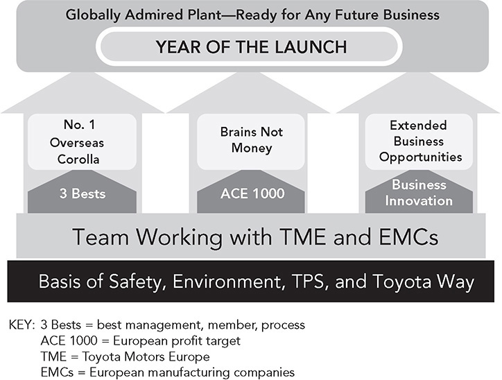

**Figure 13.7** 2019 Toyota Motor United Kingdom plant hoshin.

Theme 3 focuses on the available capacity and ways to increase profit margin beyond building the Corolla. This was assigned to a TMUK executive who had to think outside the box and move up and down the supply chain. Moving down the supply chain included bringing manufacturing of supplied parts in-house, and moving up included doing some work on sold vehicles like additional options and refurbishment. He even investigated building the vehicles of competitors, like Nissan, though that did not work out.

The foundation is safety (zero accidents) and protection of the environment (for example, 100 percent recycling, zero landfill use, 100 percent water reuse). And TPS and the Toyota Way are a core part of the foundation—the how. This conceptual vision is shown as a house and is then broken out into company targets.

Note that nobody from Toyota corporate was taking a lead on any of these issues. There were ideas like the three bests developed in corporate, support from many people, including a TPS master trainer, and key decisions like assigning the Corolla, but in many ways TMUK was expected to do and think for itself. Even generating new lines of business was an idea from within TMUK and managed internally.

**Deploying Hoshin to the Shops**

A Toyota plant is set up as a series of shops—body panel stamping, welding, paint, plastic molding, and assembly. Each shop, or sometimes a combination of shops, is led by a general manager. The general manager develops a hoshin strategy for that shop, which gets deployed to the manager level for sections within the shop.

At TMUK, Andy Heaphy was general manager of body manufacturing, which includes both press (stamping) and body (welding). He developed the shop hoshin (level 2) with input from his managers (see Figure 13.8). His hoshin is also on a (blown-up) A3, but in this case organized as a table. The top level includes a vision and commitments that align with the TMUK concept—to become “the most admired press and body shop globally” through motivating and engaging team members, developing team members to deliver outstanding results, and aiming for the three best. The group decided to have a special focus on best member and has described how it will achieve that goal through highly developed and motivated team members.

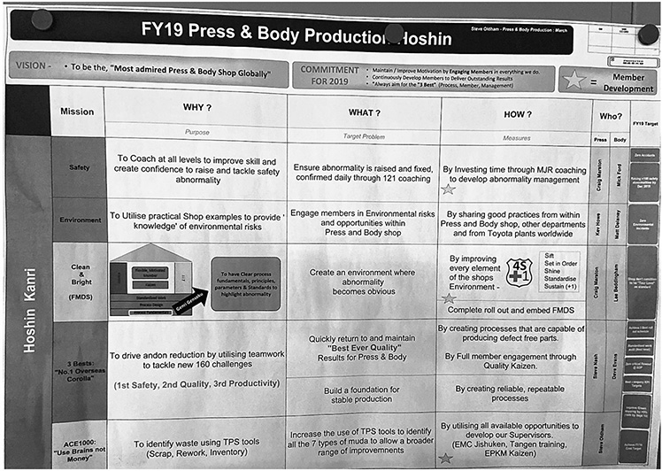

**Figure 13.8** General manager’s hoshin for press (stamping) and body (weld) production.

The meat of the hoshin is five missions that align with the top-level hoshin: safety, environment, clean and bright (FMDS); the three bests (“no. 1 overseas Corolla”); and ACE 1000 (“use brains not money”). Each mission gets broken out into a general plan with aspirational challenges like zero accidents and zero environmental incidents and some more specific targets like improve green mapping by 5 percent and achieve the FY19 cost target.

The green mapping target (called “process diagnostics” in some parts of Toyota) is related to “best process.” It is a comprehensive audit of the process against standards for areas like safety, ergonomics, walking percentage, number of returns to get parts, and complexity of member decision-making. Originally an engineering tool for developing processes at new-product launches, it is time consuming and takes training. Group leaders do this audit twice per year, and gaps provide a clear focus for kaizen. Best member includes following standardized work, proper andon use, and versatility of learning multiple processes. Best management is measured twice per year by a macro-level standardized-work audit; e.g., a job instruction sheet is in place and up to date; the team member followed standardized work and used andon correctly; and all basics are in place and used correctly. Every process gets an in-depth audit twice per year. To find areas for improving the group leader role, group leaders do a separate audit twice a year focused on the minimum job role discussed under Principle 10\. It is labor intensive and requires that the section manager follow the group leader around for a day.

The “whos” named for each mission, one for press and one for body, are then responsible to develop an even more detailed hoshin plan (level 3). We see the hoshin plan for weld quality in Figure 13.9\. In this case, there is a Gantt chart for timing of the elements of the plan. Below this on the wall (not shown in the figure) are even more detailed plans at the activity level, such as managing quality standards, reducing scrapped car bodies, and introducing a new process for control of standardized work. Even further down are targets for the three main quality outcome measures—shipping quality audit (SQA), defects per unit, and direct run rate. SQA is a global KPI, and a small number of finished vehicles are randomly picked each day and subjected to exhaustive inspection and testing—this reflects what the customer will experience and is the most important measure. The direct run rate is the percentage of car bodies that go through all welding stations without having to be pulled offline for repair. Then there is another board with a three-month quality improvement plan that is even more detailed; for example, one plan focuses on “clean body,” which is a body with zero defects.

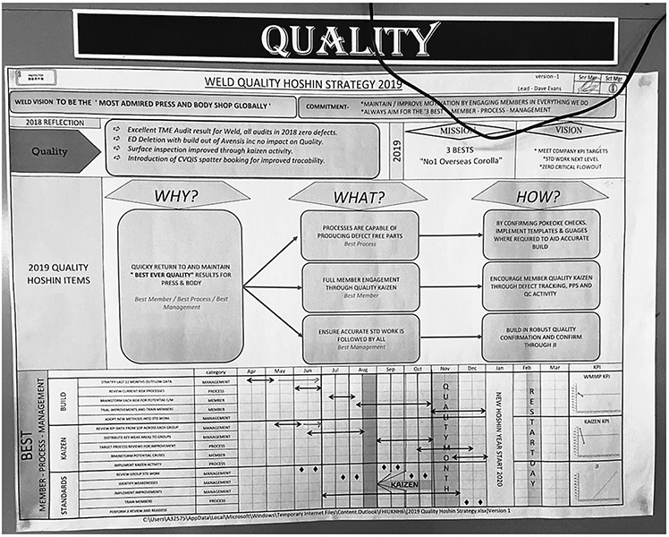

**Figure 13.9** Body weld quality hoshin strategy.

Notice that as we work down the levels, the higher-level conceptual direction is translated to detailed and actionable targets and plans. The translation requires a great deal of thought, study, and discussion. It is not just a mindless cascading of outcome targets such as “we need 10 percent cost reduction for the plant so your portion is 3 percent.” It is this difficult translation process to identify the causal factors that can influence the desired outcomes that is at the core of hoshin planning. The general manager and managers are asking: “What should I work on to deliver the results the plant needs?”

As general manager, Heaphy views every aspect of this process as an opportunity for coaching. He could create his hoshin and then deploy it by giving orders, but he understands that would not develop anyone. Instead, he presents his ideas or his hoshin, gathers input, revises, and then requests of his team: “Please develop a plan to help me achieve my objectives.” Each member then presents a plan on an A3, and that begins a coaching process.

It should be clear by now that Toyota uses a lot of paper, often A3 size. I asked Heaphy why:

_First, we are not very good at technology, and second, to see everything in an easy way is very hard to do on a computer. And when 310you have a meeting with a multitude of people, you need a very big screen; otherwise you are not going to share it. So, we tend to put things out on boards so you can share it with the group, and other people like managers and my director can come in my shop and they can have a look themselves. It is genchi genbutsu, and that can’t easily happen if it is in a database with a password. I also think it is very effective from an engagement point of view and also following the progress, having the plans on the board. It makes you wonder, what is the status of that? You are asking that question. If it is hidden away from you, what triggers you to ask the question?_

**Putting Hoshin Kanri into Action in Work Groups**

When hoshin gets to the group leader level, the concepts and overall targets are set. There is no separate group leader hoshin strategy. The group leader focuses on FMDS, including a KPI board. The KPI board has a standard layout globally (Figure 13.10). The missions rarely change: safety and environment, quality, productivity, cost, and human resource development. While the KPIs rarely change, the targets and priorities will change. For example, since TMUK was in a launch year, there were a certain number of in-line quality defects caught in the plant and ergonomic issues as group leaders and team leaders worked out the details of the new processes with team members, so safety and quality were priorities.

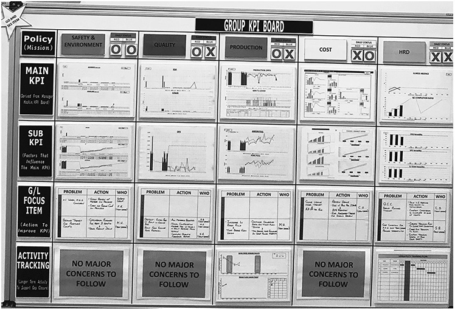

**Figure 13.10** Group leader KPI board.

The “main KPIs” are the outcomes derived from the manager’s hoshin KPI board. The “sub-KPIs” are factors that influence the main KPIs. This is critical. The group leaders cannot significantly influence outcomes by simply focusing more and trying harder; they need to have something to work on. They can work on improving the causal factors that influence the outcome. This is similar to the idea of the target condition in kata—you need both the outcome and the desired process condition. This involves causal reasoning, which is much more difficult for people than simply giving them a target to hit. As an example, in safety, the main KPI is lost time incidents, but these are rare and cannot be directly controlled. The sub-KPI is near misses in getting injured, which can be observed and are more numerous. As metrics, there are regular safety audits to assess all safety risks associated with the job, and these audits measure near misses. For example, when I toured the plant in December 2019, it had only 6 lost-work accidents in all of press and body for the year, with the target for the year being 10\. But there were a larger number of near misses to work on.

Then at the bottom of the board are the focus items—actions to improve the sub-KPIs—for example, properly wearing all personal protective equipment or designing the jobs for the right posture to avoid musculoskeletal disorders. The KPI boards and power boards are used in the daily group leader power meeting held with the section manager, shown in this case for the quality group in weld (see Figure 13.11).

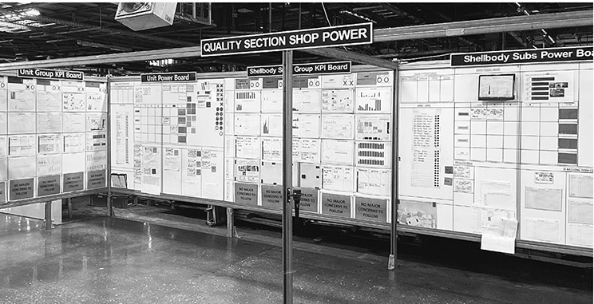

**Figure 13.11** Body weld quality shop power meetings.

This is a long chain of visions, missions, metrics, targets, and plans. As mentioned, the planning really starts in the third quarter with reflection (hansei), which adds columns to the A3 hoshin plans to note the gaps that still exist and actions for closing the gaps. In addition, reflection is done every day and week in one-on-one meetings at all levels. This is where the most important dialogue and the short-term planning take place.

**USING HOSHIN KANRI WITH TOYOTA KATA THINKING: SIGMAPOINT EXAMPLE**

Let’s consider one more example of hoshin kanri, this time moving outside Toyota. SigmaPoint Technologies in Ontario, Canada, provides end-to-end electronic manufacturing services for use in telecommunication, industrial controls, alternative energies, medical devices, defense, and more. Its core product is surface-mount circuit board assemblies. With annual sales in 1999 of US$80 million and 350 employees, the company operates two sites, with quick-turn prototyping in Kitchener, Ontario, and full-volume services in Cornwell, Ontario. Like many organizations, it became intrigued by lean manufacturing and investigated it. Like few organizations, it made lean a reality without receiving any consulting support. The company’s standard approach was to study the method, try it, refine it, evolve it, and continue learning. The leaders seem to be natural scientific thinkers. It all worked, with tremendous results for quality, cost, and lead time. Lean systems became the organizing philosophy of the company.

For example, the leaders organized their production lines into value streams by product families. They shifted from organization by type of machine to flow lines for product families ranging from small-lot engineered to order, to relatively large lot standardized boards. To make this transition, they started with a pilot. They decided to move across the street to a new facility and first tested the cell concept for the high-volume value stream with less variety, and then one by one they organized the whole site in value streams. All the lean principles discussed earlier in the book were integrated and functional: flow, pull, leveling, standardized work, visual management, error proofing, andon, and technology to support people.

Each end-to-end value stream is run by a value stream manager who has the level 2 responsibility. The value stream manager acts as the business owner and connects to all service groups, including engineering, sales, and accounting. Reporting to the value stream manager is a value stream coordinator who is similar to Toyota’s group leader and has level 3 responsibility. The equivalents of the Toyota team leaders are “value stream group leaders.” Daily huddles around visual boards are a combination of A3 problem solving and the improvement kata, which evolved from formally coached practice sessions to the way they scientifically approach daily improvement.

When the leaders felt they were ready for alignment from strategy to operations, they studied popular books on hoshin kanri and went to work to try it, evolve it, and learn. They attended a workshop and started with the popular X-matrix at the top level of the company. I will not go into details about the X-matrix since it is in almost every book about hoshin kanri, and it is not used in Toyota. In summary, it is a matrix on a single page with an X in the middle, and you move around the four edges writing (a) three-to-five-year breakthrough objectives, (b) annual objectives, (c) top-level improvement priorities, (d) improvement targets, and (e) the people who will be responsible for the targets. In the corners, you put X’s to show how the objectives and priorities and targets are linked to each other. SigmaPoint found this a useful way to visualize its top-level plans, although for deployment it preferred A3 documents like those Toyota uses, and then at the action level it linked the plans to the kata approach to scientific thinking.

As a medium-size manufacturing company, it was able to go from strategic plan to deployment with three levels of leadership (see Figure 13.12), not unlike the approach used in the TMUK manufacturing plant. The level 1 strategic deployment plan took information from the X-matrix and laid it out in greater detail as a hierarchical breakdown chart (see Figure 13.13). The company began with two 3- to 5-year breakthrough challenges: “Be World Class in Operational Excellence” and a challenging level of “Earnings Before Taxes”—both of which were broken down to a set of 1- to 3-year goals. For example, in year one the goals were to win the AME Prize for Operational Excellence (as a way to focus operational improvement efforts), achieve profit targets, increase inventory turns, improve production efficiency, improve integration of business systems, improve quote accuracy, increase account management services and skills, and achieve aggressive revenue targets. This broad set of goals touches every function in the company.

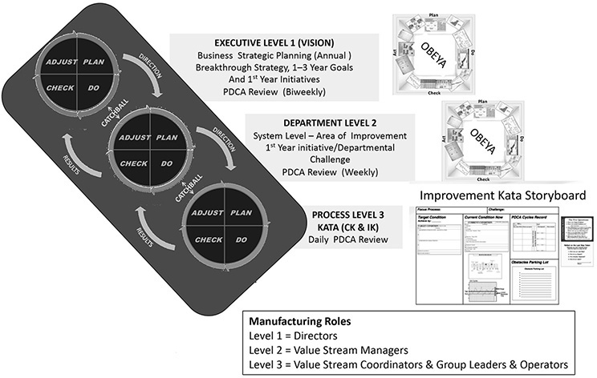

**Figure 13.12** Overview of hoshin kanri and kata at SigmaPoint Technologies.

_Source:_ SigmaPoint Technologies.

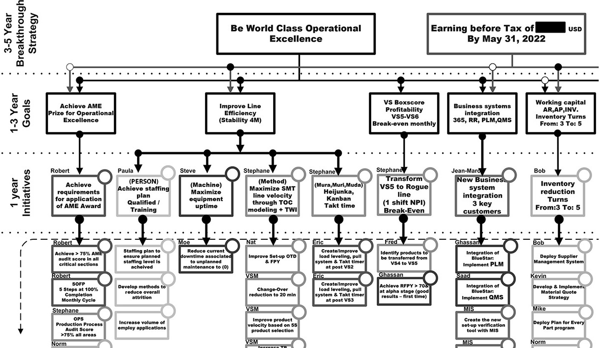

**Figure 13.13** SigmaPoint Technologies L1 top-level strategic deployment plan, blown-up section.

The goals are further broken down to level 2 challenges, which include targets for departments. The departments then deploy down to the process level 3 through daily management systems. Catchball, throwing a ball back and forth, is a metaphor of a give-and-take exchange. For many companies, it is used in the planning stages to agree on the hoshin objectives. At SigmaPoint, the executive teams hold a biweekly meeting in the obeya and biweekly catchball meetings with department heads. Level 2 then has regular catchball sessions with level 3, so catchball is an ongoing coaching and learning process.

Let’s follow one part of the chain linked to the manufacturing department’s one-year goal at level 2 to “maximize SMT velocity through theory of constraints modeling and training within industry” (standardized work and job instruction), where SMT means “surface mount technology.” In Figure 13.14, we give an example of one A3 focusing on increasing throughput through SMT. SMT is an automated process that includes robotics and is the bottleneck of each value stream. The A3 is organized around the improvement kata pattern. The challenge target is to free up four hours of capacity per day for the 80 percent highest-volume items with minimum capital investment. There are target conditions, current conditions, obstacles, and “active” PDCA cycles at the time this A3 was produced. The A3, which keeps evolving, was the responsibility of a value stream manager who was experimenting in the high-volume value stream. The value stream managers meet weekly to discuss their various A3s, and they also are responsible for catchball with value stream coordinators.

Moving down to the process level 3 (Figure 13.15), we see the daily management board for a cell leader, which is organized like a kata storyboard. This has been cleverly designed to include both PDCA driven by hoshin and SDCA. The level 2 challenge is in the upper left-hand corner. Then we see the target condition, current condition, various other charts and graphs, and the PDCA cycle record. Each experiment designed to move closer to the level 2 challenge is documented on this record—plan, prediction, results, learning. In the lower right, there is a process health check sheet for items like buffer locations, conveyor operation, SMT pallets, theory of constraint balancing, and staging of materials.

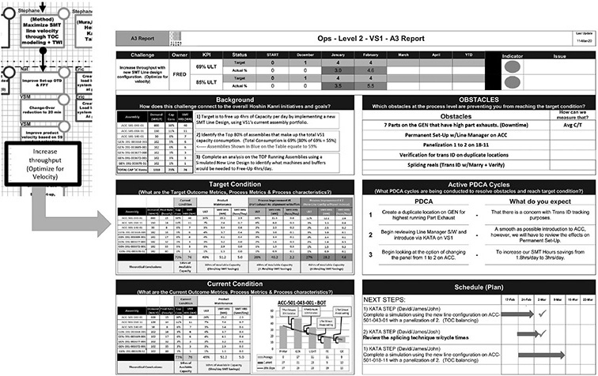

**Figure 13.14** The A3 for SigmaPoint Technologies L2 manufacturing operations.

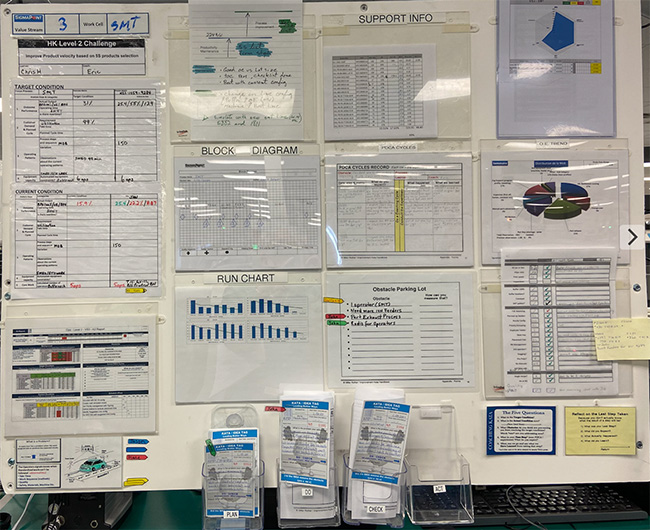

**Figure 13.15** SigmaPoint Technologies L3 process level daily management board (based on Toyota Kata).

At the bottom is an interesting addition to document SDCA. First, there is a running list of obstacles that are mostly quick-hitter items (see Figure 13.16). But instead of having the usual action register—problem, countermeasure, when, who—the board has a modified version of the improvement kata on idea tags. If an obstacle turns out to be a bigger problem than originally thought, the leaders staple PDCA cycle records onto the idea tags. These tags are then moved through slots for plan-do-check-act. So the scientific approach is used even for SDCA. The result—the direction set at the executive level of the organization is linked and cascaded to action through experimenting and learning at the gemba.

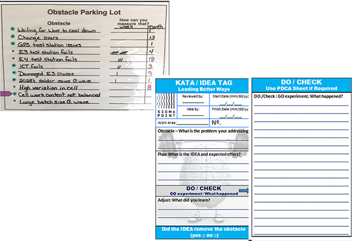

**Figure 13.16** Obstacle parking lot generates idea tags for SDCA.

**HOSHIN KANRI IS A PROCESS FOR ORGANIZATIONAL LEARNING**

Toyota long ago realized that hoshin kanri is the connective tissue between organizational learning and the achievement of business objectives. Continuous improvement based on problems that pop up can accomplish a good deal, but to get everyone involved in continuous improvement in a way that adds up to huge corporate improvements requires aligned goals and objectives and daily measurement of progress toward those objectives. Thus_,_ Principle 13 states “focus the improvement energy of your people through aligned goals at all levels.” The motivational benefits of setting specific, measurable, challenging goals that matter and then measuring progress are huge—even when there is no tangible reward associated with success.

Toyota managers have become highly skilled at setting challenging goals jointly with their subordinates and are passionate about frequent measurement and feedback. This is the basis for hoshin kanri. It is Toyota’s process of cascading objectives while incorporating into that downward cascade the upward “cascade” of understanding the reality, generating innovative ideas, and taking initiative. It is a highly interactive and dynamic process of getting consensus (nemawashi), reflecting (hansei), going to see the actual condition (genchi genbutsu), and experimenting (PDCA).

In my experience, most of the companies attempting to adopt hoshin kanri miss the essence of this dynamic process. Planning remains at a high level; senior executives remain above the water level and are not in touch with the reality of the workplace. “Solutions” are defined prematurely in the plan stage, and they miss the process of aligning by concurrent top-down and bottom-up contributions. Catchball is often a few meetings in the planning stage to throw targets and ideas back and forth.

At Toyota, people do a great deal of planning to create visions, missions, and themes for actions and translate the desired outcomes to what they believe to be the drivers of those outcomes at operational levels. Outcome metrics are achieved by focusing on actionable process metrics. In the execution phase, they are madly doing PDCA and experimenting and learning. They combine PDCA with SDCA, using PDCA to remove the large boulders on the road to the challenges and using SDCA through daily management to remove the smaller rocks. PDCA and SDCA reinforce each other.

SigmaPoint has been even more formal than Toyota in developing initial plans and then using a scientific approach to learn its way toward creating and meeting challenges. The company is building on Mike Rother’s kata model to coach and learn through aligned daily activities across levels. What SigmaPoint is doing looks like the model in Figure 13.17, which makes explicit that the main result of hoshin planning is to create aligned challenges. But in scientific logic these plans are all preliminary. Once execution starts, the first step is to revisit the challenges; then go back to the gemba to focus on some area and set the first target condition; then experiment to meet that target condition; then reflect and define the second target condition; and so on. PDCA is embodied in a dynamic up-and-down cascade. This requires a different mindset than deploying plans and solutions. As Rother explains:6

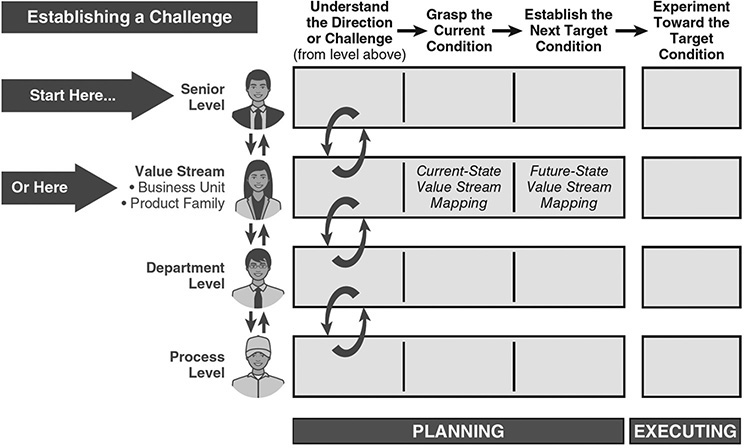

**Figure 13.17** Hoshin kanri connects to the improvement kata.

_Source:_ Mike Rother, _The Toyota Kata Practice Guide_

(New York: McGraw-Hill, 2017), p. 83.

_Although learning new skills involves a certain amount of discomfort, it’s quite amazing what you can achieve through practicing a practical form of scientific thinking. The more scientific capability you develop in your teams, the more you can empower them to meet challenges that you may have once considered impossible. Managers play a key role in this, because it is their job to create the creators._

As the famous military saying goes, “No battle plan survives first contact with the enemy.”\* Or as John Lennon sang, “Life is what happens.” All bets are off once deployment starts; there is a great deal of uncertainty, and the best organizations learn their way to the challenge in bite-size steps. Every attempt to “implement” something becomes an experiment to reflect on and learn from, guided by the direction and plan. In the last and final principle, we will focus even more deeply on the direction. It begins with what few companies do well—develop a well-thought-out strategy and commit to it.

 KEY POINTS 

 Hoshin kanri (aka policy deployment) is Toyota’s approach to jointly aligning goals and plans at all levels to lay out the challenges and targets for the year.

 Hoshin kanri is more than a business realization tool: it is a process for developing people through coaching and problem solving.

 Hoshin kanri uses a planning period to lay out challenges and milestones, which provide a framework for the step-by-step improvement process of experimenting and learning.

 The process of working toward breakthrough objectives to achieve new standards (PDCA) is supported by daily management to identify and eliminate deviations from standard (SDCA).

 The simple A3, one side of an 11-inch x 17-inch sheet of paper, is a great way to summarize thinking about plans, actions, and results, so leaders can coach and develop people and build consensus around plans and actions.

 Use constant hansei (reflection) to openly identify weaknesses and prioritize areas for improvement.

 As we move from the executive suites to the work groups that execute, each level takes responsibility for its own business—planning and working to meet the plan.

 The cascading process is far more than breaking down desired outcomes and assigning them to groups. The planning requires causal reasoning. What do I need to work on to help my boss achieve his or her targets?

**Notes**

1\. Jeffrey Liker and Gary Convis, _The Toyota Way to Lean Leadership_ (New York: McGraw-Hill, 2011).

2\. Jim Collins, _Great by Choice_ (New York: Harper Business, 2011).

3\. Alan Ward, Jeffrey Liker, Durward Sobek, John Cristiano, “The Second Toyota Paradox: How Delaying Decisions Can Make Better Cars Faster,” _Sloan Management Review_, Spring, 1995: 43–61.

4\. John Shook, _Managing to Learn: Using the A3 Management Process to Solve Problems, Gain Agreement, Mentor, and Lead_ (Cambridge, MA: Lean Enterprise Institute, 2008).

5\. Durward Sobek and Art Smalley, _Understanding A3 Thinking: A Critical Component of Toyota’s PDCA Management System_ (Boca Raton, FL: CRC Press, 2008).

6\. Mike Rother, _The Toyota Kata Practice Guide_ (New York: McGraw-Hill_,_ 2017)_._

\_\_\_\_\_\_\_\_\_\_\_\_\_\_\_\_\_\_\_\_\_\_\_\_\_\_\_\_

\* The expression of this sentiment can be traced to a 1957 _Reader’s Digest_ article, which attributes it to Allen Saunders.

\* For a discussion of four types of problem solving—troubleshooting, gap from standard, open-ended, and target condition—see Art Smalley, _Four Types of Problems: From Reactive Trouble Shooting to Creative Innovation_ (Cambridge, MA: Lean Enterprise Institute, 2019).

\* A standard for comparison could be a rule, specification, procedure, or even a target.

\* This saying (and variations of it) is usually attributed to Helmuth von Moltke the Elder, chief of staff of the Prussian army before World War I. <https://blog.seannewmanmaroni.com/no-battle-plan-survives-first-contact-with-the-enemy-966df69b24b9>.

