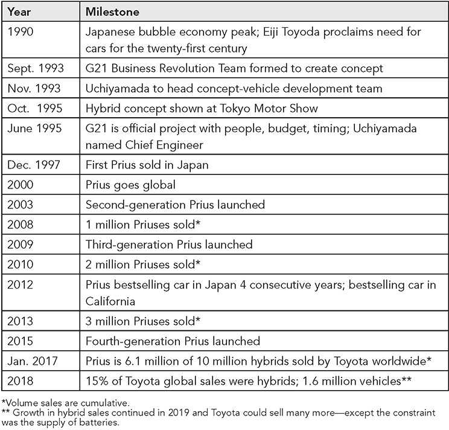
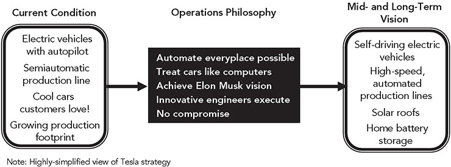
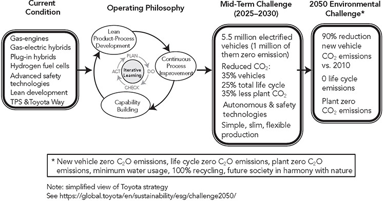
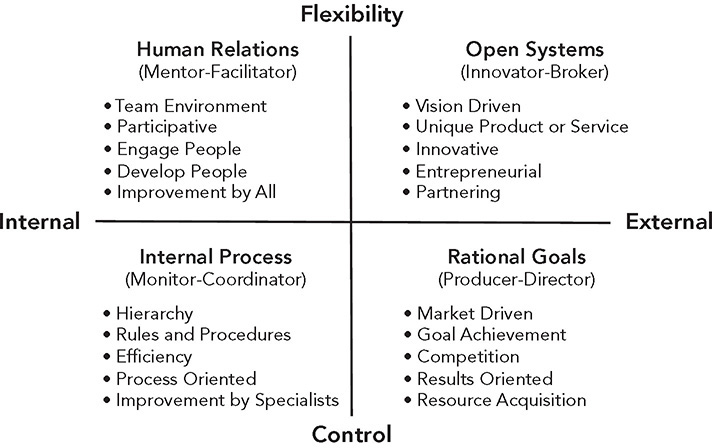
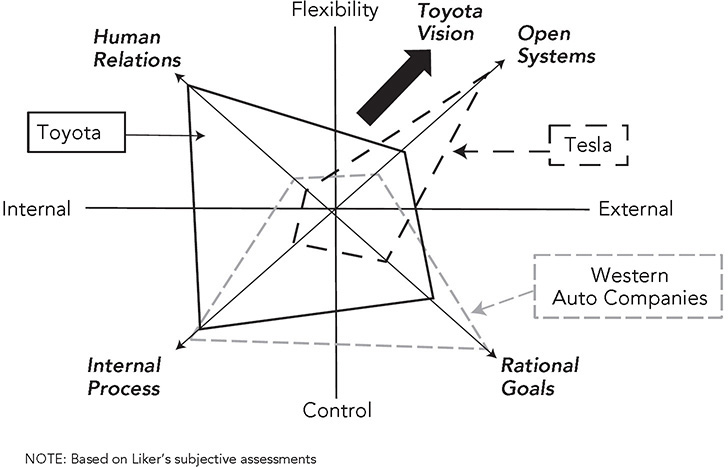
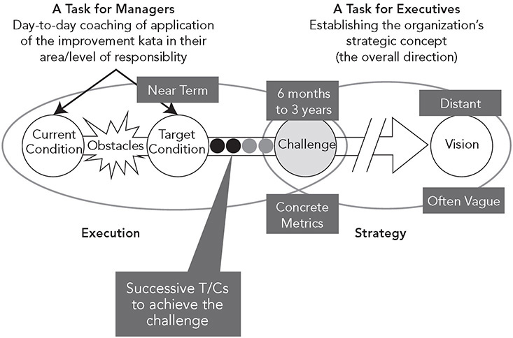
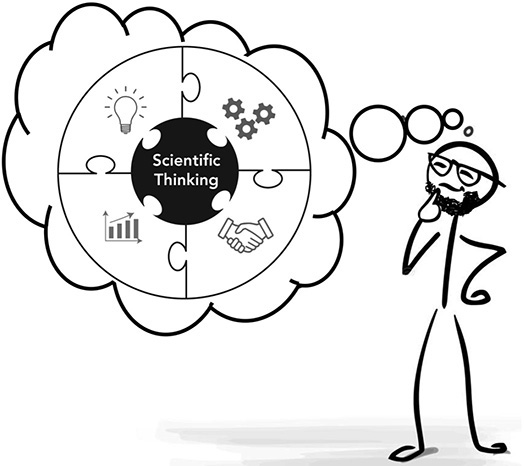

 Principle 14 

**Learn Your Way to the Future Through Bold Strategy, Some Large Leaps, and Many Small Steps**

_You’ve got to think about big things while you are doing small things, so that all the small things go in the right direction._

—Alvin Toffler, author, _Future Shock_

Toyota’s history of growth from start-up to global powerhouse has been a challenging journey filled with turns and twists. Internally, Toyota developed the winning culture of the Toyota Way, continually improving in every nook and cranny of the company. Externally, Toyota has largely grown through incremental innovation, that is, keeping up with competitors in product technology, combined with exceptional quality and reliability. Everything works as it should, but exciting is not an adjective often applied to Toyota. There have been sports cars like the Supra and Lexus LF that have been plenty exciting. The Lexus brand focused on “the relentless pursuit of perfection” with high value for the price and changed the luxury car industry. The Prius was a breakthrough in technology that changed the industry and moved it in the direction of all-electric vehicles. But these breakthroughs seem periodic, not the norm.

As Toyota faces the twenty-first century, Akio Toyota envisions vehicles that connect with customers, making them smile, and wants to “lead the future mobility society, enriching lives around the world with the safest and most responsible ways of moving people.” Seems pretty bold to want to “lead” and beyond automotive to “mobility.” But exciting? The way Toyota will do it is “by engaging the talent and passion of people who believe there is always a better way.” The engine driving the company forward remains the Toyota Way of respect for people and continuous improvement.

In the meantime, anyone who can spell mobility seems to be starting an electric vehicle company that will disrupt the industry, displace out-of-date “legacy automakers” like Toyota, and entice investors to throw money at them. Obviously, this is an exaggeration, but the leader is Tesla, which already has successfully disrupted the industry, has exceeded the market capitalization of any other automaker, and has become the new model other automotive startups are aspiring to. This leads to the question: Has the Toyota Way lost its luster and usefulness as a model for this new age?

By 2020 some analysts already declared the game is over and Tesla has won.1 The argument of Tesla superiority does make some sense. “Tesla is not making cars, it is selling an iPhone with wheels. The vehicle itself is merely a medium to market the software undergirding the iTunes-like community that Tesla is building.”

As I write this, Toyota and Tesla are not really in a competition to the death for the same customer base. It is not clear they are even playing the same game. Toyota is serving most vehicle segments, most global markets, selling about 10 million vehicles per year and investing capital earned through profits, compared to Tesla selling about ½ million targeting very specific markets, mostly in the United States, and using the money of investors who hope it will be the next Amazon or Apple. Where this goes long term we can only speculate.

Toyota and Tesla do have in common that they have bold strategies, have taken some big leaps, and have struggled through many small steps. Behind the scenes of the big-bang Tesla, which seemed to appear overnight as the next great car company, was over 15 years of very hard work with successes and many failures. The original Tesla company was launched in July, 2003, and much of the core technology we see today was developed by two brilliant engineers, before Elon Musk got involved as an investor in 2004\. It took 17 years to become the phenom we see in 2020\. The message of Principle 14 is that turning strategy into execution is a struggle and you cannot simple copy the strategy of another company. Unfortunately, each company will need to define its own strategy based on its unique circumstances and work toward this vision with some large leaps and many small steps.

One thing is clear. The success of any organization is far more than continuously improving processes (now you tell us!). Every organization needs a strategy for the products and services that will bring in customers. And we also need a strategy for our operations—what capabilities do we need to deliver on our business model? What customers want is a product and/or service that connects with them—solves their problems, excites them, makes sense to them, and does something important for them that competitive products or services do not. Customers who can afford it will pay extra, and even be inconvenienced, for a next-generation product or service that satisfies their needs at a higher level.

A strategy consists of a vision, a plan, ideas about the product or service, the target market, the means of delivery, and the service levels; it then needs to be put into action. For simplicity, let’s distinguish between strategy, which is the vision and plan, and execution, which is how we actually do things. Execution can be excellent, OK, or poor. If the strategy leads to a uniquely useful product or service, or you have a monopoly on it, or it is in short supply, then execution does not have to be as great. Consider how people put up with the first iPhone, buggy and featureless, yet waited in line to get it. Or more recently, how people would do anything to get sanitized wipes during the Covid crisis. At these times, refined execution was not the priority for these products.

Then there are companies like Amazon, that combine a disruptive business strategy with excellent execution. The original model in 1994 was a user-friendly website with direct shipments of books to customers. This grew to the mission to be “Earth’s most customer-centric company, where customers can find and discover anything they might want to buy online.” To deliver, Amazon had to get really good at fulfilling customer orders by building a superior logistics system and a world-class supply chain.

On the other hand, some company strategies focus on delivering commodities, and executing at superior levels of quality, cost, and delivery—what we usually think of as lean. Execution is everything. One of the worst situations can be when a company’s strategic plan includes being great at execution, but the reality is the opposite. Pfeffer and Sutton talk about the “knowing-doing gap” and give many examples of organizations that think they know how to be excellent but fail in daily practice.2 What they believe they know is not what they are able to do.

As an example of a company with a unique product strategy and offering, Tesla is shaking up the auto industry by dominating the small, but growing, battery-electric market. It has one highly-focused strategic direction: CASE, which is connected (through the Internet), autonomous, shared (with other paying customers), and electric battery-powered vehicles. Unencumbered by old-line vehicles (self driving), supply chains, and business models, Tesla is off and running toward CASE with a level of innovation not seen in the automotive industry since early breakthroughs in gas-powered vehicles. Before Tesla, entering and surviving this capital-intensive industry with a history of low margins seemed difficult, if not impossible. But Tesla has been successfully blazing new trails and disrupting the auto industry in the process, and the barrier to entry of building factories for complex powertrains are all but gone for electric vehicles.

Corporate strategy guru Michael Porter warned in a classic 1996 _Harvard Business Review_ article that “operational effectiveness is not strategy.”3 He also warned in that article that Japanese companies had turned cars into a commodity and were competing on cost and quality, cannibalizing each other’s margins:

_The dangers of Japanese-style competition are now becoming easier to recognize. In the 1980s, with rivals operating far from the productivity frontier, it seemed possible to win on both cost and 326quality indefinitely. . . . But as the gap in operational effectiveness narrows, Japanese companies are increasingly caught in a trap of their own making. If they are to escape the mutually destructive battles now ravaging their performance, Japanese companies will have to learn strategy._ 

Since Porter prophetically wrote that, many auto companies throughout the world have struggled, hovering near or ending up in bankruptcy. Toyota has not been one of them, charging premium prices, relentlessly cutting costs, and earning robust profits year after year, and with plenty of cash available. The Toyota Way is as much about studying the environment and developing long-term strategy based on facts as it is about taking cost out of manufacturing processes. Toyota is showing no signs of sticking its head in the sand and pretending all this new technology shall pass. As President Akio Toyoda made clear in a speech on “becoming a mobility company” in December 2019:4

_Toyota’s growth to date is within the established business model of the automotive industry. In light of technological innovations in “CASE,” the very concept of the automobile is on the verge of major change. Given this situation, we must transform our business model into one that is in line with the CASE era. Therefore, rather than focus solely on passenger cars and individual customers, we can spread these technologies via commercial vehicles and vehicles for government offices and fleet customers. Rather than conduct development on our own—without friends and partners—we can partner and collaborate with others who share our aspirations. Rather than sell only cars, we can provide various services in which vehicles are incorporated into a system._

Contrary to popular belief, continuous improvement means more than small, incremental changes in processes. As we learned from Principle 13, it simply means improving continuously, sometimes with breakthroughs driven by hoshin and other times more gradually through daily management—PDCA and SDCA can go hand in hand. For Toyota, a well-thought-out strategy and excellent execution are not alternatives, but a necessary combination. The foundation of _The Toyota Way 2001_ starts with breakthrough _challenges_, not small incremental improvements. Toyota evolved out of innovation, originally in developing power looms and then in designing automobiles, and ever since, its executives have preached about the next existential crisis around the corner while the company repeatedly breaks new performance records.

Toyota disrupted the industry in the 1970s with the Corolla. Eiji Toyoda could have been satisfied by a car that pleased the Japanese consumers Toyota knew well, but he wanted a global car to rival the Volkswagen Beetle. In studying US consumer tastes at the time, the company realized that with rising fuel costs, Americans wanted a smaller, fuel-efficient vehicle at low cost, but expected many of the luxuries of a big, expensive vehicle. Toyota’s Corolla hit the sweet spot of fuel efficiency, size, upscale features, and power and became the bestselling vehicle in the world. Toyota succeeded again with the Lexus when nobody thought of luxury and Japanese cars in the same sentence. The Prius, discussed in the next section, was another example, successfully taking a bold step into the twenty-first century before any other automaker. And when we look back, we may view Toyota as the disruptor that created the hydrogen fuel cell market for various types of mobility services.

At this point, Toyota is focused on building competencies in the technologies for the future, and as usual Toyota is happy to stay under the radar. It likes to let its “products speak for themselves.” The company is definitely methodical, like the tortoise, but it can also move at a crisp pace and arguably works on more fronts than any other automaker. Having built a strong brand known for reliability, generated strong sales and profitability, and amassed boatloads of cash, Toyota has the luxury to think long term and execute based on a strategy and a bold vision that looks out to 2050 and encompasses major milestones in environmental friendliness. When asked what he has learned from the many crises he has faced, including the transformation of the industry and Covid-19, Akio Toyoda responded with an answer that stressed keeping calm and managing stably:5

_The number one thing I have learned and that I am prioritizing from my learning is that I am not panicking. I am managing the company very efficiently and stably. In managing the company during these past 10 years, no years were peaceful. Every year, year on year, we have witnessed and experienced a large, drastic change on the scale of a one-in-a-100-year event. So, I think that the calmer I am, the calmer things are within the company._

**THE PRIUS THAT SHOOK THE WORLD\***

The Prius provides a window into how Toyota approaches breakthrough innovation through large leaps and small steps. In retrospect, it can be difficult to imagine the obstacles a company had to overcome to achieve a successful innovation, but at the time nobody outside Toyota seemed to think a gas-electric hybrid was a viable product—or a wise business decision. The Prius shook up the industry and paved the way for electric vehicles (EVs). How did it happen? In the early 1990s, when Toyota was earning record profits from gasoline-powered vehicles and appeared unable to do anything wrong, chairman Eiji Toyoda asked at a board meeting:

_Should we continue building cars as we have been doing? Can we survive in the 21st century with the type of R&D that we are doing? . . . There is no way that this \[economic boom\] situation will last much longer.”_ 

When Eiji Toyoda spoke, everyone listened. Toyota was practically printing money at the time, but it challenged itself to think and act long term for fear of eventually facing extinction (see Principle 1).

In response to Eiji Toyoda’s challenge, Yoshiro Kimbara, then executive VP of R&D, formed Global 21 (G21), which ultimately led to the Prius. Kimbara launched a “Business Revolution Project” in September 1993 that was tasked with researching new cars for the twenty-first century. The only real guidance was to develop a fuel-efficient, small-size car—exactly the opposite of the large gas guzzlers that were selling at the time. A committee of about 30 senior executives met weekly for three months and developed a concept, including a full-scale drawing. In addition to the small size, a distinguishing feature of the original vision was a large, spacious cabin that turned out to be critical to the success of Prius. The committee also set a target for fuel economy. The then current engine in a basic Corolla got 30.8 miles per gallon, and the target was set at 50 percent more, 47.5 miles per gallon.

High-level executives then pondered who should lead the effort of developing a prototype vehicle and settled on the unlikely choice of Takeshi Uchiyamada, who later was tasked as chief engineer for the production vehicle. The chief engineer role in Toyota is sacrosanct as the super engineer and business mind leading the program as if it were a startup. Uchiyamada hadn’t been groomed to be a chief engineer and never even aspired to this role. His technical background was in test engineering, and he had never worked in vehicle development. Uchiyamada described to me his dilemma:

_As a chief engineer, if there are supplier problems it is the responsibility to visit the supplier and check the line and solve the problems. I did not even know what I was looking for to know what to do in many cases. One of the personifications of the chief engineer is that they know everything, so even when developing different parts of the vehicle you know where the bolts can go together as well as what the customer wants._

So what could Uchiyamada do since he did not “know everything”? He surrounded himself with a cross-functional team of experts and relied on the team. One of the most important results of the Prius project from an organizational design perspective was the creation of the obeya system of vehicle development, which to this day is the standard for Toyota. “Obeya” means “big room.” It is like the control room, but using visuals on the walls to show the actual condition compared with the target condition on key metrics. In the old vehicle development system, the chief engineer traveled about, meeting with people as needed to coordinate the program. For the Prius, Uchiyamada gathered a cross-functional group of experts who worked together full-time in the “big room” to review the progress of the program and discuss key decisions. He also introduced a higher-level use of email and brought CAD terminals into the room. Toyota executives achieved their goal of reinventing the company’s vehicle-development process by selecting a nonexpert chief engineer.

The goal for the G21 was stated as a “small, fuel-efficient car.” An all-electric vehicle certainly would have been fuel efficient and would have produced almost zero emissions, but it was not considered practical or convenient. You needed a separate infrastructure to recharge the batteries, the range between charges was short with the known technology at the time, and the batteries needed would be huge and expensive. Executives feared the car would be a “battery carrier.” Fuel cell technology, on the other hand, had great promise, but the technology was not nearly developed to the point of being viable and there was no infrastructure for refueling.

Even a hybrid was initially rejected by the team by 1994\. It was considered too new and a risky technology. In September 1994, the team met with Executive Vice President Akihiro Wada and Managing Director Masanao Shiomi, and the hybrid technology came up, but no conclusion was reached. What did come up was an unexpected request by Wada to develop a concept vehicle for the Tokyo Motor Show. When Uchiyamada went to brief Executive VP Wada on progress, Wada not so subtly pulled the rug out from under him:

_By the way, your group is also working on the new concept car for the Motor Show, right? We recently have decided to develop that concept car as a hybrid vehicle. That way, it would be easy to explain its fuel economy. We are not talking about production here, so show us your best ideas._

This seemed impossible, particularly since there were only two months until the auto show. Despite this incredible time pressure, Uchiyamada followed the Toyota process of set-based design—first broadly considering alternatives, asking his team to consider all the possible known hybrid technologies, and converging on a selection.6 The team met the challenge, and the hybrid concept won top awards and was the talk of the show. It was not terribly surprising after the show that Wada increased the fuel economy target for the Prius, and it became obvious that a hybrid was the only practical alternative for the production version. It was fitting that a car named Prius, which is Latin for “go before,” would be a hybrid.

In the meantime, in August 1995, Toyota named a new president, Hiroshi Okuda, and he was an unusually aggressive leader for Toyota. When he asked Wada when the hybrid vehicle would be ready, Wada explained that he and his team were aiming for December 1998, “if all goes well.”

Okuda said, “That is too late; no good. Can you get it done a year earlier? This car may change the course of Toyota’s future and even that of the auto industry.”7

The Prius launched in October 1997, two months ahead of the new December target date. Despite the time pressures and doing so many things for the first time, Uchiyamada made the critical decision to develop in-house all the core technologies that would make up the Prius—electric motors, switching circuits to change between DC and AC, computer systems to optimize the use of the gas engine and electric motors, and regenerative braking systems to convert mechanical energy to electric energy stored in the battery. The company could not go it alone on the battery itself, and so it partnered with Panasonic, a partnership that to this day is still researching and improving battery technology for Toyota and ultimately for sale to other companies—in this case, breakthrough solid-state batteries.8

At launch, the Prius took first place in the two most prestigious automotive competitions in Japan, winning both the coveted Japan Car of the Year and RJC New Car of the Year. It was actually beat to market by the Honda Insight hybrid, but Toyota’s initial vision of a roomy interior for families won out over Honda’s two-door, two-person vehicle. The Prius hybrid timeline is summarized in Figure 14.1\. At a big-picture level, we see Toyota’s philosophy of breakthrough vehicle development followed by incremental improvement. Toyota developed a vision for the twenty-first century and made a big leap into the new technology, developing in-house many new technical capabilities leading to refining the Prius through successive generations and then expanding hybrids to most other models. We can think of each generation of the Prius as a PDCA loop, and Toyota has gone through more of these learning loops than any other automaker.

With each generation, cumulative annual unit sales went up in leaps—to 1 million by 2008 and 3 million by 2013\. By 2017, the Prius was being hailed as one of the most important cars since the Model T.9 Meanwhile, Toyota had been working hard in R&D to bring down the cost of the hybrid synergy drive and branched out making hybrid versions of most of its bestselling models for just a few thousand dollars more than the gas engine equivalent. By January 2017, the company reached cumulative sales of 10 million hybrids, and by early 2020, Toyota had sold over 15 million hybrids in the 23 years since the launch of the first Prius.10 In the UK market in 2019, hybrids accounted for two-thirds of all Toyota-Lexus sales.

**Figure 14.1** Prius key milestones.

Meanwhile, electric vehicle sales were still a small percentage of vehicles sold, though creeping up. In 2017 in the United States, electric cars, including the plug-in Prius Prime, accounted for 200,000 vehicles out of 17 million vehicles sold (1 percent).11 In 2019, that increased to 2.2 percent, and in the United States about three-quarters of those sales came from Tesla.12 The enthusiasm for producing battery-only electric vehicles has been through the roof, and stock prices soared for startup companies making electric vehicles, though doing so profitably and at high volumes has been a struggle to this point.

Toyota has been criticized for being one of the last auto companies to produce all battery-powered vehicles. Is it finally dead wrong about the future and missing the market? I think the answer is that it has an equally bold strategy, but its strategy is just different from that of Tesla and some other automakers because Toyota is in a different position financially and in the market. Toyota has been following Principle 14: “Learn your way to the future through bold strategy, some large leaps, and many small steps.” The Prius is a great example of this, pursuing a seemingly impossible challenge at breakneck speed, coupled with steadfast step-by-step execution via PDCA doing and learning. As I write this, Toyota introduced the first Mirai hydrogen fuel-cell vehicle, and like the original Prius, is refining the range and features of the second generation with a long-term goal of bringing it within the price range of hybrids. And it has a number of battery-electric vehicles nearing production through joint ventures, focusing at first on the large market of China.

Toyota has spent decades learning the new technologies of the future and introducing these technologies into mass-produced vehicles. With its technology capability and rapid product-process development systems, it can pivot quickly, shifting focus to plug-in hybrids with varying range, battery vehicles, hydrogen fuel cell vehicles, or whatever else the market demands.

**COMPARING TOYOTA AND TESLA ON STRATEGY**

For Nokia’s phone business, the big disruptor was the Apple iPhone, which ultimately drove it to bankruptcy and reemergence with a different product line. For the auto industry, the not-so-big disruptor appears to be Tesla. Tesla did one thing really well, but it is the one thing that matters. Tesla developed a new kind of car that customers love. With the bold vision of Elon Musk, the company started with a clean sheet of paper and envisioned what would excite customers in the twenty-first century.

Elon Musk was a child prodigy and grew up loving science fiction, physics, and computer programming, but not necessarily working with other people.13 He grew up socially awkward and a loner who believed he was always the smartest person in the room, and probably was in most cases. He cofounded PayPal as a software innovator, but he made the remarkable shift to automobiles and spaceships—innovating in hardware at the pace of software innovation. Elon Musk is like a CEO and chief engineer combined who is involved in every important decision and whose motto seems to be “no compromise.”

With Musk’s vision, Tesla designed into automobiles anything it could imagine a customer wanting—all at once. It made the car all electric, innovated on batteries to extend the range; engineered the car to be superfast, even “ludicrous”; created a simple, clean interior with no buttons; used one computer instead of many; designed in a grandiose screen; updated the software over the air; designed and built its own comfortable seats; allowed stopping the vehicle by releasing the gas pedal without even touching the brake pedal; offered an autopilot that the company claims will quickly morph into full autonomy; set up operation by your smartphone; sold reservations for vehicles before they were in production; created cool stores and avoided independent dealerships—and the list goes on. The company took product risks, for example calling the autonomy features “auto-pilot” at a time when the auto industry had become almost paranoid from repeated recalls and was avoiding terms that suggested a car could drive itself.

This does not mean all went well for Tesla. Execution was hectic, even chaotic. The company promised unrealistic launch dates and broke one promise after another. There were quality problems, launch problems, production problems, problems in introducing technologies that were not ready for prime time, spectacular crashes with autopilot, and failures to deliver on promises to customers, and yet passionate early-adopter customers still fought their way to getting their Tesla.

Elon Musk himself called attempts to manufacture Model 3s at volume “production hell” and learned manufacturing was a lot more difficult than he initially thought. A few months after proclaiming that Tesla’s real product was the automated factory that would run competing automakers out of business, he backtracked and declared: “Yes, excessive automation at Tesla was a mistake. To be precise, my mistake. Humans are underrated.” The solution was to set up a makeshift, mostly manual, assembly line under a “tent” in the parking lot of the plant in Fremont, California. Read Edward Niedermeyer’s book _Ludicrous_14 about the showmanship of things that were promised but did not exist at Tesla and how the company narrowly avoided multiple bankruptcies, and you will wonder how the company survived, let alone prospered.

**Figure 14.2** Tesla’s disruptive strategic vision.

_Source:_ James Morgan and Jeffrey Liker, _Designing the Future_

(New York: McGraw-Hill, 2018).

Tesla’s strategy, as I can intuit it, is straightforward (see Figure 14.2). Create a disruptive computerized product powered by a self-renewing power system made with a disruptive computerized factory. Tesla’s ultimate purpose is to help save the planet through 100 percent renewable energy. It is clear Elon Musk cares deeply about humanity and has a long-term vision greater than short-term profits. Anyone who in any way diminishes the accomplishments of Tesla is not paying attention—it’s the first automotive startup since Chrysler that looks like it will survive and even prosper, bringing to life a whole product family of all-electric vehicles and making them cool, dominating sales of battery electric cars globally, achieving a market capitalization greater than that of established automakers many times its size, and causing all existing players to scramble to compete.

Toyota’s strategy is more complex and subtle and is fitting of Toyota’s situation. Toyota has been at its best as the determined tortoise, step-by-step, carefully evaluating each step. Historically, Toyota wanted to hold about 80 percent of vehicle design constant from established model to new model, while focusing on key innovations in the other 20 percent. Toyota has not been the leader in vocalizing a commitment to battery electric vehicles, though it is rushing a bunch to market as I write this, with some based on a joint e-platform with a nine-company consortium including Subaru. Toyota is moving toward all-electric vehicles, but sees for itself a more extended transition period where hybrid and plug-in hybrid sales will continue for years, taken over later by a combination of battery-electric and hydrogen-powered vehicles (Figure 14.3). These may occupy different niches, for example, with hydrogen focused on larger commercial vehicles.

**Figure 14.3** Toyota’s environmental strategic vision and operating philosophy.

_Source:_ James Morgan and Jeffrey Liker, _Designing the Future_

 (New York: McGraw-Hill, 2018).

Even with the rising popularity of battery-only vehicles, Toyota decided someone had to take the lead on hydrogen, so in 2014 the company launched the Mirai (meaning “the future”), and later Toyota made hundreds of its hydrogen patents open and free to anyone. Interestingly, the Mirai is a hybrid with a battery and electric motors alongside the fuel cell. Toyota realized that the first-generation Mirai would sell in small quantities (10,000 total), as it was expensive and the refueling infrastructure was limited to just a few places. Since then, the company has made major investments in hydrogen infrastructure on its own and working with governments and other companies such as Shell. Toyota announced the 2021 Mirai as a luxury sedan with sleek styling and a longer range of 400 miles. Toyota anticipates sales of 30,000 units in the first year. The company is also working with subsidiary Hino on a commercial truck with a heavy-duty hydrogen fuel cell.

Battery efficiency and cost have progressed at a remarkable rate but have remained heavy and expensive and, as of 2020, in limited supply. In 2019, Gerald Killmann, Toyota’s vice president of research and development for Europe, explained that Toyota was able to produce enough batteries for 28,000 battery-only vehicles each year, or 1.5 million hybrids. And selling 1.5 million hybrids reduced carbon emissions by one-third more than 28,000 electric vehicles, while also providing its customers more practical vehicles (because of no range or charging anxieties) at more affordable prices.15

Toyota’s “Environmental Challenge 2050,” announced on October 2015, provides a road map of the plan to work toward harmony with the environment.\* Challenge 2050 is more than a vision; it contains specific goals. The six challenges for 2050 are zero carbon emissions, zero life cycle carbon emissions, zero plant carbon emissions, minimizing and optimizing water usage, establishing a recycling-based society and systems, and establishing a future society in harmony with nature. To move in that direction, Toyota has set intermediate goals for 2030, which are summarized in Figure 14.3.

By 2025, Toyota expects to sell 55 percent of its vehicles as electrified, which includes a hybrid version of almost every vehicle, plug-in hybrids, EVs, and hydrogen fuel cells.16 Nearly 1 million are expected to be fully electric EVs (including battery only and hydrogen fuel cells), which will include a range of six body types from compact to a crossover. Toyota has set up a separate engineering group called the Toyota ZEF factory with about 300 people to create the Toyota versions of the e-platform from the nine-company consortium. It is also working on small electric vehicles with Toyota-owned Daihatsu and through a tie-up with Suzuki, as well as with Chinese joint-venture partner BYD. And the list of partnerships goes on.

Does Toyota or Tesla have a better strategy? Who is a better model to copy? The answer is neither. Remember strategy is based on forecasting (informed guessing) what will happen and what the situation is in a particular company. Both companies have a strategy that fits their circumstances. Tesla is a startup working toward becoming a more mature and financially healthy company. As a startup with no existing product lines, it is highly dependent on investor capital. Its lofty stock valuations are based on the image of Tesla as a technology company that is disrupting the mobility market.

Toyota is a large, established multinational company and already has large investments in gas, hybrid, plug-in hybrid, and hydrogen vehicles. Toyota has a balanced portfolio—a combination of products designed for the near term, mid-term, and long term. The current cash cows generate funding to support investing in other companies and R&D. Some organizational theorists have argued the most successful firms are “ambidextrous,” with some parts of the organization focused on incremental improvement in the current product lineup and other parts focused on long-term technology development.17 One study published in 2012 found that successful firms allocated on average 70 percent of their innovation funds to incremental innovation (short term), 20 percent to adjacent innovation (mid-term), and 10 percent to radical/breakthrough initiatives (long term). Google is an example of one firm that worked toward the 70-20-10 balance. At the time the study was done, firms with this portfolio balance historically realized a price/earnings premium of 10 to 20 percent.18

Tesla cannot be Toyota, and Toyota cannot be Tesla. Tesla has the advantage of being a young, entrepreneurial company with only one voice that matters—that of Elon Musk. It can be very nimble and only has to invest toward its limited focus. Toyota has a lot of balls in the air, including “legacy products” that pay the bills and many mouths to feed internally. And with its extensive network of established suppliers, it needs to tread more carefully. But Toyota also is a learning organization and has retained many of its entrepreneurial characteristics, including passionate leaders who will take on even seemingly impossible challenges with energy and focus. Not only should Toyota and Tesla not imitate each other, but your organization should not imitate either of them.

**TOYOTA STRATEGY FOR AUTONOMOUS VEHICLES**

You are just preparing to leave your home for a business appointment. You open an app on your phone and call your favorite ride-sharing service for your ride. A robotic car pulls up, no driver, and takes you wherever you want to go. Science fact or fiction? For the foreseeable future both. The technology exists for self-driving under certain limited conditions, certainly the media hype is loud, but most believe the reality is far off.

The problem with the myth that self-driving cars will soon be found everywhere is that it assumes what is called level-5 autonomy, or what Toyota calls “chauffeur” mode. You trust chauffeurs to safely drive you wherever you want to go while you text, sleep, read, and pay no attention to the road. There are three core competencies that chauffeurs need to accomplish this. The first is perceiving the environment, including other vehicles, pedestrians, animals, and bicycles. Computers are good at this. In fact, with cameras located in prime places and with lidar (laser-based radar) that can sense three dimensions, in many situations computers are better at this than humans. The second chauffeur competency is planning, basically figuring out in advance where to go and what to do. Again, with so much data available, such as high-resolution maps, computers are very good at this. The third competency is prediction, and this is where computers are weak. We might notice two kids with skateboards on the street corner and become suspicious about what they might do, so we adjust our driving accordingly. There are many situations where we predict possible danger because we read the motivations of people. Computers are not good at this. Because of the weakness of computers in making predictions, Toyota concluded that full level-5 autonomy is beyond current technological capability, and no one knows when it will be available and trusted, perhaps a decade or more in the future.

Meanwhile there is a lot that can be done with the current capabilities, and Toyota is focusing heavily on the other extreme, which it calls the “guardian function.” The guardian looks over the shoulder of the human driver and detects whether the person is drowsy, distracted, drunk, or disabled and will work to prevent an accident—even taking over driving if necessary. As the technology evolves, Toyota is going farther into what it calls the “mobility teammate concept” (MTC), which can alternate between guardian and chauffeur.

_MTC is a philosophy built on the belief people should have choices. Rather than removing humans from any engagement with their own mobility, this allows people to enjoy the fun and freedom of driving when and if they choose, while also benefiting from the capabilities of automated driving when they wish. Indeed, under MTC, individuals can choose Chauffeur capability in some situations, such as highway and long-distance travel, or the support of Guardian capability in others, such as at lower speeds or on shorter trips.19_

In MTC, the relationship between the human driver and the automated system is symbiotic, with each monitoring while the other drives. Human drivers do not get to go to sleep or be distracted. Toyota’s motto is “Guardian first,” which means Toyota vehicles will be biased toward guardian mode and only cautiously move to chauffeur mode.

By the time you read this, Toyota will, at least in some Lexus vehicles, offer a version of this more advanced teammate level, which some refer to as level-2 autonomy, on highways where the driver can take both hands off the wheel and let the computer drive from on-ramp to off-ramp, including some lane changes, merges, and splits. To get to these capabilities, Toyota has to build into each car an advanced supercomputer.

As the computer systems advance, the computer can take over more of the driving in more situations. Self-driving at level 4 is already possible under limited circumstances, called “operational design domains” (ODDs), such as low-speed urban shuttles (less than 25 miles per hour), some private roads, dedicated lanes for automated driving only, and the last mile of delivery where there is not a lot of human traffic. As the technology further develops, the ODDs that are safe will expand.

Toyota is collaborating with many different companies in “sharing” vehicles, including major investments in Uber, Chinese ride-sharing giant Didi, and a Singapore ride-sharing company, Grab. It has also created an open-source vehicle platform to sell to third-party companies, which it calls “e-Palette,” to open up new commercialization opportunities. It is designed to be a safe, reliable platform that other companies can build on with their own technology and their own body shape for diverse applications like food trucks, mobile offices, and last-mile delivery vehicles (like the choices on an artist’s palette).

So how did Toyota make the shift from a conservative, legacy automaker that is great at electromechanical systems to one that is developing autonomous-vehicle software? The answer is that it broke with its long-established practices and made a radical decision to go outside and invest billions in establishing two subsidiaries—Toyota Research Institute (TRI), to do advanced research on autonomous driving, and Toyota Research Institute–Advanced Development (TRI-AD), to bring that research from the prototype stage to the preproduction stage. In 2020, Toyota also created an $800 million global investment fund, led by TRI-AD, focused on growth-staged companies developing new technologies and business models.

The company went even further. Rather than assign Toyota lifers to run those institutes, Toyota went outside to hire brilliant Americans who are experts in artificial intelligence and robotics. Dr. Gill Pratt is CEO of TRI with offices in Silicon Valley; Ann Arbor, Michigan; and Cambridge, Massachusetts. Dr. Pratt came from DARPA of the US Defense Department and earlier from MIT, where he was a professor of robotics and artificial intelligence. Dr. Pratt hired a colleague, Dr. James Kuffner, as CTO of TRI, who was later appointed as CEO of TRI-AD in Tokyo. Dr. James Kuffner, a Stanford PhD, was an associate professor in Carnegie Mellon’s Robotics Institute and then joined Google to work on its self-driving car.

To further amplify their influence, Toyota named Dr. Kuffner to the Toyota Motor Corporation’s board of directors in March 2020 and appointed Dr. Pratt as Toyota’s chief scientist. Both new Toyota executives love cars, AI, and robotics and studied and admired Toyota long before they were hired. They were attracted to the opportunity to lead well-funded subsidiaries within a global giant like Toyota, with the opportunity to commercialize on a mass scale what they develop. You could say that Toyota, instead of contracting out autonomy to a Silicon Valley startup, built its own technology startups.

Toyota’s strategy is not to maximize profit from autonomy as fast as possible, but rather its strategy is driven by its core values. Dr. Pratt explained:

_Our motivation starts with trying to make the car safer and then more fun to drive. When I first interviewed Akio Toyoda, he explained that people love cars, but do not love refrigerators. I think the difference is that the refrigerator is useful, but it is passive . . . you don’t control what it does. A car is an amplifier. It multiplies what you make it do by hundreds of horsepower. In autonomy we want to make cars that are more fun to drive and safer as a primary goal, and if a secondary side effect pops out of that where in some situations the cars can drive by themselves, that is perfectly fine, but that is not the driving goal._

Dr. Kuffner has a compatible view, and I asked him if Toyota’s strategy means the company is intentionally going slower in autonomy to avoid risks, to which he replied:

_For Toyota, the most valuable asset that we have is our brand. Therefore, if a smaller company doesn’t have as much to lose, then they can certainly be more aggressive, which is an advantage that startups will have. We are looking for something that will scale to millions or tens of millions of customers every year and have the reliability and robustness expected of a company like Toyota, so the bar is higher for us. Is Toyota lagging? Not necessarily. I think other competitors market their technology more aggressively. But Toyota’s approach is to let our products speak for themselves more than some others. There are trade-offs to both approaches._

**COMPETING VALUES AND STRATEGY**

Robert Quinn illuminated the world of strategy and how it relates to internal culture in the 1980s with his “competing values model.”20 I saw him present when this chapter was in progress and realized it is a great framework for understanding the relationship between strategy and execution. He began with two dimensions—control versus flexibility and internal versus external. The concept of control is a characteristic of the mechanistic model, while flexibility is characteristic of the organic model. An external focus is on the environment while an internal focus is on how a company runs its own operations. Quinn put these together into a 2 × 2 table and named the four cells (see Figure 14.4).

**Figure 14.4** Competing values framework for strategy and culture.

_Source:_ Robert Quinn, _Beyond Rational Management: Mastering the Paradoxes and Competing Demands of High Performance_ (San Francisco: Jossey-Bass, 1988).

Externally, the company can focus on control (rational goals) or flexibility (open systems). Internally, the company can tend toward control (internal process) or flexibility (human relations). So which quadrant is best? The answer is, it depends. First, “best” depends on the company’s strategy and environment. Second, competition among values can be broken, leading to a paradox where an organization can be seemingly opposite things at once—this, yet that. In fact, some of the most successful organizations are strong in multiple areas. Think of a spider diagram giving you a profile where you can be weak in all areas, or strong in all areas, or any other combination.

I used a spider diagram to roughly plot—that is, guesstimate—the profile of Toyota, Western auto companies, and Tesla (see Figure 14.5). Quinn and his associates developed various assessments that are more sophisticated than my guesses. Historically the Western auto industry has been preoccupied with control to the exclusion of flexibility—internally and externally. The companies in this industry want rules, structure, people obeying orders, and the freedom to hire and fire people at will, and then the goal externally is to grow, make a profit, and satisfy shareholders. To Western auto companies, lean programs have been attractive not for continuous improvement, but as cost-reduction tools within a coercive bureaucracy. The external strategy seems to be “Make money through high sales and low cost.” As I write this there is a shift in Western auto companies toward more technological innovation in the direction of open systems.

**Figure 14.5** Competing values framework and auto companies.

_Source:_ Robert Quinn, _Beyond Rational Management: Mastering the Paradoxes and Competing Demands of High Performance_ (San Francisco: Jossey-Bass, 1988).

Toyota is different and I believe has the widest range of any automaker. Internally, continuous improvement for Toyota combines high-value-added internal processes with strong human relations, thus combining high levels of control with high levels of flexibility. The control of processes is what Paul Adler called “enabling bureaucracy.” One might think that the future belongs to the purely innovative companies that do not need any bureaucracy, just brilliant teams of innovators. That misses the majority of work that a company does when it is grown up, much of which is relatively routine and needs some structure and stability.

For example, Dr. Pratt and Dr. Kuffner have been pushing Toyota toward applying TPS to IT. The amount of code that needs to be written now and well into the future is overwhelming—the two colleagues cannot hire enough people to write it based on conventional models of writing a lengthy program and then spending as much time debugging it. So they are borrowing from TPS and focusing on designing in quality. Under Principle 6, I discussed how Menlo Innovations builds in quality through breaking the software into tiny bits and designing unit tests for each bit to confirm that it works. TRI and TRI-AD do this, and every night the researchers compile and test all the coding done during the day, hoping not to find any more problems. When they do find an issue, they rely on root cause problem solving to prevent the problem from reoccurring. You can find similar methods throughout Silicon Valley under the rubric of “agile development,” originally inspired by Toyota. It seems being strong at execution is also the key to our innovative digital future—internal control _and_ flexibility.

Externally, Toyota is very good at planning and achieving rational goals, which has fueled 70 years of profitability, including a run of record profits for the industry: the company has had only one year of loss, and that was in the Great Recession. Toyota’s strategy for the future is bold in many ways, but also pragmatic.

Toyota has its share of ventures into the open systems quadrant with the paradigm-breaking Lexus, Prius, and Mirai, and even building its “Woven City” of the future at the foot of Mount Fuji that will act as a “living laboratory” to experiment with advanced technologies.21 The Prius seemed like a dangerous gambit and a guaranteed money loser, but it made lots of money and changed the auto world. And at this point, major investments in hydrogen vehicles may surprise many people and be a significant part of our environmentally friendly future. On the other hand, historically Toyota’s lean machine has been fine-tuned for incremental innovation on dependable new models, so I showed it as less strong in open systems. The open systems quadrant is the area Akio Toyoda is working hardest to strengthen, through TRI, TRI-AD, and all the various technology partnerships.

How does Tesla rank on these competing values? From my off-the-cuff assessment, Tesla is firmly ensconced in the open systems quadrant, while doing just enough to build and distribute product in the other three. It is relatively unidimensional and weaker everyplace Toyota is strong. Fortunately, or more likely by plan, Tesla is strong in the one area that really matters for Elon Musk’s strategy and style of leadership. I also give him credit in the human relations quadrant for hiring exceptional engineers who have done a good job of innovating. Elon Musk certainly thinks long term and has a vision well beyond earning a paycheck. Save the planet and colonize Mars are very long-term objectives. But long-term thinking for Toyota includes building a highly-adaptive learning organization internally at all levels. And innovative thinking at Toyota applies to everyone, even the person attaching the windshield wipers.

Not every company can act like a startup, but it is critical that the internal capabilities and external challenges are well aligned. As Robert Quinn put it in his book _Deep Change_:22

_The process of formalization initially makes the organization more efficient or effective. As time goes on, however, these routine patterns move the organization toward decay and stagnation. The organization loses alignment with the changing, external reality. When internal and external alignment is lost, the organization faces a choice: either adapt or take the road to slow death._

Has your environment shifted so much that you need to radically adapt or die? Are you a startup that needs to attract large amounts of investment capital? Then it may be that Tesla is a useful role model, at least in the near term. If you want to view Tesla as a role model, what are some of the key features you need to imitate?

1\. The CEO should be a bold, visionary, genius who thrives on risk taking and has total control.

2\. The visionary leader gathers together brilliant people willing to work around the clock to achieve the leader’s targets and goals.

3\. The key to success is a breakthrough product or service that is so different and appealing that quality, on-time delivery, and cost are secondary considerations.

4\. Great optics for the most important customers—investors—are paramount.

5\. The leader is the leader and is not to be challenged—dedicate your life to changing the world toward the leader’s vision or get off the bus.

6\. All managers, other than the top visionary leader and perhaps a small group of close confidants, are replaceable parts whose main task is to get the results they are assigned.

7\. People that do the detailed work are also replaceable parts that are to do as instructed and are laid off and hired as needed.

8\. Build a utilitarian and goal-oriented culture, and soft values like “respect for people” are lower priority.

These are characteristics of a number of highly successful entrepreneurial startups. Great entrepreneurs are different sorts of animals. And few corporate leaders can imitate what goes on in the mind of a brilliant entrepreneur. There has been speculation that if you could put Toyota and Tesla together, you would have an unbeatable combination. Jim Womack concluded that this will never happen, but they could learn from each other:23

_The Toyota/Tesla Way sounds like a great idea. But . . . not in one company. Toyota and Tesla have already learned about each other from Toyota’s brief investment in Tesla and their project to produce an all-electric Toyota RAV4\. And they decided to admire each other 344from a distance. The most practical way forward is for Toyota to be bolder in pursuing first principles and for Tesla to be less ludicrous, showing respect for each other as they share the road._

**STRATEGY AND EXECUTION ARE NOT SPECTATOR SPORTS**

We can debate who are the greatest sports figures of all time in tennis, soccer, basketball, golf, or whatever. Are conservatives or liberals best for the country? What is the greatest movie of all time? And we can debate who will be the leading mobility provider in the future—Tesla, Toyota, another legacy automaker, or perhaps one of the many other EV startups? In the game of strategy for our own organizations, we are more than spectators. Few of us will be on a championship team or win a gold medal at the Olympics . . . or start a company that disrupts an industry. In fact, as many as 75 percent of venture-backed companies never return cash to investors, and the most likely outcome is bankruptcy.24

I do not pretend to be an expert on strategy. There are many courses and books just on this topic, and it is a core field of study in business schools. I do have a few bits of advice though:

First, develop your own strategy based on your products, services, markets, and unique situation. As former IBM CEO Ginni Rometty deftly put it: “You build your own strategy. You don’t define it by what another competitor is doing.”

Second, the competing values framework is a useful way to map your future strategy to strike an appropriate balance between external and internal, flexibility and control. The question is not which quadrant is best, but rather, what capabilities does your organization need to be successful in the future, considering your risk threshold, the market you face, trends in technology in your field, the broader environment, and what you think will excite your customers. Your strategy should be specific to _your_ organization and _your_ relevant environment. If we consider the automotive industry, there is more consensus than I have ever seen before in the industry about CASE. All agree they need to move toward this future, but how fast and with what approach? For Toyota, it’s clear that maintaining its strong foundation in safety and reliability is paramount as the company moves forward.

The strategic vision starts in the external environment portion of the competing values model. What is your ideal vision for your products and services, and how will it connect with customers(open systems)? What is your vision for making a living (rational goals)? Then there is the internal portion. How developed do you need to be in execution? Is the delivery of those products and services a differentiator? Do you need flexible people continually improving toward excellence? Or is a moderate level of internal control enough?

Third, do not fall into the trap of thinking that just because you have a well-articulated strategy, with informative figures and charts, that you are done. You have only started. The difference between developing the strategy and executing against it is night and day. The vision is just that, a vision, based on our best guesses about the future. We will not really know what is going to happen until it happens. The execution should be done in bite-size pieces, learning from each experiment.

Mike Rother’s model connects strategy to the step-by-step learning approach of the improvement kata (see Figure 14.6). What is your long-term strategic vision for your product or service? What competencies and distinctive processes are needed to support delivery? For the shorter term, say one to three years, what are the concrete challenges you need to take on to move in the direction of that strategy? That bounces you to the current condition—what are your current competencies, strengths, and weaknesses? Then identify, not all, but the first of your short-term target conditions and experiment toward that, and so on. This approach mirrors Alvin Toffler’s opening quote advising thinking “about big things while you are doing small things, so that all the small things go in the right direction.”

**Figure 14.6** Connecting strategy to continuous improvement through successive target conditions and iterative learning.

_Source:_ Mike Rother, _Toyota Kata Practice Guide_

(New York: McGraw-Hill, 2017).

Sometimes strategic direction and a lean model for daily operations fit together hand in glove. Merillat was a market leader in kitchen cabinets, a low-margin business, but saw competition from all sides, and cost was a critical factor. The company hired a great lean leader, Keith Allman, as its COO, and he convinced the board that the company needed another way to compete—lead time and service quality. Merillat’s largest client base consisted of builders who wanted the cabinets delivered on time at the same time. They had the people ready to do the installation, and they wanted all the cabinets there with perfect quality at that time, not too early or too late. Keith set as the visionary challenge “A kitchen at a time.” Build a kitchen; ship a kitchen; get it to the right place on time. This required a lean transformation in the assembly plant, fabrication plants, and supply chain. This became a winning formula.

Some companies, a very small percentage, will legitimately conclude that the great disruptor with a radically better business model is right around the corner, and they either radically change or go out of business. In that case, for the short term, excellence in how they get things done may not be the top priority. If you survive this tumultuous transformation as you rebuild and mature and shift to mass distribution, I submit that excellence in execution and the internal culture to support and improve execution will become increasingly important. In _The Toyota Way to Lean Leadership_, Chapter 6, we described how Gary Convis as CEO helped lead a turnaround of truck-parts supplier Dana as it emerged successful from chapter 11 bankruptcy, by reducing costs, boosting market share, and developing people internally. After Dana was again profitable, the company worked on the Dana Operating System.

For the rest of us in the 99 percent, a better model than the pure open system disruptor is the more balanced Toyota Way. That does not mean it is a waste of time to do environmental scans, or that it is safe to assume there is no digital-based disruptive force for your business. It does mean most of us probably have some time to work our way there and probably can do it best with a strong culture of excellence and motivated, capable, and flexible members committed to the company.

The Toyota Way highlights the struggle of turning strategy as a plan into execution. The gemba is a tough taskmaster. Can I say with certainty that Toyota’s strategy and execution will be effective in the future as the industry undergoes radical transformation? As Yogi Berra famously said, “It’s tough to make predictions, especially about the future.”

 KEY POINTS 

 To be successful, organizations need a well-thought out strategy to provide a distinctive product or service executed with appropriate operational capabilities.

 Each firm must develop its own strategy based on its unique situation and characteristics of the environment it faces.

 In the auto industry, Tesla was the first to develop an exciting battery-electric vehicle and took a first-mover advantage with sufficient sales and pricing to overcome production, quality, and delivery problems.

 Toyota has the size and resources to develop a more nuanced strategy, selling in parallel battery electric, hybrid, plug-in hybrid, and hydrogen fuel cell vehicles, with the proportions shifting over time.

 The Prius is an example of how Toyota took a bold step, developing the first mass-production hybrid, and then refined it through large leaps and steps to make it a bedrock for profitable growth.

 The competing small values model can help conceptually identify where a firm needs to be externally and internally and how the strategy relates to execution.

 For a startup firm, it is most important to be strong in the open systems quadrant with a breakthrough product or service, while as the company matures, it becomes increasingly important to have strong internal capability for execution.

 Each organization is in a unique position and needs its own strategy; copying benchmarked companies can stunt creative thinking and set you back.

**Notes**

1\. https://asia.nikkei.com/Opinion/Has-Elon-Musk-s-Tesla-already-won.

2\. Jeffrey Pfeffer and Robert Sutton, _The Knowing-Doing Gap: How Smart Companies Turn Knowledge into Action_ (Brighton, MA: Harvard Business Review Publishing, 1999).

3\. Michael Porter, “What Is Strategy?,” _Harvard Business Review_, November–December 1996.

4\. https://global.toyota/en/company/messages-from-executives/details.

5\. https://planet-lean.com/akio-toyoda-crisis-management/.

6\. Allen Ward, Jeffrey Liker, Durward Sobek, and John Cristiano, “The Second Toyota Paradox: How Delaying Decisions Can Make Better Cars Faster,” _Sloan Management Review_, Spring 1995, pp. 43–61.

7\. Hideshi Itazaki, _The Prius That Shook the World: How Toyota Developed the World’s First Mass Production Hybrid Vehicle_ (Tokyo: Nikkan Kogyo Shimbun, 1999).

8\. https://www.caranddriver.com/news/a33435923/toyota-solid-state-battery-2025/.

9\. <http://www.businessinsider.com/toyota-prius-is-most-important-car-last-20-years-2017-12>.

10\. https://media.toyota.co.uk/2020/04/toyotas-global-hybrid-vehicle-sales-reach-15-million-units/.

11\. Jonathan M. Gitlin, “2017 Was the Best Year Ever for Electric Vehicle Sales in the US,” _ARS Technica_, January 4, 2018.

12\. https://qz.com/1762465/2019-was-the-year-electric-cars-grew-up/.

13\. Ashlee Vance, _Elon Musk: Tesla, SpaceX, and the Quest for a Fantastic Future_ (New York: Ecco, 2017).

14\. Edward Niedermeyer, _Ludicrous: The Unvarnished Story of Tesla Motors_ (Dallas, TX: BenBella Books, 2019).

15\. https://www.caranddriver.com/news/a26703778/toyota-why-not-selling-electric-cars/.

16\. https://www.reuters.com/article/us-toyota-electric/toyota-speeds-up-electric-vehicle-schedule-as-demand-heats-up-idUSKCN1T806X.

17\. Charles A. O’Reilly III and Michael L. Tushman, “The Ambidextrous Organization,” _Harvard Business Review_, April 2004.

18\. Bansi Nagji and Geoff Tuff, “Managing Your Innovation Portfolio,” _Harvard Business Review_, May 2012.

19\. https://automatedtoyota.com/automated-driving-technology-deployment-strategy.

20\. Robert Quinn, _Beyond Rational Management: Mastering the Paradoxes and Competing Demands of High Performance_ (San Francisco: Jossey-Bass, 1988).

21\. https://www.youtube.com/watch?v=ng3X39lenvg.

22\. Robert E, Quinn, _Deep Change_ (San Francisco: Jossey-Bass, 1996), p. 5.

23\. https://www.lean.org/LeanPost/Posting.cfm?LeanPostId=581.

24\. Faisal Hoque, “Why Most Venture-Backed Companies Fail,” _Fast Company_, December 12, 2012.

\_\_\_\_\_\_\_\_\_\_\_\_\_\_\_\_\_\_\_\_\_\_\_\_\_\_\_\_

\* This section is based on personal interviews with Takeshi Uchiyamada as well as the book by Hideshi Itazaki, _The Prius That Shook the World: How Toyota Developed the World’s First Mass Production Hybrid Vehicle_ (Tokyo: Nikkan Kogyo Shimbun, 1999).

\* By the time you read this, the challenge may have changed, but at this point you can read about it at <https://global.toyota/en/sustainability/esg/challenge2050/>.

 **PART FIVE** 

**CONCLUSION** 

_Be Thoughtful and Evolve Your Enterprise_

