**Grow Your Own Lean Learning Enterprise—Getting Ideas and Inspiration from the Toyota Way**

_One man did his part, and the other his, and neither even had to check to make sure both parts were getting done. Like the dance of atoms Alvin had imagined in his mind. He never realized it before, but people could be like those atoms, too. Most of the time people were all disorganized, nobody knowing who anybody else was, nobody holding still long enough to trust or be trusted, just like Alvin imagined atoms might have been before God taught them who they were and gave them work to do. . . . It was a miracle seeing how smooth they knew each other’s next move before the move was even begun. Alvin almost laughed out loud in the joy of seeing such a thing, knowing it was possible, dreaming of what it might mean—thousands of people knowing each other that well, moving to fit each other just right, working together. Who could stand in the way of such people?_

—Orson Scott Card, _Prentice Alvin: The Tales of Alvin Maker, Book Three_

In the series by renowned science fiction and fantasy writer Orson Scott Card, Alvin can see the tiniest bits of matter and detect when they are out of their natural pattern, e.g., bones broken or a fault in a piece of iron. He can imagine the correct pattern in his mind and make the matter form itself back into that pattern, thus healing the bone or making the iron strong again. In the quote above, Alvin observes two men who appear to be strangers, but then observing as they work together that they fit together in a pattern because for years they had been secretly working together to free slaves. This breakthrough in his thinking leads him to realize that social bonds between people can be as powerful as physical bonds between atoms—creating a whole much greater and stronger than the sum of the individual parts.

The lesson— and secret—of the Toyota Way is just as clear as this: it creates bonds among individuals and partners such that they are “moving to fit each other just right, working together” toward a common goal. “Who could stand in the way of such people?” It is in stark contrast to most companies, which are made up of individuals who are, in Alvin’s words, “disorganized, nobody knowing who anybody else \[is\], nobody holding still long enough to trust or be trusted.” The question is how to get from here to there, if in fact we want to.

All I am asking of your organization’s leadership is learn to think longer term through systems thinking; focus on a clear purpose for society and customers; develop lean processes; blow up your culture and make it more people centered; develop leaders who understand the gemba, think scientifically, and teach others; engage all employees in continuous improvement; develop value stream partnerships; and let strategy and deployed goals guide your improvement activities. Are you overwhelmed yet? Fortunately, you do not have to do it quickly in a single step, and this image is a future vision to strive for, not something you can quickly implement.

**THE COMFORTABLE TENDENCY TOWARD MECHANISTIC IMPLEMENTATION**

General Equipment (fictitious) is a global manufacturing company with multiple product lines including woodworking tools, power washing equipment, and vacuum cleaners. Each product line is a market share leader. Competition from lower-wage countries has pressured General Equipment to cut prices to maintain share. To reduce cost and maintain high quality, it decides to launch a global lean manufacturing program across its 32 plants. The company hires consulting firm Mechanistic Lean to create and deploy the General Equipment Operating System (GEOS). It is represented as a house with six pillars: value-added flow, built-in quality, total cost management, total productive maintenance, an engaged workforce, and safety. The foundation is stable operations (see Figure C.1). Senior management wants GEOS to be deployed fast and furiously across the enterprise—no holds barred.

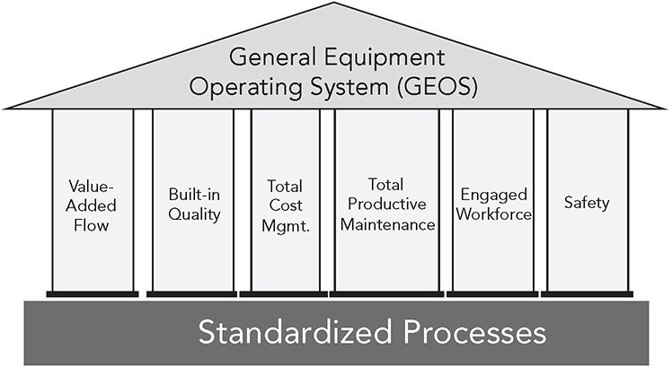

**Figure C.1** The General Equipment Operating System.

The consulting firm sets a recipe for “lean conversion.” The firm develops “lean metrics” associated with each pillar and the foundation and recommends a minimum score for all plant managers in year one. The scores are tied to the bonuses of the managers to motivate them to commit to lean. The consulting firm leads a demonstration project, called a lighthouse, in the factory nearest headquarters. It then aggressively moves across plants, using its 4x4 approach: four parallel “kaizens” at a time, once per month, for four months. The kaizens are five-day events orchestrated by a senior consultant, with each of the four workshops led by a local manager or engineer. The results are stunning. The plants are cleaner and better organized, flow cells are created, inventory is reduced, and the plants run better than ever before. The senior executives are ecstatic with the results. They purchased lean, and the investment paid for itself in the first year.

And for additional fees they can purchase the “communication package” and the “change management package” to get their employees on board. What could be better?

The internal director of continuous improvement was impressed, but confessed:

_I have noticed that the early lighthouse projects are slipping backward. When the consultants leave, the great new processes they introduced are not sustained by our managers. Even the lean assessments and bonuses do not seem to be enough to get the managers to take ownership. That is on us. We have to do a better job of developing our managers or getting the right people into the right management positions._

TPS sensei in Toyota would not be surprised that the changes were not sustained. Some would call this “consulting nonsense.” After all, the consultants may have understood what they were trying to do, but the people running the operations did not take ownership or have time to understand all the tools introduced, and certainly the shop floor workers did not develop new, disciplined habits. Trying to motivate managers with extrinsic rewards and punishments only means they will comply, not lead.

In contrast to the approach of General Equipment and its consulting firm, Toyota sensei would instead go slower in a model area (the first “lighthouse project”) and put managers in charge from the beginning. They would challenge, and ask questions, and expect the managers to struggle to figure out what to do next at each step. Struggle is a good thing for learning. Successful struggle, with some failures along the way, is a great thing for learning. It is comfortable not to struggle, but that will not lead to anything even approaching excellence. The lighthouse would become an incubator for learning by other managers and internal continuous improvement leaders who would start their own projects, possibly with a C.I. leader in each global region. Deployment would take longer to begin with, but then pick up steam as more leaders learned by doing.

The problem goes back to my original distinction between mechanistic and organic philosophies. Figure C.2 contrasts the myth of TPS from a mechanistic perspective as a set of tools to make short-term improvements on the shop floor with real TPS from an organic perspective as the basis of a total management philosophy.

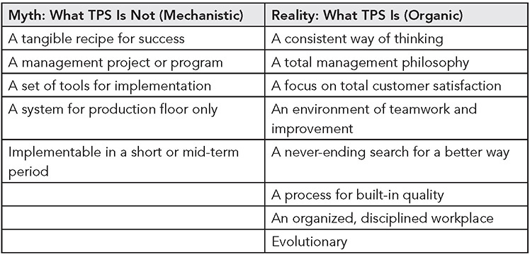

**Figure C.2** Myth versus reality of TPS.

_Source:_ Glenn Uminger, former general manager, Toyota Motor Manufacturing North America.

The attraction of the “myth” of mechanistic lean is that it is comparatively easy and natural for command and control organizations. Forget uncertainty. Don’t worry about all those messy people issues. Don’t try to change the thinking of senior management. They already know how to issue targets and go after them by hiring outside expertise and holding everyone’s feet to the fire. Get it done or else! The problem is that over the long term it does not work. Lean processes degrade and when there is a downturn in demand or change in leadership the lean program is dropped and replaced with the next new thing.

**APPROACHING LEAN TRANSFORMATION SCIENTIFICALLY**

Most companies desire a road map for lean—a “tangible recipe for success.” When you contract out to a consulting firm that has a road map, like Mechanistic Lean, you are assuming the firm can predict what is going to happen, and in fact, the firm’s representatives typically are pressured to pretend this is true in order to sell their services. Most internal lean consultants are expected to develop a plan and business case based on reading the future. Get out your crystal ball.

What I have seen work is approaching lean deployment scientifically, based on facts and data, learning as you go, with a compass but no road map. Hard to imagine? Dr. Deming taught us with his Point 7, “Adopt and institute leadership,” to “expect your supervisors and managers to understand their workers and the processes they use.” Toyota kata provides a way to teach managers to “understand their workers and the processes they use” and to approach achieving challenging goals scientifically. Now imagine a C.I. leader who has experience with real TPS, was trained in Toyota Kata, and is given the assignment to transform a plant to lean based on the model in Figure C.1\. Rather than charge off and start implementing solutions, she would step back and approach it scientifically using something like the improvement kata model:

1\. **What is the challenge?** What are we really trying to accomplish with the lean transformation? What is our long-term vision? What would success look like one year out, and how would we measure it?

2\. **What is the current condition?** Where are we now in our processes and people?

3\. **What is the next target condition, and what are the obstacles to that target condition?** Let’s get started, but not following a laid out plan, or trying to achieve the challenge in one step. Let’s break it down and work toward one target condition by overcoming obstacles. When we reach this we can reflect, define our next target condition, and so on.

4\. **What is the next experiment I will run to overcome an obstacle?** Experiment, learn from each experiment, and have fun!

Mr. Hajime Ohba of TSSC used the same basic model when coaching Herman Miller—no surprise since the IK was based on how people like Ohba approached transformation (see Figure C.3). The journey started in 1996 when Mr. Ohba walked the gemba to understand the process and issued his challenge: Without major capital investment, and building the same number of file cabinets, go from 2 assembly lines, 3 shifts, and 126 people to 1 assembly line, 2 shifts, and 15 people. This of course was unimaginable to the group of people assembled, but they played along. Two young managers present had some experience and understood the power of lean. While waiting and hoping to get support from TSSC, they had been sent for several months on an internship in an auto supplier that Mr. Ohba had worked with. Matt Long was one of them, and he ultimately led the development of the Herman Miller Performance System as vice president of continuous improvement until he retired in 2020.

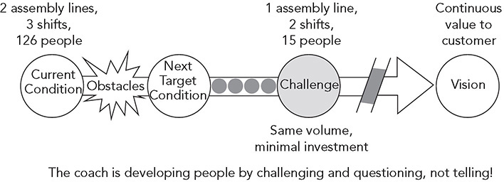

**Figure C.3** Scientific pattern of TSSC’s Hajime Ohba leading the model line in the Herman Miller file cabinet plant.

The next step after getting the challenge was to “stand in the circle” and observe assembly of the file cabinets. Then the people Mr. Ohba was teaching were asked to identify where they wanted to begin to focus their attention (sort of like a target condition), generate some ideas for improvement, and test them out. It was not as structured as Rother’s starter kata format of trying one thing at a time and writing down expectations and reflections on each experiment, but Ohba returned regularly to coach, asking similar questions, gave similar assignments, while not giving answers. The people in the group had support from Toyota members who were interning at TSSC, and they were also learning from Ohba.

As usual for TSSC projects, the results were stunning. The company never completely achieved Ohba’s challenges, but there were impressive results in the first year, and the employees continued working on the file cabinet plant for the next 15 years with coaching from TSSC (until it was shuttered for other business reasons). It became a model for TSSC to use in TPS workshops. The coaching started with assembly, then moved through the value stream, step-by-step. For example, when it because clear that the constraint was sorting through the inventory of painted panels that came in large batches the team moved back to paint. The Herman Miller people did not do value-stream mapping and “implement the map,” yet the resulting system ended up looking like a very good future-state map. After 15 years, the company had achieved one assembly line, two shifts, and 30 people, at a higher level of units produced per week—a 483 percent improvement in productivity (see Figure C.4) with no investment in automation.

Many people rotated through the model-line area and brought what they learned to other parts of Herman Miller. Continuous improvement leaders were developed for each plant, and as we saw for Principle 10, this then extended to versions of Toyota group leaders and team leaders. There were ups and definite downs, but the long-term result was the Herman Miller Performance System, which became a deep part of the culture, still fragile, but with staying power beyond most lean deployment attempts. The long-term results across all of manufacturing were equally stunning (see Figure C.5).

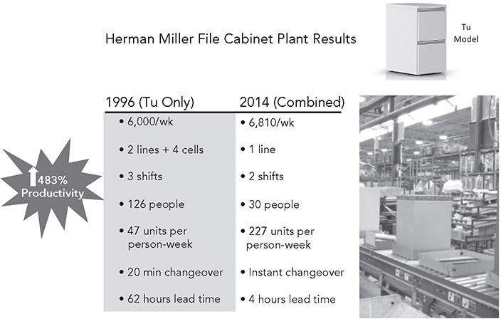

**Figure C.4** TSSC supports Herman Miller in first model-line project.

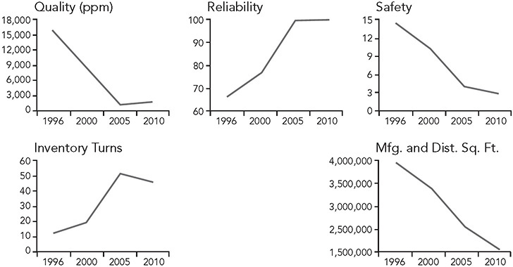

**Figure C.5** Long-term results of Herman Miller Performance System across all manufacturing.

When we think of a model line, we often think of the challenge statement as a big financial result, but the more difficult challenge is developing the capability of people. In fact, process improvement and people development go hand in hand. In Rother’s model there is a key role for managers as coaches who develop scientific thinkers who practice the improvement kata. The chicken-and-egg problem is that those managers need to be coaches, but first they have to be learners to build their competencies and know-how by taking on a business challenge and practicing the improvement kata pattern to work scientifically toward it. We saw an example of this in the way Dallis was trained when he entered Toyota (see Principle 9 on leadership). The constraint at first is that there are few or no qualified coaches inside the organization. The ideal state is to have all coaching done internally with managers coaching their own teams. Figure C.6 provides one example of how this might work following the kata model. The job of the “advance group” (AG) of leaders is to monitor and guide the process (PDCA). First these leaders scout out what the kata is to see if they are interested, and then they practice it themselves with an experienced (possibly external) coach. With that experience they are then in a position to develop a plan for the next 6 to 12 months for how many coaches they will develop. This is not the usual plan with a series of milestones and dates. Rather it is a challenge to the organization.

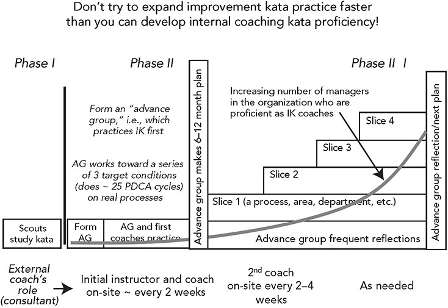

**Figure C.6** One model for deploying practice.

_Source:_ Mike Rother.

As with any other challenge, the next step is to understand the current condition. How many people in the organization have the propensity for scientific thinking? And who are open to learning? What are good projects to start on? Then start your model lines and the role of the AG is to study, reflect, learn and adjust. Every day is an experiment! The AG should go first as learners, meet regularly, and between meetings monitor the process so it can make informed decisions about how to provide support and when to spread the process to other areas. Notice that the process of developing coaches is not linear, but exponential: 1 begets 2 begets 4 begets 8, and so on. Zingerman’s Mail Order called this advance group activity “kata the kata.” The company applied the improvement kata pattern in deploying improvement kata practice.1

The reason for starting small and piloting is for learning. Piloting is built into Toyota’s culture. They rarely deploy much of anything broadly before it is tested. It is easy to assume that our ideas must work because they make so much sense to us. Yet, when we actually confront our assumptions with reality we almost always find some surprises. The surprises are the basis for learning and improvement, before broadly deploying unproven ideas.

**THE EVIL OF ENTROPY AND HOW TO BEAT IT**

There have been many companies that seemed to get off to a good start with lean, like the case of General Equipment, but the effort lost steam. The most common question I am asked is, “How can we sustain the gains of lean?” This is itself the wrong question. By now in the book, it should be clear that lean is not something you can mechanically do to processes and then expect the changes to stick. There are no quick-fix sustainment tools. Organizational entropy (a tendency toward decay of systems) will naturally cause regression from the new state, because it requires more energy than the old, steady state; the old state is more natural and easier to sustain (see Figure C.7). Lean transformation pulls the organization out of its steady state. Then, like pulling on a rubber band, if we let go, it snaps back to its steady state. And contrary to the notion that lean processes fix problems, the truth is they reveal problems and place a higher burden on leaders, managers, and team members to keep on improving. We saw, for example, that inventory can hide problems, while one-piece flow makes the problems visible and can quickly shut down processes. When the main source of energy for change comes from the team of external “experts” who stop in to “fix” things and then leave, the capability and energy simply are not available to counter entropy.

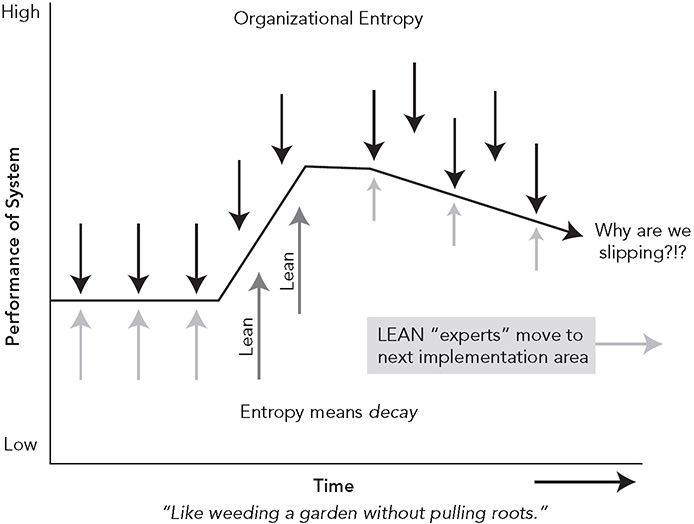

**Figure C.7** Entropy will always lead to backsliding after “lean tool implementation” if local management does not take ownership.

_Source:_ David Meier.

A useful analogy is our personal fitness. We go to a class that teaches us to go on a strict diet and exercise intensely every day and in six weeks we lose a bunch of weight. We feel great and never want to go back. But the chances are high we slip backward. The new regime was unnatural to us and our bodies, and we have to push ourselves way beyond what feels comfortable to maintain it. When we stop making the extreme effort we did under the pressure of teachers and structure of the class, we fall back to our steady state of overeating and poor exercise habits. Karen Gaudet experienced something similar at Starbucks when the company mass-spread “Playbook” (discussed under Principle 5) and she observed backsliding:2

_No matter how superior the new way seems, people fall back into old patterns. . . . Whenever partners fell back into ad hoc work routines, we found, they had a hard time going back to their playbook routines. . . . What we lacked was leadership resolve to remain a lean operation, to train all incoming employees in the basics, and to push ourselves further in understanding. . . . As one concession or adjustment after another was made, the level of lean capability began to slide._ 

We saw under Principle 13 how Toyota combines hoshin-driven PDCA of big changes with daily management changes of SDCA, because both are essential to continuous improvement. Big changes throw people and processes out of a stable state and have not been fine-tuned. Our new processes at this point are still a tentative desired state. When the new concept of a process meets reality, reality wins, unless there is at least an equal and opposite force to beat entropy. The positive energy to counteract entropy comes from work groups improving and taking ownership of the standards and continuously identifying and correcting deviations from the standards as conditions change and more is learned (see Figure C.8).

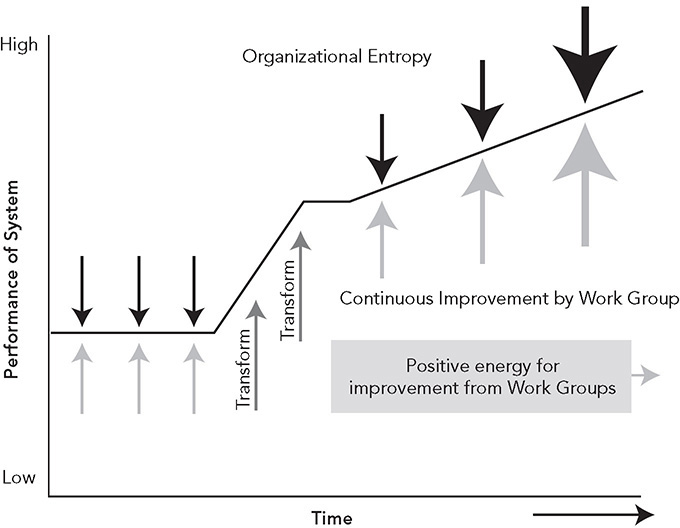

**Figure C.8** Counter entropy with positive energy from the local work group.

_Source:_ David Meier.

In this model, we see the importance of piloting the new ideas to learn what happens when they bump up against reality. Run the experiment and study what happens. The new approach can then be spread gradually from work group to work group, in each case training group leaders and team leaders to understand the new processes and goals and helping them to become trainers for team members. This creates a very different dynamic, one of having local control, rather than having change imposed from senior management and “lean specialists” doing all the thinking. Unfortunately, this approach takes more time and effort, just as developing new eating and exercise habits takes more time and sustained effort than a short-term extreme diet.

I have personally participated in many lean transformation efforts and witnessed many others. All too frequently, a great and exciting start peters out. Reasons include:

1\. **Lack of senior management commitment.** Senior executives delegate lean down to continuous improvement specialists, but are nowhere to be found at the gemba and wait for the results to come up (see the Volvo hoshin diagram, Figure 13.1).

2\. **Changing of the guard.** More than once, when we did have an enthusiastic CEO and thought “This is the one,” the CEO soon was pushed out and a new one brought in who had a mechanistic view of lean to get quick financial results. The party was over. One of the challenges at Starbucks was the rapid turnover of store managers and shift supervisors and partners, even though the lean transformation led to less turnover than the industry standard.

3\. **Political jockeying.** Great things were happening at the gemba while staff specialists in departments like quality and HR, who were far from the gemba, were plotting to take over lean.

4\. **Great pilots, then quickly go live everywhere at once.** We strongly believe in the model-line approach of Toyota, but what happens after the model line? Too often when executives see the results, say for one value stream of one plant, they multiply the expected benefits across all operations and order the lean folks to “make it happen” by the end of the year.

5\. **Little or no focus on developing desired skills and mindset.** The transformation is viewed as a technical problem, rather than also a process of brain training.

The recurring theme is that even starting out strong organically will go bad if the executive level sees lean implementation as an independent variable: do lean (independent variable); get results (dependent variable). This is far from system thinking. A better model is: strive for appropriate lean systems (dependent variable) taking a scientific approach (independent variable). Coming out of this will be competitive advantage and profits.

Still there are a number of good examples in this book of companies working to build a culture of excellence for the long term that have had staying power. And organizations like TSSC, LEI, and various high-quality consulting firms around the world all have long-term success stories. Here are a few examples:

 **Herman Miller.** I described the heroic effort the Herman Miller office furniture company has been making to develop work team leaders and facilitators under Principle 10\. Starting with TSSC in 1996, HMPS is persisting through ups and downs, still going strong in 2020\. The immense performance gains are credited with keeping manufacturing in the United States, while competitors fled to low-cost labor in Mexico.

 **SigmaPoint.** This is a smaller, single-plant company, so perhaps it is easier for the management team, from the CEO to middle managers, to be completely aligned as a lean enterprise. The focus has been on developing people to think scientifically, and this learning organization has continued to evolve month by month, improving sales and profits.

 **Zingerman’s Mail Order.** This is an even smaller company, which operates out of a warehouse–call center. My student Eduardo Lander began consulting to Zingerman’s in December 2003, and as of 2020, he continues to return regularly to coach. After growing out of space every few years before the lean journey started, the company has generated double-digit annual growth while staying in the same facility (with some additions) since 2003, saving millions of dollars. The partners and managers are all in on lean and have brought scientific thinking to frontline associates through practice of starter kata. They adapted quickly and innovatively to the Covid-19 crisis and fulfilled records sales, earning record profits that they shared with all team members.

 **Nike.** Nike brought in former Toyota managers as external consultants to run the company’s global lean program dating back to 2001\. Nike manufactures very little itself, but focuses on creating lean value streams back to suppliers and strives to be connected, synchronized, and stable, with continual improvements in quality, productivity, and lead times. The approach was similar to how TSSC worked with Toyota suppliers on model-line projects. Nike set up regional “Innovation and Technical Centers” starting in 2004 to support supplier partners, and it helped partners to learn through short-run projects ranging from 3 months’ to 12 months’ duration. In 2019, Nike lean leaders clarified expectations for suppliers to develop their own internal lean capability and moved on to looking more broadly at the value chain increasing speed through lean and digitization from purchase order to delivery.

Each of these firms went beyond lean tools and has worked hard at developing people in the skills of continuous improvement. Their visions go beyond making a profit and focus on doing an excellent job serving customers. There were differences in the specifics of how they approached change, but all used a similar pattern:

1\. Started with a pilot and a challenge of some sort and deployed incrementally and thoughtfully without going too fast for people to absorb

2\. Thought long term and had a vision of excellence through a Toyota-like philosophy

3\. Focused on internal managers learning, mostly with, and sometimes without, external consultants who acted as coaches rather than experts

4\. Took an experimental learning approach, rather than an implementation approach

5\. In some way created a coaching culture with repeated feedback so that a disciplined way of acting and approaching problems became habitual

6\. Maintained continuity of lean leadership by developing and retaining leaders

7\. Provided job security and would not lay off anyone because of kaizen

**GETTING TO THE ROOT OF SUCCESS: CULTURE CHANGE** 

The toughest and most basic challenge for companies that want to learn from Toyota is _how to create an aligned organization of individuals who each have the DNA of the organization and are continually learning together to add value to the customer._ It seems that whatever the starting point of discussions of lean transformation, we end up talking about culture. Perhaps this is an indication that culture is at the root of everything I have been discussing.

Culture change is a complex topic and the subject of many books. The tricky part is that culture is all about people _sharing_ values, beliefs, and ways of approaching problems. What you see and hear when you walk into a company for the first time are only surface manifestations of culture. Figure C.9 depicts a culture as being like an iceberg. If you tour a “lean plant,” you might learn about the mission statement and guiding principles, perhaps see it on a poster in the lobby. Then you will see tools and formal structures—perhaps 5S, cells, KPI charts, kanban, team structures, daily standup meeting areas, and the like. At this point, you only know what management intends to be happening, not what is really happening. These are what anthropologists call artifacts. Patrick Adams calls this “continuous appearance” as opposed to “continuous improvement.”\* To really understand the culture, you must dig deeper in the gemba to see if individuals are changing the way they are thinking and acting.

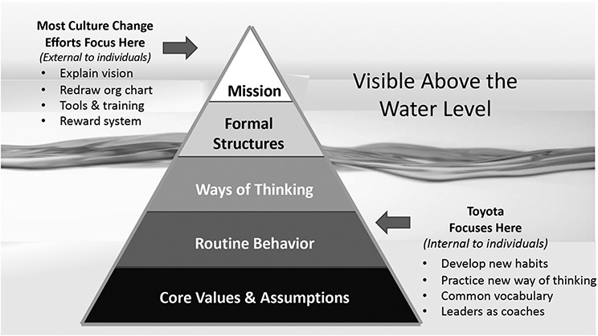

**Figure C.9** A misunderstanding of culture change leads to superficial change—change only at the visible level.

Below the surface at Toyota is the Toyota Way culture. I mentioned Edgar Schein’s perspective on culture under Principle 9 on leadership. Let’s delve a bit deeper. He defines culture this way:3

_The pattern of basic assumptions that a given group has invented, discovered, or developed in learning to cope with its problems of external adaptation and internal integration, and that have worked well enough to be considered valid, and, therefore, to be taught to new members as the correct way to perceive, think, and feel in relation to those problems._

This is a remarkably apt description of the Toyota Way culture in a number of ways:

1\. The Toyota Way has a depth that goes down to the level of basic assumptions about the most effective way to “perceive, think, and feel” in relation to problems. These include genchi genbutsu, people working together as a team toward a series of challenges, respect for people, daily improvement through kaizen, and the focus of Toyota on long-term survival.

2\. The Toyota Way was “invented, discovered, and developed” over decades, as talented Toyota managers and engineers, like Ohno, “learned to cope with its \[Toyota’s\] problems of external adaptation and internal integration.” The history of Toyota is very important because we understand the challenges and context that led to active on-the-floor problem solving, not theoretical, top-down programs.

3\. The Toyota Way is explicitly “taught to new members.” Toyota does offer training classes on the Toyota Way and TPS, but that is a limited part of the learning process. The Toyota Way is explicitly taught in the way you should transmit culture—through action in day-to-day work where leaders model the way and coach. As Jane Beseda, former vice president of Toyota Sales, explained:

_The Toyota Way matches everything that they \[team members\] do every hour of the day. So, they are swimming in this culture and this philosophy. We’re always doing kaizen projects. It’s a part of who we are._

When Toyota began seriously globalizing in the 1980s, it quickly realized the challenges of creating the Toyota Way in cultures that were not naturally aligned with the company’s values. The approach to globalizing, while developing Toyota Way culture was:

1\. All executives were assigned Japanese coordinators and all managers and group leaders were assigned trainers. The coordinators and trainers had two jobs: coordinating with Japan, where there are continuous technical developments, and teaching employees the Toyota Way through daily mentorship. Every day was a training day, with immediate feedback shaping the thinking and behavior of the employees.

2\. Toyota sponsored many trips to Japan, which turned out to be one of the most powerful ways to influence the cultural awareness of employees. The success of NUMMI started with managers, engineers, group leaders, some workers, and union officials working in Toyota factories in Japan and experiencing the system firsthand.

3\. Toyota used the TPS technical systems, or “process” layer of the Toyota Way, to help reinforce the culture Toyota sought to build. For example, we discussed how large-batch manufacturing with lots of inventory supports the Western culture of short-term firefighting and systems problems being allowed to fester. By connecting processes, problems are surfaced all the time and made visible so there is a sense of urgency to solve them.

4\. Toyota sent senior executives to each operation to ingrain the Toyota DNA in new leaders. This started with managers from Japan and evolved to homegrown leaders.

The original North American plants were assigned a mother plant in Japan that sent leaders to the states to teach the local leaders. As Toyota expanded operations in the United States, local veteran plants took on the mother plant role. In each country, Toyota adapts, particularly in human resource practices. For example, adaptations in the Toyota Technical Center (TTC) in Ann Arbor, Michigan, included:

1\. Toyota put a cap on work hours and became more flexible. In Japan, Toyota engineers historically worked as needed, even if it was 12 hours a day, nights, and weekends. TTC capped work hours and introduced a flextime system including one day of working at home.

2\. Toyota changed how it provides performance-based rewards. Traditionally, Toyota in Japan pays a large portion of salary in semiannual bonuses, but these are tied to company performance, not individual performance. In TTC, the company developed an individual bonus system based on performance.

3\. Hansei events at TTC were modified to provide more positive feedback in addition to critiques and opportunities for improvement.

Companies that approach lean mechanistically usually do a lot of talking, but the lean philosophy only superficially penetrates into the culture. Buying those communication and change management packages from Mechanistic Lean won’t be enough. Building culture through kata starts with a focus on mindset and behavior; and only through a long process of repeated practice can you create a culture of scientific thinkers.4

Some of my best clients have recognized that successful lean transformation means “winning the hearts and minds of all members.” In Figure C.9 we see that surface-level lean focuses on easy levers external to the individual—explaining the vision, redrawing the organization chart, teaching about tools and concepts in a classroom, and manipulating the reward system. On the other hand, deep culture change gets to the level of individual change, developing a new mindset and coaching a shared way of thinking, speaking, and acting.

At the core of any successful culture change effort is mutual trust. If team members don’t trust managers, or if managers don’t trust team members, the words of continuous improvement and respect for people will be empty. Mutual trust comes from actions, not words. When I see you behaving consistently over time showing competence, understanding, concern for me, and fairness, I will trust you, until you act in a way that violates that trust. Unfortunately, it is much easier to destroy trust than to build it.

**A COMMITMENT FROM THE TOP TO BUILD A DELIBERATE CULTURE FROM THE GROUND UP**

Will Rogers, American humorist and social commentator, said, “We are a great people to get tired of anything awful quick. We just jump from one extreme to another.” I am afraid that is what most companies are doing with lean manufacturing. It is just one more thing to jump into and one more thing to jump away from when the next fad comes along. “The world is digital; what’s next after lean? Oh yes, Industry 4.0\. Let’s do that.” If there is anything to learn from Toyota, it is the importance of developing a system and sticking with it and improving it. You cannot become a learning organization by jumping willy-nilly from fad to fad.

What do we know about changing a culture?

1\. Start from the top—this may require an executive leadership shake-up.

2\. Involve from the bottom up.

3\. Use middle managers as change agents.

4\. Don’t expect instant changes. It takes years to develop people who really understand and live the philosophy.

5\. Don’t expect it to be easy. Just the opposite—on a scale of difficulty, it is “extremely” difficult.

The Toyota Way model was intentionally built from the ground up, starting with a philosophy that has been deeply embraced by the chief executives of the organization. What was the goal? To build an enterprise for the long term that delivers exceptional value to customers and society. This requires long-term thinking and continuity of leadership. For organizations looking to emulate the Toyota Way, understand that there is no quick fix. It may take 10 years or more to lay the foundation for radically transforming an organization’s culture.

What if the top does not understand and embrace the new philosophy? I asked Gary Convis the following question:

_If you were a middle manager or even a vice president passionate about implementing the Toyota Way in your company and the senior executives did not strongly support it, what would you do?_ 

His answer was blunt:

_I would be out looking for better pastures_ (laughter), _because the company may not be around long enough for me to get my pension. Actually, that’s a good question. Now, there could be a change in the top management. Maybe somebody up in the board recognizes that lean is not happening and needs to. Like General Motors did. . . . I think the board said, “Wait a minute, we’ve been giving these guys rope and we’ve been giving them time and we don’t see the direction.” At some point in time they decided enough is enough. The new direction was set and new priorities were set and resources were established._

A prerequisite to change is for top management to understand and commit to leveraging the system and philosophy to become a “lean learning organization.” And it needs to follow the principle “Grow your own lean learning enterprise,” getting ideas and inspiration from the Toyota Way. Don’t copy; think! What is your situation and vision, and how can you translate this to fundamental principles you will work to follow?

This insight led me to develop the model shown in Figure C.10, which illustrates the minimum level of leadership commitment needed to effectively start on the lean journey and to learn from Toyota’s model of a lean learning enterprise. Look at the figure, and answer these three questions:

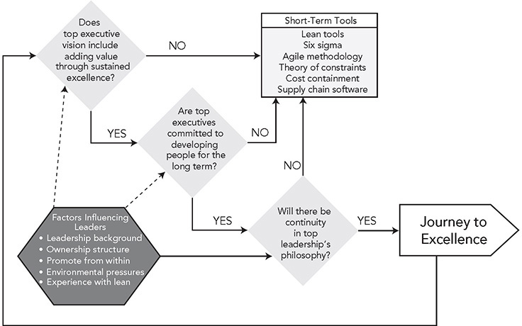

**Figure C.10** Top leadership commitment to the lean journey.

1\. **Does top executive vision include adding value through sustained excellence?** If the commitment is simply to short-term profitability, the answer is no, so go directly to the “Short-Term Tools” box (the equivalent of “Go directly to jail” in the game Monopoly).

2\. **Are top executives committed to developing people for the long term?** This includes key suppliers. If people are viewed as expendable labor and suppliers are viewed as sources of cheap parts, the answer is no, so go directly to the “Short-Term Tools” box.

3\. **Will there be continuity in top leadership’s philosophy?** This does not mean the same people need to run the company forever, but they need to develop their successors with the company’s DNA to continue the philosophy. If new leaders with a different philosophy are brought in every time there is a crisis or if the company is bought out every decade with a new cast of characters installed as leaders, the answer is no, so go directly to the “”Short-Term Tools” box.

Note that there is a feedback loop from “Journey to Excellence” back to the original question of top leadership’s commitment to a long-term vision that must be continually challenged. Figure C.10 also shows a set of factors that will influence whether top executives are committed to the lean vision. These include:

1\. **Leadership background.** It starts with who the leaders are. What is their background? What have they learned through their careers about what works and does not work, and what is to be valued? What are the underlying assumptions they grew up with?

2\. **Ownership structure.** Who owns the company and how it is financed has a major influence on the ability of the company to focus on the long term. Looking good to Wall Street for the quarter may conflict with long-term investments in excellence. Toyota clearly has a unique situation with only one board of directors led by the company president (Akio Toyoda at present) and a structure of interlocking ownership within the Toyota Group among like-thinking organizations that grew up together. With this insulation, being publicly traded has not prevented Toyota from taking a long-term perspective.

3\. **Promote from within.** Develop future leaders from within, or there is little chance of sustaining a long-term vision. Generally, Toyota has been conservative in bringing in managers and executives from the outside, because of the possible threat to the culture. But the culture is so strong and there are so many people with the Toyota Way DNA, that any “outside” manager will be socialized to learn the Toyota Way or decide to leave. Recently, there have been exceptions, as Akio Toyoda led a major shake-up to position Toyota for the once-in-a-century transformation of the industry as a result of digital technology. Toyoda understood the company would need leaders who are experienced in the digital world, like the recently appointed CEOs of Toyota Research Institute and Toyota Research Institute–Advanced Development—both of whom were selected because they admired the Toyota Way and were natural learners.

4\. **Environmental pressures.** Unfortunately, there are factors beyond the control of any lean leader that can make it difficult to sustain the lean learning enterprise. One is the equity market, which can take major downturns independent of the enterprise; another is the market for the particular product the company makes, which can deteriorate for a host of reasons. Other external factors that can negatively impact a company are wars, radical new technologies, government policy changes, pandemics, and on and on. Clearly, Toyota’s strong culture and philosophy have helped it navigate through these treacherous environments to survive and prosper in many different business and political environments.

5\. **Experience with lean.** The best lean leaders in my experience worked for Toyota, or for someone who worked for Toyota, or for a company that worked closely with Toyota—the common theme being direct exposure to the Toyota gene pool. They practiced a new way of managing. Obviously, as more and more companies develop real lean systems, there are broader opportunities for learning lean thinking outside Toyota and its affiliates.

What can you do if you are not the CEO and top management is interested primarily in short-term financial results? There are three things I know of:

1\. Find greener pastures, as Convis suggests.

2\. Participate in playing the game of applying tools for short-term gains, learn what you can, and hope you share in the gains.

3\. Work to build a successful lean model and educate top management by blowing them away with exceptional results.

The third alternative is generally going to be the most productive for those with a passion for lean. “True believers” of lean will have to do their best by creating lean models with great results that executives can learn from and then sell upward. But no matter what the approach, it will take time for management to understand lean and for the old system and culture to evolve. Even within Toyota, Convis noted:

_The Toyota Way and the culture—I think it takes at least 10 years to really become in tune with what is going on and be able to manage in a way that we would like to sustain. I don’t know as you can come into Toyota and in three or four years have it in your heart and your spirit with a deep understanding._

**IS IT WORTH THE EFFORT AND LONG-TERM COMMITMENT?**

Having said all this, the question remains, can a company transform and sustain a culture to become a lean learning organization? If a company can maintain continuity of leadership over time, I see no reason why it cannot profit from its version of the Toyota Way principles.

National culture throws up its share of challenges. There is a litany of cultural traits that differ between Japanese and Americans and French and Germans, etc. For example, we saw that the philosophies underlying hansei that Toyota considers necessary for kaizen are rooted in Japanese upbringing. There is even some evidence that Asians more naturally perceive systems of interacting parts, while Americans are more likely to see the parts as independent.5 Yet the Toyota Way is working and prospering within Toyota affiliates around the world, albeit with a great investment of time and energy by Toyota in growing its unique culture in each locale. And the Toyota Way is evolving as it adapts to other cultures, probably making Toyota an even stronger company.

The only way I know to make lean sustainable is to make scientific thinking a habit. If someone is not already wired this way, which he or she is probably not, this means practice with corrective feedback over a long period of time. I can understand the impatience of executives who are reporting to impatient boards and shareholders. It is hard to keep saying “We are working on it; we do not have a road map, but do not worry because we are taking a scientific approach to pursuing our business challenges.” And it may be frustrating to have to go through all this effort and pay so much attention and to think so much without immediate homerun results. Why can’t it be easier? It can be easier. Just hire the folks at Mechanistic Lean and pay their hefty fees, and they will turn things upside down and get results enough to pay for their cost and then some. What you will not get is a culture of continuous improvement that respects people and generates sustainable value. I have seen this movie many times before, and it does not end well.

The greatest struggle I see in companies is the tension between deploying lean deeply in a slice of the business, as in a model line, and then spreading it out systematically to the rest of the organization on the one hand, and deploying lean as widely and as rapidly as possible to get big results fast on the other (see Figure C.11). In my consulting work I have always advised going deep to build competency. This almost always has led to local success, but then orders would often come down from the top to move fast across the company with a proven methodology—which meant our consulting team was out. I was convinced these companies would go backward and entropy would win, but in some cases I was wrong. I have seen companies that started out mechanistic have long-term success by later shifting to a more organic approach. Often, after going broad in a lean race against time, they discover that the changes are not being sustained and shift to a more focused approach of developing leaders. “Implementing” lean tools was not time wasted, but provided some skills and common vocabulary for deeper learning in a later phase.

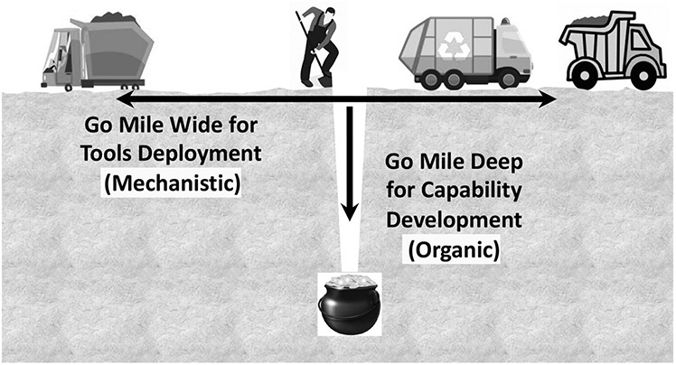

**Figure C.11** Balancing mile wide for efficiency _and_ mile deep for culture change.

The good news is that there are examples throughout the world and across types of organizations of great success on the lean journey. Many have experienced a level of performance and satisfaction they never thought possible. There is enthusiasm and excitement, and work is actually fun! The tough news is that there is no guarantee of eternal success. It continues to take work, even at Toyota. It’s a lifetime of interesting challenges.

Let’s go back to the short-term fitness program that was not sustained. You try a new one that focuses on creating a long-term healthy lifestyle. You meet weekly at a gym for one year, along with a group that provides support and positive feedback. You are taught a series of exercises that you are asked to practice at home. A high-protein, low-carb diet is presented with weekly suggestions for meals. Gradually you lose weight and your body is toned. You never looked and felt so good. For four years after the fitness program ended, you sustain the diet and exercise. Life is great! Does that mean you will stay fit for the rest of your life? It is possible, but it is also possible that life will get in the way and you will revert to old bad habits. Does this mean the healthy lifestyle program was a failure? It certainly succeeded, but it still depended on continued effort. Lean management is like that—sustainment does not come from coasting. You need to keep working at it. Continuous improvement and respect for people are an eternal quest, because the journey to excellence never ends.

Even though there are plenty of uncertainties and challenges, my advice is to consider Toyota Way principles as you envision and work on your future organization. The Toyota Way is to do the hard work of striving for excellence. It is a call to treat people with respect. It is a call to develop in people the ability to lead with respect. It is a call to plan, but ultimately to accept the uncertainty of the world and navigate through the obstacles with a scientific mindset, and even enjoy the trip. It is a call to action, but reading this book or benchmarking Toyota is not action. Action is doing. Improvement requires developing a picture of where you want to go, experimenting with some large and many small changes, noticing gaps between what you expected and what happened, and a lot of reflecting. Go beyond trying to copy or spread best practices, to evolving your own lean learning enterprise.

 KEY POINTS 

 The starting point is a vision of what you are trying to accomplish.

 The Toyota Way vision is to engage the total organization toward adding value to customers and society, continually adapting, improving, and learning.

 Mechanistic implementation feels more comfortable for companies focused on short-term profitability.

 Entropy causes much of the gains from short-term mechanistic deployment to decay over time.

 The best antidote to entropy is the positive energy of continuous improvement by work groups at the gemba.

 Organizations with long-term success on the lean journey start with a commitment from the top to work toward a long-term vision and then organically grow from model lines to broader deployment led by local management.

 A scientific approach to deployment starts with developing scientific thinkers and coaches organically and expanding as skilled coaches mature.

 Most culture change programs focus on artifacts and what people say, but do not penetrate deeply to how people think and act.

 Toyota kata focuses on repeated practice to change actual behavior and ways of thinking and create a scientific-thinking culture.

 The Toyota Way provides inspiration and ideas for creating your own vision and direction.

 If your organization’s success depends on excellence, a serious commitment to long-term development will be worth the patience and effort.

**Notes**

1\. Eduardo Lander, Jeffrey Liker, and Tom Root, _Lean in a High-Variety Business: A Graphic Novel About Lean and People at Zingerman’s Mail Order_ (New York: Productivity Press, 2020).

2\. Karen Gaudet, _Steady Work_ (Boston: Lean Enterprise Institute, 2019).

3\. Edgar H. Schein, “Coming to a New Awareness of Organizational Culture,” in James B. Lau and Abraham B. Shani, _Behavior in Organizations_ (Homewood, IL: Irwin, 1988), pp. 375–390.

4\. Mike Rother and Gerd Aulinger, _Toyota Kata Culture: Building Organizational Capability and Mindset Through Kata Coaching_ (New York: McGraw-Hill, 2017).

5\. Richard Nisbett, _The Geography of Thought: How Asians and Westerners Think_ (New York: Simon & Schuster, 2004.)

\_\_\_\_\_\_\_\_\_\_\_\_\_\_\_\_\_\_\_\_\_\_\_\_\_\_\_\_

\* Patrick Adams in his self-published book, _Avoiding the Continuous Appearance Trap_, contrasts the cultures of two companies he worked with. Though each started with similar lean models and visions, one was mechanistic and only gave the appearance of lean, while the other evolved a culture of continuous improvement.

