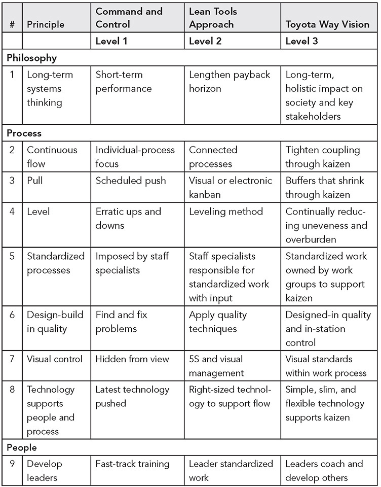
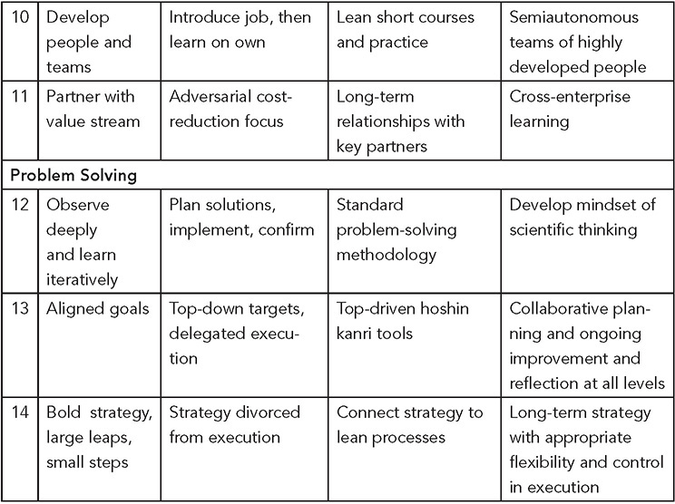

 Appendix 

**An Executive Summary and Assessment of the 14 Principles**

**THE TOYOTA WAY IS MORE THAN TOOLS AND TECHNIQUES**

The more I have studied TPS and the Toyota Way, the more I understand that it is a technical _and_ social system working together. The Toyota Way leads to more dependence on people, not less. On a daily basis, engineers, skilled workers, quality specialists, vendors, managers, team leaders, and—most importantly—team members are all engaged in continuous problem solving and improvement, which over time trains everyone to think scientifically and become better problem solvers.

This Appendix provides a synopsis of the 14 principles that constitute the Toyota Way. The principles are organized into four broad interrelated categories:

 **Philosophy**_—_Long-term systems thinking.

 **Process**—Struggle to flow value to each customer.

 **People**—Respect, challenge, and grow your people and partners toward a vision of excellence.

 **Problem solving**—Think and act scientifically to improve toward a desired future.

I have also included Figure A.1 for you to do a very rough assessment of where you are on the 14 principles. I developed descriptors for a baseline of top-down management and control, compared with companies at the tool level of lean and then with the ideal of the Toyota Way principles. You can simply circle where you are on each principle. If you believe you are between two levels, put an X in between. If you connect the circles and Xs, you will have a visual profile. You might want to reword some of the principles with your version for your company.

You could also use this for planning, marking where you want to be over the next year or so. The point is not to develop desired targets on each principle and then try to implement them all. As you learned about the scientific way of thinking in this book, think about the future state as possible challenges. As in hoshin planning, pick the critical few. Don’t take on too many at once. Then approach them iteratively, one target condition at a time. Experiment, learn, have fun!

Instructions: Circle maturity level for each principle that best fits. If between two levels, put an X on the border. Then mark your desired future state, where you would prefer to be.

**Figure A.1** Maturity levels for Toyota Way principles.

**EXECUTIVE SUMMARY OF THE 14 TOYOTA WAY PRINCIPLES**

**Part I Philosophy—Long-Term Systems Thinking**

**_Principle 1\. Base your management decisions on long-term systems thinking, even at the expense of short-term financial goals._**

 Have a philosophical sense of purpose that supersedes any short-term decision-making. Work, grow, and align the whole organization toward a common purpose that is bigger than making money. Understand your place in the history of the company and work to bring the company to the next level. Your philosophical mission is the foundation for all the other principles.

 Generate value for the customer, society, and the economy—it is your starting point. Evaluate every function in the company in terms of its ability to achieve this.

 Think of your organization as a living sociotechnical system rather than simple and direct cause-and-effect relationships. Investing in developing people allows them to locally control complex system dynamics.

 Be responsible. Strive to decide your own fate. Act with self-reliance and trust in your own abilities. Accept responsibility for your conduct and impact on society, the environment, and the communities where you do business.

**Part II: Processes—Struggle to Flow Value to Each Customer**

**_Principle 2\. Connect people and processes through continuous process flow to bring problems to the surface._**

 Design work processes to achieve high-value-added, continuous flow at the pace of customer demand. Strive to cut back to zero the amount of time that any work project is sitting idle or waiting for someone to work on it.

 Strive for one-piece flow to move material and information fast as well as to link processes and people together so that problems surface right away. Benefits include productivity gains, better quality, shorter lead time, enhanced responsiveness to customers, higher morale, and better safety.

 Make flow evident throughout your organizational culture. It is the key to progress toward a true continuous improvement process and to developing people.

**_Principle 3\. Use “pull” systems to avoid overproduction._**

 Provide your downline internal and external customers with what they want, when they want it, and in the amount they want.

 When one-piece flow with zero inventory is not practical, use small inventory or information buffers and initiate replenishment based on consumption. Over time work to reduce or eliminate these buffers.

 Minimize your work in process and warehousing of inventory by stocking small amounts of each product and frequently restocking based on what the customer actually takes away.

 Be responsive to the day-by-day shifts in customer demand rather than relying on computer schedules and systems to track wasteful inventory.

**_Principle 4\. Level out the workload, like the tortoise, not the hare (heijunka)._**

 Eliminating waste is just one-third of the equation for making lean successful. Eliminating overburden to people and equipment and eliminating unevenness in the production schedule are just as important as eliminating waste—yet generally not understood at companies striving for lean flow.

 Work to level out the workload of all manufacturing and service processes as an alternative to the stop-start approach of working on projects in batches that is typical at most companies.

**_Principle 5\. Work to establish standardized processes as the foundation for continuous improvement._**

 Strive for stable, repeatable methods to maintain a steady cadence in your processes based on customer takt. It is the foundation for flow and pull.

 Capture the accumulated learning about a process up to a point in time by standardizing today’s best practices.

 Allow creative and individual expression to improve upon the standardized work; then incorporate it into the new standardized work so that when a person moves on, you can hand off the learning to the next person.

**_Principle 6\. Build a culture of stopping to identify out-of-standard conditions and build in quality._**

 Quality for the customer drives your value proposition.

 Use appropriate quality assurance methods.

 Build into your equipment the capability of detecting problems and stopping itself and allow people to activate an andon to call for assistance.

 Build into your organization rapid support systems to respond to calls for help and make appropriate decisions to contain the problem and later solve the problem.

 Build into your culture brutal honesty about weaknesses in the system and use deviations from standard as data to drive improvements.

**_Principle 7\. Use visual control to support people in decision-making and problem solving._**

 Use simple visual indicators to help people determine immediately whether they are in a standard condition or deviating from it.

 When using a computer screen design simple computer displays that instantly clarify the actual and desired conditions.

 When possible, design simple visual systems built into the work process, to support flow and pull.

**_Principle 8\. Adopt and adapt technology that supports your people and processes._**

 Use technology to support people and processes. Often it is best to work out a process manually before adding technology to support the process.

 Pull technology to help address real problems rather than pushing technology because it is the latest fad.

 Conduct tests before adopting new technology in business processes, manufacturing systems, or products.

 Develop people to understand technology deeply in order to continually improve even automated processes.

 Use IoT technologies to support people in problem solving and improvement.

**Part III: People—Respect, Challenge, and Grow Your People and Partners Toward a Vision of Excellence**

**_Principle 9\. Grow leaders who thoroughly understand the work, live the philosophy, and teach it to others._**

 Grow leaders from within when possible, rather than buying them from outside the organization, to build and sustain the culture.

 Do not view the leader’s job as simply accomplishing tasks and having good people skills. Leaders must be role models of the company’s philosophy and way of doing business.

 A good leader must understand the daily work in sufficient detail so he or she can be the best teacher of your company’s philosophy.

 One of the most important jobs of a leader is to develop other leaders through coaching.

**_Principle 10\. Develop exceptional people and teams who follow your company’s philosophy._**

 Develop exceptional individuals and teams to work within the corporate philosophy to achieve exceptional results.

 Use cross-functional teams to improve quality and productivity and enhance flow by solving difficult technical problems. Empowerment occurs when people use the company’s tools to improve the company.

 Localize control of daily operations within work groups with leaders who self-manage internal disturbances and develop their people.

 Build an environment of mutual trust with job security where possible as the foundation.

**_Principle 11\. Respect your value chain partners by challenging them and helping them improve._**

 Have respect for your value stream partners, from suppliers to dealers to services, and treat them as extensions of your business.

 Challenge your outside business partners to grow and develop. It shows that you value them. Set challenging targets and assist your partners in achieving them.

**Part IV: Problem Solving—Think and Act Scientifically to Improve Toward a Desired Future**

**_Principle 12\. Observe deeply and learn iteratively (PDCA) to meet each challenge._**

 Solve problems and improve processes by going to the source and personally observing and verifying data rather than theorizing on the basis of what other people or the computer screen tells you.

 Become a learning organization by developing in people the mindset to think scientifically about all problems and challenging goals.

 Learn to appropriately switch between “slow thinking” and “fast thinking.”

 Develop scientific thinking, with deliberate practice based on kata and usually with a coach.

**_Principle 13\. Focus the improvement energy of your people through aligned goals at all levels._**

 Hoshin kanri (policy deployment) is Toyota’s approach to jointly aligning goals and plans at all levels to lay out the challenges and targets for the year.

 Hoshin kanri uses a planning period to lay out challenges and milestones, with execution step-by-step through experimentation and learning.

 The process of working toward breakthrough objectives to achieve new standards (PDCA) is supported by daily management to identify and eliminate deviations from standard (SDCA).

 The simple A3, a sheet of paper 11 inches x 17 inches in size, is a tool for summarizing thinking about plans and actions and results so leaders can coach and develop people.

 Use hansei (reflection) at key milestones to openly identify weaknesses and prioritize areas for improvement.

**_Principle 14\. Learn your way to the future through bold strategy, some large leaps, and many small steps._**

 Organizations need a strategy (plan) to provide a distinctive product or service, coupled with effective execution.

 A strategy to deal with an uncertain future (external) should fit with the development of capabilities (internal).

 The competing values model can help conceptually identify where a firm needs to be externally and internally and how the strategy relates to execution.

 Each organization is in a unique position and needs its own strategy; copying benchmarked companies can stunt creative thinking and set you back competitively.
